# Meetings Widget - Architecture

## Component Overview

The Meetings Widget composes three external repositories into an embeddable meeting experience. The widget initializes `webex-js-sdk`, wraps it with `sdk-component-adapter`, and renders `components` repo UI via `AdapterContext`.

### Layer Architecture

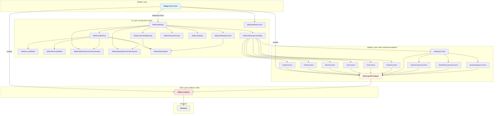


### File Structure

```
packages/@webex/widgets/
├── src/
│   ├── index.js                           # Package exports
│   └── widgets/
│       └── WebexMeetings/
│           ├── WebexMeetings.jsx           # Widget component (main source)
│           ├── WebexMeetings.css            # Widget styles
│           ├── WebexLogo.jsx               # SVG logo component
│           ├── webex-logo.svg              # Logo asset
│           └── README.md                   # Component README
├── tests/
│   ├── WebexMeetings/
│   │   └── WebexMeetings.test.jsx          # Unit tests
│   ├── WebexMeeting.e2e.js                 # E2E tests
│   ├── pages/
│   │   ├── MeetingWidget.page.js           # Page object for E2E
│   │   └── Samples.page.js                # Samples page object
│   └── util.js                            # Test utilities
├── demo/                                   # Demo app
├── ai-docs/
│   ├── AGENTS.md                          # Usage, API, examples
│   └── ARCHITECTURE.md                    # This file
├── jest.config.js                          # Jest configuration
└── package.json                            # Package manifest
```

### Component Table

**Source:** All components below are from `[@webex/components](https://github.com/webex/components)` → `[src/components/](https://github.com/webex/components/tree/master/src/components)`


| Component                         | Folder                             | Purpose                                                                     | Render Condition (parent decides)                                                        | Internal Data Source (own hooks)                                                                                                                                           |
| --------------------------------- | ---------------------------------- | --------------------------------------------------------------------------- | ---------------------------------------------------------------------------------------- | -------------------------------------------------------------------------------------------------------------------------------------------------------------------------- |
| `WebexMeeting`                    | `WebexMeeting/`                    | Master orchestrator — renders correct view based on meeting state           | Always (top-level)                                                                       | `useMeeting(meetingID)` → `ID`, `localAudio`, `localVideo`, `state`, `showRoster`, `settings`, `passwordRequired`                                                          |
| `WebexInterstitialMeeting`        | `WebexInterstitialMeeting/`        | Pre-join lobby with local media preview                                     | `state === NOT_JOINED`                                                                   | `useMeeting(meetingID)` → `localVideo`                                                                                                                                     |
| `WebexInMeeting`                  | `WebexInMeeting/`                  | Active meeting view with remote + local media                               | `state === JOINED`                                                                       | `useMeeting(meetingID)` → `remoteShare`, `localShare`, `passwordRequired`, `state`                                                                                         |
| `WebexWaitingForHost`             | `WebexWaitingForHost/`             | Waiting room when host hasn't started (renders for `LOBBY` state)           | `else` (not JOINED/NOT_JOINED/LEFT — typically `LOBBY`)                                  | `useMeeting(meetingID)` → `ID`; uses `AdapterContext` → `leaveMeeting(ID)`                                                                                                 |
| `WebexMeetingControlBar`          | `WebexMeetingControlBar/`          | Renders meeting control buttons                                             | Always (when state is truthy and not LEFT)                                               | `useMeeting(meetingID)` → `state`; computes `isActive = state === JOINED` to select controls                                                                               |
| `WebexMeetingControl`             | `WebexMeetingControl/`             | Individual control button                                                   | Rendered by `WebexMeetingControlBar`                                                     | `useMeetingControl(type, meetingID)` → `[action, display]`                                                                                                                 |
| `WebexMeetingInfo`                | `WebexMeetingInfo/`                | Meeting title and time overlay                                              | Rendered inside `WebexInMeeting`, `WebexInterstitialMeeting`, `WebexWaitingForHost`      | `useMeeting(meetingID)` → `ID`, `startTime`, `endTime`, `title`                                                                                                            |
| `WebexMediaAccess`                | `WebexMediaAccess/`                | Browser media permission prompt (camera/microphone)                         | `localAudio.permission === 'ASKING'` or `localVideo.permission === 'ASKING'` (in widget) | `useMeeting(meetingID)` → `ID`; uses `AdapterContext` → `ignoreVideoAccessPrompt` / `ignoreAudioAccessPrompt`                                                              |
| `WebexLocalMedia`                 | `WebexLocalMedia/`                 | Local camera/screen/preview video                                           | Rendered inside `WebexInMeeting`, `WebexInterstitialMeeting`, `WebexWaitingForHost`      | `useMeeting(meetingID)` → `localVideo`, `localShare`, `settings`; also `useMe()` → `ID`                                                                                    |
| `WebexRemoteMedia`                | `WebexRemoteMedia/`                | Remote participant video, audio, and share                                  | Rendered inside `WebexInMeeting`                                                         | `useMeeting(meetingID)` → `remoteAudio`, `remoteVideo`, `remoteShare`, `error`, `speakerID`; also `useMembers()`                                                           |
| `WebexMemberRoster`               | `WebexMemberRoster/`               | Participant list panel                                                      | `showRoster === true` (in `WebexMeeting`)                                                | `useMembers(destinationID, destinationType)`; `useMe()` → `orgID`. Does NOT use `useMeeting`                                                                               |
| `WebexSettings`                   | `WebexSettings/`                   | Audio/video device settings modal (tabs)                                    | `settings.visible === true` (in `WebexMeeting`)                                          | None — delegates to `WebexAudioSettings` + `WebexVideoSettings` children                                                                                                   |
| `WebexMeetingGuestAuthentication` | `WebexMeetingGuestAuthentication/` | Guest password entry (rendered in both `WebexMeeting` and `WebexInMeeting`) | `passwordRequired && !meetingPasswordOrPin && state === NOT_JOINED`                      | `useMeeting(meetingID)` → `ID`, `failureReason`, `invalidPassword`, `requiredCaptcha`; uses `AdapterContext` → `joinMeeting`, `clearInvalidPasswordFlag`, `refreshCaptcha` |
| `WebexMeetingHostAuthentication`  | `WebexMeetingHostAuthentication/`  | Host pin entry (rendered in both `WebexMeeting` and `WebexInMeeting`)       | User clicks "I'm the host" in guest modal                                                | `useMeeting(meetingID)` → `ID`, `invalidHostKey`; uses `AdapterContext` → `joinMeeting`, `clearInvalidHostKeyFlag`                                                         |


---

## SDK Integration

**Repos:** [webex-js-sdk](https://github.com/webex/webex-js-sdk) · `[@webex/sdk-component-adapter](https://github.com/webex/sdk-component-adapter)` → `[src/MeetingsSDKAdapter.js](https://github.com/webex/sdk-component-adapter/blob/master/src/MeetingsSDKAdapter.js)`, `[src/MeetingsSDKAdapter/controls/](https://github.com/webex/sdk-component-adapter/tree/master/src/MeetingsSDKAdapter/controls)`


| Area              | SDK Methods                                                                  | Adapter Methods                                                                   | Control Class             |
| ----------------- | ---------------------------------------------------------------------------- | --------------------------------------------------------------------------------- | ------------------------- |
| Initialization    | `new Webex()`, `device.register()`, `mercury.connect()`                      | `sdkAdapter.connect()` → calls `meetings.register()` + `syncMeetings()`           | —                         |
| Meeting creation  | `webex.meetings.create(destination)`                                         | `adapter.meetingsAdapter.createMeeting(dest)`                                     | —                         |
| Join              | `sdkMeeting.verifyPassword()`, `sdkMeeting.join({ pin, moderator, alias })`  | `adapter.meetingsAdapter.joinMeeting(ID, options)`                                | `JoinControl`             |
| Leave             | `sdkMeeting.leave()`                                                         | `adapter.meetingsAdapter.leaveMeeting(ID)` (also calls `removeMedia`)             | `ExitControl`             |
| Mute/Unmute Audio | `sdkMeeting.muteAudio()`, `sdkMeeting.unmuteAudio()`                         | `adapter.meetingsAdapter.handleLocalAudio(ID)`                                    | `AudioControl`            |
| Mute/Unmute Video | `sdkMeeting.muteVideo()`, `sdkMeeting.unmuteVideo()`                         | `adapter.meetingsAdapter.handleLocalVideo(ID)`                                    | `VideoControl`            |
| Screen Share      | `sdkMeeting.getMediaStreams()`, `sdkMeeting.updateShare()` *                 | `adapter.meetingsAdapter.handleLocalShare(ID)`                                    | `ShareControl`            |
| Toggle Roster     | — (client-side)                                                              | `adapter.meetingsAdapter.toggleRoster(ID)`                                        | `RosterControl`           |
| Toggle Settings   | `sdkMeeting.updateVideo()`, `sdkMeeting.updateAudio()` (on close, if joined) | `adapter.meetingsAdapter.toggleSettings(ID)`                                      | `SettingsControl`         |
| Switch Camera     | `sdkMeeting.getMediaStreams()` *                                             | `adapter.switchCamera(ID, cameraID)`                                              | `SwitchCameraControl`     |
| Switch Microphone | `sdkMeeting.getMediaStreams()` *                                             | `adapter.switchMicrophone(ID, microphoneID)`                                      | `SwitchMicrophoneControl` |
| Switch Speaker    | — (client-side, updates meeting state only)                                  | `adapter.switchSpeaker(ID, speakerID)`                                            | `SwitchSpeakerControl`    |
| Cleanup           | `meetings.unregister()`, `mercury.disconnect()`, `device.unregister()`       | `sdkAdapter.disconnect()` → calls `meetingsAdapter.disconnect()` then SDK cleanup | —                         |


** `getMediaStreams()` and `updateShare()` are the SDK methods invoked by the adapter source code. In newer SDK versions, equivalent functionality is provided by `media.getUserMedia()`, `addMedia()`, `publishStreams()`, and `updateMedia()`.*

---

## Data Flow

### Outbound (User Action → Backend)

```
User clicks control button
  → Component (WebexMeetingControl)
    → useMeetingControl hook
      → Control.action({ meetingID })
        → sdk-component-adapter method
          → webex-js-sdk meeting method
            → Backend (REST/WebSocket)
```

### Inbound (Backend → UI Update)

```
Backend processes request
  → WebSocket event delivered to webex-js-sdk
    → sdk-component-adapter detects change
      → RxJS BehaviorSubject emits new meeting state
        → useMeeting hook receives update
          → Component re-renders
```

---

## Adapter Meeting Object (from `createMeeting` + runtime updates)

This is the real shape emitted by `adapter.meetingsAdapter.getMeeting(ID)`:

```
{
  ID:                  string
  title:               string
  state:               'NOT_JOINED' | 'LOBBY' | 'JOINED' | 'LEFT'

  localAudio: {
    stream:            MediaStream | null
    permission:        string | null          // 'ASKING' | 'ALLOWED' | 'DISMISSED' | 'DENIED' | 'DISABLED' | 'IGNORED' | 'ERROR' | null
    muting:            boolean | undefined    // true = muting in progress, false = unmuting, undefined = idle
    ignoreMediaAccessPrompt: Function | undefined  // callback to dismiss the media access prompt and proceed without audio
  }
  localVideo: {
    stream:            MediaStream | null
    permission:        string | null          // 'ASKING' | 'ALLOWED' | 'DISMISSED' | 'DENIED' | 'DISABLED' | 'IGNORED' | 'ERROR' | null
    muting:            boolean | undefined
    error:             string | null          // e.g. 'Video not supported on iOS 15.1'
    ignoreMediaAccessPrompt: Function | undefined  // callback to dismiss the media access prompt and proceed without video
  }
  localShare: {
    stream:            MediaStream | null
  }

  remoteAudio:         MediaStream | null
  remoteVideo:         MediaStream | null
  remoteShare:         MediaStream | null

  disabledLocalAudio:  MediaStream | null     // stores the stream when audio is muted
  disabledLocalVideo:  MediaStream | null     // stores the stream when video is muted

  showRoster:          boolean | null
  settings: {
    visible:           boolean
    preview: {
      audio:           MediaStream | null
      video:           MediaStream | null
    }
  }

  passwordRequired:    boolean
  requiredCaptcha:     object
  remoteShareStream:   MediaStream | null     // raw remote share stream (may differ from remoteShare timing)
  remoteSharing:       boolean                // true when remote participant is sharing

  invalidPassword:     boolean                // true when entered password was wrong
  invalidHostKey:      boolean                // true when entered host key was wrong
  failureReason:       string | undefined     // reason from server when password verification fails

  cameraID:            string | null
  microphoneID:        string | null
  speakerID:           string | null          // '' on creation, null after removeMedia
}
```

---

## Event Flows

### 1. SDK Initialization

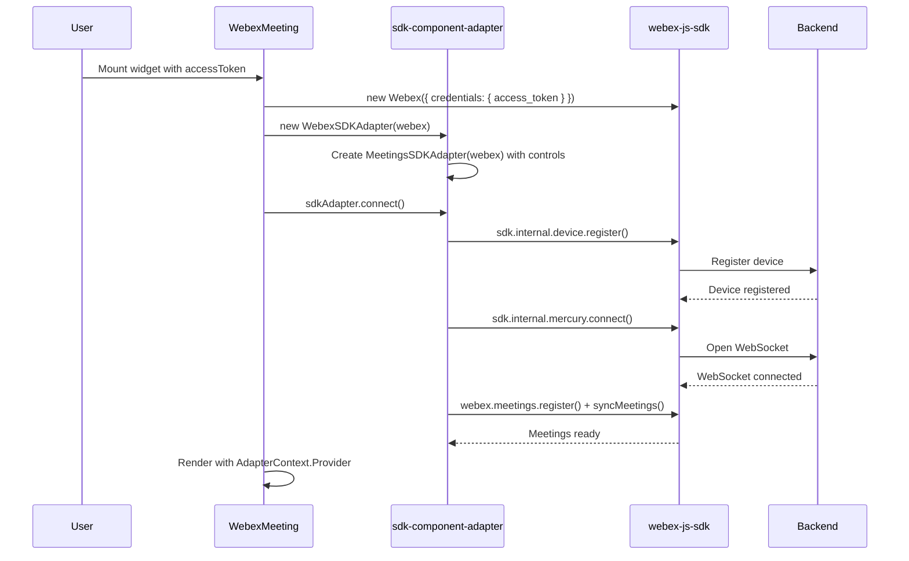


---

### 2. Meeting Creation & Interstitial

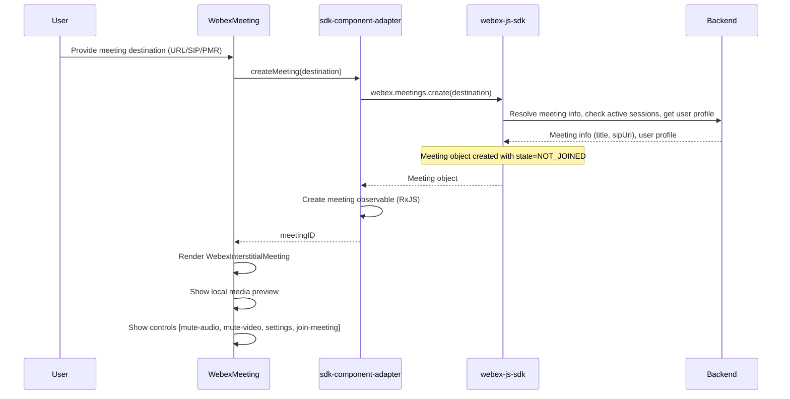


---

### 3. Join Meeting

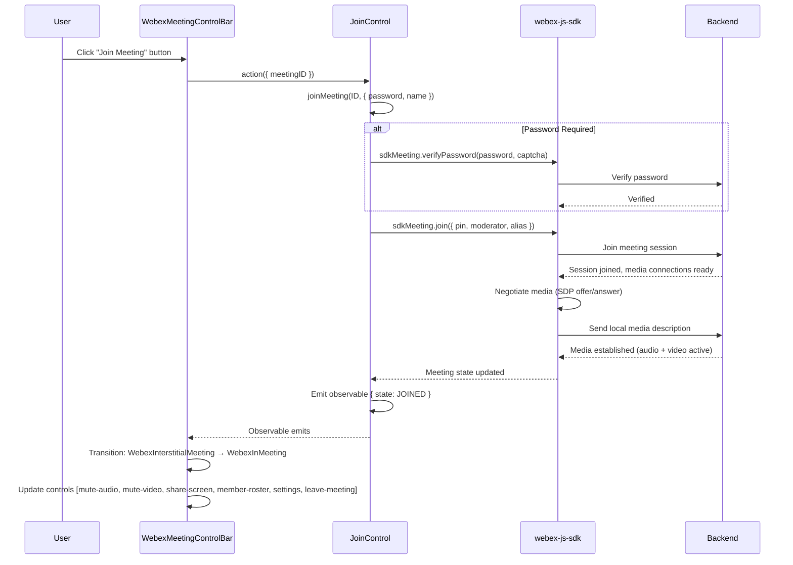


---

### 4. Mute / Unmute Audio

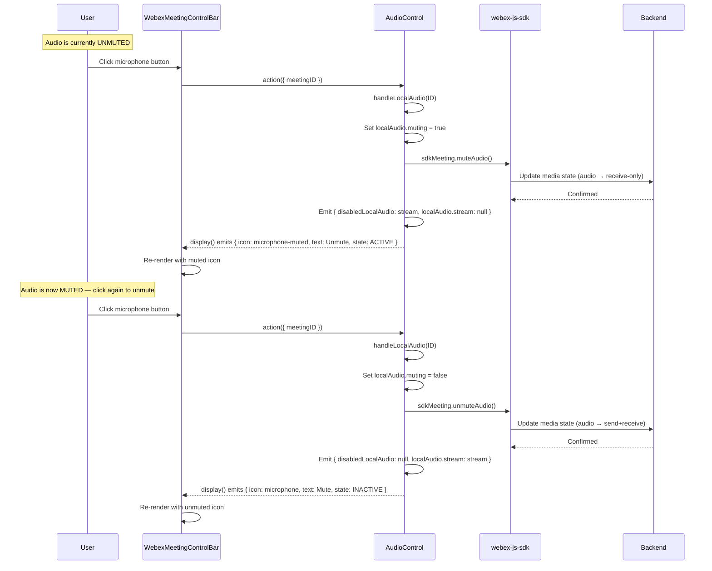


---

### 5. Start / Stop Video

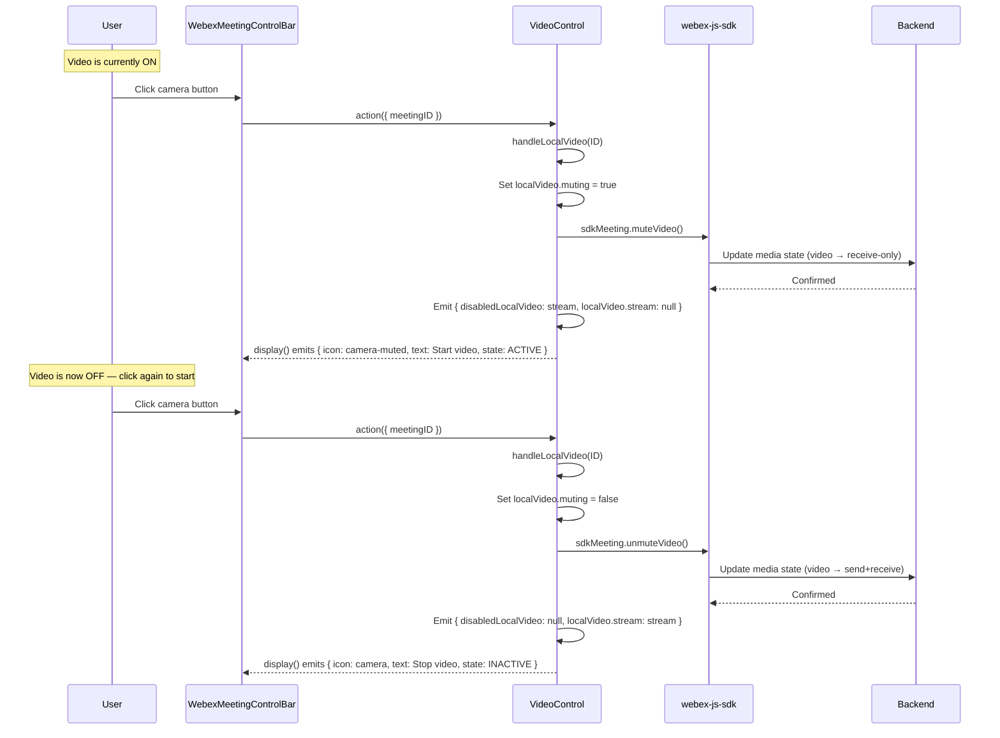


---

### 6. Start / Stop Screen Share

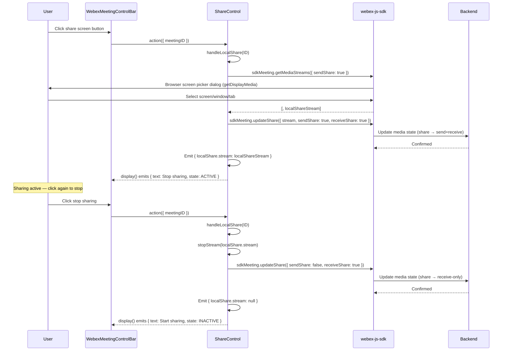


---

### 7. Toggle Member Roster

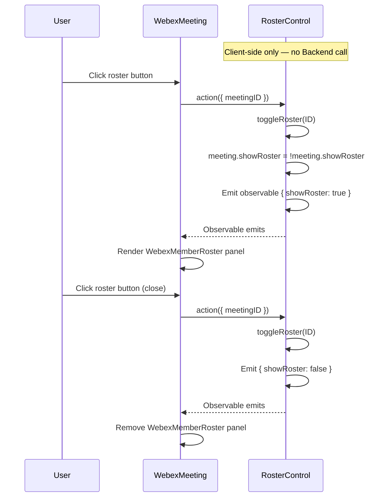


---

### 8. Toggle Settings & Switch Camera

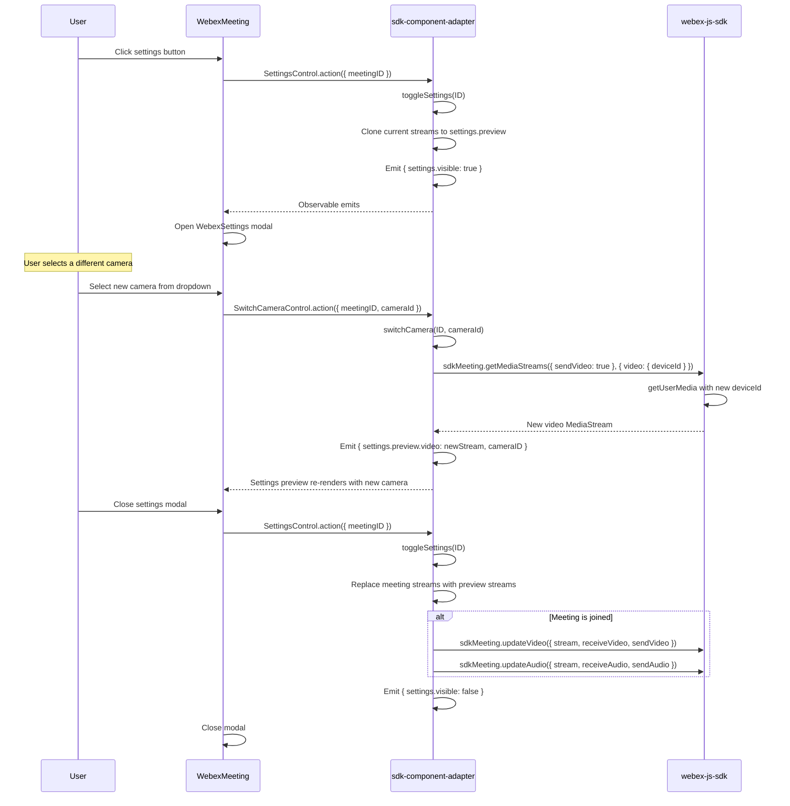


---

### 9. Leave Meeting

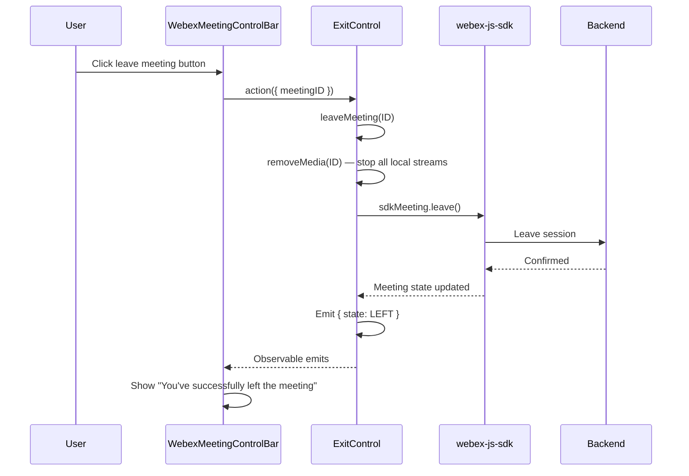


---

### 10. Guest/Host Authentication

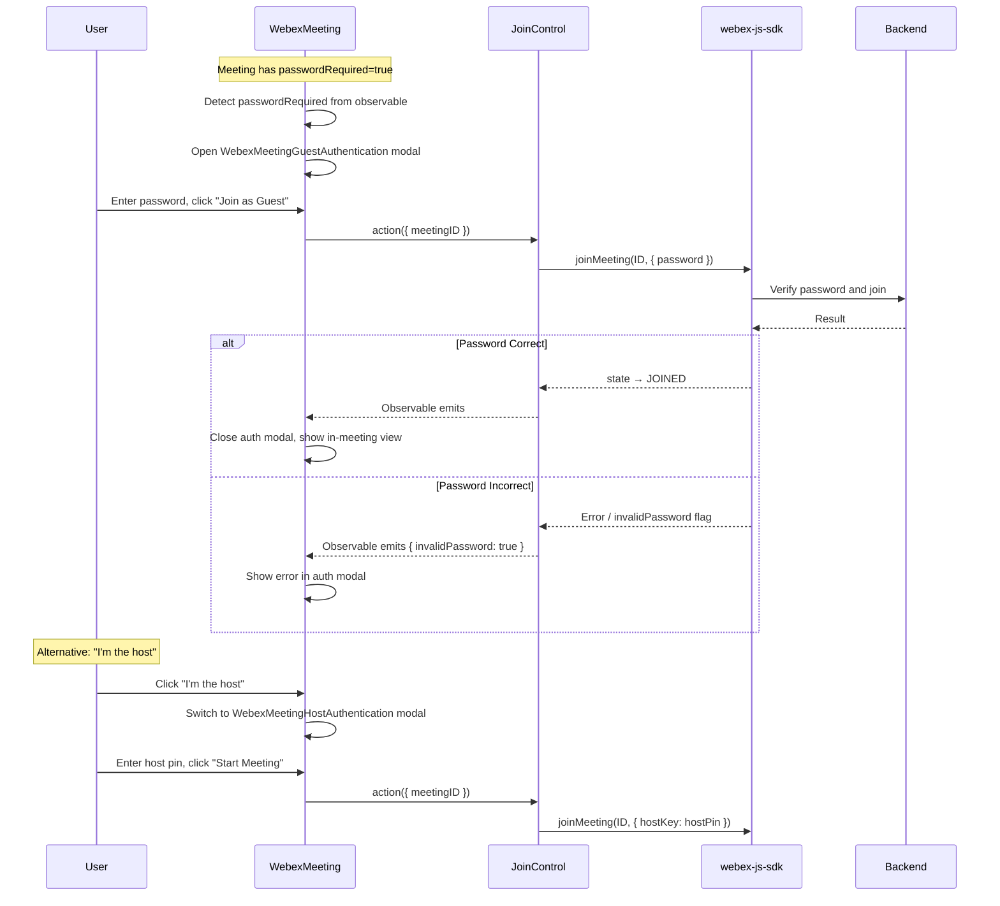


---

### 11. Waiting for Host (LOBBY State)

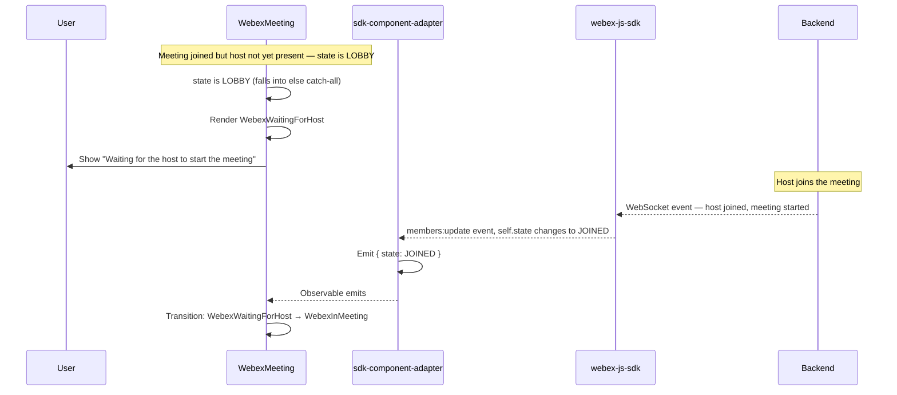

*The `LOBBY` state is defined in `MeetingState` from `@webex/component-adapter-interfaces`. The adapter propagates `sdkMeeting.joinedWith.state` directly from SDK member updates, so when the SDK reports `LOBBY` (e.g., in waiting-room flows), it reaches the UI unfiltered. The `WebexMeeting` component renders `WebexWaitingForHost` for any state that is not `NOT_JOINED`, `JOINED`, or `LEFT` — which is where `LOBBY` lands.*


---

## Meeting State Machine

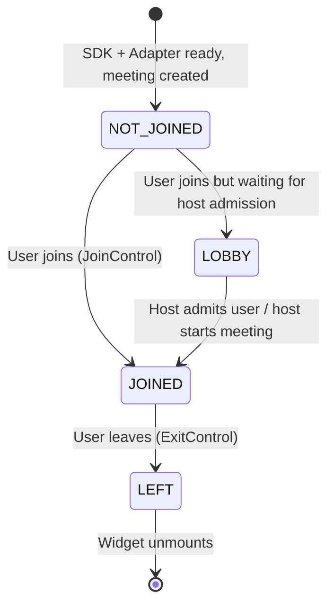


*These are the four states defined by the `MeetingState` enum in `@webex/component-adapter-interfaces` and emitted by the adapter's meeting observable. The adapter propagates `self.state` from SDK member updates without filtering, so all four values (`NOT_JOINED`, `LOBBY`, `JOINED`, `LEFT`) can appear. The `WebexMeeting` component also handles a falsy state (loading) and uses an `else` catch-all that renders `WebexWaitingForHost` — this is where the `LOBBY` state lands.*

---

## Control Display States

**Source:** [`@webex/sdk-component-adapter`](https://github.com/webex/sdk-component-adapter) → [`src/MeetingsSDKAdapter/controls/`](https://github.com/webex/sdk-component-adapter/tree/master/src/MeetingsSDKAdapter/controls)

### AudioControl


| State        | Icon               | Text          | Tooltip                 | Control State |
| ------------ | ------------------ | ------------- | ----------------------- | ------------- |
| unmuted      | `microphone`       | Mute          | Mute audio              | INACTIVE      |
| muted        | `microphone-muted` | Unmute        | Unmute audio            | ACTIVE        |
| muting       | `microphone`       | Muting...     | Muting audio            | DISABLED      |
| unmuting     | `microphone-muted` | Unmuting...   | Unmuting audio          | DISABLED      |
| noMicrophone | `microphone-muted` | No microphone | No microphone available | DISABLED      |


### VideoControl


| State    | Icon           | Text        | Tooltip               | Control State |
| -------- | -------------- | ----------- | --------------------- | ------------- |
| unmuted  | `camera`       | Stop video  | Stop video            | INACTIVE      |
| muted    | `camera-muted` | Start video | Start video           | ACTIVE        |
| muting   | `camera`       | Stopping... | Stopping video        | DISABLED      |
| unmuting | `camera-muted` | Starting... | Starting video        | DISABLED      |
| noCamera | `camera-muted` | No camera   | No camera available * | DISABLED      |


 *If `localVideo.error` is set (e.g. `'Video not supported on iOS 15.1'`), the tooltip shows the error string instead of "No camera available".*

### ShareControl


| State        | Icon                           | Text          | Tooltip                    | Control State | Type   |
| ------------ | ------------------------------ | ------------- | -------------------------- | ------------- | ------ |
| inactive     | `share-screen-presence-stroke` | Start sharing | Start sharing content      | INACTIVE      | TOGGLE |
| active       | `share-screen-presence-stroke` | Stop sharing  | Stop sharing content       | ACTIVE        | TOGGLE |
| notSupported | `share-screen-presence-stroke` | Start sharing | Share screen not supported | DISABLED      | TOGGLE |


### JoinControl


| Text         | Tooltip      | Hint                            | Control State                     | Type |
| ------------ | ------------ | ------------------------------- | --------------------------------- | ---- |
| Join meeting | Join meeting | {Muted/Unmuted}, {video on/off} | ACTIVE (if NOT_JOINED) / DISABLED | JOIN |


### ExitControl

Renders as a CANCEL type button.

---

## Troubleshooting Guide

### 1. Widget Stuck on Loading

**Symptoms:** Loading state never resolves, no meeting UI appears

**Possible Causes:**

- Invalid or expired access token
- Network connectivity to backend
- Device registration failure

**Solutions:**

- Verify the access token is valid and not expired
- Check network connectivity (browser dev tools network tab)
- Check browser console for SDK error messages

---

### 2. Audio/Video Not Working After Join

**Symptoms:** Joined meeting but no audio/video, controls show "No camera" or "No microphone"

**Possible Causes:**

- Browser denied `getUserMedia` permissions
- Media negotiation (SDP/ROAP) failed
- Media server unreachable

**Solutions:**

- Check browser permission prompts for camera/microphone
- Verify `getUserMedia` works in browser console
- Check for errors in SDK logs

---

### 3. Screen Share Not Available

**Symptoms:** Share button disabled, shows "Share screen not supported"

**Possible Causes:**

- Browser doesn't support `getDisplayMedia`
- Running over HTTP instead of HTTPS
- `navigator.mediaDevices.getDisplayMedia` is undefined

**Solutions:**

- Verify HTTPS is being used
- Check browser compatibility
- `ShareControl` checks `navigator.mediaDevices.getDisplayMedia` availability before enabling

---

### 4. Meeting State Not Updating

**Symptoms:** UI doesn't change after control actions

**Possible Causes:**

- WebSocket connection dropped
- Observable subscription lost
- Adapter not emitting updates

**Solutions:**

- Check WebSocket status in network tab
- Verify the observable subscription is active
- Look for WebSocket events in the network inspector

---

### 5. Multiple Meeting Instances Created

**Symptoms:** Widget creates duplicate meetings or SDK instances

**Important:** SDK initialization (`new Webex()`, `new WebexSDKAdapter()`) and meeting creation do **not** happen in `WebexMeetingsWidget`'s lifecycle methods. They happen in the `withAdapter` and `withMeeting` HOC wrappers from `@webex/components` (see `src/widgets/WebexMeetings/WebexMeetings.jsx:259-278`). The widget class's own `componentDidMount`/`componentWillUnmount` only manages focus and accessibility wiring — patching those will not fix duplicate initialization.

**Possible Causes:**

- React strict mode causing `withAdapter`/`withMeeting` HOCs to mount twice
- Consumer re-rendering the widget with a new `accessToken` or `meetingDestination` prop, triggering the adapter factory again
- Missing cleanup in the HOC layer on unmount

**Solutions:**

- Investigate the `withAdapter` HOC in `@webex/components` — that is where `adapter.connect()`/`adapter.disconnect()` is managed
- Investigate the `withMeeting` HOC — that is where `createMeeting(destination)` is called
- Ensure the consumer does not remount `WebexMeetingsWidget` unnecessarily (e.g., by changing a React `key` prop)
- For React strict mode issues, the fix must be in the HOC layer (in `@webex/components`), not in this widget class

---

### 6. SettingsControl Display State Never Toggles

**Symptoms:** Settings button always shows INACTIVE state even after opening settings

**Root Cause:** This is a known inconsistency in `sdk-component-adapter`. `SettingsControl.display()` reads `showSettings` from the meeting object, but `MeetingsSDKAdapter.toggleSettings()` writes to `settings.visible`. The `showSettings` property is never set by the adapter, so `display()` always sees `undefined` (falsy) and emits INACTIVE.

**Impact:** The settings button icon/text never toggles visually, but the settings modal still opens/closes because `WebexSettings` in `@webex/components` reads `settings.visible` directly.

**Workaround:** None needed for functionality — the modal works. The display state is cosmetic only.

---

### 7. AdapterContext Not Provided

**Symptoms:** Components crash with "Cannot read property of undefined"

**Possible Causes:**

- `AdapterContext.Provider` not wrapping `WebexMeeting`
- Adapter not yet initialized when components render

**Solutions:**

- Ensure `<AdapterContext.Provider value={adapter}>` wraps all components
- Wait for adapter to be ready before rendering

---

## Related Documentation

- [Agent Documentation](./AGENTS.md) - Widget usage and API reference
- [React Patterns](../../../../ai-docs/patterns/react-patterns.md) - Component patterns
- [TypeScript Patterns](../../../../ai-docs/patterns/typescript-patterns.md) - Type safety and naming conventions
- [Testing Patterns](../../../../ai-docs/patterns/testing-patterns.md) - Jest, RTL, Playwright guidelines

---

*Last Updated: 2026-03-27*