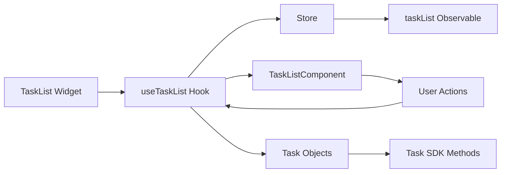
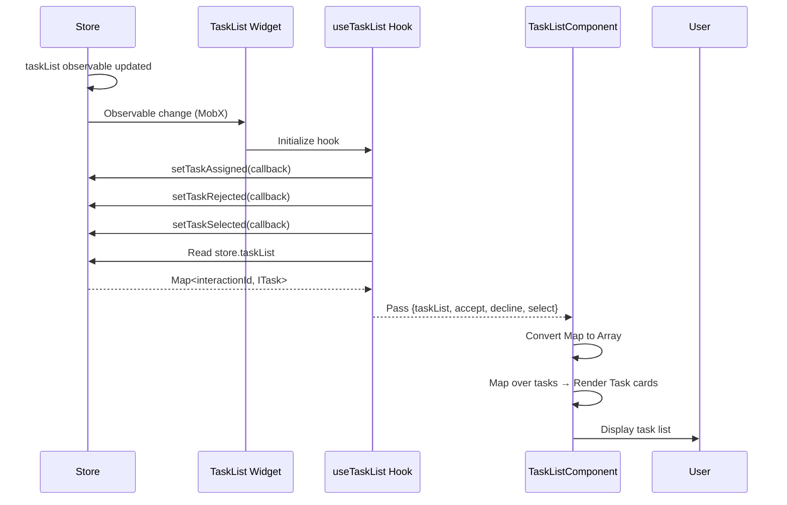
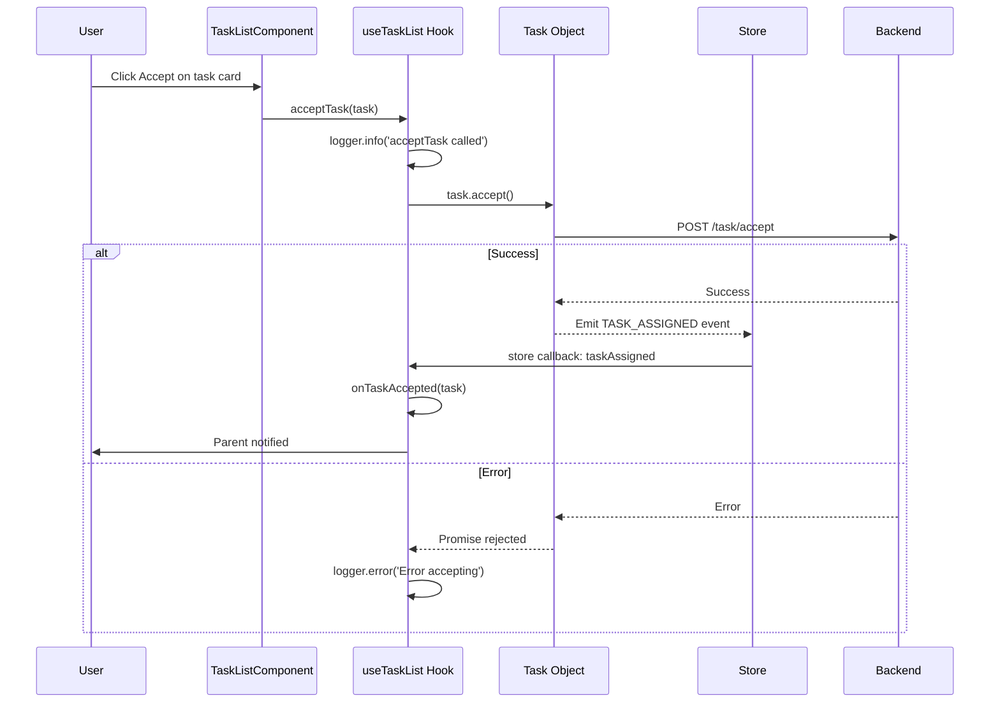
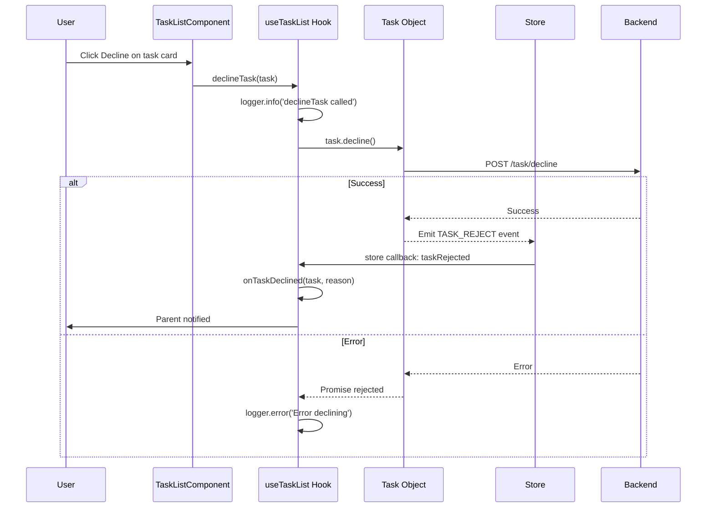
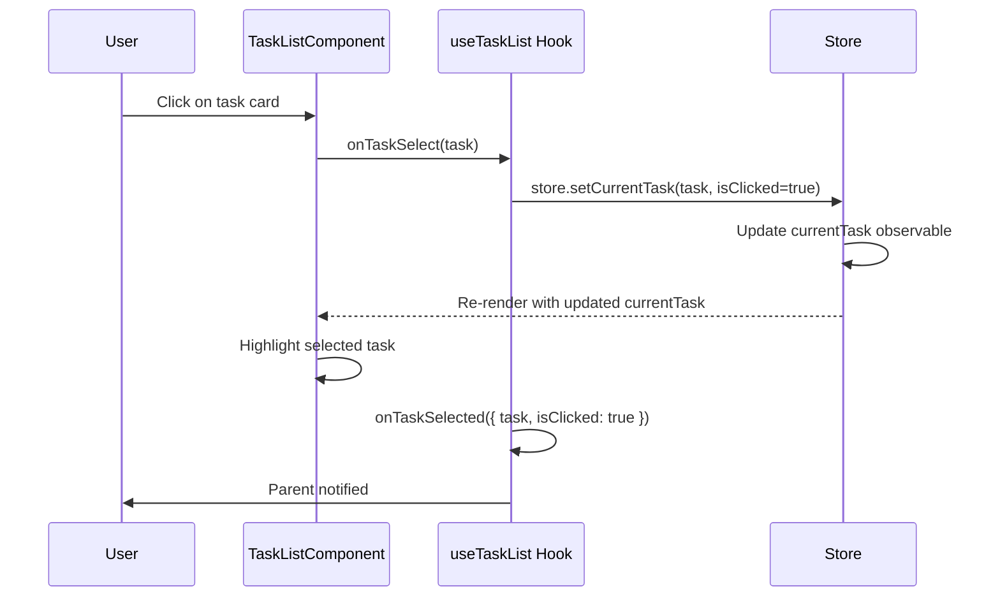

# TaskList Widget - Architecture

## Component Overview

| Layer | File | Purpose | Key Responsibilities |
|-------|------|---------|---------------------|
| **Widget** | `src/TaskList/index.tsx` | Smart container | - Observer HOC<br>- Error boundary<br>- Delegates to hook<br>- Props: callbacks |
| **Hook** | `src/helper.ts` (useTaskList) | Business logic | - Task event subscriptions<br>- Accept/decline/select handlers<br>- Callback management |
| **Component** | `@webex/cc-components` (TaskListComponent) | Presentation | - Task list UI<br>- Task cards<br>- Accept/decline buttons<br>- Selection highlighting |
| **Store** | `@webex/cc-store` | State/SDK | - taskList observable<br>- currentTask observable<br>- Task event callbacks<br>- setCurrentTask() |

## File Structure

```
task/src/
├── TaskList/
│   └── index.tsx              # Widget (observer + ErrorBoundary)
├── helper.ts                   # useTaskList hook (lines 20-136)
├── task.types.ts               # UseTaskListProps, TaskListProps
└── index.ts                    # Exports

cc-components/src/components/task/TaskList/
├── task-list.tsx               # TaskListComponent
├── task-list.utils.ts          # Utility functions
└── styles.scss                 # Styles
```

## Data Flows

### Overview



### Hook: useTaskList

**Inputs:**
- `cc` - SDK instance
- `taskList` - Map<string, ITask> from store
- `deviceType` - 'BROWSER' | 'EXTENSION' | 'AGENT_DN'
- `onTaskAccepted` - Callback when task accepted
- `onTaskDeclined` - Callback when task declined
- `onTaskSelected` - Callback when task selected
- `logger` - Logger instance

**Subscribes to Store Callbacks:**
- `store.setTaskAssigned(callback)` - Task accepted
- `store.setTaskRejected(callback, reason)` - Task rejected
- `store.setTaskSelected(callback)` - Task selected

**Returns:**
- `taskList` - Map of all active tasks
- `acceptTask(task)` - Accept task handler
- `declineTask(task)` - Decline task handler
- `onTaskSelect(task)` - Select task handler
- `isBrowser` - Boolean flag

## Sequence Diagrams

### Initial Load & Display Tasks



### Accept Task from List



### Decline Task from List



### Select Task (Switch Focus)



## Store Callbacks

**Set in Hook (one-time):**
1. `setTaskAssigned(callback)` - Triggered when task accepted
2. `setTaskRejected(callback)` - Triggered when task rejected
3. `setTaskSelected(callback)` - Triggered when task selected

**Callbacks persist:** Unlike task-specific subscriptions, these are widget-level callbacks that handle all tasks.

## Error Handling

| Error | Source | Handled By | Action |
|-------|--------|------------|--------|
| Task accept failed | Task SDK | Hook catch block | Log error via logger |
| Task decline failed | Task SDK | Hook catch block | Log error via logger |
| Callback execution error | Hook | try/catch in callback | Log error, continue |
| Component crash | React | ErrorBoundary | Call store.onErrorCallback |
| Empty task list | Component | Early return | Render nothing |

## Troubleshooting

### Issue: No tasks displayed

**Possible Causes:**
1. store.taskList is empty
2. No tasks assigned to agent
3. Task list observable not updating

**Solution:**
- Check `store.taskList` in console
- Verify tasks exist: `store.taskList.size`
- Check task events are being received

### Issue: Accept button doesn't work

**Possible Causes:**
1. Task already accepted
2. Browser mode restrictions (isBrowser flag)
3. SDK error

**Solution:**
- Check task state
- Check `deviceType` value
- Check console for "Error accepting task" logs

### Issue: Task selection doesn't highlight

**Possible Causes:**
1. onTaskSelect not calling store.setCurrentTask
2. currentTask observable not updating
3. CSS styling issue

**Solution:**
- Check `store.currentTask` after clicking
- Verify `isCurrentTaskSelected` utility returns true
- Check `.selected` class applied to task card

### Issue: Callbacks not firing

**Possible Causes:**
1. Callbacks not provided as props
2. Store callback registration failed
3. Event not emitted by backend

**Solution:**
- Verify callbacks passed to widget
- Check console for callback registration logs
- Monitor network tab for task events

## Performance Considerations

- **Observable Updates:** TaskList only re-renders when store.taskList or store.currentTask changes
- **Map to Array Conversion:** Done on every render, but taskList is typically small (<10 tasks)
- **No Polling:** Event-driven updates via MobX observables
- **Task Event Cleanup:** Not needed (callbacks are widget-level, not task-specific)

## Testing

### Unit Tests

**Widget Tests** (`tests/TaskList/index.tsx`):
- Renders without crashing
- Passes props to hook correctly
- Error boundary catches errors

**Hook Tests** (`tests/helper.ts`):
- acceptTask() calls task.accept()
- declineTask() calls task.decline()
- onTaskSelect() calls store.setCurrentTask()
- Store callbacks registered on mount
- Callbacks fire correctly

**Component Tests** (`cc-components tests`):
- Displays all tasks in list
- Accept button calls acceptTask handler
- Decline button calls declineTask handler
- Clicking task calls onTaskSelect
- Selected task is highlighted

### E2E Tests

- Multi-session → Multiple tasks in list → Accept one → Task removed from pending
- Task list → Select task → Call controls show for selected task
- Task list → Decline task → Task removed

