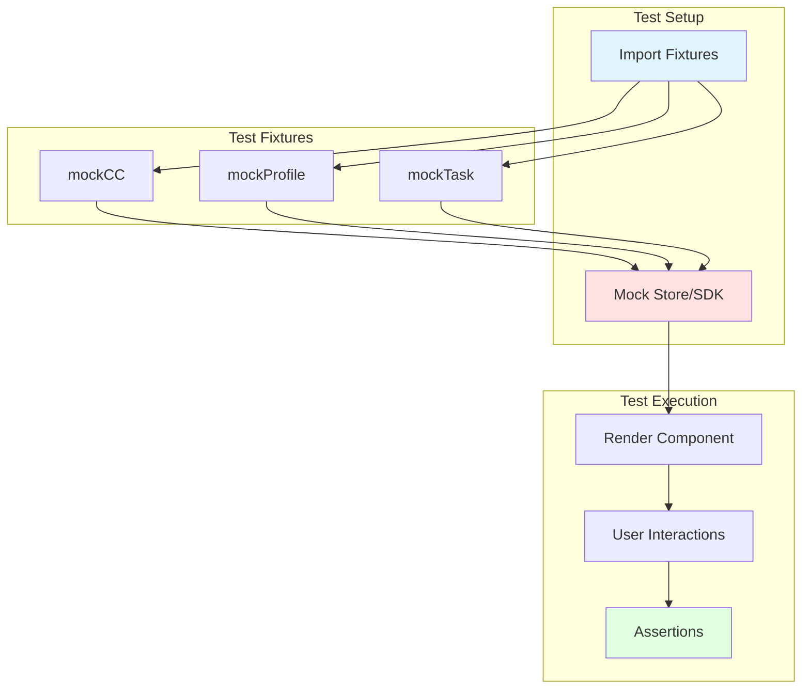

# Test Fixtures - Architecture

## Component Overview

Test Fixtures is a testing utility package that provides realistic mock data for all contact center SDK types and widgets. It follows a fixture pattern where each fixture is a pre-configured, reusable mock object that matches the actual SDK types.

### Fixture Table

| Fixture | Type | File | Key Properties | Customizable |
|---------|------|------|----------------|--------------|
| **mockCC** | `IContactCenter` | `src/fixtures.ts` | All SDK methods (stationLogin, stationLogout, setUserState, etc.) | Via jest mocking |
| **mockProfile** | `Profile` | `src/fixtures.ts` | teams, idleCodes, wrapupCodes, agentId, loginVoiceOptions | Via object spread |
| **mockTask** | `ITask` | `src/fixtures.ts` | data (interactionId, origin, destination), hold(), resume(), wrapup(), end() | Via jest mocking |
| **mockQueueDetails** | `QueueDetails[]` | `src/fixtures.ts` | Queue list for transfers | Via array modification |
| **mockAgents** | `Agent[]` | `src/fixtures.ts` | Buddy agent list | Via array modification |
| **mockEntryPointsResponse** | `EntryPointListResponse` | `src/fixtures.ts` | Entry points for outdial | Via object spread |
| **mockAddressBookEntriesResponse** | `AddressBookEntriesResponse` | `src/fixtures.ts` | Address book contacts | Via object spread |
| **makeMockAddressBook** | `Function` | `src/fixtures.ts` | Factory for custom address book | Via function parameter |
| **mockIncomingTaskData** | `object` | `src/incomingTaskFixtures.ts` | webRTC, extension, social, chat (ani, customerName, mediaType, acceptText, etc.) | Via object key access |
| **mockTaskData** | `object` | `src/taskListFixtures.ts` | active, incoming, action, selection (task list UI data by scenario) | Via object key access |
| **mockOutdialCallProps** | `object` | `src/components/task/outdialCallFixtures.ts` | mockCC + startOutdial, getOutdialANIEntries | Via jest mocking |
| **mockAniEntries** | `object[]` | `src/components/task/outdialCallFixtures.ts` | ANI entries (organizationId, id, name, number) | Via array modification |
| **mockCCWithAni** | `IContactCenter` | `src/components/task/outdialCallFixtures.ts` | mockCC + agentConfig.outdialANIId, getOutdialAniEntries | Via object spread / jest |

### File Structure

```
test-fixtures/
├── src/
│   ├── index.ts                          # Package exports (fixtures, incomingTaskFixtures, taskListFixtures, outdialCallFixtures)
│   ├── fixtures.ts                       # Core SDK fixtures (mockCC, mockProfile, mockTask, etc.)
│   ├── incomingTaskFixtures.ts           # Incoming task UI data (mockIncomingTaskData)
│   ├── taskListFixtures.ts               # Task list UI data by scenario (mockTaskData)
│   └── components/
│       └── task/
│           └── outdialCallFixtures.ts    # Outdial call props and ANI fixtures (mockOutdialCallProps, mockAniEntries, mockCCWithAni)
├── dist/
│   ├── index.js                          # Build output
│   └── types/
│       ├── index.d.ts
│       ├── fixtures.d.ts
│       ├── incomingTaskFixtures.d.ts
│       ├── taskListFixtures.d.ts
│       └── components/
│           └── task/
│               └── outdialCallFixtures.d.ts
├── package.json
├── tsconfig.json
└── webpack.config.js
└── babel.config.js
```

---

## Fixture Structure

### mockCC (IContactCenter)

Complete SDK mock with all methods as jest functions:

```typescript
const mockCC: IContactCenter = {
  // Core methods
  stationLogin: jest.fn(),
  stationLogout: jest.fn(),
  setUserState: jest.fn(),
  
  // Task methods
  accept: jest.fn(),
  end: jest.fn(),
  hold: jest.fn(),
  resume: jest.fn(),
  wrapup: jest.fn(),
  
  // Transfer/Consult methods
  consult: jest.fn(),
  transfer: jest.fn(),
  cancelConsult: jest.fn(),
  completeConsult: jest.fn(),
  
  // Recording methods
  pauseRecording: jest.fn(),
  resumeRecording: jest.fn(),
  
  // Outdial
  outdial: jest.fn(),
  
  // Proxies
  AgentProxy: { /* agent-related methods */ },
  DiagnosticsProxy: { /* diagnostics methods */ },
  LoggerProxy: { /* logger methods */ },
  ScreenRecordingProxy: { /* screen recording */ },
  TaskProxy: { /* task subscriptions */ },
  
  // Properties
  version: '1.0.0',
  initialized: true,
};
```

**Usage:**

```typescript
// Basic usage — teamId from mockProfile.teams (shape: { teamId, teamName }), loginOption from loginVoiceOptions (string[])
it('calls stationLogin', async () => {
  const [team] = mockProfile.teams;
  const loginOption = mockProfile.loginVoiceOptions[0];
  await mockCC.stationLogin({ teamId: team.teamId, loginOption, dialNumber: '' });
  expect(mockCC.stationLogin).toHaveBeenCalled();
});

// Custom mock implementation
it('handles login error', async () => {
  mockCC.stationLogin.mockRejectedValue(new Error('Login failed'));
  
  await expect(mockCC.stationLogin({})).rejects.toThrow('Login failed');
});
```

---

### mockProfile (Profile)

Complete agent profile with teams, idle codes, wrapup codes:

```typescript
const mockProfile: Profile = {
  agentId: 'agent1',
  teams: [{ teamId: 'team1', teamName: 'Team 1' }],
  idleCodes: [
    { id: 'code1', name: 'Code 1', isSystem: false, isDefault: false },
  ],
  wrapupCodes: [
    { id: 'wrap1', name: 'Wrap Code 1', isSystem: false, isDefault: false },
  ],
  loginVoiceOptions: ['BROWSER'],
  // ... other profile properties
};
```

**Usage:**

```typescript
// Use as-is
it('renders teams', () => {
  render(<TeamSelector teams={mockProfile.teams} />);
});

// Customize
it('handles single team', () => {
  const singleTeamProfile = {
    ...mockProfile,
    teams: [mockProfile.teams[0]]
  };
  
  render(<TeamSelector teams={singleTeamProfile.teams} />);
});
```

---

### mockTask (ITask)

Active task with telephony interaction:

```typescript
const mockTask: ITask = {
  data: {
    interactionId: 'interaction123',
    taskId: 'task123',
    origin: { type: 'INBOUND', number: '+1234567890', name: 'John Doe' },
    destination: { type: 'AGENT', number: '+0987654321' },
    status: 'CONNECTED',
    mediaType: 'telephony',
    queueId: 'queue1',
    channelType: 'telephony',
    createdTime: Date.now(),
    // ... other task properties
  },
  
  // Methods (jest mocks)
  hold: jest.fn(),
  resume: jest.fn(),
  wrapup: jest.fn(),
  end: jest.fn(),
  transfer: jest.fn(),
  consult: jest.fn(),
  cancelConsult: jest.fn(),
  completeConsult: jest.fn(),
  pauseRecording: jest.fn(),
  resumeRecording: jest.fn(),
};
```

**Usage:**

```typescript
// Use task methods
it('can hold task', async () => {
  mockTask.hold.mockResolvedValue({ success: true });
  
  await mockTask.hold();
  expect(mockTask.hold).toHaveBeenCalled();
});

// Customize task data
it('handles inbound call', () => {
  const inboundTask = {
    ...mockTask,
    data: {
      ...mockTask.data,
      origin: { type: 'INBOUND', number: '+1111111111', name: 'Jane Smith' }
    }
  };
  
  render(<TaskCard task={inboundTask} />);
});
```

---

### mockQueueDetails (QueueDetails[])

List of queue configurations:

```typescript
const mockQueueDetails: QueueDetails[] = [
  {
    id: 'queue1',
    name: 'Queue1',
    statistics: {
      agentsAvailable: 5,
      tasksWaiting: 2,
      // ... other stats
    },
    // ... other queue properties
  },
  {
    id: 'queue2',
    name: 'Queue2',
    statistics: { /* ... */ },
  },
];
```

---

### mockAgents (Agent[])

List of buddy agents:

```typescript
const mockAgents: Agent[] = [
  {
    id: 'agent1',
    name: 'Agent One',
    state: 'Available',
    skills: ['Support', 'Sales'],
    // ... other agent properties
  },
  {
    id: 'agent2',
    name: 'Agent Two',
    state: 'Idle',
    skills: ['Technical'],
  },
];
```

---

### makeMockAddressBook (Factory Function)

Factory function to create custom address book mocks:

```typescript
const makeMockAddressBook = (
  mockGetEntries: jest.Mock = jest.fn()
) => ({
  getEntries: mockGetEntries,
  // ... other address book methods
});
```

**Usage:**

```typescript
it('searches address book', async () => {
  const mockGetEntries = jest.fn().mockResolvedValue({
    data: [
      { id: 'c1', name: 'Contact1', number: '123' },
    ],
    meta: { page: 0, pageSize: 25, totalPages: 1 }
  });

  const addressBook = makeMockAddressBook(mockGetEntries);
  
  const result = await addressBook.getEntries({ search: 'Contact1' });
  
  expect(mockGetEntries).toHaveBeenCalledWith({ search: 'Contact1' });
  expect(result.data).toHaveLength(1);
});
```

---

## Testing Patterns

### Unit Testing Widgets



### Store Mocking Pattern

```typescript
// Mock store with fixtures
jest.mock('@webex/cc-store', () => {
  const { mockCC, mockProfile } = require('@webex/test-fixtures');
  
  return {
    __esModule: true,
    default: {
      cc: mockCC,
      teams: mockProfile.teams,
      idleCodes: mockProfile.idleCodes,
      logger: mockCC.LoggerProxy,
      isAgentLoggedIn: false,
      // Mock methods
      setTeams: jest.fn(),
      setIdleCodes: jest.fn(),
      setIsAgentLoggedIn: jest.fn(),
    }
  };
});
```

### Customization Pattern

```typescript
// Base fixture
import { mockTask } from '@webex/test-fixtures';

// Customize for specific test
const consultingTask = {
  ...mockTask,
  data: {
    ...mockTask.data,
    status: 'CONSULTING',
    consultedAgentId: 'agent2'
  }
};

// Use customized fixture
it('handles consulting state', () => {
  render(<CallControl task={consultingTask} />);
  expect(screen.getByText('Consulting...')).toBeInTheDocument();
});
```

---

## Fixture Coverage

### SDK Coverage

| SDK Feature | Mock Provided | Customizable |
|-------------|---------------|--------------|
| Station Login/Logout | ✅ `mockCC.stationLogin`, `mockCC.stationLogout` | ✅ Via jest mocking |
| User State | ✅ `mockCC.setUserState` | ✅ Via jest mocking |
| Task Accept/End | ✅ `mockCC.acceptTask`, `mockCC.endTask` | ✅ Via jest mocking |
| Task Hold/Resume | ✅ `mockTask.hold`, `mockTask.resume` | ✅ Via jest mocking |
| Transfer/Consult | ✅ `mockCC.transferTask`, `mockCC.consultTask` | ✅ Via jest mocking |
| Recording | ✅ `mockCC.pauseRecording`, `mockCC.resumeRecording` | ✅ Via jest mocking |
| Outdial | ✅ `mockCC.outdial`, `mockEntryPointsResponse` | ✅ Via jest mocking |
| Address Book | ✅ `makeMockAddressBook` | ✅ Via factory parameter |
| Agent Profile | ✅ `mockProfile` | ✅ Via object spread |
| Queues | ✅ `mockQueueDetails` | ✅ Via array modification |
| Agents | ✅ `mockAgents` | ✅ Via array modification |

---

## Troubleshooting Guide

### Common Issues

#### 1. Type Errors with Fixtures

**Symptoms:**
- TypeScript errors when using fixtures
- Type mismatch with actual SDK types

**Possible Causes:**
- SDK types updated but fixtures not
- Missing required properties

**Solutions:**

```typescript
// Verify fixture type matches SDK type
import type { IContactCenter, Profile } from '@webex/contact-center';
import { mockCC, mockProfile } from '@webex/test-fixtures';

// Type assertion if needed
const cc: IContactCenter = mockCC as IContactCenter;
const profile: Profile = mockProfile as Profile;

// Add missing properties
const extendedProfile = {
  ...mockProfile,
  newProperty: 'value' // Add new required property
};
```

#### 2. Jest Mock Not Working

**Symptoms:**
- Mock functions not being called
- Assertions failing

**Possible Causes:**
- Mock not reset between tests
- Wrong jest mock method

**Solutions:**

```typescript
// Reset mocks in beforeEach
beforeEach(() => {
  jest.clearAllMocks();
  // or
  mockCC.stationLogin.mockClear();
});

// Use correct jest mock methods
mockCC.stationLogin.mockResolvedValue({ success: true });  // For promises
mockCC.stationLogin.mockReturnValue({ success: true });    // For sync
mockCC.stationLogin.mockImplementation(async () => ({ success: true }));
```

#### 3. Store Mock Not Working in Tests

**Symptoms:**
- Widget uses actual store instead of mock
- Mock store data not used

**Possible Causes:**
- Mock not hoisted before imports
- Store imported before mock

**Solutions:**

```typescript
// Place mock BEFORE imports
jest.mock('@webex/cc-store', () => {
  const { mockCC, mockProfile } = require('@webex/test-fixtures');
  return { __esModule: true, default: { cc: mockCC, /* ... */ } };
});

// Now import widget
import { StationLogin } from '@webex/cc-station-login';

// Or use jest.doMock for dynamic mocking
jest.doMock('@webex/cc-store', () => ({ /* mock */ }));
```

#### 4. Fixture Data Not Realistic

**Symptoms:**
- Tests pass but widget fails in production
- Edge cases not covered

**Possible Causes:**
- Fixture data too simplified
- Missing edge case scenarios

**Solutions:**

```typescript
// Create realistic fixtures
const realisticTask = {
  ...mockTask,
  data: {
    ...mockTask.data,
    // Add realistic data
    createdTime: Date.now() - 60000, // 1 minute ago
    queueTime: 30000, // 30 seconds in queue
    origin: { 
      type: 'INBOUND', 
      number: '+12025551234', // Real format
      name: 'John Smith'
    },
  }
};

// Create edge case fixtures
const longWaitTask = {
  ...mockTask,
  data: {
    ...mockTask.data,
    queueTime: 600000, // 10 minutes (edge case)
  }
};
```

#### 5. Fixture Mutations Affect Other Tests

**Symptoms:**
- Tests pass in isolation but fail together
- Flaky tests

**Possible Causes:**
- Fixture objects mutated during tests
- Shared fixture reference

**Solutions:**

```typescript
// Create fresh copy for each test
import { mockTask } from '@webex/test-fixtures';

beforeEach(() => {
  // Deep clone fixture
  const freshTask = JSON.parse(JSON.stringify(mockTask));
  
  // Or use object spread (shallow)
  const freshTask = { ...mockTask, data: { ...mockTask.data } };
});

// Or create fixture factory
const createMockTask = () => ({
  data: { /* ... */ },
  hold: jest.fn(),
  // ... other properties
});

it('test 1', () => {
  const task = createMockTask(); // Fresh instance
});
```

---

## Best Practices

### 1. Reset Mocks Between Tests

```typescript
beforeEach(() => {
  jest.clearAllMocks();
});
```

### 2. Use Factory Functions for Complex Scenarios

```typescript
const createCustomTask = (overrides = {}) => ({
  ...mockTask,
  data: { ...mockTask.data, ...overrides }
});

it('handles escalated task', () => {
  const task = createCustomTask({ escalated: true });
  // ... test logic
});
```

### 3. Create Reusable Test Utilities

```typescript
// test-utils.ts
export const setupMockStore = (overrides = {}) => {
  const mockStore = {
    cc: mockCC,
    teams: mockProfile.teams,
    ...overrides
  };
  
  jest.mock('@webex/cc-store', () => ({ default: mockStore }));
  
  return mockStore;
};
```

### 4. Document Custom Fixtures

```typescript
/**
 * Mock task in consulting state with second agent
 * Use this for testing consult/transfer scenarios
 */
const consultingTask = {
  ...mockTask,
  data: {
    ...mockTask.data,
    status: 'CONSULTING',
    consultedAgentId: 'agent2'
  }
};
```

---

## Related Documentation

- [Agent Documentation](./agent.md) - Usage examples and fixtures
- [Testing Patterns](../../../../ai-docs/patterns/testing-patterns.md) - Testing strategies
- [CC Store Documentation](../../store/ai-docs/agent.md) - Store mocking patterns

---

_Last Updated: 2025-11-26_

