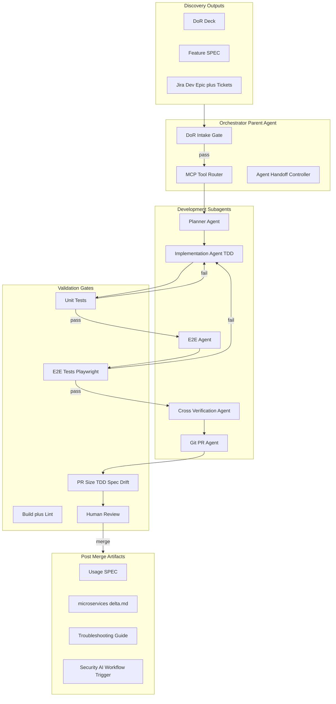

# Development Phase Harness Engineering Plan

Org-wide harness for the **Development phase** of feature delivery. This document is tool-agnostic at the core, with bindings for **Claude Code** and **Cursor**. The widgets repo is the pilot reference implementation; copy this doc and templates to other repos as needed.

---

## 1. Executive Summary

### 1.1 Purpose

Define how work enters Development after Discovery, which agents/skills/MCP tools participate, validation and review gates, exit criteria, and handoffs to Security, Beta, and GTM.

### 1.2 Scope

| In scope | Out of scope |
|----------|--------------|
| Jira-assigned implementation through merge | Discovery DoR creation |
| Unit tests, E2E tests, PR creation | Security AI pipeline implementation |
| Post-merge artifact triggers | Beta doc publish pipeline |
| Handoff interfaces to downstream phases | GTM ContentStack / Tech Zone automation |

### 1.3 Workstreams and Team

- **Workstreams:** WS-2, WS-3, WS-6, WS-9
- **Phase:** Development (Phase 2 in the GTM lifecycle)
- **Team (GTM board):** Bala, Priya, Uday, Ravi, Ritesh, Vivek, Rajesh, Ashish, Vamshi

### 1.4 Related Documents

| Document | Path |
|----------|------|
| Root orchestrator | [AGENTS.md](../../AGENTS.md) — Task type G |
| Claude Code bindings | [CLAUDE.md](../../CLAUDE.md) — `/dev-*` commands |
| Phase templates | [ai-docs/templates/development-phase/](../templates/development-phase/) |
| Agent definitions | [.claude/agents/](../../.claude/agents/) |
| Guardrails (proposed CI) | [ai-docs/harness/guardrails-pr-tdd.md](./guardrails-pr-tdd.md) |

---

## 2. Prerequisites from Discovery (Entry Gate)

Development MUST NOT start until the orchestrator passes the DoR intake gate ([01-intake.md](../templates/development-phase/01-intake.md)).

### 2.1 Required Input Artifacts

| Input artifact | Source phase | Required fields |
|----------------|--------------|-----------------|
| **Feature SPEC** | CAPTURE | Task list, business use cases, acceptance criteria |
| **DoR deck** | Discovery | High/low-level design, API details, error scenarios, limitations, open questions, test plan |
| **Jira Dev Epic + tickets** | Discovery | English description, **Spec delta** (Added / Removed / Updated), component scope, dependencies |
| **Raw data bundle** | CAPTURE | PF/feature desc, OpenAPI/Swagger, design mockup/Figma, CH flags/SKU docs, repo links, dependent Jira |
| **Security Epic stub** | Discovery | Placeholder for post-merge `microservices-delta.md` |
| **Beta Epic stub** | Discovery | Usage spec expectations |

### 2.2 Normalized Ticket Artifact: `spec.md`

Each dev ticket gets a **`spec.md`** synthesized from DoR + ticket spec delta. Store in:

- Worktree: `/tmp/claude-widgets/{TICKET_ID}/spec.md`, or
- Jira attachment / Confluence link referenced in ticket

Use template: [spec.md.template](../templates/development-phase/spec.md.template)

### 2.3 Gate Rule

1. Orchestrator runs DoR checklist.
2. If blockers remain → Jira comment with blocker list; ticket stays in Discovery (`discovery-complete`, not `dev-ready`).
3. If pass → label `dev-ready`; post intake JSON comment; proceed to Phase 0.

---

## 3. Architecture Overview



### 3.1 Parent vs Subagent Split (Non-Negotiable)

| Role | MCP / gh / Playwright? | Responsibilities |
|------|------------------------|------------------|
| **Orchestrator (parent)** | Yes | Jira fetch/update, worktree creation, MCP routing, prefetch external context, spawn subagents, post Jira comments, trigger post-merge workflows |
| **Subagents** | No | Operate in isolated worktree; return structured JSON; stage files only |

This mitigates TPS challenges: context poisoning, agent handoff, MCP tool flooding.

### 3.2 MCP Tool Router

Only load tools needed per phase. Max **3 MCP servers** active per orchestrator turn.

| Phase | Primary MCP | Optional MCP | CLI fallback |
|-------|-------------|--------------|--------------|
| Intake | Jira | Confluence | — |
| Planning | Jira, Confluence | Figma | — |
| Implementation | GitHub (read) | dev-tools | `gh` read-only |
| E2E | Playwright | — | `yarn test:e2e` |
| PR | GitHub, Jira | — | `gh pr create` |
| Post-merge | Jira | Confluence | Security webhook |

**Router rules:**

1. Read MCP tool schema/descriptor before every call.
2. Never pass raw MCP dumps into subagent prompts — parent summarizes to structured JSON.
3. Batch Jira fetches in parent to reduce rate-limit hits.

---

## 4. Agent Roster

Each agent: fixed persona in `.claude/agents/` (Claude Code) or Task `subagent_type` (Cursor).

### 4.1 Orchestrator Agent

| Field | Value |
|-------|-------|
| **Goal** | Route Discovery handoff through Development lifecycle |
| **Persona** | Project manager + integration; no direct code edits unless unblocking |
| **Inputs** | Jira ticket, DoR artifacts, Feature SPEC |
| **Outputs** | Jira labels/comments, spawned subagents, worktree path |
| **Tools** | Jira MCP, GitHub MCP, Confluence MCP (phase-dependent) |
| **Exit** | All epic tickets reach `dev-merged` OR escalated to human |
| **Handoff to** | Planner → Implementer → E2E → Reviewer → Git PR → Post-merge |

### 4.2 Planner Agent

| Field | Value |
|-------|-------|
| **Goal** | Turn `spec.md` + scope ai-docs into implementation plan |
| **Inputs** | `spec.md`, package `ai-docs/AGENTS.md`, SDK KB |
| **Outputs** | `plan.md` as Jira comment; optional ticket split |
| **Tools** | None (read-only in worktree) |
| **Exit** | Plan posted; human approved OR DoR marked auto-approved |
| **Handoff to** | Implementation Agent |
| **Model** | Reasoning-capable (sonnet/opus class) |
| **Agent file** | [.claude/agents/planner.md](../../.claude/agents/planner.md) |

### 4.3 Implementation Agent (Dev Implementer)

| Field | Value |
|-------|-------|
| **Goal** | TDD implementation per `spec.md` and `plan.md` |
| **Inputs** | `spec.md`, `plan.md`, scope ai-docs, patterns |
| **Outputs** | Staged code + tests; JSON result |
| **Workflow** | Failing UT → implement → verify UTs → update ai-docs if API changed |
| **Exit** | All unit tests pass; changes staged |
| **Handoff to** | E2E Agent or Cross-Verifier if E2E N/A |
| **Agent file** | [.claude/agents/dev-implementer.md](../../.claude/agents/dev-implementer.md) |

Extends patterns from [fixer.md](../../.claude/agents/fixer.md) and [AGENTS.md](../../AGENTS.md) Steps 4–5.5.

### 4.4 E2E Agent

| Field | Value |
|-------|-------|
| **Goal** | Implement/update Playwright tests per `spec.md` test plan |
| **Inputs** | `spec.md`, [playwright/ai-docs/AGENTS.md](../../playwright/ai-docs/AGENTS.md) |
| **Outputs** | Staged Playwright tests; JSON result |
| **Runs tests** | Parent executes `yarn test:e2e` (subagent writes tests only) |
| **Exit** | E2E pass OR documented skip with human approval |
| **Note** | CI E2E requires PR label `run_e2e` |

### 4.5 Cross-Verification Agent

| Field | Value |
|-------|-------|
| **Goal** | Independent review of diff vs `spec.md` and ai-docs patterns |
| **Persona** | Reviewer only — no implementation |
| **Inputs** | `git diff`, `spec.md`, plan, scope ai-docs |
| **Outputs** | Review JSON (blockers, suggestions, spec drift flags) |
| **Exit** | Zero blockers OR human override |
| **Skill** | `superpowers:requesting-code-review` |
| **Agent file** | [.claude/agents/cross-verifier.md](../../.claude/agents/cross-verifier.md) |

### 4.6 Git PR Agent

| Field | Value |
|-------|-------|
| **Goal** | Commit, push, draft PR with FedRAMP template |
| **Outputs** | PR URL; Jira label `dev-pr-open` |
| **Base branch** | `next` |
| **Agent file** | [.claude/agents/git-pr.md](../../.claude/agents/git-pr.md) |

### 4.7 QA Test Coverage Agent (Optional)

| Field | Value |
|-------|-------|
| **Goal** | Advisory coverage assessment on touched files |
| **When** | New feature or low coverage |
| **Blocking** | No — advisory PR comment only |
| **Agent file** | [.claude/agents/qa-test-coverage.md](../../.claude/agents/qa-test-coverage.md) |

### 4.8 Post-Merge Agent

| Field | Value |
|-------|-------|
| **Goal** | Generate downstream artifacts after merge |
| **Outputs** | Usage SPEC, `microservices-delta.md`, troubleshooting updates, Security trigger |
| **Agent file** | [.claude/agents/post-merge.md](../../.claude/agents/post-merge.md) |

---

## 5. Skills Matrix (Commands vs Skills)

Commands are thin wrappers; skills hold methodology. Subagents embed skill instructions (no Skill tool in subagents).

| Harness command | Skill(s) | When |
|-----------------|----------|------|
| `/dev-start` | `writing-plans`, ai-docs load | After DoR gate pass |
| `/dev-implement` | `test-driven-development`, `systematic-debugging` | Per Jira ticket |
| `/dev-verify` | `verification-before-completion` | Pre-PR |
| `/dev-pr` | `finishing-a-development-branch` | PR creation |
| `/dev-review` | `requesting-code-review`, `receiving-code-review` | Cross-agent + human |
| Worktree setup | `using-git-worktrees` | `/tmp/claude-widgets/{TICKET_ID}` |

---

## 6. Phase-by-Phase Runbook

Detailed steps in [00-master.md](../templates/development-phase/00-master.md).

### Phase 0 — Intake (Discovery → Development)

1. Fetch Jira ticket + linked DoR/Feature SPEC.
2. Run [01-intake.md](../templates/development-phase/01-intake.md).
3. Generate `spec.md` from template.
4. Label `dev-ready`; post intake JSON comment.
5. Create worktree; `yarn install` + `yarn build:dev`.

### Phase 1 — Plan

1. Spawn Planner Agent.
2. Human checkpoint on complex tickets (optional).
3. Post `plan.md` to Jira; label `dev-in-progress`.

### Phase 2 — Implement (TDD Loop)

1. Implementation Agent: failing tests first.
2. `yarn workspace @webex/{pkg} test:unit` until green.
3. Spec-drift check if ai-docs/API changed (`/spec-drift-changed`).

See [02-implementation.md](../templates/development-phase/02-implementation.md).

### Phase 3 — E2E

1. E2E Agent updates Playwright per test plan.
2. Parent runs `yarn test:e2e`; add `run_e2e` label on PR when needed.
3. On failure → loop to Phase 2 with failure context.

See [03-verification.md](../templates/development-phase/03-verification.md).

### Phase 4 — PR and Review

1. Cross-Verification Agent reviews diff vs `spec.md`.
2. Git PR Agent creates draft PR.
3. Automated guardrails (see [guardrails-pr-tdd.md](./guardrails-pr-tdd.md)).
4. Human review required before merge.
5. On merge: `dev-pr-open` → `dev-merged`.

See [04-pr-and-review.md](../templates/development-phase/04-pr-and-review.md).

### Phase 5 — Post-Merge Artifacts

| Artifact | Consumer | Template |
|----------|----------|----------|
| Usage SPEC | Beta Docs | [create-agent-md.md](../templates/documentation/create-agent-md.md) |
| `microservices-delta.md` | Security | [microservices-delta.md.template](../templates/development-phase/microservices-delta.md.template) |
| Troubleshooting guide | TAC TOI / GTM | ARCHITECTURE.md § Troubleshooting |
| Security AI workflow | Security phase | Webhook/Lambda (interface only) |

See [05-post-merge.md](../templates/development-phase/05-post-merge.md).

Label Security Epic tickets `sec-input-ready`.

---

## 7. Validation and Review Layers

| Layer | Gate | Owner |
|-------|------|-------|
| 1 | DoR completeness | Orchestrator |
| 2 | Plan review | Planner + human (complex) |
| 3 | TDD — test before code | Implementation Agent |
| 4 | Unit tests green | Implementation Agent + Husky |
| 5 | Architecture (SDK/store/event/UI/import/build) | [AGENTS.md Step 5.5](../../AGENTS.md) |
| 6 | E2E from test plan | E2E Agent + CI |
| 7 | PR (size, title, spec drift, CodeRabbit, human) | Git PR + human |

### Human-in-the-Loop (Mandatory)

- DoR blockers unresolved
- Breaking API changes
- Security-sensitive changes (auth, PII, logging)
- PR merge approval

---

## 8. Jira Label and Comment State Machine

### 8.1 Label Flow

```
discovery-complete → dev-ready → dev-in-progress → dev-pr-open → dev-merged → sec-input-ready
```

| Label | Meaning |
|-------|---------|
| `discovery-complete` | Discovery finished; awaiting Development intake |
| `dev-ready` | DoR gate passed; `spec.md` generated |
| `dev-in-progress` | Plan posted; implementation underway |
| `dev-pr-open` | Draft PR created |
| `dev-merged` | PR merged to `next` |
| `sec-input-ready` | Post-merge artifacts posted for Security phase |

### 8.2 Comment Payloads (Durable State)

Inter-stage state lives in **Jira comments** (same pattern as bug pipeline `scrubbed → triaged → fixed`).

#### Intake Comment (on `dev-ready`)

```json
{
  "harness": "development-phase",
  "stage": "intake",
  "ticketId": "CAI-XXXX",
  "dorGate": "pass",
  "blockers": [],
  "specMdPath": "/tmp/claude-widgets/CAI-XXXX/spec.md",
  "worktreePath": "/tmp/claude-widgets/CAI-XXXX",
  "scopePackages": ["@webex/cc-task"],
  "taskType": "C",
  "timestamp": "2026-06-10T00:00:00Z"
}
```

#### Plan Comment (on `dev-in-progress`)

```json
{
  "harness": "development-phase",
  "stage": "plan",
  "ticketId": "CAI-XXXX",
  "planSummary": "One-line summary",
  "filesToTouch": ["packages/contact-center/task/src/..."],
  "testStrategy": "Unit: helper tests; E2E: SET_3 suite",
  "risks": [],
  "humanApprovalRequired": false,
  "timestamp": "2026-06-10T00:00:00Z"
}
```

#### Implementation Comment

```json
{
  "harness": "development-phase",
  "stage": "implement",
  "ticketId": "CAI-XXXX",
  "status": "success|failed",
  "testsAdded": ["path/to/test.ts"],
  "testsPassing": true,
  "aiDocsUpdated": false,
  "timestamp": "2026-06-10T00:00:00Z"
}
```

#### Review Comment

```json
{
  "harness": "development-phase",
  "stage": "review",
  "ticketId": "CAI-XXXX",
  "blockers": [],
  "suggestions": [],
  "specDriftFlags": [],
  "approved": true,
  "timestamp": "2026-06-10T00:00:00Z"
}
```

#### PR Comment (on `dev-pr-open`)

```json
{
  "harness": "development-phase",
  "stage": "pr",
  "ticketId": "CAI-XXXX",
  "prUrl": "https://github.com/webex/widgets/pull/NNN",
  "prNumber": 123,
  "draft": true,
  "timestamp": "2026-06-10T00:00:00Z"
}
```

#### Post-Merge Comment (on `dev-merged` / `sec-input-ready`)

```json
{
  "harness": "development-phase",
  "stage": "post-merge",
  "ticketId": "CAI-XXXX",
  "artifacts": {
    "usageSpec": "link or path",
    "microservicesDelta": "link or path",
    "troubleshootingGuide": "link or path"
  },
  "securityWorkflowTriggered": true,
  "timestamp": "2026-06-10T00:00:00Z"
}
```

---

## 9. TPS Mitigations

| Challenge | Mitigation |
|-----------|------------|
| Context poisoning | Parent summarizes MCP; subagents get JSON only |
| Agent handoff | Standard JSON schemas above; Jira comments |
| Agent persona | Fixed `.claude/agents/` definitions |
| Command vs Skills | Commands orchestrate; skills in agent prompts |
| MCP tool flooding | Phase-based router; max 3 servers/turn |
| Exit conditions | Per-agent exit in Section 4 |
| Model selection | Planner/reviewer = reasoning; implementer = coding |
| Rate limiting | Batch Jira/gh; backoff on 429 |
| Tokenomics | Plan once; reference file paths not full ai-docs |

---

## 10. Dual Runtime Bindings

### Appendix A — Claude Code

| Command | Agents | Doc |
|---------|--------|-----|
| `/dev-start` | Orchestrator + Planner | [.claude/commands/dev-start.md](../../.claude/commands/dev-start.md) |
| `/dev-implement` | Dev Implementer | [.claude/commands/dev-implement.md](../../.claude/commands/dev-implement.md) |
| `/dev-verify` | Orchestrator | [.claude/commands/dev-verify.md](../../.claude/commands/dev-verify.md) |
| `/dev-pr` | Git PR | [.claude/commands/dev-pr.md](../../.claude/commands/dev-pr.md) |
| `/dev-review` | Cross-Verifier | [.claude/commands/dev-review.md](../../.claude/commands/dev-review.md) |
| `/dev-post-merge` | Post-Merge | [.claude/commands/dev-post-merge.md](../../.claude/commands/dev-post-merge.md) |

Worktree: `/tmp/claude-widgets/{TICKET_ID}`

### Appendix B — Cursor

| Role | Configuration |
|------|---------------|
| Orchestrator | Main agent with MCP: Jira, GitHub, Confluence, Playwright |
| Subagents | Task tool: `fixer`, `qa-test-coverage`, `generalPurpose` (review), `git-pr` |
| Rules | Optional `.cursor/rules/development-phase.mdc` → this doc |
| MCP per phase | See Section 3.2 router table |

Parent prefetches Jira; passes JSON to subagents. Fallback: parent runs `git add` if subagent cannot stage.

### Appendix C — Widgets Repo Reference

| Concern | Mapping |
|---------|---------|
| Task routing | AGENTS.md types A/B/C/F from ticket `taskType` in intake JSON |
| Package ai-docs | Mandatory per scope table in AGENTS.md |
| Build/test | `yarn workspace @webex/{pkg} test:unit`, `yarn build:dev`, `yarn test:e2e` |
| Architecture | Widget → Hook → Component → Store → SDK |
| Bug pipeline | Parallel to `/fix` but starts from DoR `spec.md`, not triager output |

---

## 11. Out of Scope (Deferred)

- Corona/Lambda Security AI implementation (interface documented in post-merge only)
- ContentStack MCP / Beta publish pipeline
- Tech Zone API / GTM automation
- MCP server implementations
- Threat Dragon / HAR export automation

---

_Last updated: 2026-06-10_
