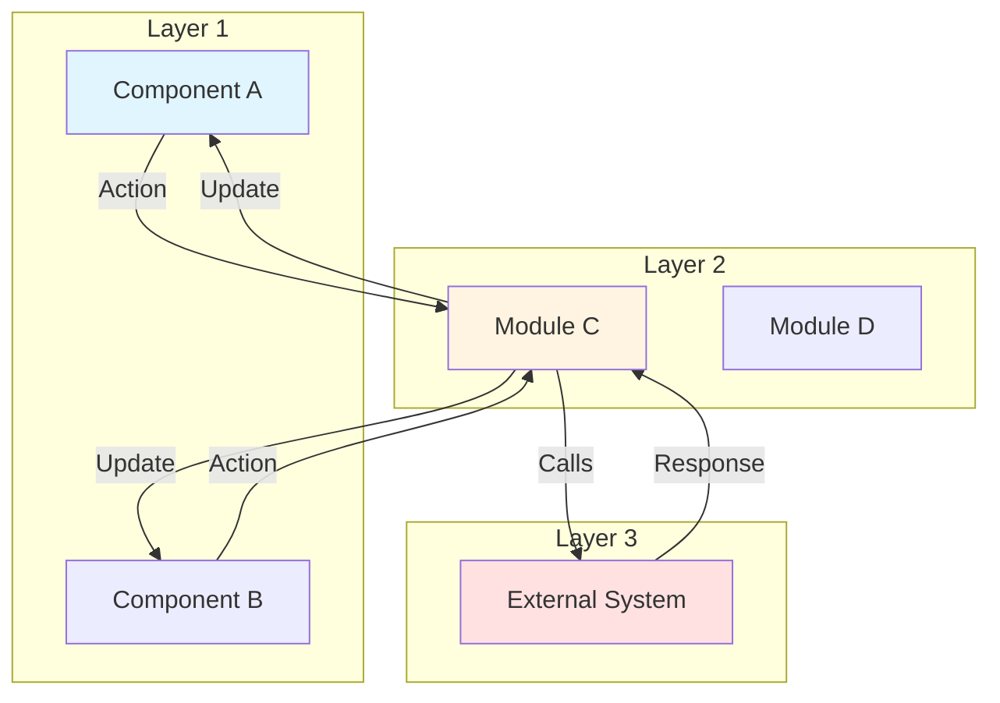
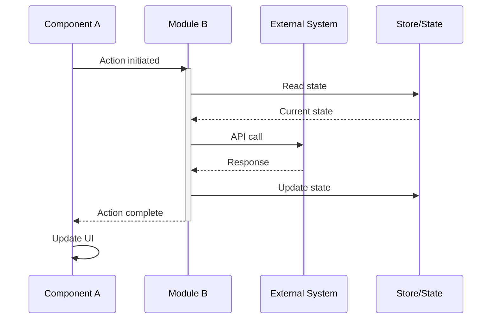
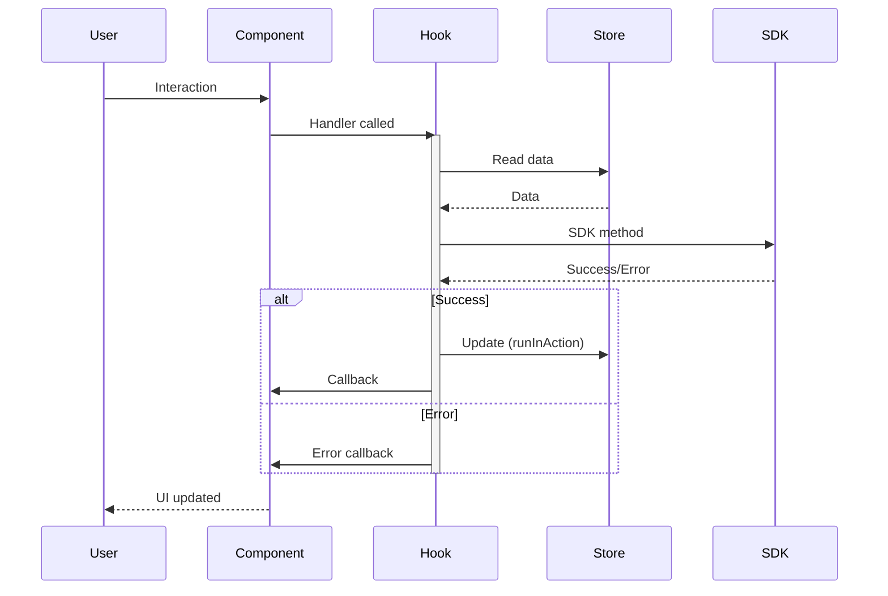
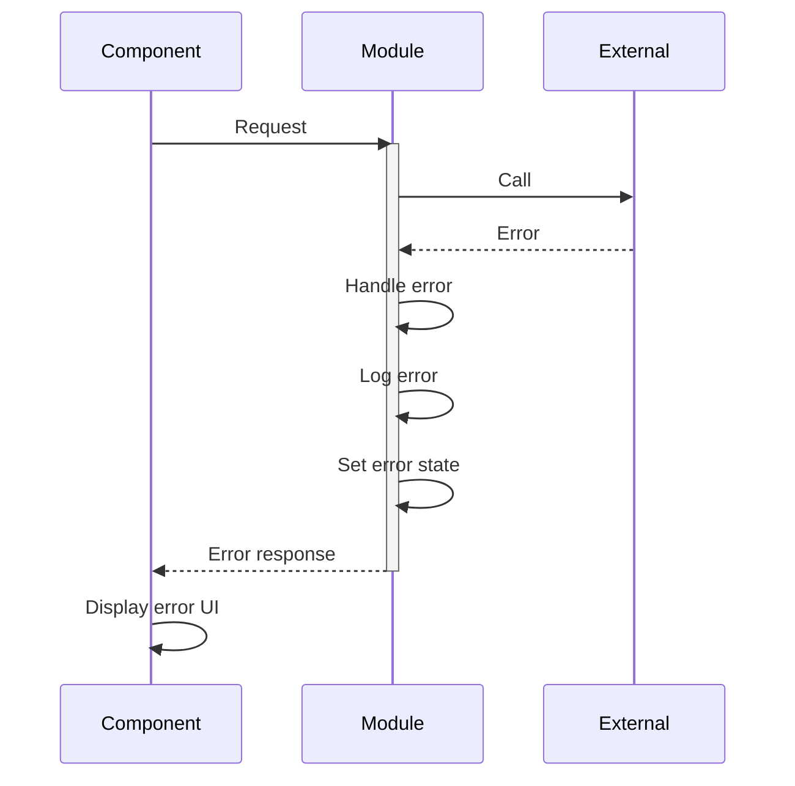
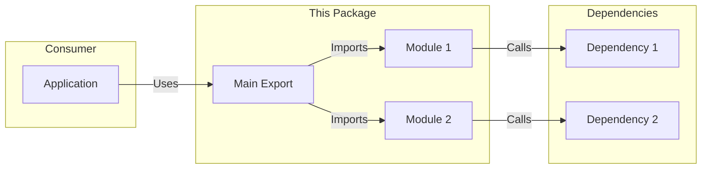
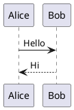
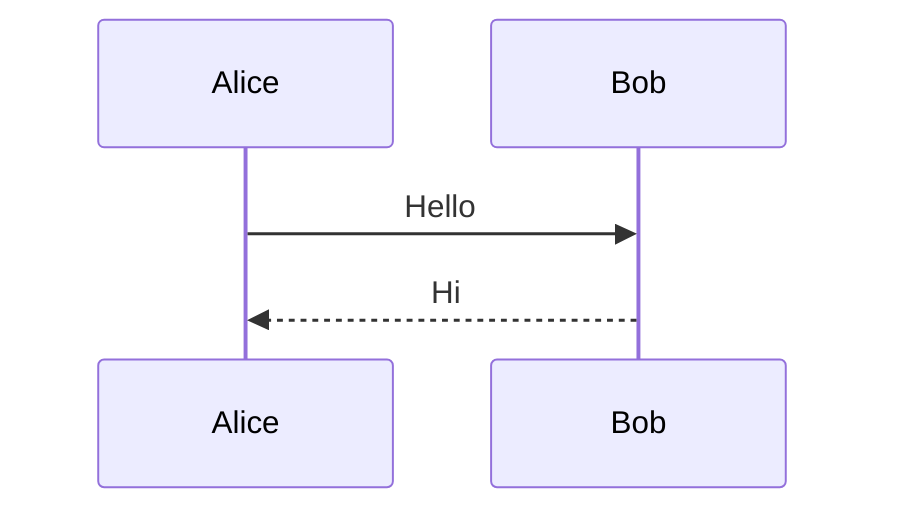
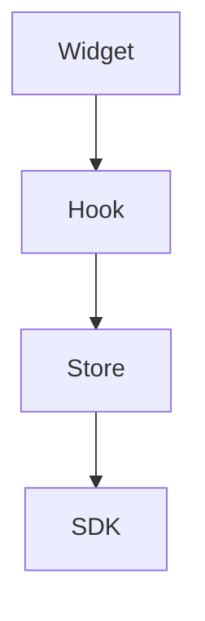
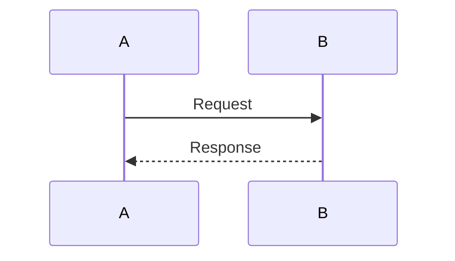
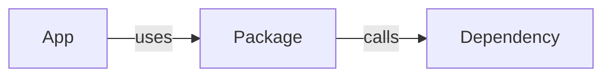

# Create architecture.md Template

## Overview

This template generates the `architecture.md` file for any package. It provides technical documentation about implementation, data flows, and troubleshooting.

**Purpose:** Technical deep-dive for developers and AI assistants

**Required:** Mermaid diagrams (not PlantUML) for native rendering

**Reusable For:** All packages in the monorepo

---

## When to Use

- Creating new package documentation
- Documenting complex architecture
- Adding sequence diagrams
- Creating troubleshooting guides
- Updating after architectural changes

---

## Pre-Generation Questions

### 1. Package Information

- **Package name:** _______________
- **Package type:** Widget | Store | Component Library | Utility
- **Display name:** _______________

### 2. Architecture Details

- **Number of components/modules:** _______________
- **Key files to document:** _______________
- **Layer interactions:** Which layers does this package touch?
- **External dependencies:** SDK, store, other packages?

### 3. Diagrams Needed

- **Layer communication diagram:** Yes / No
- **Sequence diagrams:** How many scenarios? (recommend 3-5)
- **Flow diagrams:** Any special flows to document?

### 4. Troubleshooting

- **Common issues:** List 5-8 common issues users face
- **For each issue:**
  - Symptoms
  - Possible causes
  - Solutions

---

## architecture.md Structure

```markdown
# {Display Name} - Architecture

## Component Overview

{Brief architectural overview - 2-3 sentences explaining the design}

### Component Table

| Component/Module | File | Purpose | Props/Params | State | Callbacks | Tests | Dependencies |
|------------------|------|---------|--------------|-------|-----------|-------|--------------|
| **Component1** | `src/file.tsx` | Purpose | PropType | Local state | onEvent | `tests/file.tsx` | Dependencies |
| **Component2** | `src/file2.ts` | Purpose | ParamType | Returns X | N/A | `tests/file2.ts` | Dependencies |
| **Component3** | `src/file3.tsx` | Purpose | PropType | N/A | onCallback | `tests/file3.tsx` | Dependencies |

{Add rows for each major component/module in the package}

---

## SDK Integration (If Applicable)

{Only include if package integrates with SDK}

| Area | SDK Methods Used | SDK Events Subscribed | Package Methods |
|------|------------------|----------------------|-----------------|
| Initialization | `register()`, `LoggerProxy` | `agent:dnRegistered` | `init()`, `setup()` |
| Operations | `someMethod()` | `event:name` | `handler()` |

---

## File Structure

```
{package-name}/
├── src/
│   ├── {main-component}/
│   │   ├── index.tsx              # Main component
│   │   └── {name}.types.ts        # Type definitions
│   ├── helper.ts                  # Helper functions
│   ├── utils.ts                   # Utilities
│   ├── constants.ts               # Constants
│   ├── index.ts                   # Package exports
│   └── wc.ts                      # Web Component export (if applicable)
├── ai-prompts/
│   ├── agent.md                   # Usage docs
│   └── architecture.md            # This file
├── tests/
│   ├── {main-component}/
│   │   └── index.tsx              # Component tests
│   ├── helper.ts                  # Helper tests
│   └── utils.ts                   # Utility tests
├── package.json
├── tsconfig.json
├── webpack.config.js
└── ... config files
```

---

## Data Flows

### Layer Communication Flow

{Show how this package fits into the overall architecture}



### Hook/Module Details (If Applicable)

{For widgets, explain hook logic. For utilities, explain key functions}

**Key Responsibilities:**
- Responsibility 1
- Responsibility 2
- Responsibility 3

**Data Transformations:**
- Input → Processing → Output

---

## Sequence Diagrams

{Include 3-5 sequence diagrams for key scenarios}

### Scenario 1: {Initialization/Setup/Main Flow}

{Brief description of this scenario}



### Scenario 2: {User Interaction/Event Handling}

{Brief description}



### Scenario 3: {Error Handling/Edge Case}

{Brief description}



{Add 2-3 more scenarios as needed}

---

## Integration Architecture (If Applicable)

{For widgets, show how they integrate with cc-widgets}
{For components, show how they're used by widgets}
{For utilities, show usage patterns}

### Integration Pattern



---

## Troubleshooting Guide

### Common Issues

{Include 5-8 common issues with detailed solutions}

#### 1. {Issue Title}

**Symptoms:**
- Symptom 1
- Symptom 2
- What the user sees

**Possible Causes:**
- Cause 1 with explanation
- Cause 2 with explanation
- Cause 3 with explanation

**Solutions:**

```typescript
// Solution 1: Check X
import { Package } from '{package-name}';

// Verify condition
console.log('Check:', condition);

// Fix approach
const fixed = correctWay();
```

```typescript
// Solution 2: Alternative approach
// Step-by-step fix with code
```

**Prevention:**
- How to avoid this issue in future
- Best practices

---

#### 2. {Issue Title}

**Symptoms:**
- What happens

**Possible Causes:**
- Why this happens

**Solutions:**

```typescript
// Code solution
```

---

{Continue with 5-8 total issues}

---

## Performance Considerations (Optional)

{Include if package has performance implications}

### Optimization Strategies

1. **Strategy 1**
   - Description
   - When to use
   - Code example

2. **Strategy 2**
   - Description
   - When to use
   - Code example

### Common Performance Issues

- Issue and solution
- Issue and solution

---

## Related Documentation

- [Agent Documentation](./agent.md) - Usage examples and API
- [{Related Pattern}](../../../../ai-docs/patterns/{pattern}.md) - Pattern documentation
- [{Related Package}](../../{package}/ai-prompts/agent.md) - Related package docs
- [{Another Related}](../../{package}/ai-prompts/architecture.md) - Related architecture

---

_Last Updated: {YYYY-MM-DD}_
```

---

## Content Guidelines

### Component Overview Section

**Do:**
- Provide architectural context
- Explain design decisions
- Use component table for structure
- Include all major files

**Don't:**
- Duplicate agent.md content
- Skip test file locations
- Forget dependencies column

**Component Table Requirements:**
- List all major components/modules
- Include file paths
- Document props/parameters
- Note callbacks/events
- Reference test locations
- List key dependencies

---

### File Structure Section

**Do:**
- Show complete directory tree
- Include all important files
- Add comments explaining purpose
- Match actual structure

**Don't:**
- Include build artifacts
- Show node_modules
- Skip configuration files

---

### Data Flows Section

**Do:**
- Use Mermaid diagrams (not PlantUML)
- Show layer interactions
- Include data direction arrows
- Color-code by layer
- Keep diagrams focused

**Don't:**
- Make diagrams too complex
- Skip important connections
- Use PlantUML syntax
- Forget to label arrows

**Mermaid Tips:**
- `graph TB` for top-to-bottom flow
- `graph LR` for left-to-right flow
- `subgraph` for grouping
- `style X fill:#color` for coloring
- `-->` for arrows, `-->>` for returns

---

### Sequence Diagrams Section

**Do:**
- Show 3-5 key scenarios
- Include initialization flow
- Show error handling
- Document edge cases
- Use clear participant names
- Add activation boxes
- Use alt/else for conditionals

**Don't:**
- Show every possible flow
- Make diagrams too detailed
- Skip error scenarios
- Use ambiguous names

**Mermaid Sequence Tips:**
- `participant A as Name` for custom names
- `activate/deactivate` for active periods
- `alt/else/end` for conditionals
- `loop/end` for loops
- `Note over A,B: text` for notes

---

### Troubleshooting Section

**Do:**
- Include 5-8 common issues
- Use consistent structure
- Provide code solutions
- Explain prevention
- Cover both simple and complex issues

**Don't:**
- Skip symptoms or causes
- Provide solutions without context
- Use vague descriptions
- Forget to include code examples

**Issue Structure:**
1. **Title:** Clear, specific issue name
2. **Symptoms:** What user experiences
3. **Possible Causes:** Why it happens (2-3 causes)
4. **Solutions:** Code-based fixes (2-3 solutions)
5. **Prevention:** How to avoid

---

## Diagram Guidelines

### Use Mermaid (Not PlantUML)

**Why Mermaid:**
- Native GitHub/GitLab rendering
- Better IDE support
- Simpler syntax
- No external server needed

**Conversion from PlantUML:**

PlantUML:


Mermaid:


### Diagram Types

**Layer Communication:**


**Sequence Diagram:**


**Integration Flow:**


---

## Validation Checklist

Before considering architecture.md complete:

### Content Completeness
- [ ] Component overview complete
- [ ] Component table has all major components
- [ ] File structure matches reality
- [ ] Data flow diagram included
- [ ] 3-5 sequence diagrams included
- [ ] 5-8 troubleshooting issues documented
- [ ] Related docs linked

### Diagram Quality
- [ ] All diagrams use Mermaid (not PlantUML)
- [ ] Diagrams render correctly
- [ ] Labels are clear
- [ ] Arrows show data flow direction
- [ ] Colors used for emphasis (optional)
- [ ] Diagrams are focused (not too complex)

### Troubleshooting Quality
- [ ] Each issue has symptoms
- [ ] Each issue has 2-3 causes
- [ ] Each issue has code solutions
- [ ] Prevention tips included
- [ ] Issues cover common scenarios

### Formatting
- [ ] Markdown renders correctly
- [ ] Code blocks have language tags
- [ ] Tables format properly
- [ ] No broken links
- [ ] Consistent heading levels

---

## Examples by Package Type

### Widget Architecture

**Focus:**
- Widget → Hook → Component → Store → SDK flow
- Initialization sequence
- User interaction flows
- Error handling
- Store integration

**Diagrams:**
- Layer communication (5 layers)
- Initialization sequence
- User interaction sequence
- Error handling sequence
- Store update sequence

**Troubleshooting:**
- Widget not rendering
- Callbacks not firing
- Store not updating
- Props not passing
- Performance issues

---

### Store Architecture

**Focus:**
- Store structure
- Observable management
- Event handling
- SDK integration
- Data fetching

**Diagrams:**
- Store modules
- Initialization flow
- Event subscription
- Data fetch flow
- State update flow

**Troubleshooting:**
- Store not initializing
- Events not firing
- Data not updating
- Memory leaks
- Performance issues

---

### Component Library Architecture

**Focus:**
- Component structure
- Props patterns
- Composition
- Styling approach
- Momentum UI integration

**Diagrams:**
- Component hierarchy
- Props flow
- Event bubbling
- Styling approach

**Troubleshooting:**
- Components not rendering
- Props not passing
- Styles not applying
- Event handlers not firing
- Performance issues

---

## Related Templates

- **[create-agent-md.md](./create-agent-md.md)** - User-facing documentation
- **[update-documentation.md](./update-documentation.md)** - Update existing docs
- **[add-examples.md](./add-examples.md)** - Add more examples

---

_Template Version: 1.0.0_
_Last Updated: 2025-11-26_

