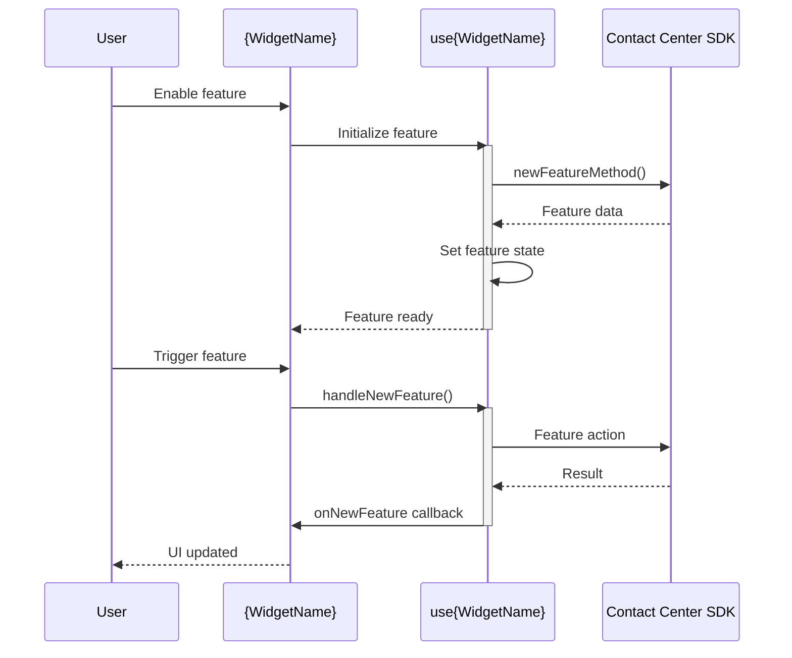

# Feature Enhancement Template

## Overview

This template guides you through adding new features to existing widgets while maintaining backward compatibility and following established patterns.

**Purpose:** Systematic approach to feature additions

**Scope:** New props, new callbacks, new functionality

---

## When to Use

- Adding new prop to existing widget
- Adding new callback/event
- Extending widget functionality
- Adding new user interaction
- Integrating new SDK feature

---

## Pre-Enhancement Questions

### 1. Feature Information

- **Which widget/component to enhance?** _______________
- **Feature description (one sentence):** _______________
- **Feature purpose:** _______________
- **User benefit:** _______________

### 2. Feature Requirements

- **New props needed:** _______________
  - Name, type, required/optional, default value
- **New callbacks needed:** _______________
  - Name, parameters, return type
- **New UI elements needed:** _______________
- **New SDK methods needed:** _______________
- **New store observables needed:** _______________
  - ⚠️ Requires architecture discussion

### 3. Compatibility

- **Is this backward compatible?** Yes / No
  - If no, explain breaking changes: _______________
- **Affects existing functionality?** Yes / No
  - If yes, how: _______________
- **Requires version bump:** Patch / Minor / Major

### 4. Design Input

- **Figma link:** _______________
- **Screenshots:** Yes / No
- **Written spec:** Yes / No
- **Reference widget:** _______________

---

## Step 1: Design the Feature

### 1.1 API Design

**New Props:**
```typescript
export interface {WidgetName}Props {
  // Existing props
  existingProp: string;
  
  // NEW: Add new props
  newFeatureEnabled?: boolean;  // Optional for backward compatibility
  newFeatureConfig?: {
    option1: string;
    option2: number;
  };
  onNewFeature?: (data: FeatureData) => void;
}
```

**Key Considerations:**
- Make new props optional (for backward compatibility)
- Provide sensible defaults
- Use descriptive names
- Add JSDoc comments

### 1.2 Feature Flow

**Identify affected layers:**
- [ ] Widget component (user interaction)
- [ ] Hook (business logic)
- [ ] Presentational component (UI)
- [ ] Store (state management)
- [ ] SDK (backend integration)

**Data flow:**
```
User Action → Widget → Hook → Store → SDK
                ↓
          Component (UI Update)
```

### 1.3 Check for Breaking Changes

**Breaking if:**
- Removing existing props
- Changing prop types
- Changing callback signatures
- Changing default behavior

**Non-breaking if:**
- Adding optional props
- Adding new callbacks
- Adding new functionality (opt-in)

**This feature is:** Breaking / Non-breaking

---

## Step 2: Update Types

### 2.1 Update Props Interface

**File:** `src/{widget-name}/{widget-name}.types.ts`

```typescript
export interface {WidgetName}Props {
  // Existing props
  existingProp: string;
  onExistingEvent?: () => void;
  
  // NEW FEATURE: Add types
  /**
   * Enables the new feature
   * @default false
   */
  newFeatureEnabled?: boolean;
  
  /**
   * Configuration for new feature
   * @default undefined
   */
  newFeatureConfig?: NewFeatureConfig;
  
  /**
   * Callback when new feature is triggered
   * @param data - Feature event data
   */
  onNewFeature?: (data: FeatureData) => void;
}

// NEW: Add supporting types
export interface NewFeatureConfig {
  option1: string;
  option2: number;
  option3?: boolean;
}

export interface FeatureData {
  result: string;
  timestamp: number;
  metadata?: Record<string, any>;
}
```

---

## Step 3: Update Widget Code

### 3.1 Update Widget Component

**File:** `src/{widget-name}/index.tsx`

```typescript
import React from 'react';
import { observer } from 'mobx-react-lite';
import { ErrorBoundary } from 'react-error-boundary';
import { use{WidgetName} } from '../helper';
import { {WidgetName}Component } from '@webex/cc-components';
import type { {WidgetName}Props } from './{widget-name}.types';

const {WidgetName}Internal: React.FC<{WidgetName}Props> = observer((props) => {
  // Destructure NEW props
  const {
    newFeatureEnabled = false, // Default value
    newFeatureConfig,
    onNewFeature,
    ...existingProps
  } = props;

  // Use hook (pass new props)
  const {
    // Existing state
    existingData,
    handleExisting,
    // NEW: Feature state and handlers
    featureData,
    handleNewFeature,
  } = use{WidgetName}(props);

  return (
    <{WidgetName}Component
      // Existing props
      {...existingProps}
      existingData={existingData}
      onExisting={handleExisting}
      
      // NEW: Pass feature props
      newFeatureEnabled={newFeatureEnabled}
      featureData={featureData}
      onNewFeature={handleNewFeature}
    />
  );
});

// Export wrapped component
const {WidgetName}: React.FC<{WidgetName}Props> = (props) => (
  <ErrorBoundary
    fallback={<div>Something went wrong</div>}
    onError={(error) => console.error('{WidgetName} Error:', error)}
  >
    <{WidgetName}Internal {...props} />
  </ErrorBoundary>
);

export { {WidgetName} };
export type { {WidgetName}Props };
```

---

### 3.2 Update Hook

**File:** `src/helper.ts`

```typescript
import { useEffect, useState, useCallback } from 'react';
import store from '@webex/cc-store';
import { runInAction } from 'mobx';
import type { {WidgetName}Props, FeatureData } from './{widget-name}/{widget-name}.types';

export function use{WidgetName}(props: {WidgetName}Props) {
  // Existing state
  const [existingData, setExistingData] = useState<any>(null);
  
  // NEW: Feature state
  const [featureData, setFeatureData] = useState<FeatureData | null>(null);
  const [featureError, setFeatureError] = useState<Error | null>(null);

  // NEW: Feature initialization
  useEffect(() => {
    // Only initialize if feature is enabled
    if (!props.newFeatureEnabled) return;
    
    const initializeFeature = async () => {
      try {
        // Call SDK or setup feature
        const result = await store.cc.newFeatureMethod(props.newFeatureConfig);
        setFeatureData(result);
      } catch (error) {
        setFeatureError(error as Error);
        props.onError?.(error as Error);
      }
    };

    initializeFeature();
    
    // Cleanup if needed
    return () => {
      // Cleanup feature
    };
  }, [props.newFeatureEnabled, props.newFeatureConfig]);

  // NEW: Feature handler
  const handleNewFeature = useCallback(async (param: any) => {
    try {
      // Perform feature action
      const result = await store.cc.someFeatureAction(param);
      
      // Update store if needed
      runInAction(() => {
        // store.setFeatureValue(result);
      });
      
      // Call callback
      props.onNewFeature?.({
        result: result.data,
        timestamp: Date.now(),
        metadata: result.metadata,
      });
    } catch (error) {
      setFeatureError(error as Error);
      props.onError?.(error as Error);
    }
  }, [props]);

  // Return state and handlers
  return {
    // Existing
    existingData,
    handleExisting: () => {},
    // NEW: Feature
    featureData,
    handleNewFeature,
  };
}
```

---

### 3.3 Update Component (if needed)

**File:** cc-components component (if UI changes needed)

```typescript
import React from 'react';
import { Button } from '@momentum-design/components/dist/react';
import type { {WidgetName}ComponentProps } from './{widget-name}.types';

export const {WidgetName}Component: React.FC<{WidgetName}ComponentProps> = (props) => {
  const {
    // Existing props
    existingData,
    onExisting,
    // NEW: Feature props
    newFeatureEnabled,
    featureData,
    onNewFeature,
  } = props;

  return (
    <div className="{widget-name}">
      {/* Existing UI */}
      <div className="{widget-name}__existing">
        {/* ... */}
      </div>
      
      {/* NEW: Conditional feature UI */}
      {newFeatureEnabled && (
        <div className="{widget-name}__new-feature">
          {featureData && (
            <div className="{widget-name}__feature-content">
              <p>{featureData.result}</p>
              <Button onClick={() => onNewFeature?.(featureData)}>
                Use Feature
              </Button>
            </div>
          )}
        </div>
      )}
    </div>
  );
};
```

---

## Step 4: Update Integration

### 4.1 Update cc-widgets (if needed)

**Only if adding new Web Component props**

**File:** `packages/contact-center/cc-widgets/src/wc.ts`

```typescript
const Web{WidgetName} = r2wc({WidgetName}, {
  props: {
    // Existing
    existingProp: 'string',
    onExisting: 'function',
    // NEW: Add new props
    newFeatureEnabled: 'boolean',
    newFeatureConfig: 'json',
    onNewFeature: 'function',
  },
});
```

---

### 4.2 Update React Sample App

**File:** `widgets-samples/cc/samples-cc-react-app/src/App.tsx`

```typescript
// Add new callback handler
const onNewFeature = (data) => {
  console.log('{WidgetName} new feature:', data);
};

// Update widget usage
{selectedWidgets.{widgetName} && (
  <div className="box">
    <section className="section-box">
      <fieldset className="fieldset">
        <legend className="legend-box">{Widget Display Name}</legend>
        
        {/* NEW: Add feature toggle (optional) */}
        <label>
          <input
            type="checkbox"
            checked={featureEnabled}
            onChange={(e) => setFeatureEnabled(e.target.checked)}
          />
          Enable New Feature
        </label>
        
        <{WidgetName}
          // Existing props
          existingProp="value"
          onExisting={onExisting}
          
          // NEW: Feature props
          newFeatureEnabled={featureEnabled}
          newFeatureConfig={{ option1: 'value', option2: 10 }}
          onNewFeature={onNewFeature}
        />
      </fieldset>
    </section>
  </div>
)}
```

---

### 4.3 Update Web Component Sample App

**File:** `widgets-samples/cc/samples-cc-wc-app/app.js`

```javascript
// NEW: Set feature properties
cc{WidgetName}.newFeatureEnabled = true;
cc{WidgetName}.newFeatureConfig = { option1: 'value', option2: 10 };

// NEW: Add feature event listener
cc{WidgetName}.addEventListener('newFeature', (event) => {
  console.log('{WidgetName} new feature:', event.detail);
});
```

---

## Step 5: Update Tests

### 5.1 Add Feature Tests

**File:** `tests/{widget-name}/index.tsx`

```typescript
describe('{WidgetName} - New Feature', () => {
  it('renders without feature when disabled', () => {
    render(
      <{WidgetName}
        existingProp="test"
        newFeatureEnabled={false}
      />
    );
    
    expect(screen.queryByText('Feature')).not.toBeInTheDocument();
  });

  it('renders with feature when enabled', () => {
    render(
      <{WidgetName}
        existingProp="test"
        newFeatureEnabled={true}
        newFeatureConfig={{ option1: 'test', option2: 10 }}
      />
    );
    
    expect(screen.getByText('Feature')).toBeInTheDocument();
  });

  it('calls onNewFeature callback', async () => {
    const mockCallback = jest.fn();
    
    render(
      <{WidgetName}
        existingProp="test"
        newFeatureEnabled={true}
        onNewFeature={mockCallback}
      />
    );

    fireEvent.click(screen.getByRole('button', { name: /use feature/i }));

    await waitFor(() => {
      expect(mockCallback).toHaveBeenCalledWith({
        result: expect.any(String),
        timestamp: expect.any(Number),
      });
    });
  });

  it('maintains backward compatibility', () => {
    // Test widget works without new props
    render(<{WidgetName} existingProp="test" />);
    
    expect(screen.getByText('Existing')).toBeInTheDocument();
  });
});
```

### 5.2 Update Hook Tests

**File:** `tests/helper.ts`

```typescript
describe('use{WidgetName} - New Feature', () => {
  it('initializes feature when enabled', async () => {
    mockCC.newFeatureMethod.mockResolvedValue({ data: 'test' });

    const { result } = renderHook(() =>
      use{WidgetName}({
        existingProp: 'test',
        newFeatureEnabled: true,
        newFeatureConfig: { option1: 'test', option2: 10 },
      })
    );

    await act(async () => {
      // Wait for initialization
    });

    expect(mockCC.newFeatureMethod).toHaveBeenCalled();
    expect(result.current.featureData).toBeDefined();
  });

  it('does not initialize feature when disabled', () => {
    const { result } = renderHook(() =>
      use{WidgetName}({
        existingProp: 'test',
        newFeatureEnabled: false,
      })
    );

    expect(mockCC.newFeatureMethod).not.toHaveBeenCalled();
    expect(result.current.featureData).toBeNull();
  });

  it('calls feature handler correctly', async () => {
    const mockCallback = jest.fn();

    const { result } = renderHook(() =>
      use{WidgetName}({
        existingProp: 'test',
        newFeatureEnabled: true,
        onNewFeature: mockCallback,
      })
    );

    await act(async () => {
      result.current.handleNewFeature('param');
    });

    expect(mockCallback).toHaveBeenCalled();
  });
});
```

---

## Step 6: Update Documentation

### 6.1 Update agent.md

**File:** `ai-prompts/agent.md`

**Add to Examples section:**

```markdown
#### {N}. Using New Feature

{Description of the new feature}

```typescript
import { {WidgetName} } from '@webex/cc-widgets';

function App() {
  const handleNewFeature = (data) => {
    console.log('Feature triggered:', data);
  };

  return (
    <{WidgetName}
      existingProp="value"
      // NEW: Enable and configure feature
      newFeatureEnabled={true}
      newFeatureConfig={{
        option1: 'value',
        option2: 10
      }}
      onNewFeature={handleNewFeature}
    />
  );
}
```

**Key Points:**
- Feature is optional (backward compatible)
- Configure via newFeatureConfig prop
- Subscribe to onNewFeature for events
```

**Update Props API table:**

```markdown
| Prop | Type | Required | Default | Description |
|------|------|----------|---------|-------------|
| `existingProp` | `string` | Yes | - | Existing description |
| `newFeatureEnabled` | `boolean` | No | `false` | Enables the new feature |
| `newFeatureConfig` | `NewFeatureConfig` | No | `undefined` | Configuration for new feature |
| `onNewFeature` | `(data: FeatureData) => void` | No | - | Callback when feature is triggered |
```

---

### 6.2 Update architecture.md

**File:** `ai-prompts/architecture.md`

**Update Component Table:**

Add new props/callbacks to table

**Add Sequence Diagram:**

```markdown
### New Feature Flow


```

---

## Step 7: Validation

### 7.1 Code Quality Checks

- [ ] Follows TypeScript patterns
- [ ] Follows React patterns
- [ ] Follows MobX patterns
- [ ] No layer violations
- [ ] Error handling in place
- [ ] Proper cleanup

### 7.2 Backward Compatibility

- [ ] Widget works without new props
- [ ] Existing functionality unchanged
- [ ] No breaking changes
- [ ] Default values provided
- [ ] Optional props used

### 7.3 Testing Checks

- [ ] Feature tests added
- [ ] Backward compatibility tested
- [ ] All tests pass
- [ ] Linting passes
- [ ] Build succeeds
- [ ] E2E tests updated (if needed)

### 7.4 Integration Checks

- [ ] Works in React sample
- [ ] Works in WC sample
- [ ] Feature toggle works
- [ ] Callbacks fire correctly
- [ ] No console errors

### 7.5 Documentation Checks

- [ ] agent.md examples added
- [ ] Props table updated
- [ ] architecture.md updated
- [ ] Sequence diagram added
- [ ] CHANGELOG updated

---

## Related Templates

- **[bug-fix.md](./bug-fix.md)** - Fix bugs in existing widgets
- **[refactoring.md](./refactoring.md)** - Refactor existing code
- **[../documentation/update-documentation.md](../documentation/update-documentation.md)** - Update docs
- **[../testing/add-unit-tests.md](../testing/add-unit-tests.md)** - Add tests

---

_Template Version: 1.0.0_
_Last Updated: 2025-11-26_

