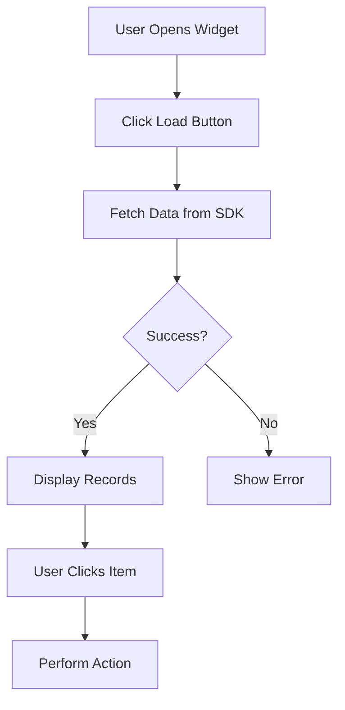
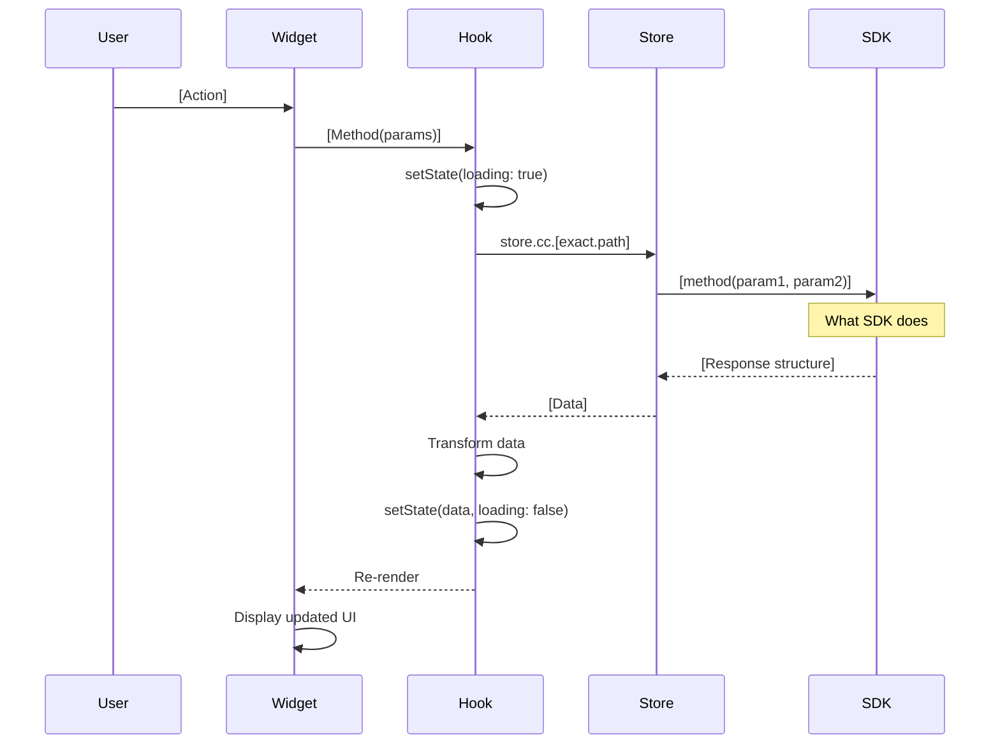

# Pre-Generation Questions

## Overview

This module collects the essential information needed to generate a widget. The user will provide ONLY the 4 required technical inputs.

**Purpose:** Gather minimal, focused requirements for widget generation

**Read this:** Before generating any code

---

## Widget Identification

### 1. Basic Information

**Widget name (kebab-case):**
```
Example: agent-directory, team-performance, activity-feed
Your answer: _______________
```

---

## ⚠️ MANDATORY: Design Input

### 2. Design Specifications (REQUIRED)

**User MUST provide ONE of the following:**

**[ ] Figma link**
**[ ] Screenshot(s)**
**[ ] Design specification document**
**[ ] Reference existing widget**

### ⚠️ If NO design input provided:

**STOP and ask the user:**

```
⚠️ Design Input Required

Please provide ONE of:
1. Figma link or file
2. Screenshot(s) of desired UI
3. Design specification document
4. Reference to existing widget to clone visually

This ensures the generated widget matches your design system.
```

**DO NOT proceed without design input.**

---

## ⚠️ MANDATORY: Technical Requirements (4 Items ONLY)

### 3. High-Level User Flow

**User must provide a simple flowchart showing:**
- Main user journey through the widget
- Key user actions
- Decision points
- End states

**Format:** Mermaid flowchart or textual description

**Example:**


**Your flow:**
```
[Paste Mermaid diagram or describe the flow]
```

---

### 4. Detailed Technical Sequences

**User must provide Mermaid sequence diagrams for EACH major scenario.**

**Required for each scenario:**
- Complete flow from User → Widget → Hook → Store → SDK
- Exact SDK API paths (e.g., `store.cc.someService.someMethod()`)
- All parameters with types
- Response structure
- Data transformation steps
- State updates
- Error handling

**Scenario Template:**


**Your scenarios:**

**Scenario 1: [Name]**
```
[Paste complete Mermaid sequence diagram]
```

**Scenario 2: [Name]**
```
[Paste complete Mermaid sequence diagram]
```

**Scenario 3: [Name]** (if applicable)
```
[Paste complete Mermaid sequence diagram]
```

---

### 5. Data Structure Mappings

**User must provide explicit field-by-field mappings from SDK response to widget state.**

**Format:**

**Source (SDK Response):**
```typescript
// From: store.cc.[exact.path.to.method()]
// Returns:
{
  data: {
    items: Array<{
      field1: string;
      field2: number;
      nested: {
        subField1: string;
        subField2?: string;
      };
    }>
  }
}
```

**Target (Widget State):**
```typescript
// Internal widget type:
interface WidgetRecord {
  id: string;           // maps to: item.field1
  value: number;        // maps to: item.field2
  name: string;         // maps to: item.nested.subField1 || item.nested.subField2 || 'Default'
  timestamp: number;    // maps to: new Date(item.dateField).getTime()
}
```

**Transformation Logic:**
```typescript
// Exact transformation code:
const transform = (sdkResponse) => {
  return sdkResponse.data.items.map(item => ({
    id: item.field1,
    value: item.field2,
    name: item.nested.subField1 || item.nested.subField2 || 'Default',
    timestamp: new Date(item.dateField).getTime()
  }));
};
```

**Your mappings:**
```
[Provide Source, Target, and Transformation Logic]
```

---

### 6. Required API Details

**User must document EVERY SDK API call that will be used.**

**For each API:**

**API #1:**
```
Path: store.cc.[exact.nested.path.to.method]
Method: methodName(param1, param2, ...)
Parameters:
  - param1: [type] - [description] - [example value]
  - param2: [type] - [description] - [example value]
Returns: [exact return type]
Response Structure:
  {
    field1: type,
    field2: type,
    nested: {
      ...
    }
  }
Errors: [possible error cases]
```

**API #2:** (if applicable)
```
Path: store.cc.[exact.nested.path.to.method]
Method: methodName(param1)
Parameters:
  - param1: [type] - [description] - [example value]
Returns: [exact return type]
Response Structure:
  {
    ...
  }
Errors: [possible error cases]
```

**Your API details:**
```
[Document all APIs]
```

---

## Summary Checklist

Before proceeding to code generation, verify user has provided:

- [ ] Widget name (kebab-case)
- [ ] Design input (Figma, screenshots, spec, or reference)
- [ ] **High-Level User Flow** (flowchart or description)
- [ ] **Detailed Technical Sequences** (Mermaid diagrams for all scenarios)
- [ ] **Data Structure Mappings** (SDK → Widget with transformations)
- [ ] **Required API Details** (exact paths, params, returns, errors)

**If ANY item missing, STOP and ask the user to provide it.**

---

## Next Steps

Once all 6 items are provided:
1. Proceed to 02-code-generation.md
2. Generate widget code following the provided sequences
3. Implement exact data transformations from mappings
4. Use exact SDK paths from API details
5. Generate documentation
6. Validate against provided sequences

---

_Template Version: 2.0.0_
_Last Updated: 2025-11-27_
