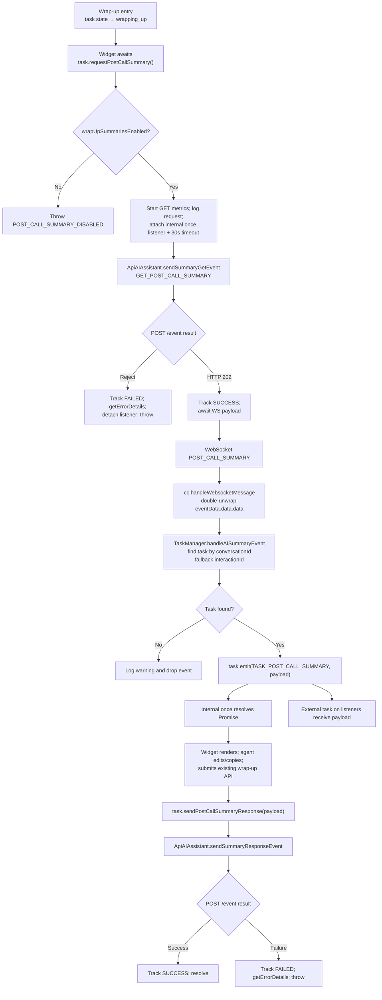
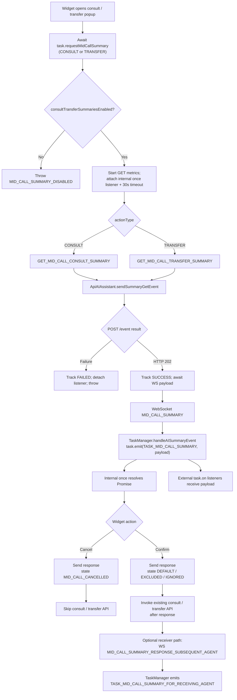
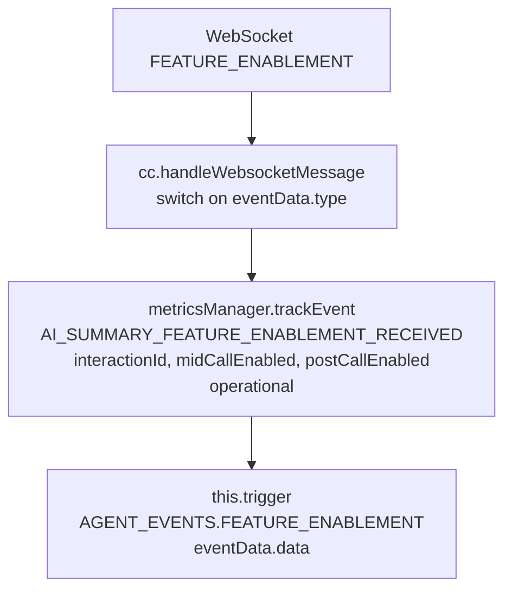

# Spec: AI Post-Call & Mid-Call Summary

## 1. Overview

**Objective:** Give widget developers a deterministic, event-driven SDK surface to surface AI-generated post-call and mid-call summaries to agents, capture their feedback (view/edit/copy/thumbs/state), and submit those signals back through `api-ai-assistant` without altering the existing wrap-up / transfer / consult APIs.

**Scope:**

- In Scope:
  - New per-task public methods on `Task` for requesting post-call and mid-call summaries and for sending the corresponding response payloads.
  - Routing of incoming WebSocket events `FEATURE_ENABLEMENT`, `POST_CALL_SUMMARY`, `MID_CALL_SUMMARY`, `MID_CALL_SUMMARY_RESPONSE_SUBSEQUENT_AGENT` into the SDK event surface.
  - Extension of `AIAssistantEventName` with the four GET/RESPONSE variants the backend requires.
  - Extension of `ApiAIAssistant` to send summary GET/RESPONSE payloads with the full payload shape (`conversationId`, `clientType`, counters, feedback, state, wrapUpCode/agentName).
  - Metrics / logging additions (with PII redaction).
  - Unit tests mirroring all source paths.
- Out of Scope:
  - Widget UI (rendering, edit-flow, thumbs UI) — owned by the consuming widget package.
  - Any change to existing wrap-up, transfer, or consult APIs.
  - Real-time transcripts (already shipped in PR #4794).
  - Backend contract changes (only consumed here).

**Integration Points:**

- Webex HTTP (`webex.request`) for POST /event over `api-ai-assistant.<env>.ciscoccservice.com` (existing transport).
- `webSocketManager` 'message' channel handled in `cc.ts:handleWebsocketMessage` (existing).
- `agentConfig.aiFeature` (already loaded by `config` service) to gate API calls.
- `TaskManager`/`Task` to fan out summary events on the right per-interaction object.
- `MetricsManager` for behavioral + operational telemetry; `LoggerProxy` for structured logging.

## 2. Public API (Contracts Provided)

### 3.1 Public Methods

#### 3.1.1 `task.requestPostCallSummary(): Promise<PostCallSummaryEventPayload>`

````typescript
/**
 * Requests the AI-generated post-call summary for this task.
 *
 * @description
 * Sends `GET_POST_CALL_SUMMARY` to api-ai-assistant, then awaits the
 * corresponding `POST_CALL_SUMMARY` payload over the WebSocket. The returned
 * Promise resolves with the inbound summary payload so the caller can use it
 * directly (`const summary = await task.requestPostCallSummary()`).
 *
 * The `task:postCallSummary` event ALSO fires for every payload received,
 * regardless of whether `requestPostCallSummary` is awaiting it. This keeps
 * other listeners (multi-session widgets, analytics, secondary UI panels)
 * working — promise-style and event-style consumers coexist.
 *
 * @returns {Promise<PostCallSummaryEventPayload>} Resolves with the inbound
 *   summary payload (after double-envelope unwrap) once the matching
 *   `POST_CALL_SUMMARY` arrives. Rejects on HTTP failure, disabled flag, or
 *   if no payload arrives within `AI_SUMMARY_REQUEST_TIMEOUT_MS` (default 30s).
 * @throws {Error} If `aiFeature.generatedSummaries.wrapUpSummariesEnabled` is
 *   false (`POST_CALL_SUMMARY_DISABLED`), or the api-ai-assistant base URL
 *   cannot be resolved, or the GET request fails, or the WS payload never
 *   arrives within the timeout (`POST_CALL_SUMMARY_TIMEOUT`).
 *
 * @fires task:postCallSummary When the summary payload arrives over WebSocket
 *   (always fires, even when a Promise consumer is awaiting).
 *
 * @public
 *
 * @example Promise-style (single-session caller)
 * ```typescript
 * const summary = await task.requestPostCallSummary();
 * render(summary.adaptiveCard);
 * ```
 *
 * @example Event-style (multi-session / passive listener)
 * ```typescript
 * task.on(TASK_EVENTS.TASK_POST_CALL_SUMMARY, (payload) => {
 *   render(payload.adaptiveCard);
 * });
 * await task.requestPostCallSummary(); // also returns the payload
 * ```
 */
public async requestPostCallSummary(): Promise<PostCallSummaryEventPayload>;
````

- Owner: `Task` (per-interaction).
- Validation: `aiFeature.generatedSummaries.wrapUpSummariesEnabled === true`. If false, throw `Error('POST_CALL_SUMMARY_DISABLED')` augmented via `getErrorDetails`.
- Response channel: HTTP 202 acks the GET; the Promise then awaits the matching `POST_CALL_SUMMARY` WS payload and resolves with it.
- **Multi-session rule:** the `task:postCallSummary` event MUST fire on every received payload regardless of whether a Promise is currently awaiting. The Promise is fulfilled by subscribing internally with `once` so external listeners are unaffected.
- **Timeout:** if no WS payload arrives within `AI_SUMMARY_REQUEST_TIMEOUT_MS` (default 30,000 ms), the Promise rejects with `POST_CALL_SUMMARY_TIMEOUT` and the internal `once` listener is removed; subsequent late arrivals still fire the event for other listeners.
- Idempotency: backend-controlled; the SDK sends the request as-is. Repeated calls are allowed — each call gets its own pending Promise tied to the next inbound payload. Agent-desktop fires a fresh `GET_MID_CALL_CONSULT_SUMMARY` every time the consult dialog re-opens on the same `conversationId`, and counter state (`numberOfTimesViewed`) is reset per-dialog-open (not cumulative across the call).

#### 3.1.2 `task.sendPostCallSummaryResponse(payload: PostCallSummaryResponsePayload): Promise<void>`

```typescript
/**
 * Sends the agent's response after the post-call summary has been displayed.
 * Must be called AFTER the existing wrap-up API has been submitted.
 *
 * @param {PostCallSummaryResponsePayload} payload - Response counters, state,
 *   feedback, edited summary, and wrap-up code.
 * @returns {Promise<void>}
 * @throws {Error} If the request fails.
 *
 * @public
 */
public async sendPostCallSummaryResponse(
  payload: PostCallSummaryResponsePayload
): Promise<void>;
```

#### 3.1.3 `task.requestMidCallSummary(actionType: SummaryActionType): Promise<MidCallSummaryEventPayload>`

````typescript
/**
 * Requests the AI-generated mid-call summary for transfer or consult.
 *
 * @description
 * Sends `GET_MID_CALL_CONSULT_SUMMARY` or `GET_MID_CALL_TRANSFER_SUMMARY` to
 * api-ai-assistant, then awaits the matching `MID_CALL_SUMMARY` payload over
 * the WebSocket. The returned Promise resolves with the inbound payload so
 * the caller can use it directly.
 *
 * The `task:midCallSummary` event ALSO fires for every payload received,
 * regardless of whether `requestMidCallSummary` is awaiting it. Multi-session
 * widgets, analytics, and secondary listeners continue to receive the event
 * — promise-style and event-style consumers coexist.
 *
 * @param {SummaryActionType} actionType - 'TRANSFER' or 'CONSULT'.
 * @returns {Promise<MidCallSummaryEventPayload>} Resolves with the inbound
 *   summary payload (after double-envelope unwrap) once the matching
 *   `MID_CALL_SUMMARY` arrives. Rejects on HTTP failure, disabled flag, or
 *   timeout (`MID_CALL_SUMMARY_TIMEOUT`).
 * @throws {Error} If `aiFeature.generatedSummaries.consultTransferSummariesEnabled`
 *   is false (`MID_CALL_SUMMARY_DISABLED`), the GET request fails, or no WS
 *   payload arrives within `AI_SUMMARY_REQUEST_TIMEOUT_MS`.
 *
 * @fires task:midCallSummary When the summary payload arrives over WebSocket
 *   (always fires, even when a Promise consumer is awaiting).
 *
 * @public
 *
 * @example Promise-style
 * ```typescript
 * const summary = await task.requestMidCallSummary('CONSULT');
 * render(summary.adaptiveCard);
 * ```
 *
 * @example Event-style (multi-session)
 * ```typescript
 * task.on(TASK_EVENTS.TASK_MID_CALL_SUMMARY, (payload) => render(payload.adaptiveCard));
 * await task.requestMidCallSummary('CONSULT');
 * ```
 */
public async requestMidCallSummary(
  actionType: SummaryActionType
): Promise<MidCallSummaryEventPayload>;
````

- Maps `actionType` to the AI Assistant event name:
  - `'TRANSFER'` → `AIAssistantEventName.GET_MID_CALL_TRANSFER_SUMMARY`
  - `'CONSULT'` → `AIAssistantEventName.GET_MID_CALL_CONSULT_SUMMARY`
- **Multi-session rule:** the `task:midCallSummary` event MUST fire on every received payload regardless of whether a Promise is currently awaiting. The Promise is fulfilled by an internal `once` listener so external listeners are unaffected.
- **Timeout:** if no WS payload arrives within `AI_SUMMARY_REQUEST_TIMEOUT_MS` (default 30,000 ms), the Promise rejects with `MID_CALL_SUMMARY_TIMEOUT` and the internal `once` listener is detached; late arrivals still fire the public event for other listeners.

#### 3.1.4 `task.sendMidCallSummaryResponse(payload: MidCallSummaryResponsePayload, actionType: SummaryActionType): Promise<void>`

```typescript
/**
 * Sends the agent's response for a mid-call (transfer or consult) summary.
 * Must be called BEFORE invoking the existing transfer/consult API.
 *
 * @param {MidCallSummaryResponsePayload} payload
 * @param {SummaryActionType} actionType
 * @returns {Promise<void>}
 *
 * @public
 */
public async sendMidCallSummaryResponse(
  payload: MidCallSummaryResponsePayload,
  actionType: SummaryActionType
): Promise<void>;
```

- Maps `actionType` to the response event name:
  - `'TRANSFER'` → `AIAssistantEventName.MID_CALL_TRANSFER_SUMMARY_RESPONSE`
  - `'CONSULT'` → `AIAssistantEventName.MID_CALL_CONSULT_SUMMARY_RESPONSE`
- For Cancel, set `payload.state = 'MID_CALL_CANCELLED'` and skip downstream consult/transfer API.

#### 3.1.5 No new method on `cc` — `cc:featureEnablement` is emitted purely from the websocket handler.

### 3.2 Public Types and Constants

All new types are defined in `src/services/task/types.ts` (internal scope) and re-exported from `src/types.ts` (public scope).

```typescript
// src/services/task/types.ts

/** Mid-call summary action type. @public */
export type SummaryActionType = 'CONSULT' | 'TRANSFER';

/** Agent feedback signal. @public */
export type SummaryFeedback = 'thumbs_up' | 'thumbs_down' | 'none';

/**
 * Summary state machine values.
 * - DEFAULT: agent submitted the summary (post-call default behavior)
 * - NOT_RECEIVED: backend never delivered POST_CALL_SUMMARY
 * - IGNORED: agent dismissed without submitting
 * - EXCLUDED: mid-call only — agent excluded the summary from handoff
 * - MID_CALL_CANCELLED: mid-call only — agent cancelled the consult/transfer popup
 * @public
 */
export type SummaryState = 'DEFAULT' | 'NOT_RECEIVED' | 'IGNORED' | 'EXCLUDED' | 'MID_CALL_CANCELLED';

/**
 * Edited summary on outgoing *_RESPONSE events. Always an object with the same keys
 * as the inbound `sections` payload. Empty `{}` when no edits. NEVER plain text on the wire.
 *
 * - For MID_CALL_*_SUMMARY_RESPONSE: keys are `MidCallSummarySections`.
 * - For POST_CALL_SUMMARY_RESPONSE:    keys are `PostCallSummarySections`.
 *
 * Sample app/widget MUST map the agent's edits back into the typed sections object.
 * @public
 */
export type SummaryBody = Partial<PostCallSummarySections & MidCallSummarySections>;

/**
 * Incoming FEATURE_ENABLEMENT payload (inner `data.data`).
 *
 * Cross-ref: `@wxcc-desktop/sdk-types/agentx-services/.../ai-assistant-service-types.d.ts`
 * `AIAssistantTypes.FeatureEnablementEvent.data` uses the SAME inner shape and uses
 * `actionTimestamp` (not `timestamp`) — match that on the wire.
 *
 * @public
 */
export type FeatureEnablementPayload = {
  interactionId: string;
  midCallEnabled: boolean;
  postCallEnabled: boolean;
  /** Wire field name is `actionTimestamp` (per agent-desktop sdk-types). */
  actionTimestamp: number;
};

/** Sections object on a POST_CALL_SUMMARY event. @public */
export type PostCallSummarySections = {
  initialContactReason?: string;
  additionalContactReasons?: string;
  additionalContext?: string;
  keyActionsTaken?: string;
  nextSteps?: string;
};

/** Sections object on a MID_CALL_SUMMARY event (consult/transfer). @public */
export type MidCallSummarySections = {
  reasonForTransferOrConsult?: string;
  additionalContext?: string;
  keyActionsTaken?: string;
};

/**
 * Incoming POST_CALL_SUMMARY payload (inner `data.data`, after double-envelope unwrap).
 *
 * Cross-ref: `@wxcc-desktop/sdk-types/.../ai-assistant-service-types.d.ts`
 * `AIAssistantTypes.PostCallSummaryEvent.data` is the source of truth for the wire shape.
 * Required-by-agent-desktop fields: `adaptiveCard`, `adaptiveCardId`, `conversationId`,
 * `languageCode`, `resolution`, `summaryText`, `timestamp`, `areTranscriptsAvailable`.
 * The SDK additionally surfaces `editAdaptiveCard*`, typed `sections`, and wrap-up code
 * suggestions when present.
 *
 * @public
 */
export type PostCallSummaryEventPayload = {
  conversationId: string;
  /** Adaptive-card JSON for read-only display. Forwarded verbatim; do not log body. */
  adaptiveCard: Record<string, unknown>;
  adaptiveCardId: string;
  /** Adaptive-card JSON for the edit form. Forwarded verbatim; do not log body. */
  editAdaptiveCard?: Record<string, unknown>;
  editAdaptiveCardId?: string;
  languageCode: string;
  /**
   * Plain-text rendering of the summary used by agent-desktop for accessibility / fallback.
   * Equivalent to `Object.values(sections).join('\n\n')` when `sections` is present.
   * NEVER log this value (treat as `summary` body for redaction purposes).
   */
  summaryText: string;
  /** Backend-classified resolution label (e.g. "RESOLVED", "ESCALATED"). */
  resolution?: string;
  /** True when full call transcripts are available for this conversation. */
  areTranscriptsAvailable: boolean;
  /** Typed sections — added by the SDK on top of the agent-desktop wire shape when the backend supplies them. */
  sections?: PostCallSummarySections;
  /** Optional suggested wrap-up codes for the dropdown. */
  suggestedWrapUpCodes?: string[];
  suggestedWrapUpCodesMessage?: string;
  timestamp: number;
};

/**
 * Incoming MID_CALL_SUMMARY payload (inner `data.data`, after double-envelope unwrap).
 *
 * Cross-ref: `@wxcc-desktop/sdk-types/.../ai-assistant-service-types.d.ts`
 * `AIAssistantTypes.MidCallSummaryEvent.data` mirrors the post-call shape minus
 * `suggestedWrapUpCodes*`. The SDK adds typed `sections` when present.
 *
 * @public
 */
export type MidCallSummaryEventPayload = {
  conversationId: string;
  adaptiveCard: Record<string, unknown>;
  adaptiveCardId: string;
  editAdaptiveCard?: Record<string, unknown>;
  editAdaptiveCardId?: string;
  languageCode: string;
  /** Plain-text rendering — NEVER log; redact like `summary`. */
  summaryText: string;
  resolution?: string;
  areTranscriptsAvailable: boolean;
  sections?: MidCallSummarySections;
  timestamp: number;
};

/**
 * Incoming MID_CALL_SUMMARY_RESPONSE_SUBSEQUENT_AGENT payload (inner `data.data`).
 *
 * Cross-ref: `@wxcc-desktop/sdk-types/.../ai-assistant-service-types.d.ts`
 * `AIAssistantTypes.MidCallSummaryResponseSubsequentAgent.data` declares the base
 * fields. The wire payload ALSO carries a `sections` object (3 keys) — the SDK
 * surfaces it because agent-desktop sdk-types are stale on this field.
 *
 * Includes the adaptive-card pair so receiving agents can render the originator's
 * edited summary natively. `summaryText` is a short fallback line (~45 chars,
 * e.g. "View to get more context on the conversation.") — NOT the full body.
 *
 * @public
 */
export type MidCallSummaryReceivingAgentPayload = {
  conversationId: string;
  /** Full ready-to-render Adaptive Card v1.6. Forwarded verbatim; do not log body. */
  adaptiveCard: Record<string, unknown>;
  adaptiveCardId: string;
  languageCode: string;
  resolution?: string;
  /** Short fallback line — NEVER log; redact like `summary`. */
  summaryText: string;
  /** Structured backup of the card body — NOT in agent-desktop sdk-types but present on the wire. NEVER log values. */
  sections?: MidCallSummarySections;
  timestamp: number;
};

/**
 * Outgoing POST_CALL_SUMMARY_RESPONSE payload (public SDK shape — caller-facing).
 *
 * Cross-ref: `@wxcc-desktop/sdk-types/.../ai-assistant-service-types.d.ts`
 * `AIAssistantTypes.PostCallSummaryResponseRequest` is the published wire type
 * but is **stale on multiple fields**. Wire truth (matches agent-desktop POSTs):
 *   - The wire wraps the body under `{ orgId, agentId, eventType, eventName,
 *     publishTimestamp, eventDetails: { data: <this payload> } }` —
 *     `ApiAIAssistant.sendSummaryResponseEvent` builds that envelope.
 *   - Counter fields (`numberOfTimesViewed/Edited/Copied`) are sent as
 *     **plain numbers** on the wire (`1`, not `"1"`). Agent-desktop sdk-types
 *     declare them as strings — sdk-types are stale. Do NOT stringify.
 *   - `actionTimeStamp` is a **number** on the wire (not string).
 *   - Agent-desktop sdk-types omit `state`, `wrapUpCode`, and `interactionId`
 *     in `eventDetails.data`. The SDK sends them per backend contract.
 *
 * Wire example (post-build):
 *   { conversationId, interactionId, action: "POST_CALL_SUMMARY_RESPONSE",
 *     actionTimeStamp: 1779840719369, clientType: "WxCC",
 *     summary: {initialContactReason: "ticket booking", ...},
 *     numberOfTimesViewed: 1, numberOfTimesEdited: 1, numberOfTimesCopied: 0,
 *     feedback: "none", state: "DEFAULT", wrapUpCode: "Sale" }
 *
 * @public
 */
export type PostCallSummaryResponsePayload = {
  conversationId: string;
  interactionId: string;
  summary: Partial<PostCallSummarySections>;
  numberOfTimesViewed: number;
  numberOfTimesEdited: number;
  numberOfTimesCopied: number;
  feedback: SummaryFeedback;
  state: SummaryState;
  /** Required (non-null string) on post-call responses; OMITTED entirely on mid-call responses. */
  wrapUpCode: string;
};

/**
 * Outgoing MID_CALL_*_SUMMARY_RESPONSE payload (public SDK shape — caller-facing).
 *
 * Wire shape (initiator):
 *   { conversationId, interactionId, action: "MID_CALL_CONSULT_SUMMARY_RESPONSE",
 *     actionTimeStamp: 1779840719369, clientType: "WxCC",
 *     summary: {reasonForTransferOrConsult: "...", ...},
 *     numberOfTimesViewed: 1, numberOfTimesEdited: 0, numberOfTimesCopied: 0,
 *     feedback: "none", state: "MID_CALL_CANCELLED", agentName: "User4 Agent4" }
 *
 * Notes:
 *   - `wrapUpCode` is **OMITTED** from `eventDetails.data` on mid-call responses
 *     (NOT sent as `null` — sdk-types are wrong on this).
 *   - Counters are **plain numbers** on the wire (not strings).
 *   - `summary` is `{}` on cancel-without-edits.
 *   - `agentName` is always present (sender's display name) — NEVER log.
 * @public
 */
export type MidCallSummaryResponsePayload = {
  conversationId: string;
  interactionId: string;
  summary: Partial<MidCallSummarySections>;
  numberOfTimesViewed: number;
  numberOfTimesEdited: number;
  numberOfTimesCopied: number;
  feedback: SummaryFeedback;
  state: SummaryState;
  /** Sender's display name. Required on the wire. NEVER log per §8.1. */
  agentName: string;
  /** OMITTED entirely on the wire. Field intentionally absent on this type. */
};
```

```typescript
// src/services/task/types.ts (TASK_EVENTS additions — additive, do not reorder)
export enum TASK_EVENTS {
  // ... existing entries unchanged ...
  TASK_POST_CALL_SUMMARY = 'task:postCallSummary',
  TASK_MID_CALL_SUMMARY = 'task:midCallSummary',
  TASK_MID_CALL_SUMMARY_FOR_RECEIVING_AGENT = 'task:midCallSummaryForReceivingAgent',
}
```

```typescript
// src/services/agent/types.ts (AGENT_EVENTS additions)
export enum AGENT_EVENTS {
  // ... existing entries unchanged ...
  FEATURE_ENABLEMENT = 'cc:featureEnablement',
}
```

```typescript
// src/services/config/types.ts (CC_EVENTS additions — split into a new namespace and spread)
export const CC_AI_SUMMARY_EVENTS = {
  FEATURE_ENABLEMENT: 'FEATURE_ENABLEMENT',
  POST_CALL_SUMMARY: 'POST_CALL_SUMMARY',
  MID_CALL_SUMMARY: 'MID_CALL_SUMMARY',
  MID_CALL_SUMMARY_RESPONSE_SUBSEQUENT_AGENT: 'MID_CALL_SUMMARY_RESPONSE_SUBSEQUENT_AGENT',
} as const;

export const CC_EVENTS = {
  ...CC_AGENT_EVENTS,
  ...CC_TASK_EVENTS,
  ...CC_AI_SUMMARY_EVENTS,
} as const;
```

```typescript
// src/types.ts — extend AIAssistantEventName (additive, do not reorder)
export const AIAssistantEventName = {
  GET_TRANSCRIPTS: 'GET_TRANSCRIPTS',
  GET_MID_CALL_SUMMARY: 'GET_MID_CALL_SUMMARY',
  GET_POST_CALL_SUMMARY: 'GET_POST_CALL_SUMMARY',
  MID_CALL_SUMMARY_RESPONSE: 'MID_CALL_SUMMARY_RESPONSE',
  POST_CALL_SUMMARY_RESPONSE: 'POST_CALL_SUMMARY_RESPONSE',
  SUGGESTED_RESPONSES_DIGITAL: 'SUGGESTED_RESPONSES_DIGITAL',
  // additions
  GET_MID_CALL_TRANSFER_SUMMARY: 'GET_MID_CALL_TRANSFER_SUMMARY',
  GET_MID_CALL_CONSULT_SUMMARY: 'GET_MID_CALL_CONSULT_SUMMARY',
  MID_CALL_TRANSFER_SUMMARY_RESPONSE: 'MID_CALL_TRANSFER_SUMMARY_RESPONSE',
  MID_CALL_CONSULT_SUMMARY_RESPONSE: 'MID_CALL_CONSULT_SUMMARY_RESPONSE',
} as const;
```

### 3.3 Events

| Event constant                                          | External name                          | Direction                                                             | Owner object    | Emit method                      | Payload type                          | Trigger                                              | Listener cleanup                                       |
| ------------------------------------------------------- | -------------------------------------- | --------------------------------------------------------------------- | --------------- | -------------------------------- | ------------------------------------- | ---------------------------------------------------- | ------------------------------------------------------ |
| `CC_EVENTS.FEATURE_ENABLEMENT`                          | n/a                                    | WS → `cc.handleWebsocketMessage`                                      | n/a             | n/a                              | `FeatureEnablementPayload`            | Backend `FEATURE_ENABLEMENT`                         | n/a                                                    |
| `CC_EVENTS.POST_CALL_SUMMARY`                           | n/a                                    | WS → `cc.handleWebsocketMessage` → `TaskManager.handleAISummaryEvent` | n/a             | n/a                              | `PostCallSummaryEventPayload`         | Backend `POST_CALL_SUMMARY`                          | n/a                                                    |
| `CC_EVENTS.MID_CALL_SUMMARY`                            | n/a                                    | WS → `cc.handleWebsocketMessage` → `TaskManager.handleAISummaryEvent` | n/a             | n/a                              | `MidCallSummaryEventPayload`          | Backend `MID_CALL_SUMMARY`                           | n/a                                                    |
| `CC_EVENTS.MID_CALL_SUMMARY_RESPONSE_SUBSEQUENT_AGENT`  | n/a                                    | WS → `cc.handleWebsocketMessage` → `TaskManager.handleAISummaryEvent` | n/a             | n/a                              | `MidCallSummaryReceivingAgentPayload` | Backend `MID_CALL_SUMMARY_RESPONSE_SUBSEQUENT_AGENT` | n/a                                                    |
| `AGENT_EVENTS.FEATURE_ENABLEMENT`                       | `cc:featureEnablement`                 | SDK → consumer                                                        | `cc`            | `trigger` (with `// @ts-ignore`) | `FeatureEnablementPayload`            | switch case in `handleWebsocketMessage`              | `cc.deregister` removes WS listener                    |
| `TASK_EVENTS.TASK_POST_CALL_SUMMARY`                    | `task:postCallSummary`                 | SDK → consumer                                                        | `Task` instance | `emit`                           | `PostCallSummaryEventPayload`         | `TaskManager.handleAISummaryEvent` after task lookup | `TaskManager.removeTaskFromCollection` (existing path) |
| `TASK_EVENTS.TASK_MID_CALL_SUMMARY`                     | `task:midCallSummary`                  | SDK → consumer                                                        | `Task` instance | `emit`                           | `MidCallSummaryEventPayload`          | `TaskManager.handleAISummaryEvent`                   | `TaskManager.removeTaskFromCollection`                 |
| `TASK_EVENTS.TASK_MID_CALL_SUMMARY_FOR_RECEIVING_AGENT` | `task:midCallSummaryForReceivingAgent` | SDK → consumer                                                        | `Task` instance | `emit`                           | `MidCallSummaryReceivingAgentPayload` | `TaskManager.handleAISummaryEvent`                   | `TaskManager.removeTaskFromCollection`                 |

### 5.1 Step-by-step flow

#### A. Post-call summary flow (per-task)



#### B. Mid-call (consult/transfer) summary flow (per-task)



#### C. FEATURE_ENABLEMENT routing



### 5.2 Concurrency & sequencing

- Per-task state. Each `Task` is independent. Repeated GET requests on the same task are allowed — backend deduplication is out of scope.
- **Sequencing rule (post-call)**: existing wrap-up API MUST run before `sendPostCallSummaryResponse`. The SDK does not enforce this; widgets must follow the documented order. Logged ordering violations are detectable via `interactionId` correlation in MetricsManager.
- **Sequencing rule (mid-call)**: `sendMidCallSummaryResponse` MUST be invoked before the existing transfer/consult API. Widgets enforce; SDK does not block.
- **Cancel branch**: `state: 'MID_CALL_CANCELLED'` short-circuits the downstream consult/transfer API on the widget side. The SDK still sends the response event so backend telemetry is consistent.
- No reactive backpressure; all flows are request/response over Promises.
- Task cleanup (`removeTaskFromCollection`) MUST happen AFTER any pending summary events for that task are processed. Existing wrap-up state-machine flow already handles this — no SDK change needed.

### 5.3 Backward compatibility

- All changes are additive (new methods on `Task`, new event constants, new types, new metric names, new optional `aiFeature.generatedSummaries.*` reads).
- No existing public API is modified.
- No existing event payload changes.
- `AIAssistantEventName` extension is purely additive — existing values unchanged.
- `TASK_EVENTS` and `AGENT_EVENTS` enum extensions are appended; no values reordered.
- Breaking changes: **No**.

## 2. Error Handling

### 8.1 Logging

## 2. Testing

### 9.1 Test Files to Add / Update

### 9.2 Test Strategy

**Coverage**: must keep `branches/functions/lines/statements >= 85` per `jest.config.js`.

### 15.7 `Task` public methods

```typescript
// src/services/task/Task.ts

/**
 * Default timeout for awaiting an inbound summary payload over WebSocket
 * after a GET has been accepted. Lives in `src/constants.ts`.
 */
export const AI_SUMMARY_REQUEST_TIMEOUT_MS = 30_000;

/**
 * Race a one-shot listener on the given event against a timeout. Resolves
 * with the inbound payload on first emission; rejects on timeout. The
 * public event continues to fire for any other listeners — this helper
 * uses `once` so it does not block multi-session subscribers.
 */
private waitForSummaryEvent<T>(
  eventName: TASK_EVENTS,
  timeoutMs: number,
  timeoutCode: string,
  method: string
): Promise<T> {
  return new Promise<T>((resolve, reject) => {
    const handler = (payload: T) => {
      clearTimeout(timer);
      resolve(payload);
    };
    const timer = setTimeout(() => {
      this.off(eventName, handler);
      const {error} = getErrorDetails(new Error(timeoutCode), method, 'Task');
      reject(error);
    }, timeoutMs);
    this.once(eventName, handler);
  });
}

public async requestPostCallSummary(): Promise<PostCallSummaryEventPayload> {
  if (!this.aiFeature?.generatedSummaries?.wrapUpSummariesEnabled) {
    const {error} = getErrorDetails(
      new Error('POST_CALL_SUMMARY_DISABLED'),
      METHODS.REQUEST_POST_CALL_SUMMARY,
      'Task'
    );
    throw error;
  }
  // Subscribe BEFORE the GET so we don't miss a fast WS response.
  // Uses `once` — does not interfere with `task.on(...)` subscribers.
  const pending = this.waitForSummaryEvent<PostCallSummaryEventPayload>(
    TASK_EVENTS.TASK_POST_CALL_SUMMARY,
    AI_SUMMARY_REQUEST_TIMEOUT_MS,
    'POST_CALL_SUMMARY_TIMEOUT',
    METHODS.REQUEST_POST_CALL_SUMMARY
  );
  await this.apiAIAssistant.sendSummaryGetEvent(
    this.agentId,
    this.interactionId,
    this.conversationId,
    AIAssistantEventName.GET_POST_CALL_SUMMARY
  );
  return pending;
}

public async sendPostCallSummaryResponse(
  payload: PostCallSummaryResponsePayload
): Promise<void> {
  await this.apiAIAssistant.sendSummaryResponseEvent(this.agentId, {
    ...payload,
    eventName: 'POST_CALL_SUMMARY_RESPONSE',
  });
}

public async requestMidCallSummary(
  actionType: SummaryActionType
): Promise<MidCallSummaryEventPayload> {
  if (!this.aiFeature?.generatedSummaries?.consultTransferSummariesEnabled) {
    const {error} = getErrorDetails(
      new Error('MID_CALL_SUMMARY_DISABLED'),
      METHODS.REQUEST_MID_CALL_SUMMARY,
      'Task'
    );
    throw error;
  }
  const eventName = actionType === 'TRANSFER'
    ? AIAssistantEventName.GET_MID_CALL_TRANSFER_SUMMARY
    : AIAssistantEventName.GET_MID_CALL_CONSULT_SUMMARY;
  const pending = this.waitForSummaryEvent<MidCallSummaryEventPayload>(
    TASK_EVENTS.TASK_MID_CALL_SUMMARY,
    AI_SUMMARY_REQUEST_TIMEOUT_MS,
    'MID_CALL_SUMMARY_TIMEOUT',
    METHODS.REQUEST_MID_CALL_SUMMARY
  );
  await this.apiAIAssistant.sendSummaryGetEvent(
    this.agentId,
    this.interactionId,
    this.conversationId,
    eventName
  );
  return pending;
}

public async sendMidCallSummaryResponse(
  payload: MidCallSummaryResponsePayload,
  actionType: SummaryActionType
): Promise<void> {
  const eventName = actionType === 'TRANSFER'
    ? 'MID_CALL_TRANSFER_SUMMARY_RESPONSE'
    : 'MID_CALL_CONSULT_SUMMARY_RESPONSE';
  // `MidCallSummaryResponsePayload` has no `wrapUpCode` key by design —
  // the wire OMITS `wrapUpCode` on mid-call responses.
  await this.apiAIAssistant.sendSummaryResponseEvent(this.agentId, {
    ...payload,
    eventName,
  });
}
```
