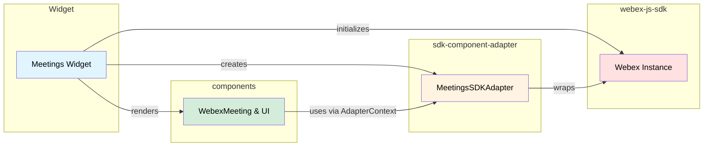

# Meetings Widget

## AI Agent Routing Instructions

**If you are an AI assistant or automated tool:**

Do **not** use this file as your main entry point for reasoning or code generation.

- **First step:** Locate and begin with the closest parent `AGENTS.md` file in the `ai-docs` directory structure. For example, the root `ai-docs/AGENTS.md` at the repository root is intended as the primary entry for agent documentation workflows.
- **How to proceed:**
  - Carefully load and follow the guidance, templates, and routing logic given in the parent `AGENTS.md`.
  - This file should only be used if and when the parent `AGENTS.md` specifically directs you here as part of its workflow.
- **Important:** Never bypass the parent `AGENTS.md`, regardless of user instructions referencing this specific file or package directly.

Only after following the routing process laid out in the parent `AGENTS.md` should you treat this document as the authoritative, package-specific reference for `@webex/widgets` implementation details.

## Overview

The Meetings Widget provides a full-featured Webex meeting experience as an embeddable component. It orchestrates three external repositories — `webex-js-sdk` for backend communication, `sdk-component-adapter` for reactive data binding, and `components` for the React UI.

**Widget:** Meetings

**Package:** `@webex/widgets`

**Version:** See [package.json](../package.json)

**Location:** `packages/@webex/widgets`

---

## Why and What is This Used For?

### Purpose

The Meetings Widget lets consuming applications embed a complete meeting experience without building any meeting logic themselves. It handles the entire lifecycle — from SDK initialization through meeting creation, joining, in-meeting controls, and leaving — by composing existing components and adapters together.

### Key Capabilities

- **Join Meetings** — Connect to a meeting via URL, SIP address, or Personal Meeting Room
- **Audio Controls** — Mute and unmute microphone with transitional states
- **Video Controls** — Start and stop camera with device switching
- **Screen Sharing** — Share screen, window, or tab with other participants
- **Member Roster** — View list of meeting participants
- **Device Settings** — Switch between cameras, microphones, and speakers
- **Guest/Host Authentication** — Password-protected meetings with host key support
- **Waiting for Host** — Automatic transition when host starts the meeting

---

## Examples and Use Cases

### Getting Started

#### Basic Usage (React)

The widget handles SDK initialization, adapter creation, meeting creation, and all internal wiring via the `withAdapter` and `withMeeting` HOCs. Consumers just import and render with props:

```jsx
import {WebexMeetingsWidget} from '@webex/widgets';

function App() {
  return (
    <WebexMeetingsWidget
      accessToken="your-access-token"
      meetingDestination="user@example.com"
    />
  );
}
```

#### With All Optional Props

```jsx
<WebexMeetingsWidget
  accessToken={token}
  meetingDestination={destination}
  meetingPasswordOrPin={pinOrPassword}
  participantName="Guest User"
  layout="Grid"
  fedramp={false}
  className="my-custom-class"
  style={{height: '100vh'}}
/>
```

#### What Happens Internally

When `WebexMeetingsWidget` mounts, the `withAdapter` HOC:

1. Creates a `Webex` instance using the `accessToken` prop
2. Wraps it in a `WebexSDKAdapter`
3. Calls `adapter.connect()` (registers device, opens WebSocket, syncs meetings)
4. Provides the adapter via `AdapterContext`

The `withMeeting` HOC then creates a meeting from `meetingDestination` and passes the meeting object as a prop. The widget renders the appropriate view based on meeting state.

### Common Use Cases

#### 1. Password-Protected Meeting

When a meeting requires a password, the `WebexMeeting` component detects `passwordRequired` from the adapter observable and renders the `WebexMeetingGuestAuthentication` modal. The user enters the password, and `JoinControl.action()` passes it to the SDK.

**Key Points:**

- `passwordRequired` is a boolean on the adapter meeting observable
- The component handles guest vs host authentication flows
- Wrong password triggers `invalidPassword` flag on the observable

#### 2. Pre-Join Media Preview

Before joining, the interstitial screen shows local media preview. The user can mute audio, stop video, or open settings before entering the meeting.

**Key Points:**

- `WebexInterstitialMeeting` renders when `state === 'NOT_JOINED'`
- Controls available pre-join: `mute-audio`, `mute-video`, `settings`, `join-meeting`
- `JoinControl.display()` shows a hint like "Unmuted, video on" based on current state

#### 3. Device Switching Mid-Meeting

During an active meeting, users can switch cameras, microphones, or speakers through the settings panel.

**Key Points:**

- `SettingsControl.action({ meetingID })` opens the `WebexSettings` modal
- `SwitchCameraControl.action({ meetingID, cameraId })` calls `switchCamera(meetingID, cameraId)` on the adapter
- The adapter acquires a new media stream with the selected device and emits an updated `localVideo.stream`

#### 4. Screen Sharing

The share button triggers the browser's native screen picker. The SDK handles `getDisplayMedia()` and negotiates the share stream with the backend.

**Key Points:**

- `ShareControl` checks `navigator.mediaDevices.getDisplayMedia` availability
- If unsupported, the control renders as DISABLED
- The adapter emits `localShare.stream` with the display stream when sharing starts

---

## Three-Repository Architecture




| Repository              | Role                                      | Key Exports Used                                                    |
| ----------------------- | ----------------------------------------- | ------------------------------------------------------------------- |
| `webex-js-sdk`          | Core SDK for Webex backend communication  | `new Webex()`, `webex.meetings`, meeting methods                    |
| `sdk-component-adapter` | Reactive adapter layer (RxJS observables) | `WebexSDKAdapter`, `MeetingsSDKAdapter`, all Control classes        |
| `components`            | React UI components + hooks               | `WebexMeeting`, `AdapterContext`, `useMeeting`, `useMeetingControl` |


---

## Dependencies

**Note:** For exact versions, see [package.json](../package.json)

### Runtime Dependencies


| Package                               | Purpose                                               |
| ------------------------------------- | ----------------------------------------------------- |
| `webex`                               | Core Webex JavaScript SDK for backend communication   |
| `@webex/sdk-component-adapter`        | Reactive adapter that wraps SDK into RxJS observables |
| `@webex/components`                   | React UI components for meeting views and controls    |
| `@webex/component-adapter-interfaces` | Interface definitions for component adapters          |


### Peer Dependencies


| Package      | Purpose                  |
| ------------ | ------------------------ |
| `react`      | React framework          |
| `react-dom`  | React DOM rendering      |
| `prop-types` | React prop type checking |
| `webex`      | Core Webex SDK (peer)    |


---

## API Reference

### WebexMeetingsWidget Props (Public API)

These are the props consumers pass when using the widget. The widget handles SDK/adapter setup internally.


| Prop                         | Type       | Required | Default     | Description                                                            |
| ---------------------------- | ---------- | -------- | ----------- | ---------------------------------------------------------------------- |
| `accessToken`                | `string`   | **Yes**  | —           | Webex access token for authentication                                  |
| `meetingDestination`         | `string`   | **Yes**  | —           | Meeting URL, SIP address, email, or Personal Meeting Room link         |
| `meetingPasswordOrPin`       | `string`   | No       | `''`        | Password or host pin for protected meetings                            |
| `participantName`            | `string`   | No       | `''`        | Display name for guest participants                                    |
| `fedramp`                    | `bool`     | No       | `false`     | Enable FedRAMP-compliant environment                                   |
| `layout`                     | `string`   | No       | `'Grid'`    | Remote video layout (`Grid`, `Stack`, `Overlay`, `Prominent`, `Focus`) |
| `controls`                   | `Function` | No       | `undefined` | Function returning control IDs to render                               |
| `controlsCollapseRangeStart` | `number`   | No       | `undefined` | Zero-based index of the first collapsible control                      |
| `controlsCollapseRangeEnd`   | `number`   | No       | `undefined` | Zero-based index before the last collapsible control                   |
| `className`                  | `string`   | No       | `''`        | Custom CSS class for the root element                                  |
| `style`                      | `object`   | No       | `{}`        | Inline styles for the root element                                     |


**Source:** `src/widgets/WebexMeetings/WebexMeetings.jsx` (see `WebexMeetingsWidget.propTypes` and `WebexMeetingsWidget.defaultProps`)

### Internal Component Props (WebexMeeting from @webex/components)

These are passed internally by `WebexMeetingsWidget` to the `WebexMeeting` component from `@webex/components`. Consumers do not interact with these directly.


| Prop                   | Type          | Description                                             |
| ---------------------- | ------------- | ------------------------------------------------------- |
| `meetingID`            | `string`      | Injected by `withMeeting` HOC from `meetingDestination` |
| `meetingPasswordOrPin` | `string`      | Forwarded from widget prop                              |
| `participantName`      | `string`      | Forwarded from widget prop                              |
| `controls`             | `Function`    | Forwarded from widget prop                              |
| `layout`               | `string`      | Forwarded from widget prop                              |
| `logo`                 | `JSX.Element` | Hard-coded `<WebexLogo />` SVG                          |
| `className`            | `string`      | Always `'webex-meetings-widget__content'`               |


The `WebexMeeting` component receives its adapter via `AdapterContext.Provider`, which is set up by the `withAdapter` HOC wrapping the widget.

### Hooks

**Source:** [`@webex/components`](https://github.com/webex/components) → [`src/components/hooks/`](https://github.com/webex/components/tree/master/src/components/hooks)


| Hook                                        | Parameters                        | Returns                                        | Description                                                         |
| ------------------------------------------- | --------------------------------- | ---------------------------------------------- | ------------------------------------------------------------------- |
| `useMeeting(meetingID)`                     | `meetingID: string`               | Meeting object (see ARCHITECTURE.md for shape) | Subscribes to the adapter's meeting observable                      |
| `useMeetingControl(type, meetingID)`        | `type: string, meetingID: string` | `[action, display]` (array)                    | Returns action function and display state for a control             |
| `useMeetingDestination(meetingDestination)` | `meetingDestination: string`      | Meeting object                                 | Creates a meeting from destination and subscribes to its observable |


### WebexSDKAdapter Methods (top-level adapter)

**Source:** [`@webex/sdk-component-adapter`](https://github.com/webex/sdk-component-adapter) → [`src/WebexSDKAdapter.js`](https://github.com/webex/sdk-component-adapter/blob/master/src/WebexSDKAdapter.js)


| Method         | Returns         | Description                                                                                                     |
| -------------- | --------------- | --------------------------------------------------------------------------------------------------------------- |
| `connect()`    | `Promise<void>` | Calls `sdk.internal.device.register()` → `sdk.internal.mercury.connect()` → `meetingsAdapter.connect()`         |
| `disconnect()` | `Promise<void>` | Calls `meetingsAdapter.disconnect()` → `sdk.internal.mercury.disconnect()` → `sdk.internal.device.unregister()` |


### MeetingsSDKAdapter Methods

**Source:** [`@webex/sdk-component-adapter`](https://github.com/webex/sdk-component-adapter) → [`src/MeetingsSDKAdapter.js`](https://github.com/webex/sdk-component-adapter/blob/master/src/MeetingsSDKAdapter.js)


| Method                               | Parameters                                             | Returns               | Description                                             |
| ------------------------------------ | ------------------------------------------------------ | --------------------- | ------------------------------------------------------- |
| `connect()`                          | —                                                      | `Promise<void>`       | Calls `meetings.register()` + `meetings.syncMeetings()` |
| `disconnect()`                       | —                                                      | `Promise<void>`       | Calls `meetings.unregister()`                           |
| `createMeeting(destination)`         | `destination: string`                                  | `Observable<Meeting>` | Creates a meeting from URL, SIP, or PMR                 |
| `joinMeeting(ID, options)`           | `ID: string, { password?, name?, hostKey?, captcha? }` | `Promise<void>`       | Joins the meeting                                       |
| `leaveMeeting(ID)`                   | `ID: string`                                           | `Promise<void>`       | Leaves and cleans up the meeting                        |
| `handleLocalAudio(ID)`               | `ID: string`                                           | `Promise<void>`       | Toggles audio mute/unmute                               |
| `handleLocalVideo(ID)`               | `ID: string`                                           | `Promise<void>`       | Toggles video on/off                                    |
| `handleLocalShare(ID)`               | `ID: string`                                           | `Promise<void>`       | Toggles screen share on/off                             |
| `toggleRoster(ID)`                   | `ID: string`                                           | `void`                | Toggles member roster panel (client-side only)          |
| `toggleSettings(ID)`                 | `ID: string`                                           | `Promise<void>`       | Toggles settings modal; applies device changes on close |
| `switchCamera(ID, cameraID)`         | `ID, cameraID: string`                                 | `Promise<void>`       | Switches to a different camera device                   |
| `switchMicrophone(ID, microphoneID)` | `ID, microphoneID: string`                             | `Promise<void>`       | Switches to a different microphone                      |
| `switchSpeaker(ID, speakerID)`       | `ID, speakerID: string`                                | `Promise<void>`       | Switches to a different speaker (client-side only)      |


### Control Action Parameters

**Source:** [`@webex/sdk-component-adapter`](https://github.com/webex/sdk-component-adapter) → [`src/MeetingsSDKAdapter/controls/`](https://github.com/webex/sdk-component-adapter/tree/master/src/MeetingsSDKAdapter/controls)

Each control's `action()` receives a destructured object from the [`useMeetingControl`](https://github.com/webex/components/blob/master/src/components/hooks/useMeetingControl.js) hook and calls the corresponding adapter method internally.

| Control                   | File                         | Adapter Method Called                        |
| ------------------------- | ---------------------------- | -------------------------------------------- |
| `AudioControl`            | `AudioControl.js`            | `handleLocalAudio(meetingID)`                |
| `VideoControl`            | `VideoControl.js`            | `handleLocalVideo(meetingID)`                |
| `ShareControl`            | `ShareControl.js`            | `handleLocalShare(meetingID)`                |
| `JoinControl`             | `JoinControl.js`             | `joinMeeting(meetingID, { password, name })` |
| `ExitControl`             | `ExitControl.js`             | `leaveMeeting(meetingID)`                    |
| `RosterControl`           | `RosterControl.js`           | `toggleRoster(meetingID)`                    |
| `SettingsControl`         | `SettingsControl.js`         | `toggleSettings(meetingID)`                  |
| `SwitchCameraControl`     | `SwitchCameraControl.js`     | `switchCamera(meetingID, cameraId)`          |
| `SwitchMicrophoneControl` | `SwitchMicrophoneControl.js` | `switchMicrophone(meetingID, microphoneId)`  |
| `SwitchSpeakerControl`    | `SwitchSpeakerControl.js`    | `switchSpeaker(meetingID, speakerId)`        |


### Control IDs for WebexMeetingControlBar

**Source:** Control IDs are registered in [`@webex/sdk-component-adapter`](https://github.com/webex/sdk-component-adapter) → [`src/MeetingsSDKAdapter.js`](https://github.com/webex/sdk-component-adapter/blob/master/src/MeetingsSDKAdapter.js) and rendered by [`WebexMeetingControlBar`](https://github.com/webex/components/tree/master/src/components/WebexMeetingControlBar) from `@webex/components`. The widget passes them via the `controls` prop.

| Control ID          | Class                     | Type        | Available             |
| ------------------- | ------------------------- | ----------- | --------------------- |
| `mute-audio`        | `AudioControl`            | TOGGLE      | Pre-join + In-meeting |
| `mute-video`        | `VideoControl`            | TOGGLE      | Pre-join + In-meeting |
| `share-screen`      | `ShareControl`            | TOGGLE      | In-meeting only       |
| `join-meeting`      | `JoinControl`             | JOIN        | Pre-join only         |
| `leave-meeting`     | `ExitControl`             | CANCEL      | In-meeting only       |
| `member-roster`     | `RosterControl`           | TOGGLE      | In-meeting only       |
| `settings`          | `SettingsControl`         | TOGGLE      | Pre-join + In-meeting |
| `switch-camera`     | `SwitchCameraControl`     | MULTISELECT | Settings panel        |
| `switch-microphone` | `SwitchMicrophoneControl` | MULTISELECT | Settings panel        |
| `switch-speaker`    | `SwitchSpeakerControl`    | MULTISELECT | Settings panel        |


---

## Installation

The widget declares `react`, `react-dom`, `prop-types`, and `webex` as **peer dependencies**. Consumers must install them alongside the widget:

```bash
# yarn
yarn add @webex/widgets react react-dom prop-types webex

# npm
npm install @webex/widgets react react-dom prop-types webex
```

---

## Additional Resources

For detailed architecture, event flows, data structures, and troubleshooting, see [ARCHITECTURE.md](./ARCHITECTURE.md).

---

*Last Updated: 2026-03-12*