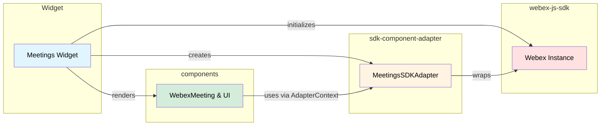

# Meetings Widget

## Overview

The Meetings Widget provides a full-featured Webex meeting experience as an embeddable component. It orchestrates three external repositories — `webex-js-sdk` for backend communication, `sdk-component-adapter` for reactive data binding, and `components` for the React UI.

**Widget:** Meetings

**Location:** `widgets/packages/meetings/`

---

## Why and What is This Used For?

### Purpose

The Meetings Widget lets consuming applications embed a complete meeting experience without building any meeting logic themselves. It handles the entire lifecycle — from SDK initialization through meeting creation, joining, in-meeting controls, and leaving — by composing existing components and adapters together.

### Key Capabilities

- **Join Meetings** — Connect to a meeting via URL, SIP address, or Personal Meeting Room
- **Audio Controls** — Mute and unmute microphone with transitional states
- **Video Controls** — Start and stop camera with device switching
- **Screen Sharing** — Share screen, window, or tab with other participants
- **Member Roster** — View list of meeting participants
- **Device Settings** — Switch between cameras, microphones, and speakers
- **Guest/Host Authentication** — Password-protected meetings with host key support
- **Waiting for Host** — Automatic transition when host starts the meeting

---

## Examples and Use Cases

### Getting Started

#### Basic Usage (React)

```jsx
import Webex from 'webex';
import WebexSDKAdapter from '@webex/sdk-component-adapter';
import {WebexMeeting, AdapterContext} from '@webex/components';

function MeetingsWidget({accessToken, meetingDestination}) {
  const [adapter, setAdapter] = useState(null);
  const [meetingID, setMeetingID] = useState(null);

  useEffect(() => {
    const webex = Webex.init({
      credentials: { access_token: accessToken }
    });
    const sdkAdapter = new WebexSDKAdapter(webex);

    sdkAdapter.connect().then(() => {
      setAdapter(sdkAdapter);
      return sdkAdapter.meetingsAdapter.createMeeting(meetingDestination);
    }).then((meeting) => {
      setMeetingID(meeting.ID);
    });

    return () => sdkAdapter.disconnect();
  }, [accessToken, meetingDestination]);

  if (!adapter || !meetingID) return <div>Loading...</div>;

  return (
    <AdapterContext.Provider value={adapter}>
      <WebexMeeting meetingID={meetingID} />
    </AdapterContext.Provider>
  );
}
```

### Common Use Cases

#### 1. Password-Protected Meeting

When a meeting requires a password, the `WebexMeeting` component detects `passwordRequired` from the adapter observable and renders the `WebexMeetingGuestAuthentication` modal. The user enters the password, and `JoinControl.action()` passes it to the SDK.

**Key Points:**

- `passwordRequired` is a boolean on the adapter meeting observable
- The component handles guest vs host authentication flows
- Wrong password triggers `invalidPassword` flag on the observable

#### 2. Pre-Join Media Preview

Before joining, the interstitial screen shows local media preview. The user can mute audio, stop video, or open settings before entering the meeting.

**Key Points:**

- `WebexInterstitialMeeting` renders when `state === 'NOT_JOINED'`
- Controls available pre-join: `mute-audio`, `mute-video`, `settings`, `join-meeting`
- `JoinControl.display()` shows a hint like "Unmuted, video on" based on current state

#### 3. Device Switching Mid-Meeting

During an active meeting, users can switch cameras, microphones, or speakers through the settings panel.

**Key Points:**

- `SettingsControl.action()` opens the `WebexSettings` modal
- `SwitchCameraControl.action({ meetingID, cameraId })` calls `switchCamera(meetingID, cameraId)` on the adapter
- The adapter acquires a new media stream with the selected device and emits an updated `localVideo.stream`

#### 4. Screen Sharing

The share button triggers the browser's native screen picker. The SDK handles `getDisplayMedia()` and negotiates the share stream with the backend.

**Key Points:**

- `ShareControl` checks `navigator.mediaDevices.getDisplayMedia` availability
- If unsupported, the control renders as DISABLED
- The adapter emits `localShare.stream` with the display stream when sharing starts

---

## Three-Repository Architecture




| Repository              | Role                                      | Key Exports Used                                                    |
| ----------------------- | ----------------------------------------- | ------------------------------------------------------------------- |
| `webex-js-sdk`          | Core SDK for Webex backend communication  | `Webex.init()`, `webex.meetings`, meeting methods                   |
| `sdk-component-adapter` | Reactive adapter layer (RxJS observables) | `WebexSDKAdapter`, `MeetingsSDKAdapter`, all Control classes        |
| `components`            | React UI components + hooks               | `WebexMeeting`, `AdapterContext`, `useMeeting`, `useMeetingControl` |


---

## Dependencies

**Note:** For exact versions, see [package.json](../package.json)

### Runtime Dependencies


| Package                        | Purpose                                               |
| ------------------------------ | ----------------------------------------------------- |
| `webex`                        | Core Webex JavaScript SDK for backend communication   |
| `@webex/sdk-component-adapter` | Reactive adapter that wraps SDK into RxJS observables |
| `@webex/components`            | React UI components for meeting views and controls    |


### Peer Dependencies


| Package     | Purpose             |
| ----------- | ------------------- |
| `react`     | React framework     |
| `react-dom` | React DOM rendering |


---

## API Reference

### WebexMeeting Component Props


| Prop                   | Type          | Required | Default | Description                                  |
| ---------------------- | ------------- | -------- | ------- | -------------------------------------------- |
| `meetingID`            | `string`      | No       | —       | The meeting ID returned by `createMeeting()` |
| `meetingPasswordOrPin` | `string`      | No       | —       | Password or host pin for protected meetings  |
| `participantName`      | `string`      | No       | —       | Display name for guest participants          |
| `controls`             | `Function`    | No       | —       | Function returning control IDs to render     |
| `layout`               | `string`      | No       | —       | Meeting layout variant                       |
| `logo`                 | `JSX.Element` | No       | —       | Custom logo for loading state                |
| `className`            | `string`      | No       | —       | CSS class for the root element               |
| `style`                | `object`      | No       | —       | Inline styles for the root element           |


The `WebexMeeting` component also requires an `AdapterContext.Provider` ancestor with a valid `WebexSDKAdapter` instance as its value.

### Hooks (from `components`)


| Hook                                        | Parameters                        | Returns                                        | Description                                                         |
| ------------------------------------------- | --------------------------------- | ---------------------------------------------- | ------------------------------------------------------------------- |
| `useMeeting(meetingID)`                     | `meetingID: string`               | Meeting object (see ARCHITECTURE.md for shape) | Subscribes to the adapter's meeting observable                      |
| `useMeetingControl(type, meetingID)`        | `type: string, meetingID: string` | `[action, display]` (array)                    | Returns action function and display state for a control             |
| `useMeetingDestination(meetingDestination)` | `meetingDestination: string`      | Meeting object                                 | Creates a meeting from destination and subscribes to its observable |


### WebexSDKAdapter Methods (top-level adapter)


| Method         | Returns         | Description                                                                                                     |
| -------------- | --------------- | --------------------------------------------------------------------------------------------------------------- |
| `connect()`    | `Promise<void>` | Calls `sdk.internal.device.register()` → `sdk.internal.mercury.connect()` → `meetingsAdapter.connect()`         |
| `disconnect()` | `Promise<void>` | Calls `meetingsAdapter.disconnect()` → `sdk.internal.mercury.disconnect()` → `sdk.internal.device.unregister()` |


### MeetingsSDKAdapter Methods


| Method                               | Parameters                                             | Returns               | Description                                             |
| ------------------------------------ | ------------------------------------------------------ | --------------------- | ------------------------------------------------------- |
| `connect()`                          | —                                                      | `Promise<void>`       | Calls `meetings.register()` + `meetings.syncMeetings()` |
| `disconnect()`                       | —                                                      | `Promise<void>`       | Calls `meetings.unregister()`                           |
| `createMeeting(destination)`         | `destination: string`                                  | `Observable<Meeting>` | Creates a meeting from URL, SIP, or PMR                 |
| `joinMeeting(ID, options)`           | `ID: string, { password?, name?, hostKey?, captcha? }` | `Promise<void>`       | Joins the meeting                                       |
| `leaveMeeting(ID)`                   | `ID: string`                                           | `Promise<void>`       | Leaves and cleans up the meeting                        |
| `handleLocalAudio(ID)`               | `ID: string`                                           | `Promise<void>`       | Toggles audio mute/unmute                               |
| `handleLocalVideo(ID)`               | `ID: string`                                           | `Promise<void>`       | Toggles video on/off                                    |
| `handleLocalShare(ID)`               | `ID: string`                                           | `Promise<void>`       | Toggles screen share on/off                             |
| `toggleRoster(ID)`                   | `ID: string`                                           | `void`                | Toggles member roster panel (client-side only)          |
| `toggleSettings(ID)`                 | `ID: string`                                           | `Promise<void>`       | Toggles settings modal; applies device changes on close |
| `switchCamera(ID, cameraID)`         | `ID, cameraID: string`                                 | `Promise<void>`       | Switches to a different camera device                   |
| `switchMicrophone(ID, microphoneID)` | `ID, microphoneID: string`                             | `Promise<void>`       | Switches to a different microphone                      |
| `switchSpeaker(ID, speakerID)`       | `ID, speakerID: string`                                | `Promise<void>`       | Switches to a different speaker (client-side only)      |


### Control Action Parameters

All control `action()` methods take a **destructured object**, not a plain string.


| Control                   | `action()` Parameters                                  | Adapter Method Called                        |
| ------------------------- | ------------------------------------------------------ | -------------------------------------------- |
| `AudioControl`            | `{ meetingID }`                                        | `handleLocalAudio(meetingID)`                |
| `VideoControl`            | `{ meetingID }`                                        | `handleLocalVideo(meetingID)`                |
| `ShareControl`            | `{ meetingID }`                                        | `handleLocalShare(meetingID)`                |
| `JoinControl`             | `{ meetingID, meetingPasswordOrPin, participantName }` | `joinMeeting(meetingID, { password, name })` |
| `ExitControl`             | `{ meetingID }`                                        | `leaveMeeting(meetingID)`                    |
| `RosterControl`           | `{ meetingID }`                                        | `toggleRoster(meetingID)`                    |
| `SettingsControl`         | `{ meetingID }`                                        | `toggleSettings(meetingID)`                  |
| `SwitchCameraControl`     | `{ meetingID, cameraId }`                              | `switchCamera(meetingID, cameraId)`          |
| `SwitchMicrophoneControl` | `{ meetingID, microphoneId }`                          | `switchMicrophone(meetingID, microphoneId)`  |
| `SwitchSpeakerControl`    | `{ meetingID, speakerId }`                             | `switchSpeaker(meetingID, speakerId)`        |


### Control IDs for WebexMeetingControlBar


| Control ID          | Class                     | Type        | Available             |
| ------------------- | ------------------------- | ----------- | --------------------- |
| `mute-audio`        | `AudioControl`            | TOGGLE      | Pre-join + In-meeting |
| `mute-video`        | `VideoControl`            | TOGGLE      | Pre-join + In-meeting |
| `share-screen`      | `ShareControl`            | TOGGLE      | In-meeting only       |
| `join-meeting`      | `JoinControl`             | JOIN        | Pre-join only         |
| `leave-meeting`     | `ExitControl`             | CANCEL      | In-meeting only       |
| `member-roster`     | `RosterControl`           | TOGGLE      | In-meeting only       |
| `settings`          | `SettingsControl`         | TOGGLE      | Pre-join + In-meeting |
| `switch-camera`     | `SwitchCameraControl`     | MULTISELECT | Settings panel        |
| `switch-microphone` | `SwitchMicrophoneControl` | MULTISELECT | Settings panel        |
| `switch-speaker`    | `SwitchSpeakerControl`    | MULTISELECT | Settings panel        |


---

## Additional Resources

For detailed architecture, event flows, data structures, and troubleshooting, see [ARCHITECTURE.md](./ARCHITECTURE.md).

---

