# Meetings Widgets — SPEC

> Start here → root [`AGENTS.md`](../../../../AGENTS.md) (agent entry) · router [`SPEC_INDEX.md`](../../../../ai-docs/SPEC_INDEX.md) · system [`ARCHITECTURE.md`](../../../../ai-docs/ARCHITECTURE.md). This is the module's canonical spec: orientation, requirements, design, flows, state, UI, host integration, and tests.
> Context-efficiency: link to canonical docs — don't duplicate them. Load specs on demand per `SPEC_INDEX.md`.

## Metadata
| Field | Value |
|---|---|
| Module id | `meetings-widgets` |
| Source path(s) | `packages/@webex/widgets/src/` |
| Doc kind | Module spec |
| Coverage score | Pending coverage assessment |
| Generated from | `module-spec` @ SDLC template library `0.1.0-draft` |
| generated_by / approved_by / updated_at | migration agent / pending / 2026-06-29 |
| Validation status | not-run |

Coverage score: `Pending coverage assessment` before the first report; after assessment, replace with
`<0-100%>` plus the report path/evidence.

## Evidence Rules
Every requirement below cites concrete source evidence using `file path`. Source evidence, test evidence,
examples, assumptions, and gaps are kept separate so validators and future agents can distinguish truth
from context. Test evidence is preferred for WHY. This module's only repo-resident source is the widget
wrapper and its tests; the meeting UI, adapter, and SDK live in external packages (`@webex/components`,
`@webex/sdk-component-adapter`, `webex`) and are cited as dependency boundaries, not as in-repo evidence.

## Source Material Register
| Source doc | Scope | Decision | Detail location or disposition |
|---|---|---|---|
| Archived pre-migration agent guide | overview / API / examples | reconciled | Orientation → Overview/Purpose; props → Public Surface; capabilities → Use Cases. External-package API tables (adapter/control methods) retained as reference under Class/Component Relationships and Sequence Diagrams; they describe `@webex/sdk-component-adapter`, not this repo's code. |
| Archived pre-migration architecture guide | architecture / flows / state | reconciled | Three-repo layering → Design Overview/Data Flow; event flows → Sequence Diagram(s); state machine → State Machine; troubleshooting → Pitfalls. Component table is external (`@webex/components`) and kept as reference, not as owned design. |
| `packages/@webex/widgets/src/widgets/WebexMeetings/README.md` | overview / usage | reference-only | Layout values, custom-controls contract, and browser limitations folded into Public Surface, UI Flow, and Pitfalls. |
| `ai-docs/CONTRACTS.md` | API/contract index | conflicting / not applicable | The root contracts catalog documents the Contact Center widget family only; it does NOT list `@webex/widgets`. This spec routes Public Surface to the package entry point (`packages/@webex/widgets/src/index.js`) instead of a CONTRACTS anchor. Flagged as a gap for human follow-up. |

## Overview
`@webex/widgets` is the **legacy Webex Meetings widget family** and is a separate concern from the Contact
Center (CC) widgets that dominate this monorepo. It does NOT use the CC store (`@webex/cc-store`), the CC
`Widget → Hook → Component → Store → SDK` dependency flow, MobX, TypeScript, or the r2wc custom-element
wrappers. It is a standalone React (JSX + PropTypes) package whose single public export is
`WebexMeetingsWidget` (`packages/@webex/widgets/src/index.js:1`).

The package is a thin **composition/integration layer**. The repo-resident code is one widget component
(`packages/@webex/widgets/src/widgets/WebexMeetings/WebexMeetings.jsx`) plus an SVG logo. The actual meeting
experience comes from three external Webex repositories that the widget wires together: `webex` (the
JS SDK), `@webex/sdk-component-adapter` (an RxJS-observable adapter over the SDK), and `@webex/components`
(the React meeting UI and its `withAdapter`/`withMeeting` HOCs and hooks). The widget's own responsibility
is small: construct the SDK + adapter from an `accessToken`, hand the adapter to `@webex/components` via the
`withAdapter` HOC, choose between the media-permission prompt and the full meeting view based on the
meeting's permission state, and layer in a custom keyboard-accessibility shim over the rendered DOM.

A maintainer should start at `WebexMeetings.jsx`: the default export (bottom of file) is
`withAdapter(withMeeting(WebexMeetingsWidget), adapterFactory)`, so the class you read is wrapped twice
before it ships. SDK construction lives only in the `adapterFactory` argument; the class body handles render
branching and accessibility. Behavior beyond that (joining, muting, sharing, device switching, state
transitions) is owned by the external adapter and components, not by this repo.

## Purpose / Responsibility
Owns the embeddable `WebexMeetingsWidget` React component: it bootstraps a Webex SDK instance + adapter from
an access token, renders either the browser media-permission prompt or the `@webex/components`
`WebexMeeting` view, and applies a custom keyboard/focus accessibility shim. It does NOT own meeting
lifecycle logic, media negotiation, controls, or UI internals — those belong to `webex`,
`@webex/sdk-component-adapter`, and `@webex/components`.

## Stack
JavaScript (ES + JSX, no TypeScript), React 18.3.1 with class components and `prop-types` for prop
validation. Build: webpack 5 producing an ESM bundle (`main`/`module` → `dist/webexWidgets.mjs`), Babel
(`@babel/preset-env`, `@babel/preset-react`). Tests: Jest + React Testing Library (`tests/`,
`jest.config.js`) for unit; WebdriverIO + Jasmine (`wdio.conf.js`, `tests/WebexMeeting.e2e.js`) for E2E.
Released via `semantic-release`. Source: `packages/@webex/widgets/package.json`.

## Folder / Package Structure
```
packages/@webex/widgets/
├── src/
│   ├── index.js                          # Package barrel — exports WebexMeetingsWidget
│   └── widgets/WebexMeetings/
│       ├── WebexMeetings.jsx             # The widget (class + withAdapter/withMeeting wrap + adapter factory)
│       ├── WebexMeetings.css             # Widget root + content styles
│       ├── WebexLogo.jsx                 # Inline SVG logo (passed to WebexMeeting)
│       ├── webex-logo.svg                # Logo asset
│       └── README.md                     # Usage, layouts, custom controls, browser limitations
├── tests/
│   ├── WebexMeetings/WebexMeetings.test.jsx  # Unit tests (Jest + RTL)
│   ├── WebexMeeting.e2e.js               # E2E suite (WebdriverIO)
│   ├── pages/                            # E2E page objects (MeetingWidget, Samples)
│   └── util.js                          # E2E test-user/SDK helpers
├── demo/                                 # Standalone demo app (webpack dev server)
├── docs/                                 # Built demo bundle (generated; not source)
├── jest.config.js                        # Jest config (sets __appVersion__, ignores WebexLogo from coverage)
├── webpack.config.js                     # Build + demo wiring (defines __appVersion__ from version)
├── wdio.conf.js                          # E2E runner config
└── package.json                          # Manifest; deps pin webex/components/adapter versions
```

## Key Files (source of truth)
| File | Holds |
|---|---|
| `packages/@webex/widgets/src/index.js` | The public export barrel — the package's entire public surface (`WebexMeetingsWidget`). |
| `packages/@webex/widgets/src/widgets/WebexMeetings/WebexMeetings.jsx` | Widget class, `propTypes`/`defaultProps` (authoritative prop contract), render branching, the `withAdapter`/`withMeeting` wrap, and the SDK `adapterFactory` (SDK config: `appName`, `appVersion`, `fedramp`, experimental meetings flags). |
| `packages/@webex/widgets/package.json` | Pinned versions of `webex`, `@webex/sdk-component-adapter`, `@webex/components`, peer deps. Never infer these versions elsewhere. |
| `packages/@webex/widgets/jest.config.js` / `webpack.config.js` | Define the `__appVersion__` global the widget references at build/test time. |

## Public Surface
This package is consumed as an npm library; its public surface is the single named export and the props it
accepts. There is no HTTP/event/CLI surface, and (unlike the CC widgets) no r2wc custom element — it is a
plain React component. The authoritative prop contract is `WebexMeetingsWidget.propTypes` /
`defaultProps` in `WebexMeetings.jsx`.

| Contract ID | Type | Surface | Purpose | Compatibility / deprecation | Schema / detail link | Root index |
|---|---|---|---|---|---|---|
| `meetings-widgets.WebexMeetingsWidget` | SDK (React component export) | `import {WebexMeetingsWidget} from '@webex/widgets'` | Embed a full Webex meeting experience in a React host | Public; export name + required props are the breaking surface (semver) | `packages/@webex/widgets/src/index.js:1`; props in `packages/@webex/widgets/src/widgets/WebexMeetings/WebexMeetings.jsx:231-255` | Not catalogued in `../../../../ai-docs/CONTRACTS.md` (CC-only; this is the legacy meetings family) |

Props (from `WebexMeetings.jsx:231-255`):

| Prop | Type | Required | Default | Purpose |
|---|---|---|---|---|
| `accessToken` | string | Yes | — | Webex access token; feeds the SDK `adapterFactory` |
| `meetingDestination` | string | Yes | — | URL / SIP / email / PMR; consumed by `withMeeting` HOC |
| `meetingPasswordOrPin` | string | No | `''` | Password or host pin, forwarded to `WebexMeeting` |
| `participantName` | string | No | `''` | Guest display name, forwarded to `WebexMeeting` |
| `fedramp` | bool | No | `false` | Sets `config.fedramp` in the SDK factory |
| `layout` | string | No | `'Grid'` | Remote video layout, forwarded to `WebexMeeting` |
| `controls` | func | No | `undefined` | Returns control IDs to render; forwarded to `WebexMeeting` |
| `controlsCollapseRangeStart` | number | No | `undefined` | First collapsible control index; forwarded |
| `controlsCollapseRangeEnd` | number | No | `undefined` | Index before last collapsible control; forwarded |
| `className` | string | No | `''` | Appended to the root `webex-meetings-widget` class |
| `style` | object | No | `{}` | Inline style on the root element |

Compatibility notes:
- Adding an optional prop is additive (minor). Renaming/removing the `WebexMeetingsWidget` export, or
  changing the type/requiredness of `accessToken` or `meetingDestination`, is breaking (major).
- The `controls` function contract (receives `inMeeting: boolean`, returns string[] of control IDs) is
  defined by `@webex/components`; see `src/widgets/WebexMeetings/README.md`.

## Requires (dependencies)
- `webex` `2.60.4` (pinned, also peer) — the JS SDK; constructed in the `adapterFactory`
  (`WebexMeetings.jsx:260`). No fallback: an invalid/expired token leaves the widget on a loading state.
- `@webex/sdk-component-adapter` `1.113.3` (pinned) — RxJS adapter wrapping the SDK; constructed via
  `new WebexSDKAdapter(webex)` (`WebexMeetings.jsx:277`).
- `@webex/components` `1.277.1` (pinned) — supplies `WebexMeeting`, `WebexMediaAccess`, and the
  `withAdapter`/`withMeeting` HOCs (`WebexMeetings.jsx:4`) plus the `webex-components.css`.
- `@webex/component-adapter-interfaces` `^1.30.5` — meeting-state enum (`MeetingState`) and adapter
  interfaces used by the adapter/components layers.
- Peer: `react` / `react-dom` `18.3.1`, `prop-types` `^15.7.2` — host must provide these.
- Build globals: `__appVersion__` (defined by webpack/jest) is read in the SDK config.
- Versions are authoritative in `packages/@webex/widgets/package.json` — do not hardcode them elsewhere.

## Requirements
| ID | WHAT | WHY | Source Evidence | Test / Example Evidence | Assumptions / Gaps | Confidence |
|---|---|---|---|---|---|---|
| `MEETINGS-WIDGETS-R-001` | Default export is `WebexMeetingsWidget` wrapped by `withMeeting` then `withAdapter`, so consumers get SDK + adapter + meeting bootstrapped automatically. | Consumers should not build meeting/adapter logic themselves; the HOC chain is the integration contract. | `WebexMeetings.jsx:259`, `index.js:1` | `tests/WebexMeetings/WebexMeetings.test.jsx:28-44` (mocks `withAdapter`/`withMeeting`, captures factory) | none | PRESENT |
| `MEETINGS-WIDGETS-R-002` | The `adapterFactory` constructs `new Webex({credentials:{access_token}})` and returns `new WebexSDKAdapter(webex)`. | The token-to-adapter wiring is the widget's core job; everything downstream depends on it. | `WebexMeetings.jsx:259-278` | `tests/WebexMeetings/WebexMeetings.test.jsx:516-570` (token, fedramp, experimental config, adapter creation) | none | PRESENT |
| `MEETINGS-WIDGETS-R-003` | SDK config sets `fedramp` from the prop, `appVersion` from `__appVersion__`, and meetings experimental flags `enableUnifiedMeetings`/`enableAdhocMeetings = true`. | FedRAMP environments and unified/adhoc meetings must be enabled at SDK construction; flipping these later is not possible. | `WebexMeetings.jsx:263-274` | `tests/WebexMeetings/WebexMeetings.test.jsx:527-562` | none | PRESENT |
| `MEETINGS-WIDGETS-R-004` | `appName` is `webex-widgets-meetings` in production and `webex-widgets-meetings-dev` otherwise. | Telemetry/identification must distinguish prod from dev builds. | `WebexMeetings.jsx:257` | `tests/WebexMeetings/WebexMeetings.test.jsx:572-580` (dev appName) | No test asserts the production branch (NODE_ENV=production) | PRESENT |
| `MEETINGS-WIDGETS-R-005` | When `meeting.localAudio.permission === 'ASKING'` the widget renders `WebexMediaAccess` with `media="microphone"`; audio ASKING takes priority over video ASKING. | The browser permission prompt must show before the meeting UI, and a single prompt is shown at a time. | `WebexMeetings.jsx:181-191` | `tests/WebexMeetings/WebexMeetings.test.jsx:104-135` | none | PRESENT |
| `MEETINGS-WIDGETS-R-006` | When `meeting.localVideo.permission === 'ASKING'` (and audio is not) the widget renders `WebexMediaAccess` with `media="camera"`. | Camera permission prompt path. | `WebexMeetings.jsx:190-191` | `tests/WebexMeetings/WebexMeetings.test.jsx:115-124,144-149` | none | PRESENT |
| `MEETINGS-WIDGETS-R-007` | When neither permission is ASKING, the widget renders `WebexMeeting`, forwarding `meetingID`, `meetingPasswordOrPin`, `participantName`, `layout`, `controls`, collapse range, and a fixed `webex-meetings-widget__content` className + `WebexLogo`. | The full meeting view is the default; prop forwarding is the integration contract with `@webex/components`. | `WebexMeetings.jsx:192-206` | `tests/WebexMeetings/WebexMeetings.test.jsx:151-178` | none | PRESENT |
| `MEETINGS-WIDGETS-R-008` | The root element has class `webex-meetings-widget` (plus optional `className`), applies `style`, and is focusable (`tabIndex=0`). | Host styling/sizing and the accessibility shim depend on a stable, focusable root. | `WebexMeetings.jsx:208-218` | `tests/WebexMeetings/WebexMeetings.test.jsx:96-102,180-192,202-206` | none | PRESENT |
| `MEETINGS-WIDGETS-R-009` | Defaults: `layout='Grid'`, `className=''`, `meetingPasswordOrPin=''`, `participantName=''`, `fedramp=false`, `style={}`, controls/range `undefined`. | Optional props must behave predictably when omitted. | `WebexMeetings.jsx:245-255` | `tests/WebexMeetings/WebexMeetings.test.jsx:195-219` | none | PRESENT |
| `MEETINGS-WIDGETS-R-010` | On mount the widget installs focus/keyboard handlers (focus redirect to media container or Join button, arrow-key cycling across control-bar buttons, Tab into inner-meeting interactive elements) and a `MutationObserver` to re-attach them; it disconnects the observer on unmount. | Custom a11y shim because base `@webex/components` `WebexMeeting` lacks these; observer must be cleaned up to avoid leaks. | `WebexMeetings.jsx:41-177,222-228` | `tests/WebexMeetings/WebexMeetings.test.jsx:235-513` (focus, arrow nav, Tab, observer re-attach, unmount disconnect) | This is an explicitly temporary workaround to remove once upstream supports it (`WebexMeetings.jsx:36-39`) | PRESENT |

## Design Overview
The widget is a composition seam between three external Webex repos. Structurally it is a single React
class component exported through two HOCs supplied by `@webex/components`:

1. `withAdapter(Component, adapterFactory)` calls `adapterFactory(props)` once to build the SDK + adapter,
   calls `adapter.connect()` (device register → mercury WebSocket → meetings register/sync), and provides
   the adapter through `AdapterContext`. The factory here builds `new Webex(...)` from `accessToken` and
   wraps it in `new WebexSDKAdapter(...)` (`WebexMeetings.jsx:259-278`).
2. `withMeeting(Component)` creates a meeting from `meetingDestination` and injects the live meeting object
   as the `meeting` prop.
3. `WebexMeetingsWidget` (the class) renders. Its `render()` reads `meeting.localAudio.permission` /
   `localVideo.permission` and branches: ASKING → `WebexMediaAccess` prompt; otherwise → `WebexMeeting`.

This split matters for debugging: SDK/adapter construction and meeting creation happen in the HOC layer
(external), not in the class's `componentDidMount`/`componentWillUnmount`. The class lifecycle only manages
the accessibility shim (focus routing, arrow-key navigation, a `MutationObserver`). The archived
troubleshooting notes call this out explicitly — duplicate-initialization bugs must be chased in the HOCs,
not here (`Pitfalls`).

The widget deliberately stays declarative and stateless: it holds no React state and no MobX store. All
meeting state lives in the adapter's RxJS observables, surfaced to UI components via `@webex/components`
hooks (`useMeeting`, `useMeetingControl`). The widget only reads `meeting.ID` and the two `permission`
fields off the injected `meeting` prop.

## Data Flow
Data is in-process React props/context outbound, and RxJS observable subscriptions inbound; the SDK itself
talks to the backend over REST + a Mercury WebSocket. The widget participates only at the edges (build
adapter; read permission fields; forward props).

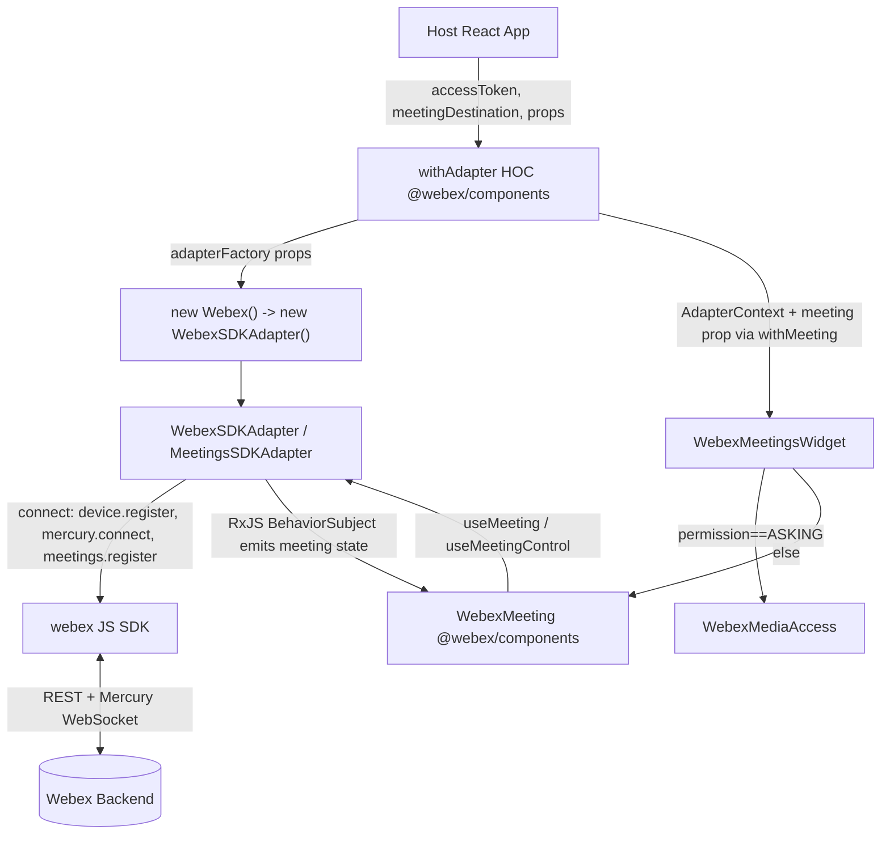
```mermaid
flowchart TD
    Host[Host React App] -->|accessToken, meetingDestination, props| WAdapter[withAdapter HOC @webex/components]
    WAdapter -->|adapterFactory props| Factory["new Webex() -> new WebexSDKAdapter()"]
    Factory --> Adapter[WebexSDKAdapter / MeetingsSDKAdapter]
    Adapter -->|connect: device.register, mercury.connect, meetings.register| SDK[webex JS SDK]
    SDK <-->|REST + Mercury WebSocket| Backend[(Webex Backend)]
    WAdapter -->|AdapterContext + meeting prop via withMeeting| Widget[WebexMeetingsWidget]
    Widget -->|permission==ASKING| MediaAccess[WebexMediaAccess]
    Widget -->|else| Meeting[WebexMeeting @webex/components]
    Meeting -->|useMeeting / useMeetingControl| Adapter
    Adapter -->|RxJS BehaviorSubject emits meeting state| Meeting
```

The two directional chains (external adapter/components; retained as reference boundaries):

Outbound (user action → backend):
```
User clicks control button
  → Component (WebexMeetingControl)
    → useMeetingControl hook
      → Control.action({ meetingID })
        → sdk-component-adapter method
          → webex-js-sdk meeting method
            → Backend (REST/WebSocket)
```

Inbound (backend → UI update):
```
Backend processes request
  → WebSocket event delivered to webex-js-sdk
    → sdk-component-adapter detects change
      → RxJS BehaviorSubject emits new meeting state
        → useMeeting hook receives update
          → Component re-renders
```

## Sequence Diagram(s)
The diagrams below preserve each distinct operation group from the source event-flow set. Group 1 is
this repo's owned bootstrap/render-branch behavior (verified in `WebexMeetings.jsx`); groups 2–11
document the external adapter/components operation ordering the widget integrates with. They are
retained as reference boundaries (they describe `@webex/sdk-component-adapter` and `@webex/components`,
not in-repo code) and are kept as separate diagrams because each describes a distinct operation group,
actor set, and failure/recovery path.

| # | Operation group | Diagram | Failure / recovery coverage |
|---|---|---|---|
| 1 | Bootstrap + render branch (this repo's code) | "Mount → adapter factory → permission branch" | Loading state when adapter not ready; ASKING permission shows prompt instead of meeting |
| 2 | SDK initialization (external adapter) | "SDK initialization — connect()" | Device register → mercury → meetings register/sync ordering; loading until meetings ready |
| 3 | Meeting creation & interstitial (external) | "Meeting creation & interstitial" | Meeting created with `state=NOT_JOINED`; interstitial controls shown |
| 4 | Join / authenticate (external adapter + components) | "Join meeting with optional password" | alt branch for password required / invalid password |
| 5 | Mute / unmute audio (external `AudioControl`) | "Mute / unmute audio" | Toggling `localAudio.muting`; muted↔unmuted display emit |
| 6 | Start / stop video (external `VideoControl`) | "Start / stop video" | Toggling `localVideo.muting`; on↔off display emit |
| 7 | Start / stop screen share (external `ShareControl`) | "Start / stop screen share" | `getDisplayMedia` picker; stop path returns to receive-only |
| 8 | Toggle member roster (external `RosterControl`) | "Toggle member roster" | Client-side only; no backend call |
| 9 | Toggle settings & switch camera (external) | "Toggle settings & switch camera" | `settings.visible` toggle; `updateVideo/updateAudio` only when joined |
| 10 | Leave meeting (external `ExitControl`) | "Leave meeting" | `removeMedia` stops local streams; emits `state: LEFT` |
| 11 | Guest / host authentication (external `JoinControl`) | "Guest/host authentication" | alt correct→JOINED / incorrect→invalidPassword; host-pin alternative |
| 12 | State transition to JOINED / LOBBY (external) | "Waiting for host (LOBBY)" | Catch-all `else` renders WebexWaitingForHost for non-terminal states |

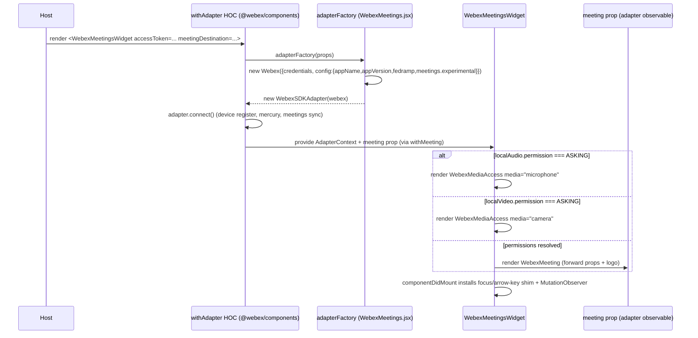
```mermaid
sequenceDiagram
    participant Host
    participant withAdapter as withAdapter HOC (@webex/components)
    participant Factory as adapterFactory (WebexMeetings.jsx)
    participant Widget as WebexMeetingsWidget
    participant Meeting as meeting prop (adapter observable)

    Host->>withAdapter: render <WebexMeetingsWidget accessToken=... meetingDestination=...>
    withAdapter->>Factory: adapterFactory(props)
    Factory->>Factory: new Webex({credentials, config:{appName,appVersion,fedramp,meetings.experimental}})
    Factory-->>withAdapter: new WebexSDKAdapter(webex)
    withAdapter->>withAdapter: adapter.connect() (device register, mercury, meetings sync)
    withAdapter->>Widget: provide AdapterContext + meeting prop (via withMeeting)
    alt localAudio.permission === ASKING
        Widget->>Widget: render WebexMediaAccess media="microphone"
    else localVideo.permission === ASKING
        Widget->>Widget: render WebexMediaAccess media="camera"
    else permissions resolved
        Widget->>Meeting: render WebexMeeting (forward props + logo)
    end
    Widget->>Widget: componentDidMount installs focus/arrow-key shim + MutationObserver
```

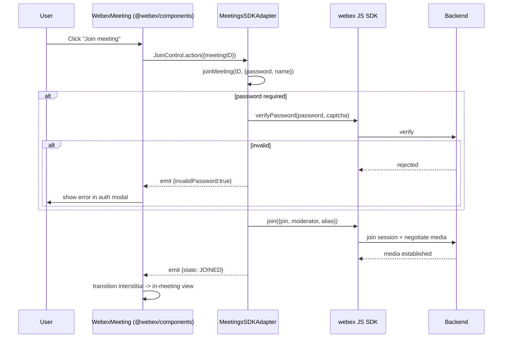
```mermaid
sequenceDiagram
    participant User
    participant Meeting as WebexMeeting (@webex/components)
    participant Adapter as MeetingsSDKAdapter
    participant SDK as webex JS SDK
    participant Backend

    User->>Meeting: Click "Join meeting"
    Meeting->>Adapter: JoinControl.action({meetingID})
    Adapter->>Adapter: joinMeeting(ID, {password, name})
    alt password required
        Adapter->>SDK: verifyPassword(password, captcha)
        SDK->>Backend: verify
        alt invalid
            Backend-->>SDK: rejected
            Adapter-->>Meeting: emit {invalidPassword:true}
            Meeting->>User: show error in auth modal
        end
    end
    Adapter->>SDK: join({pin, moderator, alias})
    SDK->>Backend: join session + negotiate media
    Backend-->>SDK: media established
    Adapter-->>Meeting: emit {state: JOINED}
    Meeting->>Meeting: transition interstitial -> in-meeting view
```

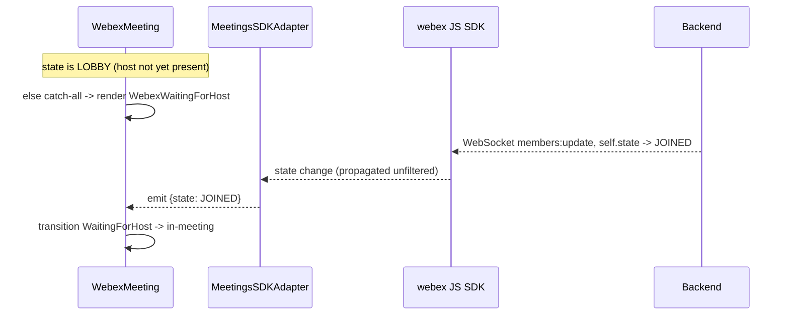
```mermaid
sequenceDiagram
    participant Meeting as WebexMeeting
    participant Adapter as MeetingsSDKAdapter
    participant SDK as webex JS SDK
    participant Backend

    Note over Meeting: state is LOBBY (host not yet present)
    Meeting->>Meeting: else catch-all -> render WebexWaitingForHost
    Backend-->>SDK: WebSocket members:update, self.state -> JOINED
    SDK-->>Adapter: state change (propagated unfiltered)
    Adapter-->>Meeting: emit {state: JOINED}
    Meeting->>Meeting: transition WaitingForHost -> in-meeting
```

### SDK initialization (external adapter `connect()`)
The distinct SDK-registration ordering: `device.register()` → `mercury.connect()` → `meetings.register()` + `syncMeetings()`. The widget's factory only builds `new Webex()` + `new WebexSDKAdapter()`; `connect()` runs in the `withAdapter` HOC.

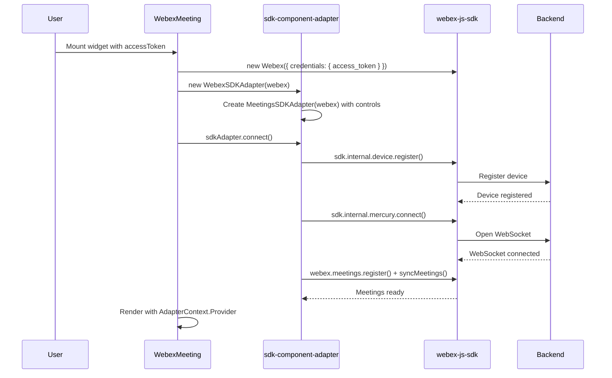
```mermaid
sequenceDiagram
    participant User
    participant Component as WebexMeeting
    participant Adapter as sdk-component-adapter
    participant SDK as webex-js-sdk
    participant Backend

    User->>Component: Mount widget with accessToken
    Component->>SDK: new Webex({ credentials: { access_token } })
    Component->>Adapter: new WebexSDKAdapter(webex)
    Adapter->>Adapter: Create MeetingsSDKAdapter(webex) with controls

    Component->>Adapter: sdkAdapter.connect()
    Adapter->>SDK: sdk.internal.device.register()
    SDK->>Backend: Register device
    Backend-->>SDK: Device registered
    Adapter->>SDK: sdk.internal.mercury.connect()
    SDK->>Backend: Open WebSocket
    Backend-->>SDK: WebSocket connected
    Adapter->>SDK: webex.meetings.register() + syncMeetings()
    SDK-->>Adapter: Meetings ready

    Component->>Component: Render with AdapterContext.Provider
```

### Meeting creation & interstitial (external)
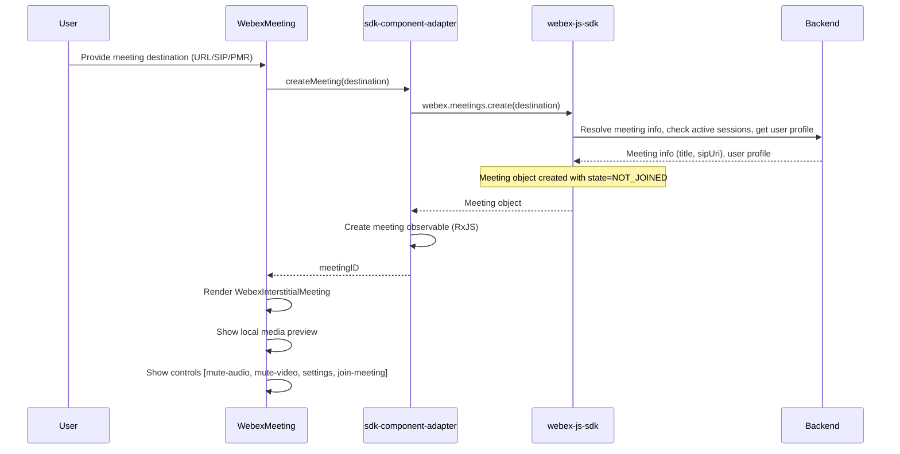
```mermaid
sequenceDiagram
    participant User
    participant Component as WebexMeeting
    participant Adapter as sdk-component-adapter
    participant SDK as webex-js-sdk
    participant Backend

    User->>Component: Provide meeting destination (URL/SIP/PMR)
    Component->>Adapter: createMeeting(destination)
    Adapter->>SDK: webex.meetings.create(destination)
    SDK->>Backend: Resolve meeting info, check active sessions, get user profile
    Backend-->>SDK: Meeting info (title, sipUri), user profile

    Note over SDK: Meeting object created with state=NOT_JOINED

    SDK-->>Adapter: Meeting object
    Adapter->>Adapter: Create meeting observable (RxJS)
    Adapter-->>Component: meetingID

    Component->>Component: Render WebexInterstitialMeeting
    Component->>Component: Show local media preview
    Component->>Component: Show controls [mute-audio, mute-video, settings, join-meeting]
```

### Mute / unmute audio (external `AudioControl`)
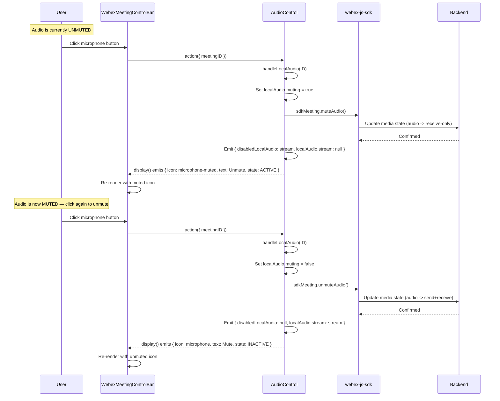
```mermaid
sequenceDiagram
    participant User
    participant Component as WebexMeetingControlBar
    participant Adapter as AudioControl
    participant SDK as webex-js-sdk
    participant Backend

    Note over User: Audio is currently UNMUTED

    User->>Component: Click microphone button
    Component->>Adapter: action({ meetingID })
    Adapter->>Adapter: handleLocalAudio(ID)
    Adapter->>Adapter: Set localAudio.muting = true
    Adapter->>SDK: sdkMeeting.muteAudio()
    SDK->>Backend: Update media state (audio -> receive-only)
    Backend-->>SDK: Confirmed

    Adapter->>Adapter: Emit { disabledLocalAudio: stream, localAudio.stream: null }
    Adapter-->>Component: display() emits { icon: microphone-muted, text: Unmute, state: ACTIVE }
    Component->>Component: Re-render with muted icon

    Note over User: Audio is now MUTED — click again to unmute

    User->>Component: Click microphone button
    Component->>Adapter: action({ meetingID })
    Adapter->>Adapter: handleLocalAudio(ID)
    Adapter->>Adapter: Set localAudio.muting = false
    Adapter->>SDK: sdkMeeting.unmuteAudio()
    SDK->>Backend: Update media state (audio -> send+receive)
    Backend-->>SDK: Confirmed

    Adapter->>Adapter: Emit { disabledLocalAudio: null, localAudio.stream: stream }
    Adapter-->>Component: display() emits { icon: microphone, text: Mute, state: INACTIVE }
    Component->>Component: Re-render with unmuted icon
```

### Start / stop video (external `VideoControl`)
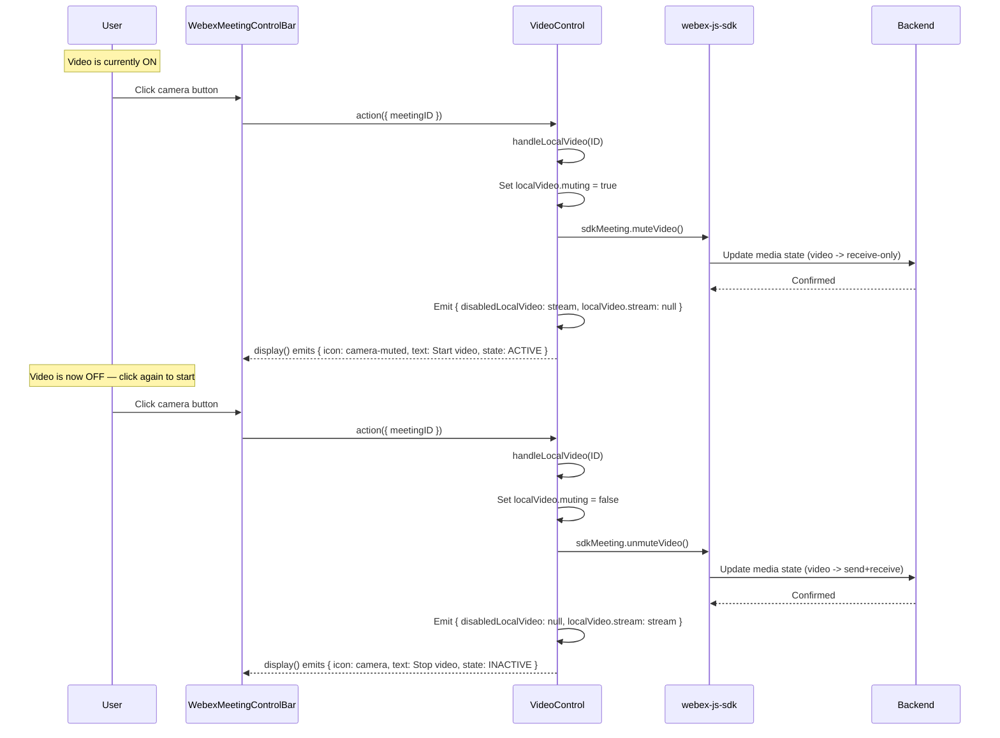
```mermaid
sequenceDiagram
    participant User
    participant Component as WebexMeetingControlBar
    participant Adapter as VideoControl
    participant SDK as webex-js-sdk
    participant Backend

    Note over User: Video is currently ON

    User->>Component: Click camera button
    Component->>Adapter: action({ meetingID })
    Adapter->>Adapter: handleLocalVideo(ID)
    Adapter->>Adapter: Set localVideo.muting = true
    Adapter->>SDK: sdkMeeting.muteVideo()
    SDK->>Backend: Update media state (video -> receive-only)
    Backend-->>SDK: Confirmed

    Adapter->>Adapter: Emit { disabledLocalVideo: stream, localVideo.stream: null }
    Adapter-->>Component: display() emits { icon: camera-muted, text: Start video, state: ACTIVE }

    Note over User: Video is now OFF — click again to start

    User->>Component: Click camera button
    Component->>Adapter: action({ meetingID })
    Adapter->>Adapter: handleLocalVideo(ID)
    Adapter->>Adapter: Set localVideo.muting = false
    Adapter->>SDK: sdkMeeting.unmuteVideo()
    SDK->>Backend: Update media state (video -> send+receive)
    Backend-->>SDK: Confirmed

    Adapter->>Adapter: Emit { disabledLocalVideo: null, localVideo.stream: stream }
    Adapter-->>Component: display() emits { icon: camera, text: Stop video, state: INACTIVE }
```

### Start / stop screen share (external `ShareControl`)
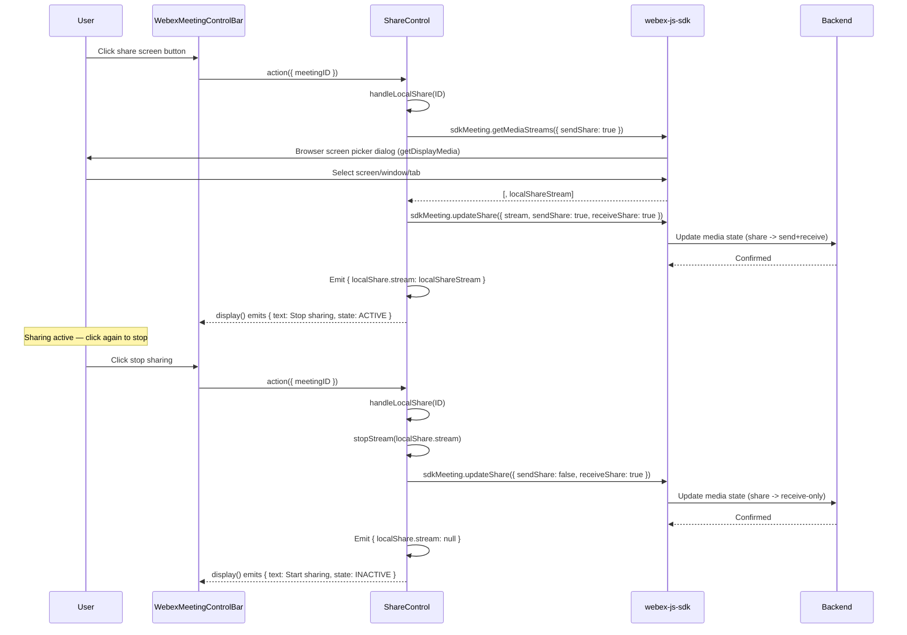
```mermaid
sequenceDiagram
    participant User
    participant Component as WebexMeetingControlBar
    participant Adapter as ShareControl
    participant SDK as webex-js-sdk
    participant Backend

    User->>Component: Click share screen button
    Component->>Adapter: action({ meetingID })
    Adapter->>Adapter: handleLocalShare(ID)
    Adapter->>SDK: sdkMeeting.getMediaStreams({ sendShare: true })
    SDK->>User: Browser screen picker dialog (getDisplayMedia)
    User->>SDK: Select screen/window/tab
    SDK-->>Adapter: [, localShareStream]
    Adapter->>SDK: sdkMeeting.updateShare({ stream, sendShare: true, receiveShare: true })
    SDK->>Backend: Update media state (share -> send+receive)
    Backend-->>SDK: Confirmed

    Adapter->>Adapter: Emit { localShare.stream: localShareStream }
    Adapter-->>Component: display() emits { text: Stop sharing, state: ACTIVE }

    Note over User: Sharing active — click again to stop

    User->>Component: Click stop sharing
    Component->>Adapter: action({ meetingID })
    Adapter->>Adapter: handleLocalShare(ID)
    Adapter->>Adapter: stopStream(localShare.stream)
    Adapter->>SDK: sdkMeeting.updateShare({ sendShare: false, receiveShare: true })
    SDK->>Backend: Update media state (share -> receive-only)
    Backend-->>SDK: Confirmed

    Adapter->>Adapter: Emit { localShare.stream: null }
    Adapter-->>Component: display() emits { text: Start sharing, state: INACTIVE }
```

### Toggle member roster (external `RosterControl`)
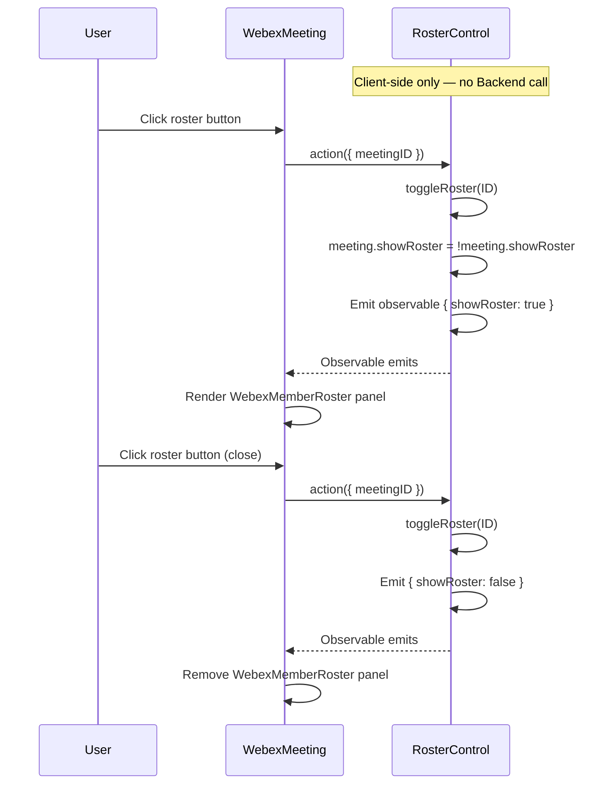
```mermaid
sequenceDiagram
    participant User
    participant Component as WebexMeeting
    participant Adapter as RosterControl

    Note over Adapter: Client-side only — no Backend call

    User->>Component: Click roster button
    Component->>Adapter: action({ meetingID })
    Adapter->>Adapter: toggleRoster(ID)
    Adapter->>Adapter: meeting.showRoster = !meeting.showRoster
    Adapter->>Adapter: Emit observable { showRoster: true }
    Adapter-->>Component: Observable emits
    Component->>Component: Render WebexMemberRoster panel

    User->>Component: Click roster button (close)
    Component->>Adapter: action({ meetingID })
    Adapter->>Adapter: toggleRoster(ID)
    Adapter->>Adapter: Emit { showRoster: false }
    Adapter-->>Component: Observable emits
    Component->>Component: Remove WebexMemberRoster panel
```

### Toggle settings & switch camera (external)
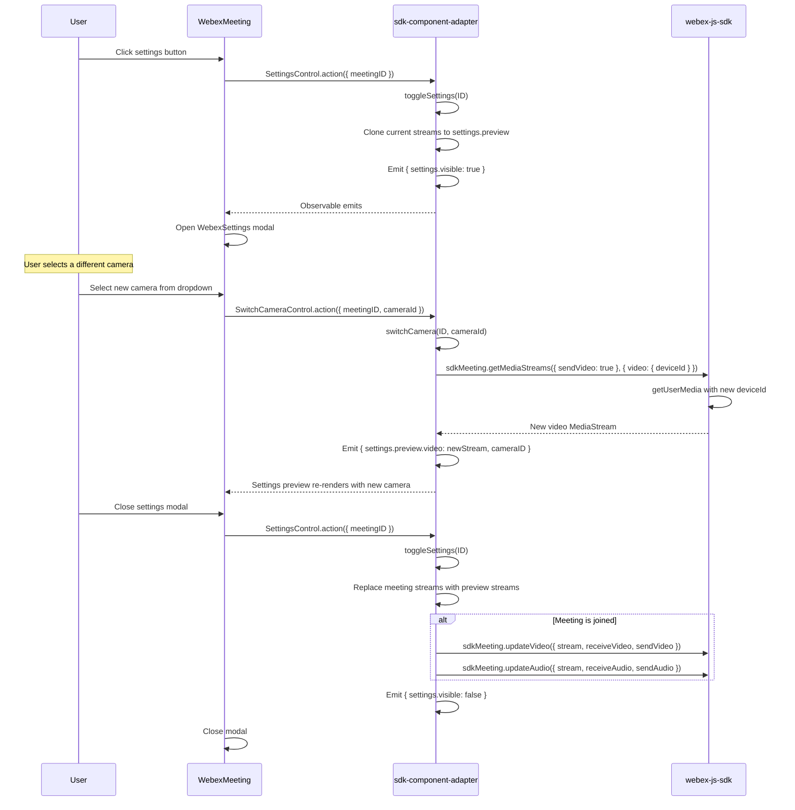
```mermaid
sequenceDiagram
    participant User
    participant Component as WebexMeeting
    participant Adapter as sdk-component-adapter
    participant SDK as webex-js-sdk

    User->>Component: Click settings button
    Component->>Adapter: SettingsControl.action({ meetingID })
    Adapter->>Adapter: toggleSettings(ID)
    Adapter->>Adapter: Clone current streams to settings.preview
    Adapter->>Adapter: Emit { settings.visible: true }
    Adapter-->>Component: Observable emits
    Component->>Component: Open WebexSettings modal

    Note over User: User selects a different camera

    User->>Component: Select new camera from dropdown
    Component->>Adapter: SwitchCameraControl.action({ meetingID, cameraId })
    Adapter->>Adapter: switchCamera(ID, cameraId)
    Adapter->>SDK: sdkMeeting.getMediaStreams({ sendVideo: true }, { video: { deviceId } })
    SDK->>SDK: getUserMedia with new deviceId
    SDK-->>Adapter: New video MediaStream
    Adapter->>Adapter: Emit { settings.preview.video: newStream, cameraID }
    Adapter-->>Component: Settings preview re-renders with new camera

    User->>Component: Close settings modal
    Component->>Adapter: SettingsControl.action({ meetingID })
    Adapter->>Adapter: toggleSettings(ID)
    Adapter->>Adapter: Replace meeting streams with preview streams

    alt Meeting is joined
        Adapter->>SDK: sdkMeeting.updateVideo({ stream, receiveVideo, sendVideo })
        Adapter->>SDK: sdkMeeting.updateAudio({ stream, receiveAudio, sendAudio })
    end

    Adapter->>Adapter: Emit { settings.visible: false }
    Component->>Component: Close modal
```

### Leave meeting (external `ExitControl`)
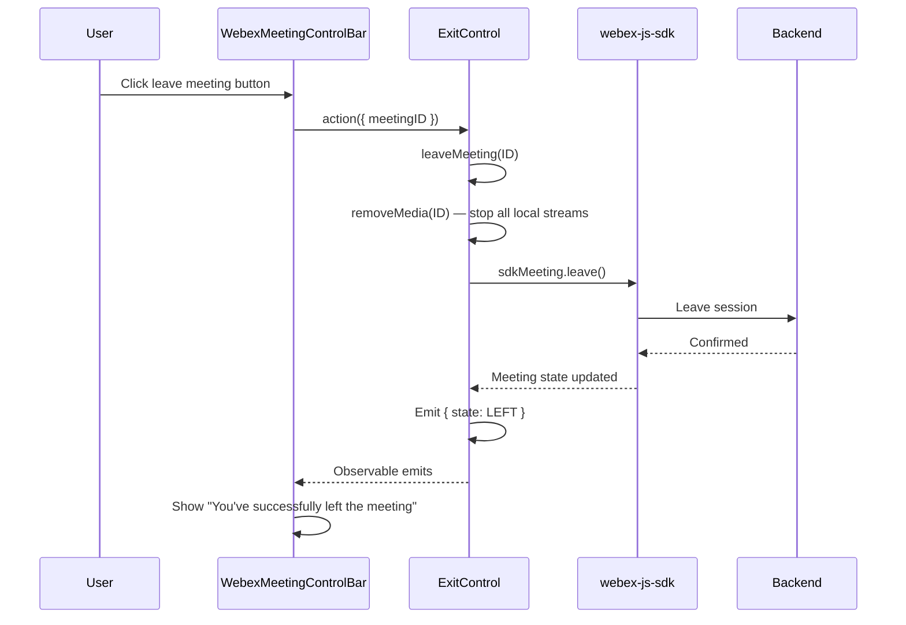
```mermaid
sequenceDiagram
    participant User
    participant Component as WebexMeetingControlBar
    participant Adapter as ExitControl
    participant SDK as webex-js-sdk
    participant Backend

    User->>Component: Click leave meeting button
    Component->>Adapter: action({ meetingID })
    Adapter->>Adapter: leaveMeeting(ID)
    Adapter->>Adapter: removeMedia(ID) — stop all local streams
    Adapter->>SDK: sdkMeeting.leave()
    SDK->>Backend: Leave session
    Backend-->>SDK: Confirmed

    SDK-->>Adapter: Meeting state updated
    Adapter->>Adapter: Emit { state: LEFT }
    Adapter-->>Component: Observable emits

    Component->>Component: Show "You've successfully left the meeting"
```

### Guest / host authentication (external `JoinControl`)
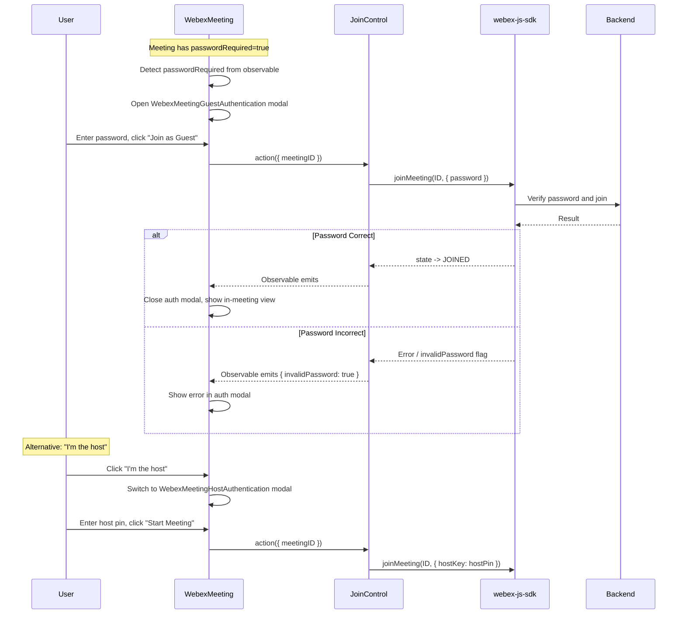
```mermaid
sequenceDiagram
    participant User
    participant Component as WebexMeeting
    participant Adapter as JoinControl
    participant SDK as webex-js-sdk
    participant Backend

    Note over Component: Meeting has passwordRequired=true

    Component->>Component: Detect passwordRequired from observable
    Component->>Component: Open WebexMeetingGuestAuthentication modal

    User->>Component: Enter password, click "Join as Guest"
    Component->>Adapter: action({ meetingID })
    Adapter->>SDK: joinMeeting(ID, { password })
    SDK->>Backend: Verify password and join
    Backend-->>SDK: Result

    alt Password Correct
        SDK-->>Adapter: state -> JOINED
        Adapter-->>Component: Observable emits
        Component->>Component: Close auth modal, show in-meeting view
    else Password Incorrect
        SDK-->>Adapter: Error / invalidPassword flag
        Adapter-->>Component: Observable emits { invalidPassword: true }
        Component->>Component: Show error in auth modal
    end

    Note over User: Alternative: "I'm the host"

    User->>Component: Click "I'm the host"
    Component->>Component: Switch to WebexMeetingHostAuthentication modal
    User->>Component: Enter host pin, click "Start Meeting"
    Component->>Adapter: action({ meetingID })
    Adapter->>SDK: joinMeeting(ID, { hostKey: hostPin })
```

## Class / Component Relationships
The only repo-owned types are `WebexMeetingsWidget` (class) and `WebexLogo` (function component). Everything
else is imported. The diagram shows the owned class, the HOC wrap, and the external collaborators it renders
or constructs.

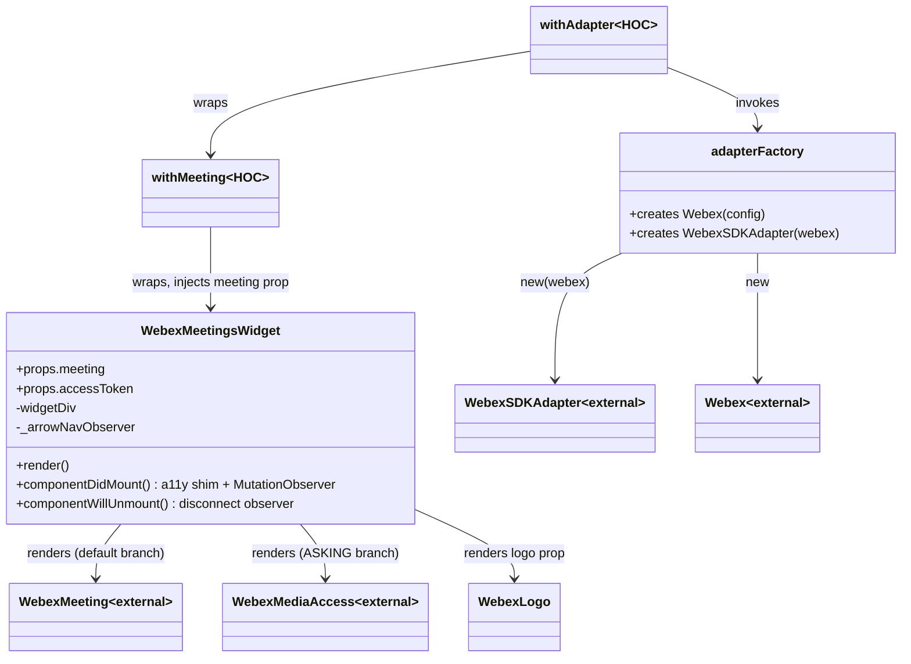
```mermaid
classDiagram
    class WebexMeetingsWidget {
      +props.meeting
      +props.accessToken
      +render()
      +componentDidMount() a11y shim + MutationObserver
      +componentWillUnmount() disconnect observer
      -widgetDiv
      -_arrowNavObserver
    }
    class adapterFactory {
      +creates Webex(config)
      +creates WebexSDKAdapter(webex)
    }
    class WebexLogo
    class withAdapter~HOC~
    class withMeeting~HOC~
    class WebexMeeting~external~
    class WebexMediaAccess~external~
    class WebexSDKAdapter~external~
    class Webex~external~

    withAdapter --> withMeeting : wraps
    withMeeting --> WebexMeetingsWidget : wraps, injects meeting prop
    withAdapter --> adapterFactory : invokes
    adapterFactory --> Webex : new
    adapterFactory --> WebexSDKAdapter : new(webex)
    WebexMeetingsWidget --> WebexMeeting : renders (default branch)
    WebexMeetingsWidget --> WebexMediaAccess : renders (ASKING branch)
    WebexMeetingsWidget --> WebexLogo : renders logo prop
```

Reference (external, not repo-owned): `WebexMeeting` further orchestrates `WebexInterstitialMeeting`,
`WebexInMeeting`, `WebexWaitingForHost`, `WebexMeetingControlBar`, roster/settings/auth components, and the
`MeetingsSDKAdapter` control classes (`AudioControl`, `VideoControl`, `ShareControl`, `JoinControl`,
`ExitControl`, `RosterControl`, `SettingsControl`, switch-device controls). These live in
`@webex/components` and `@webex/sdk-component-adapter`; see those repos for their internals.

### Full layer architecture (reference)
The complete three-repo composition below is external (UI layer = `@webex/components`, adapter layer =
`@webex/sdk-component-adapter`, SDK layer = `webex`). It is retained as a dependency-boundary reference,
not as in-repo design; only the widget entry point (`W`) is repo-owned.

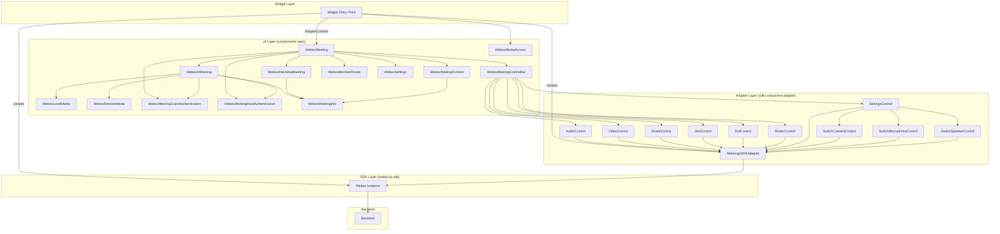
```mermaid
graph TB
    subgraph "Widget Layer"
        W[Widget Entry Point]
    end

    subgraph "UI Layer (components repo)"
        WM[WebexMeeting]
        WIM[WebexInterstitialMeeting]
        WIN[WebexInMeeting]
        WFH[WebexWaitingForHost]
        MCB[WebexMeetingControlBar]
        WLM[WebexLocalMedia]
        WRM[WebexRemoteMedia]
        WMR[WebexMemberRoster]
        WS[WebexSettings]
        WGA[WebexMeetingGuestAuthentication]
        WHA[WebexMeetingHostAuthentication]
        WMI[WebexMeetingInfo]
        WMA[WebexMediaAccess]
    end

    subgraph "Adapter Layer (sdk-component-adapter)"
        ADAPT[MeetingsSDKAdapter]
        AC[AudioControl]
        VC[VideoControl]
        SC[ShareControl]
        JC[JoinControl]
        EC[ExitControl]
        RC[RosterControl]
        STC[SettingsControl]
        SCC[SwitchCameraControl]
        SMC[SwitchMicrophoneControl]
        SSC[SwitchSpeakerControl]
    end

    subgraph "SDK Layer (webex-js-sdk)"
        SDK[Webex Instance]
    end

    subgraph "Backend"
        BE[Backend]
    end

    W -->|creates| SDK
    W -->|creates| ADAPT
    W -->|AdapterContext| WM
    W --> WMA
    WM --> WIM
    WM --> WIN
    WM --> WFH
    WM --> MCB
    WM --> WMR
    WM --> WS
    WM --> WGA
    WM --> WHA
    WIN --> WLM
    WIN --> WRM
    WIN --> WMI
    WIN --> WGA
    WIN --> WHA
    WIM --> WMI
    WFH --> WMI
    MCB --> AC & VC & SC & JC & EC & RC & STC
    STC --> SCC & SMC & SSC
    AC & VC & SC & JC & EC & RC & STC & SCC & SMC & SSC --> ADAPT
    ADAPT --> SDK
    SDK --> BE
```

### External component catalog (reference)
All components below are from `@webex/components` (`src/components/`). Render conditions are decided by
the parent; internal data comes from each component's own hooks. Retained as reference; not repo-owned.

| Component | Folder | Purpose | Render Condition (parent decides) | Internal Data Source (own hooks) |
|---|---|---|---|---|
| `WebexMeeting` | `WebexMeeting/` | Master orchestrator — renders correct view based on meeting state | Always (top-level) | `useMeeting(meetingID)` → `ID`, `localAudio`, `localVideo`, `state`, `showRoster`, `settings`, `passwordRequired` |
| `WebexInterstitialMeeting` | `WebexInterstitialMeeting/` | Pre-join lobby with local media preview | `state === NOT_JOINED` | `useMeeting(meetingID)` → `localVideo` |
| `WebexInMeeting` | `WebexInMeeting/` | Active meeting view with remote + local media | `state === JOINED` | `useMeeting(meetingID)` → `remoteShare`, `localShare`, `passwordRequired`, `state` |
| `WebexWaitingForHost` | `WebexWaitingForHost/` | Waiting room when host hasn't started (renders for `LOBBY` state) | `else` (not JOINED/NOT_JOINED/LEFT — typically `LOBBY`) | `useMeeting(meetingID)` → `ID`; uses `AdapterContext` → `leaveMeeting(ID)` |
| `WebexMeetingControlBar` | `WebexMeetingControlBar/` | Renders meeting control buttons | Always (when state is truthy and not LEFT) | `useMeeting(meetingID)` → `state`; computes `isActive = state === JOINED` to select controls |
| `WebexMeetingControl` | `WebexMeetingControl/` | Individual control button | Rendered by `WebexMeetingControlBar` | `useMeetingControl(type, meetingID)` → `[action, display]` |
| `WebexMeetingInfo` | `WebexMeetingInfo/` | Meeting title and time overlay | Rendered inside `WebexInMeeting`, `WebexInterstitialMeeting`, `WebexWaitingForHost` | `useMeeting(meetingID)` → `ID`, `startTime`, `endTime`, `title` |
| `WebexMediaAccess` | `WebexMediaAccess/` | Browser media permission prompt (camera/microphone) | `localAudio.permission === 'ASKING'` or `localVideo.permission === 'ASKING'` (in widget) | `useMeeting(meetingID)` → `ID`; uses `AdapterContext` → `ignoreVideoAccessPrompt` / `ignoreAudioAccessPrompt` |
| `WebexLocalMedia` | `WebexLocalMedia/` | Local camera/screen/preview video | Rendered inside `WebexInMeeting`, `WebexInterstitialMeeting`, `WebexWaitingForHost` | `useMeeting(meetingID)` → `localVideo`, `localShare`, `settings`; also `useMe()` → `ID` |
| `WebexRemoteMedia` | `WebexRemoteMedia/` | Remote participant video, audio, and share | Rendered inside `WebexInMeeting` | `useMeeting(meetingID)` → `remoteAudio`, `remoteVideo`, `remoteShare`, `error`, `speakerID`; also `useMembers()` |
| `WebexMemberRoster` | `WebexMemberRoster/` | Participant list panel | `showRoster === true` (in `WebexMeeting`) | `useMembers(destinationID, destinationType)`; `useMe()` → `orgID`. Does NOT use `useMeeting` |
| `WebexSettings` | `WebexSettings/` | Audio/video device settings modal (tabs) | `settings.visible === true` (in `WebexMeeting`) | None — delegates to `WebexAudioSettings` + `WebexVideoSettings` children |
| `WebexMeetingGuestAuthentication` | `WebexMeetingGuestAuthentication/` | Guest password entry (rendered in both `WebexMeeting` and `WebexInMeeting`) | `passwordRequired && !meetingPasswordOrPin && state === NOT_JOINED` | `useMeeting(meetingID)` → `ID`, `failureReason`, `invalidPassword`, `requiredCaptcha`; uses `AdapterContext` → `joinMeeting`, `clearInvalidPasswordFlag`, `refreshCaptcha` |
| `WebexMeetingHostAuthentication` | `WebexMeetingHostAuthentication/` | Host pin entry (rendered in both `WebexMeeting` and `WebexInMeeting`) | User clicks "I'm the host" in guest modal | `useMeeting(meetingID)` → `ID`, `invalidHostKey`; uses `AdapterContext` → `joinMeeting`, `clearInvalidHostKeyFlag` |

### SDK ↔ adapter ↔ control map (reference)
The per-operation mapping from adapter method to underlying SDK methods and the owning control class.
External to this repo (`@webex/sdk-component-adapter` → `src/MeetingsSDKAdapter.js` and
`src/MeetingsSDKAdapter/controls/`); retained as a dependency-boundary reference.

| Area | SDK Methods | Adapter Methods | Control Class |
|---|---|---|---|
| Initialization | `new Webex()`, `device.register()`, `mercury.connect()` | `sdkAdapter.connect()` → calls `meetings.register()` + `syncMeetings()` | — |
| Meeting creation | `webex.meetings.create(destination)` | `adapter.meetingsAdapter.createMeeting(dest)` | — |
| Join | `sdkMeeting.verifyPassword()`, `sdkMeeting.join({ pin, moderator, alias })` | `adapter.meetingsAdapter.joinMeeting(ID, options)` | `JoinControl` |
| Leave | `sdkMeeting.leave()` | `adapter.meetingsAdapter.leaveMeeting(ID)` (also calls `removeMedia`) | `ExitControl` |
| Mute/Unmute Audio | `sdkMeeting.muteAudio()`, `sdkMeeting.unmuteAudio()` | `adapter.meetingsAdapter.handleLocalAudio(ID)` | `AudioControl` |
| Mute/Unmute Video | `sdkMeeting.muteVideo()`, `sdkMeeting.unmuteVideo()` | `adapter.meetingsAdapter.handleLocalVideo(ID)` | `VideoControl` |
| Screen Share | `sdkMeeting.getMediaStreams()`, `sdkMeeting.updateShare()` * | `adapter.meetingsAdapter.handleLocalShare(ID)` | `ShareControl` |
| Toggle Roster | — (client-side) | `adapter.meetingsAdapter.toggleRoster(ID)` | `RosterControl` |
| Toggle Settings | `sdkMeeting.updateVideo()`, `sdkMeeting.updateAudio()` (on close, if joined) | `adapter.meetingsAdapter.toggleSettings(ID)` | `SettingsControl` |
| Switch Camera | `sdkMeeting.getMediaStreams()` * | `adapter.switchCamera(ID, cameraID)` | `SwitchCameraControl` |
| Switch Microphone | `sdkMeeting.getMediaStreams()` * | `adapter.switchMicrophone(ID, microphoneID)` | `SwitchMicrophoneControl` |
| Switch Speaker | — (client-side, updates meeting state only) | `adapter.switchSpeaker(ID, speakerID)` | `SwitchSpeakerControl` |
| Cleanup | `meetings.unregister()`, `mercury.disconnect()`, `device.unregister()` | `sdkAdapter.disconnect()` → calls `meetingsAdapter.disconnect()` then SDK cleanup | — |

\* `getMediaStreams()` and `updateShare()` are the SDK methods invoked by the adapter source code. In newer SDK versions, equivalent functionality is provided by `media.getUserMedia()`, `addMedia()`, `publishStreams()`, and `updateMedia()`.

### Control IDs for the control bar (reference)
The `controls` prop returns a subset of these IDs. They are registered in
`@webex/sdk-component-adapter` (`src/MeetingsSDKAdapter.js`) and rendered by
`WebexMeetingControlBar` from `@webex/components`. Availability = which meeting phase the control
appears in. Retained one-for-one as a dependency-boundary reference; not repo-owned.

| Control ID | Class | Type | Available |
|---|---|---|---|
| `mute-audio` | `AudioControl` | BUTTON | Pre-join + In-meeting |
| `mute-video` | `VideoControl` | BUTTON | Pre-join + In-meeting |
| `share-screen` | `ShareControl` | TOGGLE | In-meeting only |
| `join-meeting` | `JoinControl` | JOIN | Pre-join only |
| `leave-meeting` | `ExitControl` | CANCEL | In-meeting only |
| `member-roster` | `RosterControl` | TOGGLE | In-meeting only |
| `settings` | `SettingsControl` | BUTTON | Pre-join + In-meeting |
| `switch-camera` | `SwitchCameraControl` | MULTISELECT | Settings panel |
| `switch-microphone` | `SwitchMicrophoneControl` | MULTISELECT | Settings panel |
| `switch-speaker` | `SwitchSpeakerControl` | MULTISELECT | Settings panel |

Default control sets (`src/widgets/WebexMeetings/README.md:104-116`): in-meeting = `mute-audio`,
`mute-video`, `share-screen`, `member-roster`, `settings`, `leave-meeting`; not-joined (interstitial)
= `mute-audio`, `mute-video`, `settings`, `join-meeting`.

### Component hooks (reference)
The UI consumes meeting state through `@webex/components` hooks (`src/components/hooks/`). The widget
itself does not call these; they are listed so the meeting-object reads have context. External; not
repo-owned.

| Hook | Parameters | Returns | Purpose |
|---|---|---|---|
| `useMeeting(meetingID)` | `meetingID: string` | Meeting object (see Adapter meeting object shape) | Subscribes to the adapter's meeting observable |
| `useMeetingControl(type, meetingID)` | `type: string, meetingID: string` | `[action, display]` | Action function + display state for a control |
| `useMeetingDestination(meetingDestination)` | `meetingDestination: string` | Meeting object | Creates a meeting from the destination and subscribes to its observable |

Meeting destinations accepted by `meetingDestination` (`src/widgets/WebexMeetings/README.md:37-45`):
SIP URIs (Webex Meetings, Personal Meeting Rooms, cloud-registered devices), a Webex user email
address, People IDs, or Room IDs.

### Adapter meeting object shape (reference)
The real shape emitted by `adapter.meetingsAdapter.getMeeting(ID)`. The widget only reads `ID` and the two
`permission` fields; the full shape is retained as an external reference so the read fields have context.

```
{
  ID:                  string
  title:               string
  state:               'NOT_JOINED' | 'LOBBY' | 'JOINED' | 'LEFT'

  localAudio: {
    stream:            MediaStream | null
    permission:        string | null          // 'ASKING' | 'ALLOWED' | 'DISMISSED' | 'DENIED' | 'DISABLED' | 'IGNORED' | 'ERROR' | null
    muting:            boolean | undefined    // true = muting in progress, false = unmuting, undefined = idle
    ignoreMediaAccessPrompt: Function | undefined  // callback to dismiss the media access prompt and proceed without audio
  }
  localVideo: {
    stream:            MediaStream | null
    permission:        string | null          // 'ASKING' | 'ALLOWED' | 'DISMISSED' | 'DENIED' | 'DISABLED' | 'IGNORED' | 'ERROR' | null
    muting:            boolean | undefined
    error:             string | null          // e.g. 'Video not supported on iOS 15.1'
    ignoreMediaAccessPrompt: Function | undefined  // callback to dismiss the media access prompt and proceed without video
  }
  localShare: {
    stream:            MediaStream | null
  }

  remoteAudio:         MediaStream | null
  remoteVideo:         MediaStream | null
  remoteShare:         MediaStream | null

  disabledLocalAudio:  MediaStream | null     // stores the stream when audio is muted
  disabledLocalVideo:  MediaStream | null     // stores the stream when video is muted

  showRoster:          boolean | null
  settings: {
    visible:           boolean
    preview: {
      audio:           MediaStream | null
      video:           MediaStream | null
    }
  }

  passwordRequired:    boolean
  requiredCaptcha:     object
  remoteShareStream:   MediaStream | null     // raw remote share stream (may differ from remoteShare timing)
  remoteSharing:       boolean                // true when remote participant is sharing

  invalidPassword:     boolean                // true when entered password was wrong
  invalidHostKey:      boolean                // true when entered host key was wrong
  failureReason:       string | undefined     // reason from server when password verification fails

  cameraID:            string | null
  microphoneID:        string | null
  speakerID:           string | null          // '' on creation, null after removeMedia
}
```

### Control display states (reference)
The control button display matrices are owned by `@webex/sdk-component-adapter`
(`src/MeetingsSDKAdapter/controls/`). Retained one-for-one as reference.

**AudioControl**

| State | Icon | Text | Tooltip | Control State |
|---|---|---|---|---|
| unmuted | `microphone` | Mute | Mute audio | INACTIVE |
| muted | `microphone-muted` | Unmute | Unmute audio | ACTIVE |
| muting | `microphone` | Muting... | Muting audio | DISABLED |
| unmuting | `microphone-muted` | Unmuting... | Unmuting audio | DISABLED |
| noMicrophone | `microphone-muted` | No microphone | No microphone available | DISABLED |

**VideoControl**

| State | Icon | Text | Tooltip | Control State |
|---|---|---|---|---|
| unmuted | `camera` | Stop video | Stop video | INACTIVE |
| muted | `camera-muted` | Start video | Start video | ACTIVE |
| muting | `camera` | Stopping... | Stopping video | DISABLED |
| unmuting | `camera-muted` | Starting... | Starting video | DISABLED |
| noCamera | `camera-muted` | No camera | No camera available * | DISABLED |

\* If `localVideo.error` is set (e.g. `'Video not supported on iOS 15.1'`), the tooltip shows the error string instead of "No camera available".

**ShareControl**

| State | Icon | Text | Tooltip | Control State | Type |
|---|---|---|---|---|---|
| inactive | `share-screen-presence-stroke` | Start sharing | Start sharing content | INACTIVE | TOGGLE |
| active | `share-screen-presence-stroke` | Stop sharing | Stop sharing content | ACTIVE | TOGGLE |
| notSupported | `share-screen-presence-stroke` | Start sharing | Share screen not supported | DISABLED | TOGGLE |

**JoinControl**

| Text | Tooltip | Hint | Control State | Type |
|---|---|---|---|---|
| Join meeting | Join meeting | {Muted/Unmuted}, {video on/off} | ACTIVE (if NOT_JOINED) / DISABLED | JOIN |

**ExitControl** — renders as a CANCEL type button.

## Use Cases

### Usage examples
Basic usage — the widget bootstraps SDK, adapter, and meeting internally; consumers import and render
with the two required props (`src/widgets/WebexMeetings/README.md:13-19`):

```jsx
import {WebexMeetingsWidget} from '@webex/widgets';

function App() {
  return (
    <WebexMeetingsWidget
      accessToken="your-access-token"
      meetingDestination="user@example.com"
    />
  );
}
```

With all optional props (sizing via `style`, layout, fedramp, custom class):

```jsx
<WebexMeetingsWidget
  accessToken={token}
  meetingDestination={destination}
  meetingPasswordOrPin={pinOrPassword}
  participantName="Guest User"
  layout="Grid"
  fedramp={false}
  className="my-custom-class"
  style={{height: '100vh'}}
/>
```

Custom controls — `controls` is a function that receives `inMeeting: boolean` and returns the control
IDs to render; `controlsCollapseRangeStart`/`controlsCollapseRangeEnd` are zero-based indices (negative
counts from the end) marking the collapsible range (`src/widgets/WebexMeetings/README.md:100-137`):

```jsx
const myControls = (inMeeting) => (inMeeting ? ['leave-meeting'] : ['join-meeting']);

<WebexMeetingsWidget
  accessToken="<WEBEX_ACCESS_TOKEN>"
  meetingDestination="<MEETING_DESTINATION>"
  controls={myControls}
  controlsCollapseRangeEnd={-2}
/>
```

- **UC-1 Embed and bootstrap a meeting:** Host renders `<WebexMeetingsWidget accessToken meetingDestination/>` → `withAdapter` builds SDK+adapter and connects → `withMeeting` creates the meeting → widget renders `WebexMeeting`. Outcome: a live meeting UI. Evidence: `WebexMeetings.jsx:259-278`, `tests/WebexMeetings/WebexMeetings.test.jsx:151-178,516-570`.
  - UI flow: host sizes the widget via `style`/`className` (fluid by default — `README.md`); the meeting view fills the root.
  - Cross-service: SDK `connect()` registers device + opens Mercury WebSocket before the meeting renders (external HOC).
- **UC-2 Grant browser media permissions:** Adapter sets `localAudio`/`localVideo` `permission='ASKING'` → widget renders `WebexMediaAccess` (microphone first, then camera) → user allows/denies → permission resolves → meeting view renders. Outcome: permission prompt precedes the meeting. Evidence: `WebexMeetings.jsx:181-191`, `tests/WebexMeetings/WebexMeetings.test.jsx:104-149`.
  - UI flow: only one prompt shows at a time; audio prompt takes priority over video.
- **UC-3 Keyboard-navigate the meeting controls:** User tabs into the widget → focus moves to the media container or Join button → arrow keys cycle control-bar buttons → Tab enters inner-meeting interactive elements. Outcome: keyboard-operable meeting controls. Evidence: `WebexMeetings.jsx:41-177`, `tests/WebexMeetings/WebexMeetings.test.jsx:235-487`.
- **UC-4 Customize controls / layout:** Host passes `controls` (function returning control IDs) and `layout` → forwarded to `WebexMeeting`. Outcome: tailored control set and remote-video layout. Evidence: `WebexMeetings.jsx:192-206`, `src/widgets/WebexMeetings/README.md`, `tests/WebexMeetings/WebexMeetings.test.jsx:158-178`.

## State Machine
The meeting state is owned and emitted by the external adapter; the widget only reads `permission` fields
off it. The four `MeetingState` values come from `@webex/component-adapter-interfaces`; `@webex/components`
`WebexMeeting` renders `WebexWaitingForHost` for any state that is not `NOT_JOINED`/`JOINED`/`LEFT`
(catch-all), which is where `LOBBY` lands. This is documented here for orientation; it is not enforced in
this repo's code.

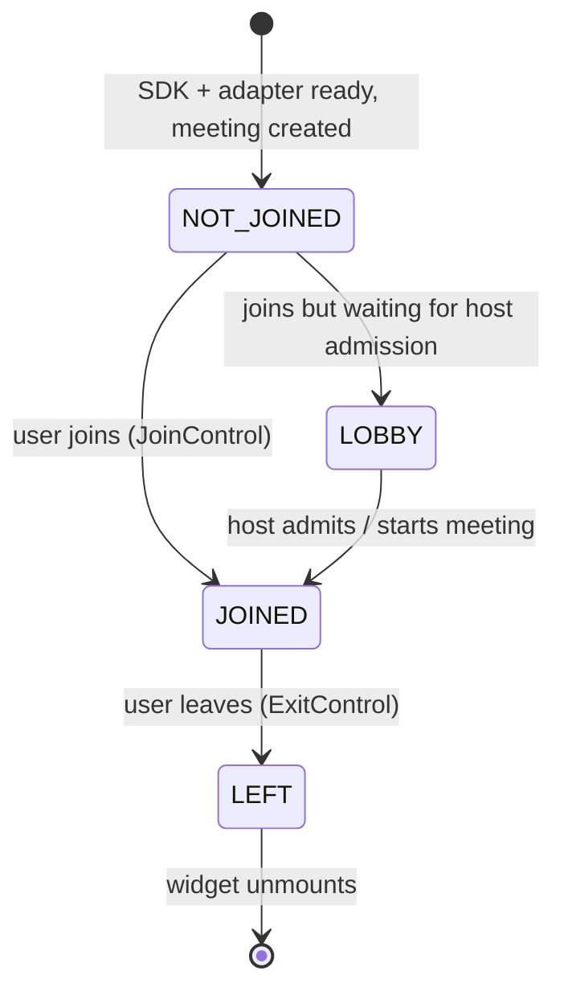
```mermaid
stateDiagram-v2
    [*] --> NOT_JOINED: SDK + adapter ready, meeting created
    NOT_JOINED --> JOINED: user joins (JoinControl)
    NOT_JOINED --> LOBBY: joins but waiting for host admission
    LOBBY --> JOINED: host admits / starts meeting
    JOINED --> LEFT: user leaves (ExitControl)
    LEFT --> [*]: widget unmounts
```

## UI Flow
- **Permission prompt (ASKING):** `WebexMediaAccess` modal for microphone, then camera. Only one shows at a time; audio precedes video (`WebexMeetings.jsx:188-191`).
- **Meeting view (resolved):** `WebexMeeting` renders the interstitial (pre-join, controls `mute-audio`, `mute-video`, `settings`, `join-meeting`), in-meeting (controls add `share-screen`, `member-roster`, `leave-meeting`), waiting-for-host, settings modal, and guest/host auth modals — all from `@webex/components`.
- **Layouts:** `Grid` (default), `Overlay`, `Stack`, `Prominent`, `Focus` via the `layout` prop (`src/widgets/WebexMeetings/README.md:47-93`).
- **Loading state:** while the adapter/meeting are not ready (falsy meeting state), `WebexMeeting` shows a loading view (external).
- **Accessibility:** root is focusable (`tabIndex=0`); custom shim routes focus to the media container or Join button and supports left/right arrow navigation across control buttons (`WebexMeetings.jsx:41-177`).
- **Sizing:** the widget is fluid with no default size; hosts must set `width`/`height` via `style`/`className` (`src/widgets/WebexMeetings/README.md:26-32`).

## Pitfalls
- **Duplicate SDK/meeting initialization is NOT fixable in the widget class.** `new Webex()`, `new WebexSDKAdapter()`, `adapter.connect()`, and `createMeeting(destination)` all happen in the `withAdapter`/`withMeeting` HOCs from `@webex/components`, not in this class's lifecycle (`WebexMeetings.jsx:259-278`). Strict-mode double-mount or a changing `accessToken`/`meetingDestination`/`key` prop re-runs the factory. Chase these in the HOC layer, not here.
- **The accessibility shim reaches into `@webex/components` DOM via hard-coded class selectors** (`.wxc-meeting-control-bar__controls`, `.wxc-in-meeting__media-container`, etc.) and a `button[aria-label="Join meeting"]` lookup (`WebexMeetings.jsx:51,104,146`). An upstream class/label rename silently breaks focus navigation. It is explicitly marked temporary, to be removed once upstream `WebexMeeting` supports these features (`WebexMeetings.jsx:36-39`).
- **`render()` dereferences `meeting.localAudio?.permission` but assumes `meeting` is non-null.** A null `meeting` prop throws (caught only by a host ErrorBoundary) — see the error-handling test (`tests/WebexMeetings/WebexMeetings.test.jsx:221-233`).
- **`SettingsControl` display state never toggles** — a known `@webex/sdk-component-adapter` inconsistency: `display()` reads `showSettings` but `toggleSettings()` writes `settings.visible`. Cosmetic only; the modal still opens/closes. (External; archived ARCHITECTURE.md.)
- **Browser limitations (external SDK):** microphone switching is disabled in Firefox (single active mic limit); screen share requires `getDisplayMedia` (HTTPS, no mobile/IE); iOS 15.1 refreshes the page on join with camera permission granted due to missing video codecs (`src/widgets/WebexMeetings/README.md:139-156`).
- **Pinned dependency versions:** `webex`, `@webex/components`, and `@webex/sdk-component-adapter` are pinned exactly (no caret) in `package.json`. Bumping one without the others can break the adapter/SDK contract.
- **UI stops updating after control actions (external).** Symptom: the UI doesn't change after a control action. Causes: the Mercury WebSocket connection dropped, the observable subscription was lost, or the adapter stopped emitting updates. Check WebSocket status in the network tab, confirm the observable subscription is active, and look for WebSocket events in the network inspector. This is downstream of the adapter, not the widget class.
- **`AdapterContext` not provided (external).** Symptom: components crash with "Cannot read property of undefined". Causes: `AdapterContext.Provider` is not wrapping `WebexMeeting`, or the adapter is not yet initialized when components render. Ensure `<AdapterContext.Provider value={adapter}>` wraps all components and that the adapter is ready before rendering — both are managed by the `withAdapter` HOC.
- **Widget stuck on loading (external).** Symptom: loading state never resolves and no meeting UI appears. Causes: invalid/expired access token, backend connectivity, or device-registration failure. Verify the token, check network connectivity, and inspect the browser console for SDK errors.
- **Audio/video not working after join (external).** Symptom: joined but no media; controls show "No camera"/"No microphone". Causes: browser denied `getUserMedia`, media negotiation (SDP/ROAP) failed, or the media server is unreachable. Check the browser permission prompts, verify `getUserMedia` works, and review SDK logs.
- **Screen share not available (external).** Symptom: the share button is disabled and shows "Share screen not supported". Causes: the browser does not support `getDisplayMedia`, the app is served over HTTP instead of HTTPS, or `navigator.mediaDevices.getDisplayMedia` is undefined. `ShareControl` checks `navigator.mediaDevices.getDisplayMedia` availability before enabling and renders DISABLED when absent. Verify HTTPS and browser compatibility (Chrome ≥72, Edge ≥79, Firefox ≥66, Opera ≥60, Safari ≥13; not mobile/IE) (`src/widgets/WebexMeetings/README.md:149-152`).

## Module Do's / Don'ts
- DO: keep SDK construction inside the `adapterFactory` argument of `withAdapter` (`WebexMeetings.jsx:259`); the class must stay free of SDK lifecycle.
- DO: read meeting data only off the injected `meeting` prop and through `@webex/components` hooks — never reach into the SDK directly.
- DON'T: assume this widget shares anything with the Contact Center widgets — no `@webex/cc-store`, no MobX, no TypeScript, no r2wc custom element, no CC dependency flow.
- DON'T: add behavior to the accessibility shim without expecting to delete it; it is a temporary workaround over upstream DOM.
- DON'T: hardcode the `webex`/`components`/`adapter` versions anywhere but `package.json`.

## Export Stability
The package ships an ESM bundle (`main`/`module` → `dist/webexWidgets.mjs`) whose sole export is
`WebexMeetingsWidget` (`src/index.js:1`). The breaking surface is: the export name, the two required props
(`accessToken`, `meetingDestination`), and the type/semantics of all declared props
(`WebexMeetings.jsx:231-255`). Adding an optional prop or a new export is additive (minor); renaming or
removing the export, or changing a required prop's type/requiredness, is breaking (major). There is no
emitted TypeScript declaration surface (JS + PropTypes only) — consumers rely on PropTypes runtime checks
and the README. Releases are cut by `semantic-release` from conventional commits.

## Host Integration & Theming
- Mounts as a plain React component (`<WebexMeetingsWidget .../>`); unlike the CC widgets it is NOT registered as an r2wc custom element.
- Peer requirements: `react`/`react-dom` `18.3.1`, `prop-types` `^15.7.2`, and `webex` `2.60.4` must be provided by the host at the pinned versions (`package.json` peerDependencies).
- Styling: the widget imports `@webex/components/dist/css/webex-components.css` and its own `WebexMeetings.css` (`WebexMeetings.jsx:8-9`). Hosts size it via `style`/`className` on the root (`webex-meetings-widget`); it is fluid with no intrinsic size.
- The root element is given `tabIndex=0` and a `WebexLogo` SVG is injected into `WebexMeeting`.
- FedRAMP: pass `fedramp={true}` to route the SDK to a FedRAMP-compliant environment (`WebexMeetings.jsx:267`).

## Test-Case Strategy (module)
Unit tests (`tests/WebexMeetings/WebexMeetings.test.jsx`) mock `@webex/components`, `webex`, and
`@webex/sdk-component-adapter`, then capture the adapter factory passed to `withAdapter`. They assert both
positive and negative cases: render branching (media-access vs meeting, audio-over-video priority, the
negative "meeting not rendered when ASKING"), prop forwarding, defaults, a null-`meeting` error path (via a
test ErrorBoundary), the accessibility shim (focus routing, arrow navigation, Tab handling, MutationObserver
re-attach), unmount cleanup, and the SDK factory config (token, fedramp, experimental flags, dev appName,
adapter construction). E2E (`tests/WebexMeeting.e2e.js`, WebdriverIO) drives the demo against a real
test user/room. Edge cases owned downstream (join/password/leave/device-switch, LOBBY transitions) are
exercised by `@webex/components`/`@webex/sdk-component-adapter`, not here.

| Behavior / Requirement | Existing test evidence | Gap |
|---|---|---|
| `MEETINGS-WIDGETS-R-001` | `WebexMeetings.test.jsx:28-44` | none |
| `MEETINGS-WIDGETS-R-002` | `WebexMeetings.test.jsx:516-570` | none |
| `MEETINGS-WIDGETS-R-003` | `WebexMeetings.test.jsx:527-562` | none |
| `MEETINGS-WIDGETS-R-004` | `WebexMeetings.test.jsx:572-580` | No test for the production (`webex-widgets-meetings`) appName branch |
| `MEETINGS-WIDGETS-R-005` | `WebexMeetings.test.jsx:104-135` | none |
| `MEETINGS-WIDGETS-R-006` | `WebexMeetings.test.jsx:115-124,144-149` | none |
| `MEETINGS-WIDGETS-R-007` | `WebexMeetings.test.jsx:151-178` | none |
| `MEETINGS-WIDGETS-R-008` | `WebexMeetings.test.jsx:96-102,180-206` | none |
| `MEETINGS-WIDGETS-R-009` | `WebexMeetings.test.jsx:195-219` | none |
| `MEETINGS-WIDGETS-R-010` | `WebexMeetings.test.jsx:235-513` | none |

## Traceability
- Repo architecture: [`../../../../ai-docs/ARCHITECTURE.md`](../../../../ai-docs/ARCHITECTURE.md) · Registry: [`../../../../ai-docs/SPEC_INDEX.md`](../../../../ai-docs/SPEC_INDEX.md)
- Contracts catalog (CC family; this module not yet listed — see Source Material Register): [`../../../../ai-docs/CONTRACTS.md`](../../../../ai-docs/CONTRACTS.md)
- Coverage state & contracts baseline: `.sdd/manifest.json`
