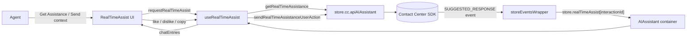
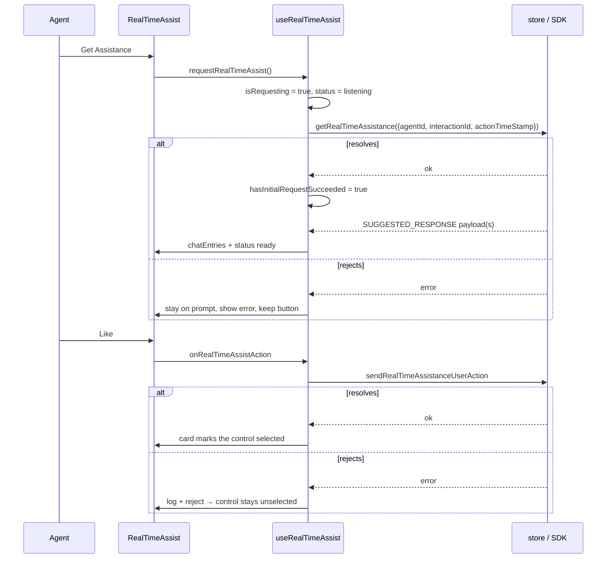

# ai-assistant — SPEC

> Start here → root [`AGENTS.md`](../../../../AGENTS.md) (agent entry) · router [`SPEC_INDEX.md`](../../../../ai-docs/SPEC_INDEX.md) · system [`ARCHITECTURE.md`](../../../../ai-docs/ARCHITECTURE.md). This is the module's canonical spec: orientation, requirements, design, flows, and tests.
> Context-efficiency: link to canonical docs — don't duplicate them. Load specs on demand per `SPEC_INDEX.md`.

## Metadata
| Field | Value |
|---|---|
| Module id | `ai-assistant` |
| Source path(s) | `packages/contact-center/ai-assistant/src/` |
| Doc kind | Module spec |
| Coverage score | Pending coverage assessment |
| Generated from | `module-spec` @ SDLC template library `0.1.0-draft` |
| generated_by / approved_by / updated_at | generated_by `ai-assistant feature work` / approved_by `pending` / updated_at `2026-08-04` |
| Validation status | not-run |

## Evidence Rules
Every requirement below cites concrete source evidence using `file path`. Source evidence, test evidence,
and gaps are kept separate so validators and future agents can distinguish truth from context.

## Overview
`ai-assistant` is the AI Assistant widget for Webex Contact Center, published as `@webex/cc-ai-assistant`.
It owns the assistant's chrome (launcher → open → minimized → fullscreen) and the **Real-time Assist**
feature: on request, the SDK returns suggestion Adaptive Cards for the active interaction, which the agent
can refine with extra context and act on with like / dislike / copy.

The package is the container layer only. All UI lives in `@webex/cc-components`
(`AIAssistantComponent`, `RealTimeAssist`, `AdaptiveCardRenderer`), all SDK access goes through
`@webex/cc-store`, and the Web Component wrapper lives in `@webex/cc-widgets`. A maintainer should start
at `src/ai-assistant/index.tsx` (observer container), then `src/helper.ts` (the two hooks that hold all
behavior), then `src/ai-assistant.types.ts` (public props).

## Purpose / Responsibility
Owns: assistant chrome state, the real-time assist request lifecycle, chat transcript assembly from
store payloads, and forwarding agent feedback actions to the SDK. Does NOT own: card rendering, panel
markup, SDK transport, or the store's `realTimeAssist` event plumbing.

## Stack
TypeScript 5.6.3, React (peer `>=18.3.1`) function components + hooks, MobX via `mobx-react-lite`
`observer`, `react-error-boundary`. Tests: Jest 29.7.0 + React Testing Library 16.0.1, jsdom. Build:
Webpack 5 to `dist/`. Source of truth: `package.json`.

## Folder / Package Structure
```
packages/contact-center/ai-assistant/
├── src/
│   ├── index.ts                 # Barrel: AIAssistant + public types
│   ├── ai-assistant/index.tsx   # observer container + ErrorBoundary
│   ├── helper.ts                # useAIAssistantChrome, useRealTimeAssist, useAiAssistant
│   └── ai-assistant.types.ts    # IAIAssistantProps + hook input types
├── tests/
│   ├── ai-assistant/index.tsx   # container render/integration tests
│   ├── ai-assistant/feedback.tsx# like/dislike/copy → SDK tests
│   └── helper.ts                # hook unit tests
└── package.json / tsconfig* / webpack.config.js / jest.config.js
```

## Key Files (source of truth)
| File | Holds |
|---|---|
| `packages/contact-center/ai-assistant/src/index.ts` | Public export barrel (`AIAssistant` + types). |
| `packages/contact-center/ai-assistant/src/ai-assistant/index.tsx` | Store wiring: feature flag, active interaction, logger, deprecated-callback bridge, ErrorBoundary. |
| `packages/contact-center/ai-assistant/src/helper.ts` | All behavior: chrome transitions, request lifecycle, chat assembly, feedback dispatch, `REAL_TIME_ASSIST_FLAG`. |
| `packages/contact-center/ai-assistant/src/ai-assistant.types.ts` | `IAIAssistantProps` — the host-facing contract. |
| `packages/contact-center/cc-widgets/src/wc.ts` | `widget-cc-ai-assistant` custom element and its prop map. |

## Public Surface
| Contract ID | Type | Surface | Purpose | Compatibility | Detail |
|---|---|---|---|---|---|
| `ai-assistant.AIAssistant` | SDK | `<AIAssistant {...IAIAssistantProps} />` | React entry point for the widget. | stable | `src/ai-assistant/index.tsx` |
| `ai-assistant.IAIAssistantProps` | SDK | Host callbacks + `className` | Opt-in host notifications. | additive props = minor | `src/ai-assistant.types.ts` |
| `widget-cc-ai-assistant` | Custom element | r2wc wrapper | Web Component host integration. | prop map must mirror `IAIAssistantProps` | `packages/contact-center/cc-widgets/src/wc.ts` |

`onSuggestionReceived` is deprecated in favour of `onRealTimeAssistReceived`; the container accepts either
(`src/ai-assistant/index.tsx`) and both are registered on the custom element.

## Requires (dependencies)
- `@webex/cc-store` — `store.cc.apiAIAssistant` (`getRealTimeAssistance`, `sendRealTimeAssistanceUserAction`), `store.realTimeAssist`, `store.currentTask`, `store.agentId`, `store.agentProfile`, `store.featureFlags`, `store.logger`.
- `@webex/cc-components` — `AIAssistantComponent` and its types.
- `@webex/cc-ui-logging` — `withMetrics` (applied inside `cc-components`).
- `mobx-react-lite`, `react-error-boundary`.

## Requirements
| ID | WHAT | WHY | Source Evidence | Test Evidence | Confidence |
|---|---|---|---|---|---|
| `ai-assistant-R-001` | Chrome moves closed → open → minimized → open and fires the matching host callback on each transition; closing preserves chat state. | The agent must be able to park the panel mid-interaction without losing context. | `src/helper.ts` (`useAIAssistantChrome`) | `tests/helper.ts`, `tests/ai-assistant/index.tsx` | PRESENT |
| `ai-assistant-R-002` | The landing view is shown when the feature flag is off or no interaction is active, and `requestStatus` stays `idle` in that case (never `error`). | Absence of a call is not a failure; showing an error would be misleading. | `packages/contact-center/cc-components/src/components/AIAssistant/ai-assistant.tsx`, `src/helper.ts` (early return in `requestRealTimeAssist`) | `packages/contact-center/cc-components/tests/components/AIAssistant/ai-assistant.tsx` | PRESENT |
| `ai-assistant-R-003` | The opening prompt stays until the first `getRealTimeAssistance` call resolves: in-flight shows a spinner, failure keeps the prompt plus an error message, success switches to listening mode permanently. | A failed first request must be retryable; later failures must not unwind an established session. | `src/helper.ts` (`hasInitialRequestSucceeded` set after `await`), `packages/contact-center/cc-components/src/components/AIAssistant/RealTimeAssist/real-time-assist.tsx` | `packages/contact-center/cc-components/tests/components/AIAssistant/ai-assistant.tsx`, `tests/helper.ts` | PRESENT |
| `ai-assistant-R-004` | `isRequesting` is true only while a `getRealTimeAssistance` call is unresolved; the UI uses it to show the spinner and to block the request controls. | Double-clicking a request control must not fan out duplicate SDK calls. | `src/helper.ts` (`isRequesting`), `packages/contact-center/cc-components/src/components/AIAssistant/RealTimeAssist/real-time-assist.tsx` (disabled submit + guarded `handleContextSubmit`) | `tests/helper.ts`, `packages/contact-center/cc-components/tests/components/AIAssistant/ai-assistant.tsx` | PRESENT |
| `ai-assistant-R-005` | Every unseen `realTimeAssist` payload invokes `onRealTimeAssistReceived` once, even when several land before React commits. | Hosts mirror the transcript; a dropped payload is unrecoverable. | `src/helper.ts` (response effect loops from the previous cursor) | `tests/helper.ts` | PRESENT |
| `ai-assistant-R-006` | Changing `interactionId` resets request status, error, context draft, pending flag, first-success flag, user messages, and the payload cursor. | Session state from one customer must never surface on the next. | `src/helper.ts` (reset effect keyed on `interactionId`) | `tests/helper.ts` | PRESENT |
| `ai-assistant-R-007` | `chatEntries` is a chronological transcript — greeting (only after first success), then user and assistant entries ordered by timestamp, user first on ties. | The agent reads context and suggestion in the order they happened. | `src/helper.ts` (`chatEntries` memo) | `tests/helper.ts` | PRESENT |
| `ai-assistant-R-008` | Like / dislike / copy call `sendRealTimeAssistanceUserAction` and return its promise; the card marks the control as selected only after that promise resolves, and a rejection is logged and leaves the control untouched. | The UI must not claim feedback was recorded when it was not. | `src/helper.ts` (`handleRealTimeAssistAction`), `packages/contact-center/cc-components/src/components/AIAssistant/AdaptiveCardRenderer/adaptive-card-renderer.tsx` (`emitUserAction`) | `tests/ai-assistant/feedback.tsx`, `packages/contact-center/cc-components/tests/components/AIAssistant/adaptive-card-renderer.test.tsx` | PRESENT |
| `ai-assistant-R-009` | When the action cannot be sent (missing `adaptiveCardId`, ids, or SDK method), the reason is logged via `store.logger.warn` and the returned promise rejects. | A silent no-op leaves both agent and support blind. | `src/helper.ts` | `tests/ai-assistant/feedback.tsx` | PRESENT |
| `ai-assistant-R-010` | A render failure is contained by the widget's `ErrorBoundary` and reported through `store.onErrorCallback('AIAssistant', error)`. | A crashing assistant must not take the agent desktop down. | `src/ai-assistant/index.tsx` | `tests/ai-assistant/index.tsx` | PRESENT |

## Design Overview
`src/ai-assistant/index.tsx` is a thin `observer` container: it reads the store, derives
`isFeatureEnabled` from `featureFlags[REAL_TIME_ASSIST_FLAG]` and the active interaction from
`currentTask.data.interactionId`, resolves the deprecated callback alias, and hands everything to
`useAiAssistant`, whose result is spread straight onto `AIAssistantComponent`.

`src/helper.ts` holds two independent hooks composed by `useAiAssistant`:

- `useAIAssistantChrome` — chrome state machine plus host callbacks. Pure UI state, no SDK.
- `useRealTimeAssist` — the request lifecycle. `requestRealTimeAssist(context?)` is the single entry
  point for both the initial request and extra-context refinements; the presence of `context`
  distinguishes them. It early-returns to `idle` when the feature is off or there is no interaction,
  exposes `isRequesting` for the duration of the SDK call so the UI can block the controls, and only
  flips `hasInitialRequestSucceeded` after the SDK call resolves. Store payloads arrive asynchronously through `store.realTimeAssist`, so
  a separate effect watches that array, advances a cursor, and replays every unseen entry to the host.

Refs (`pendingRequestRef`, `requestStatusRef`, `onRealTimeAssistReceivedRef`) keep the response effect
dependent on `realTimeAssist` alone, so unrelated state changes don't replay payloads.

## Data Flow


## Sequence Diagram(s)
| Operation group | Diagram | Failure coverage |
|---|---|---|
| First request → suggestion → feedback | "Real-time assist round trip" | request rejection keeps the opening prompt; feedback rejection leaves the card control unselected |



## Use Cases
- **UC-1 Ask for a suggestion:** agent opens the panel during a call and clicks "Get Assistance" → spinner → listening mode with the assistant greeting; cards stream in as the conversation progresses.
- **UC-2 Refine with context:** agent types context and sends → an `ADD_SUGGESTIONS_EXTRA_CONTEXT` request goes out, the message appears in the transcript, and the panel remains in listening mode whether or not it succeeds.
- **UC-3 Give feedback:** agent likes/dislikes/copies a card → the SDK records the action and the icon then shows as selected; a failure leaves it unselected so the agent can retry.
- **UC-4 No active call:** agent opens the panel with no interaction or the feature disabled → landing view listing AI features, no error state.

## Error Handling & Failure Modes
| Condition | Signal | Recovery |
|---|---|---|
| Feature disabled / no interaction | `requestStatus` stays `idle`; landing view | None needed — informational state |
| First `getRealTimeAssistance` rejects | `requestStatus = 'error'`, message under the prompt | Agent clicks the button again |
| Later request rejects | Panel stays in listening mode | Next successful push resumes the transcript |
| Overlapping request | Request controls are disabled while `isRequesting` | Wait for the current call to settle |
| Feedback action fails | `store.logger.error`, promise rejects, control stays unselected | Agent can click again |
| Render crash | `ErrorBoundary` renders nothing, `store.onErrorCallback('AIAssistant', error)` | Host decides |

## Pitfalls
- `hasInitialRequestSucceeded` means *the first request resolved*, not *a request was fired*. Setting it before the `await` would strand the agent in listening mode after a failure.
- `requestStatus === 'listening'` is the steady post-success state, not an "in flight" flag. Use `isRequesting` for that, and `pendingRequest` for "waiting on a pushed payload".
- The response effect must depend on `realTimeAssist` only; adding state to its dependency array replays payloads to the host.
- The widget never imports the SDK directly — everything goes through `store.cc`.
- `cc-components` cannot import the store, so failures there (clipboard, card render) surface through the `logger` prop this package passes down.

## Module Do's / Don'ts
- DO put behavior in `helper.ts` and keep `ai-assistant/index.tsx` a thin store-to-props adapter.
- DO pass `store.logger` down so `cc-components` can report failures.
- DON'T import from `@webex/cc-widgets` (circular) or from `@webex/contact-center` directly.
- DON'T add UI markup to this package; it belongs in `cc-components`.
- DON'T remove `onSuggestionReceived` without a major bump; bridge it instead.

## Test-Case Strategy (module)
`tests/helper.ts` drives the hooks with `renderHook`: chrome transitions, request success/failure, the
`isRequesting` lifecycle, interaction reset, batched payload replay, and transcript ordering.
`tests/ai-assistant/index.tsx` renders the container against a mocked store for the landing/listening
views and the ErrorBoundary path. `tests/ai-assistant/feedback.tsx` covers like/dislike/copy dispatch
and the missing-`adaptiveCardId` warning. UI-level rendering (spinner, error text,
snapshots) is covered in `cc-components/tests/components/AIAssistant/`.

Playwright coverage lives in `playwright/tests/real-time-assist-test.spec.ts` and runs in the SET_4
call suite. It deterministically controls the SDK request and feedback promises, injects
`SUGGESTED_RESPONSE` payloads through `store.handleRealTimeAssist`, and verifies the complete visible
state sequence: chrome actions; no-task and feature-disabled gates; empty, requesting, failure/retry,
listening, and ready states; context requests; ordered responses; Adaptive Card fallback and feedback;
close/reopen preservation; and task-removal cleanup. A final test restores the SDK methods and waits for
a live backend suggestion so deterministic rendering coverage does not replace the integration smoke
check.

## Traceability
- Repo architecture: `../../../../ai-docs/ARCHITECTURE.md` · Registry: `../../../../ai-docs/SPEC_INDEX.md`
- Coverage state & contracts baseline: `.sdd/manifest.json`
