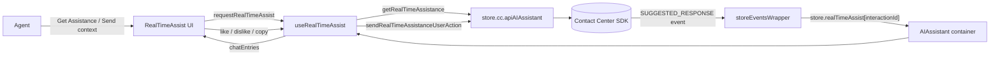
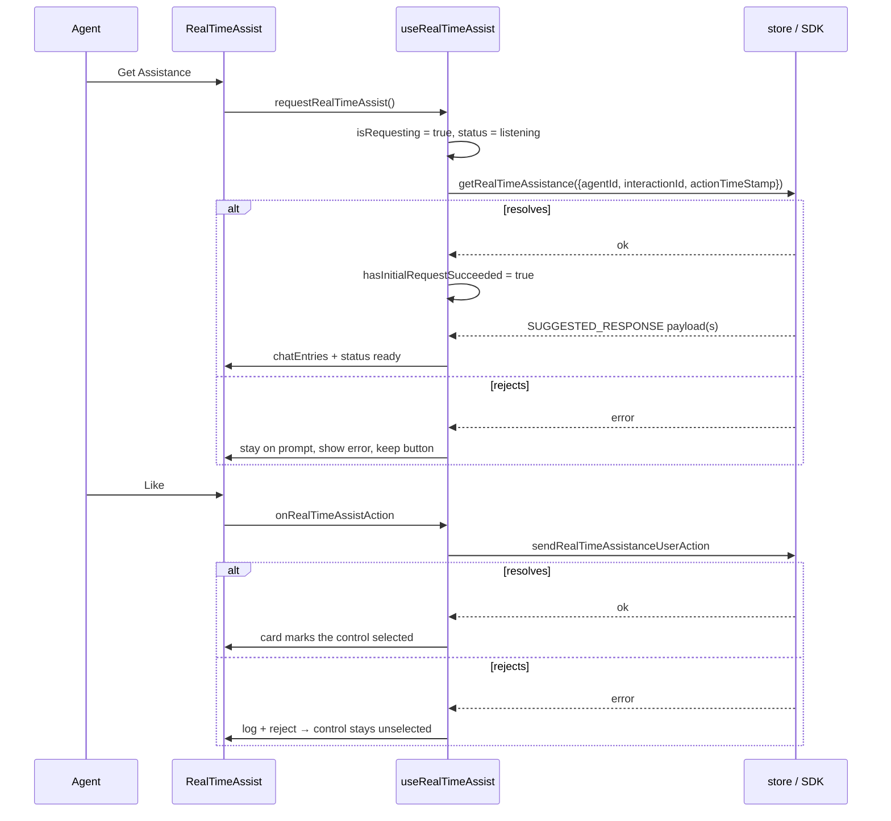

# ai-assistant — SPEC

> Start here → root [`AGENTS.md`](../../../../AGENTS.md) (agent entry) · router [`SPEC_INDEX.md`](../../../../ai-docs/SPEC_INDEX.md) · system [`ARCHITECTURE.md`](../../../../ai-docs/ARCHITECTURE.md). This is the module's canonical spec: orientation, requirements, design, flows, and tests.
> Context-efficiency: link to canonical docs — don't duplicate them. Load specs on demand per `SPEC_INDEX.md`.

## Metadata

| Field                                   | Value                                                                                      |
| --------------------------------------- | ------------------------------------------------------------------------------------------ |
| Module id                               | `ai-assistant`                                                                             |
| Source path(s)                          | `packages/contact-center/ai-assistant/src/`                                                |
| Doc kind                                | Module spec                                                                                |
| Coverage score                          | Pending coverage assessment                                                                |
| Generated from                          | `module-spec` @ SDLC template library `0.1.0-draft`                                        |
| generated_by / approved_by / updated_at | generated_by `ai-assistant feature work` / approved_by `pending` / updated_at `2026-09-04` |
| Validation status                       | not-run                                                                                    |

## Evidence Rules

Every requirement below cites concrete source evidence using `file path`. Source evidence, test evidence,
and gaps are kept separate so validators and future agents can distinguish truth from context.

## Overview

`ai-assistant` is the AI Assistant widget for Webex Contact Center, published as `@webex/cc-ai-assistant`.
It owns the assistant's chrome (launcher → open → minimized → fullscreen), **Real-time Assist**, and the
Agent Wellness Break lifecycle. Inbound wellness notifications are agent/org-scoped and independent of
an active interaction or a matching notification session; outbound wellness actions use the SDK's
identity-free methods and therefore remain owned by the SDK's active registration and login/relogin
context. The widget requests or responds to offers, coordinates agent state, waits for safe work
completion, runs the timed media surface, and restores state.

The package is the container layer only. All UI lives in `@webex/cc-components`
(`AIAssistantComponent`, `RealTimeAssist`, `AdaptiveCardRenderer`), all SDK access goes through
`@webex/cc-store`, and the Web Component wrapper lives in `@webex/cc-widgets`. A maintainer should start
at `src/ai-assistant/index.tsx` (observer container), then `src/helper.ts` (the two hooks that hold all
behavior), then `src/ai-assistant.types.ts` (public props).

## Purpose / Responsibility

Owns: assistant chrome state, the real-time assist request lifecycle, chat transcript assembly from
store payloads, and forwarding agent feedback actions to the SDK. Does NOT own: card rendering, panel
markup, SDK transport, or the store's `realTimeAssist` event plumbing.

## Stack

TypeScript 5.6.3, React (peer `>=18.3.1`) function components + hooks, MobX via `mobx-react-lite`
`observer`, `react-error-boundary`. Tests: Jest 29.7.0 + React Testing Library 16.0.1, jsdom. Build:
Webpack 5 to `dist/`. Source of truth: `package.json`.

## Folder / Package Structure

```
packages/contact-center/ai-assistant/
├── src/
│   ├── index.ts                 # Barrel: AIAssistant + public types
│   ├── ai-assistant/index.tsx   # observer container + ErrorBoundary
│   ├── helper.ts                # useAIAssistantChrome, useRealTimeAssist, useAiAssistant
│   ├── wellness/                # lifecycle hook, pure decisions, lazy media assets
│   └── ai-assistant.types.ts    # IAIAssistantProps + hook input types
├── tests/
│   ├── ai-assistant/index.tsx   # container render/integration tests
│   ├── ai-assistant/feedback.tsx# like/dislike/copy → SDK tests
│   └── helper.ts                # hook unit tests
└── package.json / tsconfig* / webpack.config.js / jest.config.js
```

## Key Files (source of truth)

| File                                                              | Holds                                                                                                           |
| ----------------------------------------------------------------- | --------------------------------------------------------------------------------------------------------------- |
| `packages/contact-center/ai-assistant/src/index.ts`               | Public export barrel (`AIAssistant` + types).                                                                   |
| `packages/contact-center/ai-assistant/src/ai-assistant/index.tsx` | Store wiring: feature flag, active interaction, logger, deprecated-callback bridge, ErrorBoundary.              |
| `packages/contact-center/ai-assistant/src/helper.ts`              | All behavior: chrome transitions, request lifecycle, chat assembly, feedback dispatch, `REAL_TIME_ASSIST_FLAG`. |
| `packages/contact-center/ai-assistant/src/ai-assistant.types.ts`  | `IAIAssistantProps` — the host-facing contract.                                                                 |
| `packages/contact-center/cc-widgets/src/wc.ts`                    | `widget-cc-ai-assistant` custom element and its prop map.                                                       |

## Public Surface

| Contract ID                      | Type           | Surface                                                                     | Purpose                                                                 | Compatibility                            | Detail                                                          |
| -------------------------------- | -------------- | --------------------------------------------------------------------------- | ----------------------------------------------------------------------- | ---------------------------------------- | --------------------------------------------------------------- |
| `ai-assistant.AIAssistant`       | SDK            | `<AIAssistant {...IAIAssistantProps} />`                                    | React entry point for the widget.                                       | stable                                   | `src/ai-assistant/index.tsx`                                    |
| `ai-assistant.IAIAssistantProps` | SDK            | Host callbacks, `className`, and `wellnessBreakOverlayTarget`                | Opt-in host notifications and host-controlled break coverage.           | additive props = minor                   | `src/ai-assistant.types.ts`                                     |
| `ai-assistant.wellness`          | SDK            | Five wellness callbacks, media/overlay configuration, and exported types    | Host notification, media, and layout integration without exposing SDK transport. | additive props/types = minor      | `src/ai-assistant.types.ts`, `src/wellness/useWellnessBreak.ts` |
| `widget-cc-ai-assistant`         | Custom element | r2wc wrapper                                                                | Web Component host integration.                                         | prop map must mirror `IAIAssistantProps` | `packages/contact-center/cc-widgets/src/wc.ts`                  |

Import `AIAssistant` from `@webex/cc-widgets` or directly from `@webex/cc-ai-assistant` for React. The existing
`@webex/cc-widgets/wc` entry registers `widget-cc-ai-assistant`; there is no
separate AI Assistant WC entry. This package owns `lottie-web` and the wellness
MP3; `cc-components` receives an animation loader as a prop and has no media dependency.

The CommonJS package includes the MP3, animation data, and its media loader under
`dist/assets/wellness`. Webpack emits the MP3 and lazy Lottie/animation chunks into
the consuming app without an asset rule or copy step. The browser fetches them
only when the wellness UI uses them. The React sample also supports this path
when it builds the assistant source.

The orchestration uses only the published wellness contract and legacy `setAgentState()` path from the
store. It does not consume an AI Assistant RTD status event.

`onSuggestionReceived` is deprecated in favour of `onRealTimeAssistReceived`; the container accepts either
(`src/ai-assistant/index.tsx`) and both are registered on the custom element.

## Requires (dependencies)

- `@webex/cc-store` — `store.cc.apiAIAssistant` (`getRealTimeAssistance`, `sendRealTimeAssistanceUserAction`), `store.realTimeAssist`, `store.currentTask`, `store.agentId`, `store.agentProfile`, `store.featureFlags`, `store.logger`.
- `@webex/cc-components` — `AIAssistantComponent` and its types.
- `@webex/cc-ui-logging` — `withMetrics` (applied inside `cc-components`).
- `mobx-react-lite`, `react-error-boundary`.

## Requirements

| ID                   | WHAT                                                                                                                                                                                                                                                                                                                                                                    | WHY                                                                                                                                                       | Source Evidence                                                                                                                                                                            | Test Evidence                                                                                                                           | Confidence |
| -------------------- | ----------------------------------------------------------------------------------------------------------------------------------------------------------------------------------------------------------------------------------------------------------------------------------------------------------------------------------------------------------------------- | --------------------------------------------------------------------------------------------------------------------------------------------------------- | ------------------------------------------------------------------------------------------------------------------------------------------------------------------------------------------ | --------------------------------------------------------------------------------------------------------------------------------------- | ---------- |
| `ai-assistant-R-001` | Chrome moves closed → open → minimized → open and fires the matching host callback on each transition; closing preserves chat state.                                                                                                                                                                                                                                    | The agent must be able to park the panel mid-interaction without losing context.                                                                          | `src/helper.ts` (`useAIAssistantChrome`)                                                                                                                                                   | `tests/helper.ts`, `tests/ai-assistant/index.tsx`                                                                                       | PRESENT    |
| `ai-assistant-R-002` | The landing view is shown when the feature flag is off or no interaction is active, and `requestStatus` stays `idle` in that case (never `error`).                                                                                                                                                                                                                      | Absence of a call is not a failure; showing an error would be misleading.                                                                                 | `packages/contact-center/cc-components/src/components/AIAssistant/ai-assistant.tsx`, `src/helper.ts` (early return in `requestRealTimeAssist`)                                             | `packages/contact-center/cc-components/tests/components/AIAssistant/ai-assistant.tsx`                                                   | PRESENT    |
| `ai-assistant-R-003` | The opening prompt stays until the first `getRealTimeAssistance` call resolves: in-flight shows a spinner, failure keeps the prompt plus an error message, success switches to listening mode permanently.                                                                                                                                                              | A failed first request must be retryable; later failures must not unwind an established session.                                                          | `src/helper.ts` (`hasInitialRequestSucceeded` set after `await`), `packages/contact-center/cc-components/src/components/AIAssistant/RealTimeAssist/real-time-assist.tsx`                   | `packages/contact-center/cc-components/tests/components/AIAssistant/ai-assistant.tsx`, `tests/helper.ts`                                | PRESENT    |
| `ai-assistant-R-004` | `isRequesting` is true only while a `getRealTimeAssistance` call is unresolved; the UI uses it to show the spinner and to block the request controls.                                                                                                                                                                                                                   | Double-clicking a request control must not fan out duplicate SDK calls.                                                                                   | `src/helper.ts` (`isRequesting`), `packages/contact-center/cc-components/src/components/AIAssistant/RealTimeAssist/real-time-assist.tsx` (disabled submit + guarded `handleContextSubmit`) | `tests/helper.ts`, `packages/contact-center/cc-components/tests/components/AIAssistant/ai-assistant.tsx`                                | PRESENT    |
| `ai-assistant-R-005` | Every unseen `realTimeAssist` payload invokes `onRealTimeAssistReceived` once, even when several land before React commits.                                                                                                                                                                                                                                             | Hosts mirror the transcript; a dropped payload is unrecoverable.                                                                                          | `src/helper.ts` (response effect loops from the previous cursor)                                                                                                                           | `tests/helper.ts`                                                                                                                       | PRESENT    |
| `ai-assistant-R-006` | Changing `interactionId` resets request status, error, context draft, pending flag, first-success flag, user messages, and the payload cursor.                                                                                                                                                                                                                          | Session state from one customer must never surface on the next.                                                                                           | `src/helper.ts` (reset effect keyed on `interactionId`)                                                                                                                                    | `tests/helper.ts`                                                                                                                       | PRESENT    |
| `ai-assistant-R-007` | `chatEntries` is a chronological transcript — greeting (only after first success), then user and assistant entries ordered by timestamp, user first on ties.                                                                                                                                                                                                            | The agent reads context and suggestion in the order they happened.                                                                                        | `src/helper.ts` (`chatEntries` memo)                                                                                                                                                       | `tests/helper.ts`                                                                                                                       | PRESENT    |
| `ai-assistant-R-008` | Like / dislike / copy call `sendRealTimeAssistanceUserAction` and return its promise; the card marks the control as selected only after that promise resolves, and a rejection is logged and leaves the control untouched.                                                                                                                                              | The UI must not claim feedback was recorded when it was not.                                                                                              | `src/helper.ts` (`handleRealTimeAssistAction`), `packages/contact-center/cc-components/src/components/AIAssistant/AdaptiveCardRenderer/adaptive-card-renderer.tsx` (`emitUserAction`)      | `tests/ai-assistant/feedback.tsx`, `packages/contact-center/cc-components/tests/components/AIAssistant/adaptive-card-renderer.test.tsx` | PRESENT    |
| `ai-assistant-R-009` | When the action cannot be sent (missing `adaptiveCardId`, ids, or SDK method), the reason is logged via `store.logger.warn` and the returned promise rejects.                                                                                                                                                                                                           | A silent no-op leaves both agent and support blind.                                                                                                       | `src/helper.ts`                                                                                                                                                                            | `tests/ai-assistant/feedback.tsx`                                                                                                       | PRESENT    |
| `ai-assistant-R-010` | A render failure is contained by the widget's `ErrorBoundary` and reported through `store.onErrorCallback('AIAssistant', error)`.                                                                                                                                                                                                                                       | A crashing assistant must not take the agent desktop down.                                                                                                | `src/ai-assistant/index.tsx`                                                                                                                                                               | `tests/ai-assistant/index.tsx`                                                                                                          | PRESENT    |
| `ai-assistant-R-011` | Wellness controls require effective enablement, login, agent/session IDs, and the `WellbeingBreak` system code; `SUGGEST` enables a one-shot request and HTTP 202 remains pending until an independent `PROVIDE` or `NOT_ALLOWED`. Request, offer, denial, timeout, session rotation, and completed restoration consume availability; only a fresh `SUGGEST` enables it again. | HTTP acceptance is not business approval, and a consumed Desktop CTA must not reappear from stale state.                                                  | `src/wellness/useWellnessBreak.ts`                                                                                                                                                         | `tests/wellness.orchestrator.ts`                                                                                                        | PRESENT    |
| `ai-assistant-R-012` | A direct offered break uses legacy `setAgentState()` before sending exactly one `ACCEPTED`; **Later** sends exactly one `REJECTED` without changing state; manual approval sends no redundant `ACCEPTED`; state failure sends no action. | Prevents backend/UI disagreement, duplicate responses, and stranded agent state. | `src/wellness/useWellnessBreak.ts`, `src/wellness/wellness-internal.types.ts` | `tests/wellness.orchestrator.ts` | PRESENT |
| `ai-assistant-R-013` | Playback waits for exact legacy wellness-state confirmation, all-task safety, and a 2-second settle window; it runs a 5/60/5 timeline, exposes whether a real task is blocking status copy, reverts to waiting if work appears during start, and requests Available (`auxCodeId: 0`) as soon as the break ends. | Active voice, digital, campaign, consult, or wrap-up work must not be interrupted; transient state confirmation must not be described as active work. Completion returns the agent to Available even when the pre-break state was Meeting or another state appeared during playback. | `src/wellness/useWellnessBreak.ts`, `src/wellness/wellness.utils.ts` | `tests/wellness.utils.ts`, `tests/wellness.orchestrator.ts` | PRESENT |
| `ai-assistant-R-014` | Restoration is bounded, preserves externally-owned/RONA idle states before playback, stores only minimal session-scoped legacy recovery data, ignores stale async results after session rotation, and never replays media or actions after refresh. | The agent must not remain in `WellbeingBreak` or have another session's state claimed. | `src/wellness/useWellnessBreak.ts`, `src/wellness/wellness.utils.ts` | `tests/wellness.utils.ts`, `tests/wellness.orchestrator.ts` | PRESENT |
| `ai-assistant-R-015` | This package owns the MP3 and `lottie-web`; the MP3, Lottie data, and renderer are independently lazy-loaded during the five-second starting countdown. The renderer is injected into the shared modal. Lottie holds its first frame during start, plays with the 60-second timeline, and holds its final frame during ending; audio is rewound and starts with playback. Reduced motion uses a static surface and media failure does not block restoration. | Both React import paths retain the same widget behavior; the media remains in separate package files and loads when needed. The existing WC entry retains the assistant. | `webpack.config.js`, `src/wellness/assets/`, `src/wellness/animation.ts`, `src/wellness/useWellnessBreak.ts`, `package.json` | `tests/wellness.orchestrator.ts`, component and package archive verification | PRESENT |
| `ai-assistant-R-016` | Wellness lifecycle, CTA, card, notification, error, and restore actions emit the equivalent Desktop behavioral metric names/taxonomy through the store boundary; properties never include event text, agent/session IDs, or interaction/customer data.                                                                                                                  | Product analytics need action coverage without duplicating SDK operational metrics or leaking sensitive content.                                          | `src/wellness/wellness.metrics.ts`, `src/wellness/useWellnessBreak.ts`                                                                                                                     | `tests/wellness.orchestrator.ts`, `packages/contact-center/store/tests/wellness.ts`                                                     | PRESENT    |
| `ai-assistant-R-017` | `wellnessBreakOverlayTarget` defaults to the viewport, accepts `assistant` for widget-root coverage, and accepts an `HTMLElement` for a custom React host container. The active target's scrolling is locked and restored without retaining host style mutations. | Hosts need full-viewport, widget-local, and custom layout options without changing wellness lifecycle ownership. | `src/ai-assistant.types.ts`, `src/ai-assistant/index.tsx`, `WellnessBreakModal` | `packages/contact-center/cc-components/tests/components/AIAssistant/ai-assistant.tsx`; build/type verification | PRESENT |
| `ai-assistant-R-018` | Wellness offers, user actions, acknowledgements, notices, and completion append chronologically and persist across close/minimize/reopen, fresh notifications, and session rotation. The first header Clear action clears both displayed Real-time Assist and wellness history without changing an active wellness phase or sending a backend action.                   | Desktop keeps the assistant conversation visible until the agent explicitly clears it; chrome transitions and later events must not erase context.                           | `src/helper.ts`, `src/ai-assistant/index.tsx`, `src/wellness/useWellnessBreak.ts`                                                                                                          | `tests/helper.ts`, `tests/wellness.orchestrator.ts`, `packages/contact-center/cc-components/tests/components/AIAssistant/ai-assistant.tsx` | PRESENT    |
| `ai-assistant-R-019` | A direct offer may carry a different notification `agentSessionId`; request calls pass no identity fields, acceptance/rejection/timeout pass only `action`, and the state change still precedes `ACCEPTED`. The SDK supplies the active registration and login/relogin identity context. | Desktop accepts current-agent/current-org nudges independent of diagnostic notification session metadata, while the public SDK prevents callers from overriding action identity. | `src/wellness/useWellnessBreak.ts` | `tests/wellness.orchestrator.ts` | PRESENT |

## Agent Wellness Break lifecycle

The public phases are `idle`, `offer-pending`, `request-pending`, `changing-to-break`,
`waiting-for-safe-state`, `starting`, `playing`, `ending`, `restoring`, and `error`. The orchestrator owns
notification response, safe-state checks across `store.taskList`, the exact 5/60/5 timeline, RONA-aware
cancellation/restoration, bounded retries, and the session-storage refresh marker.
Session rotation keeps offer history but makes its old actions inactive. Each accepted break starts
with a fresh background restore retry budget. Unmount waits for a pending change-to-break request,
then uses the normal guarded Available request and bounded retries; an external state is preserved
on early exit. These rules prevent stale actions and state writes after the
widget or station session changes. Evidence: `src/wellness/useWellnessBreak.ts` and
`tests/wellness.orchestrator.ts`.
Clear removes prior history but keeps a pending offer visible and actionable until the agent responds or
its timer expires. Playback requires two continuous safe seconds; a task or unconfirmed state cancels
the current settle timer.
The overlay is supplied to `cc-components` independently of assistant chrome, so it remains visible while
the launcher is closed or minimized. Its host-facing target defaults to the current viewport; React hosts
may scope it to the assistant root, which expands to panel height during an active overlay, or portal it
into a supplied element. See
[`agent-wellness-break-intake.md`](../../../../ai-docs/features/agent-wellness-break-intake.md).

## Design Overview

`src/ai-assistant/index.tsx` is a thin `observer` container: it reads the store, derives
`isFeatureEnabled` from `featureFlags[REAL_TIME_ASSIST_FLAG]` and the active interaction from
`currentTask.data.interactionId`, resolves the deprecated callback alias, and hands everything to
`useAiAssistant`, whose result is spread straight onto `AIAssistantComponent`.

`src/helper.ts` holds two independent hooks composed by `useAiAssistant`:

- `useAIAssistantChrome` — chrome state machine plus host callbacks. Pure UI state, no SDK.
- `useRealTimeAssist` — the request lifecycle. `requestRealTimeAssist(context?)` is the single entry
  point for both the initial request and extra-context refinements; the presence of `context`
  distinguishes them. It early-returns to `idle` when the feature is off or there is no interaction,
  exposes `isRequesting` for the duration of the SDK call so the UI can block the controls, and only
  flips `hasInitialRequestSucceeded` after the SDK call resolves. Store payloads arrive asynchronously through `store.realTimeAssist`, so
  a separate effect watches that array, advances a cursor, and replays every unseen entry to the host.

Refs (`pendingRequestRef`, `requestStatusRef`, `onRealTimeAssistReceivedRef`) keep the response effect
dependent on `realTimeAssist` alone, so unrelated state changes don't replay payloads.

## Data Flow


```mermaid
graph LR
    Agent[Agent] -->|Get Assistance / Send context| RTA[RealTimeAssist UI]
    RTA -->|requestRealTimeAssist| Hook[useRealTimeAssist]
    Hook -->|getRealTimeAssistance| API["store.cc.apiAIAssistant"]
    API --> SDK[(Contact Center SDK)]
    SDK -->|SUGGESTED_RESPONSE event| SW["storeEventsWrapper"]
    SW -->|"store.realTimeAssist[interactionId]"| Container[AIAssistant container]
    Container --> Hook
    Hook -->|chatEntries| RTA
    RTA -->|like / dislike / copy| Hook
    Hook -->|sendRealTimeAssistanceUserAction| API
```

## Sequence Diagram(s)

| Operation group                       | Diagram                       | Failure coverage                                                                                  |
| ------------------------------------- | ----------------------------- | ------------------------------------------------------------------------------------------------- |
| First request → suggestion → feedback | "Real-time assist round trip" | request rejection keeps the opening prompt; feedback rejection leaves the card control unselected |


```mermaid
sequenceDiagram
    participant A as Agent
    participant UI as RealTimeAssist
    participant H as useRealTimeAssist
    participant S as store / SDK

    A->>UI: Get Assistance
    UI->>H: requestRealTimeAssist()
    H->>H: isRequesting = true, status = listening
    H->>S: getRealTimeAssistance({agentId, interactionId, actionTimeStamp})
    alt resolves
        S-->>H: ok
        H->>H: hasInitialRequestSucceeded = true
        S-->>H: SUGGESTED_RESPONSE payload(s)
        H->>UI: chatEntries + status ready
    else rejects
        S-->>H: error
        H->>UI: stay on prompt, show error, keep button
    end

    A->>UI: Like
    UI->>H: onRealTimeAssistAction
    H->>S: sendRealTimeAssistanceUserAction
    alt resolves
        S-->>H: ok
        H->>UI: card marks the control selected
    else rejects
        S-->>H: error
        H->>UI: log + reject → control stays unselected
    end
```

## Use Cases

- **UC-1 Ask for a suggestion:** agent opens the panel during a call and clicks "Get Assistance" → spinner → listening mode with the assistant greeting; cards stream in as the conversation progresses.
- **UC-2 Refine with context:** agent types context and sends → an `ADD_SUGGESTIONS_EXTRA_CONTEXT` request goes out, the message appears in the transcript, and the panel remains in listening mode whether or not it succeeds.
- **UC-3 Give feedback:** agent likes/dislikes/copies a card → the SDK records the action and the icon then shows as selected; a failure leaves it unselected so the agent can retry.
- **UC-4 No active call:** agent opens the panel with no interaction or the feature disabled → landing view listing AI features, no error state.

## Error Handling & Failure Modes

| Condition                             | Signal                                                                         | Recovery                                    |
| ------------------------------------- | ------------------------------------------------------------------------------ | ------------------------------------------- |
| Feature disabled / no interaction     | `requestStatus` stays `idle`; landing view                                     | None needed — informational state           |
| First `getRealTimeAssistance` rejects | `requestStatus = 'error'`, message under the prompt                            | Agent clicks the button again               |
| Later request rejects                 | Panel stays in listening mode                                                  | Next successful push resumes the transcript |
| Overlapping request                   | Request controls are disabled while `isRequesting`                             | Wait for the current call to settle         |
| Feedback action fails                 | `store.logger.error`, promise rejects, control stays unselected                | Agent can click again                       |
| Render crash                          | `ErrorBoundary` renders nothing, `store.onErrorCallback('AIAssistant', error)` | Host decides                                |

## Pitfalls

- `hasInitialRequestSucceeded` means _the first request resolved_, not _a request was fired_. Setting it before the `await` would strand the agent in listening mode after a failure.
- `requestStatus === 'listening'` is the steady post-success state, not an "in flight" flag. Use `isRequesting` for that, and `pendingRequest` for "waiting on a pushed payload".
- The response effect must depend on `realTimeAssist` only; adding state to its dependency array replays payloads to the host.
- The widget never imports the SDK directly — everything goes through `store.cc`.
- `cc-components` cannot import the store, so failures there (clipboard, card render) surface through the `logger` prop this package passes down.

## Module Do's / Don'ts

- DO put behavior in `helper.ts` and keep `ai-assistant/index.tsx` a thin store-to-props adapter.
- DO pass `store.logger` down so `cc-components` can report failures.
- DON'T import from `@webex/cc-widgets` (circular) or from `@webex/contact-center` directly.
- DON'T add UI markup to this package; it belongs in `cc-components`.
- DON'T remove `onSuggestionReceived` without a major bump; bridge it instead.

## Test-Case Strategy (module)

`tests/helper.ts` drives the hooks with `renderHook`: chrome transitions, request success/failure, the
`isRequesting` lifecycle, interaction reset, batched payload replay, and transcript ordering.
`tests/ai-assistant/index.tsx` renders the container against a mocked store for the landing/listening
views and the ErrorBoundary path. `tests/ai-assistant/feedback.tsx` covers like/dislike/copy dispatch
and the missing-`adaptiveCardId` warning. UI-level rendering (spinner, error text,
snapshots) is covered in `cc-components/tests/components/AIAssistant/`.

## Traceability

- Repo architecture: `../../../../ai-docs/ARCHITECTURE.md` · Registry: `../../../../ai-docs/SPEC_INDEX.md`
- Coverage state & contracts baseline: `.sdd/manifest.json`
