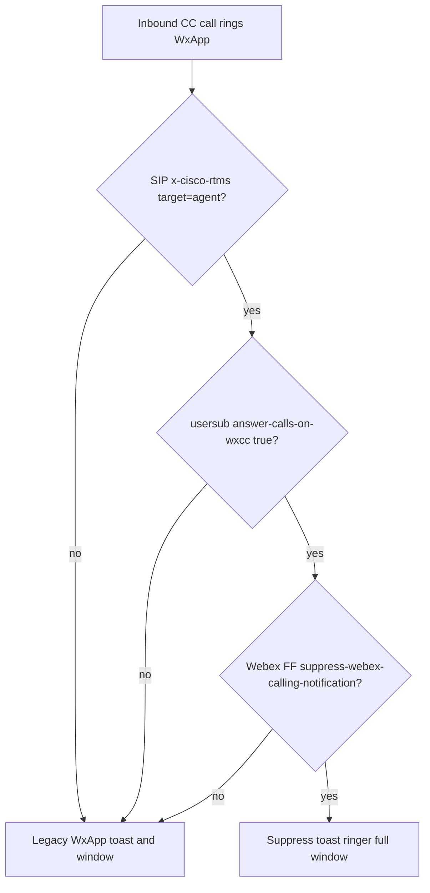
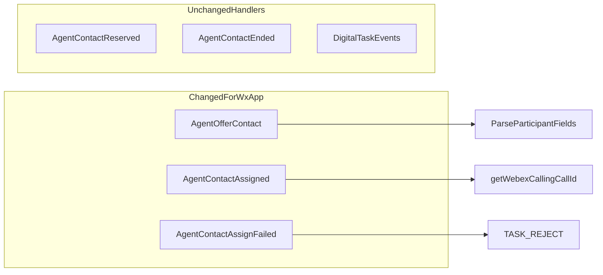
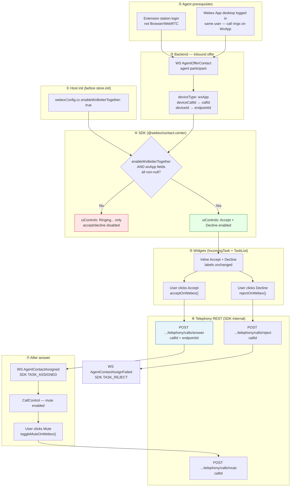

# Feature Intake — Accept Call on Webex Thick Client (WXCC-6026)

> **Status:** CANONICAL — single handoff doc for SDK + widgets implementation  
> **Audience:** SDK developers (webex-js-sdk), widgets developers, QA, downstream AI agents  
> **Target:** SDK merge by **Aug 21, 2026**; widgets follow in next sprint  
> **Related:** [WSDK Confluence intake](https://confluence-eng-gpk2.cisco.com/conf/spaces/WSDK/pages/886080035/Feature+Intake+Accept+Call+on+Webex+Device+%E2%80%94+SDK+Widgets+MakeMyTrip+WXCC-6026), [WXCC-962 TAC TOI](https://confluence-eng-gpk2.cisco.com/conf/spaces/CJPCloud/pages/591022460/TAC+TOI+-+WXCC-962+Unified+Webex+App+experience+within+Desktop+Optimize+Notifications+and+User+clicks), [CAI-8446](https://jira-eng-sjc12.cisco.com/jira/browse/CAI-8446), [Vidcast overview](https://app.vidcast.io/share/cc92f1b8-454a-4afb-89c4-52cf73741743)

---

## 1. Summary

**Customer ask (MakeMyTrip / Epic CTI):** Agents stay in the **CRM desktop embed** and **Accept**, **Decline**, **Mute**, and send **DTMF (keypad)** from engaged wxApp calls — instead of switching to the **Webex App (desktop thick client)** for every interaction.

**Aug 21 P0 deliverable:**

| Layer         | Deliverable                                                                                                                          |
| ------------- | ------------------------------------------------------------------------------------------------------------------------------------ | ------ | ---- | ------ | ------------------ |
| **SDK**       | Unified task telephony: `accept()`, `decline()`, `toggleMute({ muted })`, **`transmitDtmf({ dtmf })`** — SDK routes wxApp internally |
| **SDK**       | Init config gate `enableWxBetterTogether` — controls API availability and `uiControls`                                               |
| **SDK**       | Telephony REST integration (`POST .../telephony/calls/answer                                                                         | reject | mute | unmute | **transmitDTMF**`) |
| **SDK**       | **`usersub/publish`** when `enableWxBetterTogether: true` — suppress Webex App native toast (MMT P0)                                 |
| **Widgets**   | Wire **IncomingTask**, **TaskList**, and **CallControl** (mute + **keypad/DTMF**) to unified SDK task methods; sample-app checkbox   |
| **Unchanged** | Hold, transfer, end, wrap-up, recording — existing SDK / CallControl paths                                                           |

**Happy path:** Extension station login + Webex **desktop app** (≥ **44.12.\*** ) logged in as the same user on the **same machine** + config enabled + backend sends wxApp participant fields on WS offer + CC call carries SIP header **`x-cisco-rtms target="agent"`** (platform) + SDK publishes usersub `answer-calls-on-wxcc: true`.

---

## 2. Out of scope and deferred (this intake)

### 2.1 Aug 21 priority split

| Item                                                                                 | Aug 21 status                                                      |
| ------------------------------------------------------------------------------------ | ------------------------------------------------------------------ |
| Telephony accept / decline / mute (`accept()`, `decline()`, `toggleMute({ muted })`) | **P0**                                                             |
| `usersub/publish` toast suppression when `enableWxBetterTogether: true`              | **P0** — see §4.5; SDK-owned (no AD profile toggle in embed)       |
| Error UX on telephony failure (answer/decline inline + mute/DTMF toast)              | **P1** — AD parity; see §9                                         |
| Keypad / `transmitDtmf({ dtmf })` + widget keypad UI                                 | **P0** — see §2.2, §5.4                                            |
| Hold sync with Webex App                                                             | **Fast-follow** — v1 uses existing `task.hold()` / `task.resume()` |

Do **not** implement or document as **P0** requirements:

| Topic                                                             | Notes                                                                                                   |
| ----------------------------------------------------------------- | ------------------------------------------------------------------------------------------------------- |
| Split.io feature flag `suppress-webex-calling-notification`       | AD-only org FF — makes AD profile toggle **visible**; SDK does **not** read split.io                    |
| AD profile toggle _"Manage Webex Calling calls in Agent Desktop"_ | AD localStorage / Notification settings UI — embed uses `enableWxBetterTogether` instead                |
| Preferred device (WXCC-5026)                                      | AD setting exists but **not used** for this feature scope; no SDK fallback to preferred endpoint in v1  |
| Mobile / tablet Webex app login                                   | AD does not show Accept/Decline/Mute; APIs may fail — **fast-follow caveat**                            |
| **Multi-login** (`allowMultiLogin: true`)                         | **Supported** with wxApp thick-client answer — see §10.10; telephony is single-consumer per active task |
| **Webex mini call window**                                        | Still appears on answer (WXCC-962 known limitation); future refinement                                  |
| **Supervisor monitor / better-together**                          | **WXCC-4977** — separate feature; RTMS header not applied to supervisor calls                           |
| **Webex on separate machine**                                     | Suppression may still apply on remote Webex client — not recommended (TOI limitation)                   |

**Customer caveats (communicate to MMT):**

> Supported: Extension login, Webex App **desktop** thick client (≥ 44.12), same machine + same user, embed config `enableWxBetterTogether: true`, backend wxApp WS fields, CC agent calls with RTMS header, SDK usersub publish, **in-call DTMF/keypad from embed**.  
> Not in initial release: preferred device routing, mobile Webex login, hold sync with Webex App, full removal of Webex mini call window. Multi-login with wxApp answer is supported; only one client should answer a given offer — see §10.10.  
> Hold/resume in the embed uses existing call controls; hold state may not mirror the Webex desktop app until a later SDK release.  
> Known limitation: embed/browser crash may leave Webex suppressing toasts for up to ~15 min (stale usersub TTL) — see §4.5, §9.4.

### 2.2 Keypad / DTMF (**P0 — Aug 21**)

| Aspect                  | Detail                                                                                                       |
| ----------------------- | ------------------------------------------------------------------------------------------------------------ |
| **AD behavior**         | Keypad visible on Extension login when `getWebexCallingCallId()` is set (same gate as mute)                  |
| **AD / Dev Portal API** | `POST {webexApisUrl}/telephony/calls/transmitDTMF` — body `{ callId, dtmf, lineOwnerId? }`                   |
| **Dev Portal**          | [Call Controls — Transmit DTMF](https://developer.webex.com/calling/docs/api/v1/call-controls/transmit-dtmf) |
| **SDK**                 | `transmitDtmf({ dtmf: string, lineOwnerId?: string })` — see §5.4                                            |
| **Widgets**             | CallControl **keypad** control when `getWebexCallingCallId()` set — same gating as mute                      |
| **Digits**              | `0-9`, `*`, `#`; comma `,` = 1s pause between tones                                                          |
| **MMT impact**          | Required for IVR digit entry from CRM embed without switching to Webex App                                   |

See §5.4 for SDK `transmitDtmf` service row.

---

## 3. Method naming (canonical)

SDK public consumer contract — unified task methods; wxApp routing is internal to SDK `Voice`:

| Public API (use in code + docs)        | Telephony REST                                                                 | Behavior                                                                     |
| -------------------------------------- | ------------------------------------------------------------------------------ | ---------------------------------------------------------------------------- |
| `accept()`                             | `POST /telephony/calls/answer`                                                 | Answer wxApp offer — **not** routing accept                                  |
| `decline()`                            | `POST /telephony/calls/reject` (inbound) or `cancelTask` (wxApp outdial offer) | Decline wxApp offer                                                          |
| `toggleMute({ muted?, lineOwnerId? })` | `POST /telephony/calls/mute` or `/unmute`                                      | Sets wxApp mic to **target** state; widgets pass `{ muted: !store.isMuted }` |
| `transmitDtmf({ dtmf })`               | `POST /telephony/calls/transmitDTMF`                                           | In-call DTMF (**P0**)                                                        |
| `isWxBetterTogetherEnabled()`          | (read)                                                                         | Returns init flag — Phase 1 public read API                                  |
| `isWebexAppCallingOffer()`             | (introspection)                                                                | wxApp offer with valid participant IDs                                       |
| `getCallingDeviceDetails()`            | (introspection)                                                                | Parsed `{ deviceType, deviceCallId, deviceId }`                              |
| `getWebexCallingCallId()`              | (introspection)                                                                | Engaged-call telephony call ID                                               |

**Widgets rule:** Call unified SDK task methods (`accept()`, `decline()`, `toggleMute({ muted })`, `transmitDtmf({ dtmf })`). SDK routes wxApp telephony internally when `enableWxBetterTogether` is active.

---

## 4. Config and gating

### 4.1 SDK init config (primary gate)

The SDK reads a boolean at **Contact Center registration / init**. When `false` (default):

- `uiControls.main.accept` / `.decline` / `.mute` stay in today's Extension/PSTN behavior for wxApp offers
- Calling `acceptOnWebex()` / `rejectOnWebex()` / `toggleMuteOnWebex()` returns a structured error

When `true`:

- SDK evaluates participant fields and enables controls per formulas below

**Canonical init shape** (config key **`enableWxBetterTogether`** — final):

```typescript
// Passed via store.init → Webex.init → CC register
webexConfig = {
  fedramp: false,
  cc: {
    allowMultiLogin: true, // optional; compatible with enableWxBetterTogether — see §10.10
    enableWxBetterTogether: true, // default false
  },
};
```

**Depends on:** Must be set **before** `store.init()` / SDK registration — same constraint as `disableWebRTCRegistration` in the sample app.

### 4.2 Host / sample-app surface (widgets repo)

**Sample app (MMT / Epic embed parity):** **Enable Answer on Webex** lives in **SDK Toggles** (pre-init) in [`widgets-samples/cc/samples-cc-react-app/src/App.tsx`](../../../../widgets-samples/cc/samples-cc-react-app/src/App.tsx). The value is persisted in `localStorage` and passed as `webexConfig.cc.enableWxBetterTogether` **before** `store.init()`.

| Requirement           | Detail                                                                                                                                                  |
| --------------------- | ------------------------------------------------------------------------------------------------------------------------------------------------------- |
| **UI location**       | **SDK Toggles** (pre-init) — alongside Multi Login / Disable WebRTC                                                                                     |
| **Label**             | **Enable Answer on Webex**                                                                                                                              |
| **Init**              | `webexConfig.cc.enableWxBetterTogether` from toggle/`localStorage` at `store.init()`                                                                    |
| **Auto usersub**      | When init flag `true` and login is EXTENSION or AGENT_DN, SDK publishes usersub + Mercury subscribe on **station login success** and **silent relogin** |
| **Phase 1 init-only** | To change the flag after SDK init, **re-init** with updated `enableWxBetterTogether` — no runtime setter in public host contract                        |
| **BROWSER login**     | Init flag ignored for usersub/telephony enable — existing guard                                                                                         |
| **Logout**            | SDK publishes `answer-calls-on-wxcc: false` on station logout when active                                                                               |

**Epic / MMT production embed:** Set `enableWxBetterTogether: true` in embed init config before `store.init()`. To disable mid-session without re-init, defer to Phase 2 runtime toggle (not in Phase 1 public contract). **Custom UI hosts (no cc-widgets):** see [`answer-on-webex-custom-ui-integration.md`](./answer-on-webex-custom-ui-integration.md).

**Customer deliverables (share externally):** [`answer-on-webex-custom-ui-integration.md`](./answer-on-webex-custom-ui-integration.md) · Vidcast recording script: [`vidcast-script-answer-on-webex.md`](./vidcast-script-answer-on-webex.md)

### 4.3 Gating formulas

**Answer / Decline buttons:**

```
showAnswerDecline =
  config.enableWxBetterTogether === true
  && participant.deviceType === 'wxApp'
  && nonEmpty(participant.deviceCallId)
  && nonEmpty(participant.deviceId)
```

**Mute button (engaged call, Extension login):**

```
showMute =
  config.enableWxBetterTogether === true
  && taskIsEngaged
  && nonEmpty(getWebexCallingCallId())   // re-read from AgentContactAssigned participant
```

| `enableWxBetterTogether` | WS fields           | Result                                   |
| ------------------------ | ------------------- | ---------------------------------------- |
| `false`                  | any                 | Today: "Ringing...", no mute (Extension) |
| `true`                   | all null            | Today: "Ringing...", no mute             |
| `true`                   | wxApp + IDs present | Accept + Decline enabled                 |
| `true`                   | engaged + call ID   | Mute enabled                             |

_`enableWxBetterTogether` = `webexConfig.cc.enableWxBetterTogether` (default `false`)._

### 4.4 Feature enablement & new SDK APIs (summary)

**How the feature is enabled (embed / CRM):**

| Item                      | Detail                                                                                                                                           |
| ------------------------- | ------------------------------------------------------------------------------------------------------------------------------------------------ |
| **Storage**               | Sample app: optional `localStorage`; production: set `enableWxBetterTogether` in embed init config                                               |
| **When read**             | At init only (`webexConfig.cc.enableWxBetterTogether`) — Phase 1 init-only                                                                       |
| **Default**               | `false`                                                                                                                                          |
| **Auto usersub on login** | When init flag `true` + supported login (EXTENSION/AGENT_DN), SDK auto-publishes usersub + Mercury subscribe on station login and silent relogin |
| **Runtime change**        | **Re-init SDK** with updated init flag (Phase 1); Phase 2 may add private runtime toggle                                                         |
| **Sample app**            | Pre-init **Enable Answer on Webex** toggle → `enableWxBetterTogether` at init                                                                    |

**New public SDK task APIs (widgets call these — not REST directly):**

| SDK method                           | Telephony REST                               | When to call                                                                                              |
| ------------------------------------ | -------------------------------------------- | --------------------------------------------------------------------------------------------------------- |
| `task.acceptOnWebex()`               | `POST .../telephony/calls/answer`            | User clicks **Accept** on wxApp inbound offer                                                             |
| `task.rejectOnWebex()`               | `POST .../telephony/calls/reject`            | User clicks **Decline** on **inbound** wxApp offer only — **not** OUTDIAL (OUTDIAL uses `task.decline()`) |
| `task.toggleMuteOnWebex({ muted })`  | `POST .../telephony/calls/mute` or `/unmute` | User clicks **Mute** on engaged wxApp call; widgets pass target state                                     |
| `task.transmitDtmfOnWebex({ dtmf })` | `POST .../telephony/calls/transmitDTMF`      | User enters digit(s) on **CallControl keypad**                                                            |

**Guard:** If `enableWxBetterTogether === false`, telephony methods throw/return error; `uiControls` stay in legacy Extension behavior.

**P0 side effect:** SDK publishes **`usersub/publish`** on supported station login, silent relogin, and sign-out/deinit when init flag is ON/OFF — see §4.5. Widgets do **not** call usersub directly.

**Not in v1:** AD profile toggle, preferred device — see §2.

### 4.5 Cross-client toast suppression (`usersub/publish`) — **P0**

MakeMyTrip’s primary UX goal is **distraction-free agents** — agents answer in the CRM embed without duplicate notifications from the Webex App. Toast suppression is **separate** from telephony accept/decline/mute but **required for MMT Aug 21**.

**Three layers (do not conflate):**

| Layer                                                                  | What it is                                                                                                                                                                                                                             | Gate type          | SDK/widgets v1                                                                          |
| ---------------------------------------------------------------------- | -------------------------------------------------------------------------------------------------------------------------------------------------------------------------------------------------------------------------------------- | ------------------ | --------------------------------------------------------------------------------------- |
| **Split.io** `suppress-webex-calling-notification`                     | Org feature flag — makes AD profile toggle **visible** in Notification settings                                                                                                                                                        | AD-only            | SDK does **not** read split.io; must be enabled on **Webex client** org for suppression |
| **AD localStorage** `desktop-hide-webex-calling-notifications-setting` | User toggle _"Hide Webex Calling Notifications"_ / _"Manage Webex Calling calls in Agent Desktop"_                                                                                                                                     | AD-only            | Embed uses `enableWxBetterTogether` instead — no AD UI                                  |
| **`usersub/publish`**                                                  | Webex **User Subscription** service ([Apheleia usersub API](https://sqbu-github.cisco.com/pages/WebExSquared/arch-docs/services/apheleia/docs/usersub.html#post-usersub-api-v1-publish)) — **not** split.io, **not** a CH feature flag | Cross-client state | **P0** — SDK publishes when embed config enabled                                        |

**SDK scope — org FF `suppress-webex-calling-notification`:**

| Who                          | Reads the FF?          | Role                                                                                                                                                                                                                                                                       |
| ---------------------------- | ---------------------- | -------------------------------------------------------------------------------------------------------------------------------------------------------------------------------------------------------------------------------------------------------------------------- |
| **Agent Desktop**            | Yes (Split.io)         | Makes AD profile toggle _"Manage Webex Calling calls in Agent Desktop"_ **visible** in Notification settings                                                                                                                                                               |
| **Webex App (thick client)** | Yes (org provisioning) | Evaluates FF at runtime as part of suppression — together with RTMS header + usersub state                                                                                                                                                                                 |
| **SDK / widgets (embed)**    | **No**                 | SDK gate is **`enableWxBetterTogether` only**. SDK publishes **`usersub/publish`** when that config is `true`. SDK does **not** call Split.io, does **not** read `suppress-webex-calling-notification`, and does **not** block telephony or usersub when the org FF is off |

**QA / ops:** For suppression to work end-to-end, tenant must have the Webex org FF enabled on the **Webex client** org (GA tenants: AD toggle visible ⇒ FF already ON). If FF is off, embed Accept/Decline/Mute/DTMF may still work; only **native Webex toast/window suppression** may fail — see §9.3.

**When Webex suppresses native UI (all must be true on Webex App side):**



See §4.6 for RTMS header (platform-owned).

**SDK lifecycle (Phase 1 — init-only; see §3):**

Usersub publish is **SDK-owned** via internal `ensureWxAppPostStationLogin()` after supported station login / silent relogin, and `teardownWxAppLocalState()` on logout/deinit. Hosts set `enableWxBetterTogether` before init; to change mid-session, re-init the SDK.

Called on supported station login / silent relogin (when init flag ON), sign-out/deinit, and every ~15 min refresh while enabled. Requires station login success before publishing `true`. **BROWSER (Desktop/WebRTC) login** is unsupported for usersub/telephony enable — SDK checks current station login via `webCallingService.loginOption` / `agentConfig.deviceType`; supported: `EXTENSION`, `AGENT_DN` only. Sample app persists preference in `localStorage` and passes it at init.

**Trigger matrix (embed — mirror AD):**

| Event                                                                                                          | Publish `answer-calls-on-wxcc`                                                                                                     |
| -------------------------------------------------------------------------------------------------------------- | ---------------------------------------------------------------------------------------------------------------------------------- |
| Init flag ON + supported station login (`EXTENSION` / `AGENT_DN`)                                              | `true` (+ Mercury subscribe)                                                                                                       |
| Init flag OFF + supported station login                                                                        | `false` (clears stale suppression after hard refresh / prior session)                                                              |
| Init flag ON/OFF + **silent relogin** after register (agent still logged in, e.g. page refresh without logout) | same as station login row for current init flag                                                                                    |
| SDK sign-out / deinit                                                                                          | `false`                                                                                                                            |
| Every ~15 min while enabled                                                                                    | refresh `true` (TTL **900s**)                                                                                                      |
| Embed/browser crash (no sign-out) before next login                                                            | Last value stale up to **~15 min** — **mitigated** by forced `false` publish on next supported station login when init flag is OFF |

**HTTP (Agent Desktop parity — see WSDK Confluence / WXCC-962 TOI):**

- Endpoint: `POST https://usersub-r.wbx2.com/usersub/api/v1/publish`
- Published key: **`answer-calls-on-wxcc: true`** in `cross-client-state` composition
- Effect: suppresses **Webex App native incoming-call toast, ringer, and full call window** on answer — does **not** answer, mute, or assign the task
- **Mini call window** may still appear (WXCC-962 limitation)

**Publish body (toggle ON):**

```json
{
  "users": ["<agentId>"],
  "compositions": [
    {
      "type": "cross-client-state",
      "ttl": 900,
      "composition": {
        "devices": [
          {
            "deviceId": "<embed browser WDM device id>",
            "appName": "wxcc",
            "state": {"answer-calls-on-wxcc": true}
          }
        ]
      }
    }
  ]
}
```

**Debug signals (from [WXCC-962 TAC TOI](https://confluence-eng-gpk2.cisco.com/conf/spaces/CJPCloud/pages/591022460)):**

| Signal                  | Success                                                       | Failure                                                      |
| ----------------------- | ------------------------------------------------------------- | ------------------------------------------------------------ |
| AD console              | `[Webex]: updateAnswerCallsSetting successful`                | `[Webex]: Error occurred during updateAnswerCallsSetting: …` |
| SDK (define equivalent) | e.g. `[CC]: ensureWxAppPostStationLogin successful`           | structured error + tracking ID                               |
| Network (DevTools)      | `POST …/usersub/api/v1/publish` **200**                       | 4xx/5xx on **publish**                                       |
| Webex desktop logs      | _Suppressing call notification…_ / _Suppressing call window…_ | Missing — check RTMS, usersub, Webex FF                      |
| Webex BWC logs          | _x-cisco-rtms header present and set to agent_                | Header missing — not a CC agent call                         |

**Suppression troubleshooting checklist:** see §9.3.

### 4.6 Platform prerequisites — CC call identification (`x-cisco-rtms`)

Webex App classifies an incoming call as a **Contact Center agent call** using a SIP header injected by the media layer — **not** by SDK or widgets.

| Property            | Value                                                                                                 |
| ------------------- | ----------------------------------------------------------------------------------------------------- |
| **Header**          | **`x-cisco-rtms`** with **`target="agent"`**                                                          |
| **Set by**          | **CallMM / media layer** (CallMM / RAS in platform docs)                                              |
| **When applied**    | Agent CC calls where invite has **`agentType: "Agent"`** — **not** consult-to-DN (WXCC-962 wiki §2.4) |
| **Webex log (BWC)** | _x-cisco-rtms header present and set to agent. This is a contact center call._                        |
| **Design ref**      | MAC-21223 WxApp endpoint type propagation (WXCC-962 feature wiki)                                     |

**Orthogonal to WS participant fields:** `deviceType`, `deviceCallId`, `deviceId` on `AgentOfferContact` enable **embed Accept/Decline/Mute**. RTMS enables **Webex-side suppression** when combined with usersub + org FF.

**Not CC agent calls (suppression does not apply):**

- Supervisor monitor / barge (WXCC-4977 — separate better-together scope)
- Non-CC Webex calls (normal Webex toast/window behavior)
- Consult-to-DN without `agentType: "Agent"`

**Platform dependencies (summary):**

| Dependency        | Owner               | Detail                                                             |
| ----------------- | ------------------- | ------------------------------------------------------------------ |
| Webex App version | Agent / IT          | **≥ 44.12.\***                                                     |
| RTMS header       | CallMM / backend    | `x-cisco-rtms target="agent"` on agent CC calls                    |
| WS wxApp fields   | UR / Routing        | `deviceType`, `deviceCallId`, `deviceId` on agent participant      |
| usersub publish   | **SDK** (P0)        | Auto on supported station login / silent relogin when init flag ON |
| Webex org FF      | Tenant provisioning | `suppress-webex-calling-notification` on Webex client              |
| Same machine      | Agent ops           | Webex App + embed on same physical machine (recommended)           |

---

## 5. REST APIs (telephony)

Base URL: **`{webexApisUrl}/telephony/calls`** — resolved from Webex service catalog / U2C at runtime (same as Agent Desktop).

**Common request headers (all telephony call-control APIs):**

| Header          | Value                                                                         |
| --------------- | ----------------------------------------------------------------------------- |
| `Authorization` | `Bearer {agent_access_token}` — same OAuth token used for CC SDK / Webex APIs |
| `Content-Type`  | `application/json`                                                            |

**Common notes:**

- Widgets **never** call these URLs — only the SDK **`AnswerCallOnWebexService`** internally.
- wxApp answer must **never** call `POST /tasks/{interactionId}/accept` (routing `acceptV2`).
- **AD reference (behavior only):** Port HTTP contract from AD `webex-calling-service.ts` — same headers, paths, and JSON bodies. AD class is named `WebexCallingService`; SDK uses **`AnswerCallOnWebexService`** (see §7.1).

### 5.1 Answer

| Property          | Value                                                                                                                   |
| ----------------- | ----------------------------------------------------------------------------------------------------------------------- |
| **SDK method**    | `task.acceptOnWebex(options?)`                                                                                          |
| **HTTP**          | `POST {webexApisUrl}/telephony/calls/answer`                                                                            |
| **Dev Portal**    | [Call Controls — Answer](https://developer.webex.com/calling/docs/api/v1/call-controls/answer)                          |
| **Request body**  | `{ "callId": string, "endpointId": string, "lineOwnerId"?: string }`                                                    |
| **Field mapping** | `callId` ← agent participant `deviceCallId`; `endpointId` ← `deviceId`; `lineOwnerId` ← optional secondary/virtual line |
| **Success**       | Telephony answers call on Webex App; routing WS **`AgentContactAssigned`** follows → SDK emits **`TASK_ASSIGNED`**      |
| **Failure**       | Telephony 4xx/5xx — SDK rejects promise; widget logs via existing error path                                            |

**Example request:**

```http
POST /telephony/calls/answer HTTP/1.1
Host: {webexApisUrl}
Authorization: Bearer {access_token}
Content-Type: application/json

{
  "callId": "callhalf-295554598:0",
  "endpointId": "129c03b4-6715-4656-b94c-3cd99d21fa1a"
}
```

### 5.2 Reject (Decline)

| Property          | Value                                                                                          |
| ----------------- | ---------------------------------------------------------------------------------------------- |
| **SDK method**    | `task.rejectOnWebex(options?)`                                                                 |
| **HTTP**          | `POST {webexApisUrl}/telephony/calls/reject`                                                   |
| **Dev Portal**    | [Call Controls — Reject](https://developer.webex.com/calling/docs/api/v1/call-controls/reject) |
| **Request body**  | `{ "callId": string, "lineOwnerId"?: string }`                                                 |
| **Field mapping** | `callId` ← agent participant `deviceCallId` from offer                                         |
| **Success**       | Offer cleared; routing WS **`AgentContactAssignFailed`** → SDK **`TASK_REJECT`** / offer end   |
| **Failure**       | Telephony error — SDK rejects promise                                                          |

**Example request:**

```http
POST /telephony/calls/reject HTTP/1.1
Host: {webexApisUrl}
Authorization: Bearer {access_token}
Content-Type: application/json

{
  "callId": "callhalf-295554598:0"
}
```

### 5.3 Mute / Unmute

| Property                                   | Value                                                                                                                                                                                                                                                                                                                                                                                                                                                                                                                                                                                                                                                                |
| ------------------------------------------ | -------------------------------------------------------------------------------------------------------------------------------------------------------------------------------------------------------------------------------------------------------------------------------------------------------------------------------------------------------------------------------------------------------------------------------------------------------------------------------------------------------------------------------------------------------------------------------------------------------------------------------------------------------------------- |
| **SDK method**                             | `task.toggleMuteOnWebex(options?)` — sets mute state on Webex App; `options.muted` is the **target** state (AD parity)                                                                                                                                                                                                                                                                                                                                                                                                                                                                                                                                               |
| **HTTP (mute)**                            | `POST {webexApisUrl}/telephony/calls/mute`                                                                                                                                                                                                                                                                                                                                                                                                                                                                                                                                                                                                                           |
| **HTTP (unmute)**                          | `POST {webexApisUrl}/telephony/calls/unmute`                                                                                                                                                                                                                                                                                                                                                                                                                                                                                                                                                                                                                         |
| **Dev Portal**                             | [Call Controls — Mute](https://developer.webex.com/calling/docs/api/v1/call-controls/mute) · [Unmute](https://developer.webex.com/calling/docs/api/v1/call-controls/unmute)                                                                                                                                                                                                                                                                                                                                                                                                                                                                                          |
| **Request body**                           | `{ "callId": string, "lineOwnerId"?: string }`                                                                                                                                                                                                                                                                                                                                                                                                                                                                                                                                                                                                                       |
| **Field mapping**                          | `callId` ← engaged participant `deviceCallId` via `getWebexCallingCallId()`                                                                                                                                                                                                                                                                                                                                                                                                                                                                                                                                                                                          |
| **Success**                                | **204 No Content** — mic mutes/unmutes on Webex App; **no routing WS events**                                                                                                                                                                                                                                                                                                                                                                                                                                                                                                                                                                                        |
| **Failure**                                | Telephony error — SDK rejects promise; widget reverts mute UI state                                                                                                                                                                                                                                                                                                                                                                                                                                                                                                                                                                                                  |
| **Embed → Webex App**                      | Widget passes UI intended state: `toggleMuteOnWebex({ muted: !store.isMuted })` → telephony POST; widget updates `store.isMuted` on success. **Do not** infer mute/unmute from SDK-internal `wxAppMuted` alone — prevents desync after Mercury sync (AD parity)                                                                                                                                                                                                                                                                                                                                                                                                      |
| **Webex App → embed (bidirectional sync)** | SDK subscribes to Mercury `event:telephony_calls.muted` / `.unmuted` when `enableWxBetterTogether`; filters by agentId; matches callId via `endsWith(getWebexCallingCallId())`; emits **`TASK_WXAPP_MUTE_STATE_UPDATED`**; store sets `isMuted` for current task                                                                                                                                                                                                                                                                                                                                                                                                     |
| **REST fallback**                          | SDK `GET .../telephony/calls/{callId}` on task assign / hydrate / accept and on **first `setCurrentTask` promotion** for engaged wxApp calls (not on every `TASK_UI_CONTROLS_UPDATED` refresh of the same task), plus after login backfill via `ensureWxAppPostStationLogin()` — optional `lineOwnerId` when present on participant (AD parity). Store **`await`s backfill on initial task promotion** and applies **`getWxAppMuted()`** so refresh/hydrate restores `store.isMuted` even if the async event was missed. SDK coalesces concurrent in-flight mute syncs per task and retries briefly when `deviceCallId` exists but state machine is not yet engaged. |
| **Mercury prerequisite**                   | SDK calls `device.register()` + `mercury.connect()` for Extension path when wxApp calling enabled — not gated on WebRTC                                                                                                                                                                                                                                                                                                                                                                                                                                                                                                                                              |

**Example request:**

```http
POST /telephony/calls/mute HTTP/1.1
Host: {webexApisUrl}
Authorization: Bearer {access_token}
Content-Type: application/json

{
  "callId": "callhalf-295554598:0"
}
```

### 5.4 Transmit DTMF

| Property          | Value                                                                                                        |
| ----------------- | ------------------------------------------------------------------------------------------------------------ |
| **SDK method**    | `task.transmitDtmfOnWebex({ dtmf, lineOwnerId? })` — **P0**                                                  |
| **HTTP**          | `POST {webexApisUrl}/telephony/calls/transmitDTMF`                                                           |
| **Dev Portal**    | [Call Controls — Transmit DTMF](https://developer.webex.com/calling/docs/api/v1/call-controls/transmit-dtmf) |
| **Request body**  | `{ "callId": string, "dtmf": string, "lineOwnerId"?: string }`                                               |
| **Field mapping** | `callId` ← `getWebexCallingCallId()`; `dtmf` ← user keypad input                                             |
| **Digits**        | `0-9`, `*`, `#`; `,` = 1 second pause between tones                                                          |
| **Gating**        | `enableWxBetterTogether` + engaged wxApp + non-empty call ID (same as mute)                                  |
| **Success**       | DTMF tones sent to Webex App call leg                                                                        |
| **Failure**       | Telephony error — SDK rejects promise; **top-RHS error toast** in widgets (AD parity — see §9.2)             |

**Example request:**

```http
POST /telephony/calls/transmitDTMF HTTP/1.1
Host: {webexApisUrl}
Authorization: Bearer {access_token}
Content-Type: application/json

{
  "callId": "callhalf-295554598:0",
  "dtmf": "1"
}
```

**SDK service row:** add `transmitDtmf({ callId, dtmf, lineOwnerId? })` to `AnswerCallOnWebexService` — see §5.4.

**Path casing:** Dev Portal canonical path is **`/transmitDTMF`**. AD source uses **`/transmitDtmf`** in some builds — SDK must verify against Dev Portal + intg on first telephony PR; do not guess.

### 5.5 APIs explicitly NOT used for wxApp

| API                                  | Reason                                                             |
| ------------------------------------ | ------------------------------------------------------------------ |
| `POST /tasks/{interactionId}/accept` | Routing accept — wrong semantics for wxApp                         |
| `task.accept()` / `task.decline()`   | Widgets use these only for non-wxApp paths                         |
| `task.toggleMute()`                  | WebRTC path — widgets call `toggleMuteOnWebex()` for engaged wxApp |

---

## 6. WebSocket & CC events

### 6.1 Routing WebSocket events (backend → SDK)

These arrive on the existing CC Mercury / routing connection. SDK already hydrates task data from them; wxApp work adds **participant field parsing** and **uiControls** branching.

#### 6.1a Events with new or changed handling for wxApp

| WS event                       | What changes in SDK                                                                                  |
| ------------------------------ | ---------------------------------------------------------------------------------------------------- |
| **`AgentOfferContact`**        | Parse agent participant `deviceType`, `deviceCallId`, `deviceId`; drive inbound uiControls           |
| **`AgentContactAssigned`**     | Re-read wxApp IDs for **`getWebexCallingCallId()`** and engaged mute uiControls                      |
| **`AgentContactAssignFailed`** | Expected after telephony reject — same handler as today; **new trigger path** from `rejectOnWebex()` |

#### 6.1b Events unchanged for wxApp (same hydrate + widget wiring)

| WS event                                                       | wxApp note                                                                  |
| -------------------------------------------------------------- | --------------------------------------------------------------------------- |
| **`AgentContactReserved`**                                     | No wxApp-specific parsing                                                   |
| **`AgentContactEnded`** / wrap-up / transfer events            | Existing voice task paths                                                   |
| Digital task events (`AgentOfferContact` for chat/email, etc.) | Not wxApp telephony path                                                    |
| Mute / unmute                                                  | **No routing WS** — telephony `POST .../mute` or `/unmute` returns 204 only |



**Summary table (quick reference):**

| WS event                       | Phase                  | Purpose for wxApp                                                  |
| ------------------------------ | ---------------------- | ------------------------------------------------------------------ |
| **`AgentContactReserved`**     | Pre-offer              | Unchanged — reservation; wxApp fields usually not relevant yet     |
| **`AgentOfferContact`**        | Inbound offer          | **Changed** — read agent participant fields; enable Accept/Decline |
| **`AgentContactAssigned`**     | After telephony answer | **Changed** — re-read call ID for mute                             |
| **`AgentContactAssignFailed`** | After telephony reject | **Changed trigger** — decline flow                                 |

**Inbound offer sequence:**

```
AgentContactReserved → AgentOfferContact (wxApp fields on agent participant)
  → [user Accept] → POST telephony/answer
  → AgentContactAssigned (engaged)
```

**Decline sequence:**

```
AgentOfferContact → [user Decline] → POST telephony/reject → AgentContactAssignFailed
```

### 6.2 Agent participant fields (on WS payload)

On **`AgentOfferContact`** and **`AgentContactAssigned`**, locate the **agent** participant (key = agentId):

| Field          | Type   | wxApp happy path                       | When null                                  |
| -------------- | ------ | -------------------------------------- | ------------------------------------------ |
| `deviceType`   | string | `"wxApp"`                              | Legacy PSTN / Webex App not in answer path |
| `deviceCallId` | string | Webex telephony call ID → API `callId` | No Accept/Decline in embed                 |
| `deviceId`     | string | Webex endpoint ID → API `endpointId`   | No Accept/Decline in embed                 |

**Working offer example:**

```json
{
  "deviceType": "wxApp",
  "deviceCallId": "callhalf-295554598:0",
  "deviceId": "129c03b4-6715-4656-b94c-3cd99d21fa1a"
}
```

**Broken offer (Ringing... only):**

```json
{
  "deviceType": null,
  "deviceCallId": null,
  "deviceId": null
}
```

**Validation:** DevTools → Network → WS → filter `AgentOfferContact` or `deviceCallId`; confirm wxApp participant `deviceType`, `deviceCallId`, and `deviceId` on offer/assign.

### 6.3 SDK task events (SDK → widgets)

Widgets register these via `store.setTaskCallback` — **unchanged wiring**; only the method behind Accept/Decline/Mute changes for wxApp.

| SDK `TASK_EVENTS`                   | When fired (wxApp path)                                               | Widget callback                           |
| ----------------------------------- | --------------------------------------------------------------------- | ----------------------------------------- |
| **`TASK_ASSIGNED`**                 | After telephony answer + `AgentContactAssigned`                       | `onAccepted` / `onTaskAccepted`           |
| **`TASK_REJECT`**                   | After telephony reject + offer cleared                                | `onRejected` / `onTaskDeclined`           |
| **`TASK_UI_CONTROLS_UPDATED`**      | uiControls recomputed (offer → engaged; mute becomes visible)         | CallControl mute visibility               |
| **`TASK_WXAPP_MUTE_STATE_UPDATED`** | Webex App mute/unmute synced via Mercury (or REST fallback on assign) | Store `setIsMuted()` when task is current |
| **`TASK_END`**                      | Call ends                                                             | Existing end handlers                     |

**Mute:** No routing WS on mute/unmute — embed-initiated mute updates from SDK promise resolution + widget `setIsMuted`. **Webex App-initiated** mute/unmute syncs bidirectionally: SDK listens to Mercury telephony events (`event:telephony_calls.muted` / `.unmuted`), with optional `GET .../telephony/calls/{callId}` on engage; emits **`TASK_WXAPP_MUTE_STATE_UPDATED`**; widgets store updates `isMuted` for the current task. **`TASK_UI_CONTROLS_UPDATED`** fires when engaged wxApp call ID is set and `main.mute` transitions from hidden to visible.

---

## 7. End-to-end flow



**Step-by-step:**

1. Host sets `enableWxBetterTogether: true` in `webexConfig.cc` and calls `store.init()`.
2. Agent logs in with **Extension**; Webex **desktop app** logged in (same user).
3. Inbound voice offer arrives via WS (`AgentOfferContact`) with agent participant fields.
4. SDK parses participant; if config + fields → `uiControls.main.accept` and `.decline` enabled.
5. **IncomingTask** and **TaskList** render inline **Accept** / **Decline** (not "Ringing...") — same labels as WebRTC/digital; only the SDK method differs (`acceptOnWebex()` / `rejectOnWebex()`).
6. Agent clicks Accept → widget calls `task.acceptOnWebex()` → telephony answer API (**not** routing `acceptV2`).
7. Agent clicks Decline → widget calls `task.rejectOnWebex()` → telephony reject API.
8. After accept: backend assigns contact → `TASK_ASSIGNED` → CallControl appears.
9. SDK re-reads wxApp IDs from engaged participant → enables `uiControls.main.mute`.
10. Agent clicks Mute → widget calls `toggleMuteOnWebex({ muted: true })` → telephony mute API.

---

## 8. SDK implementation (`@webex/contact-center` / webex-js-sdk)

**Repo:** webex-js-sdk (not this widgets repo). Port patterns from Agent Desktop where noted.

### 7.1 New internal service — `AnswerCallOnWebexService`

> **SDK naming (resolved):** Use **`AnswerCallOnWebexService.ts`** — not AD’s `WebexCallingService`. Aligns with public APIs (`acceptOnWebex`, `enableWxBetterTogether`) and avoids confusion with existing **`WebCallingService`** (WebRTC).

> **Not the same as existing `WebCallingService.ts`.** See comparison table below.

|                   | **`WebCallingService`** (already in SDK)                 | **`AnswerCallOnWebexService`** (new — this feature)                      |
| ----------------- | -------------------------------------------------------- | ------------------------------------------------------------------------ |
| **File**          | `src/services/WebCallingService.ts`                      | `src/services/AnswerCallOnWebexService.ts` (**create**)                  |
| **Purpose**       | **WebRTC / Browser phone** — Mobius via `@webex/calling` | **Thick client (wxApp)** — HTTP REST telephony call controls             |
| **Login**         | `BROWSER` station login                                  | `EXTENSION` + Webex App desktop                                          |
| **Answer**        | `answerCall(localAudioStream, taskId)` — WebRTC SDK      | `answerCall({ callId, endpointId })` → `POST .../telephony/calls/answer` |
| **Decline**       | `declineCall(taskId)` — WebRTC                           | `rejectCall({ callId })` → `POST .../telephony/calls/reject`             |
| **Mute**          | `muteUnmuteCall(localAudioStream)` — WebRTC              | `muteCall({ callId })` → `POST .../telephony/calls/mute`                 |
| **AD equivalent** | WebCalling widget / Mobius path                          | AD `WebexCallingService` in `webex-calling-service.ts` (reference only)  |

**Do not extend `WebCallingService` for wxApp** — different transport, APIs, and login path. Create **`AnswerCallOnWebexService`** and invoke it from task methods `acceptOnWebex()` / `rejectOnWebex()` / `toggleMuteOnWebex()`.

| File (indicative)                                                  | Action                                                                    |
| ------------------------------------------------------------------ | ------------------------------------------------------------------------- |
| `packages/contact-center/src/services/AnswerCallOnWebexService.ts` | **Create** — port AD telephony HTTP logic from `webex-calling-service.ts` |

| Method                                             | HTTP                    | Body                                   |
| -------------------------------------------------- | ----------------------- | -------------------------------------- |
| `answerCall({ callId, endpointId, lineOwnerId? })` | `POST .../answer`       | `{ callId, endpointId, lineOwnerId? }` |
| `rejectCall({ callId, lineOwnerId? })`             | `POST .../reject`       | `{ callId, lineOwnerId? }`             |
| `muteCall({ callId, lineOwnerId? })`               | `POST .../mute`         | `{ callId, lineOwnerId? }`             |
| `unmuteCall({ callId, lineOwnerId? })`             | `POST .../unmute`       | `{ callId, lineOwnerId? }`             |
| `transmitDtmf({ callId, dtmf, lineOwnerId? })`     | `POST .../transmitDTMF` | `{ callId, dtmf, lineOwnerId? }`       |

**Why:** Centralize telephony REST; widgets never call these URLs directly.  
**Do not:** Route answer through routing `acceptV2`.

### 7.2 Participant parsing utility

| File (indicative)                                                | Action                                        |
| ---------------------------------------------------------------- | --------------------------------------------- |
| `packages/contact-center/src/services/task/WebexCallingUtils.ts` | **Create** — port AD `webex-calling-utils.ts` |

```typescript
export type WebexCallingDeviceDetails = {
  deviceType: string; // "wxApp"
  deviceCallId: string;
  deviceId: string;
};

function getWebexCallingDeviceDetailsForAgent(
  agentId: string,
  participants: InteractionParticipants
): WebexCallingDeviceDetails | undefined;
```

**Rules:** Return details only when agent participant has **both** `deviceCallId` and `deviceId` non-empty.  
**Do not:** Use preferred device fallback in v1.

### 7.3 Config module

| File (indicative)                                        | Action                                                                            |
| -------------------------------------------------------- | --------------------------------------------------------------------------------- |
| `packages/contact-center/src/services/config/types.d.ts` | **Extend** — add `enableWxBetterTogether?: boolean` to CC config                  |
| CC init / register handler                               | **Read** config at init; expose `isWxBetterTogetherEnabled(): boolean` internally |

**Why:** Single gate for APIs and uiControls.  
**Default:** `false`.

### 7.4 Voice task — `WxAppVoice` (or PSTN branch)

| File (indicative)                                               | Action                                                                                      |
| --------------------------------------------------------------- | ------------------------------------------------------------------------------------------- |
| `packages/contact-center/src/services/task/voice/WxAppVoice.ts` | **Create** (recommended) or extend `Voice.ts`                                               |
| `TaskFactory.ts`                                                | **Update** — instantiate wxApp-capable task when Extension login + wxApp participant fields |

**Factory conditions:**

- Login option is `EXTENSION` (or `AGENT_DN` with wxApp fields), **and**
- Inbound offer has `deviceType: 'wxApp'` with valid IDs, **and**
- `config.enableWxBetterTogether === true`

### 7.5 Public task methods

| File (indicative)          | Action                        |
| -------------------------- | ----------------------------- |
| `services/task/types.d.ts` | **Extend** `IVoice` / `ITask` |

```typescript
/** Answer inbound wxApp voice via telephony. Does NOT call routing accept. */
acceptOnWebex(options?: { lineOwnerId?: string }): Promise<TaskResponse>;

/** Decline inbound wxApp voice via telephony reject. */
rejectOnWebex(options?: { lineOwnerId?: string }): Promise<TaskResponse>;

/** Set mute state on engaged wxApp call via telephony. options.muted is the target state (AD parity). */
toggleMuteOnWebex(options?: { lineOwnerId?: string; muted?: boolean }): Promise<void>;

/** True when offer has wxApp calling device details and config enabled. */
isWebexAppCallingOffer(): boolean;

getCallingDeviceDetails(): WebexCallingDeviceDetails | undefined;
getWebexCallingCallId(): string | undefined;
```

**Guard behavior:** If `!isWxBetterTogetherEnabled()` → reject with structured error before HTTP call.

**Do not:** Make `accept()` silently delegate to `acceptOnWebex()` in v1 (explicit widget calls only).

### 7.6 UI controls state machine

| File (indicative)                                                   | Action               |
| ------------------------------------------------------------------- | -------------------- |
| `state-machine/uiControlsComputer` (voice inbound + engaged states) | **Add wxApp branch** |

**Inbound offer** (config + valid calling device details):

| Control        | isVisible | isEnabled | Widget label                                             |
| -------------- | --------- | --------- | -------------------------------------------------------- |
| `main.accept`  | `true`    | `true`    | **Accept** (existing label — no wxApp-specific "Answer") |
| `main.decline` | `true`    | `true`    | **Decline**                                              |

**Engaged wxApp call** (Extension login + `getWebexCallingCallId()`):

| Control       | isVisible | isEnabled |
| ------------- | --------- | --------- |
| `main.mute`   | `true`    | `true`    |
| `main.keypad` | `true`    | `true`    |

**SDK follow-up (WXCC-6026 — consult/hold/conference uiControls):** Widgets render SDK `uiControls` only; they do **not** force enabled state. SDK **`uiControlsComputer`** must keep `main.mute` / `main.keypad` **enabled** through consult pending, consult active, hold, and conference when wxApp is engaged. Until SDK ships this, widgets hide visible+disabled ghost controls rather than showing grey buttons.

| Login / call context         | `enableWxBetterTogether` | wxApp engaged | `main.mute` / `main.keypad`                           | `consult.mute`                                |
| ---------------------------- | ------------------------ | ------------- | ----------------------------------------------------- | --------------------------------------------- |
| **BROWSER (Desktop WebRTC)** | ON or OFF                | No            | Legacy WebRTC — same as flag OFF                      | SDK legacy (consult sub-bar when appropriate) |
| **EXTENSION WebRTC**         | ON                       | No            | Do not expose visible+disabled ghost controls         | SDK legacy                                    |
| **EXTENSION wxApp**          | ON                       | Yes           | visible+enabled for normal, consult, hold, conference | hidden (mute on main only)                    |
| Any                          | OFF                      | Any           | Legacy                                                | Legacy                                        |

**Preserve unchanged:**

- Legacy PSTN without wxApp fields → accept visible/disabled → widgets show "Ringing..."; mute hidden
- WebRTC → existing Mobius accept/decline/mute

**Engaged-call rule:** Re-read `deviceCallId` / `deviceId` from **AgentContactAssigned** participant — do not cache offer-only IDs.

### 7.7 SDK tests

| Area                                  | Cases                                                            |
| ------------------------------------- | ---------------------------------------------------------------- |
| Config off                            | APIs throw; uiControls unchanged                                 |
| Config on + wxApp offer               | accept/decline enabled                                           |
| `acceptOnWebex`                       | Telephony answer called; routing accept **not** called           |
| `rejectOnWebex`                       | Telephony reject; `AgentContactAssignFailed`                     |
| `toggleMuteOnWebex`                   | Telephony mute/unmute; not WebRTC                                |
| `transmitDtmfOnWebex`                 | Telephony `POST .../transmitDTMF`; not WebRTC                    |
| Engaged mute uiControls               | Enabled only when `getWebexCallingCallId()` set                  |
| Engaged keypad uiControls             | Enabled only when `getWebexCallingCallId()` set                  |
| wxApp + consult pending/active        | `main.mute/keypad` visible+enabled (not disabled during consult) |
| wxApp + on hold after consult end     | `main.mute/keypad` visible+enabled                               |
| BROWSER + flag ON + inbound consult   | `consult.mute` enabled (WebRTC); main mute per legacy            |
| Extension + flag ON + no wxApp fields | `main.mute/keypad` not visible+disabled                          |
| Legacy Extension PSTN                 | Unchanged                                                        |

### 7.8 SDK sample app (`docs/samples/contact-center/`) — **spec only (SDK PR)**

> **Documentation handoff for webex-js-sdk team** — not implemented in this widgets repo. SDK sample changes ship in the same PR as telephony methods + `enableWxBetterTogether` config.

Mirror widgets sample-app pattern — pre-init toggle + explicit wxApp method branching in handlers.

| File                                                  | Why                      | What                                                                               |
| ----------------------------------------------------- | ------------------------ | ---------------------------------------------------------------------------------- |
| `webex-js-sdk/docs/samples/contact-center/index.html` | Host config demo         | Add **Enable Answer on Webex** checkbox in **SDK Toggles** (before `Webex.init()`) |
| `webex-js-sdk/docs/samples/contact-center/app.js`     | Wrong API today on wxApp | Config + handler branches                                                          |

**SDK Toggles** (same fieldset as Multi Login / Disable WebRTC):

```html
<input type="checkbox" id="enableWxBetterTogetherFlag" onchange="toggleEnableWxBetterTogether()" /> Enable Answer on
Webex
```

**Config** — merge into `generateWebexConfig()`:

```javascript
cc: {
  allowMultiLogin: isMultiLoginEnabled,
  disableWebRTCRegistration: isWebRTCRegistrationDisabled,
  enableWxBetterTogether: isEnableWxBetterTogether,  // default false
},
```

**Handlers** (same explicit-method pattern as widgets `helper.ts`):

| UI surface                          | Function                       | wxApp branch                                                          |
| ----------------------------------- | ------------------------------ | --------------------------------------------------------------------- |
| Incoming Task — Answer / Decline    | `answer()`, `decline()`        | `task.accept()` / `task.decline()` — SDK routes wxApp internally      |
| Task List — inline Accept / Decline | `answer()` via task-list click | Same unified methods per task                                         |
| Task Controls — Mute                | `muteUnmute()`                 | `task.toggleMute({ muted })` when SDK uiControls enable mute          |
| Task Controls — Keypad              | `pressKey()` / DTMF            | `task.transmitDtmf({ dtmf })` when `uiControls.main.keypad.isEnabled` |

**Task list visibility:** Use `task.uiControls.main.accept` / `.decline` for inline button visibility (not Browser-only logic).

**Note:** Incoming Task Answer/Decline buttons already bind visibility to `uiControls` via `applyControlState()` — only the **click handlers** need the wxApp API branch.

### 7.9 Cross-client usersub service — **P0**

| File (indicative)                                                                  | Action                                                                   |
| ---------------------------------------------------------------------------------- | ------------------------------------------------------------------------ |
| `packages/contact-center/src/services/WebexCrossClientService.ts` (or extend init) | **Create** — port AD `webex-service.ts` `updateAnswerCallsCrossClient()` |

| Method                                     | When                                                                    | Publish                                |
| ------------------------------------------ | ----------------------------------------------------------------------- | -------------------------------------- |
| `ensureWxAppPostStationLogin()` (internal) | Station login success / silent relogin + `enableWxBetterTogether: true` | `answer-calls-on-wxcc: true`, TTL 900s |
| `teardownWxAppLocalState()` (internal)     | Sign-out / deinit                                                       | `answer-calls-on-wxcc: false`          |
| Background refresh                         | Every ~15 min while enabled                                             | Re-publish `true`                      |

**Endpoint:** `POST https://usersub-r.wbx2.com/usersub/api/v1/publish` — see §4.5 body shape.

**Do not:** Require widgets or CRM host to call usersub — SDK owns lifecycle when config enabled.

---

## 9. Error handling and troubleshooting

Ported from [WXCC-962 TAC TOI — Troubleshooting](https://confluence-eng-gpk2.cisco.com/conf/spaces/CJPCloud/pages/591022460). Telephony and usersub failures are often caused by network/connectivity or Webex client state outside SDK control — document **observable UX** and **debug steps** for MMT support.

### 9.1 Answer / Decline failure

| Layer                        | Behavior                                                                                                                                                                                                                                                                             |
| ---------------------------- | ------------------------------------------------------------------------------------------------------------------------------------------------------------------------------------------------------------------------------------------------------------------------------------ |
| **User-visible (widgets)**   | Inline label on offer UI (**IncomingTask** / **TaskList**): accept → `Unable to answer the Call. Please try again`; decline → `Unable to decline the Call. Please try again` (no Tracking ID / error details — unlike AD popover)                                                    |
| **Tracking ID**              | Logged via widget logger and passed to host `onErrorCallback` only — not shown in offer inline UI                                                                                                                                                                                    |
| **SDK**                      | Reject promise with structured error `{ trackingId?, status, message, isWxAppTelephonyError }` — no fallback to routing `accept()` / `decline()`                                                                                                                                     |
| **Widgets (implemented)**    | Inline error on IncomingTask / TaskList (`WxAppOfferActionError`) with user-facing label only (no Tracking ID / error details); mute/DTMF → top-RHS Momentum `Toast` via `TelephonyActionToast` (fixed labels, manual close); host `onErrorCallback` receives wxApp telephony errors |
| **Debug (DevTools Network)** | `POST …/telephony/calls/answer` or `…/reject` — inspect 4xx/5xx body                                                                                                                                                                                                                 |

### 9.2 Mute / DTMF failure

| Layer                        | Behavior                                                                                                                                                                                                                                                                                           |
| ---------------------------- | -------------------------------------------------------------------------------------------------------------------------------------------------------------------------------------------------------------------------------------------------------------------------------------------------- |
| **User-visible (widgets)**   | Top-RHS **Momentum `Toast`** (`TelephonyActionToast`, **CallControl** and **CallControlCAD**): mute → `Couldn't mute call. Please try again.`; unmute → `Couldn't unmute call. Please try again.`; DTMF → `Action didn't work. Please try again.` — no Tracking ID in widget UI; manual close only |
| **Tracking ID**              | Logged via widget logger and passed to host `onErrorCallback` only — not shown in telephony toast                                                                                                                                                                                                  |
| **Mute state**               | Revert mute UI to pre-click state on failure                                                                                                                                                                                                                                                       |
| **SDK**                      | Reject promise; do not update local mute flag                                                                                                                                                                                                                                                      |
| **Debug (DevTools Network)** | `POST …/telephony/calls/mute`, `…/unmute`, `…/transmitDTMF`                                                                                                                                                                                                                                        |

### 9.3 Suppression not working (MMT-critical)

If embed shows Accept/Decline but **Webex App toast / full window still appears**, verify **all** conditions (§4.5 diagram):

| #   | Check                                      | How                                                                     |
| --- | ------------------------------------------ | ----------------------------------------------------------------------- |
| 1   | Webex App **≥ 44.12.\***                   | About dialog                                                            |
| 2   | Same user on Webex App and embed           | Credentials match                                                       |
| 3   | Call is **CC agent call**                  | BWC log: _x-cisco-rtms header present and set to agent_                 |
| 4   | Not supervisor monitor call                | WXCC-4977 — separate scope                                              |
| 5   | `enableWxBetterTogether: true` before init | Host config                                                             |
| 6   | usersub published                          | Network: `POST …/usersub/api/v1/publish` success on login               |
| 7   | Webex org FF                               | `suppress-webex-calling-notification` enabled for agent on Webex client |
| 8   | Webex calling signed in                    | No "Signed out" of calling in Webex App                                 |
| 9   | Force republish                            | Re-init SDK or toggle config off/on (if supported in future)            |

**Webex desktop log lines (success):**

- _Suppressing call notification. Feature flag is set, call is contact center call and suppression is enabled by user_
- _Suppressing call window. Feature flag is set, call is contact center call and suppression is enabled by user_

If telephony works but suppression fails → likely RTMS header, usersub, or Webex-side FF — not widgets Accept/Decline wiring.

### 9.4 Crash / stale usersub

| Scenario                                                                     | Behavior                                                                                                             |
| ---------------------------------------------------------------------------- | -------------------------------------------------------------------------------------------------------------------- |
| Embed/browser hard refresh without sign-out, then re-init with init flag OFF | SDK **force-publishes `false`** on supported station login — restores Webex App native toast without waiting for TTL |
| Embed/browser crash without sign-out (no subsequent login)                   | Webex may **continue suppressing** toasts for up to **~15 min** (usersub TTL 900s) until next login or TTL expiry    |
| Agent toggles feature off in AD                                              | Immediate `answer-calls-on-wxcc: false` publish                                                                      |
| Mitigation                                                                   | Re-login with init flag OFF, station logout, or wait for TTL expiry / restart Webex App                              |

### 9.5 Embed DevTools quick reference

| Operation         | Network filter                               |
| ----------------- | -------------------------------------------- |
| Answer            | `/telephony/calls/answer`                    |
| Decline           | `/telephony/calls/reject`                    |
| Mute / unmute     | `/telephony/calls/mute`, `/unmute`           |
| DTMF              | `/telephony/calls/transmitDTMF`              |
| Toast suppression | `usersub` + `/publish`                       |
| WS offer fields   | WS → `AgentOfferContact` → agent participant |

Full QA matrix: §12 (manual/integration) and §12.2–§12.3 (unit tests).

---

## 10. Widgets implementation (webex/widgets repo)

**Blocked on:** SDK publish with methods above. Bump `@webex/contact-center` in store first.

### 10.1 Store — forward init config

| File                                                                        | Why                       | What                                                                                                                                                           |
| --------------------------------------------------------------------------- | ------------------------- | -------------------------------------------------------------------------------------------------------------------------------------------------------------- |
| [`packages/contact-center/store/src/store.ts`](../../../store/src/store.ts) | Pass host config to SDK   | Ensure `webexConfig.cc.enableWxBetterTogether` flows through existing `Webex.init({ config: options.webexConfig })` — no new store observable required for MVP |
| [`packages/contact-center/store/package.json`](../../../store/package.json) | Type + runtime dependency | Bump `@webex/contact-center` to SDK version with wxApp support                                                                                                 |

**Do not:** Add wxApp telephony calls in store — SDK only.

### 10.2 `useIncomingTask` — unified accept / decline

| File                                                                        | Why                          | What                                                                                                     |
| --------------------------------------------------------------------------- | ---------------------------- | -------------------------------------------------------------------------------------------------------- |
| [`packages/contact-center/task/src/helper.ts`](../../../task/src/helper.ts) | wxApp routing belongs in SDK | Call `incomingTask.accept()` / `incomingTask.decline()` — no widget branch on `isWebexAppCallingOffer()` |

**Current contract:**

```typescript
incomingTask.accept().catch(...);
incomingTask.decline().catch(...);
```

SDK `Voice` routes wxApp inbound offers to telephony REST when `enableWxBetterTogether` is active.

**Event callbacks:** Unchanged — `TASK_ASSIGNED` → `onAccepted`, `TASK_REJECT` → `onRejected`.

### 10.3 `useTaskList` — inline Accept / Decline (confirmed)

**Decision:** TaskList shows **inline Accept and Decline** on wxApp inbound offers (same UX as IncomingTask). No label changes — `task-list.utils.ts` already renders **Accept** / **Decline** when SDK enables `uiControls.main.accept` / `.decline`.

| File                                                                                                                                              | Why                                   | What                                                                      |
| ------------------------------------------------------------------------------------------------------------------------------------------------- | ------------------------------------- | ------------------------------------------------------------------------- |
| [`packages/contact-center/task/src/helper.ts`](../../../task/src/helper.ts)                                                                       | Same unified contract as IncomingTask | `acceptTask` / `declineTask` call `task.accept()` / `task.decline()`      |
| [`packages/contact-center/cc-components/.../TaskList/task-list.utils.ts`](../../../cc-components/src/components/task/TaskList/task-list.utils.ts) | Label + visibility                    | **No changes** — same Ringing... / Accept / Decline logic as IncomingTask |

**Required:**

```typescript
const acceptTask = (task: ITask) => {
  task.accept().catch((error) => logError(`Error accepting task: ${error}`, 'acceptTask'));
};

const declineTask = (task: ITask) => {
  task.decline().catch((error) => logError(`Error declining task: ${error}`, 'declineTask'));
};
```

**Event callbacks:** Unchanged — per-task `TASK_ASSIGNED` → `onTaskAccepted`, `TASK_REJECT` → `onTaskDeclined`.

### 10.4 `useCallControl` — mute

| File                                                                        | Why                       | What                                                                                                                 |
| --------------------------------------------------------------------------- | ------------------------- | -------------------------------------------------------------------------------------------------------------------- |
| [`packages/contact-center/task/src/helper.ts`](../../../task/src/helper.ts) | wxApp mute routing in SDK | In `toggleMute`, compute `intendedMuteState = !isMuted`, call `currentTask.toggleMute({ muted: intendedMuteState })` |

```typescript
const toggleMute = async () => {
  if (!controls?.main?.mute?.isVisible) return;

  const intendedMuteState = !isMuted;

  await currentTask.toggleMute({muted: intendedMuteState});
  store.setIsMuted(intendedMuteState);
  // ... existing onToggleMute handling
};
```

**WxApp path:** SDK `Voice.toggleMute()` routes to telephony mute/unmute when wxApp engaged — widgets pass UI/store intent via `{ muted }` (prevents desync after Mercury unmute).

**Depends on:** SDK enables `uiControls.main.mute` for engaged wxApp calls.

### 10.4.1 `useCallControl` — keypad / DTMF

| File                                                                                                                                                                              | Why                                         | What                                                                                                                                                                                                                                                                                  |
| --------------------------------------------------------------------------------------------------------------------------------------------------------------------------------- | ------------------------------------------- | ------------------------------------------------------------------------------------------------------------------------------------------------------------------------------------------------------------------------------------------------------------------------------------- |
| [`packages/contact-center/task/src/helper.ts`](../../../task/src/helper.ts)                                                                                                       | WebRTC DTMF wrong for wxApp                 | When keypad `uiControls` visible **or** `shouldShowWxAppTelephonyControls(enableWxBetterTogether, task)`, call `currentTask.transmitDtmf({ dtmf: digit })`; `toggleMute` also allowed when `consult.mute.isVisible` (Desktop consult)                                                 |
| [`packages/contact-center/cc-components/.../call-control.utils.ts`](../../../cc-components/src/components/task/CallControl/call-control.utils.ts)                                 | In-call keypad UI + thick-client visibility | **SDK owns `isVisible`/`isEnabled` across call phases.** Widget `applyWxAppTelephonyControlVisibility`: force main-bar visible only when wxApp engaged **and** SDK `isEnabled`; hide visible+disabled ghost controls; otherwise SDK passthrough. Flag off → SDK passthrough unchanged |
| [`packages/contact-center/cc-components/.../call-control-custom.utils.ts`](../../../cc-components/src/components/task/CallControl/CallControlCustom/call-control-custom.utils.ts) | CAD consult sub-bar                         | Hide consult mute only when `shouldShowWxAppTelephonyControls(enableWxBetterTogether, task)` — not init flag alone; Desktop consult keeps SDK `consult.mute.isVisible`                                                                                                                |
| [`packages/contact-center/store/src/store.ts`](../../../store/src/store.ts)                                                                                                       | Host init flag                              | Read-only `enableWxBetterTogether` from `webexConfig.cc.enableWxBetterTogether` at init — **visibility only**, not mute API routing; usersub lifecycle is SDK-internal — widgets do not call it                                                                                       |

**Visibility gate (wxApp thick-client main bar — widget layer):**

```typescript
forceMainMute / forceMainKeypad visible =
  enableWxBetterTogether === true && isTelephony && getWebexCallingCallId() truthy && SDK isEnabled

hideMainMute / hideMainKeypad (Extension ghost OR wxApp SDK-disabled interim) =
  enableWxBetterTogether === true && SDK isVisible && !SDK isEnabled

consultSubBarMute hidden =
  shouldShowWxAppTelephonyControls(enableWxBetterTogether, task)
```

**Primary fix for consult/hold/conference enabled mute:** SDK `uiControlsComputer` (see §7.6 follow-up). Widgets rely on init flag + SDK uiControls only.

**Net-new UI:** `cc-components` **CallControl** in-call keypad — **Agent Desktop parity** (`call-control-dtmf-keypad.tsx`):

- Momentum `Input` + `Button` with custom SCSS grid (same hybrid pattern as AD `md-input` / `md-button` + CSS).
- Placeholder **"Enter the number"**; accumulated digits shown in input.
- Letter labels under keys 2–9 (ABC…WXYZ) and `+` under 0 — **visual only**; each press sends the digit (`2` sends `"2"`, not `"A"`).
- Supported in UI: `0–9`, `*`, `#` only — one `transmitDtmf` call per keypress (keyboard or button).
- Paste/type sanitizes to `[0-9*#]` for display; backspace updates display only (no extra transmit).
- Spinner while SDK transmit is in flight.

**API vs UI scope:** Webex `transmitDtmf` REST accepts `A`, `B`, `C`, `D` and comma `,` pause in the `dtmf` string. Agent Desktop does **not** expose those in the in-call keypad UI; widgets match AD (SDK accepts full string if host calls `transmitDtmf` directly).

When thick-client flag is on, main-bar visibility uses the compound gate above; when off, SDK `uiControls.main.mute/keypad` only.

```typescript
const sendDtmf = async (digit: string) => {
  if (!controls?.main?.keypad?.isVisible && !shouldShowWxAppTelephonyControls(enableWxBetterTogether, currentTask))
    return;
  await currentTask.transmitDtmf({dtmf: digit});
};
```

**Error UX (P1):** DTMF failure → top-RHS toast; see §9.2.

### 10.5 IncomingTask labels — no change

Widgets keep the **existing Accept / Decline labels** from [`incoming-task.utils.tsx`](../../../cc-components/src/components/task/IncomingTask/incoming-task.utils.tsx). Do **not** add wxApp-specific "Answer" text or `isWxAppAnswer` branching.

When SDK enables `uiControls.main.accept` for a wxApp offer, existing label logic applies:

```typescript
const showRinging = isTelephony && !accept.isEnabled && !(isBrowser && isOutdial);
const acceptText = accept.isVisible ? (showRinging ? 'Ringing...' : 'Accept') : undefined;
const declineText = decline.isVisible ? 'Decline' : undefined;
```

**No changes required** in `incoming-task.utils.tsx`, `incoming-task.tsx`, `IncomingTask/index.tsx`, or `task.types.ts` for labels. Agent Desktop uses "Answer" in its popover i18n; widgets intentionally stay on **Accept** / **Decline**.

### 10.6 CallControl shell

| File                                                                                                | Why            | What                                                                                                                 |
| --------------------------------------------------------------------------------------------------- | -------------- | -------------------------------------------------------------------------------------------------------------------- |
| [`packages/contact-center/task/src/CallControl/index.tsx`](../../../task/src/CallControl/index.tsx) | Minimal change | Main bar telephony controls from `cc-components` CallControl; wxApp visibility override + hook guards in `helper.ts` |

### 10.7 Sample app — init-only toggle (AD parity)

| File                                                                                                                     | Why                   | What                                                                                                                        |
| ------------------------------------------------------------------------------------------------------------------------ | --------------------- | --------------------------------------------------------------------------------------------------------------------------- |
| [`widgets-samples/cc/samples-cc-react-app/src/App.tsx`](../../../../widgets-samples/cc/samples-cc-react-app/src/App.tsx) | Host integration demo | **SDK Toggles** (pre-init): **Enable Answer on Webex** → `enableWxBetterTogether` in `webexConfig.cc` before `store.init()` |
| [`widgets-samples/cc/samples-cc-wc-app/app.js`](../../../../widgets-samples/cc/samples-cc-wc-app/app.js)                 | WC sample parity      | Same init-only pattern                                                                                                      |

**UI placement (sample app):**

```
┌─ SDK Toggles (pre-init only) ─────────────────┐
│ ☐ Enable Multi Login                         │
│ ☐ Disable WebRTC Registration                │
│ ☐ Enable Answer on Webex                     │
└──────────────────────────────────────────────┘
[ Init Widgets ] → Station Login → usersub auto-publishes when init flag ON

(User State, Task List, Call Control…)
```

**Multi-login:** `allowMultiLogin: true` is compatible with **Enable Answer on Webex** — see §10.10 for single-consumer answer expectations.

**Sample app snippet:**

```typescript
const [enableWxBetterTogether, setEnableWxBetterTogether] = useState(
  () => localStorage.getItem('enableWxBetterTogether') === 'true'
);

// Init — flag applied at init only; re-init to change after login
const webexConfig = {
  cc: {
    allowMultiLogin: isMultiLoginEnabled,
    disableWebRTCRegistration,
    enableWxBetterTogether,
  },
};

// Pre-init toggle — persists to localStorage; requires re-init to apply
const handleEnableAnswerOnWebexChange = () => {
  const next = !enableWxBetterTogether;
  setEnableWxBetterTogether(next);
  localStorage.setItem('enableWxBetterTogether', String(next));
};
```

### 10.8 cc-widgets (r2wc)

| File                                                                            | Change                                                                |
| ------------------------------------------------------------------------------- | --------------------------------------------------------------------- |
| [`packages/contact-center/cc-widgets/src/wc.ts`](../../../cc-widgets/src/wc.ts) | **None for MVP** — config is init-time, not a Web Component attribute |

### 10.9 Widgets tests

| File                                                                            | Cases                                                                            |
| ------------------------------------------------------------------------------- | -------------------------------------------------------------------------------- |
| [`packages/contact-center/task/tests/helper.ts`](../../../task/tests/helper.ts) | wxApp → `acceptOnWebex`/`rejectOnWebex`; WebRTC unchanged; config-off regression |

**Mock wxApp task:**

```typescript
const wxAppTask = {
  ...mockTask,
  isWebexAppCallingOffer: () => true,
  acceptOnWebex: jest.fn().mockResolvedValue({}),
  rejectOnWebex: jest.fn().mockResolvedValue({}),
  toggleMuteOnWebex: jest.fn().mockResolvedValue(undefined),
  getWebexCallingCallId: () => 'call-123',
  accept: jest.fn(),
  decline: jest.fn(),
  uiControls: {
    main: {
      accept: {isVisible: true, isEnabled: true},
      decline: {isVisible: true, isEnabled: true},
      mute: {isVisible: true, isEnabled: true},
    },
  },
};
```

### 10.10 Multi-login — supported

**Decision:** Accept Call on Webex Thick Client is **compatible** with `allowMultiLogin: true`. Multiple CC SDK sessions (e.g. CRM embed + second browser) may each receive offers; wxApp telephony routing applies per SDK instance when `enableWxBetterTogether: true`.

```typescript
webexConfig.cc = {
  allowMultiLogin: true, // optional
  enableWxBetterTogether: true,
};
```

Both flags are init-time settings in `webexConfig.cc` (SDK Toggles in the sample app).

| `allowMultiLogin` | `enableWxBetterTogether` | Supported?               | Expected behavior                                                |
| ----------------- | ------------------------ | ------------------------ | ---------------------------------------------------------------- |
| `false`           | `false`                  | Yes (default)            | Single session; wxApp offer shows Ringing...                     |
| `false`           | `true`                   | **Yes (MMT happy path)** | Single session; wxApp Accept/Decline/Mute when WS fields present |
| `true`            | `false`                  | Yes                      | Multiple CC sessions; wxApp path disabled in embed               |
| `true`            | `true`                   | **Yes**                  | Multiple sessions may ring; **single-consumer** telephony answer |

**Single-consumer rule:** Telephony answer is **single-consumer**. With multiple CC sessions, two clients can receive the same inbound offer; only one should successfully complete wxApp telephony `accept()`. The other session should update via WS (assign/end/offer cleared).

**Operational notes (for implementation / QA):**

| Question                      | Documented answer                                                                    |
| ----------------------------- | ------------------------------------------------------------------------------------ |
| WxCalling API on all windows? | Each CC session has its own SDK instance + OAuth token                               |
| Single-consumer answer        | Only **one** client should successfully complete telephony accept for a given offer  |
| If telephony request fails?   | Failed promise → log + host `onErrorCallback`; **no fallback** to routing `accept()` |
| AD + embed same offer         | First successful telephony answer wins; other client should see assign/end via WS    |

**Widgets:** No multi-login-specific branching in `helper.ts` for v1; SDK routes wxApp telephony per task instance.

---

## 11. UI controls matrix

| Login            | `enableWxBetterTogether` | WS fields              | Inbound UI               | Engaged mute            |
| ---------------- | ------------------------ | ---------------------- | ------------------------ | ----------------------- |
| Extension        | `false`                  | wxApp + IDs            | Ringing...               | Hidden                  |
| Extension        | `true`                   | null                   | Ringing...               | Hidden                  |
| Extension        | `true`                   | wxApp + IDs            | **Accept** + Decline     | Hidden (until assigned) |
| Extension        | `true`                   | engaged + call ID      | N/A                      | **Visible**             |
| Extension        | any                      | no wxApp (legacy PSTN) | Ringing...               | Hidden                  |
| Browser (WebRTC) | any                      | N/A                    | Accept + Decline         | WebRTC mute path        |
| Extension        | `true`                   | wxApp but mobile app   | Ringing... (fast-follow) | Unreliable              |

_`enableWxBetterTogether` = `webexConfig.cc.enableWxBetterTogether` (default `false`)._

**Surfaces:** **IncomingTask** popover and **TaskList** inline actions follow the same inbound column — when SDK enables accept/decline, both show **Accept** + **Decline** (not Ringing...).

---

## 12. Testing

### 12.1 Manual / integration (P0)

**Environment:**

1. Extension station login (not Browser/WebRTC)
2. Webex App **desktop** — **≥ 44.12.\*** , same user as embed, **same machine**
3. Set **Enable Answer on Webex** in **SDK Toggles** before init (`enableWxBetterTogether: true`), then init + station login
4. Inbound **agent** voice offer (CC call with RTMS header — platform)
5. SDK **usersub publish** succeeds on **station login** (Network → `publish`)

**Do not require:** AD profile toggle, preferred device setup.

| #   | Scenario                                                               | Expected                                                                                                         |
| --- | ---------------------------------------------------------------------- | ---------------------------------------------------------------------------------------------------------------- |
| 1   | Config off, wxApp offer                                                | Ringing...; APIs error if called                                                                                 |
| 2   | Config on, wxApp offer                                                 | Accept + Decline visible                                                                                         |
| 3   | Click Accept                                                           | `POST .../telephony/calls/answer`; **no** `POST .../tasks/.../accept`                                            |
| 4   | Click Decline                                                          | `POST .../telephony/calls/reject`                                                                                |
| 5   | After answer                                                           | Task engaged; CallControl visible; Webex full window **not** foreground (suppression)                            |
| 6   | Mute after answer (embed → Webex)                                      | Mute visible; `POST .../telephony/calls/mute`; Webex App mic mutes                                               |
| 17  | Unmute in Webex App                                                    | Widget mute icon updates via Mercury within ~1s; `store.isMuted` false                                           |
| 18  | Mute again in widgets after Webex unmute                               | `POST .../mute` (not `/unmute`); Webex App mic mutes — **regression for desync fix**                             |
| 19  | Repeat mute/unmute across embed ↔ Webex                               | State stays aligned; no widget-muted / Webex-unmuted mismatch                                                    |
| 20  | Re-init with flag OFF                                                  | usersub `false` on next supported login; Mercury torn down                                                       |
| 7   | usersub on station login                                               | `POST .../usersub/api/v1/publish` with `answer-calls-on-wxcc: true` when init flag ON + EXTENSION/AGENT_DN login |
| 8   | Legacy PSTN (no wxApp fields)                                          | Unchanged Ringing... / no mute                                                                                   |
| 9   | WebRTC login                                                           | Unchanged Accept/Decline path                                                                                    |
| 10  | Multi-login (`allowMultiLogin: true` + `enableWxBetterTogether: true`) | Both sessions may receive offer; only one telephony accept succeeds; other updates via WS                        |
| 11  | TaskList inline Accept/Decline on wxApp offer                          | Same telephony APIs as IncomingTask; labels Accept / Decline                                                     |
| 12  | Answer fails (4xx/5xx)                                                 | Inline user-facing label; see §9.1                                                                               |
| 13  | Mute fails                                                             | Top-RHS toast; mute UI reverts; see §9.2                                                                         |
| 14  | Keypad visible after wxApp answer                                      | Keypad shown when `getWebexCallingCallId()` set; digit → `transmitDtmfOnWebex()` → `POST .../transmitDTMF`       |
| 15  | DTMF fails                                                             | Top-RHS toast; see §9.2                                                                                          |
| 16  | Suppression checklist                                                  | All §9.3 conditions for distraction-free UX                                                                      |

Full matrix: §12 (prerequisites aligned with this intake).

### 12.2 SDK unit tests (webex-js-sdk)

| Area                            | File / module                             | Cases                                                                                                                 |
| ------------------------------- | ----------------------------------------- | --------------------------------------------------------------------------------------------------------------------- |
| Config gate                     | `config` / registration                   | `enableWxBetterTogether: false` → methods throw; uiControls unchanged                                                 |
| Offer uiControls                | `uiControlsComputer`                      | Config on + wxApp participant → `accept`/`decline` enabled                                                            |
| Engaged mute                    | `uiControlsComputer`                      | Mute enabled only when `getWebexCallingCallId()` non-empty                                                            |
| `acceptOnWebex()`               | `AnswerCallOnWebexService` / task facade  | Calls `POST .../answer` with `callId` + `endpointId`; **never** routing `acceptV2`                                    |
| `rejectOnWebex()`               | same                                      | Calls `POST .../reject`; maps `AgentContactAssignFailed`                                                              |
| `toggleMuteOnWebex()`           | same                                      | Calls `POST .../mute` or `/unmute` from `options.muted` target state; not WebRTC `toggleMute`                         |
| **Mercury mute sync**           | `WxAppTelephonyMercurySync`               | Subscribes `telephony_calls.muted` / `.unmuted`; `applyWxAppMuteStateFromSync`; emits `TASK_WXAPP_MUTE_STATE_UPDATED` |
| **REST mute fallback**          | `AnswerCallOnWebexService.getCallDetails` | `GET .../telephony/calls/{callId}` on task assign / accept seeds mute state                                           |
| **Mercury connect (Extension)** | `cc.ts`                                   | `device.register()` + `mercury.connect()` when `enableWxBetterTogether` — not gated on WebRTC                         |
| `transmitDtmfOnWebex()`         | same                                      | Calls `POST .../transmitDTMF`                                                                                         |
| `ensureWxAppPostStationLogin()` | `cc.ts` (internal)                        | Publishes on supported station login / silent relogin; refresh timer; sign-out `false`                                |
| Participant parsing             | task hydrate / WS handlers                | `deviceType`, `deviceCallId`, `deviceId` from `AgentOfferContact` / `AgentContactAssigned`                            |
| Helpers                         | task public API                           | `isWebexAppCallingOffer()`, `getCallingDeviceDetails()`, `getWebexCallingCallId()`                                    |
| Legacy regression               | uiControls + methods                      | Extension PSTN without wxApp fields — Ringing... behavior unchanged                                                   |

### 12.3 Widgets unit tests (`@webex/cc-task`)

| Hook / area           | File                                                                              | Cases                                                                                                                  |
| --------------------- | --------------------------------------------------------------------------------- | ---------------------------------------------------------------------------------------------------------------------- |
| `useIncomingTask`     | [`task/tests/helper.ts`](../../../task/tests/helper.ts)                           | wxApp offer → `acceptOnWebex()` / `rejectOnWebex()`; non-wxApp → `accept()` / `decline()`                              |
| `useTaskList`         | same                                                                              | Inline accept/decline same branch as IncomingTask                                                                      |
| `useCallControl`      | same                                                                              | Engaged wxApp → `toggleMuteForTask(task, intendedMuteState)` → `toggleMuteOnWebex({ muted })`; WebRTC → `toggleMute()` |
| **Store mute sync**   | [`store/tests/storeEventsWrapper.ts`](../../../store/tests/storeEventsWrapper.ts) | `TASK_WXAPP_MUTE_STATE_UPDATED` → `setIsMuted()` for current task only                                                 |
| Config-off regression | same                                                                              | Mock task without wxApp helpers — legacy paths only                                                                    |
| Event callbacks       | same                                                                              | `TASK_ASSIGNED` / `TASK_REJECT` still wired after telephony answer/reject                                              |

Use mock wxApp task from §10.9.

### 12.4 E2E / Playwright (P1 — post-MVP)

No wxApp-specific Playwright suite exists today under `playwright/`. Recommended scope when added:

| Suite              | Scope                                                                                |
| ------------------ | ------------------------------------------------------------------------------------ |
| **Smoke**          | Sample app with checkbox on → inbound offer mocked or staging queue → Accept visible |
| **Network assert** | Filter XHR/fetch for `telephony/calls/answer` on Accept; assert no `/tasks/*/accept` |
| **Regression**     | WebRTC login path unchanged (existing task E2E if any)                               |

Until automated E2E exists, sign-off uses **manual integration** (§12.1) + unit tests (§12.2–§12.3). Include multi-login + wxApp in QA per §10.10.

---

## 13. PR sequence, open questions, and decisions

### PR sequence

1. **SDK PR** (webex-js-sdk) — telephony service, **usersub publish (P0)**, config, methods, uiControls, **SDK sample app** (`docs/samples/contact-center/app.js`), tests → publish
2. **Widgets PR** — bump SDK in store; hook + label + sample app + tests + spec updates  
   Base branch: `next`

### Open questions

| #   | Question                                                                                      | Recommendation                                                                                         |
| --- | --------------------------------------------------------------------------------------------- | ------------------------------------------------------------------------------------------------------ |
| 1   | Error UX on telephony failure                                                                 | **Resolved** — §9: inline label (offer); top-RHS toast (mute/DTMF)                                     |
| 2   | **Multi-login + wxApp UX**                                                                    | **Resolved** — supported; single-consumer telephony answer; see §10.10                                 |
| 3   | **usersub for CRM-only**                                                                      | **Resolved — P0:** SDK publishes when `enableWxBetterTogether: true`; see §4.5                         |
| 4   | **Keypad/DTMF** — does MMT require in-call DTMF from embed in Aug 21?                         | **Resolved — Yes (P0)** — §2.2, §5.4                                                                   |
| 5   | **Canonical SDK names** for init flag vs `publishAnswerOnWxccState` and `transmitDtmfOnWebex` | **Resolved** — §3 naming table; use `enableWxBetterTogether` at init and unified `task.transmitDtmf()` |

### Decisions (resolved)

| Topic                                            | Decision                                                                                                                                                                                                                                                                                                 |
| ------------------------------------------------ | -------------------------------------------------------------------------------------------------------------------------------------------------------------------------------------------------------------------------------------------------------------------------------------------------------- |
| **Config key name**                              | **`webexConfig.cc.enableWxBetterTogether`** — boolean, default `false`, set before `store.init()`                                                                                                                                                                                                        |
| **SDK telephony service name**                   | **`AnswerCallOnWebexService.ts`** — not AD’s `WebexCallingService`; port HTTP behavior from AD only                                                                                                                                                                                                      |
| **TaskList wxApp inline Accept/Decline**         | **Yes** — apply same `isWebexAppCallingOffer` branch in `useTaskList` (`acceptTask` / `declineTask`); TaskList UI already supports inline buttons via SDK `uiControls`                                                                                                                                   |
| **`accept()` auto-delegate to wxApp telephony**  | **Resolved — Yes (unified API).** SDK `Voice` routes `accept()` / `decline()` / `toggleMute({ muted })` / `transmitDtmf({ dtmf })` internally when `enableWxBetterTogether` is active. Widgets and sample app call standard task methods only. Deprecated `*OnWebex` aliases remain for backward compat. |
| **Mute API name**                                | **`toggleMuteOnWebex({ muted?, lineOwnerId? })`** — sets target mute state on wxApp via telephony; widgets pass UI intent (replaces draft `muteOnWebex()`)                                                                                                                                               |
| **Multi-login + wxApp answer**                   | **Supported** — `allowMultiLogin: true` compatible with `enableWxBetterTogether: true`; single-consumer telephony answer (§10.10)                                                                                                                                                                        |
| **Org FF `suppress-webex-calling-notification`** | **Not read by SDK/widgets** — Webex App + tenant provisioning only; SDK gate is `enableWxBetterTogether` + usersub publish                                                                                                                                                                               |
| **usersub publish (embed)**                      | **P0** — when `enableWxBetterTogether: true` at init, SDK auto-publishes on supported station login and silent relogin; refresh ~15 min; Phase 1 init-only (re-init to change)                                                                                                                           |
| **transmitDtmfOnWebex()**                        | **P0** — `POST .../transmitDTMF`; widgets CallControl keypad                                                                                                                                                                                                                                             |
| **RTMS SIP header**                              | Platform prerequisite — `x-cisco-rtms target="agent"`; documented §4.6                                                                                                                                                                                                                                   |

#### Why not make `accept()` auto-route to telephony answer?

This question asks: _Should the SDK change `task.accept()` so that, when the offer is wxApp, it automatically calls telephony `POST .../answer` instead of routing `POST .../tasks/{id}/accept`?_

**Two different APIs — easy to get wrong:**

| Method                 | API called                                        | When it applies                                 |
| ---------------------- | ------------------------------------------------- | ----------------------------------------------- |
| `task.accept()`        | Routing **`acceptV2`** (`POST /tasks/.../accept`) | Digital tasks, WebRTC voice, legacy voice paths |
| `task.acceptOnWebex()` | Telephony **`POST .../telephony/calls/answer`**   | wxApp thick-client inbound offer only           |

Agent Desktop **never** uses routing accept for wxApp — it always calls AD’s `WebexCallingService.answerCall()`. SDK equivalent is **`AnswerCallOnWebexService.answerCall()`** (same HTTP, different class name).

**Why explicit methods instead of hiding the branch inside `accept()`:**

1. **Clear intent in code** — `acceptOnWebex()` documents that this is telephony answer, not routing accept. CRM integrators reading host code see the branch explicitly (same as widgets `helper.ts`).
2. **Safer for external hosts** — MakeMyTrip / Epic may call SDK task APIs directly, not only through cc-widgets. If `accept()` silently switched behavior based on hidden wxApp state, a host that always calls `accept()` could appear to work in testing but fail in edge cases (config off, null WS fields, wrong login type).
3. **Easier to test** — Unit tests assert `acceptOnWebex` was called and `accept` was **not** called on wxApp offers. Auto-delegation blurs that boundary.
4. **Config gate stays explicit** — `acceptOnWebex()` can fail fast when `enableWxBetterTogether` is false. Auto-delegation inside `accept()` makes it unclear whether the feature flag applies.
5. **v1 scope control** — SDK may still add internal delegation later (e.g. `WxAppVoice.accept()` → `acceptOnWebex()`), but **widgets contract for Aug 21** is: branch in `helper.ts` using `isWebexAppCallingOffer()`, call the explicit method.

**What widgets do instead (§10.2 / §10.3):**

```typescript
const acceptPromise = isWxAppOffer ? task.acceptOnWebex() : task.accept();
```

**Future option (SDK-only, post-v1):** SDK could optionally delegate inside `accept()` for wxApp tasks so bare SDK consumers need less branching — but widgets would still call explicit methods in v1 for clarity and AD parity.

---

## 14. Dev Portal documentation

Publish alongside SDK release so embed developers can integrate without reading AD source.

| Artifact                                                   | Live Dev Portal                                                                                                                                                                                                                                                                                                                                                                                                          |
| ---------------------------------------------------------- | ------------------------------------------------------------------------------------------------------------------------------------------------------------------------------------------------------------------------------------------------------------------------------------------------------------------------------------------------------------------------------------------------------------------------ |
| \* Contact Center SDK init page — `enableWxBetterTogether` |
| **Task methods**                                           | Task API reference — unified `accept` / `decline` / `toggleMute` / `transmitDtmf`                                                                                                                                                                                                                                                                                                                                        |
| **Telephony REST**                                         | [Answer](https://developer.webex.com/calling/docs/api/v1/call-controls/answer), [Reject](https://developer.webex.com/calling/docs/api/v1/call-controls/reject), [Mute](https://developer.webex.com/calling/docs/api/v1/call-controls/mute), [Unmute](https://developer.webex.com/calling/docs/api/v1/call-controls/unmute), [Transmit DTMF](https://developer.webex.com/calling/docs/api/v1/call-controls/transmit-dtmf) |

**Owner:** SDK team (webex-js-sdk) for API + config docs on developer.webex.com.

---

## 15. References

- [WXCC-962 TAC TOI](https://confluence-eng-gpk2.cisco.com/conf/spaces/CJPCloud/pages/591022460) — troubleshooting, RTMS, usersub, transmitDTMF network filters
- [WXCC-962 Feature Wiki](https://confluence-eng-gpk2.cisco.com/conf/pages/viewpage.action?pageId=531851314) — RTMS / agentType requirements
- [usersub publish API](https://sqbu-github.cisco.com/pages/WebExSquared/arch-docs/services/apheleia/docs/usersub.html#post-usersub-api-v1-publish) — Apheleia cross-client-state
- [WSDK Confluence intake](https://confluence-eng-gpk2.cisco.com/conf/spaces/WSDK/pages/886080035/Feature+Intake+Accept+Call+on+Webex+Device+%E2%80%94+SDK+Widgets+MakeMyTrip+WXCC-6026) — AD parity and platform prerequisites
- AD telephony: `wxcc-desktop/packages/agentx-services/src/services/webex/webex-calling-service.ts`
- Installed SDK types: `node_modules/@webex/contact-center/dist/types/services/task/types.d.ts`
