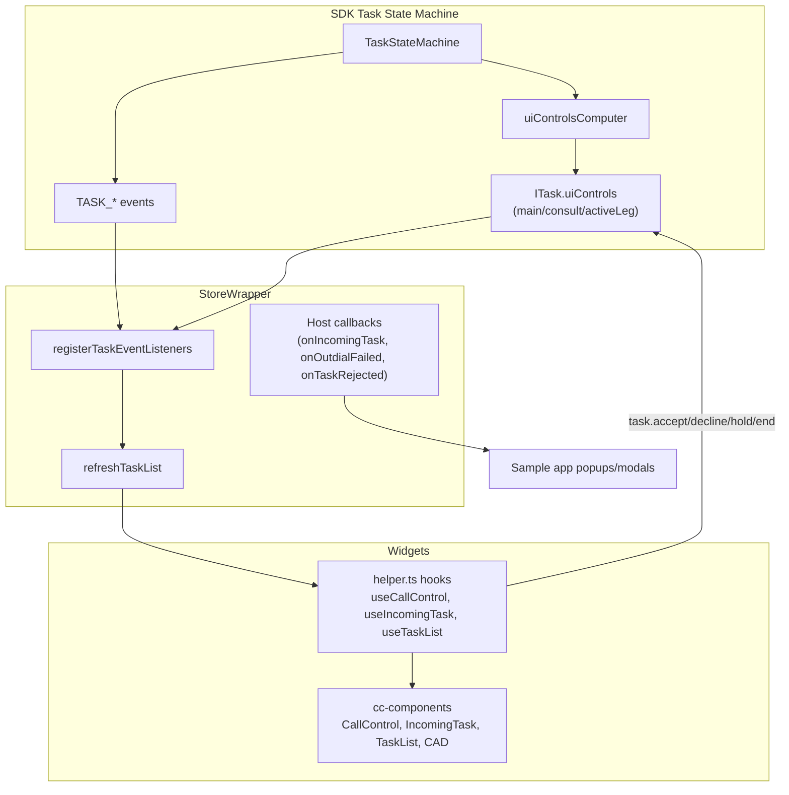

# Task Refactor Migration Overview

## Purpose

Architecture reference for CC Widgets on the SDK state-machine-driven task model (`task-refactor` branch). This is the single entry point — it describes what changed, how SDK → store → widgets consumption works today, and links to per-area docs.

---

## Current State (Migration Complete)

The widget migration to `task.uiControls` is **largely complete**. Widgets no longer call `getControlsVisibility()`. Control visibility and enablement come from the SDK; the store mirrors task inventory and fires host callbacks; hooks and components read `task.uiControls` and invoke task methods.

| Area | Status | Primary file |
|------|--------|--------------|
| Store event wiring | **Done** | `store/src/storeEventsWrapper.ts` |
| Store task utils (dead code removal) | **Done** | `store/src/task-utils.ts` |
| CallControl hook | **Done** | `task/src/helper.ts` (`useCallControl`) |
| IncomingTask / TaskList | **Done** | `task/src/helper.ts`, `cc-components/.../IncomingTask`, `TaskList` |
| Component layer | **Done** | `cc-components/src/components/task/` |
| Legacy bridge: `isDeclineButtonEnabled` | **Open** | Still OR'd into decline enablement after auto-answer |
| Outdial double-popup (SDK `emitTaskEnd` vs `emitTaskReject`) | **Planned** | Widgets-side dedup if SDK reverts to `emitTaskReject` |

---

## SDK → Widgets Consumption Model



### Three layers

1. **SDK** — Owns task state machine, `task.data`, and `task.uiControls`. Recomputes controls after every transition and emits `TASK_UI_CONTROLS_UPDATED`.
2. **Store** (`storeEventsWrapper.ts`) — Registers per-task listeners, calls `refreshTaskList()` to sync MobX `taskList` / `currentTask`, and invokes optional host callbacks. Does **not** compute control visibility.
3. **Widgets** — Read `task.uiControls.main.*` / `task.uiControls.consult.*` and call `task.accept()`, `task.hold()`, etc. **Popups and toasts are owned by the host app**, not the widget package.

---

## Popup / Notification Model

Widgets do not render failure or rejection popups. The host app wires store callbacks (see `widgets-samples/cc/samples-cc-react-app/src/App.tsx`):

| Store callback | SDK event (via handler) | Host UI |
|----------------|-------------------------|---------|
| `setIncomingTaskCb` | `TASK_INCOMING` | Incoming task popup + notification sound |
| `setTaskRejected` | `TASK_REJECT` → `handleTaskReject` | "Task Rejected" popup |
| `setOutdialFailed` | `TASK_OUTDIAL_FAILED` → `handleOutdialFailed` | "Outdial Failed" modal |
| Widget `onRejected` / `onAccepted` props | Per-task callbacks on `TASK_END`, `TASK_REJECT`, `TASK_OUTDIAL_FAILED`, etc. | Dismiss incoming notification only |

**Outdial failure:** SDK emits `TASK_OUTDIAL_FAILED` (reason string) and `TASK_END` (via `emitTaskEnd`, not `emitTaskReject`) to avoid a duplicate "Task Rejected" popup. IncomingTask dismisses on `TASK_OUTDIAL_FAILED` via `taskRejectCallback`.

---

## Architectural Change: Old vs New

```
┌─────────────────────────────────────────────────────────────────────────────────┐
│  OLD (Pre-refactor)                    │  NEW (Current)                           │
│                                        │                                          │
│  SDK emits task events                 │  SDK state machine transitions           │
│         │                              │         │                                │
│         ▼                              │         ▼                                │
│  Store: refreshTaskList()              │  SDK: computes TaskUIControls            │
│  + manual observables                  │  from (TaskState + TaskContext)          │
│         │                              │         │                                │
│         ▼                              │         ▼                                │
│  Hooks: getControlsVisibility()        │  SDK emits TASK_UI_CONTROLS_UPDATED      │
│    (deviceType, featureFlags, task)    │         │                                │
│         │                              │         ▼                                │
│         ▼                              │  Widgets read task.uiControls           │
│  Components: flat ControlVisibility    │    .main / .consult / .activeLeg       │
│  (22 controls + 7 state flags)         │         │                                │
│                                        │         ▼                                │
│  Logic in task-util.ts, task-utils.ts  │  Components: TaskUIControls per leg      │
│                                        │  Single source of truth: task.uiControls │
└─────────────────────────────────────────────────────────────────────────────────┘
```

> Task event names are largely unchanged; they are now emitted from the SDK state machine. UI control computation moved from widgets to SDK.

### Removed (Dead Code)

- **`getControlsVisibility()`** and 22 `get*ButtonVisibility` helpers — **removed** from `task-util.ts`
- **`getConsultStatus()`, `getTaskStatus()`, `getConsultMPCState()`, `findHoldStatus()`** — **removed** from store `task-utils.ts`
- Local flat `ControlVisibility` interface — **replaced** by SDK `TaskUIControls`

### Task Object as Source of Truth

| State | Source | Do NOT use |
|-------|--------|------------|
| Control visibility/enablement | `task.uiControls.main.*` / `task.uiControls.consult.*` | `getControlsVisibility()`, device-type gating for buttons |
| Active consult leg | `task.uiControls.activeLeg` (`'main'` \| `'consult'`) | Guessing from button visibility alone |
| Hold state (`isHeld`) | `isInteractionOnHold(task)` + CallControl hook logic (activeLeg, conference flags) | `controls.main.hold.isEnabled` as hold indicator |
| Conference in progress | `task.data` / interaction `state === 'conference'` | `controls.main.exitConference.isVisible` alone |
| Consult status (display) | `task.data.consultStatus` | Removed `getConsultStatus()` chain |

### Known Legacy Bridges

- **`store.isDeclineButtonEnabled`** — Set on `TASK_AUTO_ANSWERED`. Still OR'd into decline enablement in `useIncomingTask` and IncomingTask/TaskList utils until SDK `uiControls.main.decline.isEnabled` fully covers post-offer timing.
- **`isBrowser` prop** — Retained for **outdial accept label text** ("Accept" vs "Ringing..."), not for control visibility gating.

---

## CC Widgets Files

| Area | Path |
|------|------|
| Store event wrapper | `packages/contact-center/store/src/storeEventsWrapper.ts` |
| Store task utils | `packages/contact-center/store/src/task-utils.ts` |
| Store types (SDK re-exports) | `packages/contact-center/store/src/store.types.ts` |
| Task hooks | `packages/contact-center/task/src/helper.ts` |
| Task UI utils (timers only) | `packages/contact-center/task/src/Utils/task-util.ts` |
| CC Components | `packages/contact-center/cc-components/src/components/task/` |
| Sample app (host callbacks) | `widgets-samples/cc/samples-cc-react-app/src/App.tsx` |

---

## Documentation Index

| Document | Focus | Status |
|----------|-------|--------|
| [store-event-wiring-migration.md](./store-event-wiring-migration.md) | Store event handlers, host callbacks, outdial flow | Reference |
| [store-task-utils-migration.md](./store-task-utils-migration.md) | Remaining store utils vs removed dead code | Reference |
| [call-control-hook-migration.md](./call-control-hook-migration.md) | `useCallControl`, dual uiControls refresh, hold logic | Reference |
| [incoming-task-migration.md](./incoming-task-migration.md) | Accept/decline, outdial text, dismiss callbacks | Reference |
| [task-list-migration.md](./task-list-migration.md) | Per-task accept/decline in list rows | Reference |
| [component-layer-migration.md](./component-layer-migration.md) | `TaskUIControls` per-leg props, CAD outdial display | Reference |

---

## SDK Consumption (via `@webex/cc-store`)

Widgets import SDK task types through the store package, which re-exports from `@webex/contact-center`:

| Export | Purpose |
|--------|---------|
| `TASK_EVENTS` | Event enum (local store enum removed) |
| `TaskUIControls`, `InteractionUIControls`, `TaskUILeg` | Per-leg control shape |
| `TaskUIControlState` | `{ isVisible, isEnabled }` |
| `getDefaultUIControls()` | Fallback when no task |
| `ITask.uiControls` | Getter on task instances |

Import pattern: `import { TaskUIControls, TASK_EVENTS, getDefaultUIControls } from '@webex/cc-store';`

---

## Key Types from SDK

### `TaskUIControls` Structure (per-leg)

```typescript
type TaskUIControlState = { isVisible: boolean; isEnabled: boolean };

type InteractionUIControls = {
  accept: TaskUIControlState;
  decline: TaskUIControlState;
  hold: TaskUIControlState;
  transfer: TaskUIControlState;
  consult: TaskUIControlState;
  end: TaskUIControlState;
  recording: TaskUIControlState;
  mute: TaskUIControlState;
  endConsult: TaskUIControlState;
  conference: TaskUIControlState;
  exitConference: TaskUIControlState;
  transferConference: TaskUIControlState;
  mergeToConference: TaskUIControlState;
  wrapup: TaskUIControlState;
  switch: TaskUIControlState; // switch between main and consult leg
};

type TaskUILeg = 'main' | 'consult';

type TaskUIControls = {
  main: InteractionUIControls;
  consult: InteractionUIControls;
  activeLeg: TaskUILeg;
};
```

**Usage:** Read offer/accept controls from `task.uiControls.main`. Consult panel uses `task.uiControls.consult`. Use `activeLeg` for hold/switch UI during consult.

Example:

```typescript
const accept = task.uiControls.main.accept;
const consultEnd = task.uiControls.consult.endConsult;
const controls = currentTask?.uiControls ?? getDefaultUIControls();
```

---

## SDK Public Method Changes

| Old | New | Notes |
|-----|-----|-------|
| `task.consultTransfer()` | `task.transfer()` | Single `.transfer()` for consult transfer |

---

## CC SDK Reference

> **Repo:** [webex/webex-js-sdk (task-refactor)](https://github.com/webex/webex-js-sdk/tree/task-refactor)

| File | Purpose |
|------|---------|
| `state-machine/uiControlsComputer.ts` | Computes `TaskUIControls` from `TaskState` + `TaskContext` |
| `state-machine/TaskStateMachine.ts` | State transitions (including OUTBOUND_FAILED, wrapup guards) |
| `TaskManager.ts` | Maps CC backend events to state machine events |
| `voice/Voice.ts` | Voice task methods; `emitTaskOutdialFailed` emits reason string |
| `Task.ts` | `task.uiControls` getter; emits `TASK_UI_CONTROLS_UPDATED` |

---

## Migration Fix Log

### 2026-05 — Outdial Flow ([SDK PR #4987](https://github.com/webex/webex-js-sdk/pull/4987))

**Issues:** React crash on outdial failure, missing wrapup after failure, double popup (Outdial Failed + Task Rejected), incorrect accept/decline for outdial, race when `AGENT_OUTBOUND_FAILED` arrives in IDLE.

**SDK fixes:**
- `TaskManager.ts`: Pass `taskData: payload` on `OUTBOUND_FAILED` for `shouldWrapUp` guard
- `Voice.ts`: `emitTaskOutdialFailed` emits failure `reason` string (not Task object)
- `TaskStateMachine.ts`: `OUTBOUND_FAILED` handler in IDLE; OFFERED uses `shouldWrapUp` → WRAPPING_UP or TERMINATED; `emitTaskEnd` instead of `emitTaskReject` to avoid duplicate rejection popup
- `uiControlsComputer.ts`: Outdial accept disabled (`isWebrtc && !isOutdial`); decline `VISIBLE_DISABLED` for WebRTC outdial

**Widgets fixes:**
- `helper.ts`: `TASK_OUTDIAL_FAILED` on `taskRejectCallback` (dismiss incoming notification); outdial failure via `store.handleOutdialFailed`
- IncomingTask / TaskList: `isBrowser` for outdial "Ringing..." vs "Accept" label; read `uiControls.main.accept/decline`
- CallControlCAD: Outdial header uses `dnis`; phone label keeps `ani` (PROD parity)

**Planned follow-up:** If SDK reverts to `emitTaskReject` on outdial failure, add widgets-side dedup to suppress duplicate rejection popup when `TASK_OUTDIAL_FAILED` already handled.

---

### 2026-03-30 — Dial Number Transfer Wrapup Visibility

**Issue:** After dial number consult transfers, wrapup button not appearing (SET_6 E2E failures).

**Root cause:** Backend sends `AgentConsultEnded` before `AgentConsultTransferred`; CONSULT_END cleared `consultInitiator` before TRANSFER_SUCCESS evaluated wrapup.

**Fix:** SDK `transferRequested` flag + `clearConsultStatePreservingTransfer` in state machine. Widgets consume `task.uiControls.main.wrapup.isVisible` — no widget code change.

---

### 2026-06-04 — Consult button disabled after consult ends/fails before consultee answers (multi-login)

**Issue:** On the initiating agent (Agent 1), after a consult to Agent 2 ends or fails before Agent 2 answers (RONA `AgentConsultFailed`, or `AgentConsultEnded` from either Stable Prod or Task Refactor), the held main leg showed `main.consult` visible but disabled, blocking a new consult.

**Root cause:**
- `CONSULT_END`/`CONSULT_FAILED` were not wired on all states the initiator can be in when the consult ends externally (`HELD`, `CONNECTED`, `CONSULT_INITIATING`), so `clearConsultState`/`handleConsultFailed` did not run and consult context flags stayed stale.
- `getIsConsultInProgressForConferenceControls` treated a RONA consultee (`isConsulted: true`, `consultState: consultReserved`, `hasJoined: false`) as an active consult, keeping `consultInProgress` true.

**Fix (SDK, kesari-aligned at the wiring/action layers):**
- `TaskStateMachine.ts`: wire `CONSULT_END` on `HELD` / `CONNECTED` / `CONSULT_INITIATING` and `CONSULT_FAILED` at root, reusing existing `clearConsultState` / `handleConsultFailed` actions and `isPrimaryMediaOnHold` guard.
- `actions.ts`: `deriveTaskDataUpdates` clears consult flags on terminal events; `clearConsultState` recomputes `uiControls`.
- `TaskUtils.ts`: `getIsConsultInProgressForConferenceControls` ignores RONA-pending consultees (`consultReserved` + `!hasJoined`).
- Tests: `uiControlsComputer.ts`, `TaskStateMachine.ts`, `TaskUtils.ts` (149 passing). Widgets consume `task.uiControls.main.consult` — no widget code change.

**Known deviation / planned follow-up (kesari principle 3 & 4):** `uiControlsComputer.ts` currently re-derives consult-ended state from `taskData` (`isConsultEndedForSelf` + `effectiveConsult*` shadow flags, the `isConsultUnansweredFailure` early-return, the consult retry path, and `getVoiceLegState` main-state inference). This duplicates flag-clearing already done in `actions.ts` and is UI-layer inference the principles discourage. Follow-up: remove these blocks and let `uiControlsComputer` read only the cleared context flags + `state`, relying on the existing `canFromConnected` path; keep all current tests green to confirm behavior is unchanged. The 4th touched SDK file (`TaskUtils.ts`) exceeds the 3-file guidance but is a shared selector, so the location is justified.

#### 2026-06-04 (follow-up) — Same button still disabled live, but enabled after refresh: stale consult media in merged `task.data`

**Symptom refinement:** After the wiring/action fixes above, the live consult button was still disabled when Agent 1 ended the consult before Agent 2 answered, yet a page refresh enabled it. A runtime diagnostic marker proved the fresh SDK was loaded and that `Task.computeUIControls()` (not just the state-machine action path) produces the final `uiControls` the widget consumes — computed with `this.data`, not the raw event payload.

**Root cause (data layer):** `Task.reconcileData` (`Task.ts`) is a recursive deep-merge that **never deletes keys**. `AgentConsultCreated` adds the consult-media entry (and consultee participant) into `task.data.interaction.media`/`participants`. The subsequent `AgentConsultEnded` payload contains only the main media, but the merge **retains** the stale consult-media key. `computeUIControls` then sees `hasConsultMedia === true` and the consult-enable branches (`isConsultUnansweredFailure`, the held-main consult retry path) — both gated on `!hasConsultMedia` — fail, leaving consult disabled. Refresh works because hydration overwrites `this.data` cleanly (no stale consult media).

**Fix (SDK, minimal, scoped to consult-ended):** In `uiControlsComputer.ts`, added `effectiveHasConsultMedia = isConsultEndedForSelf ? false : hasConsultMedia` (mirrors the existing `effectiveConsult*` shadow-flag pattern) and used it in the two consult-enable branches. A consult that has ended for self no longer counts its lingering media as active. No change to `reconcileData` (kesari principle 3 — avoid new/changed task-data merge layers and broad blast radius).

**Tests:** `uiControlsComputer.ts` now has a regression test that feeds the **reconciled** `this.data` (stale consult media + stale consultee participant retained) and asserts `main.consult` enabled (43 passing). The earlier end-before-answer test used the clean payload and therefore did not catch this.

**Note on kesari adherence:** This fix extends the same `uiControlsComputer` `taskData`-inference deviation already flagged above (it remains UI-layer compensation for a data-layer merge quirk). The architecturally clean fix is to make `reconcileData` treat the backend `interaction.media`/`participants` snapshot as authoritative (drop removed keys), which would let the `effectiveHasConsultMedia`/`isConsultUnansweredFailure` compensations be deleted — folded into the existing planned follow-up.

#### 2026-06-04 (root-cause fix) — Stale consult media/participant persists across subsequent events (consult disabled after resume)

**Symptom:** With the UI-layer gate above, consult was correctly enabled on the held main leg right after the consult ended. But on the **next** event — Agent 1 resumes the call (`AgentContactUnheld`, a clean snapshot: main media only, `consultState: null`) — the consult button went disabled again. The UI gate (`effectiveHasConsultMedia`) only applies on the consult-end/fail tick (`isConsultEndedForSelf`), so it no longer fired, while the stale consult media still lingered in `this.data`.

**Root cause (the real one, data layer):** `Task.reconcileData` deep-merges and never deletes keys. `interaction.media` and `interaction.participants` are **complete snapshots** from the backend, but the merge keeps consult-leg entries the backend already dropped. So every event after the consult ends still sees a stale consult-media key → `hasConsultMedia === true` → consult blocked. Refresh worked only because hydration overwrites `this.data` cleanly.

**Fix (SDK, `Task.ts`, scoped):** Added `pruneStaleInteractionMaps(incoming)`, called from `updateTaskData` only on the merge path (`shouldOverwrite === false`). It makes **only** `interaction.media` and `interaction.participants` authoritative to the incoming payload (removes keys absent from the incoming snapshot **when** that snapshot provides the map). Every other field stays on the existing generic deep-merge (CAD and other partial updates merge exactly as before — covered by a test). This removes the whack-a-mole: the stale consult leg is gone for resume, transfer, next-consult, and all later events.

**Why both fixes stay:** `pruneStaleInteractionMaps` handles events where the backend already dropped the consult media; `effectiveHasConsultMedia` still handles the consult-end/fail tick where the payload itself can still carry consult media (e.g. `AgentConsultFailed` RONA). They are complementary, not redundant.

**Tests:** `Task.ts` gains two tests — (1) stale consult media + consultee participant are pruned on a clean resume snapshot while CAD merge is preserved; (2) a partial update that omits the interaction maps does **not** prune them. Full task suite green: `Task`, `uiControlsComputer`, `TaskStateMachine`, `TaskUtils`, `TaskManager`, `Voice` — **285 passing**.

**Kesari note:** Fixing the existing `reconcileData` snapshot semantics (rather than adding UI heuristics) is the correct, root-cause layer. It is scoped to the two snapshot maps to avoid disturbing the intended partial-merge behavior, and it is the change that makes the earlier `uiControlsComputer` compensations eventually removable (still tracked as the planned follow-up).

#### 2026-06-04 (regression fix) — Initiator's task cleared on RONA when consult fails while in CONSULTING

**Issue:** When Agent 1 consults Agent 2 and Agent 2 does not answer (RONA), Agent 1's task was **cleared entirely** instead of returning to the main leg with call controls. The widget crashed with `Cannot read properties of null (reading 'uiControls')` because the task was removed from the collection.

**Backend sequence (Agent 1):** `AgentConsultFailed` (`reason: RONA_TIMER_EXPIRED`, interaction `state: consult`, main media `isHold: true`) immediately followed by `AgentConsultEnded` (interaction `state: connected`, only main media remaining).

**Root cause (state machine, `TaskStateMachine.ts`):** When `AgentConsulting` arrives during consult ringing, the initiator moves `CONSULT_INITIATING → CONSULTING` before the consultee answers. The `CONSULTING` state had **no `CONSULT_FAILED` handler**, so `AgentConsultFailed` fell through to the root `CONSULT_FAILED` handler, which runs `handleConsultFailed` (sets `consultInitiator = false`) **without leaving `CONSULTING`**. The trailing `AgentConsultEnded` then hit the `CONSULTING` `CONSULT_END` transitions: the initiator branch (`consultInitiator === true → HELD`) no longer matched (it had just been cleared), so it fell through to the final "consulted agent" branch → `TaskState.TERMINATED`, whose `entry: ['cleanupResources']` removes the task from the collection.

**Fix (SDK, `TaskStateMachine.ts`, scoped):** Added a `CONSULT_FAILED` handler to the `CONSULTING` state mirroring `CONSULT_INITIATING`: `consultFromConference → CONFERENCING`, else `isPrimaryMediaOnHold → HELD`, else `→ CONNECTED` (all with `updateTaskData` + `handleConsultFailed`). Now the initiator leaves `CONSULTING` for the held main leg on `AgentConsultFailed`, and the trailing `AgentConsultEnded` is handled safely by `HELD`'s `CONSULT_END` (stays on the main leg, clears consult state). The consultee (Agent 2) path is untouched: a RONA consultee is in `OFFERED`, whose `CONSULT_FAILED → TERMINATED + emitTaskReject` still correctly clears their incoming notification.

**Tests:** Added a `TaskStateMachine` regression test driving the initiator through `HELD → CONSULT → CONSULT_INITIATING → CONSULT_SUCCESS → CONSULTING`, then `CONSULT_FAILED` (asserts `HELD`, not `CONSULTING`) and `CONSULT_END` (asserts final state `HELD`, never `TERMINATED`, `consultInitiator === false`, `activeLeg === 'main'`, `main.consult` enabled). Full `TaskStateMachine` suite green — **46 passing**.

**Kesari note:** Fix lives in the state-machine layer (the authoritative owner of lifecycle transitions), mirrors the existing sibling-state handler rather than introducing a new heuristic, and does not touch `uiControlsComputer` (read-only) or `actions.ts` (context-only). The consultee `OFFERED` path is left as-is.

#### 2026-06-04 (widget fix) — Resume shows disabled Resume button + On-hold timer after a conference consult is ended

**Issue:** Customer + Agent 1 + Agent 2 are in a conference. Agent 1 consults a DN (Agent 3), ends the consult, then clicks Resume. After the resume, the main CAD card showed a **disabled Resume button and an On-hold timer**. Expected: a **disabled Pause button and no On-hold timer**. The SDK `uiControls` were already correct (`main.hold = {isVisible: true, isEnabled: false}`); the defect was purely the widget's `isHeld` derivation.

**Root cause (widget, `task/src/Utils/main-cad-hold.util.ts`):** Both the Pause/Resume icon and the On-hold timer are driven by `isHeld` from `deriveMainCadHoldState`. For a non-consulted agent it preferred the state-machine snapshot (`currentTask.state.context.taskData`) over `currentTask.data`. `TaskManager` refreshes `currentTask.data` on **every** event, but the snapshot only updates when the state machine runs a matching transition. After the conference consult ended, `currentTask.data` was the fresh `AgentContactUnheld` (main `isHold: false`), while the snapshot lagged at `AgentConsultEnded` (main `isHold: true`). `getMainCadHold` short-circuits at `if (mainCallMediaHeld) return true;` (reading the stale snapshot) **before** the conference `isExplicitUnheldEvent` branch could run → `isHeld: true` → Resume icon + `resolveMainCadHoldTimestampMs` returns a non-null timestamp (timer shown).

**Fix (widget, scoped):** Explicit `AgentContactHeld`/`AgentContactUnheld` events are the authoritative signal for the main leg hold state, and `currentTask.data` is always refreshed for them. For these events (non-consulted only), `deriveMainCadHoldState` now sources both `interaction` and `taskEventType` from `currentTask.data` instead of the snapshot. All other event types keep the existing snapshot-first preference (so the original conference media-lag handling is untouched).

**Tests:** Added a `helper.ts` regression test — conference + DN consult ended, `currentTask.data` = `AgentContactUnheld` (main not held) while the snapshot lags at `AgentConsultEnded` (main held) → asserts `isHeld === false`. Existing hold tests (`AgentContactHeld` forces held, `AgentContactUnheld` + stale `conferenceHoldParticipant` forces not-held, all consulted-agent cases) remain green — full `helper.ts` suite **186 passing**.

**Kesari note:** Fix is confined to the widget hold-derivation utility (no SDK change needed; `uiControls` were already correct). It narrows an existing heuristic to trust the authoritative data view for explicit hold/unhold events rather than adding a new special case, and leaves the consulted-agent and non-hold-event paths unchanged.

---

_Created: 2026-03-09_
_Updated: 2026-05-20 (migration complete reference; per-leg TaskUIControls; SDK→store→widgets flow; outdial fix log; popup model)_
_Updated: 2026-06-04 (consult-button-disabled-after-end-before-answer fix log + kesari deviation follow-up note)_
_Updated: 2026-06-04 (stale-consult-media-in-reconciled-task-data root cause + effectiveHasConsultMedia fix + regression test)_
_Updated: 2026-06-04 (root-cause data-layer fix: Task.pruneStaleInteractionMaps makes interaction.media/participants authoritative; fixes consult disabled after resume; 285 task tests green)_
_Updated: 2026-06-04 (regression fix: CONSULTING gains CONSULT_FAILED handler so initiator returns to main leg on RONA instead of TERMINATED clearing the task; 46 TaskStateMachine tests green)_
