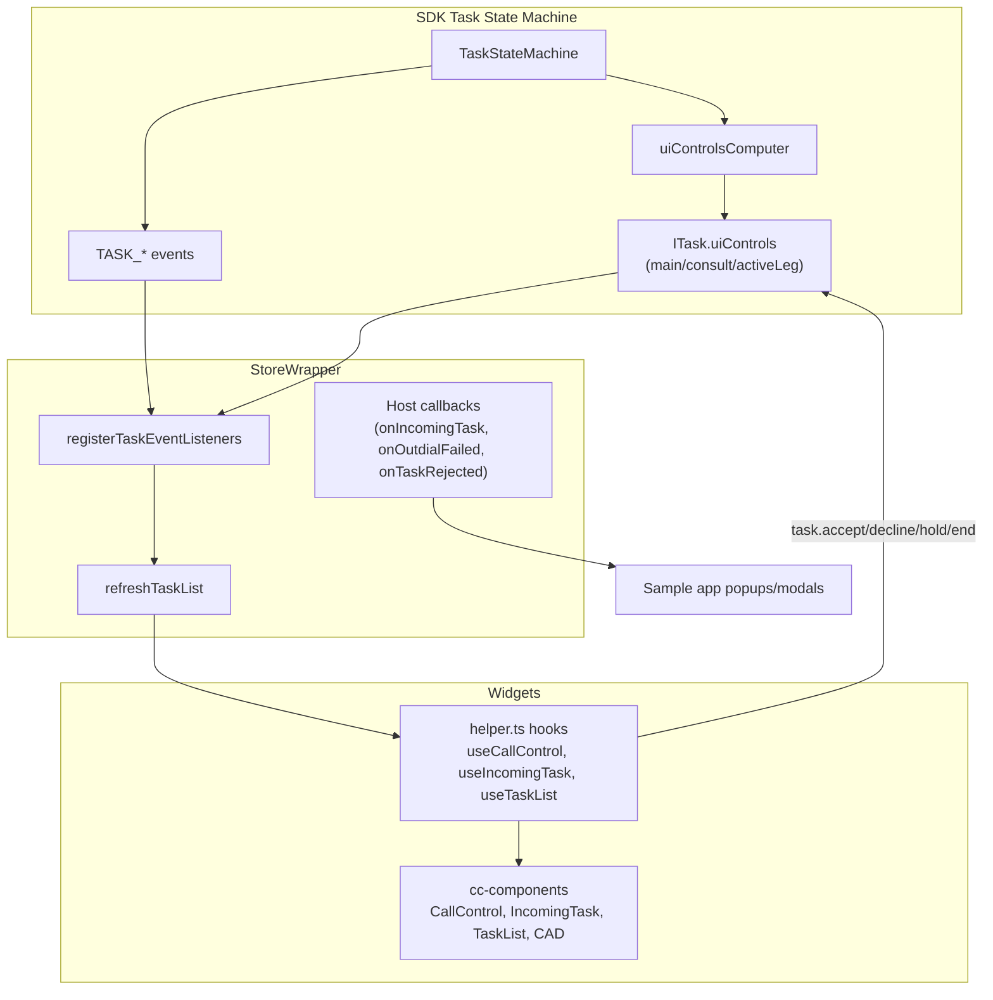

# Task Refactor Migration Overview

## Purpose

Architecture reference for CC Widgets on the SDK state-machine-driven task model (`task-refactor` branch). This is the single entry point — it describes what changed, how SDK → store → widgets consumption works today, and links to per-area docs.

---

## Current State (Migration Complete)

The widget migration to `task.uiControls` is **largely complete**. Widgets no longer call `getControlsVisibility()`. Control visibility and enablement come from the SDK; the store mirrors task inventory and fires host callbacks; hooks and components read `task.uiControls` and invoke task methods.

| Area | Status | Primary file |
|------|--------|--------------|
| Store event wiring | **Done** | `store/src/storeEventsWrapper.ts` |
| Store task utils (dead code removal) | **Done** | `store/src/task-utils.ts` |
| CallControl hook | **Done** | `task/src/helper.ts` (`useCallControl`) |
| IncomingTask / TaskList | **Done** | `task/src/helper.ts`, `cc-components/.../IncomingTask`, `TaskList` |
| Component layer | **Done** | `cc-components/src/components/task/` |
| Legacy bridge: `isDeclineButtonEnabled` | **Open** | Still OR'd into decline enablement after auto-answer |
| Outdial double-popup (SDK `emitTaskEnd` vs `emitTaskReject`) | **Planned** | Widgets-side dedup if SDK reverts to `emitTaskReject` |

---

## SDK → Widgets Consumption Model



### Three layers

1. **SDK** — Owns task state machine, `task.data`, and `task.uiControls`. Recomputes controls after every transition and emits `TASK_UI_CONTROLS_UPDATED`.
2. **Store** (`storeEventsWrapper.ts`) — Registers per-task listeners, calls `refreshTaskList()` to sync MobX `taskList` / `currentTask`, and invokes optional host callbacks. Does **not** compute control visibility.
3. **Widgets** — Read `task.uiControls.main.*` / `task.uiControls.consult.*` and call `task.accept()`, `task.hold()`, etc. **Popups and toasts are owned by the host app**, not the widget package.

---

## Popup / Notification Model

Widgets do not render failure or rejection popups. The host app wires store callbacks (see `widgets-samples/cc/samples-cc-react-app/src/App.tsx`):

| Store callback | SDK event (via handler) | Host UI |
|----------------|-------------------------|---------|
| `setIncomingTaskCb` | `TASK_INCOMING` | Incoming task popup + notification sound |
| `setTaskRejected` | `TASK_REJECT` → `handleTaskReject` | "Task Rejected" popup |
| `setOutdialFailed` | `TASK_OUTDIAL_FAILED` → `handleOutdialFailed` | "Outdial Failed" modal |
| Widget `onRejected` / `onAccepted` props | Per-task callbacks on `TASK_END`, `TASK_REJECT`, `TASK_OUTDIAL_FAILED`, etc. | Dismiss incoming notification only |

**Outdial failure:** SDK emits `TASK_OUTDIAL_FAILED` (reason string) and `TASK_END` (via `emitTaskEnd`, not `emitTaskReject`) to avoid a duplicate "Task Rejected" popup. IncomingTask dismisses on `TASK_OUTDIAL_FAILED` via `taskRejectCallback`.

---

## Architectural Change: Old vs New

```
┌─────────────────────────────────────────────────────────────────────────────────┐
│  OLD (Pre-refactor)                    │  NEW (Current)                           │
│                                        │                                          │
│  SDK emits task events                 │  SDK state machine transitions           │
│         │                              │         │                                │
│         ▼                              │         ▼                                │
│  Store: refreshTaskList()              │  SDK: computes TaskUIControls            │
│  + manual observables                  │  from (TaskState + TaskContext)          │
│         │                              │         │                                │
│         ▼                              │         ▼                                │
│  Hooks: getControlsVisibility()        │  SDK emits TASK_UI_CONTROLS_UPDATED      │
│    (deviceType, featureFlags, task)    │         │                                │
│         │                              │         ▼                                │
│         ▼                              │  Widgets read task.uiControls           │
│  Components: flat ControlVisibility    │    .main / .consult / .activeLeg       │
│  (22 controls + 7 state flags)         │         │                                │
│                                        │         ▼                                │
│  Logic in task-util.ts, task-utils.ts  │  Components: TaskUIControls per leg      │
│                                        │  Single source of truth: task.uiControls │
└─────────────────────────────────────────────────────────────────────────────────┘
```

> Task event names are largely unchanged; they are now emitted from the SDK state machine. UI control computation moved from widgets to SDK.

### Removed (Dead Code)

- **`getControlsVisibility()`** and 22 `get*ButtonVisibility` helpers — **removed** from `task-util.ts`
- **`getConsultStatus()`, `getTaskStatus()`, `getConsultMPCState()`, `findHoldStatus()`** — **removed** from store `task-utils.ts`
- Local flat `ControlVisibility` interface — **replaced** by SDK `TaskUIControls`

### Task Object as Source of Truth

| State | Source | Do NOT use |
|-------|--------|------------|
| Control visibility/enablement | `task.uiControls.main.*` / `task.uiControls.consult.*` | `getControlsVisibility()`, device-type gating for buttons |
| Active consult leg | `task.uiControls.activeLeg` (`'main'` \| `'consult'`) | Guessing from button visibility alone |
| Hold state (`isHeld`) | `isInteractionOnHold(task)` + CallControl hook logic (activeLeg, conference flags) | `controls.main.hold.isEnabled` as hold indicator |
| Conference in progress | `task.data` / interaction `state === 'conference'` | `controls.main.exitConference.isVisible` alone |
| Consult status (display) | `task.data.consultStatus` | Removed `getConsultStatus()` chain |

### Known Legacy Bridges

- **`store.isDeclineButtonEnabled`** — Set on `TASK_AUTO_ANSWERED`. Still OR'd into decline enablement in `useIncomingTask` and IncomingTask/TaskList utils until SDK `uiControls.main.decline.isEnabled` fully covers post-offer timing.
- **`isBrowser` prop** — Retained for **outdial accept label text** ("Accept" vs "Ringing..."), not for control visibility gating.

---

## CC Widgets Files

| Area | Path |
|------|------|
| Store event wrapper | `packages/contact-center/store/src/storeEventsWrapper.ts` |
| Store task utils | `packages/contact-center/store/src/task-utils.ts` |
| Store types (SDK re-exports) | `packages/contact-center/store/src/store.types.ts` |
| Task hooks | `packages/contact-center/task/src/helper.ts` |
| Task UI utils (timers only) | `packages/contact-center/task/src/Utils/task-util.ts` |
| CC Components | `packages/contact-center/cc-components/src/components/task/` |
| Sample app (host callbacks) | `widgets-samples/cc/samples-cc-react-app/src/App.tsx` |

---

## Documentation Index

| Document | Focus | Status |
|----------|-------|--------|
| [store-event-wiring-migration.md](./store-event-wiring-migration.md) | Store event handlers, host callbacks, outdial flow | Reference |
| [store-task-utils-migration.md](./store-task-utils-migration.md) | Remaining store utils vs removed dead code | Reference |
| [call-control-hook-migration.md](./call-control-hook-migration.md) | `useCallControl`, dual uiControls refresh, hold logic | Reference |
| [incoming-task-migration.md](./incoming-task-migration.md) | Accept/decline, outdial text, dismiss callbacks | Reference |
| [task-list-migration.md](./task-list-migration.md) | Per-task accept/decline in list rows | Reference |
| [component-layer-migration.md](./component-layer-migration.md) | `TaskUIControls` per-leg props, CAD outdial display | Reference |

---

## SDK Consumption (via `@webex/cc-store`)

Widgets import SDK task types through the store package, which re-exports from `@webex/contact-center`:

| Export | Purpose |
|--------|---------|
| `TASK_EVENTS` | Event enum (local store enum removed) |
| `TaskUIControls`, `InteractionUIControls`, `TaskUILeg` | Per-leg control shape |
| `TaskUIControlState` | `{ isVisible, isEnabled }` |
| `getDefaultUIControls()` | Fallback when no task |
| `ITask.uiControls` | Getter on task instances |

Import pattern: `import { TaskUIControls, TASK_EVENTS, getDefaultUIControls } from '@webex/cc-store';`

---

## Key Types from SDK

### `TaskUIControls` Structure (per-leg)

```typescript
type TaskUIControlState = { isVisible: boolean; isEnabled: boolean };

type InteractionUIControls = {
  accept: TaskUIControlState;
  decline: TaskUIControlState;
  hold: TaskUIControlState;
  transfer: TaskUIControlState;
  consult: TaskUIControlState;
  end: TaskUIControlState;
  recording: TaskUIControlState;
  mute: TaskUIControlState;
  endConsult: TaskUIControlState;
  conference: TaskUIControlState;
  exitConference: TaskUIControlState;
  transferConference: TaskUIControlState;
  mergeToConference: TaskUIControlState;
  wrapup: TaskUIControlState;
  switch: TaskUIControlState; // switch between main and consult leg
};

type TaskUILeg = 'main' | 'consult';

type TaskUIControls = {
  main: InteractionUIControls;
  consult: InteractionUIControls;
  activeLeg: TaskUILeg;
};
```

**Usage:** Read offer/accept controls from `task.uiControls.main`. Consult panel uses `task.uiControls.consult`. Use `activeLeg` for hold/switch UI during consult.

Example:

```typescript
const accept = task.uiControls.main.accept;
const consultEnd = task.uiControls.consult.endConsult;
const controls = currentTask?.uiControls ?? getDefaultUIControls();
```

---

## SDK Public Method Changes

| Old | New | Notes |
|-----|-----|-------|
| `task.consultTransfer()` | `task.transfer()` | Single `.transfer()` for consult transfer |

---

## CC SDK Reference

> **Repo:** [webex/webex-js-sdk (task-refactor)](https://github.com/webex/webex-js-sdk/tree/task-refactor)

| File | Purpose |
|------|---------|
| `state-machine/uiControlsComputer.ts` | Computes `TaskUIControls` from `TaskState` + `TaskContext` |
| `state-machine/TaskStateMachine.ts` | State transitions (including OUTBOUND_FAILED, wrapup guards) |
| `TaskManager.ts` | Maps CC backend events to state machine events |
| `voice/Voice.ts` | Voice task methods; `emitTaskOutdialFailed` emits reason string |
| `Task.ts` | `task.uiControls` getter; emits `TASK_UI_CONTROLS_UPDATED` |

---

## Migration Fix Log

### 2026-05 — Outdial Flow ([SDK PR #4987](https://github.com/webex/webex-js-sdk/pull/4987))

**Issues:** React crash on outdial failure, missing wrapup after failure, double popup (Outdial Failed + Task Rejected), incorrect accept/decline for outdial, race when `AGENT_OUTBOUND_FAILED` arrives in IDLE.

**SDK fixes:**
- `TaskManager.ts`: Pass `taskData: payload` on `OUTBOUND_FAILED` for `shouldWrapUp` guard
- `Voice.ts`: `emitTaskOutdialFailed` emits failure `reason` string (not Task object)
- `TaskStateMachine.ts`: `OUTBOUND_FAILED` handler in IDLE; OFFERED uses `shouldWrapUp` → WRAPPING_UP or TERMINATED; `emitTaskEnd` instead of `emitTaskReject` to avoid duplicate rejection popup
- `uiControlsComputer.ts`: Outdial accept disabled (`isWebrtc && !isOutdial`); decline `VISIBLE_DISABLED` for WebRTC outdial

**Widgets fixes:**
- `helper.ts`: `TASK_OUTDIAL_FAILED` on `taskRejectCallback` (dismiss incoming notification); outdial failure via `store.handleOutdialFailed`
- IncomingTask / TaskList: `isBrowser` for outdial "Ringing..." vs "Accept" label; read `uiControls.main.accept/decline`
- CallControlCAD: Outdial header uses `dnis`; phone label keeps `ani` (PROD parity)

**Planned follow-up:** If SDK reverts to `emitTaskReject` on outdial failure, add widgets-side dedup to suppress duplicate rejection popup when `TASK_OUTDIAL_FAILED` already handled.

---

### 2026-03-30 — Dial Number Transfer Wrapup Visibility

**Issue:** After dial number consult transfers, wrapup button not appearing (SET_6 E2E failures).

**Root cause:** Backend sends `AgentConsultEnded` before `AgentConsultTransferred`; CONSULT_END cleared `consultInitiator` before TRANSFER_SUCCESS evaluated wrapup.

**Fix:** SDK `transferRequested` flag + `clearConsultStatePreservingTransfer` in state machine. Widgets consume `task.uiControls.main.wrapup.isVisible` — no widget code change.

---

_Created: 2026-03-09_
_Updated: 2026-05-20 (migration complete reference; per-leg TaskUIControls; SDK→store→widgets flow; outdial fix log; popup model)_
