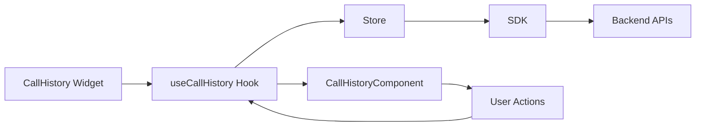
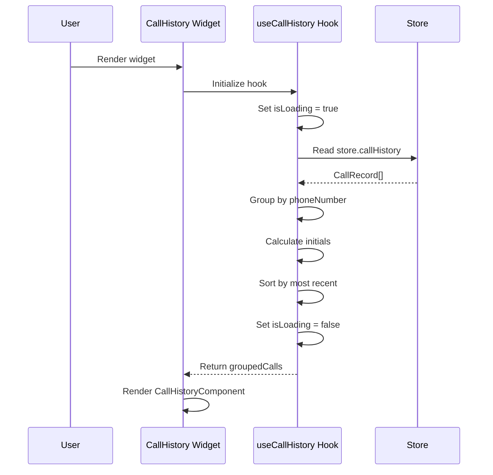
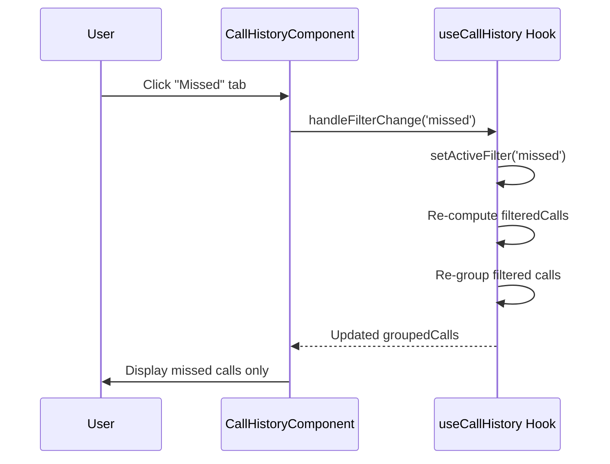
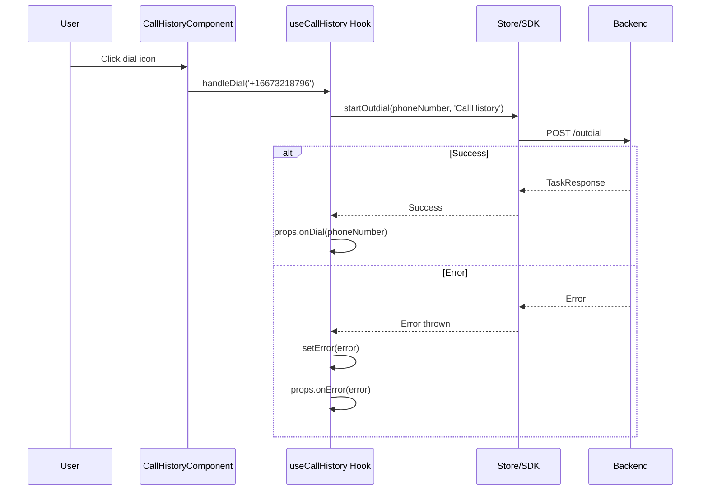
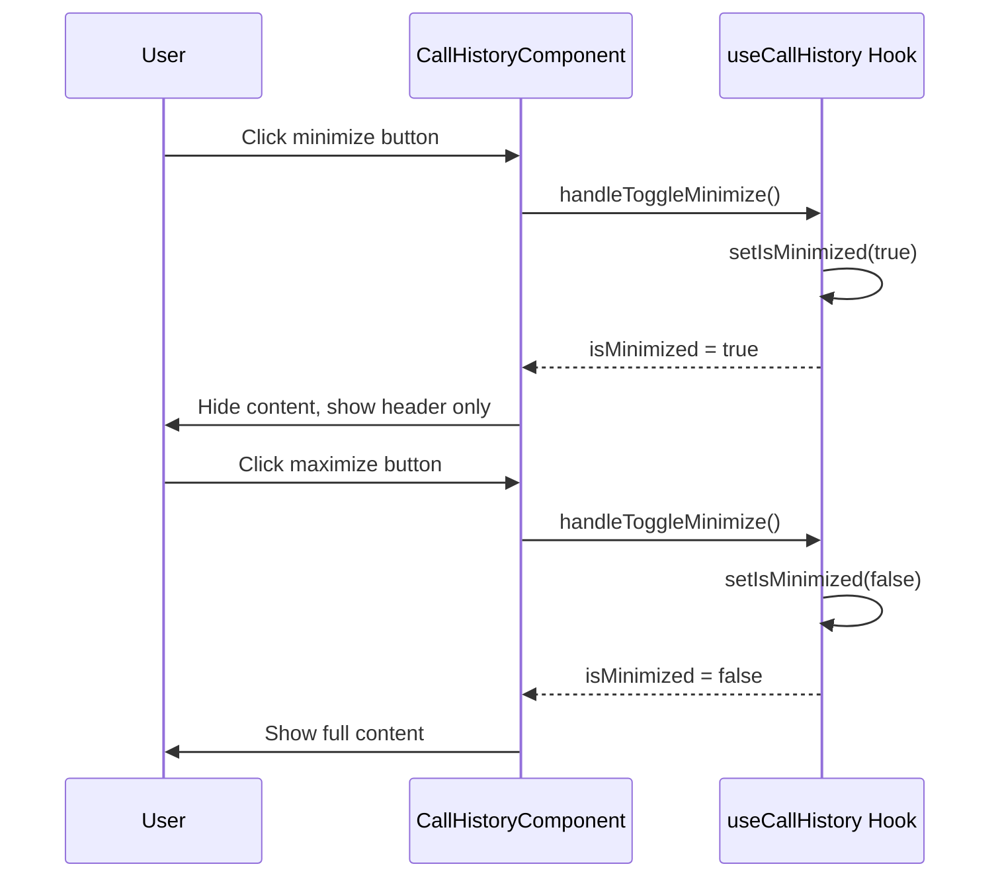

# Call History Widget - Architecture

## Component Overview

| Layer | File | Purpose | Key Responsibilities |
|-------|------|---------|---------------------|
| **Widget** | `src/call-history/index.tsx` | Smart container | - Observer HOC<br>- Error boundary<br>- Loading/error states<br>- Delegates to hook |
| **Hook** | `src/helper.ts` | Business logic | - Fetch call history from store<br>- Group calls by contact<br>- Filter logic (all/missed)<br>- Minimize state<br>- Handle dial via SDK |
| **Component** | `@webex/cc-components` | Presentation | - Pure UI component<br>- Momentum UI usage<br>- No business logic |
| **Store** | `@webex/cc-store` | State/SDK | - Call history data<br>- startOutdial() SDK method |
| **Types** | `src/call-history/call-history.types.ts` | Type definitions | - CallHistoryProps<br>- CallRecord<br>- GroupedCalls |

## File Structure

```
call-history/
├── src/
│   ├── call-history/
│   │   ├── index.tsx              # Widget (observer + ErrorBoundary)
│   │   └── call-history.types.ts  # Type definitions
│   ├── helper.ts                   # useCallHistory hook
│   ├── index.ts                    # Exports with withMetrics
│   └── wc.ts                       # Web Component export
├── tests/
│   ├── call-history/
│   │   └── index.test.tsx          # Widget tests
│   └── helper.test.ts              # Hook tests
├── ai-docs/
│   ├── agent.md                    # Public API
│   └── architecture.md             # This file
├── package.json
├── tsconfig.json
├── webpack.config.js
└── bable.config.js
```

## Data Flows

### Overview



### Hook: useCallHistory

**Reads from Store:**
- `store.callHistory` - Array of CallRecord (populated by task events)

**Calls SDK:**
- `store.cc.startOutdial(phoneNumber, origin)` - Initiate outdial

**Returns:**
- `groupedCalls` - GroupedCalls[] (computed from callHistory)
- `isLoading` - boolean
- `error` - Error | null
- `isMinimized` - boolean
- `activeFilter` - 'all' | 'missed'
- `handleDial(phoneNumber)` - Dial handler
- `handleFilterChange(filter)` - Filter handler
- `handleToggleMinimize()` - Toggle handler

## Sequence Diagrams

### Initial Load & Group Calls



### Filter Change



### Outdial Call



### Minimize/Maximize



## Data Grouping Logic

### Input: CallRecord[]

```typescript
[
  { id: '1', contactName: 'User6 Agent6', phoneNumber: '+16673218796', type: 'incoming', duration: 1166, date: ... },
  { id: '2', contactName: 'User6 Agent6', phoneNumber: '+16673218796', type: 'missed', duration: 0, date: ... },
  { id: '3', contactName: 'Priya Kesari', phoneNumber: '+1469676299', type: 'incoming', duration: 180, date: ... }
]
```

### Output: GroupedCalls[]

```typescript
[
  {
    contactName: 'User6 Agent6',
    phoneNumber: '+16673218796',
    avatar: 'UA',  // Generated from initials
    callCount: 2,
    calls: [/* 2 call records */]
  },
  {
    contactName: 'Priya Kesari',
    phoneNumber: '+1469676299',
    avatar: 'PK',
    callCount: 1,
    calls: [/* 1 call record */]
  }
]
```

### Grouping Algorithm

1. Create Map<phoneNumber, GroupedCalls>
2. For each call:
   - If phoneNumber not in map, create new group with:
     - avatar = first letters of each word in contactName
     - callCount = 0
     - calls = []
   - Increment callCount
   - Append call to calls[]
3. Convert map to array
4. Sort by most recent call date (descending)

## Error Handling

| Error | Source | Handled By | Action |
|-------|--------|------------|--------|
| Outdial failed | SDK | Hook | Set error state, call onError callback |
| Invalid phone number | SDK | Hook | Set error state, call onError callback |
| Call history load failed | Store | Hook | Set error state, call onError callback |
| Component crash | React | ErrorBoundary | Show error UI, call onError |

## Troubleshooting

### Issue: No call history displayed

**Possible Causes:**
1. Store callHistory is empty
2. Agent has no recent calls
3. Task events not subscribed

**Solution:**
- Check `store.callHistory` in console
- Verify task event subscriptions in store
- Check if calls are being tracked

### Issue: Dial button doesn't work

**Possible Causes:**
1. Agent not configured for outdial
2. Agent not in Available state
3. Invalid phone number format

**Solution:**
- Check `store.cc.agentConfig.isOutboundEnabledForAgent`
- Ensure agent state is Available
- Verify phone number is in E.164 format (+1XXXXXXXXXX)

### Issue: Filters not working

**Possible Causes:**
1. Call type not set correctly
2. Filter state not updating

**Solution:**
- Check call.type values ('incoming', 'outgoing', 'missed')
- Verify activeFilter state is updating
- Check console for React re-render warnings

### Issue: Groups showing wrong contact names

**Possible Causes:**
1. phoneNumber used as group key, but multiple contacts share number
2. Contact name data inconsistent

**Solution:**
- Review grouping logic (currently groups by phoneNumber only)
- Ensure consistent contactName for same phoneNumber
- Consider grouping by contactId if available

## Performance Considerations

- **Grouping:** Done in useMemo, recalculates only when callHistory or activeFilter changes
- **Sorting:** O(n log n) for groups, acceptable for typical call volumes (<100 groups)
- **Filtering:** O(n), runs before grouping to minimize data
- **Re-renders:** Component uses observer HOC, only re-renders on observable changes

## Testing

### Unit Tests

**Widget Tests** (`tests/call-history/index.test.tsx`):
- Renders without crashing
- Displays grouped calls
- Handles dial button click
- Handles filter changes
- Handles minimize toggle
- Error handling

**Hook Tests** (`tests/helper.test.ts`):
- Groups calls correctly
- Filters work (all/missed)
- Dial action calls SDK
- Error handling
- Minimize toggle
- Avatar initials generation
- Sorting by most recent

### E2E Tests (Future)

- Login → View call history → Dial contact
- Filter missed calls → Verify display
- Minimize/maximize → Verify UI changes


