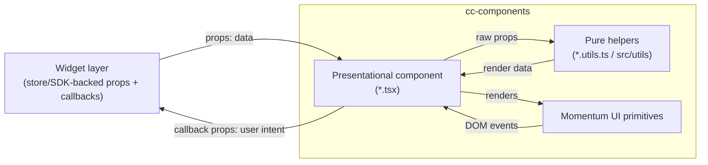
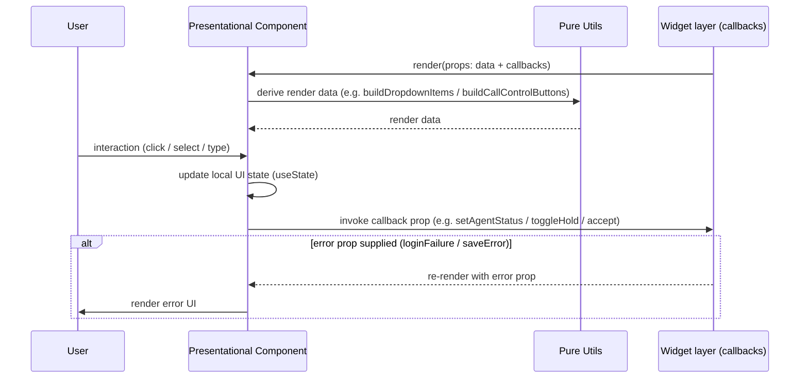
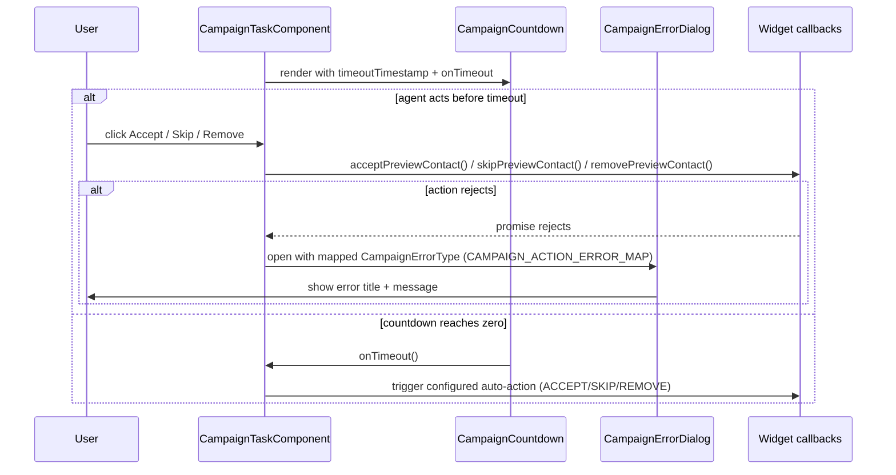
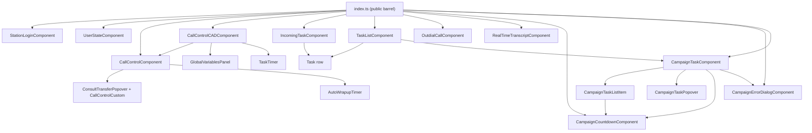

# cc-components — SPEC

> Start here → root [`AGENTS.md`](../../../../AGENTS.md) (agent entry) · router [`SPEC_INDEX.md`](../../../../ai-docs/SPEC_INDEX.md) · system [`ARCHITECTURE.md`](../../../../ai-docs/ARCHITECTURE.md). This is the module's canonical spec: orientation, requirements, design, flows, UI, and tests.
> Context-efficiency: link to canonical docs — don't duplicate them. Load specs on demand per `SPEC_INDEX.md`.

## Metadata
| Field | Value |
|---|---|
| Module id | `cc-components` |
| Source path(s) | `packages/contact-center/cc-components/src/` |
| Doc kind | Module spec |
| Coverage score | Pending coverage assessment |
| Generated from | `module-spec` @ SDLC template library `0.1.0-draft` |
| generated_by / approved_by / updated_at | generated_by `migration agent` / approved_by `pending` / updated_at `2026-06-29` |
| Validation status | not-run |

## Evidence Rules
Every generated requirement below cites concrete source evidence using `file path`. Source evidence, test evidence, examples, assumptions, and gaps are kept separate so validators and future agents can distinguish truth from context. Test evidence is preferred for WHY. This repository's tests are the authoritative behavior record; commit history is not cited here. Where evidence is missing it is recorded as a gap rather than asserted.

## Source Material Register
| Source doc | Scope | Decision | Detail location or disposition |
|---|---|---|---|
| `ai-docs/_archive/pre-sdlc-migration/packages/contact-center/cc-components/ai-docs/AGENTS.md` | overview / API / examples | migrated / reconciled | Orientation → Overview/Purpose/Stack; component table → Public Surface; examples → Use Cases. Reconciled: archived table listed 7 components; code exports 11 (added Campaign* and RealTimeTranscript). |
| `ai-docs/_archive/pre-sdlc-migration/packages/contact-center/cc-components/ai-docs/ARCHITECTURE.md` | architecture / component table | migrated / reconciled | Component table, file structure, patterns, diagrams → Design Overview, Data Flow, Class/Component Relationships, Folder structure, Pitfalls. Conflict: archived doc imports `@momentum-design/components` and `@momentum-ui/react-collaboration` interchangeably; code uses both (see Stack). |
| `packages/contact-center/cc-components/src/` and `tests/` | source / tests | reference-only (ground truth) | All requirements, props, and component inventory grounded against live source and `tests/components/`. |

## Overview
`cc-components` is the presentation layer for Webex Contact Center widgets. It is a library of pure, presentational React function components — each receives all data and callbacks via props and renders Momentum UI primitives. Components do not import or read the MobX store, do not call the SDK, and hold only transient local UI state (open/closed menus, selected dropdown values, input text). Business logic and store/SDK access live one layer up, in the widget packages (`station-login`, `user-state`, `task`) that compose these components.

The package exports two surfaces from `src/index.ts` (React components + their prop types) and `src/wc.ts` (the same components wrapped as custom elements via `@r2wc/react-to-web-component`). A maintainer should start at `src/index.ts` to see the public component set, then open the component directory under `src/components/` (each has `*.tsx`, a `*.types.ts` or shared `task.types.ts`, a `*.utils.ts(x)` for extracted logic, and a `*.scss`). Shared, cross-component logic lives in `src/utils/index.ts` (`formatTime`, `getMediaTypeInfo`) and `src/hooks/` (`useIntersectionObserver`).

The component set spans the contact-center agent surface: station login, agent state, the task lifecycle (incoming task, call control with consult/transfer, CAD-enabled call control, task list, outdial), live transcript, and campaign-preview dialing (countdown, error dialog, campaign task card/popover/list-item).

## Purpose / Responsibility
Owns the presentational React UI primitives for contact-center widgets: render agent/task UI from props and emit user intent back through callback props. Does NOT own state management, SDK access, business logic, or web-component registration into the host (the actual custom-element registration into the host app is `cc-widgets`' responsibility; `wc.ts` here only defines `component-cc-*` elements for the library build).

## Stack
TypeScript 5.6, React 18 (peer `react`/`react-dom` `>=18.3.1`), function components with hooks. UI primitives from `@momentum-ui/react-collaboration` (peer `>=26.197.0`) and `@momentum-design/components/dist/react`. Web-component wrapping via `@r2wc/react-to-web-component` `2.0.3`. Metrics via `@webex/cc-ui-logging` (`withMetrics` HOC). Types consumed from `@webex/cc-store`. Test stack: Jest 29 + React Testing Library 16 + `@testing-library/jest-dom`, jsdom environment, snapshot tests alongside behavioral tests. Build: `tsc` for the type build, Webpack 5 for the bundle. Test command: `yarn workspace @webex/cc-components test:unit`.

## Folder / Package Structure
```
packages/contact-center/cc-components/src/
├── index.ts                          # React component + type barrel (public surface)
├── wc.ts                             # Custom-element (r2wc) wrappers — defines component-cc-* elements
├── hooks/
│   ├── index.ts                      # Hook barrel
│   └── useIntersectionObserver.ts    # Infinite-scroll / lazy-load observer hook
├── utils/
│   └── index.ts                      # Shared utils: formatTime, getMediaTypeInfo
└── components/
    ├── StationLogin/                 # Agent login / device + team selection UI
    ├── UserState/                    # Agent state dropdown, idle codes, state timer
    └── task/
        ├── constants.ts              # Shared task UI label/string constants
        ├── task.types.ts            # Shared task prop/types + component prop Picks
        ├── Task/                     # Generic task row (shared by IncomingTask & TaskList)
        ├── IncomingTask/             # Incoming task notification (Answer/Decline)
        ├── TaskList/                 # Active/incoming task list
        ├── CallControl/              # Call control buttons (hold/mute/record/end/wrapup)
        │   └── CallControlCustom/    # Consult/Transfer popover, list items, dial-number, consult bar
        ├── CallControlCAD/           # CAD-enabled call control header (customer/queue/CAD vars)
        ├── OutdialCall/              # Outbound dialpad + ANI/address-book selection
        ├── RealTimeTranscript/       # Live transcript renderer
        ├── AutoWrapupTimer/          # Auto-wrapup countdown bar
        ├── TaskTimer/                # Generic elapsed/urgency timer
        ├── GlobalVariablesPanel/     # Agent-viewable CAD global variables panel
        ├── CampaignCountdown/        # Campaign preview offer countdown
        ├── CampaignErrorDialog/      # Campaign action-failure dialog
        └── CampaignTask/             # Campaign preview card
            ├── CampaignTaskListItem/ # Shared campaign row (avatar/title/countdown/actions)
            └── CampaignTaskPopover/  # Hover popover with campaign global variables
tests/components/                     # Mirrors src; behavioral + *.snapshot tests + __snapshots__
tests/hooks/                          # Hook tests
```

## Key Files (source of truth)
| File | Holds |
|---|---|
| `src/index.ts` | The public React component set and re-exported type barrels — authoritative export list. |
| `src/wc.ts` | Custom-element tag names (`component-cc-*`) and the r2wc prop type maps per component. |
| `src/components/task/task.types.ts` | Shared task prop interfaces and the `Pick`-derived component prop types (`CallControlComponentProps`, `IncomingTaskComponentProps`, `TaskListComponentProps`, `OutdialCallComponentProps`, `RealTimeTranscriptComponentProps`), plus `MEDIA_CHANNEL`, `TaskState`, `ControlVisibility`, campaign types. |
| `src/components/StationLogin/station-login.types.ts` | `IStationLoginProps` and the `StationLoginComponentProps` Pick. |
| `src/components/UserState/user-state.types.ts` | `IUserState`, `UserStateComponentsProps` Pick, `AgentUserState` enum. |
| `src/components/StationLogin/constants.ts` | Login labels/error strings — re-exported from the barrel; never hardcode these elsewhere. |
| `src/components/task/constants.ts` | Task UI label/string constants (e.g. `CAMPAIGN_CALL`, `WRAP_UP`). |
| `src/utils/index.ts` | `formatTime` (timer formatting) and `getMediaTypeInfo` (media icon/label mapping). |

## Public Surface
Consumed as an imported SDK/code API. The React barrel (`src/index.ts`) is the primary surface; `src/wc.ts` exposes the same components as custom elements for the library build. Exact prop schemas live in the `*.types.ts` files (linked below); the root contract index (`CONTRACTS.md`) documents how the consuming `cc-widgets`/widget layer re-exposes these as custom elements.

| Contract ID | Type | Surface | Purpose | Compatibility / deprecation | Schema / detail link | Root index |
|---|---|---|---|---|---|---|
| `cc-components.StationLoginComponent` | SDK | `StationLoginComponent` (`StationLoginComponentProps`) | Agent login: device/team selection, login/logout, multiple-login alert, profile mode | semver; props are `Pick`ed — adding optional props = minor, removing/renaming a picked prop = major | `src/components/StationLogin/station-login.types.ts` | [`CONTRACTS.md`](../../../../ai-docs/CONTRACTS.md) |
| `cc-components.UserStateComponent` | SDK | `UserStateComponent` (`UserStateComponentsProps`) | Agent state dropdown + idle codes + state timer | semver as above | `src/components/UserState/user-state.types.ts` | [`CONTRACTS.md`](../../../../ai-docs/CONTRACTS.md) |
| `cc-components.CallControlComponent` | SDK | `CallControlComponent` (`CallControlComponentProps`) | Call control buttons: hold/resume, mute, record, end, wrapup, consult/transfer/conference | semver as above | `src/components/task/task.types.ts` | [`CONTRACTS.md`](../../../../ai-docs/CONTRACTS.md) |
| `cc-components.CallControlCADComponent` | SDK | `CallControlCADComponent` (`CallControlComponentProps`) | Call control with customer/queue header and agent-viewable CAD global variables | semver as above | `src/components/task/task.types.ts` | [`CONTRACTS.md`](../../../../ai-docs/CONTRACTS.md) |
| `cc-components.IncomingTaskComponent` | SDK | `IncomingTaskComponent` (`IncomingTaskComponentProps`) | Incoming task notification with Answer/Decline | semver as above | `src/components/task/task.types.ts` | [`CONTRACTS.md`](../../../../ai-docs/CONTRACTS.md) |
| `cc-components.TaskListComponent` | SDK | `TaskListComponent` (`TaskListComponentProps`) | Active + incoming task list; renders campaign preview when enabled | semver as above | `src/components/task/task.types.ts` | [`CONTRACTS.md`](../../../../ai-docs/CONTRACTS.md) |
| `cc-components.OutdialCallComponent` | SDK | `OutdialCallComponent` (`OutdialCallComponentProps`) | Outbound dialpad, ANI selection, address-book search | semver as above | `src/components/task/task.types.ts` | [`CONTRACTS.md`](../../../../ai-docs/CONTRACTS.md) |
| `cc-components.RealTimeTranscriptComponent` | SDK | `RealTimeTranscriptComponent` (`RealTimeTranscriptComponentProps`) | Renders sorted live transcript entries; empty state when none | semver as above | `src/components/task/task.types.ts` | [`CONTRACTS.md`](../../../../ai-docs/CONTRACTS.md) |
| `cc-components.CampaignCountdownComponent` | SDK | `CampaignCountdownComponent` (`CampaignCountdownProps`) | Campaign preview offer countdown; fires `onTimeout` at zero | semver as above | `src/components/task/CampaignCountdown/campaign-countdown.types.ts` | [`CONTRACTS.md`](../../../../ai-docs/CONTRACTS.md) |
| `cc-components.CampaignErrorDialogComponent` | SDK | `CampaignErrorDialogComponent` (`CampaignErrorDialogProps`) | Modal shown when a campaign action (accept/skip/remove/cancel) fails | semver as above | `src/components/task/CampaignErrorDialog/campaign-error-dialog.types.ts` | [`CONTRACTS.md`](../../../../ai-docs/CONTRACTS.md) |
| `cc-components.CampaignTaskComponent` | SDK | `CampaignTaskComponent` (`CampaignTaskProps`) | Campaign preview card: accept/skip/remove, countdown, error dialog | semver as above | `src/components/task/task.types.ts` | [`CONTRACTS.md`](../../../../ai-docs/CONTRACTS.md) |
| `cc-components.wc` | SDK | `@webex/cc-components/wc` → custom elements `component-cc-user-state`, `component-cc-station-login`, `component-cc-call-control`, `component-cc-call-control-cad`, `component-cc-incoming-task`, `component-cc-task-list`, `component-cc-out-dial-call`, `component-cc-realtime-transcript` | Custom-element build of the components | tag names are breaking surface; r2wc prop type map is part of the contract | `src/wc.ts` | [`CONTRACTS.md`](../../../../ai-docs/CONTRACTS.md) |

Compatibility notes:
- Component props are derived with `Pick<...>` over a larger interface (e.g. `IStationLoginProps`, `ControlProps`); only the picked keys are public. Adding an optional picked prop is additive (minor); removing/renaming a picked prop, or narrowing a prop's type, is breaking (major).
- Custom-element tag names in `wc.ts` (`component-cc-*`) and their r2wc prop type maps are a breaking surface — renaming a tag or changing a prop's r2wc type (`json`/`string`/`function`/...) breaks host consumers.
- `wc.ts` aliases `CallControlCADComponent` to `../CallControl/call-control` (imports `CallControlComponent` under the `CallControlCADComponent` name); the distinct CAD component is `src/components/task/CallControlCAD/call-control-cad.tsx`. See Pitfalls.

## Requires (dependencies)
- `@webex/cc-store` (workspace:\*) — type-only import surface here (`ITask`, `ILogger`, `IContactCenter`, `IdleCode`, `IWrapupCode`, `BuddyDetails`, etc.) and constants such as `ERROR_TRIGGERING_IDLE_CODES`, `LoginOptions`, `DESKTOP`. Components consume types/constants, not the store singleton.
- `@webex/cc-ui-logging` (workspace:\*) — `withMetrics` HOC wrapping each top-level component for mount/metrics tracking.
- `@momentum-ui/react-collaboration` (peer `>=26.197.0`) and `@momentum-design/components/dist/react` — UI primitives.
- `@r2wc/react-to-web-component` `2.0.3` — custom-element wrapping in `wc.ts`.
- `@momentum-ui/illustrations` `^1.24.0` — illustration assets.
- `react` / `react-dom` (peer `>=18.3.1`) — provided by the host.
- `@webex/test-fixtures` (workspace:\*, dev) — shared test mocks.

## Requirements
| ID | WHAT | WHY | Source Evidence | Test / Example Evidence | Assumptions / Gaps | Confidence |
|---|---|---|---|---|---|---|
| `CC-COMPONENTS-R-001` | Components are pure presentational: they receive data + callbacks via props and never read the MobX store or call the SDK directly. | Keeps presentation decoupled from state/SDK so components are testable in isolation and reusable across widgets. | `src/components/StationLogin/station-login.tsx`, `src/components/UserState/user-state.tsx`, `src/components/task/CallControl/call-control.tsx` (props-only; no `@webex/cc-store` singleton import) | `tests/components/StationLogin/station-login.tsx` (renders from props, mocks callbacks) | None | PRESENT |
| `CC-COMPONENTS-R-002` | The public React surface is exactly the 11 components exported from `index.ts` plus the re-exported type barrels. | Defines the supported import surface; consumers must not import internal subcomponents. | `src/index.ts` | `tests/components/StationLogin/station-login.tsx`, `tests/components/task/CampaignTask/campaign-task.test.tsx`, `tests/components/task/RealtimeTranscript/realtime-transcript.tsx` (import the exported components) | None | PRESENT |
| `CC-COMPONENTS-R-003` | `StationLoginComponent` invokes the supplied callbacks (`login`, `setDeviceType`, `setDialNumber`, `handleContinue`, `saveLoginOptions`) on the matching user action and surfaces `loginFailure`/`saveError` as error UI. | Login intent and errors must propagate to the widget layer without the component owning login logic. | `src/components/StationLogin/station-login.tsx`, `src/components/StationLogin/station-login.utils.tsx` | `tests/components/StationLogin/station-login.tsx` (`calls login function...`, `renders login failure when passed`, `renders save error when passed`) | None | PRESENT |
| `CC-COMPONENTS-R-004` | `StationLoginComponent` hides the Desktop login option when `hideDesktopLogin` is true (in both login and profile mode) and shows it when false/undefined. | Deployments can disable Desktop login; must be honored consistently across modes. | `src/components/StationLogin/station-login.tsx`, `src/components/StationLogin/station-login.utils.tsx` | `tests/components/StationLogin/station-login.tsx` (`hides Desktop login option when hideDesktopLogin is true`, `... when false`, `... when undefined`, `... in profile mode`) | None | PRESENT |
| `CC-COMPONENTS-R-005` | `UserStateComponent` renders idle codes sorted/built into the dropdown, reflects `currentState`/`elapsedTime`, and calls `setAgentStatus(auxCodeId)` on selection; error-triggering idle codes are styled distinctly. | Agent must change state and see correct current state + timing; error idle codes need visual emphasis. | `src/components/UserState/user-state.tsx`, `src/components/UserState/user-state.utils.ts` (`buildDropdownItems`, `sortDropdownItems`, `handleSelectionChange`, `getDropdownClass`) | `tests/components/UserState/user-state.tsx`, `tests/components/UserState/user-state.utils.tsx` | None | PRESENT |
| `CC-COMPONENTS-R-006` | `CallControlComponent` builds its button set from `controlVisibility` and current task, and routes button presses to the matching callback (`toggleHold`, `toggleMute`, `toggleRecording`, `endCall`, `wrapupCall`, consult/transfer/conference handlers); wrapup requires selecting a reason. | Call control must reflect the allowed actions for the current interaction state and emit the right intent. | `src/components/task/CallControl/call-control.tsx`, `src/components/task/CallControl/call-control.utils.ts` (`buildCallControlButtons`, `filterButtonsForConsultation`, `handleWrapupCall`) | `tests/components/task/CallControl/call-control.tsx`, `tests/components/task/CallControl/call-control.utils.tsx` | None | PRESENT |
| `CC-COMPONENTS-R-007` | `CallControlCADComponent` renders the customer/queue/caller header and an agent-viewable CAD global variables panel, and renders the campaign call icon + "Campaign call" label when `isCampaignCall` is true. | CAD/header info and campaign branding must be visible to the agent during a call. | `src/components/task/CallControlCAD/call-control-cad.tsx`, `src/components/task/Task/task.utils.ts` (`getAgentViewableGlobalVariables`) | `tests/components/task/CallControlCAD/call-control-cad.tsx` | None | PRESENT |
| `CC-COMPONENTS-R-008` | `IncomingTaskComponent` renders the standard `Task` with Answer/Decline when an `incomingTask` is present and renders nothing (hidden) when it is absent; Accept/Decline invoke `accept(task)`/`reject(task)`. | Avoids a stray empty notification when no task; routes accept/decline intent up. | `src/components/task/IncomingTask/incoming-task.tsx`, `src/components/task/IncomingTask/incoming-task.utils.tsx` (`extractIncomingTaskData`) | `tests/components/task/IncomingTask/incoming-task.tsx`, `tests/components/task/IncomingTask/incoming-task.utils.tsx` | None | PRESENT |
| `CC-COMPONENTS-R-009` | `TaskListComponent` renders nothing when the task list is empty, otherwise renders one row per task; campaign preview tasks render `CampaignTask` (instead of `Task`) only when `hasCampaignPreviewEnabled` (default true) and the task is a campaign preview. | List must collapse when empty and switch row UI for campaign previews per the feature flag. | `src/components/task/TaskList/task-list.tsx`, `src/components/task/TaskList/task-list.utils.ts` (`isTaskListEmpty`, `getTasksArray`, `isCampaignPreviewTask`, `getActiveCampaignPreviewId`) | `tests/components/task/TaskList/task-list.tsx`, `tests/components/task/TaskList/task-list.utils.tsx` | None | PRESENT |
| `CC-COMPONENTS-R-010` | `OutdialCallComponent` validates the entered destination, supports dialpad / ANI / address-book tabs, disables the outdial action while a telephony task is active, and calls `startOutdial(destination, origin?)`. | Outbound dialing must validate input and not start a second call over an active one. | `src/components/task/OutdialCall/outdial-call.tsx`, `src/components/task/OutdialCall/constants.ts` | `tests/components/task/OutdialCall/out-dial-call.tsx` | None | PRESENT |
| `CC-COMPONENTS-R-011` | `RealTimeTranscriptComponent` sorts `liveTranscriptEntries` by ascending `timestamp` before rendering and shows an empty-state message when there are no entries. | Transcript must read chronologically and degrade gracefully when empty. | `src/components/task/RealTimeTranscript/real-time-transcript.tsx` | `tests/components/task/RealtimeTranscript/realtime-transcript.tsx` | None | PRESENT |
| `CC-COMPONENTS-R-012` | Campaign preview UI: `CampaignTaskComponent` renders accept/skip/remove + countdown and triggers the configured auto-action on timeout; failed actions open `CampaignErrorDialogComponent` with the mapped `CampaignErrorType`; `CampaignCountdownComponent` fires `onTimeout` at zero. | Campaign preview offers are time-boxed; failures and timeouts must be surfaced and auto-handled. | `src/components/task/CampaignTask/campaign-task.tsx`, `src/components/task/CampaignErrorDialog/campaign-error-dialog.tsx` (+ `.types.ts` `CAMPAIGN_ACTION_ERROR_MAP`, `ERROR_TITLES`), `src/components/task/CampaignCountdown/campaign-countdown.tsx` | `tests/components/task/CampaignTask/campaign-task.test.tsx`, `tests/components/task/CampaignErrorDialog/campaign-error-dialog.tsx`, `tests/components/task/CampaignCountdown/campaign-countdown.tsx` | None | PRESENT |
| `CC-COMPONENTS-R-013` | `formatTime` renders `HH:MM:SS` for durations ≥ 1 hour and `MM:SS` otherwise, with zero-padding; `getMediaTypeInfo` maps media type/channel to icon/label/className/brand-visual, falling back to telephony/chat defaults. | Timers and media badges must format consistently across all task components. | `src/utils/index.ts` | `tests/components/task/CallControl/call-control.utils.tsx`, snapshot tests under `tests/components/task/**/__snapshots__/` exercise formatted output | No dedicated `tests/utils/` file found for `formatTime`/`getMediaTypeInfo` (exercised indirectly via component/utils tests) | WEAK |
| `CC-COMPONENTS-R-014` | `useIntersectionObserver` reports element visibility for infinite-scroll/lazy paths (e.g. outdial address-book paging). | Paged lists must load more on scroll without per-component observer wiring. | `src/hooks/useIntersectionObserver.ts` | `tests/hooks/useIntersectionObserver.test.ts` | None | PRESENT |
| `CC-COMPONENTS-R-015` | Each top-level exported component is wrapped with the `withMetrics` HOC so mount/usage metrics are tracked uniformly. | Consistent telemetry across all widgets without per-component instrumentation. | `withMetrics` import + wrap in `src/components/StationLogin/station-login.tsx`, `src/components/UserState/user-state.tsx`, `src/components/task/CallControl/call-control.tsx`, `src/components/task/RealTimeTranscript/real-time-transcript.tsx` | Covered indirectly by each component's render test | No test asserts the HOC wrapping itself | WEAK |
| `CC-COMPONENTS-R-016` | The DN validation regex in `OutdialCallComponent` uses the explicit alternation `(\+\|1)` (not the char-class `[+1]`) for the first-character prefix in branches 1 and 2. Both patterns match the same inputs, but the alternation form makes the intent — a `+` (international) or `1` (North-American) prefix — unambiguous to readers and static-analysis tools. | Security scan WF-07: char-class `[+1]` was flagged for regex-intent ambiguity; explicit alternation removes the finding without changing accepted inputs. +12345678901 must remain valid. | `src/components/task/OutdialCall/outdial-call.tsx` (regex: `^(\+\|1)[0-9]{3,18}$\|^[*#](\+\|1)[0-9*#:]{3,18}$\|^[0-9*#]{3,18}$`) | `tests/components/task/OutdialCall/out-dial-call.tsx` "outdial DN regex — explicit prefix intent (WF-07)" | None | PRESENT |

## Design Overview
Every component follows the same shape: a typed function component destructures props, derives display data through pure helpers in a co-located `*.utils.ts(x)`, renders Momentum primitives, and calls back through callback props on user interaction. Local `useState` holds only transient UI (open menus, selected-but-not-yet-submitted values, input text) — never domain state. Top-level components are wrapped in `withMetrics`. This keeps each component unit-testable with plain props and jest mocks and is the reason the archived "presentational pattern" guidance still holds.

Logic that is non-trivial or shared is pulled out of the JSX: per-component utils (`station-login.utils.tsx`, `call-control.utils.ts`, `task-list.utils.ts`, etc.) and library-wide utils (`src/utils/index.ts`: `formatTime`, `getMediaTypeInfo`). `task.types.ts` is the shared type hub for the task family — the larger `ControlProps`/`TaskProps` interfaces describe the full data set, and each component's public prop type is a `Pick` of the keys it actually uses, which is why the public surface is intentionally narrower than the interfaces.

Composition is deliberate: `IncomingTaskComponent` and `TaskListComponent` both render the generic `Task` row; `CallControlCADComponent` wraps `CallControlComponent` and adds a CAD header + `GlobalVariablesPanel`; `CallControlComponent` embeds the consult/transfer popover (`CallControlCustom/`) and `AutoWrapupTimer`; `CampaignTask` composes `CampaignTaskListItem`, `CampaignTaskPopover`, `CampaignCountdown`, and `CampaignErrorDialog`. The `wc.ts` module is a thin adapter that re-exposes the same components as `component-cc-*` custom elements with explicit r2wc prop type maps; actual registration into a host app happens in `cc-widgets`.

## Data Flow
In-process React props/callbacks only — there is no network, queue, or socket transport in this module. Data flows down as props (sourced by the widget layer from the store/SDK), is transformed by pure utils into render data, rendered via Momentum primitives, and user interaction flows back up by invoking callback props.



## Sequence Diagram(s)
These components share one interaction pattern (props in → local UI state → callback out); they differ only in which callbacks fire. One representative sequence plus its failure branch covers the module; the campaign timeout/error path is the one non-trivial async branch and is included.

Sequence coverage:

| Operation group | Diagram | Failure / recovery coverage |
|---|---|---|
| User-action components (login, state change, call control, accept/decline, outdial) | "Props-in / callback-out interaction" | Error props (`loginFailure`, `saveError`) rendered as error UI; no internal retry — recovery owned by widget layer |
| Campaign preview offer (countdown + action) | "Campaign preview timeout & error" | Countdown timeout auto-action; failed action opens error dialog (alt branch) |





## Class / Component Relationships

The exported components are leaves of `index.ts`. Composition is one-directional: `Task` is the shared row reused by `IncomingTask` and `TaskList`; `CallControlCAD` decorates `CallControl` with a CAD header, `GlobalVariablesPanel`, and `TaskTimer`; `CallControl` owns the consult/transfer subtree under `CallControlCustom/` plus `AutoWrapupTimer`; the campaign family composes `CampaignTaskListItem`, `CampaignTaskPopover`, `CampaignCountdown`, and `CampaignErrorDialog`. Prop types are unified in `task.types.ts` via `Pick` over `ControlProps`/`TaskProps`.

## Use Cases
- **UC-1 Agent logs in:** Widget passes `teams`, `loginOptions`, `deviceType`, and handlers → `StationLoginComponent` renders selectors → agent selects device/team, optionally enters DN → clicks Continue/Save → component calls `login`/`saveLoginOptions`; `loginFailure`/`saveError` props render error UI. Evidence: `src/components/StationLogin/station-login.tsx`, `tests/components/StationLogin/station-login.tsx`.
- **UC-2 Agent changes state:** `UserStateComponent` shows idle-code dropdown with current state + elapsed time → agent selects a code → `setAgentStatus(auxCodeId)` fires. Evidence: `src/components/UserState/user-state.tsx`, `tests/components/UserState/user-state.tsx`.
- **UC-3 Agent controls an active call:** `CallControlComponent` builds buttons from `controlVisibility` → agent presses hold/mute/record/end/wrapup or opens consult/transfer popover → matching callback fires; wrapup requires a selected reason. Evidence: `src/components/task/CallControl/call-control.tsx`, `tests/components/task/CallControl/call-control.tsx`.
- **UC-4 Agent answers/declines incoming task:** `IncomingTaskComponent` renders the `Task` row with Answer/Decline → `accept(task)`/`reject(task)` fire; renders nothing when no incoming task. Evidence: `src/components/task/IncomingTask/incoming-task.tsx`, `tests/components/task/IncomingTask/incoming-task.tsx`.
- **UC-5 Agent views task list:** `TaskListComponent` renders a row per task (campaign preview rows use `CampaignTask` when enabled), collapsing to nothing when empty. Evidence: `src/components/task/TaskList/task-list.tsx`, `tests/components/task/TaskList/task-list.tsx`.
- **UC-6 Agent places an outbound call:** `OutdialCallComponent` validates the destination, selects an ANI/address-book entry, and calls `startOutdial`; outdial disabled when a telephony task is active. Evidence: `src/components/task/OutdialCall/outdial-call.tsx`, `tests/components/task/OutdialCall/out-dial-call.tsx`.
- **UC-7 Agent handles a campaign preview offer:** `CampaignTaskComponent` shows accept/skip/remove + countdown → agent acts or countdown auto-acts; failures open `CampaignErrorDialog`. Evidence: `src/components/task/CampaignTask/campaign-task.tsx`, `tests/components/task/CampaignTask/campaign-task.test.tsx`.

UI flow per use case is detailed in the UI Flow section below.

## State Model
These components hold only transient, local UI state via React `useState` (e.g. open consult/transfer menu, selected-but-unsubmitted wrapup reason and id, mute-button disabled flag in `call-control.tsx`; selected tab, destination text, validation flag, selected ANI in `outdial-call.tsx`). They hold no domain/application state and never read or mutate the MobX store — all persistent state lives in `@webex/cc-store`, owned by the widget layer. Transitions are driven directly by user events and reset on prop changes/remount. No store slices, reducers, or actions are defined in this module (evidence: no MobX or store-singleton import in `src/components/**`).

## UI Flow
These are UI components; the non-happy-path states are part of the contract.
- **StationLogin:** login screen vs. profile mode; device-type select drives dial-number input visibility; Desktop option hidden when `hideDesktopLogin`; multiple-login alert when `showMultipleLoginAlert`; error states from `loginFailure`/`saveError`; Save/Continue disabled until valid. (`src/components/StationLogin/station-login.tsx`)
- **UserState:** dropdown of idle/custom states with current state highlighted; `isSettingAgentStatus` shows a busy/disabled state; error-triggering idle codes styled distinctly; state timer renders via `formatTime`. (`src/components/UserState/user-state.tsx`)
- **CallControl / CallControlCAD:** button visibility/enablement driven by `controlVisibility`; consult/transfer popover with Agents/Queues/Dial Number/Entry Point tabs (empty-state when no results, loading spinner while fetching); auto-wrapup countdown bar; wrapup requires reason selection before submit. (`src/components/task/CallControl/`, `src/components/task/CallControlCAD/`)
- **IncomingTask / TaskList:** hidden (renders `<></>`) when no incoming task / empty list; per-media-type icon and label; campaign preview rows swap UI. (`src/components/task/IncomingTask/`, `src/components/task/TaskList/`)
- **OutdialCall:** dialpad / contacts tabs; invalid-number state disables dial; address-book loading spinner and infinite scroll; disabled while a telephony task is active. (`src/components/task/OutdialCall/outdial-call.tsx`)
- **RealTimeTranscript:** empty-state message ("No live transcript available.") when no entries; entries sorted chronologically; event vs. message rendering. (`src/components/task/RealTimeTranscript/real-time-transcript.tsx`)
- **Campaign preview:** countdown bar (urgent styling near zero); accept "Connecting..." state; disabled accept/skip/remove flags; error dialog modal on failure. (`src/components/task/CampaignTask/`, `src/components/task/CampaignCountdown/`, `src/components/task/CampaignErrorDialog/`)

## Host Integration & Theming
- Components render Momentum UI primitives (`@momentum-ui/react-collaboration`, `@momentum-design/components/dist/react`) and inherit Momentum theming tokens (e.g. CSS custom properties such as `--mds-color-theme-background-glass-normal` referenced in `task.types.ts` defaults). They assume the host provides Momentum theming/CSS; no `ThemeProvider` is mounted inside this package.
- React peer requirement: `react`/`react-dom` `>=18.3.1`, provided by the host.
- The `wc.ts` build registers custom elements `component-cc-user-state`, `component-cc-station-login`, `component-cc-call-control`, `component-cc-call-control-cad`, `component-cc-incoming-task`, `component-cc-task-list`, `component-cc-out-dial-call`, `component-cc-realtime-transcript`, each guarded by a `customElements.get(...)` check before `define`. The host-facing custom elements (`widget-cc-*`) and their registration are owned by `cc-widgets`; see [`CONTRACTS.md`](../../../../ai-docs/CONTRACTS.md).

## Pitfalls
- `wc.ts` imports `CallControlCADComponent` from `../CallControl/call-control` (i.e. it wraps the plain `CallControlComponent`, not the CAD component at `CallControlCAD/call-control-cad.tsx`). The `component-cc-call-control-cad` custom element therefore does NOT render the CAD header from `call-control-cad.tsx`. Confirm intended before relying on the custom-element CAD variant. Evidence: `src/wc.ts` import block.
- Public prop types are `Pick`s over larger interfaces (`IStationLoginProps`, `ControlProps`, `TaskProps`). A field can exist on the interface yet not be public — only keys in the `Pick` are part of the contract. Don't infer a prop is supported just because it's on the interface.
- Components do not own state: passing a new object/array/callback identity each render (instead of memoized) causes avoidable re-renders, especially for list components (`TaskList`, `OutdialCall`). Memoize props in the widget layer.
- `IncomingTaskComponent` and `TaskListComponent` return `<></>` (render nothing) for the empty case rather than a placeholder — a "blank" component usually means the guarding prop (`incomingTask`/non-empty `taskList`) is missing, not a render bug.
- `getMediaTypeInfo` falls back to a telephony or chat default for unknown media types rather than throwing; a wrong icon/label usually means an unmapped `MEDIA_CHANNEL` value, not a render failure. Evidence: `src/utils/index.ts`.
- Campaign types (`CampaignCallProcessingDetails`) are bridge types for SDK fields not yet in the installed SDK typings; they can drift from the runtime payload until the SDK is updated. Evidence: `src/components/task/task.types.ts`.

## Module Do's / Don'ts
- DO: keep components props-only — pass all data and callbacks in; never import the `@webex/cc-store` singleton or call the SDK here.
- DO: derive display data in co-located `*.utils.ts(x)` (and shared logic in `src/utils`) so components stay thin and unit-testable.
- DO: add new public components/types through `src/index.ts` and, for the custom-element build, register them in `src/wc.ts` with an explicit r2wc prop type map guarded by `customElements.get`.
- DON'T: hold domain state in component `useState` — only transient UI state.
- DON'T: hardcode label/error strings — use `StationLogin/constants.ts` and `task/constants.ts`.
- DON'T: widen a component's public surface by exporting internal subcomponents (e.g. `Task`, `CallControlCustom/*`) from the barrel.

## Export Stability
This package is published (`@webex/cc-components`, `main` → `dist/index.js`, `types` → `dist/types/index.d.ts`, and a `./wc` subpath export). The `.d.ts` of the `index.ts` barrel and the `task.types.ts`/`*.types.ts` exports are the type surface. Semver sensitivity: adding an optional prop to a `Pick`ed component type or adding a new exported component is a minor; removing/renaming a picked prop, narrowing a prop type, removing an exported component, or renaming/removing a `component-cc-*` custom element (or changing its r2wc prop type) is a major. Evidence: `package.json` (`exports`, `version`), `src/index.ts`, `src/wc.ts`.

## Test-Case Strategy (module)
Each component is tested in isolation with React Testing Library: render from a minimal props object, assert rendered UI (positive) and assert callbacks fire on interaction / error props render error UI (negative), with snapshot tests guarding stable markup. Utils have dedicated `*.utils.tsx` tests asserting pure transformations (e.g. button building, sorting, data extraction). Edge cases covered include empty task list/incoming task (hidden render), `hideDesktopLogin` across modes, campaign timeout/error, and transcript empty + sort. Gaps: no dedicated test file for `src/utils/index.ts` (`formatTime`/`getMediaTypeInfo`) and no explicit assertion that components are `withMetrics`-wrapped.

| Behavior / Requirement | Existing test evidence | Gap |
|---|---|---|
| `CC-COMPONENTS-R-001` | `tests/components/StationLogin/station-login.tsx`, `tests/components/UserState/user-state.tsx`, `tests/components/task/CallControl/call-control.tsx` | None |
| `CC-COMPONENTS-R-002` | Import sites across `tests/components/**` | No single test asserting the full export list |
| `CC-COMPONENTS-R-003` | `tests/components/StationLogin/station-login.tsx` (actions + failure + save error) | None |
| `CC-COMPONENTS-R-004` | `tests/components/StationLogin/station-login.tsx` (hideDesktopLogin cases) | None |
| `CC-COMPONENTS-R-005` | `tests/components/UserState/user-state.tsx`, `tests/components/UserState/user-state.utils.tsx` | None |
| `CC-COMPONENTS-R-006` | `tests/components/task/CallControl/call-control.tsx`, `tests/components/task/CallControl/call-control.utils.tsx` | None |
| `CC-COMPONENTS-R-007` | `tests/components/task/CallControlCAD/call-control-cad.tsx` | None |
| `CC-COMPONENTS-R-008` | `tests/components/task/IncomingTask/incoming-task.tsx`, `tests/components/task/IncomingTask/incoming-task.utils.tsx` | None |
| `CC-COMPONENTS-R-009` | `tests/components/task/TaskList/task-list.tsx`, `tests/components/task/TaskList/task-list.utils.tsx` | None |
| `CC-COMPONENTS-R-010` | `tests/components/task/OutdialCall/out-dial-call.tsx` | None |
| `CC-COMPONENTS-R-011` | `tests/components/task/RealtimeTranscript/realtime-transcript.tsx` | None |
| `CC-COMPONENTS-R-012` | `tests/components/task/CampaignTask/campaign-task.test.tsx`, `tests/components/task/CampaignErrorDialog/campaign-error-dialog.tsx`, `tests/components/task/CampaignCountdown/campaign-countdown.tsx` | None |
| `CC-COMPONENTS-R-013` | `tests/components/task/CallControl/call-control.utils.tsx`, component snapshots | No dedicated `formatTime`/`getMediaTypeInfo` unit test |
| `CC-COMPONENTS-R-014` | `tests/hooks/useIntersectionObserver.test.ts` | None |
| `CC-COMPONENTS-R-015` | None found (covered indirectly via render tests) | No explicit `withMetrics`-wrapping assertion |
| `CC-COMPONENTS-R-016` | `tests/components/task/OutdialCall/out-dial-call.tsx` "outdial DN regex — explicit prefix intent (WF-07)" | None |

## Traceability
- Repo architecture: [`ARCHITECTURE.md`](../../../../ai-docs/ARCHITECTURE.md) · Registry: [`SPEC_INDEX.md`](../../../../ai-docs/SPEC_INDEX.md) · Contracts: [`CONTRACTS.md`](../../../../ai-docs/CONTRACTS.md)
- Coverage state & contracts baseline: `.sdd/manifest.json`
