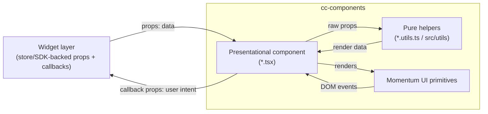
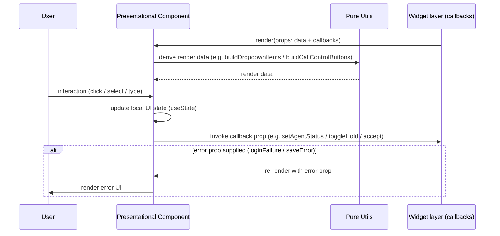
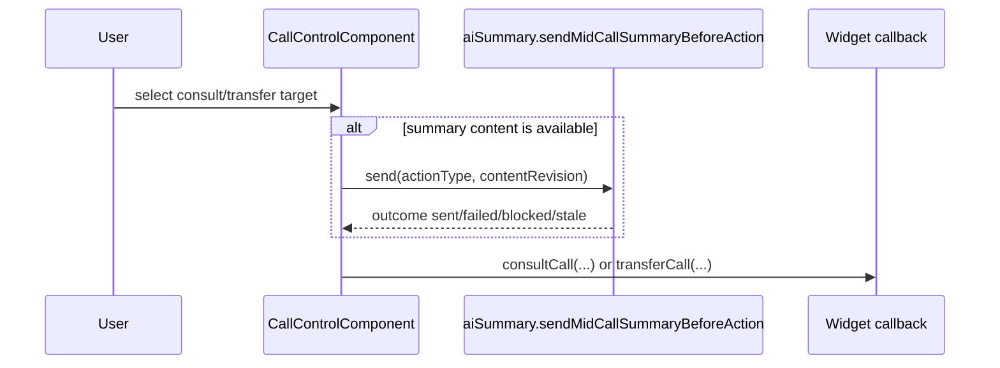
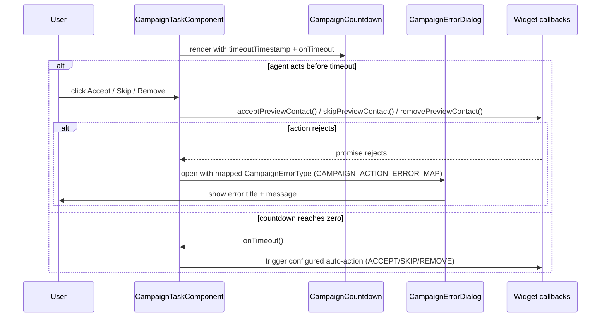

# cc-components — SPEC

> Start here → root [`AGENTS.md`](../../../../AGENTS.md) (agent entry) · router [`SPEC_INDEX.md`](../../../../ai-docs/SPEC_INDEX.md) · system [`ARCHITECTURE.md`](../../../../ai-docs/ARCHITECTURE.md). This is the module's canonical spec: orientation, requirements, design, flows, UI, and tests.
> Context-efficiency: link to canonical docs — don't duplicate them. Load specs on demand per `SPEC_INDEX.md`.

## Metadata

| Field                                   | Value                                                                            |
| --------------------------------------- | -------------------------------------------------------------------------------- |
| Module id                               | `cc-components`                                                                  |
| Source path(s)                          | `packages/contact-center/cc-components/src/`                                     |
| Doc kind                                | Module spec                                                                      |
| Coverage score                          | Pending coverage assessment                                                      |
| Generated from                          | `module-spec` @ SDLC template library `0.1.0-draft`                              |
| generated_by / approved_by / updated_at | generated_by `migration agent` / approved_by `pending` / updated_at `2026-06-29` |
| Validation status                       | not-run                                                                          |

## Evidence Rules

Every generated requirement below cites concrete source evidence using `file path`. Source evidence, test evidence, examples, assumptions, and gaps are kept separate so validators and future agents can distinguish truth from context. Test evidence is preferred for WHY. This repository's tests are the authoritative behavior record; commit history is not cited here. Where evidence is missing it is recorded as a gap rather than asserted.

## Source Material Register

| Source doc                                                                                          | Scope                          | Decision                      | Detail location or disposition                                                                                                                                                                                                                                                                |
| --------------------------------------------------------------------------------------------------- | ------------------------------ | ----------------------------- | --------------------------------------------------------------------------------------------------------------------------------------------------------------------------------------------------------------------------------------------------------------------------------------------- |
| `ai-docs/_archive/pre-sdlc-migration/packages/contact-center/cc-components/ai-docs/AGENTS.md`       | overview / API / examples      | migrated / reconciled         | Orientation → Overview/Purpose/Stack; component table → Public Surface; examples → Use Cases. Reconciled: archived table listed 7 components; code exports 16 top-level React symbols plus type/value barrels.                                                                                |
| `ai-docs/_archive/pre-sdlc-migration/packages/contact-center/cc-components/ai-docs/ARCHITECTURE.md` | architecture / component table | migrated / reconciled         | Component table, file structure, patterns, diagrams → Design Overview, Data Flow, Class/Component Relationships, Folder structure, Pitfalls. Conflict: archived doc imports `@momentum-design/components` and `@momentum-ui/react-collaboration` interchangeably; code uses both (see Stack). |
| `packages/contact-center/cc-components/src/` and `tests/`                                           | source / tests                 | reference-only (ground truth) | All requirements, props, and component inventory grounded against live source and `tests/components/`.                                                                                                                                                                                        |

## Overview

`cc-components` is the presentation layer for Webex Contact Center widgets. It is a library of pure, presentational React function components — each receives all data and callbacks via props and renders Momentum UI primitives. Components do not import or read the MobX store, do not call the SDK, and hold only transient local UI state (open/closed menus, selected dropdown values, input text). Business logic and store/SDK access live one layer up, in the widget packages (`station-login`, `user-state`, `task`) that compose these components.

The package exports two surfaces from `src/index.ts` (React components + their prop types) and `src/wc.ts` (the same components wrapped as custom elements via `@r2wc/react-to-web-component`). A maintainer should start at `src/index.ts` to see the public component set, then open the component directory under `src/components/` (each has `*.tsx`, a `*.types.ts` or shared `task.types.ts`, a `*.utils.ts(x)` for extracted logic, and a `*.scss`). Shared, cross-component logic lives in `src/utils/index.ts` (`formatTime`, `getMediaTypeInfo`, `isWxAppEngagedCall`, `shouldShowWxAppTelephonyControls`) and `src/hooks/` (`useIntersectionObserver`). `@webex/cc-task` imports the wxApp visibility helpers from this package's public export.

The component set spans the contact-center agent surface: station login (including the E911 emergency-service acknowledgment modal), agent state, the task lifecycle (incoming task, call control with consult/transfer and AI-summary wrap-up, CAD-enabled call control, task list, outdial), live transcript, AI Assistant receiver summaries, the shared `AISummary` surface, and campaign-preview dialing (countdown, error dialog, campaign task card/popover/list-item).

## Purpose / Responsibility

Owns the presentational React UI primitives for contact-center widgets: render agent/task UI from props and emit user intent back through callback props. Does NOT own state management, SDK access, business logic, or web-component registration into the host (the actual custom-element registration into the host app is `cc-widgets`' responsibility; `wc.ts` here only defines `component-cc-*` elements for the library build).

## Stack

TypeScript 5.6, React 18 (peer `react`/`react-dom` `>=18.3.1`), function components with hooks. UI primitives from `@momentum-ui/react-collaboration` (peer `>=26.197.0`) and `@momentum-design/components/dist/react`. Web-component wrapping via `@r2wc/react-to-web-component` `2.0.3`. Metrics via `@webex/cc-ui-logging` (`withMetrics` HOC). Types consumed from `@webex/cc-store`. Test stack: Jest 29 + React Testing Library 16 + `@testing-library/jest-dom`, jsdom environment, snapshot tests alongside behavioral tests. Build: `tsc` for the type build, Webpack 5 for the bundle. Test command: `yarn workspace @webex/cc-components test:unit`.

## Folder / Package Structure

```
packages/contact-center/cc-components/src/
├── index.ts                          # React component + type barrel (public surface)
├── wc.ts                             # Custom-element (r2wc) wrappers — defines component-cc-* elements
├── hooks/
│   ├── index.ts                      # Hook barrel
│   └── useIntersectionObserver.ts    # Infinite-scroll / lazy-load observer hook
├── utils/
│   └── index.ts                      # Shared utils: formatTime, getMediaTypeInfo
└── components/
    ├── AIAssistant/                  # AI Assistant panel, receiver summary branch, AdaptiveCardRenderer
    ├── AISummary/                    # Shared AI summary surface, messages, post-call projection, types
    ├── StationLogin/                 # Agent login / device + team selection UI
    ├── UserState/                    # Agent state dropdown, idle codes, state timer
    └── task/
        ├── constants.ts              # Shared task UI label/string constants
        ├── task.types.ts            # Shared task prop/types + component prop Picks
        ├── Task/                     # Generic task row (shared by IncomingTask & TaskList)
        ├── IncomingTask/             # Incoming task notification (Answer/Decline)
        ├── TaskList/                 # Active/incoming task list
        ├── CallControl/              # Call control buttons (hold/mute/record/end/wrapup)
        │   ├── call-control-dtmf-keypad.tsx  # In-call DTMF keypad (wxApp telephony)
        │   └── CallControlCustom/    # Consult/Transfer popover, list items, dial-number, consult bar
        ├── CallControlCAD/           # CAD-enabled call control header (customer/queue/CAD vars)
        ├── OutdialCall/              # Outbound dialpad + ANI/address-book selection
        ├── RealTimeTranscript/       # Live transcript renderer
        ├── AutoWrapupTimer/          # Auto-wrapup countdown bar
        ├── TaskTimer/                # Generic elapsed/urgency timer
        ├── GlobalVariablesPanel/     # Agent-viewable CAD global variables panel
        ├── CampaignCountdown/        # Campaign preview offer countdown
        ├── CampaignErrorDialog/      # Campaign action-failure dialog
        └── CampaignTask/             # Campaign preview card
            ├── CampaignTaskListItem/ # Shared campaign row (avatar/title/countdown/actions)
            └── CampaignTaskPopover/  # Hover popover with campaign global variables
tests/components/                     # Mirrors src; behavioral + *.snapshot tests + __snapshots__
tests/hooks/                          # Hook tests
```

## Key Files (source of truth)

| File                                                 | Holds                                                                                                                                                                                                                                                                                                   |
| ---------------------------------------------------- | ------------------------------------------------------------------------------------------------------------------------------------------------------------------------------------------------------------------------------------------------------------------------------------------------------- |
| `src/index.ts`                                       | The public React component set and re-exported type barrels — authoritative export list.                                                                                                                                                                                                                |
| `src/wc.ts`                                          | Custom-element tag names (`component-cc-*`) and the r2wc prop type maps per component.                                                                                                                                                                                                                  |
| `src/components/task/task.types.ts`                  | Shared task prop interfaces and the `Pick`-derived component prop types (`CallControlComponentProps`, `IncomingTaskComponentProps`, `TaskListComponentProps`, `OutdialCallComponentProps`, `RealTimeTranscriptComponentProps`), plus `MEDIA_CHANNEL`, `TaskState`, `ControlVisibility`, campaign types. |
| `src/components/AIAssistant/`                        | AI Assistant panel chrome, receiver-summary prop types, display-only Adaptive Card renderer, and receiver summary tests.                                                                                                                                                                                |
| `src/components/AISummary/`                          | SDK-free shared AI summary presentation, copy/feedback controls, hover tooltips, post-call display-section projection, and exact en-US summary messages.                                                                                                                                                |
| `src/components/StationLogin/station-login.types.ts` | `IStationLoginProps` and the `StationLoginComponentProps` Pick.                                                                                                                                                                                                                                         |
| `src/components/UserState/user-state.types.ts`       | `IUserState`, `UserStateComponentsProps` Pick, `AgentUserState` enum.                                                                                                                                                                                                                                   |
| `src/components/StationLogin/constants.ts`           | Login labels/error strings — re-exported from the barrel; never hardcode these elsewhere.                                                                                                                                                                                                               |
| `src/components/task/constants.ts`                   | Task UI label/string constants (e.g. `CAMPAIGN_CALL`, `WRAP_UP`).                                                                                                                                                                                                                                       |
| `src/utils/index.ts`                                 | `formatTime` (timer formatting), `getMediaTypeInfo` (media icon/label mapping), and wxApp telephony visibility helpers (`isWxAppEngagedCall`, `shouldShowWxAppTelephonyControls` in `wxapp-telephony.utils.ts`, re-exported from package index).                                                        |

## Public Surface

Consumed as an imported SDK/code API. The React barrel (`src/index.ts`) is the primary surface; `src/wc.ts` exposes the same components as custom elements for the library build. Exact prop schemas live in the `*.types.ts` files (linked below); the root contract index (`CONTRACTS.md`) documents how the consuming `cc-widgets`/widget layer re-exposes these as custom elements.

| Contract ID                                  | Type               | Surface                                                                                                                                                                                                                                                                                     | Purpose                                                                                                                                                                                                                                                                                                                                                                                                                | Compatibility / deprecation                                                                                                                                   | Schema / detail link                                                     | Root index                                         |
| -------------------------------------------- | ------------------ | ------------------------------------------------------------------------------------------------------------------------------------------------------------------------------------------------------------------------------------------------------------------------------------------- | ---------------------------------------------------------------------------------------------------------------------------------------------------------------------------------------------------------------------------------------------------------------------------------------------------------------------------------------------------------------------------------------------------------------------- | ------------------------------------------------------------------------------------------------------------------------------------------------------------- | ------------------------------------------------------------------------ | -------------------------------------------------- |
| `cc-components.StationLoginComponent`        | SDK                | `StationLoginComponent` (`StationLoginComponentProps`)                                                                                                                                                                                                                                      | Agent login: device/team selection, login/logout, multiple-login alert, profile mode                                                                                                                                                                                                                                                                                                                                   | semver; props are `Pick`ed — adding optional props = minor, removing/renaming a picked prop = major                                                           | `src/components/StationLogin/station-login.types.ts`                     | [`CONTRACTS.md`](../../../../ai-docs/CONTRACTS.md) |
| `cc-components.UserStateComponent`           | SDK                | `UserStateComponent` (`UserStateComponentsProps`)                                                                                                                                                                                                                                           | Agent state dropdown + idle codes + state timer                                                                                                                                                                                                                                                                                                                                                                        | semver as above                                                                                                                                               | `src/components/UserState/user-state.types.ts`                           | [`CONTRACTS.md`](../../../../ai-docs/CONTRACTS.md) |
| `cc-components.CallControlComponent`         | SDK                | `CallControlComponent` (`CallControlComponentProps`), including `aiSummary?: CallControlAISummaryProps`, `wrapupCall(reason, id): Promise<WrapupCompletionResult>`, and `WrapupCompletionResult`                                                                                            | Call control buttons: hold/resume, mute, record, end, async wrap-up, consult/transfer/conference, mid-call summary send-before-action, and post-call AI-summary wrap-up                                                                                                                                                                                                                                                | semver as above; the synchronous `wrapupCall` → async `Promise<WrapupCompletionResult>` migration is breaking for consumers that typed the callback as `void` | `src/components/task/task.types.ts`                                      | [`CONTRACTS.md`](../../../../ai-docs/CONTRACTS.md) |
| `cc-components.consult-transfer-lists`       | SDK callback props | `getQueuesFetcher`/`getQueues` use `FetchPaginatedList<ContactServiceQueue>` and `getEntryPoints` uses `FetchPaginatedList<EntryPointRecord>`                                                                                                                                               | Render the SDK's established queue and entry-point records directly in backend order                                                                                                                                                                                                                                                                                                                                   | types track the existing SDK/store entity contracts                                                                                                           | `src/components/task/task.types.ts`                                      | [`CONTRACTS.md`](../../../../ai-docs/CONTRACTS.md) |
| `cc-components.CallControlCADComponent`      | SDK                | `CallControlCADComponent` (`CallControlComponentProps`)                                                                                                                                                                                                                                     | Call control with customer/queue header and agent-viewable CAD global variables                                                                                                                                                                                                                                                                                                                                        | semver as above                                                                                                                                               | `src/components/task/task.types.ts`                                      | [`CONTRACTS.md`](../../../../ai-docs/CONTRACTS.md) |
| `cc-components.IncomingTaskComponent`        | SDK                | `IncomingTaskComponent` (`IncomingTaskComponentProps`)                                                                                                                                                                                                                                      | Incoming task notification with Answer/Decline                                                                                                                                                                                                                                                                                                                                                                         | semver as above                                                                                                                                               | `src/components/task/task.types.ts`                                      | [`CONTRACTS.md`](../../../../ai-docs/CONTRACTS.md) |
| `cc-components.TaskListComponent`            | SDK                | `TaskListComponent` (`TaskListComponentProps`)                                                                                                                                                                                                                                              | Active + incoming task list; renders campaign preview when enabled                                                                                                                                                                                                                                                                                                                                                     | semver as above                                                                                                                                               | `src/components/task/task.types.ts`                                      | [`CONTRACTS.md`](../../../../ai-docs/CONTRACTS.md) |
| `cc-components.OutdialCallComponent`         | SDK                | `OutdialCallComponent` (`OutdialCallComponentProps`)                                                                                                                                                                                                                                        | Outbound dialpad, ANI selection, address-book search                                                                                                                                                                                                                                                                                                                                                                   | semver as above                                                                                                                                               | `src/components/task/task.types.ts`                                      | [`CONTRACTS.md`](../../../../ai-docs/CONTRACTS.md) |
| `cc-components.RealTimeTranscriptComponent`  | SDK                | `RealTimeTranscriptComponent` (`RealTimeTranscriptComponentProps`)                                                                                                                                                                                                                          | Renders sorted live transcript entries; empty state when none                                                                                                                                                                                                                                                                                                                                                          | semver as above                                                                                                                                               | `src/components/task/task.types.ts`                                      | [`CONTRACTS.md`](../../../../ai-docs/CONTRACTS.md) |
| `cc-components.CampaignCountdownComponent`   | SDK                | `CampaignCountdownComponent` (`CampaignCountdownProps`)                                                                                                                                                                                                                                     | Campaign preview offer countdown; fires `onTimeout` at zero                                                                                                                                                                                                                                                                                                                                                            | semver as above                                                                                                                                               | `src/components/task/CampaignCountdown/campaign-countdown.types.ts`      | [`CONTRACTS.md`](../../../../ai-docs/CONTRACTS.md) |
| `cc-components.CampaignErrorDialogComponent` | SDK                | `CampaignErrorDialogComponent` (`CampaignErrorDialogProps`)                                                                                                                                                                                                                                 | Modal shown when a campaign action (accept/skip/remove/cancel) fails                                                                                                                                                                                                                                                                                                                                                   | semver as above                                                                                                                                               | `src/components/task/CampaignErrorDialog/campaign-error-dialog.types.ts` | [`CONTRACTS.md`](../../../../ai-docs/CONTRACTS.md) |
| `cc-components.CampaignTaskComponent`        | SDK                | `CampaignTaskComponent` (`CampaignTaskProps`)                                                                                                                                                                                                                                               | Campaign preview card: accept/skip/remove, countdown, error dialog                                                                                                                                                                                                                                                                                                                                                     | semver as above                                                                                                                                               | `src/components/task/task.types.ts`                                      | [`CONTRACTS.md`](../../../../ai-docs/CONTRACTS.md) |
| `cc-components.E911Modal`                    | SDK                | `E911Modal` (`E911ModalProps`)                                                                                                                                                                                                                                                              | Emergency-service (E911) acknowledgment modal shown on BROWSER station login; Cancel is the only dismissal path, Save & Continue is gated on the checkbox and disabled while the save is in flight                                                                                                                                                                                                                     | semver as above; not yet in `wc.ts` (React-only, no custom-element wrapper)                                                                                   | `src/components/StationLogin/E911Modal/e911-modal.types.ts`              | [`CONTRACTS.md`](../../../../ai-docs/CONTRACTS.md) |
| `cc-components.AIAssistantComponent`         | SDK                | `AIAssistantComponent` (`AIAssistantComponentProps`, `AIAssistantReceiverSummary`, `AdaptiveCardRendererProps`, action event types)                                                                                                                                                         | AI Assistant panel chrome, Real-time Assist transcript/actions, and receiving-agent `View summary` branch                                                                                                                                                                                                                                                                                                              | semver as above; receiver branch is props-only and React-only                                                                                                 | `src/components/AIAssistant/ai-assistant.types.ts`                       | [`CONTRACTS.md`](../../../../ai-docs/CONTRACTS.md) |
| `cc-components.AISummary`                    | SDK                | `AISummary` (`AISummaryProps` mode union), `AI_SUMMARY_MESSAGES`, `COPIED_FEEDBACK_MS`, `MID_CALL_SECTION_DEFINITIONS`, `POST_CALL_SECTION_DEFINITIONS`, `POST_CALL_DISPLAY_SECTION_ORDER`, `projectPostCallDisplaySections`, and `components/AISummary` type exports                                                                                        | Shared SDK-free AI summary presentation for mid-call initiator/receiver and post-call wrap-up surfaces                                                                                                                                                                                                                                                                                                                 | semver as above; adding a mode or narrowing callback/result types is breaking unless optional/backward-compatible                                             | `src/components/AISummary/`                                              | [`CONTRACTS.md`](../../../../ai-docs/CONTRACTS.md) |
| `cc-components.TelephonyActionToast`         | SDK                | `TelephonyActionToast` (`TelephonyActionToastProps`)                                                                                                                                                                                                                                        | wxApp thick-client telephony error toast (Momentum `Toast` `variant="error"`); consumed by `@webex/cc-task` CallControl / CallControlCAD wrappers, not intended for third-party host apps                                                                                                                                                                                                                              | semver; widget-internal surface — exported from package index for cross-package use                                                                           | `src/components/task/TelephonyActionToast/telephony-action-toast.tsx`    | [`CONTRACTS.md`](../../../../ai-docs/CONTRACTS.md) |
| `cc-components.WxAppOfferActionError`        | SDK                | `WxAppOfferActionError` (`WxAppOfferActionErrorProps`)                                                                                                                                                                                                                                      | Inline wxApp offer-action error as red text (`--mds-color-theme-text-error-normal`) on a full-width row below Accept/Decline — no alert background, padding, or border; parent `Task` sets `ListItemBase size="auto"` when an error is present so the row grows naturally; store-backed per `interactionId`, shared between TaskList and IncomingTask via `@webex/cc-store` (immutable map updates for memo-safe sync) | semver; widget-internal surface — exported from package index for cross-package use                                                                           | `src/components/task/WxAppOfferActionError/wxapp-offer-action-error.tsx` | [`CONTRACTS.md`](../../../../ai-docs/CONTRACTS.md) |
| `cc-components.wxapp-telephony-utils`        | SDK                | `isWxAppEngagedCall`, `shouldShowWxAppTelephonyControls`                                                                                                                                                                                                                                    | Shared wxApp visibility helpers for mute/keypad gating across cc-components and cc-task                                                                                                                                                                                                                                                                                                                                | semver; utility exports from `src/utils/wxapp-telephony.utils.ts`                                                                                             | `src/utils/wxapp-telephony.utils.ts`                                     | [`CONTRACTS.md`](../../../../ai-docs/CONTRACTS.md) |
| `cc-components.wc`                           | SDK                | `@webex/cc-components/wc` → custom elements `component-cc-user-state`, `component-cc-station-login`, `component-cc-call-control`, `component-cc-call-control-cad`, `component-cc-incoming-task`, `component-cc-task-list`, `component-cc-out-dial-call`, `component-cc-realtime-transcript` | Custom-element build of the components                                                                                                                                                                                                                                                                                                                                                                                 | tag names are breaking surface; r2wc prop type map is part of the contract                                                                                    | `src/wc.ts`                                                              | [`CONTRACTS.md`](../../../../ai-docs/CONTRACTS.md) |

Compatibility notes:

- Component props are derived with `Pick<...>` over a larger interface (e.g. `IStationLoginProps`, `ControlProps`); only the picked keys are public. Adding an optional picked prop is additive (minor); removing/renaming a picked prop, or narrowing a prop's type, is breaking (major).
- Custom-element tag names in `wc.ts` (`component-cc-*`) and their r2wc prop type maps are a breaking surface — renaming a tag or changing a prop's r2wc type (`json`/`string`/`function`/...) breaks host consumers.
- `wc.ts` aliases `CallControlCADComponent` to `../CallControl/call-control` (imports `CallControlComponent` under the `CallControlCADComponent` name); the distinct CAD component is `src/components/task/CallControlCAD/call-control-cad.tsx`. See Pitfalls.
- `CallControlComponentProps.wrapupCall` is asynchronous for direct React consumers: hosts must supply `(wrapupReason, wrapupId) => Promise<WrapupCompletionResult>`. The `component-cc-call-control` and `component-cc-call-control-cad` runtime path still accepts legacy fire-and-forget function props; `handleWrapupCall` normalizes undefined/non-result callback returns to `{wrapup: 'succeeded', response: 'not-required'}` so the selected reason clears. Missing selections, thrown callbacks, and rejected callbacks still resolve `{wrapup: 'failed'}` instead of rejecting to the UI.
- `CallControlAISummaryProps.requestMidCallSummary(actionType)` is the canonical popover-open callback and resolves the store `AISummaryRequestResult`; `sendMidCallSummaryBeforeAction(actionType, expectedRevision)` resolves the store `AISummaryPreActionSendResult` and is awaited before the consult/transfer/Transfer Conference/Merge telephony callback runs. `CallControlComponent` invokes `consultCall`, `transferCall`, `consultTransfer`, or `consultConference` once after that Promise settles, including failed/blocked/stale outcomes. Those telephony suppliers may return `void` or `Promise<void>`; the adapter observes fulfillment/rejection, consumes failures, and commits consult target UI state only after `consultCall` fulfills.

`src/index.ts` public barrel inventory:

The `AISummary` barrel also exports `MID_CALL_SECTION_DEFINITIONS` and
`POST_CALL_SECTION_DEFINITIONS`, readonly SDK section-key/label registries.
Both are existing public values, alongside the display-order constant and
projection helper; they are not widget or store actions.

| Export group                  | Public exports                                                                                                                                                                                                                                                                                                                                                                                  |
| ----------------------------- | ----------------------------------------------------------------------------------------------------------------------------------------------------------------------------------------------------------------------------------------------------------------------------------------------------------------------------------------------------------------------------------------------- |
| Top-level React symbols       | `UserStateComponent`, `StationLoginComponent`, `CallControlComponent`, `CallControlCADComponent`, `IncomingTaskComponent`, `TaskListComponent`, `OutdialCallComponent`, `CampaignErrorDialogComponent`, `CampaignCountdownComponent`, `CampaignTaskComponent`, `RealTimeTranscriptComponent`, `E911Modal`, `AIAssistantComponent`, `TelephonyActionToast`, `WxAppOfferActionError`, `AISummary` |
| Station/User types and values | `StationLogin/constants`, `E911ModalProps`, `StationLoginComponentProps`/station-login types, `UserStateComponentsProps`/user-state types                                                                                                                                                                                                                                                       |
| Task types and values         | `task.types` exports including `CallControlComponentProps`, `CallControlAISummaryProps`, `WrapupCompletionResult`, `IncomingTaskComponentProps`, `TaskListComponentProps`, `OutdialCallComponentProps`, `RealTimeTranscriptComponentProps`, `TARGET_TYPE`, `MEDIA_CHANNEL`, campaign/participant/wxApp types                                                                                    |
| Campaign types                | `CampaignErrorDialogProps`/campaign error constants and `CampaignCountdownProps`                                                                                                                                                                                                                                                                                                                |
| AI Assistant types            | `AIAssistantComponentProps`, `AIAssistantReceiverSummary`, `AdaptiveCardRendererProps`, `AIAssistantActionEvent`, `AIAssistantActionKind`                                                                                                                                                                                                                                                       |
| AISummary component barrel    | `AISummary` default/named export, `projectPostCallDisplaySections`, `AI_SUMMARY_MESSAGES`, `COPIED_FEEDBACK_MS`, `MID_CALL_SECTION_DEFINITIONS`, `POST_CALL_SECTION_DEFINITIONS`, `POST_CALL_DISPLAY_SECTION_ORDER`, and `AISummaryProps`/mode-specific type exports                                                                                                                                                                                             |
| Utilities                     | `isWxAppEngagedCall`, `shouldShowWxAppTelephonyControls`                                                                                                                                                                                                                                                                                                                                        |

## Requires (dependencies)

- `@webex/cc-store` (workspace:\*) — type-only import surface here (`ITask`, `ILogger`, `IContactCenter`, `ContactServiceQueue`, `EntryPointRecord`, `IdleCode`, `IWrapupCode`, `BuddyDetails`, etc.) and constants such as `ERROR_TRIGGERING_IDLE_CODES`, `LoginOptions`, `DESKTOP`. Components consume types/constants, not the store singleton.
- `@webex/cc-ui-logging` (workspace:\*) — `withMetrics` HOC wrapping widget-facing component exports for mount/metrics tracking.
- `@momentum-ui/react-collaboration` (peer `>=26.197.0`) and `@momentum-design/components/dist/react` — UI primitives.
- `@r2wc/react-to-web-component` `2.0.3` — custom-element wrapping in `wc.ts`.
- `@momentum-ui/illustrations` `^1.24.0` — illustration assets.
- `react` / `react-dom` (peer `>=18.3.1`) — provided by the host.
- `@webex/test-fixtures` (workspace:\*, dev) — shared test mocks.

## Requirements

| ID                    | WHAT                                                                                                                                                                                                                                                                                                                                                                                                                                                                                                                                                                                                                                                                                                                                                                                                                                                                                                                                                                                                                                                                                                                                                                                                                                                                                                                                                                                                                                                                                                                                                                                                                                                                                                                                                                                                                                                                                                                                                                                                                                                                                                                                                                                                                                                                                                                                                                                                                                                                                                                                                                                                                                                                                                                                                      | WHY                                                                                                                                                                                                                                                                                                           | Source Evidence                                                                                                                                                                                                                                                                                                                                                                                                                                        | Test / Example Evidence                                                                                                                                                                                                                                                                                                                                                                                                                                                                                                                                                                                                                                                                                                                                                                                                                                                                                                                                                                                                                                                                                                                                                                                                                                                                                                                       | Assumptions / Gaps                                                                                                                                                                                   | Confidence |
| --------------------- | --------------------------------------------------------------------------------------------------------------------------------------------------------------------------------------------------------------------------------------------------------------------------------------------------------------------------------------------------------------------------------------------------------------------------------------------------------------------------------------------------------------------------------------------------------------------------------------------------------------------------------------------------------------------------------------------------------------------------------------------------------------------------------------------------------------------------------------------------------------------------------------------------------------------------------------------------------------------------------------------------------------------------------------------------------------------------------------------------------------------------------------------------------------------------------------------------------------------------------------------------------------------------------------------------------------------------------------------------------------------------------------------------------------------------------------------------------------------------------------------------------------------------------------------------------------------------------------------------------------------------------------------------------------------------------------------------------------------------------------------------------------------------------------------------------------------------------------------------------------------------------------------------------------------------------------------------------------------------------------------------------------------------------------------------------------------------------------------------------------------------------------------------------------------------------------------------------------------------------------------------------------------------------------------------------------------------------------------------------------------------------------------------------------------------------------------------------------------------------------------------------------------------------------------------------------------------------------------------------------------------------------------------------------------------------------------------------------------------------------------------------- | ------------------------------------------------------------------------------------------------------------------------------------------------------------------------------------------------------------------------------------------------------------------------------------------------------------- | ------------------------------------------------------------------------------------------------------------------------------------------------------------------------------------------------------------------------------------------------------------------------------------------------------------------------------------------------------------------------------------------------------------------------------------------------------ | --------------------------------------------------------------------------------------------------------------------------------------------------------------------------------------------------------------------------------------------------------------------------------------------------------------------------------------------------------------------------------------------------------------------------------------------------------------------------------------------------------------------------------------------------------------------------------------------------------------------------------------------------------------------------------------------------------------------------------------------------------------------------------------------------------------------------------------------------------------------------------------------------------------------------------------------------------------------------------------------------------------------------------------------------------------------------------------------------------------------------------------------------------------------------------------------------------------------------------------------------------------------------------------------------------------------------------------------- | ---------------------------------------------------------------------------------------------------------------------------------------------------------------------------------------------------- | ---------- |
| `CC-COMPONENTS-R-001` | Components are pure presentational: they receive data + callbacks via props and never read the MobX store or call the SDK directly.                                                                                                                                                                                                                                                                                                                                                                                                                                                                                                                                                                                                                                                                                                                                                                                                                                                                                                                                                                                                                                                                                                                                                                                                                                                                                                                                                                                                                                                                                                                                                                                                                                                                                                                                                                                                                                                                                                                                                                                                                                                                                                                                                                                                                                                                                                                                                                                                                                                                                                                                                                                                                       | Keeps presentation decoupled from state/SDK so components are testable in isolation and reusable across widgets.                                                                                                                                                                                              | `src/components/StationLogin/station-login.tsx`, `src/components/UserState/user-state.tsx`, `src/components/task/CallControl/call-control.tsx` (props-only; no `@webex/cc-store` singleton import)                                                                                                                                                                                                                                                     | `tests/components/StationLogin/station-login.tsx` (renders from props, mocks callbacks)                                                                                                                                                                                                                                                                                                                                                                                                                                                                                                                                                                                                                                                                                                                                                                                                                                                                                                                                                                                                                                                                                                                                                                                                                                                       | None                                                                                                                                                                                                 | PRESENT    |
| `CC-COMPONENTS-R-002` | The public React surface is exactly the 16 top-level React symbols exported from `index.ts` plus the re-exported type/value barrels for StationLogin, UserState, task, Campaign, AIAssistant, AISummary, and wxApp telephony utilities.                                                                                                                                                                                                                                                                                                                                                                                                                                                                                                                                                                                                                                                                                                                                                                                                                                                                                                                                                                                                                                                                                                                                                                                                                                                                                                                                                                                                                                                                                                                                                                                                                                                                                                                                                                                                                                                                                                                                                                                                                                                                                                                                                                                                                                                                                                                                                                                                                                                                                                                   | Defines the supported import surface; consumers must not import internal subcomponents.                                                                                                                                                                                                                       | `src/index.ts`, `src/components/AISummary/index.ts`, `src/components/AISummary/ai-summary.constants.ts`, `src/components/AISummary/ai-summary.types.ts`                                                                                                                                                                                                                                                                                                | Import sites across `tests/components/**`, including `tests/components/AISummary/ai-summary.tsx` (`exports a unique display ordinal and inserts Outcome without reordering SDK sections`)                                                                                                                                                                                                                                                                                                                                                                                                                                                                                                                                                                                                                                                                                                                                                                                                                                                                                                                                                                                                                                                                                                                                                     | No single test asserts the complete barrel inventory; `E911Modal`, `AIAssistantComponent`, `TelephonyActionToast`, `WxAppOfferActionError`, and `AISummary` are not wrapped in `wc.ts`               | PRESENT    |
| `CC-COMPONENTS-R-003` | `StationLoginComponent` invokes the supplied callbacks (`login`, `setDeviceType`, `setDialNumber`, `handleContinue`, `saveLoginOptions`) on the matching user action and surfaces `loginFailure`/`saveError` as error UI.                                                                                                                                                                                                                                                                                                                                                                                                                                                                                                                                                                                                                                                                                                                                                                                                                                                                                                                                                                                                                                                                                                                                                                                                                                                                                                                                                                                                                                                                                                                                                                                                                                                                                                                                                                                                                                                                                                                                                                                                                                                                                                                                                                                                                                                                                                                                                                                                                                                                                                                                 | Login intent and errors must propagate to the widget layer without the component owning login logic.                                                                                                                                                                                                          | `src/components/StationLogin/station-login.tsx`, `src/components/StationLogin/station-login.utils.tsx`                                                                                                                                                                                                                                                                                                                                                 | `tests/components/StationLogin/station-login.tsx` (`calls login function...`, `renders login failure when passed`, `renders save error when passed`)                                                                                                                                                                                                                                                                                                                                                                                                                                                                                                                                                                                                                                                                                                                                                                                                                                                                                                                                                                                                                                                                                                                                                                                          | None                                                                                                                                                                                                 | PRESENT    |
| `CC-COMPONENTS-R-004` | `StationLoginComponent` hides the Desktop login option when `hideDesktopLogin` is true (in both login and profile mode) and shows it when false/undefined.                                                                                                                                                                                                                                                                                                                                                                                                                                                                                                                                                                                                                                                                                                                                                                                                                                                                                                                                                                                                                                                                                                                                                                                                                                                                                                                                                                                                                                                                                                                                                                                                                                                                                                                                                                                                                                                                                                                                                                                                                                                                                                                                                                                                                                                                                                                                                                                                                                                                                                                                                                                                | Deployments can disable Desktop login; must be honored consistently across modes.                                                                                                                                                                                                                             | `src/components/StationLogin/station-login.tsx`, `src/components/StationLogin/station-login.utils.tsx`                                                                                                                                                                                                                                                                                                                                                 | `tests/components/StationLogin/station-login.tsx` (`hides Desktop login option when hideDesktopLogin is true`, `... when false`, `... when undefined`, `... in profile mode`)                                                                                                                                                                                                                                                                                                                                                                                                                                                                                                                                                                                                                                                                                                                                                                                                                                                                                                                                                                                                                                                                                                                                                                 | None                                                                                                                                                                                                 | PRESENT    |
| `CC-COMPONENTS-R-005` | `UserStateComponent` renders idle codes sorted/built into the dropdown, reflects `currentState`/`elapsedTime`, and calls `setAgentStatus(auxCodeId)` on selection; error-triggering idle codes are styled distinctly.                                                                                                                                                                                                                                                                                                                                                                                                                                                                                                                                                                                                                                                                                                                                                                                                                                                                                                                                                                                                                                                                                                                                                                                                                                                                                                                                                                                                                                                                                                                                                                                                                                                                                                                                                                                                                                                                                                                                                                                                                                                                                                                                                                                                                                                                                                                                                                                                                                                                                                                                     | Agent must change state and see correct current state + timing; error idle codes need visual emphasis.                                                                                                                                                                                                        | `src/components/UserState/user-state.tsx`, `src/components/UserState/user-state.utils.ts` (`buildDropdownItems`, `sortDropdownItems`, `handleSelectionChange`, `getDropdownClass`)                                                                                                                                                                                                                                                                     | `tests/components/UserState/user-state.tsx`, `tests/components/UserState/user-state.utils.tsx`                                                                                                                                                                                                                                                                                                                                                                                                                                                                                                                                                                                                                                                                                                                                                                                                                                                                                                                                                                                                                                                                                                                                                                                                                                                | None                                                                                                                                                                                                 | PRESENT    |
| `CC-COMPONENTS-R-006` | `CallControlComponent` builds its button set from Task controls, passes the matching SDK-ordered `consultTransferDestinations` action array into the popover, and routes button presses to the matching callback; wrapup requires selecting a reason. `CallControlComponentProps.aiSummary?: CallControlAISummaryProps` can supply consult/transfer summaries, a post-call `WrapUpSummaryView`, `requestMidCallSummary`, `onPostCallReasonCommit`, and `sendMidCallSummaryBeforeAction`. Voice consult/transfer popovers call `requestMidCallSummary` from their open effect with fulfillment and rejection observers; omitted summaries keep the destination UI mounted until pending/content/error arrives. The latched popover layout is one of voice radios, non-voice pills, or the existing-party action confirmation used by Transfer/Transfer Conference and Merge. For destinations and existing-party confirmation, the shared mid-call adapter awaits the summary send Promise (`sent`/`failed`/`blocked`/`stale`) before calling `consultCall`, `transferCall`, `consultTransfer`, or `consultConference` exactly once; re-entry while the response send is pending is ignored. While a rendered summary request is pending, destination rows, manual quick actions, and existing-party confirmations remain focusable with `aria-disabled` and their activation handlers return before telephony. Content summaries call `onViewed(contentRevision)` for genuine visible content/replacements and remounts; accepted local edit revisions do not count as views. Synchronous and Promise-returning telephony suppliers are normalized at the boundary, rejected telephony Promises are consumed, and consult target name/type are committed only after `consultCall` fulfills. Transfer/Transfer Conference opens TRANSFER preparation; Merge reuses the current CONSULT summary or starts initial CONSULT preparation for an eligible fresh omitted view. Only absent/ineligible views keep the immediate legacy callback path, including the CAD consult surface. Direct React `wrapupCall(reason, id)` returns `Promise<WrapupCompletionResult>`; `handleWrapupCall` keeps explicit closed results authoritative, resolves `{wrapup: 'failed'}` for missing selections, thrown callbacks, and rejected callbacks, and normalizes legacy custom-element undefined/non-result callback returns to `{wrapup: 'succeeded', response: 'not-required'}` so selections clear. UI callers receive a never-rejecting completion Promise. CallControl shares one wrap-up pending latch across `WrapUpSummary` and the legacy Submit button, passes it as `completionPending`, and ignores re-entry until the same completion settles. The popover renders destination categories in supplied order and may only remove Dial Number/Entry Point through explicit host hide options. | Call control must reflect SDK decisions without reconstructing profile/media/direction policy, preserve a stable telephony ordering around AI summary settlement, give direct React hosts an explicit async wrap-up result contract, and preserve legacy custom-element fire-and-forget wrap-up callbacks.    | `src/components/task/task.types.ts` (`CallControlAISummaryProps`, `WrapupCompletionResult`, `CallControlComponentProps`, `ConsultTransferDestinationLayout`), `src/components/task/CallControl/call-control.tsx`, `src/components/task/CallControl/call-control.utils.ts`, `src/components/task/CallControl/CallControlCustom/call-control-consult.tsx`, `src/components/task/CallControl/CallControlCustom/consult-transfer-popover.tsx`, `src/wc.ts` | `tests/components/task/CallControl/call-control.tsx` (`requests an initiating summary when a voice consult popover opens`, destination response-before-telephony, deferred consult state, existing-party Transfer/Merge confirmations, existing-party rejection consumption, eligible fresh existing-party preparation and absent/ineligible legacy paths, once-only post-call and legacy wrap-up completion), `tests/components/task/CallControl/CallControlCustom/consult-transfer-popover.tsx` (`auto-starts the matching mid-call summary request and observes rejection`, pending destination/quick-action guard, once-per-revision reveal recording, existing-party action variant), `tests/components/task/CallControl/CallControlCustom/call-control-consult.tsx` (CAD consult surface fresh/reused/absent summary paths), `tests/components/task/CallControl/call-control.utils.tsx` (shared adapter ordering/re-entry, async rejection consumption, delayed consult-state commit plus wrap-up contract), `tests/wc.tsx` (component-cc call-control tag/function mapping and void host callback compatibility)                                                                                                                                                                                                                                                                          | Consumers cannot enable a destination omitted by the SDK. The async `wrapupCall` signature remains required for direct React consumers; custom-element hosts retain the legacy fire-and-forget path. | PRESENT    |
| `CC-COMPONENTS-R-007` | `CallControlCADComponent` renders the customer/queue/caller header and an agent-viewable CAD global variables panel, and renders the campaign call icon + "Campaign call" label when `isCampaignCall` is true.                                                                                                                                                                                                                                                                                                                                                                                                                                                                                                                                                                                                                                                                                                                                                                                                                                                                                                                                                                                                                                                                                                                                                                                                                                                                                                                                                                                                                                                                                                                                                                                                                                                                                                                                                                                                                                                                                                                                                                                                                                                                                                                                                                                                                                                                                                                                                                                                                                                                                                                                            | CAD/header info and campaign branding must be visible to the agent during a call.                                                                                                                                                                                                                             | `src/components/task/CallControlCAD/call-control-cad.tsx`, `src/components/task/Task/task.utils.ts` (`getAgentViewableGlobalVariables`)                                                                                                                                                                                                                                                                                                                | `tests/components/task/CallControlCAD/call-control-cad.tsx`                                                                                                                                                                                                                                                                                                                                                                                                                                                                                                                                                                                                                                                                                                                                                                                                                                                                                                                                                                                                                                                                                                                                                                                                                                                                                   | None                                                                                                                                                                                                 | PRESENT    |
| `CC-COMPONENTS-R-008` | `IncomingTaskComponent` renders the standard `Task` with Answer/Decline when an `incomingTask` is present and renders nothing (hidden) when it is absent; Accept/Decline invoke `accept(task)`/`reject(task)`.                                                                                                                                                                                                                                                                                                                                                                                                                                                                                                                                                                                                                                                                                                                                                                                                                                                                                                                                                                                                                                                                                                                                                                                                                                                                                                                                                                                                                                                                                                                                                                                                                                                                                                                                                                                                                                                                                                                                                                                                                                                                                                                                                                                                                                                                                                                                                                                                                                                                                                                                            | Avoids a stray empty notification when no task; routes accept/decline intent up.                                                                                                                                                                                                                              | `src/components/task/IncomingTask/incoming-task.tsx`, `src/components/task/IncomingTask/incoming-task.utils.tsx` (`extractIncomingTaskData`)                                                                                                                                                                                                                                                                                                           | `tests/components/task/IncomingTask/incoming-task.tsx`, `tests/components/task/IncomingTask/incoming-task.utils.tsx`                                                                                                                                                                                                                                                                                                                                                                                                                                                                                                                                                                                                                                                                                                                                                                                                                                                                                                                                                                                                                                                                                                                                                                                                                          | None                                                                                                                                                                                                 | PRESENT    |
| `CC-COMPONENTS-R-009` | `TaskListComponent` renders nothing when the task list is empty, otherwise renders one row per task; campaign preview tasks render `CampaignTask` (instead of `Task`) only when `hasCampaignPreviewEnabled` (default true) and the task is a campaign preview.                                                                                                                                                                                                                                                                                                                                                                                                                                                                                                                                                                                                                                                                                                                                                                                                                                                                                                                                                                                                                                                                                                                                                                                                                                                                                                                                                                                                                                                                                                                                                                                                                                                                                                                                                                                                                                                                                                                                                                                                                                                                                                                                                                                                                                                                                                                                                                                                                                                                                            | List must collapse when empty and switch row UI for campaign previews per the feature flag.                                                                                                                                                                                                                   | `src/components/task/TaskList/task-list.tsx`, `src/components/task/TaskList/task-list.utils.ts` (`isTaskListEmpty`, `getTasksArray`, `isCampaignPreviewTask`, `getActiveCampaignPreviewId`)                                                                                                                                                                                                                                                            | `tests/components/task/TaskList/task-list.tsx`, `tests/components/task/TaskList/task-list.utils.tsx`                                                                                                                                                                                                                                                                                                                                                                                                                                                                                                                                                                                                                                                                                                                                                                                                                                                                                                                                                                                                                                                                                                                                                                                                                                          | None                                                                                                                                                                                                 | PRESENT    |
| `CC-COMPONENTS-R-010` | `OutdialCallComponent` validates the entered destination, supports dialpad / ANI / address-book tabs, disables the outdial action while a telephony task is active, and calls `startOutdial(destination, origin?)`.                                                                                                                                                                                                                                                                                                                                                                                                                                                                                                                                                                                                                                                                                                                                                                                                                                                                                                                                                                                                                                                                                                                                                                                                                                                                                                                                                                                                                                                                                                                                                                                                                                                                                                                                                                                                                                                                                                                                                                                                                                                                                                                                                                                                                                                                                                                                                                                                                                                                                                                                       | Outbound dialing must validate input and not start a second call over an active one.                                                                                                                                                                                                                          | `src/components/task/OutdialCall/outdial-call.tsx`, `src/components/task/OutdialCall/constants.ts`                                                                                                                                                                                                                                                                                                                                                     | `tests/components/task/OutdialCall/out-dial-call.tsx`                                                                                                                                                                                                                                                                                                                                                                                                                                                                                                                                                                                                                                                                                                                                                                                                                                                                                                                                                                                                                                                                                                                                                                                                                                                                                         | None                                                                                                                                                                                                 | PRESENT    |
| `CC-COMPONENTS-R-011` | `RealTimeTranscriptComponent` sorts `liveTranscriptEntries` by ascending `timestamp` before rendering and shows an empty-state message when there are no entries.                                                                                                                                                                                                                                                                                                                                                                                                                                                                                                                                                                                                                                                                                                                                                                                                                                                                                                                                                                                                                                                                                                                                                                                                                                                                                                                                                                                                                                                                                                                                                                                                                                                                                                                                                                                                                                                                                                                                                                                                                                                                                                                                                                                                                                                                                                                                                                                                                                                                                                                                                                                         | Transcript must read chronologically and degrade gracefully when empty.                                                                                                                                                                                                                                       | `src/components/task/RealTimeTranscript/real-time-transcript.tsx`                                                                                                                                                                                                                                                                                                                                                                                      | `tests/components/task/RealtimeTranscript/realtime-transcript.tsx`                                                                                                                                                                                                                                                                                                                                                                                                                                                                                                                                                                                                                                                                                                                                                                                                                                                                                                                                                                                                                                                                                                                                                                                                                                                                            | None                                                                                                                                                                                                 | PRESENT    |
| `CC-COMPONENTS-R-012` | Campaign preview UI: `CampaignTaskComponent` renders accept/skip/remove + countdown and triggers the configured auto-action on timeout; failed actions open `CampaignErrorDialogComponent` with the mapped `CampaignErrorType`; `CampaignCountdownComponent` fires `onTimeout` at zero.                                                                                                                                                                                                                                                                                                                                                                                                                                                                                                                                                                                                                                                                                                                                                                                                                                                                                                                                                                                                                                                                                                                                                                                                                                                                                                                                                                                                                                                                                                                                                                                                                                                                                                                                                                                                                                                                                                                                                                                                                                                                                                                                                                                                                                                                                                                                                                                                                                                                   | Campaign preview offers are time-boxed; failures and timeouts must be surfaced and auto-handled.                                                                                                                                                                                                              | `src/components/task/CampaignTask/campaign-task.tsx`, `src/components/task/CampaignErrorDialog/campaign-error-dialog.tsx` (+ `.types.ts` `CAMPAIGN_ACTION_ERROR_MAP`, `ERROR_TITLES`), `src/components/task/CampaignCountdown/campaign-countdown.tsx`                                                                                                                                                                                                  | `tests/components/task/CampaignTask/campaign-task.test.tsx`, `tests/components/task/CampaignErrorDialog/campaign-error-dialog.tsx`, `tests/components/task/CampaignCountdown/campaign-countdown.tsx`                                                                                                                                                                                                                                                                                                                                                                                                                                                                                                                                                                                                                                                                                                                                                                                                                                                                                                                                                                                                                                                                                                                                          | None                                                                                                                                                                                                 | PRESENT    |
| `CC-COMPONENTS-R-013` | `formatTime` renders `HH:MM:SS` for durations ≥ 1 hour and `MM:SS` otherwise, with zero-padding; `getMediaTypeInfo` maps media type/channel to icon/label/className/brand-visual, falling back to telephony/chat defaults.                                                                                                                                                                                                                                                                                                                                                                                                                                                                                                                                                                                                                                                                                                                                                                                                                                                                                                                                                                                                                                                                                                                                                                                                                                                                                                                                                                                                                                                                                                                                                                                                                                                                                                                                                                                                                                                                                                                                                                                                                                                                                                                                                                                                                                                                                                                                                                                                                                                                                                                                | Timers and media badges must format consistently across all task components.                                                                                                                                                                                                                                  | `src/utils/index.ts`                                                                                                                                                                                                                                                                                                                                                                                                                                   | `tests/components/task/CallControl/call-control.utils.tsx`, snapshot tests under `tests/components/task/**/__snapshots__/` exercise formatted output                                                                                                                                                                                                                                                                                                                                                                                                                                                                                                                                                                                                                                                                                                                                                                                                                                                                                                                                                                                                                                                                                                                                                                                          | No dedicated `tests/utils/` file found for `formatTime`/`getMediaTypeInfo` (exercised indirectly via component/utils tests)                                                                          | WEAK       |
| `CC-COMPONENTS-R-014` | `useIntersectionObserver` reports element visibility for infinite-scroll/lazy paths (e.g. outdial address-book paging).                                                                                                                                                                                                                                                                                                                                                                                                                                                                                                                                                                                                                                                                                                                                                                                                                                                                                                                                                                                                                                                                                                                                                                                                                                                                                                                                                                                                                                                                                                                                                                                                                                                                                                                                                                                                                                                                                                                                                                                                                                                                                                                                                                                                                                                                                                                                                                                                                                                                                                                                                                                                                                   | Paged lists must load more on scroll without per-component observer wiring.                                                                                                                                                                                                                                   | `src/hooks/useIntersectionObserver.ts`                                                                                                                                                                                                                                                                                                                                                                                                                 | `tests/hooks/useIntersectionObserver.test.ts`                                                                                                                                                                                                                                                                                                                                                                                                                                                                                                                                                                                                                                                                                                                                                                                                                                                                                                                                                                                                                                                                                                                                                                                                                                                                                                 | None                                                                                                                                                                                                 | PRESENT    |
| `CC-COMPONENTS-R-015` | Widget-facing component exports are wrapped with the `withMetrics` HOC so mount/usage metrics are tracked uniformly. Shared/inline exports (`E911Modal`, `TelephonyActionToast`, `WxAppOfferActionError`, `AISummary`) are exported without `withMetrics` today.                                                                                                                                                                                                                                                                                                                                                                                                                                                                                                                                                                                                                                                                                                                                                                                                                                                                                                                                                                                                                                                                                                                                                                                                                                                                                                                                                                                                                                                                                                                                                                                                                                                                                                                                                                                                                                                                                                                                                                                                                                                                                                                                                                                                                                                                                                                                                                                                                                                                                          | Consistent telemetry across widgets without requiring leaf surfaces to emit standalone metrics.                                                                                                                                                                                                               | `withMetrics` import + wrap in `src/components/StationLogin/station-login.tsx`, `src/components/UserState/user-state.tsx`, `src/components/task/CallControl/call-control.tsx`, `src/components/task/CallControlCAD/call-control-cad.tsx`, `src/components/AIAssistant/ai-assistant.tsx`, and task/campaign component files                                                                                                                             | Covered indirectly by each component's render test                                                                                                                                                                                                                                                                                                                                                                                                                                                                                                                                                                                                                                                                                                                                                                                                                                                                                                                                                                                                                                                                                                                                                                                                                                                                                            | No test asserts the HOC wrapping itself; unwrapped shared/inline exports must not be treated as widget metric surfaces                                                                               | WEAK       |
| `CC-COMPONENTS-R-016` | `E911Modal` gates `Save & Continue` on the acknowledgment checkbox, disables both `Save & Continue` and `Cancel` while `onSaveAndContinue` is in flight (guarding against a double-click firing concurrent saves), shows a user-facing error and re-enables the buttons if the save rejects, and only `Cancel` (not the Dialog's built-in close button or Escape) dismisses the modal; checkbox/saving/error state resets when the modal closes.                                                                                                                                                                                                                                                                                                                                                                                                                                                                                                                                                                                                                                                                                                                                                                                                                                                                                                                                                                                                                                                                                                                                                                                                                                                                                                                                                                                                                                                                                                                                                                                                                                                                                                                                                                                                                                                                                                                                                                                                                                                                                                                                                                                                                                                                                                          | An emergency-notification acknowledgment must not be skippable, must not double-submit against the preference API, and must give the agent visible recourse on failure.                                                                                                                                       | `src/components/StationLogin/E911Modal/e911-modal.tsx`                                                                                                                                                                                                                                                                                                                                                                                                 | `tests/components/StationLogin/E911Modal/e911-modal.test.tsx` (checkbox gating, save-in-flight button disabling, save-error display, close-only-via-Cancel)                                                                                                                                                                                                                                                                                                                                                                                                                                                                                                                                                                                                                                                                                                                                                                                                                                                                                                                                                                                                                                                                                                                                                                                   | None                                                                                                                                                                                                 | PRESENT    |
| `CC-COMPONENTS-R-017` | `CallControlCADComponent` renders Customer and Participants sections independently from the supplied Drop roster, so Customer departure removes only Customer while any supported non-customer row remains. Roster presence alone controls the trigger; `null` restores the Customer-only UI. It counts visible non-customer rows (including Supervisor and a ringing or answered pre-merge Entry Point destination), keeps the participant count and postfix chevron on one non-wrapping trigger row, removes participant-type sublabels, uses bold headings and aligned name/action rows, marks the primary agent with Momentum's `primary-participant-regular` icon while retaining `meet-regular` for other rows, keeps non-owner/Supervisor rows non-actionable, and shows a disabled owner action before Entry Point conference merge. The compact tertiary participant trigger uses Momentum secondary-button background tokens in normal, hover, pressed, and expanded states so it remains identifiable without custom chrome. The component receives request/confirmation state and handlers from `useCallControl`; it owns only presentation and focus fallback. The roster uses Momentum Design `Button`, `Popover`, `List`, `ListItem`, `Icon`, `Text`, and `Divider`, while Customer confirmation uses Momentum Design `Dialog` and footer `Button` components. Before Customer confirmation opens, the participant Popover closes so only one focus-trapped overlay is active; the Dialog is viewport-positioned and focus is explicitly restored to the stable participant trigger, with end-call fallback if hydration removes the roster. Styling is limited to compact layout, sizing, overflow/truncation, overlay positioning, and Momentum theme-token colors. Exact visible polite success/assertive failure feedback stays outside the roster, and no duplicate screen-reader announcer is added. Standard `CallControlComponent` does not render this roster.                                                                                                                                                                                                                                                                                                                                                                                                                                                                                                                                                                                                                                                                                                                                                                    | Participant removal must be explicit, accessible, owner-aware, visually consistent with Momentum Design, and resilient when Customer or the final roster row disappears after hydration.                                                                                                                      | `src/components/task/CallControlCAD/call-control-cad.tsx`, `src/components/task/CallControlCAD/call-control-cad.types.ts`, `src/components/task/task.types.ts`                                                                                                                                                                                                                                                                                         | `tests/components/task/CallControlCAD/call-control-cad.tsx` (`conference participant Drop`, visibility regression)                                                                                                                                                                                                                                                                                                                                                                                                                                                                                                                                                                                                                                                                                                                                                                                                                                                                                                                                                                                                                                                                                                                                                                                                                            | Eligibility and invocation are supplied by `@webex/cc-store`/`@webex/cc-task`; backend authorization remains mandatory.                                                                              | PRESENT    |
| `CC-COMPONENTS-R-018` | Consult/transfer paginated hooks must keep SDK response rows directly, append later pages without sorting/filtering/reprojection, and render `ContactServiceQueue`, `EntryPointRecord`, and dial-number arrays in received order.                                                                                                                                                                                                                                                                                                                                                                                                                                                                                                                                                                                                                                                                                                                                                                                                                                                                                                                                                                                                                                                                                                                                                                                                                                                                                                                                                                                                                                                                                                                                                                                                                                                                                                                                                                                                                                                                                                                                                                                                                                                                                                                                                                                                                                                                                                                                                                                                                                                                                                                         | The component must preserve backend-selected order and established SDK entity records instead of introducing a second list policy or destination abstraction.                                                                                                                                                 | `src/components/task/task.types.ts`, `src/components/task/CallControl/CallControlCustom/consult-transfer-popover-hooks.ts`                                                                                                                                                                                                                                                                                                                             | `tests/components/task/CallControl/CallControlCustom/consult-transfer-popover.tsx`, `tests/components/task/CallControl/CallControlCustom/consult-transfer-popover.snapshot.tsx`                                                                                                                                                                                                                                                                                                                                                                                                                                                                                                                                                                                                                                                                                                                                                                                                                                                                                                                                                                                                                                                                                                                                                               | Buddy-agent text search remains a presentational filter over the already ordered agent response.                                                                                                     | PRESENT    |
| `CC-COMPONENTS-R-019` | wxApp thick-client telephony: `CallControlComponent` accepts optional `sendDtmf(digit)` (defaults to no-op), renders `CallControlDtmfKeypad` in the Keypad popover (keyed by `currentTask.data.interactionId` so dial state resets on task switch; popover closes when interaction ID changes), serializes in-flight DTMF transmissions and cancels/discards queued digits on unmount or interaction change via a generation token (stale queue entries must not invoke `onDigitPress`), disables keypad input when the control is disabled, and applies `applyWxAppTelephonyControlVisibility` to force-show Mute/Keypad when wxApp is engaged and SDK `isEnabled` is true (even if `isVisible` is false); suppresses visible+disabled ghost controls for Extension agents when wxApp is not engaged.                                                                                                                                                                                                                                                                                                                                                                                                                                                                                                                                                                                                                                                                                                                                                                                                                                                                                                                                                                                                                                                                                                                                                                                                                                                                                                                                                                                                                                                                                                                                                                                                                                                                                                                                                                                                                                                                                                                                                    | DTMF must not drop digits under rapid input; mute/keypad must match wxApp session state without widgets calling telephony REST directly; keypad must not leak prior-call digits across interaction changes; queued DTMF must not transmit on a different interaction after task switch.                       | `src/components/task/CallControl/call-control.tsx`, `src/components/task/CallControl/call-control-dtmf-keypad.tsx`, `src/components/task/CallControl/call-control.utils.ts`, `src/components/task/task.types.ts`                                                                                                                                                                                                                                       | `tests/components/task/CallControl/call-control-dtmf-keypad.tsx`, `tests/components/task/CallControl/call-control.utils.tsx`                                                                                                                                                                                                                                                                                                                                                                                                                                                                                                                                                                                                                                                                                                                                                                                                                                                                                                                                                                                                                                                                                                                                                                                                                  | Visibility gating reads `enableWxBetterTogether` + engaged call id from widget props; store owns mute sync events.                                                                                   | PRESENT    |
| `CC-COMPONENTS-R-020` | `AIAssistantComponent` optionally renders a receiver-summary branch independently from the Real-time Assist flag when the host supplies an active receiver summary. A native `View summary` trigger appears only in the closed launcher slot or minimized chrome slot, calls `open` from closed chrome and `restore` from minimized chrome, and captures the successor/header/panel focus fallback in layout effects for activation, fallback, omission, interaction change, and owner change. The exact open panel ref is passed to shared `AISummary`, and owner-level fallback restores the panel when the entire receiver branch unmounts while focus was inside it. Receiver content renders through a memoized receiver-only display projection that recursively removes `ActionSet`/`Action.*` nodes, `actions` arrays, and `selectAction` without changing generic Real-time Assist cards, and only the card renderer wrapper carries `dir="auto"`, while receiver actions remain LTR and panel chrome remains unchanged. The shared `AISummary` receiver action row is present only after usable rendered content; unavailable/error/generating/fallback states omit copy/feedback controls, abort empty copy text, and preserve connected action nodes across valid content revisions. `AISummary` props accept only visible presentation states (`content`, `unavailable`, `generic-error`, `generating`); `omitted` stays in container view-models and must be narrowed away before mounting the component.                                                                                                                                                                                                                                                                                                                                                                                                                                                                                                                                                                                                                                                                                                                                                                                                                                                                                                                                                                                                                                                                                                                                                                                                                                                            | Receiving-agent summaries must share the AI Assistant panel without moving SDK or store responsibilities into presentation code, must not expose embedded card actions, must resolve mixed-direction receiver text locally, and must keep focus deterministic as receiver-only controls appear and disappear. | `src/components/AIAssistant/ai-assistant.tsx`, `src/components/AIAssistant/ai-assistant.types.ts`, `src/components/AIAssistant/ai-assistant.styles.scss`, `src/components/AISummary/ai-summary.tsx`, `src/components/AISummary/ai-summary.types.ts`                                                                                                                                                                                                    | `tests/components/AIAssistant/ai-assistant.tsx` (`renders the exact native receiver trigger only in closed and minimized chrome slots`, `opens the receiver branch from closed and minimized chrome and recovers focus into the panel`, `applies automatic direction to mixed-direction receiver summary content only`, `keeps receiver card actions inert and copies only visible rendered card text`, `opens the receiver branch when Real-time Assist is disabled`, `removes receiver actions when the renderer falls back and restores panel focus`, `restores panel focus when the whole receiver summary branch is removed`, `resets the receiver branch for ordinary chrome actions and owner changes`); `tests/components/AISummary/ai-summary.tsx` (`renders visible output for every public presentation state`, `omits receiver actions for %s state`, `recovers focus to the containing panel when receiver actions are removed`)                                                                                                                                                                                                                                                                                                                                                                                                 | The store/container owns whether a receiver summary object is present. Browser-level focus/overlay behavior remains in the UX evidence gate.                                                         | PRESENT    |
| `CC-COMPONENTS-R-021` | `AdaptiveCardRenderer` prepares display-only cards before parse/render with a deny-by-default resource sanitizer: only supported bundled Momentum resource URLs are kept/re-written, while unallowlisted `Image.url`, untyped `ImageSet.images[].url`, `backgroundImage` string/object URLs, `Action.*.iconUrl`, `Media.poster`, and `Media.sources` are removed before Adaptive Cards can create DOM. Renderability is based on visible content only: nonblank `TextBlock`, `RichTextBlock` string or `TextRun` inlines, `FactSet` title/value text, or permitted images; bare metadata/action/title-only shells use the exact caller fallback, and the renderer error boundary resets when replacement card inputs change.                                                                                                                                                                                                                                                                                                                                                                                                                                                                                                                                                                                                                                                                                                                                                                                                                                                                                                                                                                                                                                                                                                                                                                                                                                                                                                                                                                                                                                                                                                                                                                                                                                                                                                                                                                                                                                                                                                                                                                                                                              | Receiver summaries and existing Real-time Assist cards must avoid remote resource egress while preserving display text and non-feedback card structure.                                                                                                                                                       | `src/components/AIAssistant/AdaptiveCardRenderer/adaptive-card-renderer.tsx`, `src/components/AIAssistant/AdaptiveCardRenderer/adaptive-card-renderer.utils.ts`                                                                                                                                                                                                                                                                                        | `tests/components/AIAssistant/adaptive-card-renderer.utils.test.ts` (`strips remote images, image sets, media sources, action icons, and backgrounds`, `classifies %s renderability`); `tests/components/AIAssistant/adaptive-card-renderer.test.tsx` (`shows the unavailable fallback without parsing or requesting a remote image when sanitization leaves no content`, `keeps text renderable after stripping a remote image before parsing`, `strips image-set and media remote resources before parsing`, `resets the error boundary when a replacement card becomes renderable`)                                                                                                                                                                                                                                                                                                                                                                                                                                                                                                                                                                                                                                                                                                                                                        | The renderer still delegates card parsing/layout to `adaptivecards`; browser-level network observation remains in the UX evidence gate.                                                              | PRESENT    |
| `CC-COMPONENTS-R-022` | `AISummary` uses one titled, bordered content/action surface with keyed auto-sized editors, read-only Outcome, loading/error affordances, and bottom-aligned `AI-generated` attribution beside copy/feedback actions. SDK-derived section labels, ordinary values, and inline/block bulleted list containers and items each carry `dir="auto"` at their own dynamic text boundary while surrounding layout wrappers preserve host direction. Momentum icon actions retain `Copy Summary`, `This is helpful`, and `This isn't helpful` accessible names and one custom hover/focus tooltip each, with no native `title` duplicate. Each tooltip stays open while the action trigger or tooltip wrapper is hovered, allows pointer interaction, and Escape dismisses only the tooltip while retaining focus. Feedback status IDREFs use an instance-local React `useId()`-derived id. Feedback renders in a sealed 44px by 20px control group with two 20px controls and a CSS 4px separator after attribution. Selected feedback exposes `aria-pressed`; feedback and Retry handlers catch synchronous callback throws, normalize Promise and non-thenable results, silently terminate fulfillment/rejection errors, preserve prior selection on failed or malformed results, and mid-call feedback paints only when the initiating revision is still mounted and the latest feedback attempt. Structured copy emits exact non-empty `Label: value` blocks separated by two newlines in projected order, empty plain/structured/receiver output never reaches Clipboard, and each Clipboard fulfillment is bound to the mounted component, current content revision, and latest attempt before recording, painting, or starting the 1,500 ms reset timer. Copy confirmation survives pointer re-entry, resets on the exact timer or blur, resets before replacement paint without an initial idle callback, and unmount/superseded attempts clear or suppress timers without state updates. Focus restoration is one-shot: a removed focused control moves to the next still-connected summary control or the required live containing-panel ref only when focus has not already moved to another connected element, and the snapshot is cleared after that decision.                                                                                                                                                                                                                                                                                                                                                                                                                                                                                      | Editable and read-only content must share faithful presentation without changing SDK keys, copy/feedback semantics, or host layout direction.                                                                                                                                                                 | `src/components/AISummary/ai-summary.tsx`, `src/components/AISummary/ai-summary.styles.scss`                                                                                                                                                                                                                                                                                                                                                           | `tests/components/AISummary/ai-summary.tsx` (`copies structured sections as exact label/value blocks with and without Outcome`, `blocks empty plain, structured and receiver copy output before Clipboard access`, `drops delayed clipboard fulfillment after unmount without recording or scheduling timers`, `resets confirmation on content replacement without an initial idle callback`, `ignores superseded clipboard attempts and confirms only the current one`, `clears the accepted copy timer on unmount without reporting idle`, `contains synchronous feedback and Retry throws without changing selection`, `normalizes non-thenable feedback and Retry returns`, `preserves feedback selection for rejected and malformed callback results`, `ignores stale mid-call feedback confirmations after content replacement`, `allows only the latest mid-call feedback attempt to paint`, `settles mid-call feedback confirmation after unmount without a window error`, `applies automatic direction to mixed-direction structured summary text boundaries`, `moves focus to the next summary control when a focused editor is removed`, `keeps external focus after a normal blur out of the summary`, `consumes a panel fallback once and does not steal focus on later renders`), `playwright/tests/ai-summary-test.spec.ts` | Store/container callbacks still own acceptance.                                                                                                                                                      | PRESENT    |
| `CC-COMPONENTS-R-023` | `WrapUpSummary` renders `Wrap up interaction`, guidance, a Momentum searchable reason picker and the exact `Complete Wrap-Up` action text/name/title. The picker is labelled by a React `useId()` heading, starts with no selection unless `initialReasonId` matches a supplied reason, and uses Momentum `RadioGroupNext` roving focus so arrows only change selection while pointer, Enter/Space, and group exit commit the current revision once. While a summary request is pending, the reason group remains focusable with `aria-disabled` and selection/commit paths return without changing the reason or issuing another commit. Generated structured summaries collapse reasons independently of editability; the selected-reason trigger reopens them, expansion moves focus to the search input, and a reason commit that collapses the list restores focus to the selected-reason trigger. The wrap-up panel ref is the shared `AISummary` fallback and the owner fallback when a focused summary subtree is removed. `CallControlComponent` passes the store-projected post-call `completionEscape`; `WrapUpSummary` defers Complete only for the initial pending no-content `generating` state without that escape, so Retry after terminal no-draft error/unavailable and retained-content regeneration both keep a selected reason completable. `WrapUpSummary` also owns a local completion Promise guard with rejection handling, disables Complete/reason controls while local or parent completion is pending, and treats store-projected `controlsDisabled` as a read-only frozen/not-confirmed selection.                                                                                                                                                                                                                                                                                                                                                                                                                                                                                                                                                                                                                                                                                                                                                                                                                                                                                                                                                                                                                                                                                                                          | Preserve reason selection and editing without a fixture-only read-only path while keeping the terminal-error completion policy anchored to the store generation that owns it and preventing duplicate wrap-up activation.                                                                                     | `src/components/task/CallControl/call-control.tsx`, `src/components/task/CallControl/CallControlCustom/wrap-up-summary.tsx`                                                                                                                                                                                                                                                                                                                            | `tests/components/task/CallControl/call-control.tsx` (`uses the projected post-call completion escape while retry is pending`, once-only post-call wrap-up completion), `tests/components/task/CallControl/CallControlCustom/wrap-up-summary.tsx` (`commits only the final selected reason after roving-focus arrow traversal and blur`, pointer/activation-key once-only commit, pending selection/commit guard, `keeps Complete Wrap-Up enabled after a terminal summary error during retry when completion escape is set`, `defers completion only for pending initial generation without retained content`, local completion re-entry guard, frozen not-confirmed read-only state, `moves focus between the collapsed reason trigger and expanded search controls`, `restores focus to the wrap-up panel when the summary subtree is removed`), `playwright/tests/ai-summary-test.spec.ts`                                                                                                                                                                                                                                                                                                                                                                                                                                                | Store owns generation/state data and supplies `completionEscape`/`controlsDisabled`; browser visual render remains in the UX evidence gate.                                                          | PRESENT    |

## Design Overview

### AI summary visual repair (2026-09-25)

AISummary uses one titled shared bordered content/action surface for both editable
and read-only sections. Editors retain SDK keys and auto-size without inner
scrollbars; their internal textarea props explicitly require a controlled string
value, so the resize effect remains typed and lint-validated without disabling
prop checks. Outcome remains read-only, and `POST_CALL_DISPLAY_SECTION_ORDER`
must compile against the full `AISummaryDisplaySectionKey` union while rejecting
duplicate runtime entries before projection can fall back to an unknown ordinal.
Copy/feedback use bundled Momentum icons, retaining accessible labels,
pointer-reachable hover/focus tooltips that Escape dismisses without moving
focus, including when pointer hover opens the tooltip while focus remains
outside the summary. A document capture listener exists only while a tooltip
is visible and is removed on dismissal or unmount. The controls retain selected feedback, stable
`useId()`-derived feedback descriptions, and
clipboard confirmation without native `title` tooltips duplicating the custom
tooltip bubble. Loading and error states render visible affordance icons with
state-specific title typography, and content states keep `AI-generated`
attribution in the same action row as the source-backed screenshots.
The visual fixture uses the real post-call normalizer and controlled edits rather
than read-only flags or unsupported keys to imitate target screenshots.
AI summary label metadata is keyed by the SDK section keys only: mid-call
defines `reasonForTransferOrConsult`, `additionalContext`, and
`keyActionsTaken`, while post-call defines `initialContactReason`,
`additionalContactReasons`, `additionalContext`, `keyActionsTaken`, and
`nextSteps`; `resolution` is the display-only Outcome row. Components resolve
labels from these registries and never use store state, SDK titles, or legacy
local keys to rename or serialize a response field.
Structured sections now display compact inline label/value previews. Activating a
preview by pointer or keyboard opens that section's existing controlled native
textarea; blur returns to the preview. This is production behavior, not a capture
substitution. The SDK key, revision guard, original plain-text bytes and read-only
Outcome remain unchanged. Disabled controls cannot enter editing. Structured
copy uses exact non-empty `Label: value` blocks separated by two newlines, and
plain or receiver empty output is rejected before Clipboard access. Copy
confirmation uses the target's checkmark-only circular treatment with accessible
confirmation text; the accepted current attempt keeps the 1500ms timer and blur
reset, while unmount, replacement, or superseded attempts cannot record, paint,
or schedule/retain a timer. Replacement resets run before paint and the initial
mount does not emit an idle callback.
Feedback and Retry callbacks are invoked inside synchronous guards, settled
through `Promise.resolve`, and ended with terminal rejection handling so thrown
callbacks, non-thenable returns, rejected callbacks, and malformed feedback
results leave the existing visual state unchanged. Mid-call feedback also carries
its own monotonic attempt token and initiating content revision so late
confirmations cannot paint after replacement content, a newer attempt, or
unmount.
The shared summary proof suite uses literal en-US expectations, all-mode/state
rendering checks, role-negative prop checks, escaped hostile text, no-live-region
assertions, copy-reset edge cases, and same-instance focus removal tests so the
component behavior is executable rather than inferred from constants or snapshots.
Every SDK-derived label, ordinary value, and inline/block bulleted list boundary
uses `dir="auto"` on the text-bearing element or item instead of a shared summary
wrapper, so mixed RTL/LTR content resolves locally while the surrounding control
layout keeps the host direction. Receiver adaptive-card summary content similarly
sets `dir="auto"` only around the adaptive-card renderer; its sibling action row
retains LTR layout independently of the card's first strong text direction.
Generated structured summaries collapse the reason list independently of section
editability; the selected-reason trigger reopens it without disabling summary edits.
The expanded reason picker uses the Momentum search input and `RadioGroupNext`
with native roving focus, no implicit first reason, and a pending-state
`aria-disabled` guard for selection and commit handlers.
That collapsed trigger stays visually aligned with the source search field: it
retains a bounded outline, placeholder-colored text and the same accessible
`Search wrap-up reasons` button role used to reopen the reason list.
The operator-approved layout clarification in `design/default/design_spec.md`
requires an 80vh shell with independent bounded destination/reason-list and
summary-content scroll regions, including at a 320 px host width. Headings,
summary actions and Complete Wrap-Up stay outside those regions and visible.
Compact-height layouts reduce spacing and reserve readable summary space rather
than allowing flex children to collapse to zero height. At heights of 330px or
less, the header, reason picker, and summary share an additional scroll region
above the fixed Complete Wrap-Up footer, preserving completion inside the 80vh
shell even when the fixed chrome would otherwise exceed the available height.
Reason-search clearing reuses the shared `CLEAR_SEARCH` message. Keyed
editors still auto-size without individual scrollbars, with neutral action-hover
treatment and a callout arrow matching the source-backed hover states.
Hosts may set `--cc-summary-panel-width` (default 30rem, capped by the viewport);
the production layout has no target-specific pixel dimensions. All summary text,
keyboard access, focus and existing callback semantics are preserved. The sample
harness captures a source-aligned panel crop within a larger host viewport and
checks landmark visibility before and after capture, including hover states.

Voice consult/transfer uses Momentum RadioGroupNext before search, populated only
from available SDK destinations and existing host hide overrides. The voice
radio labels match the SDK category display copy (`Agents`, `Queues`,
`Dial Number`, `Entry Point`) mapped to the unchanged internal `CategoryType`
values. Voice
search uses the full mid-call placeholder without the legacy reload control in
that row; its 0.875rem input text keeps the full required placeholder readable at
the accepted source-frame width. Agent rows surface the available SDK `dn` as secondary text.
Nonvoice pills, internal category text, reload behavior, and the legacy
`Search...` placeholder are preserved. The operator approved the S01 exception
on 2026-09-25: Organization has no supported SDK destination mapping, so the
four supported destinations are preserved rather than fabricating an action.
This is an intentional target difference and must remain explicit in visual
comparison evidence.

Open consult/transfer popover instances latch their initial destination layout.
AI-summary capability arrival/revocation changes only the summary subtree: the
destination search node, selected category, loaded result rows, focused action,
and query value remain connected. Voice-radio and nonvoice-pill modes apply the
same SDK destination order and host hide filters. The mounted popover also
issues the initial Agents load when that SDK destination opens with no rows, so
voice evidence does not depend solely on the outer popover callback before the
destination list exists. Pending summary requests leave
destination and existing-party action controls focusable with `aria-disabled`
while their handlers are inert. Summary content replacement restores focus to
the next summary control when possible and to the labelled popover root when the
summary controls disappear; closing the voice popover returns focus to the
opening trigger.

Existing-party Transfer/Transfer Conference and Merge use optional summary-view
presence as the eligibility boundary: undefined preserves the legacy immediate
callback, while an eligible fresh `omitted` view still opens preparation.
Transfer starts canonical TRANSFER preparation; Merge starts initial CONSULT
preparation only for that fresh view and otherwise retains the existing CONSULT
content, pending request, or settled failure without an implicit retry. Both
main-call and consult-leg controls keep confirmation inert during generation
and response submission, then invoke telephony once after response settlement.

Consult/transfer, wrap-up and AI Assistant receiver summaries pass live owning
panel refs into `AISummary` instead of render-time element snapshots. The
consult/transfer and wrap-up panel roots are programmatically focusable,
heading-labelled containers; if an owner removes an entire focused summary
subtree, the owner restores focus to that same connected panel root because the
unmounted shared summary cannot run a child fallback effect.

Receiver card replacement preserves the mounted renderer and sibling action
nodes while rendered content remains usable. Renderer fallback or non-content
states still remove those actions and repair focus. Removing a focused View
summary trigger from closed or minimized chrome restores its surviving
successor, or the remaining launcher/restore action. Connected external focus
is not moved.

Consult/transfer and post-call wrap-up record each visible content revision
once per panel mount through `onViewed(expectedRevision)`. The optional
`WrapUpSummaryView.onViewed` callback is forwarded by the task helper. Accepted
local edits advance the content revision for stale-action guards but are not
new views; subsequent generated content and a newly opened panel are recorded.
This tracking is presentation-local and adds no store state or SDK calls.

Unit rejection cases await callback settlement and verify recorder, selection,
and window-error behavior; native unhandled rejections fail Jest's runner.
They do not treat a manually emitted event on Jest's sandbox process as proof
of native rejection observability. Browser rejection coverage must use a real
`Promise.reject` control before asserting production-path event absence.

The pre-action adapter also invokes and awaits the response callback for
eligible `unavailable` and `generic-error` mid-call summaries, allowing the
store to send its SDK-supported `NOT_RECEIVED` response before telephony.
Generating, pending, disabled, and omitted paths remain guarded. A response
failure still permits exactly one subsequent telephony action.

Voice headings reset the Momentum Text shadow-part margins; the summary heading
aligns its sparkle and text within that part rather than styling only the host.
Destination radios wrap responsively at the shared body size. A current Momentum
close icon calls the owning popover instance's hide action (the legacy popover
icon loader is not used for voice panels); search retains its real reload action.
Destination selection has a named button visible on hover or keyboard focus.
Summary hover buttons are circular; selected feedback is conveyed by the filled
icon without retaining hover paint. The feedback pair stays in a fixed 44px by
20px group of two 20px controls, separated from attribution by a 4px CSS dot.
Tooltips keep their source-sized padding, and Retry retains a pill outline. Plain
SDK values are never parsed into invented section keys or rich text just to
reproduce screenshot typography.

Every component follows the same shape: a typed function component destructures props, derives display data through pure helpers in a co-located `*.utils.ts(x)`, renders Momentum primitives, and calls back through callback props on user interaction. Local `useState` holds only transient UI (open menus, selected-but-not-yet-submitted values, input text) — never domain state. Widget-facing component exports are wrapped in `withMetrics`; shared/inline exports are not metric surfaces today. This keeps each component unit-testable with plain props and jest mocks and is the reason the archived "presentational pattern" guidance still holds.

Logic that is non-trivial or shared is pulled out of the JSX: per-component utils (`station-login.utils.tsx`, `call-control.utils.ts`, `task-list.utils.ts`, etc.) and library-wide utils (`src/utils/index.ts`: `formatTime`, `getMediaTypeInfo`, wxApp telephony visibility in `wxapp-telephony.utils.ts`). `task.types.ts` is the shared type hub for the task family — the larger `ControlProps`/`TaskProps` interfaces describe the full data set, and each component's public prop type is a `Pick` of the keys it actually uses, which is why the public surface is intentionally narrower than the interfaces.

Composition is deliberate: `IncomingTaskComponent` and `TaskListComponent` both render the generic `Task` row; `CallControlCADComponent` wraps `CallControlComponent` and adds a CAD header, `GlobalVariablesPanel`, and the prop-driven participant Drop roster/dialog; `CallControlComponent` embeds the consult/transfer popover (`CallControlCustom/`) and `AutoWrapupTimer`; `CampaignTask` composes `CampaignTaskListItem`, `CampaignTaskPopover`, `CampaignCountdown`, and `CampaignErrorDialog`. The `wc.ts` module is a thin adapter that re-exposes components as `component-cc-*` custom elements with explicit r2wc prop type maps; actual widget registration into a host app happens in `cc-widgets`.

## Data Flow

In-process React props/callbacks only — there is no network, queue, or socket transport in this module. Data flows down as props (sourced by the widget layer from the store/SDK), is transformed by pure utils into render data, rendered via Momentum primitives, and user interaction flows back up by invoking callback props.


```mermaid
flowchart LR
    Widget["Widget layer<br/>(store/SDK-backed props + callbacks)"]
    subgraph cc-components
      direction LR
      Comp["Presentational component<br/>(*.tsx)"]
      Utils["Pure helpers<br/>(*.utils.ts / src/utils)"]
      MUI["Momentum UI primitives"]
    end
    Widget -->|props: data| Comp
    Comp -->|raw props| Utils
    Utils -->|render data| Comp
    Comp -->|renders| MUI
    MUI -->|DOM events| Comp
    Comp -->|callback props: user intent| Widget
```

## Sequence Diagram(s)

These components share one interaction pattern (props in → local UI state → callback out); they differ only in which callbacks fire. One representative sequence plus its failure branch covers the module; the campaign timeout/error path is the one non-trivial async branch and is included.

Sequence coverage:

| Operation group                                                                     | Diagram                                                      | Failure / recovery coverage                                                                                                                                                                                                                                  |
| ----------------------------------------------------------------------------------- | ------------------------------------------------------------ | ------------------------------------------------------------------------------------------------------------------------------------------------------------------------------------------------------------------------------------------------------------ |
| User-action components (login, state change, call control, accept/decline, outdial) | "Props-in / callback-out interaction"                        | Error props (`loginFailure`, `saveError`) rendered as error UI; no internal retry — recovery owned by widget layer                                                                                                                                           |
| CallControl consult/transfer with mid-call summary                                  | "AI summary request on open and settlement before telephony" | `requestMidCallSummary` is observed on voice/existing-party popover open where applicable; `sendMidCallSummaryBeforeAction` resolves `sent`/`failed`/`blocked`/`stale` before the destination or existing-party telephony callback; callback still runs once |
| Campaign preview offer (countdown + action)                                         | "Campaign preview timeout & error"                           | Countdown timeout auto-action; failed action opens error dialog (alt branch)                                                                                                                                                                                 |


```mermaid
sequenceDiagram
    participant User
    participant Comp as Presentational Component
    participant Utils as Pure Utils
    participant Widget as Widget layer (callbacks)
    Widget->>Comp: render(props: data + callbacks)
    Comp->>Utils: derive render data (e.g. buildDropdownItems / buildCallControlButtons)
    Utils-->>Comp: render data
    User->>Comp: interaction (click / select / type)
    Comp->>Comp: update local UI state (useState)
    Comp->>Widget: invoke callback prop (e.g. setAgentStatus / toggleHold / accept)
    alt error prop supplied (loginFailure / saveError)
        Widget-->>Comp: re-render with error prop
        Comp->>User: render error UI
    end
```


```mermaid
sequenceDiagram
    participant User
    participant CC as CallControlComponent
    participant Summary as aiSummary.sendMidCallSummaryBeforeAction
    participant Widget as Widget callback
    User->>CC: select consult/transfer target
    alt summary content is available
        CC->>Summary: send(actionType, contentRevision)
        Summary-->>CC: outcome sent/failed/blocked/stale
    end
    CC->>Widget: consultCall(...) or transferCall(...)
```


```mermaid
sequenceDiagram
    participant User
    participant CT as CampaignTaskComponent
    participant CD as CampaignCountdown
    participant Dlg as CampaignErrorDialog
    participant Widget as Widget callbacks
    CT->>CD: render with timeoutTimestamp + onTimeout
    alt agent acts before timeout
        User->>CT: click Accept / Skip / Remove
        CT->>Widget: acceptPreviewContact() / skipPreviewContact() / removePreviewContact()
        alt action rejects
            Widget-->>CT: promise rejects
            CT->>Dlg: open with mapped CampaignErrorType (CAMPAIGN_ACTION_ERROR_MAP)
            Dlg->>User: show error title + message
        end
    else countdown reaches zero
        CD->>CT: onTimeout()
        CT->>Widget: trigger configured auto-action (ACCEPT/SKIP/REMOVE)
    end
```

## Class / Component Relationships


```mermaid
graph TD
    Index["index.ts (public barrel)"]
    Index --> StationLogin[StationLoginComponent]
    Index --> UserState[UserStateComponent]
    Index --> CallControl[CallControlComponent]
    Index --> CallControlCAD[CallControlCADComponent]
    Index --> IncomingTask[IncomingTaskComponent]
    Index --> TaskList[TaskListComponent]
    Index --> Outdial[OutdialCallComponent]
    Index --> RTT[RealTimeTranscriptComponent]
    Index --> CampCountdown[CampaignCountdownComponent]
    Index --> CampError[CampaignErrorDialogComponent]
    Index --> CampTask[CampaignTaskComponent]
    Index --> E911[E911Modal]
    Index --> AIAssistant[AIAssistantComponent]
    Index --> AISummary[AISummary]
    Index --> Toast[TelephonyActionToast]
    Index --> OfferError[WxAppOfferActionError]

    IncomingTask --> Task[Task row]
    TaskList --> Task
    TaskList --> CampTask
    CallControlCAD --> CallControl
    CallControlCAD --> GVP[GlobalVariablesPanel]
    CallControlCAD --> TaskTimer
    CallControl --> ConsultPopover[ConsultTransferPopover + CallControlCustom]
    CallControl --> AutoWrap[AutoWrapupTimer]
    CallControl --> WrapUpSummary
    WrapUpSummary --> AISummary
    AIAssistant --> AdaptiveCardRenderer
    AIAssistant --> AISummary
    CampTask --> CampListItem[CampaignTaskListItem]
    CampTask --> CampPopover[CampaignTaskPopover]
    CampTask --> CampCountdown
    CampTask --> CampError
    CampListItem --> CampCountdown
```

The exported components are leaves of `index.ts`. Composition is one-directional: `Task` is the shared row reused by `IncomingTask` and `TaskList`; `CallControlCAD` decorates `CallControl` with a CAD header, `GlobalVariablesPanel`, and `TaskTimer`; `CallControl` owns the consult/transfer subtree under `CallControlCustom/`, `AutoWrapupTimer`, and post-call `WrapUpSummary`; `AIAssistantComponent` and `WrapUpSummary` compose the shared `AISummary` surface for receiver/post-call actions; the campaign family composes `CampaignTaskListItem`, `CampaignTaskPopover`, `CampaignCountdown`, and `CampaignErrorDialog`. Prop types are unified in `task.types.ts` via `Pick` over `ControlProps`/`TaskProps`.

## Use Cases

- **UC-1 Agent logs in:** Widget passes `teams`, `loginOptions`, `deviceType`, and handlers → `StationLoginComponent` renders selectors → agent selects device/team, optionally enters DN → clicks Continue/Save → component calls `login`/`saveLoginOptions`; `loginFailure`/`saveError` props render error UI. Evidence: `src/components/StationLogin/station-login.tsx`, `tests/components/StationLogin/station-login.tsx`.
- **UC-2 Agent changes state:** `UserStateComponent` shows idle-code dropdown with current state + elapsed time → agent selects a code → `setAgentStatus(auxCodeId)` fires. Evidence: `src/components/UserState/user-state.tsx`, `tests/components/UserState/user-state.tsx`.
- **UC-3 Agent controls an active call:** `CallControlComponent` builds buttons from `controlVisibility` → agent presses hold/mute/record/end/wrapup or opens consult/transfer/existing-party popover → matching callback fires; when `aiSummary` supplies mid-call content, the summary send Promise settles before consult/transfer/Transfer Conference/Merge telephony is invoked, and wrap-up completes through the asynchronous `wrapupCall(reason, id): Promise<WrapupCompletionResult>` contract after a reason is selected. Evidence: `src/components/task/CallControl/call-control.tsx`, `src/components/task/CallControl/call-control.utils.ts`, `tests/components/task/CallControl/call-control.tsx`, `tests/components/task/CallControl/call-control.utils.tsx`.
- **UC-4 Agent answers/declines incoming task:** `IncomingTaskComponent` renders the `Task` row with Answer/Decline → `accept(task)`/`reject(task)` fire; renders nothing when no incoming task. Evidence: `src/components/task/IncomingTask/incoming-task.tsx`, `tests/components/task/IncomingTask/incoming-task.tsx`.
- **UC-5 Agent views task list:** `TaskListComponent` renders a row per task (campaign preview rows use `CampaignTask` when enabled), collapsing to nothing when empty. Evidence: `src/components/task/TaskList/task-list.tsx`, `tests/components/task/TaskList/task-list.tsx`.
- **UC-6 Agent places an outbound call:** `OutdialCallComponent` validates the destination, selects an ANI/address-book entry, and calls `startOutdial`; outdial disabled when a telephony task is active. Evidence: `src/components/task/OutdialCall/outdial-call.tsx`, `tests/components/task/OutdialCall/out-dial-call.tsx`.
- **UC-7 Agent handles a campaign preview offer:** `CampaignTaskComponent` shows accept/skip/remove + countdown → agent acts or countdown auto-acts; failures open `CampaignErrorDialog`. Evidence: `src/components/task/CampaignTask/campaign-task.tsx`, `tests/components/task/CampaignTask/campaign-task.test.tsx`.

UI flow per use case is detailed in the UI Flow section below.

## State Model

These components hold only transient, local UI state via React `useState` (e.g. open consult/transfer menu, selected-but-unsubmitted wrapup reason and id, mute-button disabled flag in `call-control.tsx`; selected tab, destination text, validation flag, selected ANI in `outdial-call.tsx`). They hold no domain/application state and never read or mutate the MobX store — all persistent state lives in `@webex/cc-store`, owned by the widget layer. Transitions are driven directly by user events and reset on prop changes/remount. No store slices, reducers, or actions are defined in this module (evidence: no MobX or store-singleton import in `src/components/**`).

## UI Flow

These are UI components; the non-happy-path states are part of the contract.

- **StationLogin:** login screen vs. profile mode; device-type select drives dial-number input visibility; Desktop option hidden when `hideDesktopLogin`; multiple-login alert when `showMultipleLoginAlert`; error states from `loginFailure`/`saveError`; Save/Continue disabled until valid. (`src/components/StationLogin/station-login.tsx`)
- **UserState:** dropdown of idle/custom states with current state highlighted; `isSettingAgentStatus` shows a busy/disabled state; error-triggering idle codes styled distinctly; state timer renders via `formatTime`. (`src/components/UserState/user-state.tsx`)
- **CallControl / CallControlCAD:** button visibility/enablement driven by `controlVisibility`; consult/transfer popover with Agents/Queues/Dial Number/Entry Point tabs (empty-state when no results, loading spinner while fetching) plus the existing-party confirmation surface for Transfer/Transfer Conference and Merge; optional mid-call AI summary content is sent and settled before the selected destination or existing-party telephony callback runs; auto-wrapup countdown bar; wrapup requires reason selection before submit. (`src/components/task/CallControl/`, `src/components/task/CallControlCAD/`)
- **Post-call AI summary wrap-up:** the popover shows guidance and searchable reasons, collapsing the selected reason for structured summaries while retaining keyed editing and keeping the reason list reachable. `CallControlComponent` forwards the store-projected `completionEscape` and frozen `controlsDisabled`; `Complete Wrap-Up` is deferred only for initial no-content generation without an escape, disabled while the shared/local completion latch is pending, and frozen read-only after captured response failure until store cleanup. (`src/components/task/CallControl/call-control.tsx`, `src/components/task/CallControl/CallControlCustom/wrap-up-summary.tsx`, `src/components/AISummary/`)
- **IncomingTask / TaskList:** hidden (renders `<></>`) when no incoming task / empty list; per-media-type icon and label; campaign preview rows swap UI. (`src/components/task/IncomingTask/`, `src/components/task/TaskList/`)
- **OutdialCall:** dialpad / contacts tabs; invalid-number state disables dial; address-book loading spinner and infinite scroll; disabled while a telephony task is active. (`src/components/task/OutdialCall/outdial-call.tsx`)
- **RealTimeTranscript:** empty-state message ("No live transcript available.") when no entries; entries sorted chronologically; event vs. message rendering. (`src/components/task/RealTimeTranscript/real-time-transcript.tsx`)
- **Campaign preview:** countdown bar (urgent styling near zero); accept "Connecting..." state; disabled accept/skip/remove flags; error dialog modal on failure. (`src/components/task/CampaignTask/`, `src/components/task/CampaignCountdown/`, `src/components/task/CampaignErrorDialog/`)

## Host Integration & Theming

- Components render Momentum UI primitives (`@momentum-ui/react-collaboration`, `@momentum-design/components/dist/react`) and inherit Momentum theming tokens (e.g. CSS custom properties such as `--mds-color-theme-background-glass-normal` referenced in `task.types.ts` defaults). They assume the host provides Momentum theming/CSS; no `ThemeProvider` is mounted inside this package.
- React peer requirement: `react`/`react-dom` `>=18.3.1`, provided by the host.
- The `wc.ts` build registers custom elements `component-cc-user-state`, `component-cc-station-login`, `component-cc-call-control`, `component-cc-call-control-cad`, `component-cc-incoming-task`, `component-cc-task-list`, `component-cc-out-dial-call`, `component-cc-realtime-transcript`, each guarded by a `customElements.get(...)` check before `define`. The host-facing custom elements (`widget-cc-*`) and their registration are owned by `cc-widgets`; see [`CONTRACTS.md`](../../../../ai-docs/CONTRACTS.md).

## Pitfalls

- `wc.ts` imports `CallControlCADComponent` from `../CallControl/call-control` (i.e. it wraps the plain `CallControlComponent`, not the CAD component at `CallControlCAD/call-control-cad.tsx`). The `component-cc-call-control-cad` custom element therefore does NOT render the CAD header from `call-control-cad.tsx`. Confirm intended before relying on the custom-element CAD variant. Evidence: `src/wc.ts` import block.
- Public prop types are `Pick`s over larger interfaces (`IStationLoginProps`, `ControlProps`, `TaskProps`). A field can exist on the interface yet not be public — only keys in the `Pick` are part of the contract. Don't infer a prop is supported just because it's on the interface.
- Components do not own state: passing a new object/array/callback identity each render (instead of memoized) causes avoidable re-renders, especially for list components (`TaskList`, `OutdialCall`). Memoize props in the widget layer.
- `IncomingTaskComponent` and `TaskListComponent` return `<></>` (render nothing) for the empty case rather than a placeholder — a "blank" component usually means the guarding prop (`incomingTask`/non-empty `taskList`) is missing, not a render bug.
- `getMediaTypeInfo` falls back to a telephony or chat default for unknown media types rather than throwing; a wrong icon/label usually means an unmapped `MEDIA_CHANNEL` value, not a render failure. Evidence: `src/utils/index.ts`.
- Campaign types (`CampaignCallProcessingDetails`) are bridge types for SDK fields not yet in the installed SDK typings; they can drift from the runtime payload until the SDK is updated. Evidence: `src/components/task/task.types.ts`.
- `completionEscape` is store-projected on `aiSummary.postCall`; `CallControlComponent` must forward it without re-deriving from the current visual state so Retry cannot revoke the terminal no-draft escape. Evidence: `src/components/task/CallControl/call-control.tsx`.

## Module Do's / Don'ts

- DO: keep components props-only — pass all data and callbacks in; never import the `@webex/cc-store` singleton or call the SDK here.
- DO: derive display data in co-located `*.utils.ts(x)` (and shared logic in `src/utils`) so components stay thin and unit-testable.
- DO: add new public components/types through `src/index.ts` and, for the custom-element build, register them in `src/wc.ts` with an explicit r2wc prop type map guarded by `customElements.get`.
- DON'T: hold domain state in component `useState` — only transient UI state.
- DON'T: hardcode label/error strings — use `StationLogin/constants.ts` and `task/constants.ts`.
- DON'T: widen a component's public surface by exporting internal subcomponents (e.g. `Task`, `CallControlCustom/*`) from the barrel.

## Export Stability

This package is published (`@webex/cc-components`, `main` → `dist/index.js`, `types` → `dist/types/index.d.ts`, and a `./wc` subpath export). The `.d.ts` of the `index.ts` barrel and the `task.types.ts`/`*.types.ts` exports are the type surface. Semver sensitivity: adding an optional prop to a `Pick`ed component type or adding a new exported component is a minor; removing/renaming a picked prop, narrowing a prop type, removing an exported component, or renaming/removing a `component-cc-*` custom element (or changing its r2wc prop type) is a major. The `wrapupCall` migration from a synchronous `void` callback to `Promise<WrapupCompletionResult>` is a direct React callback narrowing; the custom-element runtime preserves legacy void/non-result function props by normalizing them to succeeded/not-required while retaining the unchanged `wrapupCall: 'function'` r2wc map. Evidence: `package.json` (`exports`, `version`), `src/index.ts`, `src/wc.ts`, `src/components/task/task.types.ts`.

Migration note: direct React consumers must treat the Promise-returning `wrapupCall(reason, id)` callback as a major-release contract change when they typed the return as `void`. Custom-element hosts keep the existing function-property contract; legacy undefined or non-result returns remain normalized to `{wrapup: 'succeeded', response: 'not-required'}` at the component boundary.

## Test-Case Strategy (module)

Each component is tested in isolation with React Testing Library: render from a minimal props object, assert rendered UI (positive) and assert callbacks fire on interaction / error props render error UI (negative), with snapshot tests guarding stable markup. Utils have dedicated `*.utils.tsx` tests asserting pure transformations (e.g. button building, sorting, data extraction). Edge cases covered include empty task list/incoming task (hidden render), `hideDesktopLogin` across modes, campaign timeout/error, and transcript empty + sort. Gaps: no dedicated test file for `formatTime`/`getMediaTypeInfo` in `src/utils/index.ts` and no explicit assertion that components are `withMetrics`-wrapped. wxApp visibility helpers have dedicated tests in `tests/utils/wxapp-telephony.utils.test.ts`.

CallControl AI-summary tests cover public branch transitions between legacy and eligible post-call wrap-up, retained post-call draft content/selection after the branch reopens, all closed wrap-up result variants, response-before-telephony ordering, and custom-element void-callback compatibility.

| Behavior / Requirement | Existing test evidence                                                                                                                                                                                                                                                                                                                                                                                                                                                                                                                                                                                                                                                                                                                                                                                                                                                          | Gap                                                                                                   |
| ---------------------- | ------------------------------------------------------------------------------------------------------------------------------------------------------------------------------------------------------------------------------------------------------------------------------------------------------------------------------------------------------------------------------------------------------------------------------------------------------------------------------------------------------------------------------------------------------------------------------------------------------------------------------------------------------------------------------------------------------------------------------------------------------------------------------------------------------------------------------------------------------------------------------- | ----------------------------------------------------------------------------------------------------- |
| `CC-COMPONENTS-R-001`  | `tests/components/StationLogin/station-login.tsx`, `tests/components/UserState/user-state.tsx`, `tests/components/task/CallControl/call-control.tsx`                                                                                                                                                                                                                                                                                                                                                                                                                                                                                                                                                                                                                                                                                                                            | None                                                                                                  |
| `CC-COMPONENTS-R-002`  | Import sites across `tests/components/**`, including `tests/components/AISummary/ai-summary.tsx` (`exports a unique display ordinal and inserts Outcome without reordering SDK sections`)                                                                                                                                                                                                                                                                                                                                                                                                                                                                                                                                                                                                                                                                                       | No single test asserting the full `src/index.ts` export list                                          |
| `CC-COMPONENTS-R-003`  | `tests/components/StationLogin/station-login.tsx` (actions + failure + save error)                                                                                                                                                                                                                                                                                                                                                                                                                                                                                                                                                                                                                                                                                                                                                                                              | None                                                                                                  |
| `CC-COMPONENTS-R-004`  | `tests/components/StationLogin/station-login.tsx` (hideDesktopLogin cases)                                                                                                                                                                                                                                                                                                                                                                                                                                                                                                                                                                                                                                                                                                                                                                                                      | None                                                                                                  |
| `CC-COMPONENTS-R-005`  | `tests/components/UserState/user-state.tsx`, `tests/components/UserState/user-state.utils.tsx`                                                                                                                                                                                                                                                                                                                                                                                                                                                                                                                                                                                                                                                                                                                                                                                  | None                                                                                                  |
| `CC-COMPONENTS-R-006`  | `tests/components/task/CallControl/call-control.tsx` (voice request, destination response-before-telephony across sent/failed/blocked/stale/rejected/thrown pre-action settlements, existing-party Transfer/Merge confirmations, eligible fresh existing-party preparation and absent/ineligible legacy paths, eligible post-call and legacy wrap-up branches); `tests/components/task/CallControl/CallControlCustom/consult-transfer-popover.tsx` (request observation, latched destination layout, existing-party action variant); `tests/components/task/CallControl/CallControlCustom/call-control-consult.tsx` (CAD consult-surface fresh/reused/absent summary paths); `tests/components/task/CallControl/call-control.utils.tsx` (shared adapter ordering/re-entry plus submitted/response-failed/not-required/failed/rejected/thrown wrap-up result normalization); `tests/wc.tsx` (component custom-element void callback compatibility) | None                                                                                                  |
| `CC-COMPONENTS-R-007`  | `tests/components/task/CallControlCAD/call-control-cad.tsx`                                                                                                                                                                                                                                                                                                                                                                                                                                                                                                                                                                                                                                                                                                                                                                                                                     | None                                                                                                  |
| `CC-COMPONENTS-R-008`  | `tests/components/task/IncomingTask/incoming-task.tsx`, `tests/components/task/IncomingTask/incoming-task.utils.tsx`                                                                                                                                                                                                                                                                                                                                                                                                                                                                                                                                                                                                                                                                                                                                                            | None                                                                                                  |
| `CC-COMPONENTS-R-009`  | `tests/components/task/TaskList/task-list.tsx`, `tests/components/task/TaskList/task-list.utils.tsx`                                                                                                                                                                                                                                                                                                                                                                                                                                                                                                                                                                                                                                                                                                                                                                            | None                                                                                                  |
| `CC-COMPONENTS-R-010`  | `tests/components/task/OutdialCall/out-dial-call.tsx`                                                                                                                                                                                                                                                                                                                                                                                                                                                                                                                                                                                                                                                                                                                                                                                                                           | None                                                                                                  |
| `CC-COMPONENTS-R-011`  | `tests/components/task/RealtimeTranscript/realtime-transcript.tsx`                                                                                                                                                                                                                                                                                                                                                                                                                                                                                                                                                                                                                                                                                                                                                                                                              | None                                                                                                  |
| `CC-COMPONENTS-R-012`  | `tests/components/task/CampaignTask/campaign-task.test.tsx`, `tests/components/task/CampaignErrorDialog/campaign-error-dialog.tsx`, `tests/components/task/CampaignCountdown/campaign-countdown.tsx`                                                                                                                                                                                                                                                                                                                                                                                                                                                                                                                                                                                                                                                                            | None                                                                                                  |
| `CC-COMPONENTS-R-013`  | `tests/components/task/CallControl/call-control.utils.tsx`, component snapshots                                                                                                                                                                                                                                                                                                                                                                                                                                                                                                                                                                                                                                                                                                                                                                                                 | No dedicated `formatTime`/`getMediaTypeInfo` unit test                                                |
| `CC-COMPONENTS-R-014`  | `tests/hooks/useIntersectionObserver.test.ts`                                                                                                                                                                                                                                                                                                                                                                                                                                                                                                                                                                                                                                                                                                                                                                                                                                   | None                                                                                                  |
| `CC-COMPONENTS-R-015`  | None found (covered indirectly via render tests)                                                                                                                                                                                                                                                                                                                                                                                                                                                                                                                                                                                                                                                                                                                                                                                                                                | No explicit `withMetrics`-wrapping assertion; shared/inline exports are intentionally unwrapped today |
| `CC-COMPONENTS-R-016`  | `tests/components/StationLogin/E911Modal/e911-modal.test.tsx`                                                                                                                                                                                                                                                                                                                                                                                                                                                                                                                                                                                                                                                                                                                                                                                                                   | None                                                                                                  |
| `CC-COMPONENTS-R-017`  | `tests/components/task/CallControlCAD/call-control-cad.tsx` (Momentum structure/configuration, sections, immediate/confirmed Drop, pending/consult disabled state, read-only rows, focus fallback, live regions)                                                                                                                                                                                                                                                                                                                                                                                                                                                                                                                                                                                                                                                                | Momentum overlay keyboard behavior and visual placement receive final manual coverage                 |
| `CC-COMPONENTS-R-018`  | `tests/components/task/CallControl/CallControlCustom/consult-transfer-popover.tsx`, `tests/components/task/CallControl/CallControlCustom/consult-transfer-popover.snapshot.tsx`                                                                                                                                                                                                                                                                                                                                                                                                                                                                                                                                                                                                                                                                                                 | None                                                                                                  |
| `CC-COMPONENTS-R-019`  | `tests/components/task/CallControl/call-control-dtmf-keypad.tsx`, `tests/components/task/CallControl/call-control.utils.tsx`                                                                                                                                                                                                                                                                                                                                                                                                                                                                                                                                                                                                                                                                                                                                                    | None                                                                                                  |
| `CC-COMPONENTS-R-020`  | `tests/components/AIAssistant/ai-assistant.tsx` (`renders the exact native receiver trigger only in closed and minimized chrome slots`, `opens the receiver branch from closed and minimized chrome and recovers focus into the panel`, `applies automatic direction to mixed-direction receiver summary content only`, `keeps receiver card actions inert and copies only visible rendered card text`, `opens the receiver branch when Real-time Assist is disabled`, `removes receiver actions when the renderer falls back and restores panel focus`, `restores panel focus when the whole receiver summary branch is removed`, `resets the receiver branch for ordinary chrome actions and owner changes`); `tests/components/AISummary/ai-summary.tsx` (`omits receiver actions for %s state`, `recovers focus to the containing panel when receiver actions are removed`) | Browser-level focus/overlay coverage remains in the UX evidence gate                                  |
| `CC-COMPONENTS-R-021`  | `tests/components/AIAssistant/adaptive-card-renderer.utils.test.ts` (`strips remote images, image sets, media sources, action icons, and backgrounds`, `classifies %s renderability`); `tests/components/AIAssistant/adaptive-card-renderer.test.tsx` (`shows the unavailable fallback without parsing or requesting a remote image when sanitization leaves no content`, `keeps text renderable after stripping a remote image before parsing`, `strips image-set and media remote resources before parsing`, `resets the error boundary when a replacement card becomes renderable`)                                                                                                                                                                                                                                                                                          | Browser-level network observation remains in the UX evidence gate                                     |
| `CC-COMPONENTS-R-022`  | `tests/components/AISummary/ai-summary.tsx` (`contains synchronous feedback and Retry throws without changing selection`, `normalizes non-thenable feedback and Retry returns`, `preserves feedback selection for rejected and malformed callback results`, `ignores stale mid-call feedback confirmations after content replacement`, `allows only the latest mid-call feedback attempt to paint`, `settles mid-call feedback confirmation after unmount without a window error`, `applies automatic direction to mixed-direction structured summary text boundaries`, `moves focus to the next summary control when a focused editor is removed`, `keeps external focus after a normal blur out of the summary`, `consumes a panel fallback once and does not steal focus on later renders`)                                                                               | Final browser visual comparison is owned by the UX evidence gate                                      |
| `CC-COMPONENTS-R-023`  | `tests/components/task/CallControl/call-control.tsx` (`uses the projected post-call completion escape while retry is pending`, once-only post-call and legacy wrap-up completion), `tests/components/task/CallControl/CallControlCustom/wrap-up-summary.tsx` (`keeps Complete Wrap-Up enabled after a terminal summary error during retry when completion escape is set`, `defers completion only for pending initial generation without retained content`, retained-content regeneration completion, real roving-focus traversal dedupe, local completion re-entry guard, frozen not-confirmed read-only state, `moves focus between the collapsed reason trigger and expanded search controls`, `restores focus to the wrap-up panel when the summary subtree is removed`, `bounds reason and summary scrolling while keeping panel chrome outside the scroll regions`), `playwright/tests/ai-summary-test.spec.ts`                                                                                                                                      | Fresh browser render required after visual tuning                                                     |

## Traceability

- Repo architecture: [`ARCHITECTURE.md`](../../../../ai-docs/ARCHITECTURE.md) · Registry: [`SPEC_INDEX.md`](../../../../ai-docs/SPEC_INDEX.md) · Contracts: [`CONTRACTS.md`](../../../../ai-docs/CONTRACTS.md)
- Coverage state & contracts baseline: `.sdd/manifest.json`
# Post-review accessibility repair (2026-09-27)

The consult destination list renders list items directly under its list and
keeps its bounded scroll region keyboard-focusable, including while actions
are pending. Voice display labels use Agent, Queues, Dial number and Entry point;
capability IDs and non-voice controls are unchanged.

When capability revocation removes the whole WrapUpSummary, CallControl's
stable wrap-up container owns fallback focus. It restores focus only when the
previously focused control was disconnected and no connected control already
has focus. Summary-internal removal retains WrapUpSummary's existing fallback.
