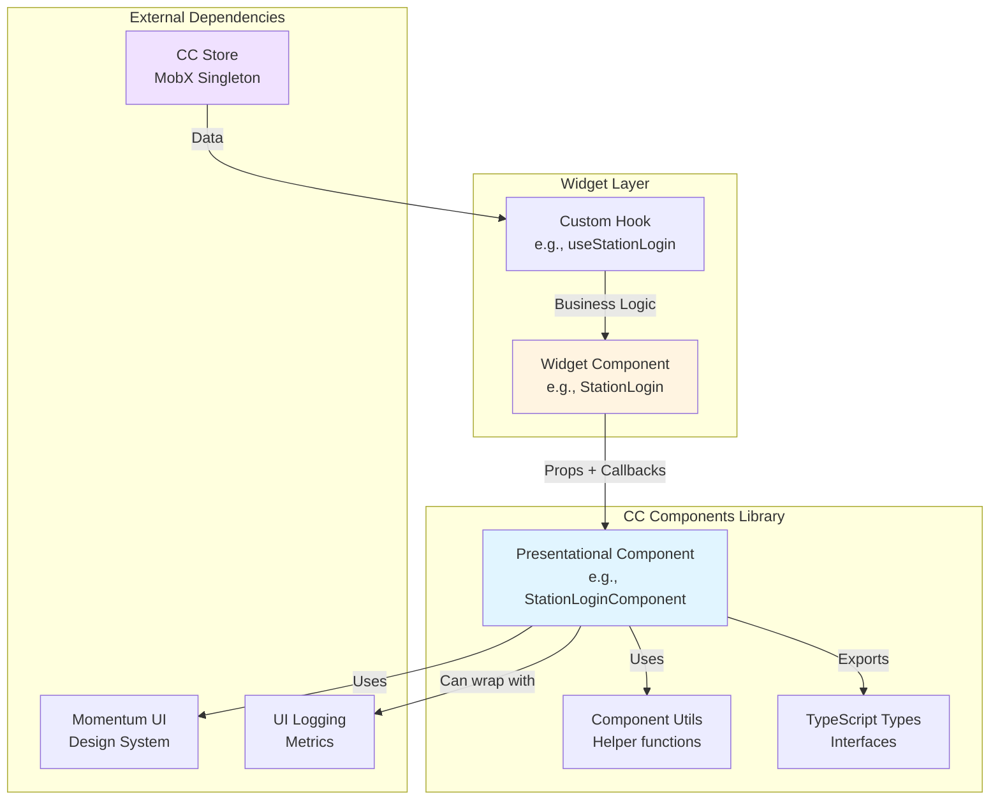
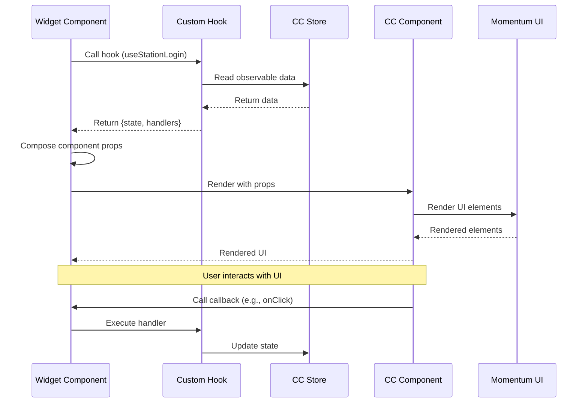

# CC Components Library - Architecture

## Component Overview

The CC Components library is a presentation-layer package that provides reusable React components for contact center widgets. It follows a component library pattern where each component is a pure presentational component that receives all data and callbacks via props.

### Component Table

| Component | File | Props Interface | Styling | Tests | Dependencies |
|-----------|------|-----------------|---------|-------|--------------|
| **StationLoginComponent** | `src/components/StationLogin/station-login.tsx` | `StationLoginComponentProps` | SCSS | `tests/components/StationLogin/` | Momentum UI, ui-logging |
| **UserStateComponent** | `src/components/UserState/user-state.tsx` | `UserStateComponentsProps` | SCSS | `tests/components/UserState/` | Momentum UI, ui-logging |
| **CallControlComponent** | `src/components/task/CallControl/call-control.tsx` | Task-based props | SCSS | `tests/components/task/CallControl/` | Momentum UI |
| **CallControlCADComponent** | `src/components/task/CallControlCAD/call-control-cad.tsx` | Task-based props | SCSS | `tests/components/task/CallControlCAD/` | Momentum UI |
| **IncomingTaskComponent** | `src/components/task/IncomingTask/incoming-task.tsx` | Task-based props | N/A | `tests/components/task/IncomingTask/` | Momentum UI |
| **TaskListComponent** | `src/components/task/TaskList/task-list.tsx` | Task-based props | SCSS | `tests/components/task/TaskList/` | Momentum UI |
| **OutdialCallComponent** | `src/components/task/OutdialCall/outdial-call.tsx` | OutdialCall props | SCSS | `tests/components/task/OutdialCall/` | Momentum UI |

### Shared Utilities

| Utility | File | Purpose |
|---------|------|---------|
| Station Login Utils | `src/components/StationLogin/station-login.utils.tsx` | Login form handlers, validation |
| User State Utils | `src/components/UserState/user-state.utils.ts` | State transformation logic |
| Call Control Utils | `src/components/task/CallControl/call-control.utils.ts` | Call control button logic |
| Task Utils | `src/components/task/Task/task.utils.ts` | Task data transformation |
| Task List Utils | `src/components/task/TaskList/task-list.utils.ts` | List rendering logic |

---

## File Structure

```
cc-components/
├── src/
│   ├── components/
│   │   ├── StationLogin/
│   │   │   ├── constants.ts              # Login constants
│   │   │   ├── station-login.style.scss  # Component styles
│   │   │   ├── station-login.tsx         # Main component
│   │   │   ├── station-login.types.ts    # TypeScript interfaces
│   │   │   └── station-login.utils.tsx   # Helper functions
│   │   ├── UserState/
│   │   │   ├── constant.ts
│   │   │   ├── user-state.scss
│   │   │   ├── user-state.tsx
│   │   │   ├── user-state.types.ts
│   │   │   └── user-state.utils.ts
│   │   └── task/
│   │       ├── constants.ts              # Task constants
│   │       ├── task.types.ts             # Shared task types
│   │       ├── AutoWrapupTimer/
│   │       ├── CallControl/
│   │       │   ├── call-control.styles.scss
│   │       │   ├── call-control.tsx
│   │       │   ├── call-control.utils.ts
│   │       │   └── CallControlCustom/    # Consult/Transfer UI
│   │       ├── CallControlCAD/
│   │       ├── IncomingTask/
│   │       ├── OutdialCall/
│   │       ├── Task/
│   │       ├── TaskList/
│   │       └── TaskTimer/
│   ├── utils/                            # Shared utilities
│   ├── index.ts                          # Main exports
│   └── wc.ts                             # Web Component exports
├── tests/                                # Mirror src structure
│   └── components/                       # Component tests
├── dist/                                 # Build output
├── package.json
├── tsconfig.json
└── webpack.config.js
```

---

## Integration Architecture

The library follows a clear separation of concerns where components are pure presentational:



---

## Component Patterns

### 1. Presentational Component Pattern

All components in this library are **presentational** (also called "dumb" or "stateless" in older terminology):

```typescript
// Components receive all data via props
const StationLoginComponent: React.FC<StationLoginComponentProps> = (props) => {
  const {
    teams,
    loginOptions,
    deviceType,
    login,  // Callback from parent
    // ... all data from props
  } = props;

  // No direct store access
  // No business logic
  // Only UI rendering and event handling

  return <div>...</div>;
};
```

**Benefits:**
- Easy to test (no store dependencies)
- Reusable across different contexts
- Clear data flow
- Can be used in Storybook/isolated environments

### 2. Momentum UI Integration

All components use Momentum UI React components:

```typescript
import { Button, Icon, Select, Option, Input } from '@momentum-design/components';

// Components compose Momentum UI primitives
function LoginButton({ onClick, disabled }) {
  return (
    <Button 
      variant="primary"
      disabled={disabled}
      onClick={onClick}
    >
      Login
    </Button>
  );
}
```

### 3. Utility Function Pattern

Complex logic is extracted to utility files:

```typescript
// station-login.utils.tsx
export const handleLoginOptionChanged = (
  value: string,
  setDeviceType: Function,
  setDialNumberValue: Function
) => {
  setDeviceType(value);
  if (value === 'BROWSER') {
    setDialNumberValue('');
  }
};

// Used in component
handleLoginOptionChanged(newValue, setDeviceType, setDialNumberValue);
```

### 4. Type Export Pattern

```typescript
// Component exports its types for consumers
export type StationLoginComponentProps = {
  teams: string[];
  loginOptions: string[];
  deviceType: string;
  login: () => void;
  // ... more props
};

// Consumers can import and use
import type { StationLoginComponentProps } from '@webex/cc-components';
```

### 5. Metrics HOC Integration

Components can be wrapped with metrics:

```typescript
import { withMetrics } from '@webex/cc-ui-logging';

// Wrap component
const StationLoginWithMetrics = withMetrics(
  StationLoginComponent,
  'StationLoginComponent'
);

// Metrics automatically track:
// - WIDGET_MOUNTED
// - WIDGET_UNMOUNTED  
// - PROPS_UPDATED (if enabled)
```

---

## Usage Patterns

### Widget Integration

How widgets consume components from this library:



### Testing Pattern

Components are tested in isolation:

```typescript
import { render, fireEvent } from '@testing-library/react';
import { StationLoginComponent } from '@webex/cc-components';

test('calls login callback when button clicked', () => {
  const mockLogin = jest.fn();
  const props = {
    teams: ['Team A'],
    loginOptions: ['BROWSER'],
    deviceType: 'BROWSER',
    login: mockLogin,
    // ... other required props
  };

  const { getByRole } = render(<StationLoginComponent {...props} />);
  
  fireEvent.click(getByRole('button', { name: /login/i }));
  
  expect(mockLogin).toHaveBeenCalled();
});
```

### Styling Pattern

Components use SCSS with BEM naming:

```scss
// station-login.style.scss
.station-login {
  &__container {
    padding: 1rem;
  }

  &__dropdown {
    margin-bottom: 1rem;
  }

  &__button {
    width: 100%;
  }
}
```

---

## Web Component Export

The library provides a `wc.ts` export for Web Component wrappers:

```typescript
// wc.ts - Not fully implemented in this package
// Web Component wrapping happens in @webex/cc-widgets
import StationLoginComponent from './components/StationLogin/station-login';
import UserStateComponent from './components/UserState/user-state';

// Exports components in format ready for r2wc wrapping
export {
  StationLoginComponent,
  UserStateComponent,
  // ... other components
};
```

**Note:** The actual Web Component registration happens in `@webex/cc-widgets` package.

---

## Troubleshooting Guide

### Common Issues

#### 1. Component Not Rendering

**Symptoms:**
- Component shows blank
- No errors in console

**Possible Causes:**
- Missing required props
- Undefined prop values
- Momentum UI styles not loaded

**Solutions:**

```typescript
// Check all required props are provided
const requiredProps = {
  teams: ['Team A'],              // Must not be undefined
  loginOptions: ['BROWSER'],      // Must have at least one option
  deviceType: 'BROWSER',          // Must be valid option
  login: () => {},                // Must be a function
};

// Ensure Momentum UI CSS is imported
import '@momentum-ui/core/css/momentum-ui.min.css';
```

#### 2. TypeScript Errors with Props

**Symptoms:**
- Type errors when passing props
- Props not recognized

**Possible Causes:**
- Using wrong type import
- Missing peer dependencies

**Solutions:**

```typescript
// Import the correct type
import type { StationLoginComponentProps } from '@webex/cc-components';

// Use type assertion if needed
const props: StationLoginComponentProps = {
  // ... props
};

// Check peer dependencies installed
// @momentum-ui/react-collaboration
// react
// react-dom
```

#### 3. Styles Not Applied

**Symptoms:**
- Components render but look unstyled
- Buttons/inputs have no styling

**Possible Causes:**
- Momentum UI CSS not imported
- Webpack not configured to handle SCSS
- CSS modules conflict

**Solutions:**

```typescript
// In your app entry point
import '@momentum-ui/core/css/momentum-ui.min.css';

// If using SCSS, configure webpack
// webpack.config.js
module.exports = {
  module: {
    rules: [
      {
        test: /\.scss$/,
        use: ['style-loader', 'css-loader', 'sass-loader']
      }
    ]
  }
};
```

#### 4. Callback Not Firing

**Symptoms:**
- Button clicks don't trigger callbacks
- Events not propagating

**Possible Causes:**
- Callback not passed as prop
- Callback is undefined
- Event propagation stopped

**Solutions:**

```typescript
// Ensure callback is defined
const handleLogin = () => {
  console.log('Login clicked');
};

// Pass as prop
<StationLoginComponent 
  login={handleLogin}  // Not undefined
  // ... other props
/>

// Check event handler is not preventing default
// without calling callback
```

#### 5. Component Performance Issues

**Symptoms:**
- Slow rendering
- UI freezes on interaction

**Possible Causes:**
- Passing new object/array references on every render
- Not memoizing callbacks
- Large lists without virtualization

**Solutions:**

```typescript
import { useMemo, useCallback } from 'react';

// Memoize arrays/objects
const teams = useMemo(() => ['Team A', 'Team B'], []);

// Memoize callbacks
const handleLogin = useCallback(() => {
  // Login logic
}, [dependencies]);

// Use memoized values as props
<StationLoginComponent 
  teams={teams}
  login={handleLogin}
/>
```

#### 6. Test Failures

**Symptoms:**
- Components fail to render in tests
- Snapshots don't match

**Possible Causes:**
- Missing test dependencies
- Async state updates
- Missing providers/context

**Solutions:**

```typescript
import { render, waitFor } from '@testing-library/react';
import '@testing-library/jest-dom';

test('component renders', async () => {
  const { getByText } = render(
    <StationLoginComponent {...props} />
  );

  // Wait for async updates
  await waitFor(() => {
    expect(getByText('Login')).toBeInTheDocument();
  });
});
```

---

## Related Documentation

- [Agent Documentation](./agent.md) - Usage examples and exports
- [React Patterns](../../../../ai-docs/patterns/react-patterns.md) - Component patterns
- [Testing Patterns](../../../../ai-docs/patterns/testing-patterns.md) - Testing guidelines
- [UI Logging Documentation](../../ui-logging/ai-prompts/agent.md) - Metrics HOC usage
- [CC Widgets Documentation](../../cc-widgets/ai-prompts/agent.md) - Web Component integration

---

_Last Updated: 2025-11-26_

