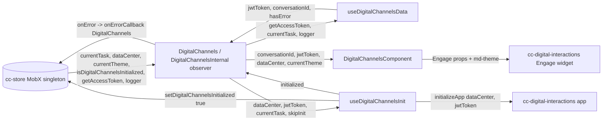
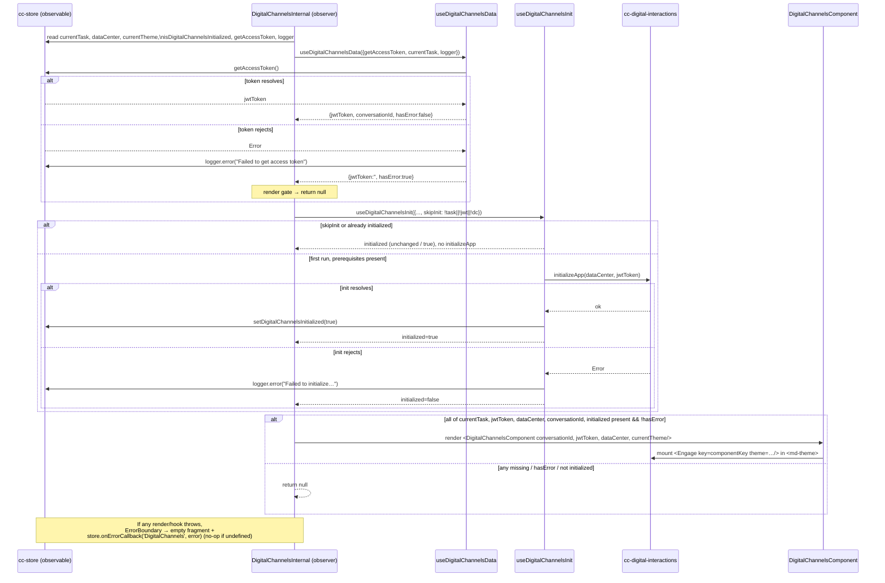
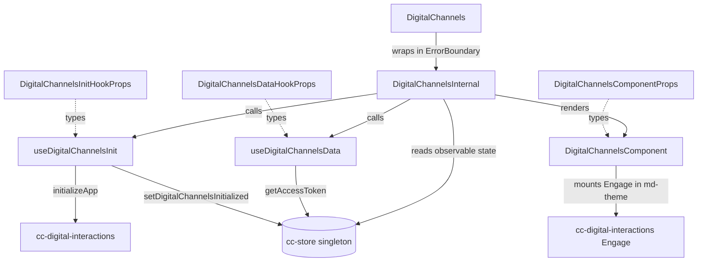

# cc-digital-channels — SPEC

> Start here → root [`AGENTS.md`](../../../../AGENTS.md) (agent entry) · router [`SPEC_INDEX.md`](../../../../ai-docs/SPEC_INDEX.md) · system [`ARCHITECTURE.md`](../../../../ai-docs/ARCHITECTURE.md). This is the module's canonical spec: orientation, requirements, design, flows, UI, and tests.
> Context-efficiency: link to canonical docs — don't duplicate them. Load specs on demand per `SPEC_INDEX.md`.

## Metadata
| Field | Value |
|---|---|
| Module id | `cc-digital-channels` |
| Source path(s) | `packages/contact-center/cc-digital-channels/src/` |
| Doc kind | Module spec |
| Coverage score | Pending coverage assessment |
| Generated from | `module-spec` @ SDLC template library `0.1.0-draft` |
| generated_by / approved_by / updated_at | generated_by `migration agent` / approved_by `pending` / updated_at `2026-07-01` |
| Validation status | not-run |

## Evidence Rules
Every generated requirement below must cite concrete source evidence using `file path`. Separate source
evidence, test evidence, examples, assumptions, and gaps so validators and future agents can distinguish
truth from context. Test evidence is preferred for WHY. Commit evidence is allowed only when the
repository policy says history is reliable, and must include the commit hash. If evidence is missing or
conflicting, ask a focused discovery question before finalizing the requirement; record unresolved answers
as approved unknowns only when the human explicitly defers or does not know.

## Source Material Register
| Source doc | Scope | Decision | Detail location or disposition |
|---|---|---|---|
| N/A (no pre-migration ai-docs) | none | none | This package had no `ai-docs/` directory before this spec; all content is derived directly from `src/` and `tests/` as source of truth. |
| `ai-docs/CONTRACTS.md` | API / contract | reconciled | `cc-widgets.DigitalChannels` contract row (line 24) → Public Surface. Note: CONTRACTS.md lists the root index as `packages/contact-center/cc-digital-channels/src/index.tsx`, but the real barrel is `src/index.ts` (there is no `src/index.tsx`); trust `src/index.ts`. |

## Overview
`cc-digital-channels` is the agent-facing Digital Channels widget for Webex Contact Center. It embeds the
third-party `cc-digital-interactions` "Engage" experience (email / chat / messaging conversation surface)
inside the agent desktop, scoped to the agent's currently active digital task. It contributes no
conversation UI of its own — it fetches the credentials and identifiers the Engage widget needs, initializes
the Engage app once per session, and mounts the Engage component with the correct theme.

The package follows the repo's one-directional widget architecture. The exported `DigitalChannels` widget
(`src/digital-channels/index.tsx`) is a plain FC that wraps `DigitalChannelsInternal` — an `observer()` — in
an `ErrorBoundary`. `DigitalChannelsInternal` reads reactive state from the MobX store singleton
(`@webex/cc-store`) and delegates all logic to two hooks in `src/helper.ts`: `useDigitalChannelsData` (fetch
the access token and derive the `conversationId` from the current task) and `useDigitalChannelsInit`
(initialize the Engage app exactly once per session, guarded by a store flag). Once every prerequisite is
present it renders the presentational `DigitalChannelsComponent` (`src/digital-channels/DigitalChannelsComponent.tsx`),
which wraps the `cc-digital-interactions` `Engage` default export in a Momentum `<md-theme>` element.

A maintainer should start at `src/digital-channels/index.tsx` (the widget, its store reads, and the render
gate), then read `src/helper.ts` (token fetch, conversationId derivation, and one-time initialization),
and finally `src/digital-channels/DigitalChannelsComponent.tsx` (how Engage is mounted and themed). Prop
and hook-input shapes live in `src/digital-channels/digital-channels.types.ts`; the custom JSX intrinsic
element `md-theme` is declared in `src/types/global.d.ts`.

## Purpose / Responsibility
Owns embedding the Digital Channels ("Engage") experience for the active digital task: fetch the JWT access
token, derive the conversation id from `store.currentTask`, initialize the `cc-digital-interactions` app once
per session, and mount the themed Engage widget. Does NOT own the SDK instance, the observable agent/task
state (`currentTask`, `dataCenter`, `currentTheme`, `isDigitalChannelsInitialized`), token issuance, or the
Engage conversation UI itself — those belong to `@webex/cc-store` and `cc-digital-interactions`.

## Stack
TypeScript 5.6.3, React `>=18.3.1` (functional components + hooks), MobX via `mobx-react-lite` `^4.1.0`
(`observer`), `react-error-boundary` (via the shared widget pattern). Third-party UI dependency
`cc-digital-interactions` `3.0.8-beta.2` (the Engage widget + `initializeApp`). Tests: Jest 29.7.0 + React
Testing Library 16 + `@testing-library/jest-dom` (jsdom), with Babel transform. Build: `tsc` (type
declarations) + Webpack 5 (`build:src`). Published as `@webex/cc-digital-channels` (`main: dist/index.js`,
`types: dist/types/index.d.ts`). No datastore or messaging of its own.

## Folder / Package Structure
```
cc-digital-channels/
├── src/
│   ├── index.ts                              # Package barrel — re-exports DigitalChannels (named + default)
│   ├── helper.ts                             # useDigitalChannelsData + useDigitalChannelsInit hooks
│   ├── digital-channels/
│   │   ├── index.tsx                         # DigitalChannels widget (ErrorBoundary) + DigitalChannelsInternal (observer)
│   │   ├── DigitalChannelsComponent.tsx      # Presentational — wraps Engage in <md-theme>
│   │   └── digital-channels.types.ts         # Hook-input + component prop interfaces
│   └── types/
│       └── global.d.ts                       # JSX intrinsic declaration for <md-theme>
└── tests/
    ├── helper.ts                             # Hook tests (init + data)
    └── digital-channels/
        ├── index.tsx                         # Widget integration + ErrorBoundary tests
        └── DigitalChannelsComponent.test.tsx # Presentational theming tests
```

## Key Files (source of truth)
| File | Holds |
|---|---|
| `src/index.ts` | Package export barrel; the public surface is what it re-exports (`DigitalChannels`, plus default export). |
| `src/digital-channels/index.tsx` | Public widget, store reads, the render gate (`if (!currentTask || !jwtToken || !dataCenter || hasError || !initialized || !conversationId) return null`), and the `ErrorBoundary` → `store.onErrorCallback('DigitalChannels', error)` wiring. |
| `src/helper.ts` | `useDigitalChannelsData` (token fetch + `conversationId` derivation) and `useDigitalChannelsInit` (one-time `initializeApp` guarded by `isDigitalChannelsInitialized`). |
| `src/digital-channels/DigitalChannelsComponent.tsx` | The exact props passed to the `cc-digital-interactions` `Engage` widget, the `<md-theme>` wrapper, the dark/light theme mapping, and the remount `componentKey`. |
| `src/digital-channels/digital-channels.types.ts` | Authoritative interfaces: `DigitalChannelsInitHookProps`, `DigitalChannelsDataHookProps`, `DigitalChannelsComponentProps`. |
| `src/types/global.d.ts` | The `md-theme` JSX intrinsic-element declaration (`theme`, `class`, `darktheme`, `lighttheme`). |
| `package.json` | Version, dependency floors (`cc-digital-interactions` `3.0.8-beta.2`), peer deps (`react`/`react-dom` `>=18.3.1`, `@momentum-ui/web-components` `^2.26.20`), export entry points. |

## Public Surface
`DigitalChannels` is a React component exported by `@webex/cc-digital-channels` and re-exported from
`@webex/cc-widgets`, which registers it as the custom element `widget-cc-digital-channels` via r2wc with an
empty prop map (`r2wc(DigitalChannels, {})` in `packages/contact-center/cc-widgets/src/wc.ts`). The widget
declares **no props** — it is entirely store-driven; all its inputs are read from the shared MobX store
(`currentTask`, `dataCenter`, `currentTheme`, `isDigitalChannelsInitialized`, `getAccessToken`, `logger`,
`onErrorCallback`, `setDigitalChannelsInitialized`).

| Contract ID | Type | Surface | Purpose | Compatibility / deprecation | Schema / detail link | Root index |
|---|---|---|---|---|---|---|
| `cc-widgets.DigitalChannels` | SDK / Web Component | React component `DigitalChannels`; mounted in `@webex/cc-widgets` as custom element `widget-cc-digital-channels` (no declared props; store-driven) | Embeds the Engage digital-channels experience for the active digital task | Stable semver; renaming/removing the export or the `widget-cc-digital-channels` tag is a major (breaking) change | `src/index.ts`, `packages/contact-center/cc-widgets/src/wc.ts`; SDK-backed store types in `@webex/contact-center` package types (`node_modules/@webex/contact-center/dist/types/index.d.ts`) | [`CONTRACTS.md`](../../../../ai-docs/CONTRACTS.md) |

Compatibility notes:
- The widget has no prop surface, so there is no prop-level compatibility contract; the compatibility surface
  is the export name and the custom-element tag. Adding a prop later would be additive (minor); removing the
  export or renaming the tag is breaking (major).
- The store fields this widget reads (`currentTask`, `dataCenter`, `currentTheme`,
  `isDigitalChannelsInitialized`, `getAccessToken`, `setDigitalChannelsInitialized`, `onErrorCallback`) are an
  implicit contract with `@webex/cc-store`; renaming or removing them upstream breaks this widget silently.

## Requires (dependencies)
- `@webex/cc-store` (`workspace:*`) — the MobX singleton (default export). Provides `currentTask` (`ITask`),
  `dataCenter`, `currentTheme`, `isDigitalChannelsInitialized`, `setDigitalChannelsInitialized(value)`,
  `getAccessToken(): Promise<string>`, `logger`, and `onErrorCallback`. Source: `src/digital-channels/index.tsx`;
  store fields at `packages/contact-center/store/src/store.ts:29,31,53,54` and
  `packages/contact-center/store/src/storeEventsWrapper.ts:988` (`getAccessToken`).
- `cc-digital-interactions` `3.0.8-beta.2` — third-party dependency providing `initializeApp(dataCenter, jwtToken)`
  (named, used in `src/helper.ts`) and the `Engage` widget (default export, used in `DigitalChannelsComponent.tsx`).
  Source: `package.json` dependencies.
- `mobx-react-lite` `^4.1.0` — `observer` HOC (`src/digital-channels/index.tsx`).
- `react-error-boundary` — `ErrorBoundary` used in `src/digital-channels/index.tsx` (provided transitively; the
  shared widget pattern). Source: import in `src/digital-channels/index.tsx`.
- Peer dependencies (host-provided): `react >=18.3.1`, `react-dom >=18.3.1`, `@momentum-ui/web-components`
  `^2.26.20` (imported for the `<md-theme>` custom element in `DigitalChannelsComponent.tsx`). Source:
  `package.json` peerDependencies.

## Requirements
| ID | WHAT | WHY | Source Evidence | Test / Example Evidence | Assumptions / Gaps | Confidence |
|---|---|---|---|---|---|---|
| `CC-DIGITAL-CHANNELS-R-001` | `useDigitalChannelsData` fetches the JWT via `getAccessToken()` into `jwtToken`; on rejection it logs `[DIGITAL_CHANNELS] ❌ Failed to get access token`, sets `tokenError`/`hasError` true, and does not throw. | The Engage widget cannot mount without a JWT; a token failure must degrade to a non-rendering, non-crashing state. | `src/helper.ts` (`useDigitalChannelsData.fetchToken`) | `tests/helper.ts` "should fetch access token and extract conversationId", "should handle token fetch error and set error flags", "should handle token fetch error gracefully when logger is undefined" | none | PRESENT |
| `CC-DIGITAL-CHANNELS-R-002` | `useDigitalChannelsData` derives `conversationId` from `currentTask.data.interaction.callAssociatedDetails.mediaResourceId`, returning `''` when the task, the details, or the id is absent. | Engage is scoped to a single conversation; a missing id must produce an empty value (which gates rendering) rather than a crash. | `src/helper.ts` (`conversationId` `useMemo`) | `tests/helper.ts` "should fetch access token and extract conversationId", "should return empty conversationId when currentTask is missing", "should return empty conversationId when mediaResourceId is missing" | Deep-optional chain into `interaction.callAssociatedDetails`; typed via an inline cast (see Pitfalls). | PRESENT |
| `CC-DIGITAL-CHANNELS-R-003` | `useDigitalChannelsInit` calls `initializeApp(dataCenter, jwtToken)` at most once per session: it runs only when `isDigitalChannelsInitialized` is false, then calls `setDigitalChannelsInitialized(true)` and sets local `initialized` true. A synchronous `useRef` in-flight guard (`initInFlightRef`) is set to `true` before the `await initializeApp(...)` call; any re-trigger of the effect while init is in-flight returns early without calling `initializeApp` again. When `isDigitalChannelsInitialized` becomes false (e.g. store logout via `cleanUpStore`), the hook resets `initInFlightRef` and local `initialized` so a new session can initialize again. | Re-initializing the Engage app per render/task would be wasteful and can break the embedded editor; init must be idempotent across the session. The `useRef` guard closes the TOCTOU race under React Strict Mode or a dependency-change re-trigger before state propagates (security finding WF-08). Reset on store session clear prevents a stale guard from blocking re-login. | `src/helper.ts` (`useDigitalChannelsInit.initialize`, `initInFlightRef`, reset `useEffect` on `isDigitalChannelsInitialized`) | `tests/helper.ts` "should initialize app when not already initialized", "should skip initialization when already initialized", "should call initializeApp exactly once when effect fires twice mid-flight (WF-08)", "should reinitialize after store session reset on logout" | Session flag lives in the store (`isDigitalChannelsInitialized`), not local state. The `useRef` guard is instance-scoped (per hook instance); the store flag is session-scoped. | PRESENT |
| `CC-DIGITAL-CHANNELS-R-004` | `useDigitalChannelsInit` skips all initialization work when `skipInit` is true, leaving `initialized` at its initial value and never calling `initializeApp`. | The widget passes `skipInit: !currentTask || !jwtToken || !dataCenter`; init must not fire until every prerequisite exists. | `src/helper.ts` (`useDigitalChannelsInit`, early `if (skipInit) return`); `src/digital-channels/index.tsx` (`skipInit` computation) | `tests/helper.ts` "should skip initialization when skipInit is true" | none | PRESENT |
| `CC-DIGITAL-CHANNELS-R-005` | On `initializeApp` rejection, `useDigitalChannelsInit` logs `[DIGITAL_CHANNELS_INIT] ❌ Failed to initialize…` with the error message (or "Unknown error" for a non-`Error` throw), resets `initInFlightRef` to `false`, and does not throw; `initialized` stays false so a later effect re-trigger (e.g. refreshed `jwtToken`) can retry. | An init failure must be observable in logs and must not crash the widget or set the initialized flag; the in-flight guard must not permanently block retry after a transient failure. | `src/helper.ts` (`initialize` `try/catch`, `initInFlightRef.current = false` in catch) | `tests/helper.ts` "should handle initialization error", "should log unknown error message when initialization throws non-Error", "should allow retry after initialization failure when jwtToken changes" | none | PRESENT |
| `CC-DIGITAL-CHANNELS-R-006` | `DigitalChannelsInternal` renders `null` unless ALL of `currentTask`, `jwtToken`, `dataCenter`, `conversationId`, and `initialized` are truthy and `hasError` is false; the early return runs only after all hooks are called. | Mounting Engage with incomplete data or after an error must be prevented, while React's rules-of-hooks (unconditional hook calls) must be preserved. | `src/digital-channels/index.tsx` (render gate + comment "Early return after all hooks are called") | `tests/digital-channels/index.tsx` "should not render" (dataCenter empty), "should not render" (currentTask null), "should re-render when store updates are received by the widget" | none | PRESENT |
| `CC-DIGITAL-CHANNELS-R-007` | When all prerequisites are met, `DigitalChannelsInternal` renders `DigitalChannelsComponent` with `conversationId`, `jwtToken`, `dataCenter`, and `currentTheme` from the store. | The presentational component must receive exactly the store-derived values so Engage mounts against the active conversation and theme. | `src/digital-channels/index.tsx` (`<DigitalChannelsComponent .../>`) | `tests/digital-channels/index.tsx` "should successfully load and initialize real Engage component without errors", "should have proper store integration" | none | PRESENT |
| `CC-DIGITAL-CHANNELS-R-008` | `DigitalChannelsComponent` renders the `Engage` widget inside `<md-theme id="app-theme" theme="momentumV2">`, setting `darktheme` when `currentTheme` uppercases to `DARK` (else `lighttheme`), and passes Engage `theme="dark"`/`"light"` plus fixed `interactionId=""`, `readonly={false}`, `isVisualRebrand={true}`. | Engage must be themed to match the desktop; the mapping is case-insensitive on `currentTheme` and defaults to light. | `src/digital-channels/DigitalChannelsComponent.tsx` (`isDarkTheme`, `<md-theme>`, `<Engage>` props) | `tests/digital-channels/DigitalChannelsComponent.test.tsx` (DARK / LIGHT / default / lowercase / mixed-case cases); `tests/digital-channels/index.tsx` "should render with dark theme when currentTheme is DARK in store" | none | PRESENT |
| `CC-DIGITAL-CHANNELS-R-009` | `DigitalChannelsComponent` computes a `componentKey` = `${conversationId}-${jwtToken.slice(-8)}-${dataCenter}` and passes it as `Engage`'s `key`, forcing a remount when any of those change. | Prevents the embedded Froala editor from improperly reusing/reinitializing when the conversation, token, or data center changes (documented rationale in the source comment). | `src/digital-channels/DigitalChannelsComponent.tsx` (`componentKey` `useMemo`, `key={componentKey}`) | None found (no test asserts the `key`/remount behavior) | Remount-on-key behavior is not directly asserted by a test. | WEAK |
| `CC-DIGITAL-CHANNELS-R-010` | The widget is wrapped in an `ErrorBoundary` whose fallback renders an empty fragment and whose `onError` routes to `store.onErrorCallback('DigitalChannels', error)`, guarded so an absent callback is a no-op. | A render/hook error in Engage or the widget must not blank-crash the host and must be reported under the component name; hosts without a callback must not crash. | `src/digital-channels/index.tsx` (`ErrorBoundary` `fallbackRender`/`onError`) | `tests/digital-channels/index.tsx` "should call onErrorCallback when child throws", "should handle error gracefully when onErrorCallback is undefined" | none | PRESENT |

## Design Overview
The widget is intentionally thin and store-driven. `DigitalChannels` (the export) exists only to provide the
`ErrorBoundary`; the real work is in `DigitalChannelsInternal`, an `observer()` that destructures the store
singleton and orchestrates two hooks. This keeps the component declarative and its re-render driven by MobX
observability on the store fields it reads.

`useDigitalChannelsData` owns the "what do we need to render" concern: it asynchronously fetches the JWT via
`getAccessToken()` (setting `tokenError` on failure) and synchronously derives `conversationId` from the
current task's `callAssociatedDetails.mediaResourceId`. It returns `jwtToken`, `conversationId`, `tokenError`,
and a `hasError` alias. `useDigitalChannelsInit` owns the "initialize the third-party app exactly once"
concern: it reads the store's `isDigitalChannelsInitialized` flag and only calls `initializeApp(dataCenter,
jwtToken)` on the first successful pass, flipping the store flag so subsequent mounts (a new task, a re-render)
skip re-initialization. Both hooks wrap their async work in `try/catch` and route failures through the store
logger; neither throws into render.

The ordering in `DigitalChannelsInternal` is deliberate: both hooks are called unconditionally (so React's
rules of hooks hold), `useDigitalChannelsInit` is fed a `skipInit` flag derived from data readiness, and only
*after* both hooks run does the component apply its render gate and return `null` when any prerequisite is
missing or an error occurred. When everything is ready it renders the presentational
`DigitalChannelsComponent`, which is the only piece that touches `cc-digital-interactions`' `Engage` widget —
wrapping it in a Momentum `<md-theme>` and using a composite `key` to force a clean remount when the
conversation/token/data-center identity changes.

## Data Flow
In-process React/MobX data flow. The only external transport is (a) the store's `getAccessToken()` async call
(the store owns the wire to the token service) and (b) `cc-digital-interactions`' `initializeApp`/`Engage`,
which own their own network to the Engage backend. This module owns no network of its own.



## Sequence Diagram(s)
Sequence coverage:

| Operation group | Diagram | Failure / recovery coverage |
|---|---|---|
| Mount → fetch token → init → render Engage | "Digital Channels mount and Engage render" | `alt` branches: token fetch reject (`hasError` → render null), init reject (logged, `initialized` stays false), and the data-not-ready gate returning null |
| Error-boundary capture | folded into the mount diagram's `ErrorBoundary` note + a dedicated `alt` | render/hook throw → empty fragment + `onErrorCallback`; absent callback = no-op |
| Theme mapping / remount | covered by Data Flow + Requirements R-008/R-009 (pure prop derivation, no distinct async sequence) | N/A — synchronous prop computation, no timeout/retry path |



## Class / Component Relationships

`DigitalChannels` (exported) is a plain FC that mounts an `ErrorBoundary` around `DigitalChannelsInternal`, an
`observer()` FC. `DigitalChannelsInternal` composes the two hooks' returns with store-derived values and
renders the presentational `DigitalChannelsComponent`, which is the sole consumer of the third-party
`cc-digital-interactions` `Engage` widget. The three interfaces in
`src/digital-channels/digital-channels.types.ts` type the hook inputs and the component props; the widget adds
no class of its own.

## Use Cases
- **UC-1 Agent opens a digital task:** Store sets `currentTask` (a digital interaction) and `dataCenter`; the
  widget fetches the JWT (`getAccessToken`), derives `conversationId` from the task, initializes the Engage app
  once (`initializeApp`), and renders the themed Engage widget for that conversation. Outcome: the agent sees
  the Engage conversation surface. Evidence: `src/digital-channels/index.tsx`, `src/helper.ts`,
  `tests/digital-channels/index.tsx` ("successfully load and initialize real Engage component").
  UI flow: nothing rendered → (data ready + init) → `<md-theme>` + Engage widget.
- **UC-2 No active task / incomplete data:** `currentTask` is null, `dataCenter` is empty, the token failed, or
  no `conversationId` — the widget renders `null` (empty DOM). Outcome: no Engage surface, no crash. Evidence:
  `src/digital-channels/index.tsx` render gate; `tests/digital-channels/index.tsx` ("should not render" for
  null task / empty dataCenter).
- **UC-3 Theme switch:** Store `currentTheme` toggles between `LIGHT`/`DARK` (case-insensitive); the widget
  re-renders and Engage is mounted with the corresponding `md-theme` attribute and Engage `theme` prop.
  Outcome: Engage matches the desktop theme. Evidence: `DigitalChannelsComponent.tsx`;
  `tests/digital-channels/DigitalChannelsComponent.test.tsx`, `tests/digital-channels/index.tsx` (dark-theme case).
- **UC-4 Runtime error in Engage/widget:** A render or hook error is caught by the `ErrorBoundary`, which
  renders an empty fragment and calls `store.onErrorCallback('DigitalChannels', error)`. Outcome: host stays
  alive and is notified. Evidence: `src/digital-channels/index.tsx`; `tests/digital-channels/index.tsx`
  (ErrorBoundary block).

## Error Handling & Failure Modes
| Condition | Signal (error/code/result) | Caller recovery |
|---|---|---|
| `getAccessToken()` rejects | `tokenError`/`hasError` set true; logged `[DIGITAL_CHANNELS] ❌ Failed to get access token`; widget renders `null` | None required by host; retry occurs on the next `getAccessToken`/`logger` change (effect deps). The widget silently shows nothing. |
| `conversationId` cannot be derived (no task / no `mediaResourceId`) | `conversationId = ''`; render gate returns `null` | Provide a task with `callAssociatedDetails.mediaResourceId`; expected empty state otherwise. |
| `initializeApp()` rejects | Logged `[DIGITAL_CHANNELS_INIT] ❌ Failed to initialize…` (message or "Unknown error"); `initialized` stays false; render gate returns `null` | Store flag is not set, so a later mount retries init. |
| Data not yet ready (`skipInit` true) | No `initializeApp`; `initialized` unchanged; render `null` | Wait for `currentTask` + `jwtToken` + `dataCenter`. |
| Render/hook throws | `ErrorBoundary` → empty fragment + `store.onErrorCallback('DigitalChannels', error)` | Host's error callback surfaces a notification; if `onErrorCallback` is undefined, it is a silent no-op. |

## Pitfalls
- **`conversationId` derivation uses an inline cast, bypassing `ITask` typing.** `currentTask.data.interaction`
  is cast to `{callAssociatedDetails?: {mediaResourceId?: string}}` in `src/helper.ts` because the SDK `ITask`
  type does not surface `mediaResourceId` directly. If the SDK reshapes `interaction`, TypeScript will NOT
  catch the break — verify against the live task shape.
- **Init is gated by a store-level flag, not local state.** `isDigitalChannelsInitialized` lives on the shared
  store singleton, so `initializeApp` runs at most once *per session across all mounts*, not once per widget
  instance. Do not add a second init path or reset the flag casually — re-init can break the embedded Froala
  editor (the reason the remount `key` exists).
- **The render gate must stay AFTER both hook calls.** The early `return null` is placed after
  `useDigitalChannelsData` and `useDigitalChannelsInit` on purpose (see the source comment). Moving the guard
  above a hook call violates the rules of hooks and will crash.
- **The Engage `key` is a deliberate remount trigger, not decorative.** `componentKey`
  (`conversationId`-`jwtToken.slice(-8)`-`dataCenter`) forces a full remount of `Engage` when identity changes,
  preventing improper Froala cleanup/reinit. Removing or weakening the key can reintroduce editor teardown bugs.
- **`useDigitalChannelsInit` effect deps omit `dataCenter` and `isDigitalChannelsInitialized`.** The effect is
  keyed on `[currentTask, skipInit, jwtToken]`. Because init reads `dataCenter` and the store flag from closure,
  changing only `dataCenter` (with the same task/jwt/skipInit) will not re-run the effect. In practice
  `dataCenter` changing usually coincides with a token/task change, but this is a latent staleness edge.
- **No mapped WC props.** `widget-cc-digital-channels` is registered with `r2wc(DigitalChannels, {})` — there is
  no attribute/property bridge. All inputs must be present on the shared store before the element renders; you
  cannot configure this widget via HTML attributes.

## Module Do's / Don'ts
- DO: read every input from the `@webex/cc-store` singleton inside `DigitalChannelsInternal`; keep the widget
  store-driven and prop-less.
- DO: keep all `cc-digital-interactions` usage confined to `DigitalChannelsComponent.tsx` (Engage) and
  `helper.ts` (`initializeApp`).
- DO: wrap hook async bodies in `try/catch` and log via the store `logger` with `{module, method}` metadata.
- DON'T: move the `return null` render gate above the hook calls (rules of hooks).
- DON'T: remove/weaken the `Engage` `key`, or reset `isDigitalChannelsInitialized`, without accounting for
  Froala re-init behavior.

## Export Stability
`src/index.ts` re-exports `DigitalChannels` as both a named and the default export. The widget declares no
props, so the semver-sensitive surface is (1) the export name `DigitalChannels`, (2) the custom-element tag
`widget-cc-digital-channels` (owned by `@webex/cc-widgets/src/wc.ts`), and (3) the implicit set of store fields
it consumes. Adding a prop later is additive (minor); renaming/removing the export or the tag is a major
(breaking) change. Type declarations ship from `dist/types/index.d.ts` (`package.json` `types`).

## Host Integration & Theming
Consumed via `@webex/cc-widgets`, which wraps `DigitalChannels` as the custom element
`widget-cc-digital-channels` (r2wc, empty prop map). The store must be initialized (`store.init(...)`) and must
have an active digital `currentTask`, a `dataCenter`, and a working `getAccessToken` before anything renders.
Theming: the presentational component wraps Engage in a Momentum `<md-theme id="app-theme" theme="momentumV2">`
element (from `@momentum-ui/web-components`, a peer dep imported in `DigitalChannelsComponent.tsx`) and maps
`store.currentTheme` (case-insensitive `DARK`/anything-else) to `darktheme`/`lighttheme` plus the Engage `theme`
prop. Error reporting is wired through `store.onErrorCallback`. Peer deps: `react`/`react-dom` `>=18.3.1`,
`@momentum-ui/web-components` `^2.26.20`.

## Test-Case Strategy (module)
Hook tests (`tests/helper.ts`) cover `useDigitalChannelsInit` (first-time init, already-initialized skip,
`skipInit` skip, init rejection with `Error` and non-`Error` throws) and `useDigitalChannelsData` (token +
`conversationId` happy path, missing task, missing `mediaResourceId`, token rejection with and without a
logger). Widget integration tests (`tests/digital-channels/index.tsx`) mock the store and
`cc-digital-interactions` and assert: full render with correct Engage attributes, dark-theme render from store,
store integration, re-render on store update (`currentTask` null → set), non-render on empty `dataCenter` /
null `currentTask`, and the `ErrorBoundary` path (callback called with `('DigitalChannels', Error)`, and
graceful handling when `onErrorCallback` is undefined). Presentational tests
(`tests/digital-channels/DigitalChannelsComponent.test.tsx`) cover theme mapping across `DARK`/`LIGHT`/default
and mixed-case values and the props passed to Engage. Each behavior has both positive and negative cases,
except the remount `key` (R-009), which has no dedicated assertion.

| Behavior / Requirement | Existing test evidence | Gap |
|---|---|---|
| `CC-DIGITAL-CHANNELS-R-001` (token fetch + failure) | `tests/helper.ts` token success + error (+ no-logger) cases | none |
| `CC-DIGITAL-CHANNELS-R-002` (conversationId derivation) | `tests/helper.ts` happy + missing-task + missing-mediaResourceId | none |
| `CC-DIGITAL-CHANNELS-R-003` (init once) | `tests/helper.ts` first-time + already-initialized + WF-08 mid-flight + logout re-init | none |
| `CC-DIGITAL-CHANNELS-R-004` (skipInit) | `tests/helper.ts` "should skip initialization when skipInit is true" | none |
| `CC-DIGITAL-CHANNELS-R-005` (init error) | `tests/helper.ts` init error + non-Error throw + retry after failure | none |
| `CC-DIGITAL-CHANNELS-R-006` (render gate) | `tests/digital-channels/index.tsx` null-task / empty-dataCenter / re-render | none |
| `CC-DIGITAL-CHANNELS-R-007` (renders component with store values) | `tests/digital-channels/index.tsx` full-render + store-integration | none |
| `CC-DIGITAL-CHANNELS-R-008` (theme mapping) | `DigitalChannelsComponent.test.tsx` (all theme cases); `index.tsx` dark-theme | none |
| `CC-DIGITAL-CHANNELS-R-009` (remount key) | None found | No test asserts `key`/remount on conversation/token/dataCenter change |
| `CC-DIGITAL-CHANNELS-R-010` (ErrorBoundary) | `tests/digital-channels/index.tsx` ErrorBoundary block (2 cases) | none |

## Traceability
- Repo architecture: [`ARCHITECTURE.md`](../../../../ai-docs/ARCHITECTURE.md) · Registry: [`SPEC_INDEX.md`](../../../../ai-docs/SPEC_INDEX.md)
- Contracts: [`CONTRACTS.md`](../../../../ai-docs/CONTRACTS.md) (`cc-widgets.DigitalChannels`)
- Coverage state & contracts baseline: `.sdd/manifest.json`
