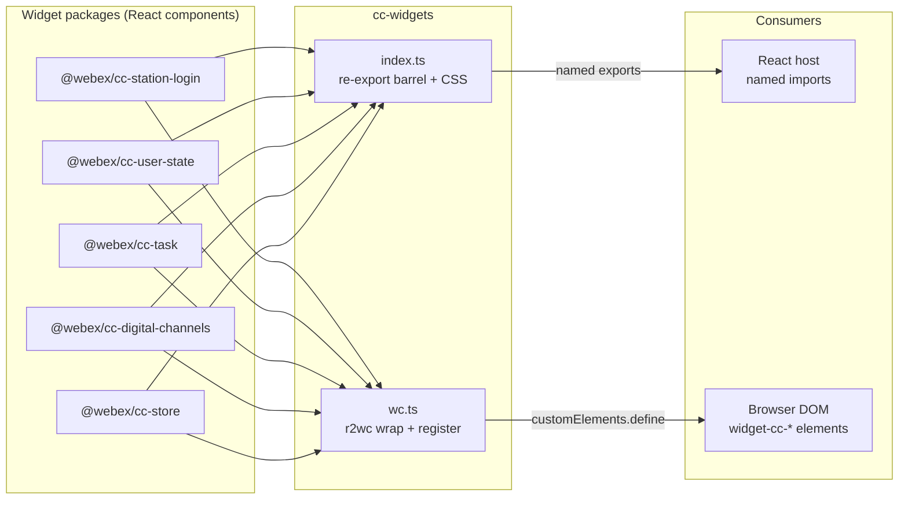
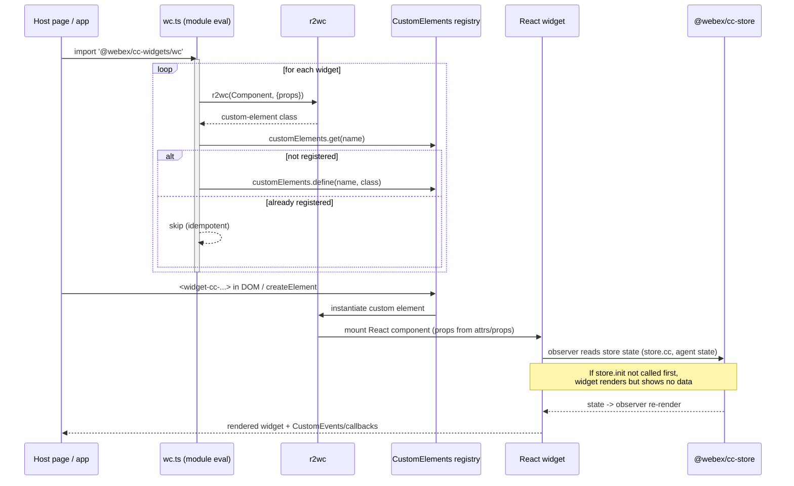
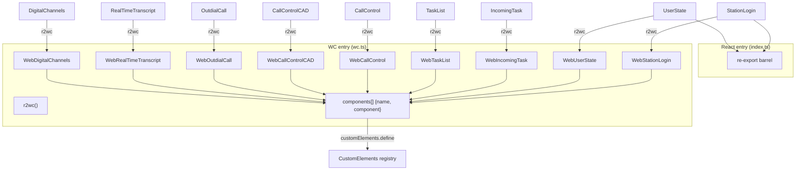

# cc-widgets — SPEC

> Start here → root [`AGENTS.md`](../../../../AGENTS.md) (agent entry) · router [`SPEC_INDEX.md`](../../../../ai-docs/SPEC_INDEX.md) · system [`ARCHITECTURE.md`](../../../../ai-docs/ARCHITECTURE.md). This is the module's canonical spec: orientation, requirements, design, flows, state, protocol, UI, data, and tests.
> Context-efficiency: link to canonical docs — don't duplicate them. Load specs on demand per `SPEC_INDEX.md`.

## Metadata
| Field | Value |
|---|---|
| Module id | `cc-widgets` |
| Source path(s) | `packages/contact-center/cc-widgets/src/` |
| Doc kind | Module spec |
| Coverage score | Pending coverage assessment |
| Generated from | `module-spec` @ SDLC template library `0.1.0-draft` |
| generated_by / approved_by / updated_at | generated_by `migration agent` / approved_by `pending` / updated_at `2026-06-29` |
| Validation status | not-run |

## Evidence Rules
Every generated requirement below must cite concrete source evidence using `file path`. Separate source
evidence, test evidence, examples, assumptions, and gaps so validators and future agents can distinguish
truth from context. Test evidence is preferred for WHY. Commit evidence is allowed only when the
repository policy says history is reliable, and must include the commit hash. If evidence is missing or
conflicting, ask a focused discovery question before finalizing the requirement; record unresolved answers
as approved unknowns only when the human explicitly defers or does not know.

## Source Material Register
| Source doc | Scope | Decision | Detail location or disposition |
|---|---|---|---|
| `ai-docs/_archive/pre-sdlc-migration/packages/contact-center/cc-widgets/ai-docs/AGENTS.md` | overview / API | migrated | Orientation → Overview/Purpose; React + Web Component export inventory → Public Surface; usage patterns → Use Cases; dual-bundle note → Export Stability / Host Integration. |
| `ai-docs/_archive/pre-sdlc-migration/packages/contact-center/cc-widgets/ai-docs/ARCHITECTURE.md` | architecture | reconciled | r2wc registration flow → Data Flow / Sequence Diagram(s); widget→tag mapping → Public Surface (corrected against `src/wc.ts`); troubleshooting → Pitfalls. Archived `OutdialCall` was missing `RealTimeTranscript`, `DigitalChannels`, `CallControlCAD` tag and `hasCampaignPreviewEnabled` prop — current code is source of truth. |

## Overview
`cc-widgets` is the aggregator and distribution surface for the Webex Contact Center widget suite. It
owns no widget UI or business logic of its own; instead it re-exports the React components produced by
the individual widget packages (`@webex/cc-station-login`, `@webex/cc-user-state`, `@webex/cc-task`,
`@webex/cc-digital-channels`) plus the shared MobX `store`, and it converts those same React components
into framework-agnostic custom elements via `@r2wc/react-to-web-component` (r2wc).

The package has exactly two source files. `src/index.ts` is the React entry point (`main` /
`dist/index.js`): a re-export barrel that also imports Momentum UI base CSS so React consumers get
widget styling. `src/wc.ts` is the Web Component entry point (the `./wc` export / `dist/wc.js`): it wraps
each React widget with r2wc, declares the prop-type map per widget, and registers every wrapper as a
custom element (`widget-cc-*`) at module-load time.

A maintainer should start at `src/index.ts` to change the React/store public surface and at `src/wc.ts`
to add a widget, change a custom-element tag, or change how a prop crosses the Web Component boundary.
Because this package is pure aggregation, behavior changes almost always belong upstream in the widget
packages; changes here are about what is exported, under what name, and with what prop typing.

## Purpose / Responsibility
Owns the public distribution surface for the contact center widget suite: re-exports React widgets + the
shared `store`, and registers r2wc-wrapped custom elements. Does NOT own widget UI, business logic, store
state, or SDK access — those live upstream in the widget packages and `@webex/cc-store`.

## Stack
TypeScript 5.6.3, React 18 (peer `>=18.3.1`), `@r2wc/react-to-web-component` 2.0.3. Test stack: Jest
29.7.0 + jsdom + React Testing Library (configured in `package.json`, but no tests currently exist).
Build: `tsc` for type declarations and webpack 5 for the two bundles (`dist/index.js`, `dist/wc.js`).
No datastore or messaging.

## Folder / Package Structure
```
packages/contact-center/cc-widgets/src/
├── index.ts   # React entry — re-export barrel for widgets + store; imports Momentum UI CSS
└── wc.ts      # Web Component entry — r2wc wrappers + per-widget prop map + customElements registration
```

## Key Files (source of truth)
| File | Holds |
|---|---|
| `packages/contact-center/cc-widgets/src/index.ts` | Authoritative list of React exports and the Momentum CSS import. |
| `packages/contact-center/cc-widgets/src/wc.ts` | Authoritative custom-element tag names, the r2wc prop-type map per widget, and the registration loop. |
| `packages/contact-center/cc-widgets/package.json` | Export entry points (`.` → `dist/index.js`, `./wc` → `dist/wc.js`), version, dependency floors, and peer-dependency versions. |

## Public Surface
Two consumption modes share one package: React named imports from `@webex/cc-widgets`, and custom
elements registered by importing `@webex/cc-widgets/wc`. Widget prop/event contracts are owned by the
upstream widget packages; this module only re-exports them and maps a subset across the Web Component
boundary (see `src/wc.ts`).

| Contract ID | Type | Surface | Purpose | Compatibility / deprecation | Schema / detail link | Root index |
|---|---|---|---|---|---|---|
| `cc-widgets.StationLogin` | SDK | React export `StationLogin`; tag `widget-cc-station-login` (props `onLogin`, `onLogout`) | Agent station login UI | stable; removing/renaming export or tag = major | `src/index.ts`, `src/wc.ts` | [`CONTRACTS.md`](../../../../ai-docs/CONTRACTS.md) |
| `cc-widgets.UserState` | SDK | React export `UserState`; tag `widget-cc-user-state` (prop `onStateChange`) | Agent state management UI | stable; export/tag change = major | `src/index.ts`, `src/wc.ts` | [`CONTRACTS.md`](../../../../ai-docs/CONTRACTS.md) |
| `cc-widgets.IncomingTask` | SDK | React export `IncomingTask`; tag `widget-cc-incoming-task` (props `incomingTask:json`, `onAccepted`, `onRejected`) | Incoming task notification UI | stable; export/tag change = major | `src/index.ts`, `src/wc.ts` | [`CONTRACTS.md`](../../../../ai-docs/CONTRACTS.md) |
| `cc-widgets.CallControl` | SDK | React export `CallControl`; tag `widget-cc-call-control` (props `onHoldResume`, `onEnd`, `onWrapUp`, `onRecordingToggle`) | Active-call control buttons | stable; export/tag change = major | `src/index.ts`, `src/wc.ts` | [`CONTRACTS.md`](../../../../ai-docs/CONTRACTS.md) |
| `cc-widgets.CallControlCAD` | SDK | React export `CallControlCAD`; tag `widget-cc-call-control-cad` (props `onHoldResume`, `onEnd`, `onWrapUp`, `onRecordingToggle`) | CAD-enabled call control | stable; export/tag change = major | `src/index.ts`, `src/wc.ts` | [`CONTRACTS.md`](../../../../ai-docs/CONTRACTS.md) |
| `cc-widgets.TaskList` | SDK | React export `TaskList`; tag `widget-cc-task-list` (props `onTaskAccepted`, `onTaskDeclined`, `onTaskSelected`, `hasCampaignPreviewEnabled:boolean`) | Active tasks list UI | stable; export/tag change = major | `src/index.ts`, `src/wc.ts` | [`CONTRACTS.md`](../../../../ai-docs/CONTRACTS.md) |
| `cc-widgets.OutdialCall` | SDK | React export `OutdialCall`; tag `widget-cc-outdial-call` (no mapped props; store-driven) | Outbound dialing UI | stable; export/tag change = major | `src/index.ts`, `src/wc.ts` | [`CONTRACTS.md`](../../../../ai-docs/CONTRACTS.md) |
| `cc-widgets.RealTimeTranscript` | SDK | React export `RealTimeTranscript`; tag `widget-cc-realtime-transcript` (props `liveTranscriptEntries:json`, `className:string`) | Live transcript UI | stable; export/tag change = major | `src/index.ts`, `src/wc.ts` | [`CONTRACTS.md`](../../../../ai-docs/CONTRACTS.md) |
| `cc-widgets.DigitalChannels` | SDK | React export `DigitalChannels`; tag `widget-cc-digital-channels` (no mapped props; store-driven) | Digital channels UI | stable; export/tag change = major | `src/index.ts`, `src/wc.ts` | [`CONTRACTS.md`](../../../../ai-docs/CONTRACTS.md) |
| `cc-widgets.store` | SDK | React export `store`; also re-exported from `src/wc.ts` | Shared MobX singleton (`@webex/cc-store`) callers init before mounting widgets | stable; the single shared store instance | `src/index.ts`, `src/wc.ts` | [`CONTRACTS.md`](../../../../ai-docs/CONTRACTS.md) |

Compatibility notes:
- Adding a new React export or a new `widget-cc-*` tag is additive (minor). Renaming/removing an export or
  tag, or renaming a mapped prop, is breaking (major).
- Web Component tags are registered guarded by `customElements.get(name)` — importing `./wc` twice is
  safe and does not throw a redefinition error (`src/wc.ts`).

## Requires (dependencies)
- Internal widget packages (workspace `*`): `@webex/cc-station-login`, `@webex/cc-user-state`,
  `@webex/cc-task` (provides `IncomingTask`, `TaskList`, `CallControl`, `CallControlCAD`, `OutdialCall`,
  `RealTimeTranscript`), `@webex/cc-digital-channels`. Source: `package.json` dependencies, `src/index.ts`,
  `src/wc.ts`.
- `@webex/cc-store` (workspace `*`) — the shared MobX singleton re-exported to consumers.
- `@r2wc/react-to-web-component` `2.0.3` — React→custom-element conversion (`src/wc.ts`).
- Peer dependencies (host-provided): `react >=18.3.1`, `react-dom >=18.3.1`,
  `@momentum-ui/react-collaboration >=26.197.0`, `@momentum-ui/web-components ^2.26.20`
  (`package.json`). React/ReactDOM are peers so the host provides a single React instance.
- `@momentum-ui/core/css/momentum-ui.min.css` — base CSS imported in `src/index.ts` for React consumers.

## Requirements
| ID | WHAT | WHY | Source Evidence | Test / Example Evidence | Assumptions / Gaps | Confidence |
|---|---|---|---|---|---|---|
| `cc-widgets-R-001` | Re-export the React widgets `StationLogin`, `UserState`, `IncomingTask`, `CallControl`, `CallControlCAD`, `TaskList`, `OutdialCall`, `RealTimeTranscript`, `DigitalChannels`, and `store` from the package root. | Single-package install: consumers import the whole suite + store from `@webex/cc-widgets` without tracking each widget package. | `packages/contact-center/cc-widgets/src/index.ts` | None found | No unit test exists (`tests/` absent; `passWithNoTests` set). | WEAK |
| `cc-widgets-R-002` | Register each widget as a custom element under a `widget-cc-*` tag (`widget-cc-user-state`, `widget-cc-station-login`, `widget-cc-incoming-task`, `widget-cc-task-list`, `widget-cc-call-control`, `widget-cc-outdial-call`, `widget-cc-call-control-cad`, `widget-cc-realtime-transcript`, `widget-cc-digital-channels`) when `./wc` is loaded. | Framework-agnostic embedding: HTML/Angular/Vue/vanilla hosts use the suite without React. | `packages/contact-center/cc-widgets/src/wc.ts` | None found | No test verifies registration. | WEAK |
| `cc-widgets-R-003` | Guard each `customElements.define` with `customElements.get(name)` so re-importing the WC bundle does not throw a duplicate-definition error. | Importing the bundle more than once (multiple micro-frontends/scripts) must be idempotent. | `packages/contact-center/cc-widgets/src/wc.ts` | None found | No regression test for double-import. | WEAK |
| `cc-widgets-R-004` | Map complex/callback props across the WC boundary with explicit r2wc prop types: `function` callbacks, `json` for object props (`incomingTask`, `liveTranscriptEntries`), `boolean` (`hasCampaignPreviewEnabled`), and `string` (`className`). | HTML attributes are strings only; functions and objects must be set as element properties with the right r2wc coercion or the widget won't receive them. | `packages/contact-center/cc-widgets/src/wc.ts` | None found | Prop maps are the WC public contract; no test asserts the type map. | WEAK |
| `cc-widgets-R-005` | Import Momentum UI base CSS in the React entry so React consumers get widget styling without a separate import. | Avoids unstyled widgets in React hosts (a documented prior support issue). | `packages/contact-center/cc-widgets/src/index.ts` | None found | CSS side-effect import is untested. | WEAK |
| `cc-widgets-R-006` | Treat React/ReactDOM as peer dependencies (`>=18.3.1`) rather than bundled runtime deps for the React export. | A single host React instance prevents "Invalid hook call" / duplicate-React failures. | `packages/contact-center/cc-widgets/package.json` | None found | Peer-dep enforcement is by package manager, not tested here. | WEAK |

## Design Overview
The module is a pure composition/distribution layer with two entry points and no internal state. The React
path (`index.ts`) is a tree-shakeable re-export barrel: the host bundler pulls actual widget code from the
workspace packages, so the React bundle is small and uses the host's React instance. The only side effect
is the Momentum CSS import.

The Web Component path (`wc.ts`) is self-contained. Each React widget is passed to `r2wc(Component, {props})`
to produce a custom-element class. The `props` map tells r2wc how to bridge each prop: `function` props are
assigned as element properties (callbacks/events), `json` props are parsed from attribute/property values
into objects, and `string`/`boolean` props coerce primitives. Widgets that read everything from the shared
store (`OutdialCall`, `DigitalChannels`) are wrapped with an empty prop map. A single `components` array
pairs each tag name with its wrapper, and a `forEach` registers them all, guarding with
`customElements.get` so registration is idempotent across repeated imports. Registration runs as an
import-time side effect — loading the module is what registers the elements.

This structure keeps one direction of dependency (widgets → cc-widgets) and concentrates the entire
public naming surface (export names, tag names, prop typing) in two small files, so changes are easy to
review and the rest of the suite stays decoupled from distribution concerns.

## Data Flow
Transport is in-process JavaScript module evaluation plus the browser CustomElements registry. There is no
network or messaging in this module — all SDK/state access happens downstream in the widgets via the shared
store.



## Sequence Diagram(s)
Sequence coverage:

| Operation group | Diagram | Failure / recovery coverage |
|---|---|---|
| Web Component registration + mount (`./wc` import → r2wc → custom element → React widget → store) | `Host registers custom element and r2wc mounts the React widget` | `alt` branch: tag already registered → registration is skipped (idempotent); store-not-initialized branch noted. |
| React re-export consumption | covered by Data Flow (trivial pass-through; no distinct sequence) | N/A — direct import, no runtime steps owned by this module. |



## Class / Component Relationships


The React widget components (imported from the widget packages) are the only "classes" of substance;
`cc-widgets` adds no class of its own beyond the r2wc-generated wrapper classes (`Web*`). Each wrapper is
a `HTMLElement` subclass produced by `r2wc`. The `components` array is the registry manifest. `index.ts`
relates to the same widget components purely by re-export.

## Use Cases
- **UC-1 React host consumes the suite:** A React app imports `{ StationLogin, UserState, TaskList, store }`
  from `@webex/cc-widgets`, calls `store.init({...})`, then renders the widgets as JSX. Outcome: widgets
  render against the shared store with the host's React instance. Evidence: `src/index.ts`; archived
  example in `.../cc-widgets/ai-docs/AGENTS.md`. No test.
- **UC-2 Framework-agnostic host embeds Web Components:** An HTML/Angular/Vue/vanilla page loads the `./wc`
  bundle, initializes `store`, and places `<widget-cc-station-login>` etc. in the DOM, assigning callbacks
  as element properties (e.g. `el.onLogin = fn`). Outcome: r2wc mounts the React widget inside the custom
  element. Evidence: `src/wc.ts`; archived example in `.../cc-widgets/ai-docs/AGENTS.md`. No test.
- **UC-3 Add a new widget to the suite:** A maintainer adds the React export in `index.ts`, wraps the
  component with `r2wc` and a prop map in `wc.ts`, and appends `{name, component}` to the `components`
  array. Outcome: the widget is available in both consumption modes. Evidence: `src/index.ts`, `src/wc.ts`.
  No test.

## Pitfalls
- **WC props are properties, not attributes.** `function` and `json` props (callbacks, `incomingTask`,
  `liveTranscriptEntries`) must be assigned as element properties (`el.onLogin = fn`,
  `el.incomingTask = obj`), not via `setAttribute`/string attributes — otherwise the widget never receives
  them. Source: prop maps in `src/wc.ts`.
- **Don't load both bundles.** Loading the React export and the `wc.js` bundle together can produce two
  React instances → "Invalid hook call" and broken context. Choose one mode per host.
- **Store must be initialized before widgets show data.** Widgets render but stay empty if `store.init`
  was not called first; the store is a shared singleton, not initialized by this package.
- **Registration is an import-time side effect.** Elements only exist after `./wc` is evaluated. Elements
  added to the DOM before the bundle loads stay inert until definition; use
  `customElements.whenDefined(tag)` when racing.
- **Tag names are public API.** They live only in the `components` array in `src/wc.ts`; renaming a tag is
  a breaking change with no compile-time signal in consumer HTML.
- **Archived docs drift.** The pre-migration ARCHITECTURE/AGENTS docs omitted `CallControlCAD`,
  `RealTimeTranscript`, and `DigitalChannels` tags and the `hasCampaignPreviewEnabled` prop. Trust
  `src/wc.ts` over those docs.

## Module Do's / Don'ts
- DO: keep `cc-widgets` aggregation-only — re-export and register; put behavior changes in the upstream
  widget packages.
- DO: when adding a widget, update both `src/index.ts` (React export) and `src/wc.ts` (r2wc wrapper +
  prop map + `components` entry), keeping the `widget-cc-{name}` tag convention.
- DON'T: import the SDK or mutate store state here — access flows through the re-exported `store`.
- DON'T: register a custom element without the `customElements.get` guard (breaks idempotent re-import).
- DON'T: bundle React into the React (`index.js`) path — React/ReactDOM are peers.

## Export Stability
Two semver-sensitive surfaces: the React named exports in `src/index.ts` and the `widget-cc-*` tag names
plus their r2wc prop maps in `src/wc.ts`. Adding an export, a tag, or an optional mapped prop is a minor
(additive) change. Renaming or removing any export or tag, or renaming a mapped prop, is a major
(breaking) change. The type-declaration surface is published at `dist/types/index.d.ts` (`.`) and
`dist/types/wc.d.ts` (`./wc`), wired via the `exports`/`types` fields in `package.json`. Peer-dependency
floors (`react >=18.3.1`, Momentum versions) are part of the compatibility contract; raising a floor is a
potentially breaking change for hosts.

## Host Integration & Theming
This module is the host-mount surface for the widget suite.
- **Custom-element tags:** `widget-cc-user-state`, `widget-cc-station-login`, `widget-cc-incoming-task`,
  `widget-cc-task-list`, `widget-cc-call-control`, `widget-cc-call-control-cad`, `widget-cc-outdial-call`,
  `widget-cc-realtime-transcript`, `widget-cc-digital-channels` (`src/wc.ts`).
- **Mount contract (WC mode):** load `@webex/cc-widgets/wc` (registers the elements at import time),
  initialize the shared `store`, then place the custom elements in the DOM and assign callbacks/objects as
  element properties.
- **Mount contract (React mode):** import widgets + `store` from `@webex/cc-widgets`, init `store`, render
  as JSX. The host provides React/ReactDOM (peers).
- **Theming:** React consumers get Momentum base styling via the `@momentum-ui/core` CSS imported in
  `src/index.ts`; hosts also need the Momentum peer packages (`@momentum-ui/react-collaboration`,
  `@momentum-ui/web-components`). Do not assume the host's framework version beyond the declared peer
  floors.

## Test-Case Strategy (module)
No tests exist for this package today (`tests/` is absent and `package.json` sets `passWithNoTests: true`).
Because the module is pure aggregation, the highest-value tests would assert the distribution contract
rather than widget behavior: (positive) importing `./wc` defines every expected `widget-cc-*` tag via
`customElements.get`; (negative) importing `./wc` twice does not throw and does not redefine an element
(idempotent guard). Secondary coverage: assert `index.ts` re-exports each expected symbol and `store`, and
that each r2wc wrapper is created with the documented prop-type map. Widget rendering/behavior is owned and
tested by the upstream widget packages, not here.

| Behavior / Requirement | Existing test evidence | Gap |
|---|---|---|
| `cc-widgets-R-001` (React re-exports present) | None found | No test asserts the export barrel surface. |
| `cc-widgets-R-002` (custom elements registered) | None found | No test asserts each `widget-cc-*` tag is defined after `./wc` import. |
| `cc-widgets-R-003` (idempotent registration) | None found | No test for double-import / `customElements.get` guard. |
| `cc-widgets-R-004` (r2wc prop-type map) | None found | No test asserts function/json/boolean/string prop mapping. |
| `cc-widgets-R-005` (Momentum CSS imported) | None found | No test for the CSS side-effect import. |
| `cc-widgets-R-006` (React/ReactDOM peers) | None found | Enforced by package manager only; no automated check here. |

## Traceability
- Repo architecture: [`ARCHITECTURE.md`](../../../../ai-docs/ARCHITECTURE.md) · Registry: [`SPEC_INDEX.md`](../../../../ai-docs/SPEC_INDEX.md) · Contracts: [`CONTRACTS.md`](../../../../ai-docs/CONTRACTS.md)
- Coverage state & contracts baseline: `.sdd/manifest.json`
