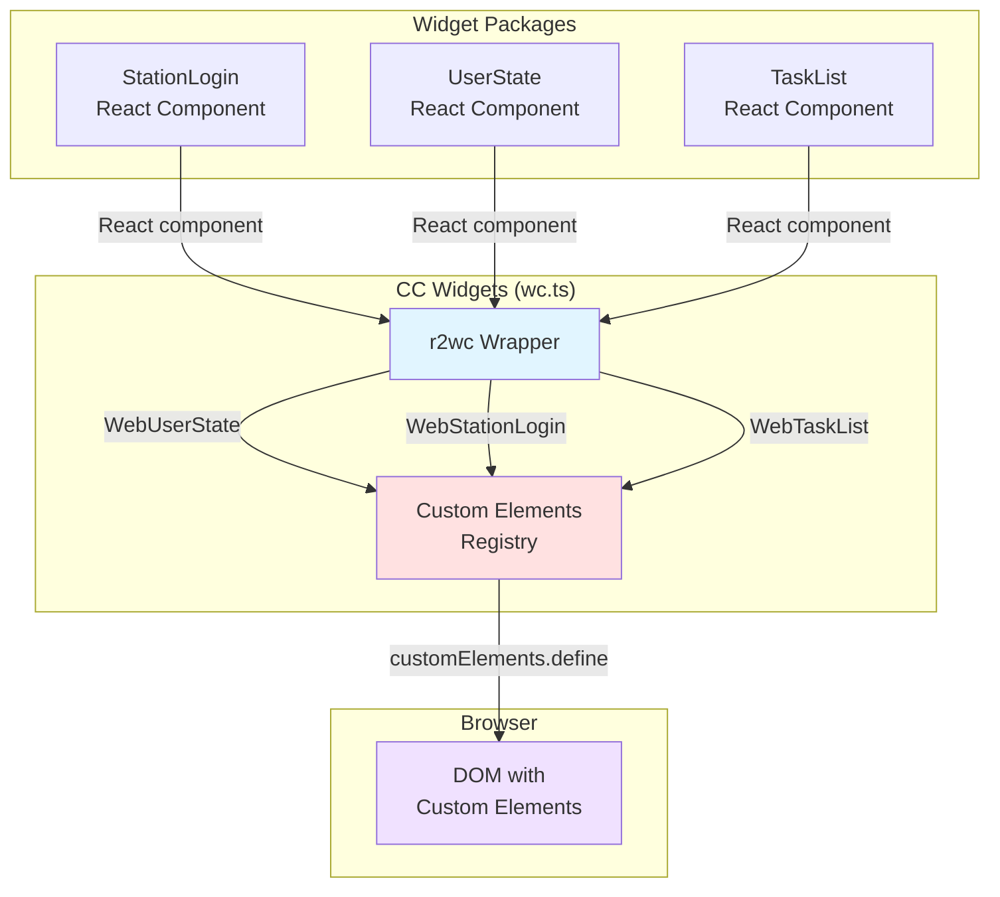
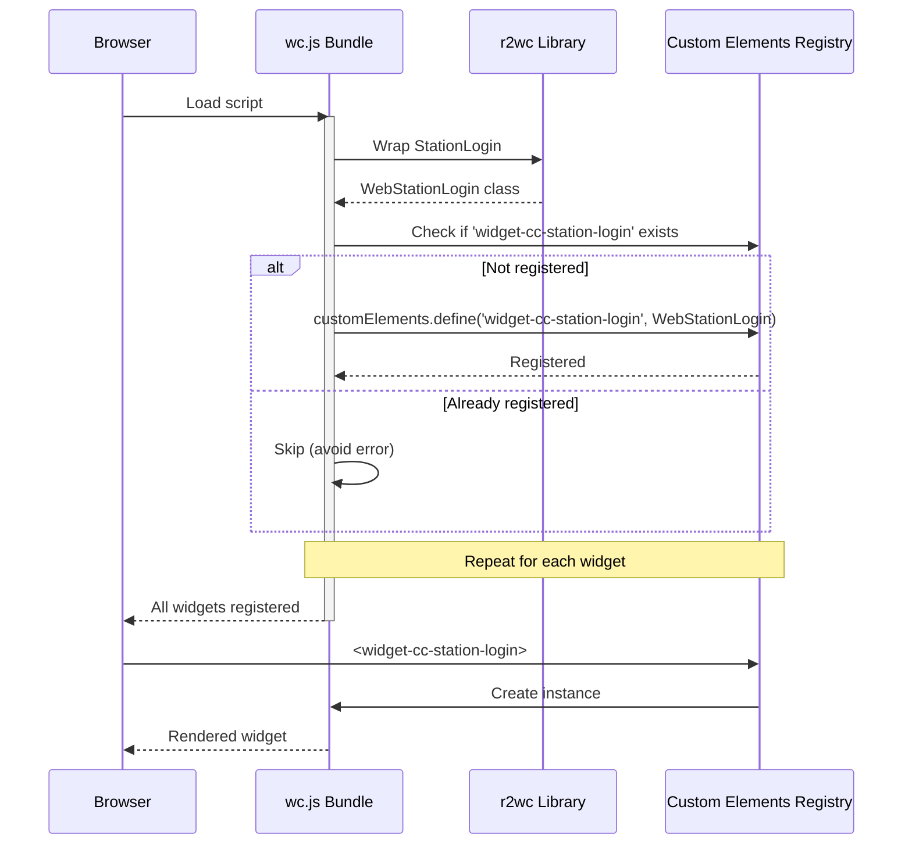

# CC Widgets - Architecture

## Component Overview

CC Widgets is an aggregator package that provides dual exports: React components for React applications and Web Components for framework-agnostic use. It uses r2wc (React to Web Component) to convert React widgets into custom elements.

### Package Structure

| Export | File | Purpose | Output | Consumer |
|--------|------|---------|--------|----------|
| **React Bundle** | `src/index.ts` | Re-exports React widgets | `dist/index.js` | React applications |
| **Web Components** | `src/wc.ts` | r2wc wrappers + registration | `dist/wc.js` | HTML/vanilla JS/other frameworks |

### Widget Mapping

| Widget Package | React Export | Web Component Tag | Props Mapped |
|---------------|--------------|-------------------|--------------|
| `@webex/cc-station-login` | `StationLogin` | `widget-cc-station-login` | `onLogin`, `onLogout` |
| `@webex/cc-user-state` | `UserState` | `widget-cc-user-state` | `onStateChange` |
| `@webex/cc-task` → IncomingTask | `IncomingTask` | `widget-cc-incoming-task` | `incomingTask`, `onAccepted`, `onRejected` |
| `@webex/cc-task` → TaskList | `TaskList` | `widget-cc-task-list` | `onTaskAccepted`, `onTaskDeclined`, `onTaskSelected` |
| `@webex/cc-task` → CallControl | `CallControl` | `widget-cc-call-control` | `onHoldResume`, `onEnd`, `onWrapUp`, `onRecordingToggle` |
| `@webex/cc-task` → CallControlCAD | `CallControlCAD` | `widget-cc-call-control-cad` | `onHoldResume`, `onEnd`, `onWrapUp`, `onRecordingToggle` |
| `@webex/cc-task` → OutdialCall | `OutdialCall` | `widget-cc-outdial-call` | None (uses store) |

### File Structure

```
cc-widgets/
├── src/
│   ├── index.ts               # React exports (re-export widgets + store)
│   └── wc.ts                  # Web Component wrappers + registration
├── dist/
│   ├── index.js               # React bundle (small)
│   ├── wc.js                  # Web Components bundle (large, self-contained)
│   └── types/
│       ├── index.d.ts         # Type definitions for React exports
│       └── wc.d.ts            # Type definitions for WC exports
├── package.json
├── tsconfig.json
└── webpack.config.js
```

---

## Data Flows

### React Export Flow

```mermaid
graph LR
    subgraph "Widget Packages"
        SL[@webex/cc-station-login]
        US[@webex/cc-user-state]
        Task[@webex/cc-task]
    end
    
    subgraph "CC Widgets (index.ts)"
        Index[Re-export widgets<br/>+ store]
    end
    
    subgraph "Consumer App"
        ReactApp[React Application]
    end
    
    SL -->|StationLogin| Index
    US -->|UserState| Index
    Task -->|Task widgets| Index
    Index -->|Named exports| ReactApp
    
    style Index fill:#e1f5ff
    style ReactApp fill:#fff4e1
```

### Web Component Flow



---

## Web Component Registration

### Registration Flow

The `wc.ts` file automatically registers all Web Components when loaded:



---

## r2wc Integration Pattern

### Props Mapping Configuration

```typescript
// wc.ts structure
import r2wc from '@r2wc/react-to-web-component';
import { StationLogin } from '@webex/cc-station-login';

const WebStationLogin = r2wc(StationLogin, {
  props: {
    onLogin: 'function',     // Function callbacks
    onLogout: 'function',    // Function callbacks
    profileMode: 'boolean',  // Boolean attributes (implied)
    teamId: 'string'         // String attributes (implied)
  },
});
```

### Type Mapping Rules

| React Prop Type | Web Component Type | HTML Attribute | JavaScript Property |
|----------------|-------------------|----------------|-------------------|
| `() => void` | `'function'` | N/A | Via property assignment |
| `string` | Implicit | `team-id="value"` | `.teamId = 'value'` |
| `boolean` | Implicit | `profile-mode` | `.profileMode = true` |
| `object` | `'json'` | N/A | `.incomingTask = {}` |

### Custom Element Definition

```typescript
const components = [
  { name: 'widget-cc-user-state', component: WebUserState },
  { name: 'widget-cc-station-login', component: WebStationLogin },
  { name: 'widget-cc-incoming-task', component: WebIncomingTask },
  { name: 'widget-cc-task-list', component: WebTaskList },
  { name: 'widget-cc-call-control', component: WebCallControl },
  { name: 'widget-cc-outdial-call', component: WebOutdialCall },
  { name: 'widget-cc-call-control-cad', component: WebCallControlCAD },
];

components.forEach(({ name, component }) => {
  if (!customElements.get(name)) {
    customElements.define(name, component);
  }
});
```

**Key Pattern:**
- Check if element already registered (avoids errors on re-import)
- Use consistent naming: `widget-cc-{widget-name}`
- Register all components in single loop

---

## Bundle Architecture

### React Bundle (index.js)

**Size**: ~10-20 KB (gzipped)

**Contains:**
- Re-export statements only
- No actual widget code (expects widgets installed separately)

**Usage:**
```typescript
import { StationLogin, UserState } from '@webex/cc-widgets';
// Host app's bundler will include actual widget code from node_modules
```

**Advantages:**
- Small bundle size
- Tree-shakeable
- Uses host app's React instance

### Web Components Bundle (wc.js)

**Size**: ~500 KB - 1 MB (gzipped)

**Contains:**
- All widget code bundled
- React + ReactDOM bundled
- r2wc library
- Store and dependencies
- Momentum UI styles (referenced, not bundled)

**Usage:**
```html
<script src="cc-widgets/dist/wc.js"></script>
<!-- Everything included, no build step needed -->
```

**Advantages:**
- Framework agnostic
- No build step required
- Single file deployment

**Trade-offs:**
- Larger bundle size
- Includes own React instance

---

## Troubleshooting Guide

### Common Issues

#### 1. Web Components Not Rendering

**Symptoms:**
- Custom elements show as undefined
- Elements appear as empty tags

**Possible Causes:**
- wc.js not loaded
- Script loaded after DOM parsing
- Custom elements not supported

**Solutions:**

```html
<!-- Ensure script is loaded -->
<script src="path/to/wc.js"></script>

<!-- Or use module import -->
<script type="module">
  import './path/to/wc.js';
</script>

<!-- Check if elements are defined -->
<script>
  console.log(customElements.get('widget-cc-station-login'));
  // Should return: class definition, not undefined
</script>
```

#### 2. Props Not Updating in Web Components

**Symptoms:**
- Changing attributes doesn't update widget
- Callbacks not firing

**Possible Causes:**
- Using attributes instead of properties for complex types
- Incorrect attribute names (camelCase vs kebab-case)

**Solutions:**

```javascript
// For functions and objects, use properties (not attributes)
const widget = document.querySelector('widget-cc-task-list');

// ❌ Wrong - functions can't be set via attributes
widget.setAttribute('onTaskSelected', myFunction);

// ✅ Correct - use property assignment
widget.onTaskSelected = myFunction;

// ❌ Wrong - objects can't be string attributes
widget.setAttribute('incoming-task', JSON.stringify(task));

// ✅ Correct - use property assignment
widget.incomingTask = task;
```

#### 3. Multiple React Instances Conflict

**Symptoms:**
- "Invalid hook call" errors
- React context not working
- Duplicate React warning

**Possible Causes:**
- Both React bundle and WC bundle loaded
- Multiple React versions in node_modules

**Solutions:**

```typescript
// Choose ONE approach:

// Option 1: React components only (use React bundle)
import { StationLogin } from '@webex/cc-widgets';
// Don't load wc.js

// Option 2: Web Components only (use WC bundle)
<script src="wc.js"></script>
// Don't import '@webex/cc-widgets' in React

// Check for duplicate React
npx npm-check-updates
yarn why react
```

#### 4. Store Not Initialized

**Symptoms:**
- Widgets render but show no data
- Console warnings about missing store.cc

**Possible Causes:**
- Store not configured before widget use
- SDK not initialized

**Solutions:**

```typescript
import { store } from '@webex/cc-widgets';
import { ContactCenter } from '@webex/contact-center';

// Initialize BEFORE rendering widgets
async function setup() {
  const cc = await ContactCenter.init({ token, region });
  store.setCC(cc);
  
  // Verify initialization
  console.log('Store initialized:', store.cc !== undefined);
  
  // Now render widgets
}
```

#### 5. Styles Not Loading

**Symptoms:**
- Components render but look unstyled
- Missing icons or layout

**Possible Causes:**
- Momentum UI CSS not imported
- Webpack not configured for CSS

**Solutions:**

```typescript
// In your app entry point
import '@momentum-ui/core/css/momentum-ui.min.css';

// Or via HTML
<link rel="stylesheet" href="https://cdn.jsdelivr.net/npm/@momentum-ui/core/css/momentum-ui.min.css">
```

#### 6. Web Component Events Not Firing

**Symptoms:**
- addEventListener doesn't work
- No callbacks triggered

**Possible Causes:**
- Wrong event name
- Event listeners added before element defined
- Using React prop names instead of event names

**Solutions:**

```javascript
// Wait for element to be defined
customElements.whenDefined('widget-cc-station-login').then(() => {
  const widget = document.querySelector('widget-cc-station-login');
  
  // ✅ Correct event name (lowercase)
  widget.addEventListener('login', () => {
    console.log('Login event fired');
  });
  
  // ❌ Wrong - this is the prop name, not event name
  // widget.addEventListener('onLogin', ...);
});
```

---

## Related Documentation

- [Agent Documentation](./agent.md) - Usage examples and exports
- [Web Component Patterns](../../../../ai-docs/patterns/web-component-patterns.md) - r2wc patterns
- [Station Login Widget](../../station-login/ai-prompts/agent.md) - Individual widget docs
- [User State Widget](../../user-state/ai-prompts/agent.md) - Individual widget docs
- [CC Components Library](../../cc-components/ai-prompts/agent.md) - Component library

---

_Last Updated: 2025-11-26_

