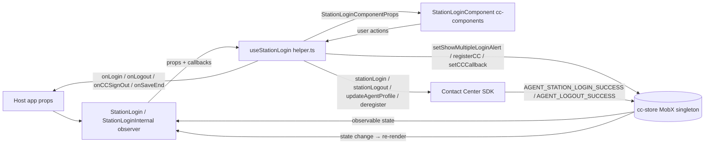
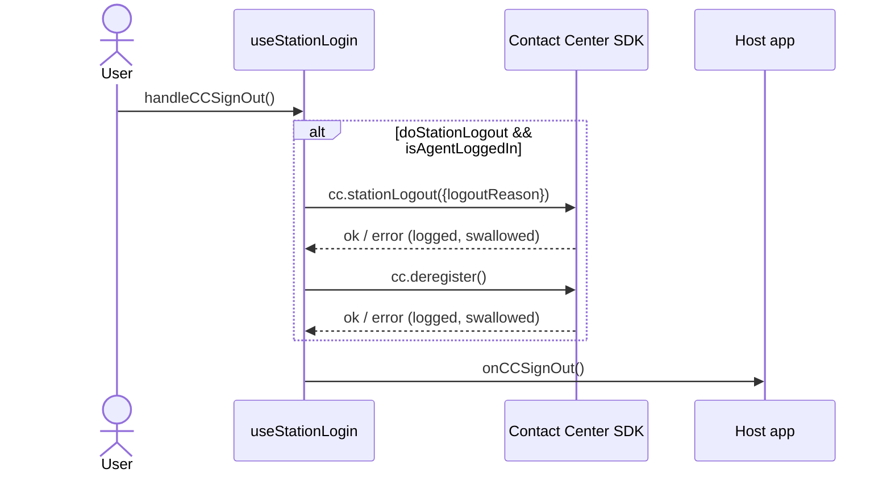
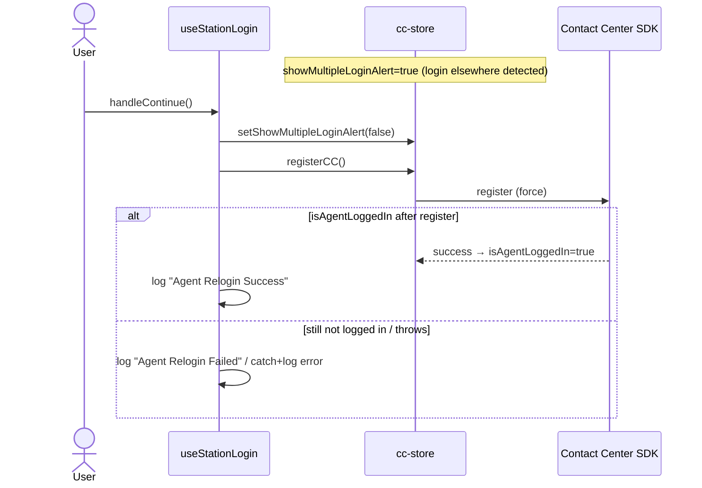
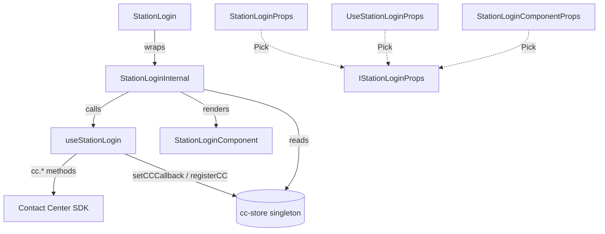

# station-login — SPEC

> Start here → root [`AGENTS.md`](../../../../AGENTS.md) (agent entry) · router [`SPEC_INDEX.md`](../../../../ai-docs/SPEC_INDEX.md) · system [`ARCHITECTURE.md`](../../../../ai-docs/ARCHITECTURE.md). This is the module's canonical spec: orientation, requirements, design, flows, UI, and tests.
> Context-efficiency: link to canonical docs — don't duplicate them. Load specs on demand per `SPEC_INDEX.md`.

## Metadata
| Field | Value |
|---|---|
| Module id | `station-login` |
| Source path(s) | `packages/contact-center/station-login/src/` |
| Doc kind | Module spec |
| Coverage score | Pending coverage assessment |
| Generated from | `module-spec` @ SDLC template library `0.1.0-draft` |
| generated_by / approved_by / updated_at | migration agent / [NEEDS HUMAN INPUT] / 2026-06-29 |
| Validation status | not-run |

## Evidence Rules
Every generated requirement below must cite concrete source evidence using `file path`. Separate source
evidence, test evidence, examples, assumptions, and gaps so validators and future agents can distinguish
truth from context. Test evidence is preferred for WHY. Commit evidence is allowed only when the
repository policy says history is reliable, and must include the commit hash. If evidence is missing or
conflicting, ask a focused discovery question before finalizing the requirement; record unresolved answers
as approved unknowns only when the human explicitly defers or does not know.

## Source Material Register
| Source doc | Scope | Decision | Detail location or disposition |
|---|---|---|---|
| `ai-docs/_archive/pre-sdlc-migration/packages/contact-center/station-login/ai-docs/AGENTS.md` | overview / API | migrated | Orientation → Overview/Purpose; props → Public Surface; usage examples → Use Cases; error callback → Error Handling |
| `ai-docs/_archive/pre-sdlc-migration/packages/contact-center/station-login/ai-docs/ARCHITECTURE.md` | architecture | reconciled | Layer table → Class/Component Relationships; data flow + sequences → Data Flow / Sequence Diagram(s); troubleshooting → Pitfalls. Old "renders blank screen" / silent-fail notes mapped to Error Handling; over-generalized `store.login()` arrow in the archived diagram corrected — the hook calls `cc.stationLogin()` directly, not `store.login()` |

## Overview
`station-login` is the agent station-login widget for Webex Contact Center. It lets an agent pick a team
and a device/login type (Desktop/`BROWSER` WebRTC, `EXTENSION`, or `AGENT_DN` dial number), log in to and
out of their station, sign out of Contact Center, and — in profile mode — update those login options
without a full re-login. It also surfaces the "already logged in elsewhere" multiple-login alert and a
Continue flow.

The package follows the repo's one-directional widget architecture: the exported `StationLogin` widget
(`src/station-login/index.tsx`) is an `observer()` component wrapped in an `ErrorBoundary`. It reads
reactive state from the MobX store singleton, delegates all behavior to the `useStationLogin` hook
(`src/helper.ts`), and renders the presentational `StationLoginComponent` imported from `@webex/cc-components`.
The hook owns the SDK calls (`cc.stationLogin`, `cc.stationLogout`, `cc.updateAgentProfile`, `cc.deregister`)
and local form/result state; the store owns the SDK instance, observable agent state, and the CC event
callback registry.

A maintainer should start at `src/station-login/index.tsx` (the public widget and its prop wiring), then
read `src/helper.ts` (all business logic and SDK integration). Prop and state shapes live in
`src/station-login/station-login.types.ts` and, ultimately, `IStationLoginProps`/`LoginOptionsState` in
`@webex/cc-components`.

## Purpose / Responsibility
Owns the agent station-login UI flow: team + device-type selection, login, logout, CC sign-out, profile
(login-option) updates, and the multiple-login alert/Continue flow. Does NOT own the SDK instance, the
observable agent state (`teams`, `deviceType`, `dialNumber`, `teamId`, `isAgentLoggedIn`,
`showMultipleLoginAlert`), or the presentational rendering — those belong to `@webex/cc-store` and
`@webex/cc-components` respectively.

## Stack
TypeScript 5.6.3, React `>=18.3.1` (functional component + hooks), MobX via `mobx-react-lite` `^4.1.0`
(`observer`), `react-error-boundary` `^6.0.0`. Tests: Jest 29 + React Testing Library 16 (jsdom). Build:
`tsc` (types) and Webpack 5 (`build:src`). Published as ESM/CJS package `@webex/cc-station-login`
(`main: dist/index.js`, `types: dist/types/index.d.ts`). No datastore or messaging of its own.

## Folder / Package Structure
```
station-login/
├── src/
│   ├── index.ts                          # Package barrel — re-exports StationLogin
│   ├── helper.ts                         # useStationLogin hook — all business logic + SDK calls
│   └── station-login/
│       ├── index.tsx                     # StationLogin widget (observer + ErrorBoundary) + StationLoginInternal
│       └── station-login.types.ts        # StationLoginProps / UseStationLoginProps (Pick from IStationLoginProps)
└── tests/
    ├── helper.ts                         # useStationLogin hook tests
    └── station-login/
        └── index.tsx                     # StationLogin widget + ErrorBoundary tests
```

## Key Files (source of truth)
| File | Holds |
|---|---|
| `src/index.ts` | Package export barrel; the public surface is whatever this re-exports (`StationLogin`) |
| `src/station-login/index.tsx` | Public widget, prop-to-hook wiring, store reads, ErrorBoundary → `store.onErrorCallback('StationLogin', error)` |
| `src/station-login/station-login.types.ts` | Authoritative public prop type `StationLoginProps` and hook input `UseStationLoginProps` (both `Pick` from `IStationLoginProps`) |
| `src/helper.ts` | `useStationLogin` — login/logout/saveLoginOptions/handleContinue/handleCCSignOut logic, `isLoginOptionsChanged` comparison, SDK event subscriptions |
| `@webex/cc-components` `components/StationLogin/station-login.types.ts` | Canonical `IStationLoginProps` / `LoginOptionsState`; do not redefine prop shapes here |

## Public Surface
| Contract ID | Type | Surface | Purpose | Compatibility / deprecation | Schema / detail link | Root index |
|---|---|---|---|---|---|---|
| `cc-widgets.StationLogin` | SDK / Web Component | React component `StationLogin`; mounted in `@webex/cc-widgets` as custom element `widget-cc-station-login` | Agent station login/logout, CC sign-out, profile-option update, multi-login alert | Stable semver; the custom-element tag name and the `profileMode`/`onLogin`/`onLogout`/`onCCSignOut` prop surface are breaking changes | `src/station-login/station-login.types.ts` (`StationLoginProps`), `IStationLoginProps` in `@webex/cc-components` | `../../../../ai-docs/CONTRACTS.md` |

Public props (`StationLoginProps`, from `src/station-login/station-login.types.ts`):

| Prop | Type | Required | Notes |
|---|---|---|---|
| `profileMode` | `boolean` | Yes | `true` = profile/save mode; `false` = login/logout mode |
| `onLogin` | `() => void` | No | Invoked on login success (and on mount if already logged in — `helper.ts`) |
| `onLogout` | `() => void` | No | Invoked on `AGENT_LOGOUT_SUCCESS` |
| `onCCSignOut` | `() => void` | No | Invoked after CC sign-out; presence enables the sign-out handler |
| `onSaveStart` | `() => void` | No | Invoked when a profile save begins |
| `onSaveEnd` | `(isComplete: boolean) => void` | No | Invoked when a profile save resolves (`true`) or fails / no-change (`false`) |
| `teamId` | `string` | No | Default/seed team id |
| `doStationLogout` | `boolean` | No | Defaults to `true` when omitted/null; if `false`, CC sign-out skips station logout |
| `hideDesktopLogin` | `boolean` | No | Hides the Desktop (`BROWSER`) option in dropdown |
| `allowInternationalDn` | `boolean` | No | Use international dial-number regex instead of agentConfig/US fallback |

Compatibility notes:
- Adding a new optional prop is a minor change; removing a prop or changing the custom-element tag name is a major (breaking) change.

## Requires (dependencies)
- `@webex/cc-store` (`workspace:*`) — MobX singleton; provides `cc` (SDK), `teams`, `loginOptions`, `deviceType`, `dialNumber`, `teamId`, `isAgentLoggedIn`, `showMultipleLoginAlert`, `logger`, `CC_EVENTS`, `setCCCallback`/`removeCCCallback`, `setShowMultipleLoginAlert`, `registerCC`, `onErrorCallback`.
- `@webex/cc-components` (`workspace:*`) — `StationLoginComponent` (presentational), `IStationLoginProps`/`StationLoginComponentProps`/`LoginOptionsState` types.
- `@webex/contact-center` (the SDK, via the store's `cc`) — `stationLogin()`, `stationLogout()`, `updateAgentProfile()`, `deregister()`; types `StationLoginSuccessResponse`, `LogoutSuccess`, `AgentProfileUpdate`, `LoginOption`.
- `mobx-react-lite` `^4.1.0` (`observer`); `react-error-boundary` `^6.0.0`.
- Peer: `react`/`react-dom` `>=18.3.1`, `@momentum-ui/react-collaboration` `>=26.201.9`.

## Requirements
| ID | WHAT | WHY | Source Evidence | Test / Example Evidence | Assumptions / Gaps | Confidence |
|---|---|---|---|---|---|---|
| `STATION-LOGIN-R-001` | `login()` calls `cc.stationLogin({teamId, loginOption, dialNumber})`; on success sets `loginSuccess` and clears `loginFailure`, on failure sets `loginFailure` and clears `loginSuccess` | Login result must drive UI success/error display | `src/helper.ts` (`login`) | `tests/helper.ts` "should set loginSuccess on successful login and set loginFailure to undefined", "should set loginFailure on failed login" | none | PRESENT |
| `STATION-LOGIN-R-002` | `logout()` calls `cc.stationLogout({logoutReason})` and sets `logoutSuccess` on success; on failure it logs and does not throw | Logout must update state and never crash the widget | `src/helper.ts` (`logout`) | `tests/helper.ts` "should set logoutSuccess on successful logout", "should log error on logout failure" | none | PRESENT |
| `STATION-LOGIN-R-003` | The `onLogin` callback fires when the agent becomes logged in (on `AGENT_STATION_LOGIN_SUCCESS` and on mount when already logged in); `onLogout` fires on `AGENT_LOGOUT_SUCCESS`. Both are guarded so absent callbacks are a no-op | Host app needs login/logout lifecycle hooks without crashing when omitted | `src/helper.ts` (`handleLogin`/`handleLogout`, `setCCCallback` effect, mount effect) | `tests/helper.ts` "should set loginSuccess on successful login without onLogin callback", "should not call logout callback if not present" | none | PRESENT |
| `STATION-LOGIN-R-004` | `saveLoginOptions()` short-circuits when `isLoginOptionsChanged` is false: sets `saveError` to "No changes detected…" and calls `onSaveEnd(false)` without calling the SDK | Avoids no-op profile writes and gives the host a deterministic failure signal | `src/helper.ts` (`saveLoginOptions`, `isLoginOptionsChanged`) | `tests/helper.ts` "should not save if isLoginOptionsChanged is false" | none | PRESENT |
| `STATION-LOGIN-R-005` | On a real change, `saveLoginOptions()` calls `onSaveStart()`, calls `cc.updateAgentProfile()` with `{loginOption, teamId}` (plus `dialNumber` only when deviceType ≠ `BROWSER`), and on success copies `currentLoginOptions`→`originalLoginOptions` and calls `onSaveEnd(true)` | Profile update must persist only changed options and resync the baseline so the Save button disables | `src/helper.ts` (`saveLoginOptions`) | `tests/helper.ts` "should call updateAgentProfile and update originalLoginOptions on save when changed", "should call updateAgentProfile with no dialNumber when deviceType is BROWSER" | none | PRESENT |
| `STATION-LOGIN-R-006` | When `cc.updateAgentProfile()` rejects, `saveError` is set to the error message and `onSaveEnd(false)` is called | Caller must be able to surface profile-save failures | `src/helper.ts` (`saveLoginOptions` `.catch`) | `tests/helper.ts` "should handle updateAgentProfile errors", "should handle errors in saveLoginOptions main logic" | none | PRESENT |
| `STATION-LOGIN-R-007` | `handleContinue()` clears the multiple-login alert (`store.setShowMultipleLoginAlert(false)`) then calls `store.registerCC()` to force re-registration | Agents already logged in elsewhere must be able to continue/take over the session | `src/helper.ts` (`handleContinue`) | `tests/helper.ts` "should call handleContinue and set device type", "should call handleContinue with agent not logged in", "should call handleContinue and handle error" | none | PRESENT |
| `STATION-LOGIN-R-008` | `handleCCSignOut()` calls `cc.stationLogout()` then `cc.deregister()` only when `doStationLogout` AND `isAgentLoggedIn`; otherwise it skips straight to invoking `onCCSignOut()`. `doStationLogout` defaults to `true` when omitted | Lets profile-mode hosts sign out without dropping the station, while default behavior fully logs out | `src/helper.ts` (`handleCCSignOut`, `doStationLogout` default) | `tests/helper.ts` "should call stationLogout when doStationLogout is not passed", "should not call stationLogout if doStationLogout is false", "should handle error if stationLogout fails in onCCSignOut", "should handle error if deregister fails in onCCSignOut" | none | PRESENT |
| `STATION-LOGIN-R-009` | The widget is wrapped in an `ErrorBoundary` that renders an empty fragment and routes the error to `store.onErrorCallback('StationLogin', error)` | A render/hook error must not blank-crash the host and must be reported with the component name | `src/station-login/index.tsx` (`ErrorBoundary`) | `tests/station-login/index.tsx` "should render empty fragment when ErrorBoundary catches an error" | none | PRESENT |
| `STATION-LOGIN-R-010` | `StationLoginInternal` is an `observer()` that reads store state and forwards it plus hook results into `StationLoginComponent` (including `dialNumberRegex = cc?.agentConfig?.regexUS`, `hideDesktopLogin`, `allowInternationalDn`) | Re-render must be driven by observable store changes and props must reach the presentational component intact | `src/station-login/index.tsx` (`StationLoginInternal`) | `tests/station-login/index.tsx` "renders StationLoginPresentational with correct props" | DN-regex selection (`allowInternationalDn`) is enforced inside `@webex/cc-components`, not this package | PRESENT |

## Design Overview
The widget is intentionally thin. `StationLogin` exists only to provide the `ErrorBoundary`; the real work
is in `StationLoginInternal`, an `observer()` that pulls observable state off the store singleton and
constructs the `StationLoginComponentProps` object. All mutating behavior is delegated to `useStationLogin`,
keeping the component declarative and re-render-driven-by-MobX.

`useStationLogin` is the business-logic layer. It holds local React state for the in-progress login form
(`team`, `selectedTeamId`, `selectedDeviceType`, `dialNumberValue`) and for operation results
(`loginSuccess`, `loginFailure`, `logoutSuccess`, `saveError`). It tracks two `LoginOptionsState` snapshots —
`originalLoginOptions` (the saved baseline) and `currentLoginOptions` (the edited values) — and derives
`isLoginOptionsChanged` by comparing them (with a special case that ignores `dialNumber` when the device
type is `BROWSER`, since WebRTC has no dial number). This derivation drives the Save button's enabled state
and the "no changes" short-circuit. Every public method is wrapped in try/catch and routes failures through
the SDK logger; the hook never throws into render.

SDK event wiring uses the store's callback registry rather than direct SDK listeners: a `useEffect` keyed on
`store.isAgentLoggedIn` registers `handleLogin`/`handleLogout` against `CC_EVENTS.AGENT_STATION_LOGIN_SUCCESS`
and `AGENT_LOGOUT_SUCCESS`. The cleanup/`removeCCCallback` is intentionally commented out (see Pitfalls) to
avoid tearing down the shared store-level event wrapper.

## Data Flow
In-process React/MobX data flow (no network/queue transport owned by this module — the SDK owns the wire).
Inputs are host props and observable store state; outputs are SDK calls and host callbacks.



## Sequence Diagram(s)
Sequence coverage:

| Operation group | Diagram | Failure / recovery coverage |
|---|---|---|
| Station login | "Login flow" | `alt` success vs. failure branch (`loginFailure` set) |
| Station logout | folded into login diagram's `AGENT_LOGOUT_SUCCESS` path | logout `.catch` logs and no-ops |
| Profile option save | "Profile save flow" | no-change short-circuit + `updateAgentProfile` reject branch |
| CC sign-out | "CC sign-out flow" | conditional station logout/deregister + their failure handling |
| Multiple-login Continue | "Multiple-login Continue flow" | re-register failure logged |

```mermaid
sequenceDiagram
    actor User
    participant Widget as StationLogin (observer)
    participant Hook as useStationLogin
    participant Store as cc-store
    participant SDK as Contact Center SDK

    User->>Widget: Submit login (team, deviceType, dialNumber)
    Widget->>Hook: login()
    Hook->>SDK: cc.stationLogin({teamId, loginOption, dialNumber})
    alt success
        SDK-->>Hook: StationLoginSuccessResponse
        Hook->>Hook: setLoginSuccess(res); setLoginFailure(undefined)
        SDK-->>Store: AGENT_STATION_LOGIN_SUCCESS
        Store->>Hook: handleLogin() (registered callback)
        Hook->>User: onLogin()
        Store-->>Widget: isAgentLoggedIn=true → re-render
    else failure
        SDK-->>Hook: Error
        Hook->>Hook: setLoginFailure(error); setLoginSuccess(undefined)
        Widget->>User: render error state
    end
```

```mermaid
sequenceDiagram
    actor User
    participant Hook as useStationLogin
    participant SDK as Contact Center SDK
    participant Host as Host app

    User->>Hook: saveLoginOptions()
    alt no changes (isLoginOptionsChanged=false)
        Hook->>Hook: setSaveError("No changes detected…")
        Hook->>Host: onSaveEnd(false)
    else changed
        Hook->>Host: onSaveStart()
        Hook->>SDK: cc.updateAgentProfile({loginOption, teamId[, dialNumber]})
        alt success
            SDK-->>Hook: ok
            Hook->>Hook: originalLoginOptions = currentLoginOptions; clear saveError
            Hook->>Host: onSaveEnd(true)
        else reject
            SDK-->>Hook: Error
            Hook->>Hook: setSaveError(error.message)
            Hook->>Host: onSaveEnd(false)
        end
    end
```





## Class / Component Relationships

`StationLogin` (exported) is a plain FC that mounts an `ErrorBoundary` around `StationLoginInternal`, an
`observer()` FC. `StationLoginInternal` composes the `useStationLogin` hook's return with store-derived
props into `StationLoginComponentProps` and renders the presentational `StationLoginComponent` from
`@webex/cc-components`. The three prop types in this package (`StationLoginProps`, `UseStationLoginProps`)
and the component prop type are all `Pick`s of the single canonical `IStationLoginProps` declared in
cc-components, so prop shapes never diverge.

## Use Cases
- **UC-1 Agent login:** Agent selects team + device type (+ dial number for `EXTENSION`/`AGENT_DN`), clicks Login → `login()` → `cc.stationLogin()` → success sets `loginSuccess`, `AGENT_STATION_LOGIN_SUCCESS` fires `onLogin`, widget re-renders logged-in. Evidence: `src/helper.ts`, `tests/helper.ts`. UI flow: login form → loading → logged-in view or inline error.
- **UC-2 Agent logout:** Agent clicks Logout → `logout()` → `cc.stationLogout()` → `logoutSuccess` set, `onLogout` fires. Evidence: `src/helper.ts`, `tests/helper.ts`. UI flow: logged-in view → login form.
- **UC-3 Update profile options:** In `profileMode`, agent edits device type/team/dial number → `isLoginOptionsChanged` enables Save → `saveLoginOptions()` → `cc.updateAgentProfile()` → `onSaveEnd(true)` and Save disables. Evidence: `src/helper.ts`, `tests/helper.ts`. UI flow: profile form → Save (disabled until changed) → success/error message.
- **UC-4 CC sign-out:** Agent clicks Sign Out → `handleCCSignOut()` conditionally logs out + deregisters, then `onCCSignOut()`. Evidence: `src/helper.ts`, `tests/helper.ts`.
- **UC-5 Multiple-login Continue:** Agent already logged in elsewhere → store sets `showMultipleLoginAlert` → alert shown → agent clicks Continue → `handleContinue()` clears alert + `registerCC()` takes over the session. Evidence: `src/helper.ts`, `tests/helper.ts`. UI flow: alert dialog → Continue → logged-in view.

## UI Flow
- **Login screen (logged out):** Team dropdown, login-option/device-type selector (`EXTENSION`, `AGENT_DN`, Desktop/`BROWSER`), dial-number field (shown for non-`BROWSER` types), Login button. Desktop option hidden when `hideDesktopLogin` is set.
- **Logged-in view:** Logout and/or Sign Out actions.
- **Profile mode (`profileMode=true`):** Same selectors plus a Save button that is disabled until `isLoginOptionsChanged` is true.
- **Error / non-happy states:** Inline login error from `loginFailure`; profile `saveError` message; "no changes detected" message on a no-op save; the multiple-login alert dialog with a Continue action; a top-level render error collapses the widget to an empty fragment (ErrorBoundary) and reports via `store.onErrorCallback`.
- **Validation:** Dial-number validation uses `dialNumberRegex` (`cc.agentConfig.regexUS`) or international regex when `allowInternationalDn` is set; the regex selection/validation itself is enforced in `@webex/cc-components`.

## Error Handling & Failure Modes
| Condition | Signal (error/code/result) | Caller recovery |
|---|---|---|
| `cc.stationLogin()` rejects | `loginFailure` set (Error), `loginSuccess` cleared; logged | Surface `loginFailure` in UI; agent retries |
| `cc.stationLogout()` rejects | Logged via `logger.error`; no state change, no throw | None required; agent may retry logout |
| `cc.updateAgentProfile()` rejects | `saveError` = error message; `onSaveEnd(false)` | Host shows error; agent edits and re-saves |
| No changed login options | `saveError` = "No changes detected…"; `onSaveEnd(false)` | None; expected no-op |
| `stationLogout`/`deregister` fail during CC sign-out | Logged; `onCCSignOut()` still invoked | Host proceeds with app sign-out |
| `registerCC()` fails on Continue | Logged ("Agent Relogin Failed" / caught error) | Agent retries Continue |
| Render/hook throws | ErrorBoundary → empty fragment + `store.onErrorCallback('StationLogin', error)` | Host's error callback surfaces a notification |

## Pitfalls
- **CC callback cleanup is intentionally disabled.** The `useEffect` that registers `setCCCallback` does NOT call `removeCCCallback` on unmount (commented out in `helper.ts`) because doing so tore down the shared store-level event wrapper for all consumers. Re-adding naive cleanup will break login/logout events repo-wide.
- **`login()` uses hook-prop values, not the local form state.** `cc.stationLogin` is called with `{teamId: team, loginOption: deviceType, dialNumber}` where `deviceType`/`dialNumber` come from store-derived props and `team` from local `setTeam` state — not from `selectedDeviceType`/`dialNumberValue`. When changing the login payload, trace which value actually feeds `cc.stationLogin`.
- **`isLoginOptionsChanged` ignores `dialNumber` for `BROWSER`.** Desktop/WebRTC has no dial number, so the comparison skips it; a stale `dialNumber` will not (and must not) enable Save in `BROWSER` mode.
- **`doStationLogout` defaults to `true`.** It is treated as `true` when `undefined` or `null`; only an explicit `false` skips station logout on CC sign-out. Profile-mode hosts that don't want a logout must pass `doStationLogout={false}` explicitly.
- **Archived-doc drift.** The pre-migration ARCHITECTURE diagram showed a `store.login()` call; the real code calls `cc.stationLogin()` directly from the hook. Trust `src/helper.ts`.

## Module Do's / Don'ts
- DO: route all SDK access through `props.cc` (from `store.cc`) inside the hook; never import the SDK directly.
- DO: wrap every hook method body in try/catch and log via the SDK `logger` with `{module, method}` metadata.
- DON'T: reintroduce `removeCCCallback` cleanup without verifying the shared store event wrapper survives.
- DON'T: redefine prop shapes locally — `Pick` from `IStationLoginProps` in `@webex/cc-components`.

## Export Stability
`src/index.ts` re-exports only `StationLogin`. Adding an optional prop to `StationLoginProps` is a minor
change; removing/renaming a prop, changing a callback signature, or renaming the `widget-cc-station-login`
custom element is a major (breaking) change. Type surface ships from `dist/types/index.d.ts`.

## Host Integration & Theming
Consumed via `@webex/cc-widgets`, which wraps `StationLogin` as the custom element `widget-cc-station-login`
(r2wc). The store must be initialized (`store.init(...)`) before the widget renders. Hosts typically wrap it
in Momentum `ThemeProvider`/`IconProvider`; peer deps require `react`/`react-dom` `>=18.3.1` and
`@momentum-ui/react-collaboration` `>=26.201.9`. Error reporting is wired through `store.onErrorCallback`.

## Test-Case Strategy (module)
Hook tests (`tests/helper.ts`) exercise login success/failure, logout success/failure, callback-present and
callback-absent paths, profile save (no-change short-circuit, changed save, `BROWSER` no-dial-number,
update-profile error), `handleContinue` (logged-in, not-logged-in, error), and CC sign-out
(`doStationLogout` true/false, stationLogout/deregister failure), plus a dedicated "Error Handling" block
asserting that try/catch swallows errors in each method. Widget tests (`tests/station-login/index.tsx`)
assert prop wiring into `useStationLogin` and the ErrorBoundary empty-fragment behavior. Each major method
has both a positive and a negative case.

| Behavior / Requirement | Existing test evidence | Gap |
|---|---|---|
| `STATION-LOGIN-R-001` | `tests/helper.ts` login success/failure cases | none |
| `STATION-LOGIN-R-002` | `tests/helper.ts` logout success + failure | none |
| `STATION-LOGIN-R-003` | `tests/helper.ts` callback-present / callback-absent | mount-already-logged-in `onLogin` path is implicit, not a dedicated assertion |
| `STATION-LOGIN-R-004` | `tests/helper.ts` "should not save if isLoginOptionsChanged is false" | none |
| `STATION-LOGIN-R-005` | `tests/helper.ts` save-when-changed + `BROWSER` no-dial-number | none |
| `STATION-LOGIN-R-006` | `tests/helper.ts` updateAgentProfile error cases | none |
| `STATION-LOGIN-R-007` | `tests/helper.ts` handleContinue (3 cases) | none |
| `STATION-LOGIN-R-008` | `tests/helper.ts` `#onCCSignOut` block (4 cases) | none |
| `STATION-LOGIN-R-009` | `tests/station-login/index.tsx` ErrorBoundary test | none |
| `STATION-LOGIN-R-010` | `tests/station-login/index.tsx` "renders … with correct props" | `hideDesktopLogin`/`allowInternationalDn` forwarding not asserted directly |

## Traceability
- Repo architecture: `../../../../ai-docs/ARCHITECTURE.md` · Registry: `../../../../ai-docs/SPEC_INDEX.md`
- Contracts: `../../../../ai-docs/CONTRACTS.md` (`cc-widgets.StationLogin`)
- Coverage state & contracts baseline: `.sdd/manifest.json`
