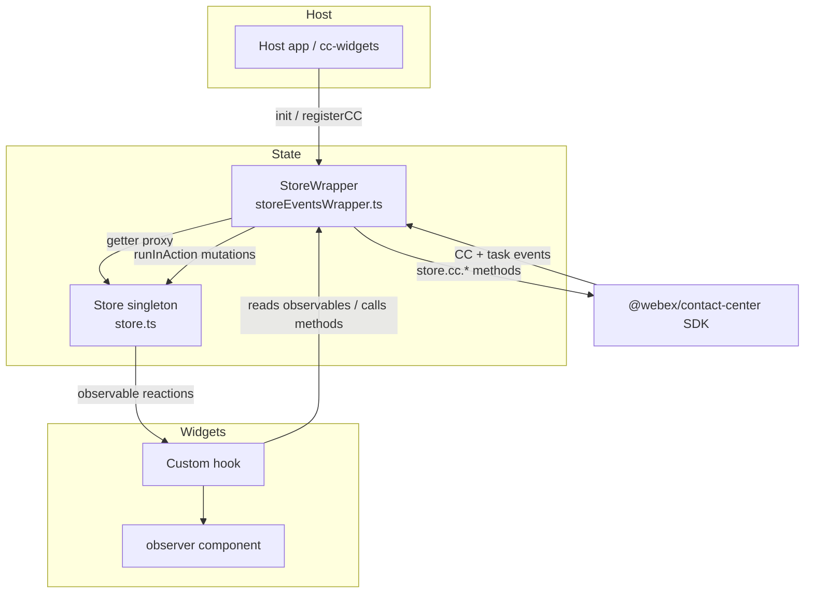
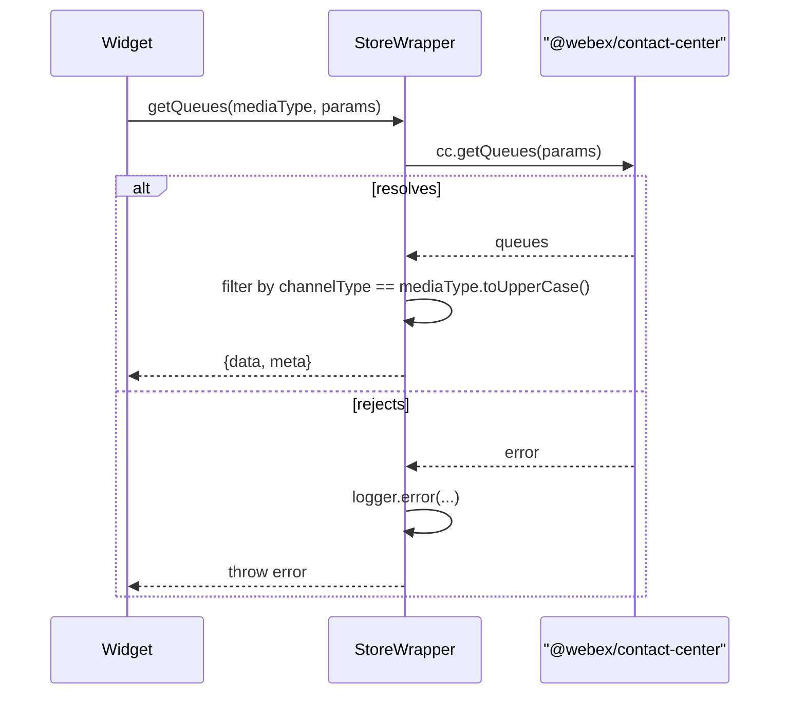
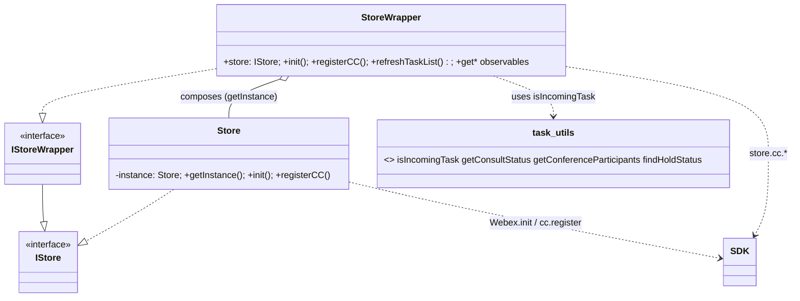

# store — SPEC

> Start here → root [`AGENTS.md`](../../../../AGENTS.md) (agent entry) · router [`SPEC_INDEX.md`](../../../../ai-docs/SPEC_INDEX.md) · system [`ARCHITECTURE.md`](../../../../ai-docs/ARCHITECTURE.md). This is the module's canonical spec: orientation, requirements, design, flows, state, and tests.
> Context-efficiency: link to canonical docs — don't duplicate them. Load specs on demand per `SPEC_INDEX.md`.

## Metadata
| Field | Value |
|---|---|
| Module id | `store` |
| Source path(s) | `packages/contact-center/store/src/` |
| Doc kind | Module spec |
| Coverage score | Pending coverage assessment |
| Generated from | `module-spec` @ SDLC template library `0.1.0-draft` |
| generated_by / approved_by / updated_at | generated_by: migration agent / approved_by: pending / updated_at: 2026-06-29 |
| Validation status | not-run |

Coverage score: `Pending coverage assessment` before the first report; after assessment, replace with
`<0-100%>` plus the report path/evidence. Keep manifest coverage state outside the rendered module doc
metadata.

## Evidence Rules
Every generated requirement below must cite concrete source evidence using `file path`. Separate source
evidence, test evidence, examples, assumptions, and gaps so validators and future agents can distinguish
truth from context. Test evidence is preferred for WHY. Commit evidence is allowed only when the
repository policy says history is reliable, and must include the commit hash. If evidence is missing or
conflicting, ask a focused discovery question before finalizing the requirement; record unresolved answers
as approved unknowns only when the human explicitly defers or does not know.

## Source Material Register
| Source doc | Scope | Decision | Detail location or disposition |
|---|---|---|---|
| `ai-docs/_archive/pre-sdlc-migration/packages/contact-center/store/ai-docs/AGENTS.md` | overview / API / usage | migrated | Overview, Purpose, Public Surface, Use Cases; usage snippets condensed to behavior. |
| `ai-docs/_archive/pre-sdlc-migration/packages/contact-center/store/ai-docs/ARCHITECTURE.md` | architecture / sequence diagrams | reconciled | Design Overview, Data Flow, Sequence Diagram(s), Pitfalls. Diagrams re-derived from current `store.ts` / `storeEventsWrapper.ts`; see Conflicts note below for drift corrected. |
| `@webex/contact-center` package types (`node_modules/@webex/contact-center/dist/types/index.d.ts`) | SDK API reference (installed `.d.ts`) | reference-only | Linked as the authoritative source for SDK-shaped types/methods consumed via `store.cc.*`. |

## Overview
`@webex/cc-store` is the single shared MobX store for every Webex Contact Center widget. It is the sole boundary between widgets and the `@webex/contact-center` SDK: widgets never import the SDK directly — they read observables and call methods on the store, which proxies to `store.cc.*`. The package is structured in two layers. `Store` (`src/store.ts`) is a `makeAutoObservable` singleton (`Store.getInstance()`) that holds raw observable state and owns initialization/registration with the SDK. `StoreWrapper` (`src/storeEventsWrapper.ts`) is the default export — it wraps the singleton, getter-proxies every observable, owns all SDK event wiring (CC + task events), exposes mutators (all writes funnel through `runInAction`), list-fetch helpers, callback registration, and task-lifecycle handling.

`src/index.ts` re-exports the `StoreWrapper` instance as the default export plus everything from `store.types.ts` (types, the `CC_EVENTS` / `TASK_EVENTS` enums, login/consult/campaign constants) and `task-utils.ts` (pure selectors over SDK `ITask` objects). `util.ts` extracts a fixed allow-list of feature flags from the agent `Profile` at registration time.

A maintainer should start at `src/store.ts` to understand the observable shape and init/register flow, then `src/storeEventsWrapper.ts` for how SDK events drive observable updates, then `src/task-utils.ts` for the read-only task/consult/conference selectors widgets consume.

## Purpose / Responsibility
Owns Contact Center client-side state and the SDK boundary: initialize/register with `@webex/contact-center`, subscribe to CC and task events, expose reactive observables and mutators, fetch domain lists (buddy agents, queues, entry points, address book), and centralize the error callback. It does NOT own UI rendering, business validation, or any direct network protocol beyond delegating to the SDK.

## Stack
TypeScript 5.6.3, MobX 6.13.5 (`makeAutoObservable`, `observable.ref`, `runInAction`). Consumed in React 18 via `mobx-react-lite` `observer()` in downstream packages (not a dependency of this package itself). SDK peer `@webex/contact-center` 3.12.0-next.82. Tests: Jest 29 + ts compile (`tsc --project tsconfig.test.json && jest --coverage`). Build target: `dist/index.js` (Webpack). Evidence: `packages/contact-center/store/package.json`.

## Folder / Package Structure
```
packages/contact-center/store/src/
├── index.ts                 # Barrel: default StoreWrapper instance + re-export of types & task-utils
├── store.ts                 # Store singleton: MobX observables, init() + registerCC()
├── storeEventsWrapper.ts    # StoreWrapper (default export): observable proxies, event wiring, mutators, list fetchers, task lifecycle
├── store.types.ts           # Types/interfaces, CC_EVENTS & TASK_EVENTS enums, ConsultStatus, login/campaign constants
├── task-utils.ts            # Pure selectors over ITask (incoming, consult status, conference participants, hold status)
├── util.ts                  # getFeatureFlags(): allow-list extraction from agent Profile
└── constants.ts             # Task/interaction/consult state + participant-type string constants
```
Tests mirror src under `packages/contact-center/store/tests/` (`store.ts`, `storeEventsWrapper.ts`, `task-utils.ts`, `util.ts`).

## Key Files (source of truth)
| File | Holds |
|---|---|
| `packages/contact-center/store/src/store.ts` | The observable state shape, the 6000ms init timeout, and the `registerCC` profile→observable mapping. Never re-declare these defaults elsewhere. |
| `packages/contact-center/store/src/store.types.ts` | `CC_EVENTS` / `TASK_EVENTS` event-name enums, `ConsultStatus`, `LoginOptions` order, `ERROR_TRIGGERING_IDLE_CODES`, `CAMPAIGN_PREVIEW_*` type lists, and the public export barrel. |
| `packages/contact-center/store/src/util.ts` | The exact feature-flag allow-list parsed from the agent profile. |
| `packages/contact-center/store/src/constants.ts` | Canonical task/interaction/consult state strings and `EXCLUDED_PARTICIPANT_TYPES`. |
| `packages/contact-center/store/src/index.ts` | The public export surface (default store + types + task-utils). |

## Public Surface
This module is consumed as an imported SDK/code API (the `@webex/cc-store` package), not a network surface. Root index: [`CONTRACTS.md`](../../../../ai-docs/CONTRACTS.md).

| Contract ID | Type | Surface | Purpose | Compatibility / deprecation | Schema / detail link | Root index |
|---|---|---|---|---|---|---|
| `store.instance` | SDK | default export `store` (StoreWrapper singleton); `init(options, setupEventListeners)`, `registerCC(webex?)`, observable getters, mutators, `getBuddyAgents/getQueues/getEntryPoints/getAddressBookEntries`, `setOnError`, `setCCCallback/removeCCCallback`, `setTaskCallback/removeTaskCallback` | Sole SDK access point and shared reactive state for all CC widgets | stable semver; observable getter set is additive | `packages/contact-center/store/src/storeEventsWrapper.ts`, `src/store.ts` | [`CONTRACTS.md`](../../../../ai-docs/CONTRACTS.md) |
| `store.types` | SDK | type re-exports (`IContactCenter`, `ITask`, `Profile`, `Team`, `IStore`, `IStoreWrapper`, `InitParams`, `RealTimeTranscriptionData`, ~20 more) | Typed domain surface for widget code | stable semver; SDK-shaped types track the SDK | `packages/contact-center/store/src/store.types.ts:334-366`; SDK: `@webex/contact-center` types (`node_modules/@webex/contact-center/dist/types/index.d.ts`) | [`CONTRACTS.md`](../../../../ai-docs/CONTRACTS.md) |
| `store.constants` | SDK | value/enum exports (`CC_EVENTS`, `TASK_EVENTS`, `ConsultStatus`, `LoginOptions`, `CAMPAIGN_PREVIEW_*`, `DESKTOP`/`EXTENSION`/`DIAL_NUMBER`) | Event names + domain enums for widgets | stable semver | `packages/contact-center/store/src/store.types.ts:368-403` | [`CONTRACTS.md`](../../../../ai-docs/CONTRACTS.md) |
| `store.task-utils` | SDK | pure selectors (`isIncomingTask`, `getTaskStatus`, `getConsultStatus`, `getConferenceParticipants`, `getConferenceParticipantsCount`, `isInteractionOnHold`, `findHoldStatus`, `findHoldTimestamp`, etc.) | Read-only derivations over `ITask` | stable semver | `packages/contact-center/store/src/task-utils.ts` | [`CONTRACTS.md`](../../../../ai-docs/CONTRACTS.md) |

Compatibility notes:
- Adding a new observable getter or mutator is additive (minor). Removing/renaming an observable, mutator, or changing the `CC_EVENTS`/`TASK_EVENTS` enum values is breaking (major) — widgets and the SDK event stream depend on the exact string values.
- The `CC_EVENTS` / `TASK_EVENTS` enums are locally declared until the SDK exports them (see `// TODO: remove this once cc sdk exports this enum`, `store.types.ts:247`). They must stay byte-identical to the SDK's emitted event strings.

## Requires (dependencies)
- `@webex/contact-center` SDK (peer, floor pinned in `package.json` at `3.12.0-next.82`) — the entire CC runtime: `Webex.init()`, `webex.cc.*` methods, the CC/task event stream, agent `Profile`, `webex.credentials.getUserToken()`. Consumed ONLY through the store. Fallback on unavailability: `Store.init()` rejects after a 6000ms timeout (`src/store.ts:140-142`); the wrapper wraps the rejection and invokes `onErrorCallback('Store', err)` (`src/storeEventsWrapper.ts:442-452`).
- `mobx` ^6.13.5 — observable state and `runInAction` for all mutations.
- Internal: none upstream. The store is the lowest widget-layer dependency (`cc-components → widget packages → store → SDK`); it imports no widget package.

## Requirements
| ID | WHAT | WHY | Source Evidence | Test / Example Evidence | Assumptions / Gaps | Confidence |
|---|---|---|---|---|---|---|
| `STORE-R-001` | `Store.getInstance()` returns one shared singleton instance; the default export is a single `StoreWrapper` over it | All widgets must share one source of truth for agent/session/task state | `packages/contact-center/store/src/store.ts:64-72`, `src/storeEventsWrapper.ts:51-53,1112-1114` | `tests/store.ts` ("should initialize with default values") | none | PRESENT |
| `STORE-R-002` | `init({webex})` registers immediately; `init({webexConfig, access_token})` calls `Webex.init()`, waits for the `ready` event, then registers | Supports both host-provided Webex and store-bootstrapped Webex | `src/store.ts:132-188` | `tests/store.ts` (init: "should call registerCC if webex is in options", "should initialize webex and call registerCC on ready event") | none | PRESENT |
| `STORE-R-003` | When bootstrapping Webex, init rejects with `Webex SDK failed to initialize` if the `ready` event has not fired within 6000ms | Prevents widgets hanging forever on an unreachable SDK | `src/store.ts:139-142` | `tests/store.ts` ("should reject the promise if Webex SDK fails to initialize") | none | PRESENT |
| `STORE-R-004` | `registerCC()` throws `Webex SDK not initialized` when neither a `webex` arg nor a prior `this.cc` exists | Fail fast on misuse instead of a later null deref | `src/store.ts:74-81` | `tests/store.ts` ("should throw error if webex and cc object are not present") | none | PRESENT |
| `STORE-R-005` | On successful `register()`, the profile is mapped into observables (teams, idleCodes, agentId, wrapupCodes, deviceType, dialNumber, teamId, timestamps, feature flags); registration failures reject and are logged | Populates initial state so widgets render correctly; surfaces failures | `src/store.ts:89-129` | `tests/store.ts` ("should initialise store values on successful register", "should log an error on failed register") | none | PRESENT |
| `STORE-R-006` | `loginOptions` excludes `BROWSER` unless `webRtcEnabled`, and is sorted by the `LoginOptions` key order | WebRTC/browser calling is gated by org capability; UI ordering must be stable | `src/store.ts:100-103`, `src/store.types.ts:319-323` | `tests/store.ts` ("should initialise store values on successful register") | none | PRESENT |
| `STORE-R-007` | `featureFlags` is restricted to a fixed allow-list of profile keys, omitting `undefined` values | Avoid leaking arbitrary profile fields and keep a known flag surface | `src/util.ts:3-36` | `tests/util.ts` ("should return an object with feature flags from agent profile...") | none | PRESENT |
| `STORE-R-008` | All observable mutations go through `runInAction` (directly or via mutators) | MobX strict-mode correctness; batched, atomic reactive updates | `src/storeEventsWrapper.ts` (e.g. 189-237, 269-282, 303-323, 906-921, 1008-1023) | `tests/storeEventsWrapper.ts` ("storeEventsWrapper Proxies", "setState") | none | PRESENT |
| `STORE-R-009` | `setCurrentTask` ignores incoming tasks and pending (state `new`, not yet accepted) campaign-preview tasks (clears `currentTask`); deep-clones the task; fires `onTaskSelected` only when the task actually changes | CallControl must not render for previews still showing Accept/Skip; avoid stale callbacks | `src/storeEventsWrapper.ts:243-283` | `tests/storeEventsWrapper.ts` ("setCurrentTask", "campaign preview task lifecycle") | none | PRESENT |
| `STORE-R-010` | `refreshTaskList()` re-reads `cc.taskManager.getAllTasks()` and reconciles `currentTask`: clears + resets state when empty, keeps current if still present, else promotes the first task | Keep the store's task view consistent with the SDK after any task event | `src/storeEventsWrapper.ts:303-323` | `tests/storeEventsWrapper.ts` ("refreshTaskList") | none | PRESENT |
| `STORE-R-011` | Incoming tasks register the full task-event listener set once; the `onIncomingTask` callback fires only for genuinely new tasks (not already in `taskList`) | Avoid duplicate listeners and duplicate incoming-task UI for consult/re-entry | `src/storeEventsWrapper.ts:690-762` | `tests/storeEventsWrapper.ts` ("storeEventsWrapper events reactions") | none | PRESENT |
| `STORE-R-012` | `handleTaskRemove` detaches every task listener, clears `realtimeTranscriptionData` for the removed current task, drops accepted-campaign tracking, resets custom state, and refreshes the list | Prevent listener/audio/state leaks across task lifecycles | `src/storeEventsWrapper.ts:458-521` | `tests/storeEventsWrapper.ts` ("handleTaskRemove — campaign ID cleanup") | Per-listener detach is asserted only partially; full leak audit is a gap | PRESENT |
| `STORE-R-013` | `agent:logoutSuccess` triggers `cleanUpStore()` which resets session observables and removes CC SDK listeners; `agent:multiLogin` sets `showMultipleLoginAlert` | Clean session teardown and multi-login warning | `src/storeEventsWrapper.ts:811-819,1003-1024,1029-1066` | `tests/storeEventsWrapper.ts` ("storeEventsWrapper events reactions") | none | PRESENT |
| `STORE-R-014` | `agent:stateChange` (type `AgentStateChangeSuccess`) updates `currentState` (defaulting `auxCodeId` `''`→`'0'`) and both state-change timestamps | Drives the agent-state widget and timers | `src/storeEventsWrapper.ts:797-809` | `tests/storeEventsWrapper.ts` ("storeEventsWrapper events reactions") | none | PRESENT |
| `STORE-R-015` | List fetchers proxy the SDK and propagate errors after logging; `getQueues` filters by upper-cased channel type; `getAddressBookEntries` returns empty when `isAddressBookEnabled` is false | Centralize SDK fetch + transform so widgets stay SDK-agnostic | `src/storeEventsWrapper.ts:924-1001` | `tests/storeEventsWrapper.ts` ("storeEventsWrapper", "getAccessToken") | `getBuddyAgents`/`getQueues` happy-path filtering covered; address-book disabled branch coverage is a gap | PRESENT |
| `STORE-R-016` | `setOnError` wraps the caller callback to also submit a behavioral metrics event before invoking it | Consistent telemetry on widget errors | `src/storeEventsWrapper.ts:285-301` | None found | Negative/telemetry-path test missing | WEAK |
| `STORE-R-017` | `isIncomingTask` returns true only when the task is not wrap-up-required, the agent has not joined, and the interaction state is `new`/`consult`/`connected`/`conference` | Gates whether a task is treated as an unanswered incoming offer | `src/task-utils.ts:26-37` | `tests/task-utils.ts` ("isIncomingTask" — incoming / not incoming / edge cases) | none | PRESENT |
| `STORE-R-018` | `getConsultStatus`/`getTaskStatus` map participant `consultState` + interaction state to a `ConsultStatus`, with special handling for secondary EP-DN agents | Consult/conference UI relies on a single derived status | `src/task-utils.ts:39-146` | None found (direct `getConsultStatus` test) | Only `isIncomingTask`, conference, and hold helpers are directly tested; consult-status helper is a gap | WEAK |
| `STORE-R-019` | Conference helpers (`getIsConferenceInProgress`, `getConferenceParticipants`, `getConferenceParticipantsCount`) count only active agent participants, excluding `Customer`/`Supervisor`/`VVA` and those who left | Accurate conference participant display | `src/task-utils.ts:148-247`, `src/constants.ts:33` | `tests/task-utils.ts` ("getIsConferenceInProgress", "getConferenceParticipants", "getConferenceParticipantsCount") | none | PRESENT |
| `STORE-R-020` | `findHoldTimestamp`/`findHoldStatus` resolve hold state per media type, remapping to `mainCall` for secondary EP-DN agents | Hold timers align with Agent Desktop across consult/conference | `src/task-utils.ts:285-362` | `tests/task-utils.ts` ("findHoldTimestamp") | `findHoldStatus` direct coverage is a gap | PRESENT |
| `STORE-R-021` | `handleRealtimeTranscription` upserts transcript lines keyed by `messageId`, normalizing role/timestamp and dropping empty content | Live transcription panel needs deduped, ordered lines | `src/storeEventsWrapper.ts:891-922` | None found | No dedicated transcription test located | WEAK |

## Design Overview
The store is deliberately split into a thin observable core and a thick wrapper. `Store` (`store.ts`) holds only field declarations + `makeAutoObservable` (with `cc` as `observable.ref` so the SDK object itself is not deeply observed) and the two lifecycle methods `init`/`registerCC`. Everything reactive and event-driven lives in `StoreWrapper` (`storeEventsWrapper.ts`), which composes the singleton via `Store.getInstance()` and re-exposes each field through a getter. This keeps the observable schema in one place while concentrating SDK coupling, event wiring, and mutation discipline in the wrapper.

Initialization has two entry shapes (`InitParams = WithWebex | WithWebexConfig`). With a host-supplied `webex`, the wrapper wires event listeners and registers synchronously. Without one, the store calls `Webex.init()`, arms a 6000ms timeout, and waits for the `ready` event before wiring listeners and registering; the timeout guards against an SDK that never becomes ready. Registration maps the agent `Profile` into observables once.

Event handling is the heart of the wrapper. `setupIncomingTaskHandler` is passed into `init` and attaches CC-level listeners (`stationLoginSuccess`, `dnRegistered`/`reloginSuccess`, `multiLogin`, `stateChange`, `logoutSuccess`, task incoming/hydrate/merged/campaign-preview). Per-task listeners are attached in `registerTaskEventListeners` when a task arrives and symmetrically detached in `handleTaskRemove`. Most task events simply call `refreshTaskList()`, which re-reads the SDK's authoritative task map and reconciles `currentTask`. Campaign-preview tasks carry extra state logic (RESERVED vs ENGAGED, an `acceptedCampaignIds` set) so a pending preview never promotes to `currentTask`.

Mutations are funneled through small mutator methods that wrap `runInAction`, satisfying MobX strict mode and keeping reactive updates atomic. `task-utils.ts` is pure (no store state) — selectors that downstream widgets call to derive consult/conference/hold status from an `ITask`.

## Data Flow
In-process MobX reactivity; the only external transport is the SDK event stream and method calls (`@webex/contact-center`), which is itself WebSocket/HTTP under the hood but opaque to this module.


## Sequence Diagram(s)
Sequence coverage:

| Operation group | Diagram | Failure / recovery coverage |
|---|---|---|
| Init + register | "Store init / register" | 6000ms init timeout reject; register reject; wrapper error callback |
| SDK event → observable update | "Agent state change & multi-login" | non-`AgentStateChangeSuccess` payloads ignored |
| Incoming task lifecycle | "Incoming task → assigned → end/remove" | duplicate-task guard; campaign-preview RESERVED branch; listener detach on remove |
| Representative `store.cc.*` call | "getQueues list fetch" | SDK error logged + rethrown |

```mermaid
sequenceDiagram
  participant App
  participant W as StoreWrapper
  participant S as Store
  participant SDK as "@webex/contact-center"

  App->>W: init(options)
  W->>S: init(options, setupIncomingTaskHandler)
  alt options has webex
    S->>W: setupEventListeners(webex.cc)
    S->>S: registerCC(webex)
  else webexConfig + access_token
    S->>S: setTimeout(6000ms)
    S->>SDK: Webex.init({config, credentials})
    alt ready within 6s
      SDK-->>S: ready
      S->>S: clearTimeout; setupEventListeners(webex.cc)
      S->>S: registerCC(webex)
    else timeout elapses
      S-->>W: reject("Webex SDK failed to initialize")
    end
  end
  S->>SDK: cc.register()
  alt register resolves
    SDK-->>S: Profile
    S->>S: map profile → observables, getFeatureFlags()
    S-->>W: resolve
    W-->>App: resolve
  else register rejects
    SDK-->>S: error
    S-->>W: reject(error)
    W->>W: onErrorCallback("Store", err)
    W-->>App: throw err
  end
```

```mermaid
sequenceDiagram
  participant SDK as "@webex/contact-center"
  participant W as StoreWrapper
  participant S as Store

  SDK-->>W: agent:stateChange (data)
  alt data.type == "AgentStateChangeSuccess"
    W->>S: setCurrentState(auxCodeId || "0")
    W->>S: setLastStateChangeTimestamp(ts)
    W->>S: setLastIdleCodeChangeTimestamp(ts)
  else other payload
    W->>W: ignore
  end
  SDK-->>W: agent:multiLogin (AgentMultiLoginCloseSession)
  W->>S: setShowMultipleLoginAlert(true)
  SDK-->>W: agent:logoutSuccess
  W->>W: setAgentProfile({}); cleanUpStore(); removeEventListeners()
```

```mermaid
sequenceDiagram
  participant SDK as "@webex/contact-center"
  participant W as StoreWrapper
  participant S as Store

  SDK-->>W: task:incoming (ITask)
  W->>W: registerTaskEventListeners(task)
  alt task not already in taskList
    W->>W: onIncomingTask({task}); handleTaskMuteState(task)
  end
  W->>S: refreshTaskList()
  SDK-->>W: task:assigned
  alt campaign preview & state == "new"
    W->>S: setState(RESERVED)
  else
    W->>S: setCurrentTask(task); setState(ENGAGED)
  end
  SDK-->>W: task:end
  W->>S: setIsDeclineButtonEnabled(false); refreshTaskList()
  Note over W,S: handleTaskRemove detaches all task listeners,<br/>clears transcription, drops accepted-campaign id,<br/>resets state, refreshTaskList()
```



## Class / Component Relationships

`StoreWrapper` extends the `IStore` contract (via `IStoreWrapper`) and composes a single `Store` singleton, proxying every observable through getters. `Store` implements `IStore` and is the only class that touches `Webex.init()`/`cc.register()`. `task-utils` is a stateless module of selectors that the wrapper and downstream widgets call against `ITask`.

## Use Cases
- **UC-1 Bootstrap with host Webex:** Host calls `store.init({webex})` after the SDK `ready` event → wrapper wires listeners and `registerCC` maps the profile into observables → widgets render. Evidence: `src/store.ts:132-138`, `tests/store.ts` (init).
- **UC-2 Bootstrap Webex from store:** Host calls `store.init({webexConfig, access_token})` → store runs `Webex.init()`, waits for `ready` (or rejects at 6s), then registers. Evidence: `src/store.ts:139-188`, `tests/store.ts` (init).
- **UC-3 Observe agent/session state in React:** Widget wraps in `observer()` and reads `store.agentId`, `store.isAgentLoggedIn`, `store.deviceType`, `store.currentState` → re-renders on mutation. Evidence: `src/storeEventsWrapper.ts:56-187`, `_archive/.../AGENTS.md` usage.
- **UC-4 Handle an incoming task through to wrap-up:** SDK `task:incoming` → listeners registered + `onIncomingTask` fired → `task:assigned` sets ENGAGED/current → `task:end` + `handleTaskRemove` cleans up. Evidence: `src/storeEventsWrapper.ts:585-762`, `tests/storeEventsWrapper.ts` ("events reactions").
- **UC-5 Campaign-preview accept flow:** `task:campaignPreviewReservation` puts a preview in RESERVED; preview stays out of `currentTask` until accepted (`acceptedCampaignIds`), then transitions to ENGAGED. Evidence: `src/storeEventsWrapper.ts:243-283,537-583,772-795`, `tests/storeEventsWrapper.ts` ("campaign preview task lifecycle").
- **UC-6 Fetch a domain list for a widget dropdown:** Transfer/Consult widget calls `getBuddyAgents()`/`getQueues()`; Outdial calls `getEntryPoints()`/`getAddressBookEntries()` → store proxies the SDK, transforms/filters, returns. `getQueues`/`getEntryPoints` merge `desktopProfileFilter: true`. Evidence: `src/storeEventsWrapper.ts:924-1001`, `tests/storeEventsWrapper.ts`.

## State Model
The store is a single MobX `makeAutoObservable` instance. Observable slices (all in `src/store.ts:23-56`):
- **Session / profile:** `agentId`, `agentProfile`, `isAgentLoggedIn`, `deviceType`, `dialNumber`, `teamId`, `teams`, `loginOptions`, `idleCodes`, `wrapupCodes`, `featureFlags`, `dataCenter`.
- **Agent state:** `currentState`, `customState`, `lastStateChangeTimestamp`, `lastIdleCodeChangeTimestamp`, `showMultipleLoginAlert`.
- **Tasks:** `taskList` (`Record<interactionId, ITask>`), `currentTask`, `acceptedCampaignIds` (`Set<string>`), `realtimeTranscriptionData`.
- **Call/consult control:** `isMuted`, `callControlAudio`, `isQueueConsultInProgress`, `currentConsultQueueId`, `consultStartTimeStamp`, `isDeclineButtonEnabled`, `isEndConsultEnabled`, `allowConsultToQueue`, `accessQueue`, `accessEntryPoint`, `accessBuddyTeam`, `isDigitalChannelsInitialized`.
- **`getQueues` / `getEntryPoints`:** merge `desktopProfileFilter: true` into SDK search params. List sort deferred pending team decision on CMS/BFF sort param parity.
- **`getBuddyAgents`:** returns agents sorted by `agentName` ascending (client-side; full list, no pagination).
- **Misc:** `currentTheme`, `cc` (`observable.ref` — not deeply observed), `isAddressBookEnabled`.

Transition triggers: SDK CC/task events drive the session/agent/task slices via the wrapper's handlers (`handleStateChange`, `handleTaskAssigned`, `refreshTaskList`, `cleanUpStore`, campaign-preview handlers). Widget-initiated mutators (`setDeviceType`, `setDialNumber`, `setTeamId`, `setState`, `setCurrentTheme`, etc.) drive UI-local slices. All writes pass through `runInAction`.

## Concurrency & Reactive Flow
- Single-threaded JS, but inherently asynchronous and event-driven: SDK events arrive at arbitrary times and mutate shared observable state. There is no ordering guarantee between unrelated SDK events.
- All state writes are wrapped in `runInAction` (MobX strict mode) so each handler's mutations are applied atomically and observers see a consistent snapshot.
- Idempotency: per-task listeners are registered once (guarded by `!this.taskList[id]` for the incoming callback and by the `realtimeTranscriptionListeners[taskId]` map for transcription) and detached symmetrically in `handleTaskRemove`. `acceptedCampaignIds` is replaced as a new `Set` on each change to keep MobX reactions firing.
- `cc` is `observable.ref` — the SDK object is treated as an opaque reference, never deeply observed, to avoid MobX proxying the SDK's internals.
- Do NOT block inside event handlers; list fetchers are async and return promises rather than blocking the reactive update path.

## Pitfalls
- **6-second init timeout (`src/store.ts:140`):** only applies to the `webexConfig` bootstrap path. With `init({webex})` there is no timeout — a never-ready host Webex hangs init silently. Ensure the host awaits the SDK `ready` event before calling `init({webex})`.
- **Event enums are local copies (`store.types.ts:204-259`):** `CC_EVENTS`/`TASK_EVENTS` string values must match the SDK exactly; an SDK rename will silently stop a handler from firing.
- **Pending campaign previews must not become `currentTask`:** `setCurrentTask` clears `currentTask` for a preview in state `new` that is not in `acceptedCampaignIds` (`storeEventsWrapper.ts:255-267`). Bypassing this (e.g. calling SDK methods directly) re-introduces the bug where CallControl renders for an unaccepted preview.
- **Listener leaks:** every `task.on(...)` in `registerTaskEventListeners` has a matching `task.off(...)` in `handleTaskRemove`. Adding a listener in one without the other leaks handlers and can double-fire `refreshTaskList`.
- **`getBuddyAgents`/`getQueues` default args dereference `this.currentTask.data.interaction.mediaType` (`storeEventsWrapper.ts:925,941`):** calling them with no `currentTask` set throws. Callers should pass an explicit `mediaType` when no task is active.
- **`@ts-expect-error` markers tie to SDK gaps:** several casts (e.g. `response.teams`, credentials API) are pinned to `CAI-6762`; removing the workaround before the SDK fix breaks the build.

## Module Do's / Don'ts
- DO: route every SDK access through `store.cc.*`; widgets must never import `@webex/contact-center` directly.
- DO: wrap every observable mutation in `runInAction` (use the existing mutators).
- DO: add a matching `task.off(...)` in `handleTaskRemove` for any new `task.on(...)` in `registerTaskEventListeners`.
- DON'T: mutate observables outside the store, or read `currentTask.data...` in a default arg without a guard.
- DON'T: change a `CC_EVENTS`/`TASK_EVENTS` enum value without confirming the SDK emits that exact string.

## Export Stability
`@webex/cc-store` is published and consumed by every widget package plus `@webex/cc-widgets`, which re-exports the `store` singleton. Adding an observable getter, mutator, type, or constant is a minor (additive) change. Removing/renaming any export, changing an event-enum value, or changing the `init`/`registerCC` signatures is a major (breaking) change. The TypeScript declaration surface is the `export type`/`export` lists in `store.types.ts:334-403` plus `index.ts`. Evidence: `packages/contact-center/store/src/index.ts`, `ai-docs/CONTRACTS.md`.

## Test-Case Strategy (module)
Unit tests are split by source file. `tests/store.ts` covers the singleton defaults, `registerCC` profile mapping (positive) and register failure logging (negative), and all `init` branches including the 6s timeout reject and synchronous `Webex.init` throw. `tests/storeEventsWrapper.ts` is the largest suite: observable proxies, `setState`, callback register/remove, list fetchers + `getAccessToken`, event reactions, hydration custom-states, `refreshTaskList`, `setCurrentTask`, and the full campaign-preview lifecycle (accepted/unaccepted, ID cleanup, type branching). `tests/task-utils.ts` covers `isIncomingTask` (incoming / not-incoming / edge), the conference helpers, and `findHoldTimestamp`. `tests/util.ts` covers `getFeatureFlags`.

| Behavior / Requirement | Existing test evidence | Gap |
|---|---|---|
| `STORE-R-001` | `tests/store.ts` | none |
| `STORE-R-002` | `tests/store.ts` (init) | none |
| `STORE-R-003` | `tests/store.ts` ("...fails to initialize") | none |
| `STORE-R-004` | `tests/store.ts` ("...not present") | none |
| `STORE-R-005` | `tests/store.ts` (register positive + negative) | none |
| `STORE-R-006` | `tests/store.ts` | explicit BROWSER-filter assertion could be strengthened |
| `STORE-R-007` | `tests/util.ts` | no negative (unknown-key omission) case |
| `STORE-R-008` | `tests/storeEventsWrapper.ts` (proxies, setState) | none |
| `STORE-R-009` | `tests/storeEventsWrapper.ts` (setCurrentTask, campaign preview) | none |
| `STORE-R-010` | `tests/storeEventsWrapper.ts` (refreshTaskList) | none |
| `STORE-R-011` | `tests/storeEventsWrapper.ts` (events reactions) | none |
| `STORE-R-012` | `tests/storeEventsWrapper.ts` (handleTaskRemove cleanup) | full per-listener detach not exhaustively asserted |
| `STORE-R-013` | `tests/storeEventsWrapper.ts` (events reactions) | none |
| `STORE-R-014` | `tests/storeEventsWrapper.ts` (events reactions) | none |
| `STORE-R-015` | `tests/storeEventsWrapper.ts` (list fetchers, getAccessToken) | address-book-disabled branch not directly asserted |
| `STORE-R-016` | None found | missing telemetry-path test |
| `STORE-R-017` | `tests/task-utils.ts` (isIncomingTask) | none |
| `STORE-R-018` | None found | `getConsultStatus`/`getTaskStatus` untested |
| `STORE-R-019` | `tests/task-utils.ts` (conference helpers) | none |
| `STORE-R-020` | `tests/task-utils.ts` (findHoldTimestamp) | `findHoldStatus` untested |
| `STORE-R-021` | None found | `handleRealtimeTranscription` untested |

## Traceability
- Repo architecture: [`ARCHITECTURE.md`](../../../../ai-docs/ARCHITECTURE.md) · Registry: [`SPEC_INDEX.md`](../../../../ai-docs/SPEC_INDEX.md) · Contracts: [`CONTRACTS.md`](../../../../ai-docs/CONTRACTS.md)
- Coverage state & contracts baseline: `.sdd/manifest.json`
