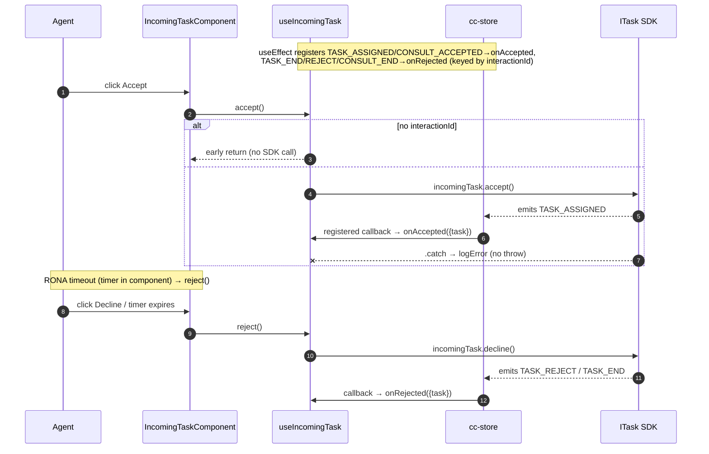
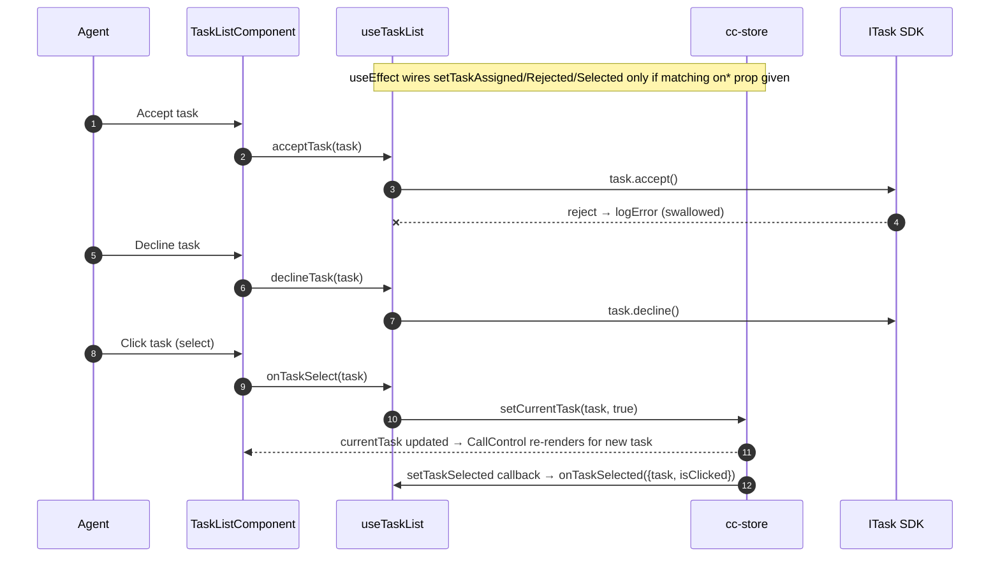
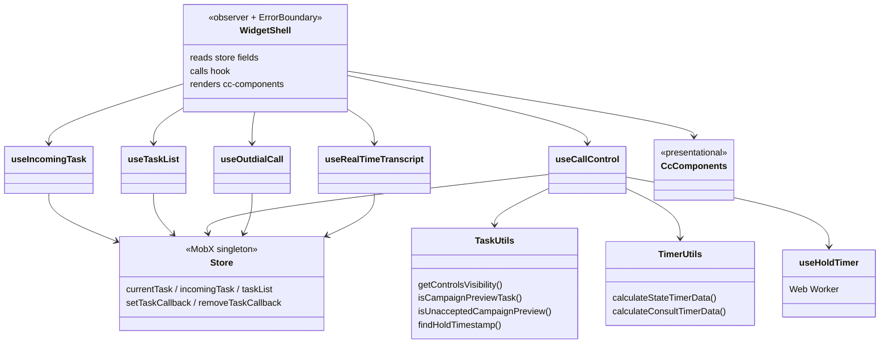
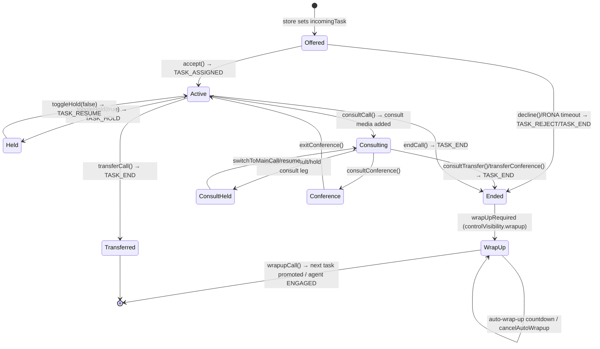

# task — SPEC

> Start here → root [`AGENTS.md`](../../../../AGENTS.md) (agent entry) · router [`SPEC_INDEX.md`](../../../../ai-docs/SPEC_INDEX.md) · system [`ARCHITECTURE.md`](../../../../ai-docs/ARCHITECTURE.md). This is the module's canonical spec: orientation, requirements, design, flows, state, UI, and tests.
> Context-efficiency: link to canonical docs — don't duplicate them. Load specs on demand per `SPEC_INDEX.md`.

## Metadata
| Field | Value |
|---|---|
| Module id | `task` |
| Source path(s) | `packages/contact-center/task/src/` |
| Doc kind | Module spec |
| Coverage score | Pending coverage assessment |
| Generated from | `module-spec` @ SDLC template library `0.1.0-draft` |
| generated_by / approved_by / updated_at | generated_by: migration agent / approved_by: pending / updated_at: 2026-06-29 |
| Validation status | not-run |

Coverage score: `Pending coverage assessment` before the first report; after assessment, replace with `<0-100%>` plus the report path/evidence. Keep manifest coverage state outside the rendered module doc metadata.

## Evidence Rules
Every generated requirement below must cite concrete source evidence using `file path`. Separate source evidence, test evidence, examples, assumptions, and gaps so validators and future agents can distinguish truth from context. Test evidence is preferred for WHY. Commit evidence is allowed only when the repository policy says history is reliable, and must include the commit hash. If evidence is missing or conflicting, ask a focused discovery question before finalizing the requirement; record unresolved answers as approved unknowns only when the human explicitly defers or does not know.

## Source Material Register
| Source doc | Scope | Decision | Detail location or disposition |
|---|---|---|---|
| `ai-docs/_archive/.../task/ai-docs/widgets/CallControl/AGENTS.md` + `ARCHITECTURE.md` | architecture / overview / API | reconciled | Flows landed in Sequence Diagram(s); props in Public Surface. Migration-future claims (`task.uiControls`, renamed events) NOT applied — current code still uses `getControlsVisibility`; see Pitfalls + conflict notes. |
| `ai-docs/_archive/.../task/ai-docs/widgets/IncomingTask/AGENTS.md` + `ARCHITECTURE.md` | architecture / overview / API | reconciled | Accept/decline + RONA flow → Sequence Diagram(s); callbacks → Public Surface. |
| `ai-docs/_archive/.../task/ai-docs/widgets/OutdialCall/AGENTS.md` + `ARCHITECTURE.md` | architecture / overview / API | reconciled | Outdial + ANI flow → Sequence Diagram(s); login-mode behavior → Use Cases / Pitfalls. |
| `ai-docs/_archive/.../task/ai-docs/widgets/TaskList/AGENTS.md` + `ARCHITECTURE.md` | architecture / overview / API | reconciled | Task selection / accept / decline flow → Sequence Diagram(s). |
| `packages/contact-center/ai-docs/migration/*.md` (7 files) | architecture (planned refactor) | reference-only | Describes a planned SDK `task.uiControls` migration that is NOT in current code. Used only to mark conflicts; current behavior documented as-is. |
## Overview
`task` is the largest CC widget bundle: it exports six React/Web-Component widgets that together cover the full agent interaction lifecycle — being offered a task, accepting/declining it, controlling an active call (hold, mute, record, consult, transfer, conference, wrap-up), placing outbound calls, listing concurrent tasks, and rendering a live transcript. Each widget follows the repo-standard layering: a thin `observer()` widget wraps an `ErrorBoundary`, reads MobX state from `@webex/cc-store`, delegates business logic to a custom hook in `helper.ts`, and renders a presentational component from `@webex/cc-components`. The hook is the only place that touches the SDK (`task.*` / `store.cc.*`) and registers/unregisters store task-event callbacks.

A maintainer should start at `src/index.ts` (the export barrel), then `src/helper.ts` (all five hooks: `useIncomingTask`, `useTaskList`, `useCallControl`, `useOutdialCall`, `useRealTimeTranscript`), then `src/Utils/task-util.ts` (the `getControlsVisibility` aggregator that decides which call-control buttons are visible/enabled). The widget shells (`src/CallControl/index.tsx` etc.) are intentionally tiny — they only select store fields and forward props.

State is not owned here: the live task objects (`currentTask`, `incomingTask`, `taskList`), wrap-up codes, device type, feature flags, agent id, and accepted-campaign ids all live in `@webex/cc-store`. The hooks read those, call SDK methods on the `ITask` object, and register callbacks via `store.setTaskCallback(EVENT, fn, interactionId)` so SDK-emitted events flow back into widget-local `useState` and into the consumer's `on*` callbacks.

Note on migration docs: the archived per-widget docs and `ai-docs/migration/*.md` describe a *planned* refactor to an SDK-computed `task.uiControls` surface and renamed events (e.g. `AGENT_WRAPPEDUP` → `TASK_WRAPPEDUP`). That refactor is **not** present in the current code — control visibility is still computed locally by `getControlsVisibility`, and the store still emits `AGENT_WRAPPEDUP` / `CONTACT_RECORDING_*`. This spec documents the code as it exists today and flags the divergence in Pitfalls.

## Purpose / Responsibility
Owns the agent-facing UI and SDK orchestration for the contact lifecycle of a single task and the agent's task list: offer→accept/decline, active-call controls (hold/resume/mute/record/consult/transfer/conference/wrap-up), outbound dialing, multi-task listing/selection, and live transcript rendering. It does NOT own task state, SDK connection, agent state/presence, or wrap-up-code configuration — those belong to `store`/SDK.

## Stack
TypeScript 5, React 18 (function components + hooks), MobX via `mobx-react-lite` `observer()`, `react-error-boundary` for fault isolation. Presentational components are imported from `@webex/cc-components`; all task/agent state and SDK access come from `@webex/cc-store` (`@webex/contact-center` SDK underneath). A `Web Worker` (created from an inline blob) drives the hold timer (`src/Utils/useHoldTimer.ts`). Tests: Jest + React Testing Library under `tests/`. Build target: distributed as part of `@webex/cc-widgets` (r2wc Web Components).

## Folder / Package Structure
```
packages/contact-center/task/src/
├── index.ts                  # Export barrel: IncomingTask, TaskList, CallControl, OutdialCall, CallControlCAD, RealTimeTranscript
├── task.types.ts             # Public prop/callback types per widget + TARGET_TYPE, DeviceTypeFlags
├── helper.ts                 # All hooks: useIncomingTask, useTaskList, useCallControl, useOutdialCall, useRealTimeTranscript
├── CallControl/index.tsx     # Active-call control widget shell (observer + ErrorBoundary)
├── CallControlCAD/index.tsx  # CallControl variant with customer-data CSS hooks (callControlClassName / consult class)
├── IncomingTask/index.tsx    # Offered-task accept/decline widget shell
├── OutdialCall/index.tsx     # Outbound dialpad widget shell
├── TaskList/index.tsx        # Concurrent-task list widget shell
├── RealTimeTranscript/index.tsx  # Live transcript widget shell
└── Utils/
    ├── task-util.ts          # getControlsVisibility aggregator + per-button visibility helpers + campaign-preview checks + findHoldTimestamp
    ├── constants.ts          # Media-type, max-conference-participant, timer-label, DestinationAgentType constants
    ├── timer-utils.ts        # calculateStateTimerData / calculateConsultTimerData (wrap-up / post-call / consult labels)
    ├── useHoldTimer.ts       # Web-Worker-backed hold-elapsed-seconds hook (consult hold prioritized over main hold)
    └── sample-task.json      # Test/sample fixture
```

## Key Files (source of truth)
| File | Holds |
|---|---|
| `src/index.ts` | Authoritative list of exported widgets — do not assume exports from elsewhere. |
| `src/task.types.ts` | Public prop/callback shapes per widget; `TARGET_TYPE`/`TargetType`; `DeviceTypeFlags`; re-exports `CAMPAIGN_PREVIEW_*` from store. |
| `src/helper.ts` | All hook logic and the exact SDK methods + store callbacks each operation uses. |
| `src/Utils/task-util.ts` | `getControlsVisibility` — the single source of truth for which call-control buttons are visible/enabled per device/feature-flag/task-state. |
| `src/Utils/constants.ts` | Media types, `MAX_PARTICIPANTS_IN_MULTIPARTY_CONFERENCE = 7`, timer labels, `DestinationAgentType` enum. |

## Public Surface
| Contract ID | Type | Surface | Purpose | Compatibility / deprecation | Schema / detail link | Root index |
|---|---|---|---|---|---|---|
| `cc-widgets.IncomingTask` | SDK (React component / Web Component) | `IncomingTask` — props: `incomingTask`; callbacks: `onAccepted({task})`, `onRejected({task})` | Render an offered task with accept/decline; notify consumer on accept/reject/RONA | Stable; adding optional props/callbacks = minor | `src/task.types.ts` (`IncomingTaskProps`) | [`CONTRACTS.md`](../../../../ai-docs/CONTRACTS.md) |
| `cc-widgets.TaskList` | SDK (React component / Web Component) | `TaskList` — props: `hasCampaignPreviewEnabled?`; callbacks: `onTaskAccepted(task)`, `onTaskDeclined(task, reason)`, `onTaskSelected({task, isClicked})` | List concurrent tasks; accept/decline/select | Stable; `hasCampaignPreviewEnabled` defaults true | `src/task.types.ts` (`TaskListProps`) | [`CONTRACTS.md`](../../../../ai-docs/CONTRACTS.md) |
| `cc-widgets.CallControl` | SDK (React component / Web Component) | `CallControl` — callbacks: `onHoldResume({isHeld,task})`, `onEnd({task})`, `onWrapUp({task,wrapUpReason})`, `onRecordingToggle({isRecording,task})`, `onToggleMute({isMuted,task})`; props: `conferenceEnabled?`, `consultTransferOptions?`, `callControlClassName?`, `callControlConsultClassName?` | Active-call controls for `store.currentTask` | Stable; `conferenceEnabled` defaults `true` | `src/task.types.ts` (`CallControlProps`) | [`CONTRACTS.md`](../../../../ai-docs/CONTRACTS.md) |
| `cc-widgets.CallControlCAD` | SDK (React component / Web Component) | `CallControlCAD` — same callbacks/props as `CallControl`; emphasizes `callControlClassName` / `callControlConsultClassName`; participant Drop is store-driven | CallControl variant styled for a customer-data layout with owner-aware conference participant removal | Stable; no new React prop or Web Component property/attribute | `src/task.types.ts` (`CallControlProps`); [`participant-drop-intake.md`](../../../../ai-docs/features/participant-drop-intake.md) | [`CONTRACTS.md`](../../../../ai-docs/CONTRACTS.md) |
| `cc-widgets.OutdialCall` | SDK (React component / Web Component) | `OutdialCall` — props: `isAddressBookEnabled?` (default `true`); no consumer callbacks | Outbound dialpad + ANI selection; disabled when a telephony task is active | Stable | `src/task.types.ts` (`OutdialProps`) | [`CONTRACTS.md`](../../../../ai-docs/CONTRACTS.md) |
| `cc-widgets.RealTimeTranscript` | SDK (React component / Web Component) | `RealTimeTranscript` — props: `liveTranscriptEntries?`, `className?` | Render live transcript for `store.currentTask` | Stable | `src/task.types.ts` (`RealTimeTranscriptProps`) | [`CONTRACTS.md`](../../../../ai-docs/CONTRACTS.md) |

Compatibility notes:
- Adding an optional prop/callback is additive (minor); removing or renaming one, or changing a callback payload shape, is breaking (major) — these widgets are consumed via r2wc Web Components in `@webex/cc-widgets`.
- `conferenceEnabled` is normalized to `true` when undefined inside the `CallControl`/`CallControlCAD` wrappers; consumers relying on `undefined` getting `false` would break.

### Feature: Accept on Webex thick client (implemented — WXCC-6026)

| Surface | Change |
|---|---|
| **Host init** | `webexConfig.cc.enableAnswerOnWebex: boolean` (default `false`) — set **before** `store.init()`; persisted on store for **UI visibility gating only** |
| **IncomingTask** | Calls SDK `task.accept()` / `task.decline()` — wxApp routing is internal to SDK `Voice` |
| **CallControl** | Engaged wxApp → `task.toggleMute({ muted })` / `task.transmitDtmf({ dtmf })`; widget force-visible only when wxApp engaged **and** SDK `isEnabled`; hide SDK visible+disabled ghosts; Desktop WebRTC SDK passthrough; CAD consult sub-bar mute hidden only when wxApp engaged; `toggleMute` guard includes `consult.mute.isVisible` |
| **TaskList** | Inline Accept / Decline — same unified `task.accept()` / `task.decline()` as IncomingTask; offer-action errors stored on `@webex/cc-store` (`offerActionErrors`) keyed by `interactionId` so TaskList and IncomingTask stay in sync; store assigns a new map reference on each update so `withMetrics` memo does not block TaskList re-renders |
| **@webex/cc-store** | `offerActionErrors` map + `setOfferActionError` / `clearOfferActionError` / `pruneOfferActionErrors` — shared wxApp accept/decline inline error state across TaskList and IncomingTask widget instances (immutable map replacement on mutate) |
| **@webex/cc-components** | Shared wxApp visibility helpers: `isWxAppEngagedCall`, `shouldShowWxAppTelephonyControls` (imported by `helper.ts` for mute/DTMF gates) |

**SDK follow-up (uiControls):** SDK must enable `main.mute/keypad` through consult/hold/conference when wxApp engaged; BROWSER login ignores init flag for uiControls.

**SDK scope:** telephony REST, uiControls, usersub publish, **Mercury mute sync** (`TASK_WXAPP_MUTE_STATE_UPDATED`).

**Store scope:** `storeEventsWrapper` listens for **`TASK_WXAPP_MUTE_STATE_UPDATED`** per task → `handleWxAppMuteStateUpdated` → `setIsMuted()` when task is `currentTask`. Widgets never call Mercury directly.

## Requires (dependencies)
- `@webex/cc-store` (peer, internal): MobX singleton supplying `currentTask` (including SDK `TaskUIControls`), `incomingTask`, `taskList`, `wrapupCodes`, `deviceType`, `featureFlags`, `agentId`, `isMuted`, `acceptedCampaignIds`, `realtimeTranscriptionData`, `logger`, `cc` (SDK), plus `setTaskCallback`/`removeTaskCallback`, `setTaskAssigned`/`setTaskRejected`/`setTaskSelected`, `setCurrentTask`, `setIsMuted`, `getBuddyAgents`, `getAddressBookEntries`, `getEntryPoints`, `getQueues`, and helpers `getConferenceParticipants`, `findMediaResourceId`, `findHoldStatus`, `getConsultStatus`, `getIsConsultInProgress`, `getIsCustomerInCall`, `getConferenceParticipantsCount`, `ConsultStatus`, `TASK_EVENTS`. Source of truth for event names and destination-control types: `packages/contact-center/store/src/store.types.ts`.
- `@webex/cc-components` (internal): presentational components (`IncomingTaskComponent`, `TaskListComponent`, `CallControlComponent`, `CallControlCADComponent`, `OutdialCallComponent`, `RealTimeTranscriptComponent`) and types (`ControlProps`, `TaskProps`, `OutdialCallProps`, `Visibility`, `ControlVisibility`, `RealTimeTranscriptComponentProps`, `CampaignCallProcessingDetails`).
- `@webex/contact-center` (SDK, transitive via store): the `ITask` interface and methods invoked here (`accept`, `decline`, `hold`, `resume`, `end`, `wrapup`, `cancelAutoWrapupTimer`, `pauseRecording`, `resumeRecording`, `toggleMute`, `transfer`, `consult`, `endConsult`, `consultTransfer`, `consultConference`, `transferConference`, `exitConference`), `cc.startOutdial`, `cc.getOutdialAniEntries`, `cc.addressBook.getEntries`, `cc.agentConfig`.
- `react` ^18, `mobx-react-lite`, `react-error-boundary`.
- Browser `Web Worker` + `Blob`/`URL.createObjectURL` for the hold timer (graceful fallback to `holdTime = 0` when no hold timestamp).

## Requirements
| ID | WHAT | WHY | Source Evidence | Test / Example Evidence | Assumptions / Gaps | Confidence |
|---|---|---|---|---|---|---|
| `TASK-R-001` | `IncomingTask.accept()` calls `incomingTask.accept()` only when `incomingTask.data.interactionId` exists; SDK rejection is caught and logged, never thrown to the consumer. | Prevents calling SDK with no task and avoids crashing the widget on backend failure. | `src/helper.ts` (`useIncomingTask.accept`) | `tests/helper.ts` ("should return if there is no taskId for incoming task", "should handle errors when accepting a task", "should handle errors in accept method") | none | PRESENT |
| `TASK-R-002` | `IncomingTask.reject()` calls `incomingTask.decline()` (guarded by interactionId); RONA timeout reaches the same decline path via the timer in the presentational component. | Decline and RONA must converge on `decline()` so the backend reassigns the task. | `src/helper.ts` (`useIncomingTask.reject`) | `tests/helper.ts` ("should handle errors when declining a task", "should call onRejected if it is provided") | RONA countdown UI lives in `@webex/cc-components`, not this module | PRESENT |
| `TASK-R-003` | `useIncomingTask` registers callbacks for `TASK_ASSIGNED`/`TASK_CONSULT_ACCEPTED` (→ `onAccepted`) and `TASK_END`/`TASK_REJECT`/`TASK_CONSULT_END` (→ `onRejected`), keyed by interactionId, and removes them on unmount/task change. | Consumer notifications must fire on real SDK events and listeners must not leak across tasks. | `src/helper.ts` (`useIncomingTask` `useEffect`) | `tests/helper.ts` ("should setup event listeners for the incoming call", "shouldnt setup event listeners is not incoming call", "should call onAccepted if it is provided") | Cleanup uses different fn references than registration for some events (see Pitfalls) | PRESENT |
| `TASK-R-004` | `TaskList.acceptTask`/`declineTask` call `task.accept()`/`task.decline()` per task; `onTaskSelect` calls `store.setCurrentTask(task, true)`. | List actions operate per-task and selection switches the active `currentTask` for CallControl. | `src/helper.ts` (`useTaskList`) | `tests/helper.ts` ("should call onTaskAccepted callback when provided", "should call onTaskDeclined callback when provided", "should call onTaskSelected callback when provided", "should handle errors in onTaskSelect") | none | PRESENT |
| `TASK-R-005` | `useTaskList` wires `store.setTaskAssigned`/`setTaskRejected`/`setTaskSelected` only when the matching consumer callback (`onTaskAccepted`/`onTaskDeclined`/`onTaskSelected`) is provided; each wrapped callback is try/caught. | Avoid registering no-op store callbacks and isolate consumer-thrown errors. | `src/helper.ts` (`useTaskList` `useEffect`) | `tests/helper.ts` ("should not call onTaskAccepted if it is not provided", "should handle errors in taskAssigned callback", "should handle errors in taskSelected callback") | none | PRESENT |
| `TASK-R-006` | `CallControl.toggleHold(true/false)` calls `currentTask.hold()`/`currentTask.resume()`; `TASK_HOLD`/`TASK_RESUME` events fire `onHoldResume({isHeld, task})`. | Hold/resume must reflect real SDK state to the consumer. | `src/helper.ts` (`useCallControl.toggleHold`, `holdCallback`, `resumeCallback`) | `tests/helper.ts` ("should call onHoldResume with hold=true and handle success", "...hold=false...", "should log an error if hold fails", "should log an error if resume fails") | none | PRESENT |
| `TASK-R-007` | `toggleRecording` calls `pauseRecording()` when `isRecording` else `resumeRecording({autoResumed:false})`; `TASK_RECORDING_PAUSED`/`TASK_RECORDING_RESUMED` callbacks set `isRecording` and fire `onRecordingToggle`. | Recording UI state must track SDK events, not just the click. | `src/helper.ts` (`useCallControl.toggleRecording`, `pauseRecordingCallback`, `resumeRecordingCallback`) | `tests/helper.ts` ("should pause the recording when pauseResume is called with true", "should fail and log error if pause failed", "should resume the recording when pauseResume is called with false") | Subscription uses `TASK_RECORDING_PAUSED/RESUMED`; cleanup removes `CONTACT_RECORDING_PAUSED/RESUMED` (mismatch — see Pitfalls) | PRESENT |
| `TASK-R-008` | `toggleMute` no-ops with a warning when mute controls are unavailable; wxApp engaged calls use **`currentTask.toggleMute({ muted: intendedMuteState })`**; WebRTC uses parameterless toggle; then `store.setIsMuted(intended)` and `onToggleMute` only after success; on failure reports prior `isMuted`. | Mute state must reflect SDK/store truth; wxApp must pass UI intent to avoid Mercury desync. | `src/helper.ts` (`useCallControl.toggleMute`), `@webex/cc-components` (`shouldShowWxAppTelephonyControls`) | `tests/helper.ts` (mute + wxApp hooks), `@webex/cc-components` `tests/utils/wxapp-telephony.utils.test.ts` | none | PRESENT |
| `TASK-R-009` | `wrapupCall(reason, auxCodeId)` calls `currentTask.wrapup(...)`; on resolve it promotes the first remaining task in `store.taskList` to `currentTask` and sets agent state to ENGAGED. | After wrap-up the agent should auto-focus the next task and return to an engaged state. | `src/helper.ts` (`useCallControl.wrapupCall`) | `tests/helper.ts` ("should call wrapupCall", "should log an error if wrapup fails") | ENGAGED label/username are local constants (`ENGAGED_LABEL`, `ENGAGED_USERNAME`) | PRESENT |
| `TASK-R-010` | Auto-wrap-up: when `currentTask.autoWrapup` and `controlVisibility.wrapup` are present, a 1s interval counts `secondsUntilAutoWrapup` down from `getTimeLeftSeconds()`; `cancelAutoWrapup` calls `currentTask.cancelAutoWrapupTimer()`. | Show and allow cancellation of the auto-wrap-up countdown. | `src/helper.ts` (`useCallControl` auto-wrapup `useEffect`, `cancelAutoWrapup`) | `tests/helper.ts` ("should initialize secondsUntilAutoWrapup to null when auto wrap-up is not active", "should call cancelAutoWrapup successfully", "should handle cancelAutoWrapup when currentTask is missing") | none | PRESENT |
| `TASK-R-011` | `consultCall(dest, type, allowParticipantsToInteract)` sends `holdParticipants: !allowParticipantsToInteract`; for `type==='queue'` it sets/clears `store.isQueueConsultInProgress` + `currentConsultQueueId` around the call, including on error. | Queue consult requires tracking the in-flight queue id so `endConsult` can pass it. | `src/helper.ts` (`useCallControl.consultCall`, `endConsultCall`) | `tests/helper.ts` ("should call consultCall successfully", "should call consultCall with allowParticipantsToInteract set to true", "should call endConsultCall with queue parameters when queue consult is in progress") | none | PRESENT |
| `TASK-R-012` | `consultTransfer` calls `currentTask.transferConference()` when `currentTask.data.isConferenceInProgress`, else `currentTask.consultTransfer()`; missing `currentTask.data` early-returns. | Conference and 1:1 consult complete via different SDK calls. | `src/helper.ts` (`useCallControl.consultTransfer`) | `tests/helper.ts` ("should call consultTransfer successfully", "should handle consultTransfer when currentTask data is missing") | none | PRESENT |
| `TASK-R-013` | `transferCall(to, type)` awaits `currentTask.transfer({to, destinationType})` and re-throws on error (unlike most handlers which swallow). | Blind transfer failures must surface to the calling modal so the UI can react. | `src/helper.ts` (`useCallControl.transferCall`) | `tests/helper.ts` ("should call transferCall successfully", "should handle rejection when loading buddy agents") | Re-throw is intentional and differs from hold/end/wrapup which only log | PRESENT |
| `TASK-R-014` | `switchToConsult`/`switchToMainCall` hold/resume the correct media leg via `findMediaResourceId(currentTask, 'mainCall'|'consult')`; `exitConference`/`consultConference` proxy the SDK directly. | Switching between consult and main legs targets the right media resource. | `src/helper.ts` (`useCallControl.switchToConsult/switchToMainCall/exitConference/consultConference`) | `tests/helper.ts` (useCallControl consult/conference cases) | none | WEAK |
| `TASK-R-015` | `getControlsVisibility(deviceType, featureFlags, task, agentId, conferenceEnabled, logger)` returns `{isVisible,isEnabled}` for every control plus consult/conference state flags, and returns safe all-hidden defaults inside a try/catch on any error. | Button visibility must degrade safely and never throw into render. | `src/Utils/task-util.ts` (`getControlsVisibility` + `get*ButtonVisibility`) | `tests/utils/task-util.ts` ("should handle errors when accessing featureFlags and return safe defaults", BROWSER/AGENT_DN/EXTENSION + telephony/chat/email cases) | none | PRESENT |
| `TASK-R-016` | End button is enabled during an EP-DN consult only when on the main call (`consultCallHeld`) or during conference when main is not held & consult not completed; disabled for regular agent-to-agent consult. | Matches Agent Desktop end-call rules for EP-DN vs agent consults. | `src/Utils/task-util.ts` (`getEndButtonVisibility`, `isConsultingWithEpDnAgent`) | `tests/utils/task-util.ts` ("should enable end button during EP_DN consult when switched back to main call...", "should disable end button for regular agent-to-agent consult (non-EP_DN)", EP/EPDN/EntryPoint variant detection) | none | PRESENT |
| `TASK-R-017` | `useHoldTimer` prioritizes the `consult` hold timestamp over `mainCall`, converts second-precision timestamps to ms (`< 1e10`), drives elapsed seconds via a Web Worker, and resets to 0 when no hold timestamp / on resume. | Hold timer must show the leg currently on hold and clean up its worker. | `src/Utils/useHoldTimer.ts` | `tests/utils/useHoldTimer.test.ts` ("should prioritize consult hold over main call hold", "should handle timestamp in seconds and convert to milliseconds", "should reset to 0 when call is resumed", "should return 0 when currentTask is null") | none | PRESENT |
| `TASK-R-018` | State timer prioritizes Wrap Up over Post Call; consult timer returns `Consult Requested` (initiated), `Consult on Hold` (held), else `Consulting`, falling back to participant `lastUpdated` when no consult timestamp. | Drives the correct timer label/timestamp in CallControl. | `src/Utils/timer-utils.ts` (`calculateStateTimerData`, `calculateConsultTimerData`) | `tests/utils/timer-utils.test.ts` ("should prioritize Wrap Up over Post Call", "should return Consult on Hold when consult is held", "should return Consult Requested label when consult is initiated") | none | PRESENT |
| `TASK-R-019` | `OutdialCall.startOutdial(destination, origin?)` alerts and aborts on empty/whitespace destination; passes `origin` (ANI) only when provided; SDK rejection is logged, not thrown. | Prevent empty outdials and honor optional caller-ID selection. | `src/helper.ts` (`useOutdialCall.startOutdial`) | `tests/OutdialCall/index.tsx` (render + `isAddressBookEnabled` cases) | No direct unit test asserts the empty-destination alert (gap) | WEAK |
| `TASK-R-020` | `getOutdialANIEntries` throws if `cc.agentConfig.outdialANIId` is missing, else returns `cc.getOutdialAniEntries({outdialANI})`; `isTelephonyTaskActive` is true iff any task in `store.taskList` has `mediaType === telephony`. | ANI selection requires a configured ANI id; outdial is gated on no active telephony task. | `src/helper.ts` (`useOutdialCall.getOutdialANIEntries`, `isTelephonyTaskActive`) | `tests/OutdialCall/index.tsx` (component render); helper outdial paths in `tests/helper.ts` | No explicit unit test for the "no outdialANIId throws" branch (gap) | WEAK |
| `TASK-R-021` | `useRealTimeTranscript` maps `realtimeTranscriptionData` to `RealTimeTranscriptEntry[]` only when `currentTaskId` is set and data is non-empty; otherwise returns `liveTranscriptEntries` unchanged. Speaker is normalized (AGENT→"You", CUSTOMER/CALLER→"Customer"). | Live transcript must key off the active task and normalize speaker labels. | `src/helper.ts` (`useRealTimeTranscript`, `mapTranscriptLineToEntry`, `getTranscriptSpeaker`) | `tests/RealtimeTranscript/index.tsx` ("passes props to useRealtimeTranscript hook", "renders fallback when an error is thrown") | none | PRESENT |
| `TASK-R-022` | Each widget shell renders inside an `ErrorBoundary` whose `fallbackRender` returns empty and `onError` calls `store.onErrorCallback(widgetName, error)` when set; absence of the callback must not throw. | A crashing widget must isolate and report, never break the host. | `src/{CallControl,CallControlCAD,IncomingTask,TaskList,OutdialCall,RealTimeTranscript}/index.tsx` | `tests/CallControl/index.tsx`, `tests/CallControlCAD/index.tsx`, `tests/IncomingTask/index.tsx`, `tests/TaskList/index.tsx`, `tests/OutdialCall/index.tsx`, `tests/RealtimeTranscript/index.tsx` (each has an ErrorBoundary + "onErrorCallback not set" case) | none | PRESENT |
| `TASK-R-023` | `CallControl`/`CallControlCAD` render nothing when there is no `currentTask` or when the task is an unaccepted campaign preview (`isUnacceptedCampaignPreview(task, acceptedCampaignIds)`). | Controls must only appear for an accepted, active task — matches Agent Desktop campaign-preview behavior. | `src/CallControl/index.tsx`, `src/CallControlCAD/index.tsx`, `src/Utils/task-util.ts` (`isCampaignPreviewTask`, `isUnacceptedCampaignPreview`) | None found for the unaccepted-campaign-preview early return (gap) | Campaign-preview gating relies on `store.acceptedCampaignIds`, not `participants.hasJoined` | WEAK |
| `TASK-R-024` | `useCallControl` owns Customer confirmation plus `requestParticipantDrop`/confirm/cancel orchestration. It revalidates the latest task, owner-aware roster, global consult gate, and per-target disabled state; serializes requests with a synchronous token that survives same-interaction task clones; calls `task.dropConferenceParticipant({participantId: target.dropTargetId})`; waits for SDK hydration rather than removing rows; suppresses stale completions after owner/agent/interaction/terminal changes; and emits only generic success/failure feedback. One supported non-customer participant keeps the roster visible after Customer departure. An active Entry Point/EP-DN consult appears by dialed number while ringing and changes to the answering Agent name before merge; its action cannot invoke Drop until it joins the main leg. Failure logs no participant data and invokes `store.onErrorCallback('CallControlCAD', sanitizedError)`. Agent/consult termination remains SDK-event-authoritative; incoming consultees consume the existing consult-end signal once, while the store defers terminal list refresh until SDK cleanup completes. | Concurrent, stale, or premature participant removal must not target the wrong task, leak PII, hide surviving participants, duplicate rejection callbacks, or desynchronize from the event-driven SDK task model. | `src/helper.ts`, `src/task.types.ts` | `tests/helper.ts` (`conference participant Drop`, incoming consult-end rejection) | The published SDK version with `ITask.dropConferenceParticipant` is a release gate; widgets do not synthesize consult termination. | PRESENT |
| `TASK-R-025` | `CallControl` and `CallControlCAD` must pass the current Task's `uiControls` to presentational components without building a collaboration-policy context or forwarding raw Desktop Profile access flags. | The SDK Task is the single source for destination availability/order; widget wrappers should contain no duplicated destination policy. | `src/CallControl/index.tsx`, `src/CallControlCAD/index.tsx`, `src/helper.ts` | `tests/CallControl/index.tsx`, `tests/CallControlCAD/index.tsx` | Presentational host options may only hide SDK-allowed categories. | PRESENT |

## Design Overview
Every widget is the same four-layer pipeline. The shell (`*/index.tsx`) is an `observer()` that destructures the store fields it needs, builds a hook-input object, calls the hook, merges hook output with extra store fields, and renders the matching `cc-components` component — all wrapped in an `ErrorBoundary` that funnels crashes to `store.onErrorCallback`. The shells contain almost no logic; the only branching there is CallControl's "no task / unaccepted campaign preview → render empty" guard and the `conferenceEnabled ?? true` default.

`helper.ts` holds all behavior. Each hook (a) registers SDK-event callbacks through `store.setTaskCallback(EVENT, fn, interactionId)` in a `useEffect` and removes them in cleanup, (b) exposes imperative actions (`accept`, `toggleHold`, `consultCall`, `startOutdial`, …) that call `ITask`/`cc` SDK methods, and (c) derives view state. The most complex hook, `useCallControl`, maintains transient UI state (recording, buddy agents, consult agent name, target type, timers, participant Drop request/confirmation/announcement), derives both conference rosters directly from the current observable task, and recomputes `controlVisibility` via `useMemo(getControlsVisibility, …)`.

`Utils/` is pure logic split out for testability: `task-util.ts` decides control visibility/enablement from device type, feature flags, and a large set of derived task-state booleans (consult status, hold status, conference progress, customer-in-call, participant counts); `timer-utils.ts` and `useHoldTimer.ts` compute timer labels/elapsed times. Keeping these pure means the visibility matrix and timer math are unit-tested without rendering.

Why this shape: the one-directional layering (`widget → hook → component → store → SDK`) keeps the SDK surface in exactly one file per package and lets MobX `observer()` re-render widgets reactively when the store's task observables change, while consumer callbacks (`on*`) are the only outward coupling.

## Data Flow
Transport is in-process MobX reactivity inward and SDK promise calls + SDK event callbacks outward. SDK events arrive over the SDK's transport (WebSocket/HTTP underneath, owned by the SDK, not this module) and are surfaced as `store.setTaskCallback` invocations.

```mermaid
flowchart LR
  SDK[("@webex/contact-center SDK")] -->|emits task events| Store[("@webex/cc-store (MobX)")]
  Store -->|observable: currentTask / incomingTask / taskList| Widget[Widget shell (observer + ErrorBoundary)]
  Widget -->|hook input props| Hook[helper.ts hook]
  Hook -->|view state + actions| Component[cc-components presentational]
  Component -->|user action| Hook
  Hook -->|task.* / cc.* SDK calls| SDK
  Hook -->|setTaskCallback EVENT, fn, interactionId| Store
  Store -->|invokes registered callback| Hook
  Hook -->|on* callbacks| Consumer[Host app]
  Hook -->|getControlsVisibility / timer utils| Utils[Utils/*]
```

## Sequence Diagram(s)
Sequence coverage:

| Operation group | Diagram | Failure / recovery coverage |
|---|---|---|
| Offer → accept / decline (IncomingTask) + RONA | Incoming task accept/decline | RONA timeout path; SDK reject caught+logged; missing interactionId early-return |
| Hold / resume / record / mute / end (CallControl) | Active-call controls | Hold/resume/record/mute SDK rejection logged; mute reverts on failure; recording event subscription/cleanup mismatch noted |
| Consult / transfer / conference (CallControl) | Consult & transfer | Queue-consult flag rollback on error; `transferCall` re-throws; conference vs 1:1 branch |
| Wrap-up (manual + auto) | Wrap-up | Auto-wrap-up countdown + cancel; wrapup SDK rejection logged; next-task promotion |
| Outbound dial (OutdialCall) | Outdial | Empty-destination alert+abort; missing ANI id throws; SDK reject logged |
| Task list select / accept / decline (TaskList) | Task list actions | Per-task accept/decline reject logged; selection updates currentTask |



```mermaid
sequenceDiagram
  autonumber
  participant A as Agent
  participant C as CallControlComponent
  participant H as useCallControl
  participant S as cc-store
  participant SDK as ITask SDK
  Note over H,S: useEffect subscribes TASK_HOLD/RESUME/END/AGENT_WRAPPEDUP/<br/>TASK_RECORDING_PAUSED/RESUMED
  A->>C: Hold
  C->>H: toggleHold(true)
  H->>SDK: currentTask.hold()
  SDK-->>S: TASK_HOLD
  S->>H: holdCallback → onHoldResume({isHeld:true,task})
  SDK--xH: hold rejection → logger.error (swallowed)
  A->>C: Mute
  C->>H: toggleMute()
  alt controlVisibility.muteUnmute == false
    H-->>C: warn + no-op
  else
    H->>SDK: await currentTask.toggleMute()
    SDK-->>H: success → store.setIsMuted(intended); onToggleMute(intended)
    SDK--xH: failure → onToggleMute(previous isMuted)
  end
  A->>C: Record toggle
  C->>H: toggleRecording()
  alt isRecording
    H->>SDK: currentTask.pauseRecording()
    SDK-->>S: TASK_RECORDING_PAUSED → isRecording=false; onRecordingToggle
  else
    H->>SDK: currentTask.resumeRecording({autoResumed:false})
    SDK-->>S: TASK_RECORDING_RESUMED → isRecording=true
  end
  A->>C: End
  C->>H: endCall()
  H->>SDK: currentTask.end()
  SDK-->>S: TASK_END → endCallCallback → onEnd({task})
```

```mermaid
sequenceDiagram
  autonumber
  participant A as Agent
  participant C as CallControlComponent
  participant H as useCallControl
  participant S as cc-store
  participant SDK as ITask SDK
  A->>C: Consult (select dest)
  C->>H: consultCall(dest, type, allowParticipantsToInteract)
  alt type == queue
    H->>S: setIsQueueConsultInProgress(true); setCurrentConsultQueueId(dest)
  end
  H->>SDK: currentTask.consult({to, destinationType, holdParticipants:!allow})
  alt success
    SDK-->>H: resolved
    H->>S: clear queue-consult flags
  else error
    SDK--xH: rejected
    H->>S: clear queue-consult flags (rollback)
    H-->>C: throw (caller handles)
  end
  A->>C: Complete transfer
  C->>H: consultTransfer()
  alt currentTask.data.isConferenceInProgress
    H->>SDK: currentTask.transferConference()
  else
    H->>SDK: currentTask.consultTransfer()
  end
  Note over H,SDK: Blind transfer: transferCall(to,type) → currentTask.transfer(...) ; on error RE-THROWS
  A->>C: End consult
  C->>H: endConsultCall()
  H->>SDK: currentTask.endConsult({isConsult:true, taskId, queueId?})
  SDK--xH: error → logError + throw
```

```mermaid
sequenceDiagram
  autonumber
  participant A as Agent
  participant C as CallControlComponent
  participant H as useCallControl
  participant S as cc-store
  participant SDK as ITask SDK
  Note over H: auto-wrapup useEffect: if currentTask.autoWrapup && controlVisibility.wrapup<br/>→ setInterval 1s counting secondsUntilAutoWrapup down from getTimeLeftSeconds()
  alt manual wrap-up
    A->>C: select wrap-up code
    C->>H: wrapupCall(reason, auxCodeId)
    H->>SDK: currentTask.wrapup({wrapUpReason, auxCodeId})
    SDK-->>H: resolved
    H->>S: setCurrentTask(firstRemaining); setState(ENGAGED)
    SDK--xH: rejected → logError (swallowed)
  else auto wrap-up cancel
    A->>C: Cancel
    C->>H: cancelAutoWrapup()
    H->>SDK: currentTask.cancelAutoWrapupTimer()
  end
```

```mermaid
sequenceDiagram
  autonumber
  participant A as Agent
  participant C as OutdialCallComponent
  participant H as useOutdialCall
  participant S as cc-store
  participant SDK as cc SDK
  C->>H: getOutdialANIEntries()
  alt no agentConfig.outdialANIId
    H-->>C: throw Error("No OutdialANI Id received.")
  else
    H->>SDK: cc.getOutdialAniEntries({outdialANI})
    SDK-->>C: ANI entries
  end
  A->>C: enter number + dial
  C->>H: startOutdial(destination, origin?)
  alt empty/whitespace destination
    H-->>A: alert("Destination number is required..."); abort
  else
    H->>SDK: cc.startOutdial(...[destination, origin?])
    SDK-->>H: resolved → logger.info
    SDK--xH: rejected → logger.error (swallowed)
  end
  Note over H: outdial gated: isTelephonyTaskActive true if any taskList item mediaType==telephony
```



## Class / Component Relationships

The six widget shells are siblings that each bind to exactly one hook and one presentational component. Only `useCallControl` composes the `Utils/*` helpers (`getControlsVisibility`, the timer utils, and `useHoldTimer`). All hooks depend on the shared `store` singleton for state and event wiring; none import the SDK directly.

## Use Cases
- **UC-1 Accept an offered task (IncomingTask):** Agent → store sets `incomingTask` → widget renders card → Agent clicks Accept → `accept()` → `incomingTask.accept()` → `TASK_ASSIGNED` → `onAccepted`. Evidence: `src/helper.ts` (`useIncomingTask`), `tests/helper.ts` ("should call onAccepted if it is provided").
- **UC-2 Decline / RONA timeout (IncomingTask):** Agent clicks Decline or RONA timer expires → `reject()` → `incomingTask.decline()` → `TASK_REJECT`/`TASK_END` → `onRejected`. Evidence: `src/helper.ts` (`useIncomingTask.reject`), `tests/helper.ts` ("should call onRejected if it is provided"). UI flow: countdown badge on the card; on timeout the card auto-dismisses.
- **UC-3 Hold / resume active call (CallControl):** Agent clicks Hold → `toggleHold(true)` → `currentTask.hold()` → `TASK_HOLD` → hold timer starts via `useHoldTimer`, `onHoldResume({isHeld:true})`. Evidence: `src/helper.ts`, `src/Utils/useHoldTimer.ts`, `tests/helper.ts` (hold/resume cases). UI flow: Hold button toggles to Resume; "Hold" elapsed timer shown.
- **UC-4 Toggle recording (CallControl):** Agent clicks record toggle → `toggleRecording()` → `pauseRecording()`/`resumeRecording()` → `TASK_RECORDING_PAUSED/RESUMED` → `isRecording` flips, `onRecordingToggle`. Evidence: `src/helper.ts`, `tests/helper.ts` (recording cases).
- **UC-5 Mute / unmute (CallControl):** Agent clicks mute → `toggleMute()` (gated by `controlVisibility.muteUnmute`) → `currentTask.toggleMute()` → `store.setIsMuted`, `onToggleMute`. Evidence: `src/helper.ts`, `tests/helper.ts` ("should successfully toggle mute…", "rapid toggleMute"). UI flow: shows error-safe revert on failure.
- **UC-6 Consult an agent/queue/EP-DN then transfer or conference (CallControl):** Agent opens consult modal → component reads the matching ordered category array from `currentTask.uiControls.consultTransferDestinations` → `consultCall(dest,type,allow)` → on completion `consultTransfer()` (or `transferConference` in conference) or `endConsultCall()`. Evidence: `src/helper.ts`, `src/CallControl/index.tsx`, `packages/contact-center/cc-components/src/components/task/CallControl/call-control.tsx`.
- **UC-7 Blind transfer (CallControl):** Agent picks destination → `transferCall(to,type)` → `currentTask.transfer(...)`; failure re-thrown to the modal. Evidence: `src/helper.ts`, `tests/helper.ts` ("should call transferCall successfully").
- **UC-8 Wrap up a call (CallControl):** Call ends → wrap-up codes shown → Agent selects code → `wrapupCall(reason, auxCodeId)` → `currentTask.wrapup` → next task promoted to `currentTask`, agent → ENGAGED. Evidence: `src/helper.ts`, `tests/helper.ts` ("should call wrapupCall"). Auto-wrap-up: countdown shown with Cancel. UI flow: wrap-up dropdown + optional auto-wrap-up countdown.
- **UC-9 Place an outbound call (OutdialCall):** Agent enters number, selects ANI → dial → `startOutdial(destination, origin)`; empty number alerts and aborts; disabled while a telephony task is active. Evidence: `src/helper.ts` (`useOutdialCall`), `tests/OutdialCall/index.tsx`. UI flow: dialpad with validation, ANI dropdown, address book toggled by `isAddressBookEnabled`.
- **UC-10 Manage concurrent tasks (TaskList):** Agent sees all tasks → accept/decline per task or click to select → selection sets `currentTask` so CallControl follows. Evidence: `src/helper.ts` (`useTaskList`), `tests/helper.ts` (task-list cases), `tests/TaskList/index.tsx`.
- **UC-11 View live transcript (RealTimeTranscript):** As `store.realtimeTranscriptionData` updates for `currentTask`, lines are mapped to entries with normalized speaker/time. Evidence: `src/helper.ts` (`useRealTimeTranscript`), `tests/RealtimeTranscript/index.tsx`.

## State Model
Widget-local state (held in `useCallControl` via `useState`, server/task data is NOT owned here): `isRecording`, `buddyAgents`, `loadingBuddyAgents`, `consultAgentName`, `startTimestamp`, `secondsUntilAutoWrapup`, `stateTimerLabel`/`stateTimerTimestamp`, `consultTimerLabel`/`consultTimerTimestamp`, `lastTargetType` (`TARGET_TYPE` agent/queue/entryPoint/dialNumber), `conferenceParticipants`. `useHoldTimer` holds `holdTime` and a `Worker` ref. The authoritative task lifecycle state lives on the `ITask` object in `store` (`currentTask`, `incomingTask`, `taskList`); widgets derive booleans from it via `getControlsVisibility` and the timer utils. Transitions are triggered by SDK events delivered through `store.setTaskCallback`.

## Business Rules & Invariants
- A task with no `data.interactionId` must not have SDK accept/decline called on it — enforced in `useIncomingTask.accept/reject` (`src/helper.ts`).
- CallControl renders nothing unless there is a `currentTask` that is not an unaccepted campaign preview — enforced in `src/CallControl/index.tsx` and `src/CallControlCAD/index.tsx` via `isUnacceptedCampaignPreview` (`src/Utils/task-util.ts`). Acceptance is tracked by `store.acceptedCampaignIds`, not `participants.hasJoined`.
- Queue-consult bookkeeping (`isQueueConsultInProgress`, `currentConsultQueueId`) must be cleared on both success and error of `consultCall` so `endConsultCall` never sends a stale `queueId` — enforced in `useCallControl.consultCall/endConsultCall`.
- Multiparty conference is capped at `MAX_PARTICIPANTS_IN_MULTIPARTY_CONFERENCE = 7` — enforced in `getConsultButtonVisibility` (`src/Utils/task-util.ts`).
- Mute state is only committed (`store.setIsMuted`, `onToggleMute`) after the SDK `toggleMute()` resolves — enforced in `useCallControl.toggleMute`.
- `getControlsVisibility` must always return a complete control set (safe all-hidden defaults on error) and never throw into render — enforced by its try/catch (`src/Utils/task-util.ts`).

## State Machine
States are derived from the live `ITask` (`data.interaction.state`, participant flags, consult/conference/hold status); this module observes and acts on transitions rather than owning them.


## UI Flow
- **IncomingTask:** task card with caller/queue/media info, RONA countdown badge, Accept/Decline buttons. Empty state = no card when `incomingTask` is null. Error state = empty fragment via ErrorBoundary.
- **TaskList:** list of task cards; selected task highlighted (mirrors `currentTask`); per-task Accept/Decline; empty list renders nothing. Campaign-preview tasks render a `CampaignTask` when `hasCampaignPreviewEnabled` (default true).
- **CallControl / CallControlCAD:** rows of controls (hold/resume, mute, record, transfer, consult, conference, end, wrap-up), consult sub-controls (switch/merge/end consult), wrap-up dropdown, auto-wrap-up countdown, hold/consult/state timers. Hidden entirely when no `currentTask` or unaccepted campaign preview. The CAD variant adds `callControlClassName` / `callControlConsultClassName` styling hooks plus owner-aware conference participant Drop; standard `CallControl` has no participant Drop UI. Disabled/enabled state of the established call-control buttons comes from `getControlsVisibility`.
- **OutdialCall:** numeric dialpad with E.164/special-char validation, ANI selector dropdown, optional address book (`isAddressBookEnabled`), dial button disabled on invalid/empty input or while a telephony task is active.
- **RealTimeTranscript:** scrolling transcript with normalized speaker ("You"/"Customer") and `HH:MM` display time; renders supplied `liveTranscriptEntries` when no live data for the current task.

## Error Handling & Failure Modes
| Condition | Signal (error/code/result) | Caller recovery |
|---|---|---|
| `accept()`/`reject()` with no `interactionId` | Silent early return (no SDK call) | None needed; no-op |
| SDK rejection on accept/decline/hold/resume/end/wrapup/recording | `logger.error(...)`; promise rejection swallowed | None surfaced; consumer relies on subsequent SDK state events |
| `toggleMute` SDK failure | `onToggleMute` fires with the *previous* `isMuted`; store not updated | UI stays consistent with actual mute state |
| `toggleMute` when control hidden | `logger.warn` + no-op | None |
| `consultCall`/`endConsultCall`/`consultTransfer`/`transferCall`/`consultConference`/`switch*`/`exitConference` failure | `logError` then **re-throws** | Calling modal/component must catch and surface to the agent |
| Queue `consultCall` failure | Queue-consult flags rolled back, then re-throw | Caller handles; no stale `queueId` |
| `startOutdial` empty destination | `alert(...)` + abort (no SDK call) | Agent re-enters a valid number |
| `startOutdial` SDK failure | `logger.error` (swallowed) | Agent retries |
| `getOutdialANIEntries` missing `outdialANIId` | `throw Error('No OutdialANI Id received.')` | Caller catches; ANI dropdown empty |
| `getAddressBookEntries`/`getEntryPoints`/`getQueuesFetcher` failure (useCallControl) | `logger.error` + returns `{data:[], meta:{page:0,totalPages:0}}` | Empty paginated result rendered |
| `getControlsVisibility` internal error | try/catch returns all-hidden safe defaults | All controls hidden, no crash |
| Any widget render crash | ErrorBoundary renders empty fragment + `store.onErrorCallback(name, error)` if set | Host notified; widget removed from view |

## Pitfalls
- **Recording event subscription/cleanup mismatch:** `useCallControl` subscribes to `TASK_RECORDING_PAUSED`/`TASK_RECORDING_RESUMED` but the cleanup removes `CONTACT_RECORDING_PAUSED`/`CONTACT_RECORDING_RESUMED` (`src/helper.ts` recording `useEffect`). Both names exist in `store.types.ts`, so the subscribed callbacks are not removed by name on teardown — a latent listener-leak/duplicate-callback edge. Verify against `packages/contact-center/store/src/store.types.ts` before changing.
- **Callback identity in cleanup (IncomingTask):** registration uses inline closures for `TASK_ASSIGNED` but `removeTaskCallback` is called with `taskAssignCallback`; the references differ, so removal may not match registration. Confirm `store.removeTaskCallback` matching semantics before relying on cleanup.
- **Migration docs are aspirational, not current:** archived docs / `ai-docs/migration/*.md` describe `task.uiControls`, renamed events (`TASK_WRAPPEDUP`, `TASK_CONSULT_CREATED`), and deletion of `getControlsVisibility`. None of this is in the code today — current code computes visibility locally and the store still emits `AGENT_WRAPPEDUP`/`CONTACT_RECORDING_*`. Do not implement against the migration docs as if they were live.
- **Second-vs-millisecond timestamps:** `useHoldTimer` treats values `< 1e10` as seconds and multiplies by 1000; passing an already-ms small value would mis-scale. `findHoldTimestamp` returns `0` as a valid hold timestamp (not null) — guard with explicit null checks.
- **`transferCall`/consult ops re-throw while hold/end/wrapup swallow:** inconsistent error contract within the same hook. Callers of consult/transfer must wrap in try/catch; callers of hold/end/wrapup must not expect a throw.
- **Campaign-preview gating ignores `participants.hasJoined`:** use `store.acceptedCampaignIds` (`isUnacceptedCampaignPreview`) — `hasJoined` can be set by `CampaignContactUpdated` even when the agent only skipped the preview.
- **`conferenceEnabled` defaulting happens in the shell**, not the hook (`?? true`). Reading the prop directly in the hook without the default would see `undefined`.

## Module Do's / Don'ts
- DO put every SDK call and `store.setTaskCallback` registration in `helper.ts`; keep widget shells to store-selection + render only.
- DO read button visibility/enablement from `getControlsVisibility` output (`controlVisibility`), not from ad-hoc device/feature checks in components.
- DO clear queue-consult flags on both success and failure paths of `consultCall`.
- DON'T import the SDK (`@webex/contact-center`) directly in a widget shell — go through `store`.
- DON'T derive hold/consult state from button `isEnabled` flags; use the task object + `getConsultStatus`/`findHoldStatus`.
- DON'T add new task-event subscriptions without matching the exact event name in both `setTaskCallback` and the cleanup `removeTaskCallback`.

## Host Integration & Theming
These widgets are published through `@webex/cc-widgets` as r2wc custom elements (e.g. `<widget-cc-call-control>`); peer `react ^18`. They require an initialized `@webex/cc-store` singleton (SDK connected, agent logged in) before mount — `currentTask`/`incomingTask`/`taskList`/`cc`/`logger` must be populated by the store. Presentational styling comes from `@webex/cc-components`; `CallControlCAD` exposes `callControlClassName`/`callControlConsultClassName` for host CSS overrides and inherits participant Drop in both React and Web Component modes without new public inputs. The host supplies `store.onErrorCallback` to receive widget-crash and sanitized participant-Drop failure notifications.

## Test-Case Strategy (module)
Tests are split between widget-shell render tests (each `tests/<Widget>/index.tsx` asserts the hook is called with the right props, the presentational component receives merged output, and the ErrorBoundary renders empty + invokes/handles-missing `onErrorCallback`) and exhaustive hook/util logic tests. `tests/helper.ts` is the large behavioral suite covering accept/decline, hold/resume, end, recording pause/resume (positive + SDK-failure negative cases), mute (including rapid toggles and failure revert), wrap-up + auto-wrap-up cancel, consult/transfer/conference, queue-consult flags, buddy-agent loading, and consulting-agent extraction. `tests/utils/task-util.ts` matrices `getControlsVisibility` across device types (BROWSER/AGENT_DN/EXTENSION) and media types (telephony/chat/email) plus EP-DN end-button rules and the error→safe-defaults path. `tests/utils/timer-utils.test.ts` and `tests/utils/useHoldTimer.test.ts` cover label priority, consult-on-hold, null-task defaults, and consult-vs-main hold prioritization. Edge cases asserted: missing interaction/participants, missing currentTask, error logging in every callback. Gaps: no unit test for the OutdialCall empty-destination alert, the `getOutdialANIEntries` missing-ANI-id throw, or the CallControl unaccepted-campaign-preview early return.

| Behavior / Requirement | Existing test evidence | Gap |
|---|---|---|
| `TASK-R-001` accept guarded + error-safe | `tests/helper.ts` ("should return if there is no taskId for incoming task", "should handle errors when accepting a task") | none |
| `TASK-R-002` reject / RONA | `tests/helper.ts` ("should call onRejected if it is provided", "should handle errors when declining a task") | RONA timer UI tested in cc-components, not here |
| `TASK-R-003` incoming event wiring | `tests/helper.ts` ("should setup event listeners for the incoming call") | none |
| `TASK-R-004` task-list accept/decline/select | `tests/helper.ts` (task-list accept/decline/select cases) | none |
| `TASK-R-005` conditional store-callback wiring | `tests/helper.ts` ("should not call onTaskAccepted if it is not provided") | none |
| `TASK-R-006` hold/resume | `tests/helper.ts` ("should call onHoldResume with hold=true/false…", "should log an error if hold/resume fails") | none |
| `TASK-R-007` recording toggle | `tests/helper.ts` (pause/resume + failure cases) | No test asserts the PAUSED/RESUMED vs CONTACT_* cleanup mismatch |
| `TASK-R-008` mute | `tests/helper.ts` ("toggle mute…", "rapid toggleMute", "onToggleMute on error") | none |
| `TASK-R-009` wrap-up + next-task promotion | `tests/helper.ts` ("should call wrapupCall", "…if wrapup fails") | none |
| `TASK-R-010` auto-wrap-up + cancel | `tests/helper.ts` ("initialize secondsUntilAutoWrapup…", "cancelAutoWrapup…") | none |
| `TASK-R-011` consult + queue flags | `tests/helper.ts` ("consultCall…", "endConsultCall with queue parameters…") | none |
| `TASK-R-012` consult vs conference transfer | `tests/helper.ts` ("consultTransfer successfully", "…when currentTask data is missing") | none |
| `TASK-R-013` blind transfer re-throw | `tests/helper.ts` ("transferCall successfully") | No explicit re-throw assertion |
| `TASK-R-014` switch/exit conference legs | `tests/helper.ts` (consult/conference cases) | Thin coverage of switch-to-main/consult media targeting |
| `TASK-R-015` control visibility matrix | `tests/utils/task-util.ts` (device/media + safe-defaults cases) | none |
| `TASK-R-016` EP-DN end-button rules | `tests/utils/task-util.ts` (EP-DN + variant detection cases) | none |
| `TASK-R-017` hold timer | `tests/utils/useHoldTimer.test.ts` (consult priority, sec→ms, reset) | none |
| `TASK-R-018` timer labels | `tests/utils/timer-utils.test.ts` (wrap-up priority, consult-on-hold/requested) | none |
| `TASK-R-019` outdial validation | `tests/OutdialCall/index.tsx` (render/address-book) | No empty-destination alert test |
| `TASK-R-020` ANI / telephony gating | `tests/OutdialCall/index.tsx` | No missing-ANI-id throw test |
| `TASK-R-021` transcript mapping | `tests/RealtimeTranscript/index.tsx` | none |
| `TASK-R-022` ErrorBoundary isolation | each `tests/<Widget>/index.tsx` (ErrorBoundary + onErrorCallback-undefined) | none |
| `TASK-R-023` campaign-preview gating | None found | No test for unaccepted-campaign-preview early return |
| `TASK-R-024` participant Drop orchestration | `tests/helper.ts` (exact payload, duplicate prevention, success/failure cleanup, sanitized callback/logging, stale completion, roster re-derivation) | Live routing-event behavior is covered by SDK/manual integration tests |
| `TASK-R-025` SDK destination-control pass-through | `tests/CallControl/index.tsx`, `tests/CallControlCAD/index.tsx`; cc-components focused destination tests | None |

## Traceability
- Repo architecture: [`ARCHITECTURE.md`](../../../../ai-docs/ARCHITECTURE.md) · Registry: [`SPEC_INDEX.md`](../../../../ai-docs/SPEC_INDEX.md) · Contracts: [`CONTRACTS.md`](../../../../ai-docs/CONTRACTS.md)
- Coverage state & contracts baseline: `.sdd/manifest.json`
