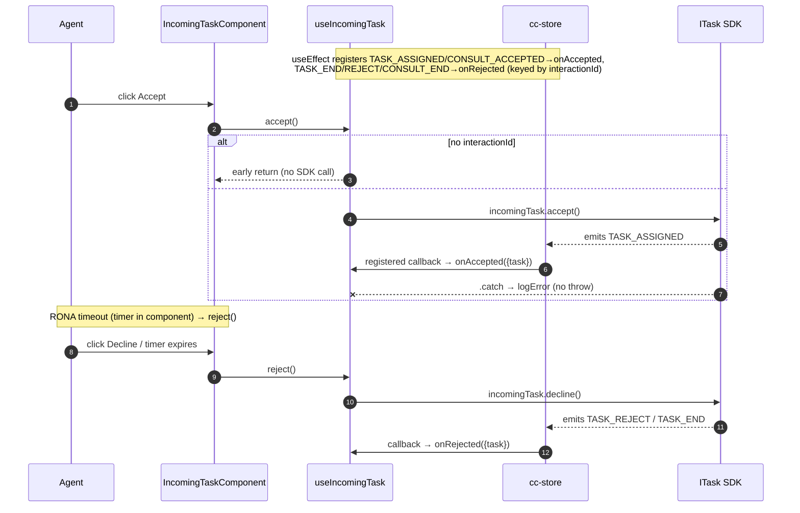
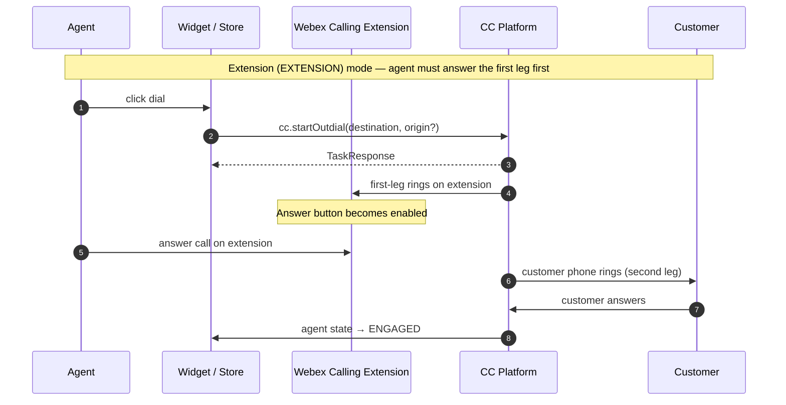
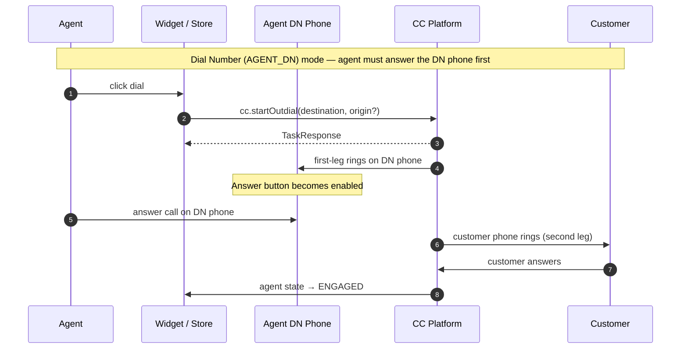
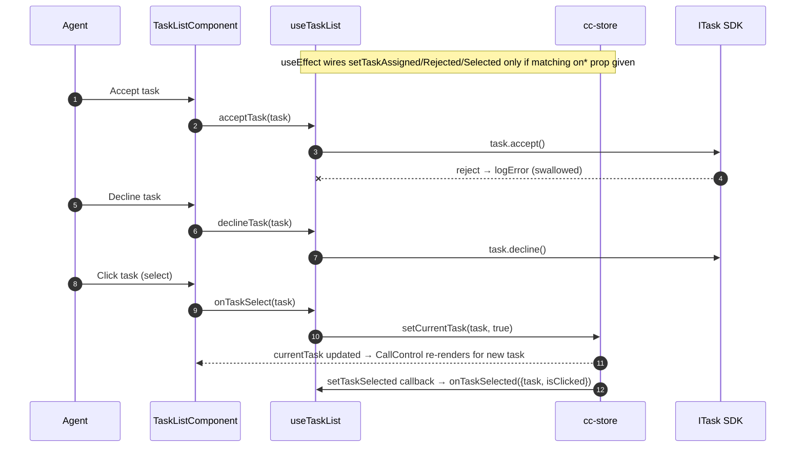
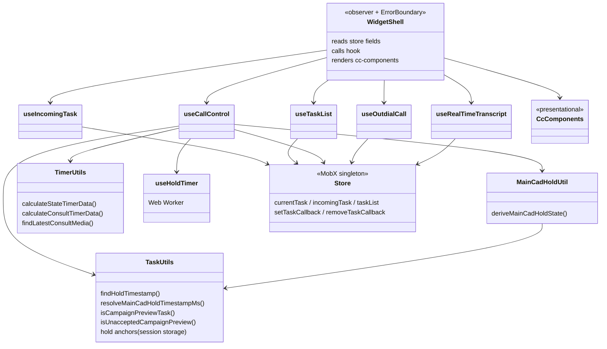
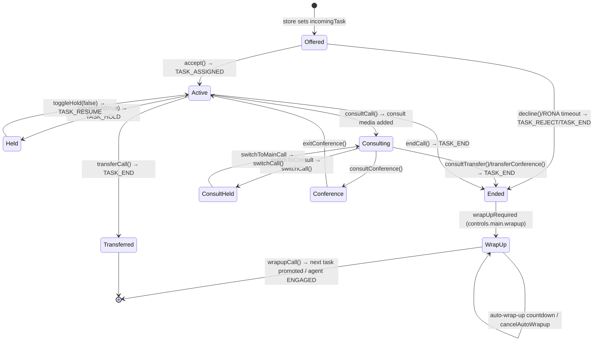

# task — SPEC

> Start here → root [`AGENTS.md`](../../../../AGENTS.md) (agent entry) · router [`SPEC_INDEX.md`](../../../../ai-docs/SPEC_INDEX.md) · system [`ARCHITECTURE.md`](../../../../ai-docs/ARCHITECTURE.md). This is the module's canonical spec: orientation, requirements, design, flows, state, UI, and tests.
> Context-efficiency: link to canonical docs — don't duplicate them. Load specs on demand per `SPEC_INDEX.md`.

## Metadata
| Field | Value |
|---|---|
| Module id | `task` |
| Source path(s) | `packages/contact-center/task/src/` |
| Doc kind | Module spec |
| Coverage score | Pending coverage assessment |
| Generated from | `module-spec` @ SDLC template library `0.1.0-draft` |
| generated_by / approved_by / updated_at | generated_by: migration agent / approved_by: pending / updated_at: 2026-08-17 |
| Validation status | not-run |

Coverage score: `Pending coverage assessment` before the first report; after assessment, replace with `<0-100%>` plus the report path/evidence. Keep manifest coverage state outside the rendered module doc metadata.

## Evidence Rules
Every generated requirement below must cite concrete source evidence using `file path`. Separate source evidence, test evidence, examples, assumptions, and gaps so validators and future agents can distinguish truth from context. Test evidence is preferred for WHY. Commit evidence is allowed only when the repository policy says history is reliable, and must include the commit hash. If evidence is missing or conflicting, ask a focused discovery question before finalizing the requirement; record unresolved answers as approved unknowns only when the human explicitly defers or does not know.

## Source Material Register
| Source doc | Scope | Decision | Detail location or disposition |
|---|---|---|---|
| `ai-docs/_archive/pre-sdlc-migration/packages/contact-center/task/ai-docs/widgets/CallControl/AGENTS.md` + `ARCHITECTURE.md` | architecture / overview / API | reconciled | Flows landed in Sequence Diagram(s); props in Public Surface. Control-visibility content re-derived from current code: the SDK-computed `task.uiControls` surface is now authoritative (see Design Overview / Requirements). |
| `ai-docs/_archive/pre-sdlc-migration/packages/contact-center/task/ai-docs/widgets/IncomingTask/AGENTS.md` + `ARCHITECTURE.md` | architecture / overview / API | reconciled | Accept/decline + RONA flow → Sequence Diagram(s); callbacks → Public Surface. |
| `ai-docs/_archive/pre-sdlc-migration/packages/contact-center/task/ai-docs/widgets/OutdialCall/AGENTS.md` + `ARCHITECTURE.md` | architecture / overview / API | reconciled | Outdial + ANI flow → Sequence Diagram(s); login-mode behavior → Use Cases / Pitfalls. |
| `ai-docs/_archive/pre-sdlc-migration/packages/contact-center/task/ai-docs/widgets/TaskList/AGENTS.md` + `ARCHITECTURE.md` | architecture / overview / API | reconciled | Task selection / accept / decline flow → Sequence Diagram(s). |
| `packages/contact-center/task/src/` | source of truth | migrated | All requirements, flows, state, and error tables derive from real code here, including the SDK `task.uiControls` control-visibility model. |

## Overview
`task` is the largest CC widget bundle: it exports six React/Web-Component widgets that together cover the full agent interaction lifecycle — being offered a task, accepting/declining it, controlling an active call (hold, mute, record, consult, transfer, conference, wrap-up), placing outbound calls, listing concurrent tasks, and rendering a live transcript. Each widget follows the repo-standard layering: a thin `observer()` widget wraps an `ErrorBoundary`, reads MobX state from `@webex/cc-store`, delegates business logic to a custom hook in `helper.ts`, and renders a presentational component from `@webex/cc-components`. The hook is the only place that touches the SDK (`task.*` / `store.cc.*`) and registers/unregisters store task-event callbacks.

A maintainer should start at `src/index.ts` (the export barrel), then `src/helper.ts` (all five hooks: `useIncomingTask`, `useTaskList`, `useCallControl`, `useOutdialCall`, `useRealTimeTranscript`). Call-control button visibility/enablement is **not** computed locally — it is read from the SDK-computed `task.uiControls` surface (`main` / `consult` / `activeLeg`) that the hook seeds from `currentTask.uiControls` (falling back to `getDefaultUIControls()`) and keeps live by subscribing to the `TASK_UI_CONTROLS_UPDATED` event. `src/Utils/` now holds the derived hold-state and timer math: `main-cad-hold.util.ts` (`deriveMainCadHoldState` — the single source of truth for the main-CAD "On Hold" state), `task-util.ts` (hold-timestamp resolution + session-storage hold anchors + campaign-preview checks), `timer-utils.ts`, and `useHoldTimer.ts`. The widget shells (`src/CallControl/index.tsx` etc.) are intentionally tiny — they only select store fields and forward props.

State is not owned here: the live task objects (`currentTask`, `incomingTask`, `taskList`), wrap-up codes, device type, feature flags, agent id, and accepted-campaign ids all live in `@webex/cc-store`. The hooks read those, call SDK methods on the `ITask` object, and register callbacks via `store.setTaskCallback(EVENT, fn, interactionId)` so SDK-emitted events flow back into widget-local `useState` and into the consumer's `on*` callbacks. `useCallControl` additionally attaches per-task listeners directly on the `ITask` (`currentTask.on(...)`) for `TASK_UI_CONTROLS_UPDATED`, `TASK_SWITCH_CALL`, `TASK_HOLD`, and `TASK_RESUME`, cleaning them up with `currentTask.off(...)` on task change/unmount.

## Purpose / Responsibility
Owns the agent-facing UI and SDK orchestration for the contact lifecycle of a single task and the agent's task list: offer→accept/decline, active-call controls (hold/resume/mute/record/consult/transfer/conference/wrap-up), outbound dialing, multi-task listing/selection, and live transcript rendering. It does NOT own task state, SDK connection, agent state/presence, or wrap-up-code configuration — those belong to `store`/SDK.

## Stack
TypeScript 5, React 18 (function components + hooks), MobX via `mobx-react-lite` `observer()`, `react-error-boundary` for fault isolation. Presentational components are imported from `@webex/cc-components`; all task/agent state and SDK access come from `@webex/cc-store` (`@webex/contact-center` SDK underneath). A `Web Worker` (created from an inline blob) drives the hold timer (`src/Utils/useHoldTimer.ts`). Tests: Jest + React Testing Library under `tests/`. Build target: distributed as part of `@webex/cc-widgets` (r2wc Web Components).

## Folder / Package Structure
```
packages/contact-center/task/src/
├── index.ts                  # Export barrel: IncomingTask, TaskList, CallControl, OutdialCall, CallControlCAD, RealTimeTranscript
├── task.types.ts             # Public prop/callback types per widget + TARGET_TYPE, DeviceTypeFlags
├── helper.ts                 # All hooks: useIncomingTask, useTaskList, useCallControl, useOutdialCall, useRealTimeTranscript
├── CallControl/index.tsx     # Active-call control widget shell (observer + ErrorBoundary)
├── CallControlCAD/index.tsx  # CallControl variant with customer-data CSS hooks (callControlClassName / consult class)
├── IncomingTask/index.tsx    # Offered-task accept/decline widget shell
├── OutdialCall/index.tsx     # Outbound dialpad widget shell
├── TaskList/index.tsx        # Concurrent-task list widget shell
├── RealTimeTranscript/index.tsx  # Live transcript widget shell
└── Utils/
    ├── task-util.ts          # Hold-timestamp resolution (findHoldTimestamp / resolveMainCadHoldTimestampMs / resolveConsultHoldTimestampMs) + session-storage hold anchors + campaign-preview checks
    ├── main-cad-hold.util.ts # deriveMainCadHoldState — single source of truth for the main-CAD "On Hold" state across consult/EP-DN/conference/refresh
    ├── constants.ts          # Media-type, max-conference-participant, timer-label, DestinationAgentType constants
    ├── timer-utils.ts        # calculateStateTimerData / calculateConsultTimerData / findLatestConsultMedia (wrap-up / post-call / consult labels)
    └── useHoldTimer.ts       # Web-Worker-backed hold-elapsed-seconds hook (uses hold anchors for refresh continuity)
```

## Key Files (source of truth)
| File | Holds |
|---|---|
| `src/index.ts` | Authoritative list of exported widgets — do not assume exports from elsewhere. |
| `src/task.types.ts` | Public prop/callback shapes per widget; `TARGET_TYPE`/`TargetType`; `DeviceTypeFlags`; re-exports `CAMPAIGN_PREVIEW_*` from store. |
| `src/helper.ts` | All hook logic and the exact SDK methods + store callbacks each operation uses; seeds/refreshes `controls` from `task.uiControls` + `TASK_UI_CONTROLS_UPDATED`. |
| `src/Utils/main-cad-hold.util.ts` | `deriveMainCadHoldState` — single source of truth for the main-CAD "On Hold" state (consult, EP/DN, conference, and refresh continuity). |
| `src/Utils/task-util.ts` | Hold-timestamp resolution + session-storage hold anchors (`readHoldAnchor`/`writeHoldAnchor`/consult variants) + campaign-preview checks (`isCampaignPreviewTask`, `isUnacceptedCampaignPreview`). |
| `src/Utils/constants.ts` | Media types, `MAX_PARTICIPANTS_IN_MULTIPARTY_CONFERENCE = 7`, timer labels, `DestinationAgentType` enum. |

## Public Surface
| Contract ID | Type | Surface | Purpose | Compatibility / deprecation | Schema / detail link | Root index |
|---|---|---|---|---|---|---|
| `cc-widgets.IncomingTask` | SDK (React component / Web Component) | `IncomingTask` — props: `incomingTask`; callbacks: `onAccepted({task})`, `onRejected({task})` | Render an offered task with accept/decline; notify consumer on accept/reject/RONA | Stable; adding optional props/callbacks = minor | `src/task.types.ts` (`IncomingTaskProps`) | [`CONTRACTS.md`](../../../../ai-docs/CONTRACTS.md) |
| `cc-widgets.TaskList` | SDK (React component / Web Component) | `TaskList` — props: `hasCampaignPreviewEnabled?`; callbacks: `onTaskAccepted(task)`, `onTaskDeclined(task, reason)`, `onTaskSelected({task, isClicked})` | List concurrent tasks; accept/decline/select | Stable; `hasCampaignPreviewEnabled` defaults true | `src/task.types.ts` (`TaskListProps`) | [`CONTRACTS.md`](../../../../ai-docs/CONTRACTS.md) |
| `cc-widgets.CallControl` | SDK (React component / Web Component) | `CallControl` — callbacks: `onHoldResume({isHeld,task})`, `onEnd({task})`, `onWrapUp({task,wrapUpReason})`, `onRecordingToggle({isRecording,task})`, `onToggleMute({isMuted,task})`; props: `conferenceEnabled?`, `consultTransferOptions?`, `callControlClassName?`, `callControlConsultClassName?` | Active-call controls for `store.currentTask` | Stable; `conferenceEnabled` defaults `true` | `src/task.types.ts` (`CallControlProps`) | [`CONTRACTS.md`](../../../../ai-docs/CONTRACTS.md) |
| `cc-widgets.CallControlCAD` | SDK (React component / Web Component) | `CallControlCAD` — same callbacks/props as `CallControl`; emphasizes `callControlClassName` / `callControlConsultClassName` | CallControl variant styled for a customer-data layout | Stable; same surface as CallControl | `src/task.types.ts` (`CallControlProps`) | [`CONTRACTS.md`](../../../../ai-docs/CONTRACTS.md) |
| `cc-widgets.OutdialCall` | SDK (React component / Web Component) | `OutdialCall` — props: `isAddressBookEnabled?` (default `true`); no consumer callbacks | Outbound dialpad + ANI selection; disabled when a telephony task is active | Stable | `src/task.types.ts` (`OutdialProps`) | [`CONTRACTS.md`](../../../../ai-docs/CONTRACTS.md) |
| `cc-widgets.RealTimeTranscript` | SDK (React component / Web Component) | `RealTimeTranscript` — props: `liveTranscriptEntries?`, `className?` | Render live transcript for `store.currentTask` | Stable | `src/task.types.ts` (`RealTimeTranscriptProps`) | [`CONTRACTS.md`](../../../../ai-docs/CONTRACTS.md) |

Compatibility notes:
- Adding an optional prop/callback is additive (minor); removing or renaming one, or changing a callback payload shape, is breaking (major) — these widgets are consumed via r2wc Web Components in `@webex/cc-widgets`.
- `conferenceEnabled` is normalized to `true` when undefined via the `useCallControl` default parameter (the shells forward the raw prop); consumers relying on `undefined` getting `false` would break.

### CallControl button → hook function → SDK method
Each active-call control maps a UI button to a `useCallControl` function and the exact `ITask`/`cc` SDK method it invokes (visibility/enablement of each button comes from the SDK `task.uiControls`, see `TASK-R-015`):

| Button | Hook function | SDK method | Description |
|---|---|---|---|
| Hold | `toggleHold(true)` | `currentTask.hold()` | Put active call on hold |
| Resume | `toggleHold(false)` | `currentTask.resume()` | Resume from hold |
| Mute | `toggleMute()` | `currentTask.toggleMute()` | Mute/unmute microphone (no-op when `controls.main.mute.isVisible` is false) |
| Transfer | `transferCall(to, type)` | `currentTask.transfer(...)` | Blind transfer (re-throws on error) |
| Consult | `consultCall(dest, type, allow)` | `currentTask.consult(...)` | Initiate consult |
| End consult | `endConsultCall()` | `currentTask.endConsult(...)` | End consult (logs only; SDK auto-retries) |
| Complete transfer | `consultTransfer()` | `currentTask.transfer(...)` / `currentTask.transferConference()` | Complete consult as 1:1 transfer or conference transfer |
| Conference | `consultConference()` | `currentTask.consultConference()` | Merge consult into a conference |
| Exit conference | `exitConference()` | `currentTask.exitConference()` | Leave the conference |
| Switch leg | `switchToConsult()` / `switchToMainCall()` | `currentTask.switchCall()` | Toggle between consult and main legs |
| End call | `endCall()` | `currentTask.end()` | End the active call |
| Record toggle | `toggleRecording()` | `currentTask.pauseRecording()` / `resumeRecording({autoResumed:false})` | Pause/resume recording |
| Wrap-up | `wrapupCall(reason, auxCodeId)` | `currentTask.wrapup(...)` | Submit wrap-up code |
| Cancel auto-wrap-up | `cancelAutoWrapup()` | `currentTask.cancelAutoWrapupTimer()` | Cancel the auto-wrap-up countdown |

### Transfer / consult destination types and options
Consult/transfer destinations are keyed by the current `TARGET_TYPE` map (`src/task.types.ts`): `agent` (buddy agent), `queue` (queue), `entryPoint` (entry point / EP-DN), and `dialNumber` (phone number / DN). The `consultTransferOptions` prop configures which destination pickers the presentational component shows:

| `consultTransferOptions` field | Type | Effect |
|---|---|---|
| `showAgents?` | `boolean` | Show the buddy-agents list (`store.getBuddyAgents`) |
| `showQueues?` | `boolean` | Show queues / entry points (`store.getQueues` / `getEntryPoints`) |
| `showAddressBook?` | `boolean` | Show address-book entries (`store.getAddressBookEntries`) |

### CallControl vs CallControlCAD
Both variants use the same `useCallControl` hook and share the same callbacks/props; they differ only in layout and the customer-attached-data (CAD) panel:

| Feature | CallControl | CallControlCAD |
|---|---|---|
| Call controls | Yes | Yes |
| CAD panel / customer-data display | No | Yes |
| Styling hooks | — | `callControlClassName` / `callControlConsultClassName` |
| Layout | Compact | Extended with CAD sidebar |
| Use case | Simple call handling | CRM / customer-data integration scenarios |

## Requires (dependencies)
- `@webex/cc-store` (peer, internal): MobX singleton supplying `currentTask`, `incomingTask`, `taskList`, `wrapupCodes`, `deviceType`, `featureFlags`, `agentId`, `isMuted`, `isDeclineButtonEnabled`, `acceptedCampaignIds`, `realtimeTranscriptionData`, `lastConsultDestination`, `isQueueConsultInProgress`, `currentConsultQueueId`, `logger`, `cc` (SDK), plus `setTaskCallback`/`removeTaskCallback`, `setTaskAssigned`/`setTaskRejected`/`setTaskSelected`, `setCurrentTask`, `setIsMuted`, `setState`, `setIsQueueConsultInProgress`/`setCurrentConsultQueueId`/`setLastConsultDestination`/`setConsultStartTimeStamp`, `handleOutdialFailed`, `getBuddyAgents`, `getAddressBookEntries`, `getEntryPoints`, `getQueues`, and helpers `getConferenceParticipants`, `findMediaResourceId`, `isInteractionOnHold`, `isSecondaryAgent`, `isSecondaryEpDnAgent`, `MEDIA_TYPE_TELEPHONY_LOWER`, `CAMPAIGN_PREVIEW_*`, `TASK_EVENTS`. Source of truth for event names: `packages/contact-center/store/src/store.types.ts`.
- `@webex/cc-components` (internal): presentational components (`IncomingTaskComponent`, `TaskListComponent`, `CallControlComponent`, `CallControlCADComponent`, `OutdialCallComponent`, `RealTimeTranscriptComponent`) and types (`ControlProps`, `TaskProps`, `OutdialCallProps`, `RealTimeTranscriptComponentProps`, `RealTimeTranscriptEntry`, `CampaignCallProcessingDetails`).
- `@webex/contact-center` (SDK, transitive via store): the `ITask` interface, its SDK-computed `uiControls` surface (`TaskUIControls` type + `getDefaultUIControls()` fallback), and methods invoked here (`accept`, `decline`, `hold`, `resume`, `end`, `wrapup`, `cancelAutoWrapupTimer`, `pauseRecording`, `resumeRecording`, `toggleMute`, `transfer`, `consult`, `endConsult`, `consultTransfer`, `consultConference`, `transferConference`, `exitConference`, `switchCall`, `on`/`off`), `cc.startOutdial`, `cc.getOutdialAniEntries`, `cc.addressBook.getEntries`, `cc.agentConfig`.
- `react` ^18, `mobx-react-lite`, `react-error-boundary`.
- Browser `Web Worker` + `Blob`/`URL.createObjectURL` for the hold timer (graceful fallback to `holdTime = 0` when no hold timestamp).

## Requirements
| ID | WHAT | WHY | Source Evidence | Test / Example Evidence | Assumptions / Gaps | Confidence |
|---|---|---|---|---|---|---|
| `TASK-R-001` | `IncomingTask.accept()` calls `incomingTask.accept()` only when `incomingTask.data.interactionId` exists; SDK rejection is caught and logged, never thrown to the consumer. | Prevents calling SDK with no task and avoids crashing the widget on backend failure. | `src/helper.ts` (`useIncomingTask.accept`) | `tests/helper.ts` ("should return if there is no taskId for incoming task", "should handle errors when accepting a task", "should handle errors in accept method") | none | PRESENT |
| `TASK-R-002` | `IncomingTask.reject()` calls `incomingTask.decline()` (guarded by interactionId); RONA timeout reaches the same decline path via the timer in the presentational component. | Decline and RONA must converge on `decline()` so the backend reassigns the task. | `src/helper.ts` (`useIncomingTask.reject`) | `tests/helper.ts` ("should handle errors when declining a task", "should call onRejected if it is provided") | RONA countdown UI lives in `@webex/cc-components`, not this module | PRESENT |
| `TASK-R-003` | `useIncomingTask` registers callbacks for `TASK_ASSIGNED`/`TASK_CONSULT_ACCEPTED` (→ `onAccepted`) and `TASK_END`/`TASK_REJECT`/`TASK_CONSULT_END` (→ `onRejected`), keyed by interactionId, and removes them on unmount/task change. | Consumer notifications must fire on real SDK events and listeners must not leak across tasks. | `src/helper.ts` (`useIncomingTask` `useEffect`) | `tests/helper.ts` ("should setup event listeners for the incoming call", "shouldnt setup event listeners is not incoming call", "should call onAccepted if it is provided") | Cleanup uses different fn references than registration for some events (see Pitfalls) | PRESENT |
| `TASK-R-004` | `TaskList.acceptTask`/`declineTask` call `task.accept()`/`task.decline()` per task; `onTaskSelect` calls `store.setCurrentTask(task, true)`. | List actions operate per-task and selection switches the active `currentTask` for CallControl. | `src/helper.ts` (`useTaskList`) | `tests/helper.ts` ("should call onTaskAccepted callback when provided", "should call onTaskDeclined callback when provided", "should call onTaskSelected callback when provided", "should handle errors in onTaskSelect") | none | PRESENT |
| `TASK-R-005` | `useTaskList` wires `store.setTaskAssigned`/`setTaskRejected`/`setTaskSelected` only when the matching consumer callback (`onTaskAccepted`/`onTaskDeclined`/`onTaskSelected`) is provided; each wrapped callback is try/caught. | Avoid registering no-op store callbacks and isolate consumer-thrown errors. | `src/helper.ts` (`useTaskList` `useEffect`) | `tests/helper.ts` ("should not call onTaskAccepted if it is not provided", "should handle errors in taskAssigned callback", "should handle errors in taskSelected callback") | none | PRESENT |
| `TASK-R-006` | `CallControl.toggleHold(true/false)` calls `currentTask.hold()`/`currentTask.resume()`; `TASK_HOLD`/`TASK_RESUME` events fire `onHoldResume({isHeld, task})`. | Hold/resume must reflect real SDK state to the consumer. | `src/helper.ts` (`useCallControl.toggleHold`, `holdCallback`, `resumeCallback`) | `tests/helper.ts` ("should call onHoldResume with hold=true and handle success", "...hold=false...", "should log an error if hold fails", "should log an error if resume fails") | none | PRESENT |
| `TASK-R-007` | `toggleRecording` calls `pauseRecording()` when `isRecording` else `resumeRecording({autoResumed:false})`; `TASK_RECORDING_PAUSED`/`TASK_RECORDING_RESUMED` callbacks set `isRecording` and fire `onRecordingToggle`. | Recording UI state must track SDK events, not just the click. | `src/helper.ts` (`useCallControl.toggleRecording`, `pauseRecordingCallback`, `resumeRecordingCallback`) | `tests/helper.ts` ("should pause the recording when pauseResume is called with true", "should fail and log error if pause failed", "should resume the recording when pauseResume is called with false") | Subscription uses `TASK_RECORDING_PAUSED/RESUMED`; cleanup removes `CONTACT_RECORDING_PAUSED/RESUMED` (mismatch — see Pitfalls) | PRESENT |
| `TASK-R-008` | `toggleMute` no-ops with a warning when the SDK-computed `controls.main.mute.isVisible` is false; otherwise `await currentTask.toggleMute()`, then `store.setIsMuted(intended)` and `onToggleMute` only after success; on failure it reports the prior `isMuted`. | Mute state must reflect SDK truth even under rapid toggles or failure. | `src/helper.ts` (`useCallControl.toggleMute`) | `tests/helper.ts` ("should successfully toggle mute from unmuted to muted", "should handle multiple rapid toggleMute calls correctly", "should handle mute control not being available", "should not call onToggleMute callback on error if not provided") | none | PRESENT |
| `TASK-R-009` | `wrapupCall(reason, auxCodeId)` calls `currentTask.wrapup(...)`; on resolve it promotes the first remaining task in `store.taskList` to `currentTask` and sets agent state to ENGAGED. | After wrap-up the agent should auto-focus the next task and return to an engaged state. | `src/helper.ts` (`useCallControl.wrapupCall`) | `tests/helper.ts` ("should call wrapupCall", "should log an error if wrapup fails") | ENGAGED label/username are local constants (`ENGAGED_LABEL`, `ENGAGED_USERNAME`) | PRESENT |
| `TASK-R-010` | Auto-wrap-up: when `currentTask.autoWrapup` and the SDK-computed `controls.main.wrapup` are present, a 1s interval counts `secondsUntilAutoWrapup` down from `autoWrapup.getTimeLeftSeconds()`; `cancelAutoWrapup` calls `currentTask.cancelAutoWrapupTimer()`. | Show and allow cancellation of the auto-wrap-up countdown. | `src/helper.ts` (`useCallControl` auto-wrapup `useEffect`, `cancelAutoWrapup`) | `tests/helper.ts` ("should initialize secondsUntilAutoWrapup to null when auto wrap-up is not active", "should call cancelAutoWrapup successfully", "should handle cancelAutoWrapup when currentTask is missing") | none | PRESENT |
| `TASK-R-011` | `consultCall(dest, type, allowParticipantsToInteract)` sends `holdParticipants: !allowParticipantsToInteract`; for `type==='queue'` it sets/clears `store.isQueueConsultInProgress` + `currentConsultQueueId` around the call, including on error. | Queue consult requires tracking the in-flight queue id so `endConsult` can pass it. | `src/helper.ts` (`useCallControl.consultCall`, `endConsultCall`) | `tests/helper.ts` ("should call consultCall successfully", "should call consultCall with allowParticipantsToInteract set to true", "should call endConsultCall with queue parameters when queue consult is in progress") | none | PRESENT |
| `TASK-R-012` | `consultTransfer` calls `currentTask.transferConference()` when `currentTask.data.isConferenceInProgress` or the SDK marks a `transferConference` control visible; otherwise it resolves the consult destination (from `store.lastConsultDestination`, recovering from consult-media participants after a refresh) and calls `currentTask.transfer(destination)`; missing `currentTask.data` or an unresolved destination early-returns with a logged error, and SDK failures re-throw. | Conference and 1:1 consult complete via different SDK calls; refresh must not lose the transfer target. | `src/helper.ts` (`useCallControl.consultTransfer`) | `tests/helper.ts` ("should call consultTransfer successfully", "should handle errors when calling consultTransfer", "should handle consultTransfer when currentTask data is missing") | none | PRESENT |
| `TASK-R-013` | `transferCall(to, type)` awaits `currentTask.transfer({to, destinationType})` and re-throws on error (unlike hold/end/wrapup which swallow). | Blind transfer failures must surface to the calling modal so the UI can react. | `src/helper.ts` (`useCallControl.transferCall`) | `tests/helper.ts` ("should call transferCall successfully", "should handle rejection when loading buddy agents") | Re-throw is intentional and differs from hold/end/wrapup which only log | PRESENT |
| `TASK-R-014` | `switchToConsult`/`switchToMainCall` both call `currentTask.switchCall()`; `exitConference`/`consultConference` proxy the SDK directly. All four log success and re-throw on error. | Switching between consult and main legs and conference control go straight through the SDK. | `src/helper.ts` (`useCallControl.switchToConsult/switchToMainCall/exitConference/consultConference`) | `tests/helper.ts` ("should call switchToMainCall successfully", "should handle switchToMainCall error", "should call switchToConsult successfully", "should call consultConference successfully", "should call exitConference successfully") | none | PRESENT |
| `TASK-R-015` | Call-control button visibility/enablement is supplied by the SDK-computed `task.uiControls` (`TaskUIControls`: `main`/`consult` control maps + `activeLeg`), not computed in the widget. The hook seeds `controls` from `currentTask.uiControls ?? getDefaultUIControls()` and updates it on the `TASK_UI_CONTROLS_UPDATED` event; when there is no task it resets to `getDefaultUIControls()`. | Button state must reflect the SDK's authoritative control model and degrade to safe defaults when no task is present. | `src/helper.ts` (`useCallControl` `controls` state + `TASK_UI_CONTROLS_UPDATED` `useEffect`) | `tests/helper.ts` ("should add event listeners on task object", "should expose disabled consult control when SDK sets consult disabled", "should expose enabled consult control when SDK sets consult enabled") | none | PRESENT |
| `TASK-R-016` | `deriveMainCadHoldState({currentTask, controls, agentId})` computes the main-CAD `isHeld` boolean + hold interaction + `holdTimestampMs`, reconciling the freshest of `currentTask.data` vs the state-machine `state.context.taskData` snapshot and covering simple consult (Agent 2), EP/DN consult, nested/plain conference hold, and refresh continuity via `resolveMainCadHoldTimestampMs`. | The "On Hold" chip/timer and Pause/Resume toggle must stay correct across consult, EP/DN, and conference transitions and after a page refresh. | `src/Utils/main-cad-hold.util.ts` (`deriveMainCadHoldState`, `getMainCadHold`) | `tests/helper.ts` ("forces isHeld=false on AgentContactUnheld even if conferenceHoldParticipant is stale true", "forces isHeld=true on AgentContactHeld regardless of media lag", "sets isHeld=false for EP/DN consulted agent when own mainCall leg is parked", "sets isHeld=false for consulted agent when only consult media is on hold") | none | PRESENT |
| `TASK-R-017` | `useHoldTimer(mainCallOnHold, holdTimestampMs, holdDataVersion, interactionId)` starts a Web-Worker interval from the resolved hold timestamp, persists a session-storage hold anchor for refresh continuity (`writeHoldAnchor`/`readHoldAnchor`), and resets to 0 / clears the anchor when not held. | Hold timer must survive refresh and clean up its worker on resume/unmount. | `src/Utils/useHoldTimer.ts` | `tests/utils/useHoldTimer.test.ts`; `tests/helper.ts` ("should initialize holdTime to 0", "should start the timer when holdTimestamp is present in the correct media object", "should not start the timer when holdTimestamp is missing") | none | PRESENT |
| `TASK-R-018` | `calculateStateTimerData(currentTask, controls, agentId)` prioritizes Wrap Up (when `controls.main.wrapup.isVisible`) over Post Call; `calculateConsultTimerData(currentTask, controls, agentId)` returns `Consult Requested` (initiated), `Consult on Hold` (consult media held or initiator parked on the active `main` leg), else `Consulting`, using `findLatestConsultMedia` and falling back to participant `lastUpdated` when no consult timestamp. | Drives the correct timer label/timestamp in CallControl from the SDK controls + interaction data. | `src/Utils/timer-utils.ts` (`calculateStateTimerData`, `calculateConsultTimerData`, `findLatestConsultMedia`) | `tests/utils/timer-utils.test.ts` ("should return Wrap Up label when in wrapup state", "should return Consult on Hold when consult is held", "should return Consult Requested label when consult is initiated") | none | PRESENT |
| `TASK-R-019` | `OutdialCall.startOutdial(destination, origin?)` alerts and aborts on empty/whitespace destination; passes `origin` (ANI) only when provided; SDK rejection is logged, not thrown. | Prevent empty outdials and honor optional caller-ID selection. | `src/helper.ts` (`useOutdialCall.startOutdial`) | `tests/OutdialCall/index.tsx` (render + `isAddressBookEnabled` cases) | No direct unit test asserts the empty-destination alert (gap) | WEAK |
| `TASK-R-020` | `getOutdialANIEntries` throws if `cc.agentConfig.outdialANIId` is missing, else returns `cc.getOutdialAniEntries({outdialANI})`; `isTelephonyTaskActive` is true iff any task in `store.taskList` has `mediaType === telephony`. | ANI selection requires a configured ANI id; outdial is gated on no active telephony task. | `src/helper.ts` (`useOutdialCall.getOutdialANIEntries`, `isTelephonyTaskActive`) | `tests/OutdialCall/index.tsx` (component render); helper outdial paths in `tests/helper.ts` | No explicit unit test for the "no outdialANIId throws" branch (gap) | WEAK |
| `TASK-R-021` | `useRealTimeTranscript` maps `realtimeTranscriptionData` to `RealTimeTranscriptEntry[]` only when `currentTaskId` is set and data is non-empty; otherwise returns `liveTranscriptEntries` unchanged. Speaker is normalized (AGENT→"You", CUSTOMER/CALLER→"Customer"). | Live transcript must key off the active task and normalize speaker labels. | `src/helper.ts` (`useRealTimeTranscript`, `mapTranscriptLineToEntry`, `getTranscriptSpeaker`) | `tests/RealtimeTranscript/index.tsx` ("passes props to useRealtimeTranscript hook", "renders fallback when an error is thrown") | none | PRESENT |
| `TASK-R-022` | Each widget shell renders inside an `ErrorBoundary` whose `fallbackRender` returns empty and `onError` calls `store.onErrorCallback(widgetName, error)` when set; absence of the callback must not throw. | A crashing widget must isolate and report, never break the host. | `src/{CallControl,CallControlCAD,IncomingTask,TaskList,OutdialCall,RealTimeTranscript}/index.tsx` | `tests/CallControl/index.tsx`, `tests/CallControlCAD/index.tsx`, `tests/IncomingTask/index.tsx`, `tests/TaskList/index.tsx`, `tests/OutdialCall/index.tsx`, `tests/RealtimeTranscript/index.tsx` (each has an ErrorBoundary + "onErrorCallback not set" case) | none | PRESENT |
| `TASK-R-023` | `CallControl`/`CallControlCAD` render nothing when there is no `currentTask` or when the task is an unaccepted campaign preview (`isUnacceptedCampaignPreview(task, acceptedCampaignIds)`). | Controls must only appear for an accepted, active task — matches Agent Desktop campaign-preview behavior. | `src/CallControl/index.tsx`, `src/CallControlCAD/index.tsx`, `src/Utils/task-util.ts` (`isCampaignPreviewTask`, `isUnacceptedCampaignPreview`) | None found for the unaccepted-campaign-preview early return (gap) | Campaign-preview gating relies on `store.acceptedCampaignIds`, not `participants.hasJoined` | WEAK |

## Design Overview
Every widget is the same four-layer pipeline. The shell (`*/index.tsx`) is an `observer()` that destructures the store fields it needs, builds a hook-input object, calls the hook, merges hook output with extra store fields, and renders the matching `cc-components` component — all wrapped in an `ErrorBoundary` that funnels crashes to `store.onErrorCallback`. The shells contain almost no logic; the only branching there is CallControl's "no task / unaccepted campaign preview → render empty" guard (`conferenceEnabled` defaulting to `true` happens in the `useCallControl` signature).

`helper.ts` holds all behavior. Each hook (a) registers SDK-event callbacks through `store.setTaskCallback(EVENT, fn, interactionId)` in a `useEffect` and removes them in cleanup, (b) exposes imperative actions (`accept`, `toggleHold`, `consultCall`, `startOutdial`, …) that call `ITask`/`cc` SDK methods, and (c) derives view state. The most complex hook, `useCallControl`, additionally maintains a dozen `useState` values (recording, buddy agents, consult agent name, target type, timers, conference participants) and holds `controls` in state — seeded from `currentTask.uiControls ?? getDefaultUIControls()` and refreshed from the SDK `TASK_UI_CONTROLS_UPDATED` event. It also listens on the task (`currentTask.on`) for `TASK_HOLD`/`TASK_RESUME`/`TASK_SWITCH_CALL` to bump a `holdDataVersion` that re-drives the derived hold state.

`Utils/` is pure logic split out for testability: `main-cad-hold.util.ts` (`deriveMainCadHoldState`) derives the main-CAD `isHeld` boolean and hold timestamp from the SDK `controls`, the interaction media, and the freshest task snapshot; `task-util.ts` resolves hold timestamps and persists session-storage hold anchors and checks campaign-preview state; `timer-utils.ts` and `useHoldTimer.ts` compute timer labels/elapsed times. Keeping these pure means the hold/consult-state logic and timer math are unit-tested without rendering. Button visibility itself is no longer computed here — it comes from the SDK-provided `task.uiControls`.

Why this shape: the one-directional layering (`widget → hook → component → store → SDK`) keeps the SDK surface in exactly one file per package and lets MobX `observer()` re-render widgets reactively when the store's task observables change, while consumer callbacks (`on*`) are the only outward coupling.

## Data Flow
Transport is in-process MobX reactivity inward and SDK promise calls + SDK event callbacks outward. SDK events arrive over the SDK's transport (WebSocket/HTTP underneath, owned by the SDK, not this module) and are surfaced as `store.setTaskCallback` invocations.

```mermaid
flowchart LR
  SDK[("@webex/contact-center SDK")] -->|emits task events| Store[("@webex/cc-store (MobX)")]
  Store -->|observable: currentTask / incomingTask / taskList| Widget[Widget shell (observer + ErrorBoundary)]
  Widget -->|hook input props| Hook[helper.ts hook]
  Hook -->|view state + actions| Component[cc-components presentational]
  Component -->|user action| Hook
  Hook -->|task.* / cc.* SDK calls| SDK
  Hook -->|setTaskCallback EVENT, fn, interactionId| Store
  Store -->|invokes registered callback| Hook
  Hook -->|on* callbacks| Consumer[Host app]
  SDK -->|task.uiControls + TASK_UI_CONTROLS_UPDATED| Hook
  Hook -->|deriveMainCadHoldState / timer utils| Utils[Utils/*]
```

## Sequence Diagram(s)
Sequence coverage:

| Operation group | Diagram | Failure / recovery coverage |
|---|---|---|
| Offer → accept / decline (IncomingTask) + RONA | Incoming task accept/decline | RONA timeout path; SDK reject caught+logged; missing interactionId early-return |
| Hold / resume / record / mute / end (CallControl) | Active-call controls | Hold/resume/record/mute SDK rejection logged; mute reverts on failure and no-ops when `controls.main.mute` hidden; recording subscribe + cleanup both symmetric on `TASK_RECORDING_PAUSED/RESUMED` |
| Consult / transfer / conference (CallControl) | Consult & transfer | Queue-consult flag rollback on error; `transferCall`/`consultTransfer` re-throw; `endConsultCall` logs only (SDK auto-retry); conference vs 1:1 destination branch with refresh recovery |
| Wrap-up (manual + auto) | Wrap-up | Auto-wrap-up countdown + cancel; wrapup SDK rejection logged; next-task promotion |
| Outbound dial (OutdialCall) | Outdial | Empty-destination alert+abort; missing ANI id throws; SDK reject logged |
| Outbound dial post-connect by login mode | Outdial login-mode (Desktop / Extension / DN) | Desktop auto-connects the agent leg; Extension/DN require the agent to answer the first leg before the customer (second leg) is dialed |
| Task list select / accept / decline (TaskList) | Task list actions | Per-task accept/decline reject logged; selection updates currentTask |



```mermaid
sequenceDiagram
  autonumber
  participant A as Agent
  participant C as CallControlComponent
  participant H as useCallControl
  participant S as cc-store
  participant SDK as ITask SDK
  Note over H,S: useEffect subscribes TASK_HOLD/RESUME/END/TASK_WRAPUP/TASK_WRAPPEDUP/<br/>TASK_RECORDING_PAUSED/RESUMED (symmetric cleanup)
  A->>C: Hold
  C->>H: toggleHold(true)
  H->>SDK: currentTask.hold()
  SDK-->>S: TASK_HOLD
  S->>H: holdCallback → onHoldResume({isHeld:true,task})
  SDK--xH: hold rejection → logger.error (swallowed)
  A->>C: Mute
  C->>H: toggleMute()
  alt controls.main.mute.isVisible == false
    H-->>C: warn + no-op
  else
    H->>SDK: await currentTask.toggleMute()
    SDK-->>H: success → store.setIsMuted(intended); onToggleMute(intended)
    SDK--xH: failure → onToggleMute(previous isMuted)
  end
  A->>C: Record toggle
  C->>H: toggleRecording()
  alt isRecording
    H->>SDK: currentTask.pauseRecording()
    SDK-->>S: TASK_RECORDING_PAUSED → isRecording=false; onRecordingToggle
  else
    H->>SDK: currentTask.resumeRecording({autoResumed:false})
    SDK-->>S: TASK_RECORDING_RESUMED → isRecording=true
  end
  A->>C: End
  C->>H: endCall()
  H->>SDK: currentTask.end()
  SDK-->>S: TASK_END → endCallCallback → onEnd({task})
```

```mermaid
sequenceDiagram
  autonumber
  participant A as Agent
  participant C as CallControlComponent
  participant H as useCallControl
  participant S as cc-store
  participant SDK as ITask SDK
  A->>C: Consult (select dest)
  C->>H: consultCall(dest, type, allowParticipantsToInteract)
  alt type == queue
    H->>S: setIsQueueConsultInProgress(true); setCurrentConsultQueueId(dest)
  end
  H->>SDK: currentTask.consult({to, destinationType, holdParticipants:!allow})
  alt success
    SDK-->>H: resolved
    H->>S: clear queue-consult flags
  else error
    SDK--xH: rejected
    H->>S: clear queue-consult flags (rollback)
    H-->>C: throw (caller handles)
  end
  A->>C: Complete transfer
  C->>H: consultTransfer()
  alt isConferenceInProgress / transferConference control visible
    H->>SDK: currentTask.transferConference()
  else
    Note over H,S: resolve destination from store.lastConsultDestination<br/>(recover from consult-media participants after refresh)
    H->>SDK: currentTask.transfer(destination)
  end
  Note over H,SDK: Blind transfer: transferCall(to,type) → currentTask.transfer(...) ; on error RE-THROWS
  A->>C: End consult
  C->>H: endConsultCall()
  H->>SDK: currentTask.endConsult({isConsult:true, taskId, queueId?})
  SDK--xH: error → logError only (no throw; SDK auto-retries)
```

```mermaid
sequenceDiagram
  autonumber
  participant A as Agent
  participant C as CallControlComponent
  participant H as useCallControl
  participant S as cc-store
  participant SDK as ITask SDK
  Note over H: auto-wrapup useEffect: if currentTask.autoWrapup && controls.main.wrapup<br/>→ setInterval 1s counting secondsUntilAutoWrapup down from autoWrapup.getTimeLeftSeconds()
  alt manual wrap-up
    A->>C: select wrap-up code
    C->>H: wrapupCall(reason, auxCodeId)
    H->>SDK: currentTask.wrapup({wrapUpReason, auxCodeId})
    SDK-->>H: resolved
    H->>S: setCurrentTask(firstRemaining); setState(ENGAGED)
    SDK--xH: rejected → logError (swallowed)
  else auto wrap-up cancel
    A->>C: Cancel
    C->>H: cancelAutoWrapup()
    H->>SDK: currentTask.cancelAutoWrapupTimer()
  end
```

```mermaid
sequenceDiagram
  autonumber
  participant A as Agent
  participant C as OutdialCallComponent
  participant H as useOutdialCall
  participant S as cc-store
  participant SDK as cc SDK
  C->>H: getOutdialANIEntries()
  alt no agentConfig.outdialANIId
    H-->>C: throw Error("No OutdialANI Id received.")
  else
    H->>SDK: cc.getOutdialAniEntries({outdialANI})
    SDK-->>C: ANI entries
  end
  A->>C: enter number + dial
  C->>H: startOutdial(destination, origin?)
  alt empty/whitespace destination
    H-->>A: alert("Destination number is required..."); abort
  else
    H->>SDK: cc.startOutdial(...[destination, origin?])
    SDK-->>H: resolved → logger.info
    SDK--xH: rejected → logger.error (swallowed)
  end
  Note over H: outdial gated: isTelephonyTaskActive true if any taskList item mediaType==telephony
```

After `cc.startOutdial()` resolves, the platform first establishes the agent-leg call before dialing the customer (second leg). How the first leg connects — and whether the agent must manually answer — depends on the agent's login/device mode (`store.deviceType`). These are three distinct flows, not one.

```mermaid
sequenceDiagram
  autonumber
  participant A as Agent
  participant W as Widget / Store
  participant P as CC Platform
  participant Cu as Customer
  Note over A,Cu: Desktop (BROWSER) mode — customer rings directly, agent auto-connects
  A->>W: click dial
  W->>P: cc.startOutdial(destination, origin?)
  P-->>W: TaskResponse
  P->>Cu: customer phone rings (second leg)
  Cu->>P: customer answers
  P->>W: agent auto-connects → ENGAGED
  Note over A,W: Accept button visible but disabled during the brief popup; agent never manually accepts
```







## Class / Component Relationships

The six widget shells are siblings that each bind to exactly one hook and one presentational component. Only `useCallControl` composes the `Utils/*` helpers (`deriveMainCadHoldState`, the timer utils, and `useHoldTimer`) and reads the SDK-computed `task.uiControls` for button state. All hooks depend on the shared `store` singleton for state and event wiring; none derive button visibility locally, and none import the SDK for connection concerns (they only touch the `ITask`/`cc` objects the store supplies).

## Use Cases
- **UC-1 Accept an offered task (IncomingTask):** Agent → store sets `incomingTask` → widget renders card → Agent clicks Accept → `accept()` → `incomingTask.accept()` → `TASK_ASSIGNED` → `onAccepted`. Evidence: `src/helper.ts` (`useIncomingTask`), `tests/helper.ts` ("should call onAccepted if it is provided").
- **UC-2 Decline / RONA timeout (IncomingTask):** Agent clicks Decline or RONA timer expires → `reject()` → `incomingTask.decline()` → `TASK_REJECT`/`TASK_END` → `onRejected`. Evidence: `src/helper.ts` (`useIncomingTask.reject`), `tests/helper.ts` ("should call onRejected if it is provided"). UI flow: countdown badge on the card; on timeout the card auto-dismisses.
- **UC-3 Hold / resume active call (CallControl):** Agent clicks Hold → `toggleHold(true)` → `currentTask.hold()` → `TASK_HOLD` → hold timer starts via `useHoldTimer`, `onHoldResume({isHeld:true})`. Evidence: `src/helper.ts`, `src/Utils/useHoldTimer.ts`, `tests/helper.ts` (hold/resume cases). UI flow: Hold button toggles to Resume; "Hold" elapsed timer shown.
- **UC-4 Toggle recording (CallControl):** Agent clicks record toggle → `toggleRecording()` → `pauseRecording()`/`resumeRecording()` → `TASK_RECORDING_PAUSED/RESUMED` → `isRecording` flips, `onRecordingToggle`. Evidence: `src/helper.ts`, `tests/helper.ts` (recording cases).
- **UC-5 Mute / unmute (CallControl):** Agent clicks mute → `toggleMute()` (gated by SDK `controls.main.mute.isVisible`) → `currentTask.toggleMute()` → `store.setIsMuted`, `onToggleMute`. Evidence: `src/helper.ts`, `tests/helper.ts` ("should successfully toggle mute…", "rapid toggleMute", "should handle mute control not being available"). UI flow: shows error-safe revert on failure.
- **UC-6 Consult an agent/queue/EP-DN then transfer or conference (CallControl):** Agent opens consult modal → `consultCall(dest,type,allow)` → on completion `consultTransfer()` (or `transferConference` in conference) or `endConsultCall()`; leg switching via `switchToConsult`/`switchToMainCall` (`switchCall()`). Evidence: `src/helper.ts`, `tests/helper.ts` (consult/transfer/conference cases). UI flow: consult controls (switch/merge/end) reflect `controls.consult`/`controls.activeLeg`; consult timer label `Consult Requested`/`Consulting`/`Consult on Hold`.
- **UC-7 Blind transfer (CallControl):** Agent picks destination → `transferCall(to,type)` → `currentTask.transfer(...)`; failure re-thrown to the modal. Evidence: `src/helper.ts`, `tests/helper.ts` ("should call transferCall successfully").
- **UC-8 Wrap up a call (CallControl):** Call ends → wrap-up codes shown → Agent selects code → `wrapupCall(reason, auxCodeId)` → `currentTask.wrapup` → next task promoted to `currentTask`, agent → ENGAGED. Evidence: `src/helper.ts`, `tests/helper.ts` ("should call wrapupCall"). Auto-wrap-up: countdown shown with Cancel. UI flow: wrap-up dropdown + optional auto-wrap-up countdown.
- **UC-9 Place an outbound call (OutdialCall):** Agent enters number, selects ANI → dial → `startOutdial(destination, origin)`; empty number alerts and aborts; disabled while a telephony task is active. Evidence: `src/helper.ts` (`useOutdialCall`), `tests/OutdialCall/index.tsx`. UI flow: dialpad with validation, ANI dropdown, address book toggled by `isAddressBookEnabled`.
- **UC-10 Manage concurrent tasks (TaskList):** Agent sees all tasks → accept/decline per task or click to select → selection sets `currentTask` so CallControl follows. Evidence: `src/helper.ts` (`useTaskList`), `tests/helper.ts` (task-list cases), `tests/TaskList/index.tsx`.
- **UC-11 View live transcript (RealTimeTranscript):** As `store.realtimeTranscriptionData` updates for `currentTask`, lines are mapped to entries with normalized speaker/time. Evidence: `src/helper.ts` (`useRealTimeTranscript`), `tests/RealtimeTranscript/index.tsx`.

## State Model
Widget-local state (held in `useCallControl` via `useState`, server/task data is NOT owned here): `isRecording`, `controls` (the SDK-provided `TaskUIControls` snapshot), `holdDataVersion` (bumped on `TASK_HOLD`/`TASK_RESUME`/`TASK_SWITCH_CALL` to re-derive hold state), `buddyAgents`, `loadingBuddyAgents`, `consultAgentName`, `startTimestamp`, `secondsUntilAutoWrapup`, `stateTimerLabel`/`stateTimerTimestamp`, `consultTimerLabel`/`consultTimerTimestamp`, `lastTargetType` (`TARGET_TYPE` agent/queue/entryPoint/dialNumber), `conferenceParticipants`. `useHoldTimer` holds `holdTime` and a `Worker` ref. The authoritative task lifecycle state lives on the `ITask` object in `store` (`currentTask`, `incomingTask`, `taskList`); button visibility comes from `currentTask.uiControls`, and the widget derives the hold boolean via `deriveMainCadHoldState` and timer labels via the timer utils. Transitions are triggered by SDK events delivered through `store.setTaskCallback` and the per-task `currentTask.on(...)` listeners.

## Business Rules & Invariants
- A task with no `data.interactionId` must not have SDK accept/decline called on it — enforced in `useIncomingTask.accept/reject` (`src/helper.ts`).
- CallControl renders nothing unless there is a `currentTask` that is not an unaccepted campaign preview — enforced in `src/CallControl/index.tsx` and `src/CallControlCAD/index.tsx` via `isUnacceptedCampaignPreview` (`src/Utils/task-util.ts`). Acceptance is tracked by `store.acceptedCampaignIds`, not `participants.hasJoined`.
- Queue-consult bookkeeping (`isQueueConsultInProgress`, `currentConsultQueueId`) must be cleared on both success and error of `consultCall` so `endConsultCall` never sends a stale `queueId` — enforced in `useCallControl.consultCall/endConsultCall`.
- `MAX_PARTICIPANTS_IN_MULTIPARTY_CONFERENCE = 7` is the multiparty-conference cap constant (`src/Utils/constants.ts`); the SDK enforces conference capacity and reflects it through the `task.uiControls` conference controls.
- Mute state is only committed (`store.setIsMuted`, `onToggleMute`) after the SDK `toggleMute()` resolves, and `toggleMute` no-ops when `controls.main.mute.isVisible` is false — enforced in `useCallControl.toggleMute`.
- Button visibility/enablement is authoritative from the SDK-computed `task.uiControls`; the hook must fall back to `getDefaultUIControls()` when there is no task or `currentTask.uiControls` is absent, so `controls` is always a complete set — enforced in `useCallControl` (`src/helper.ts`).

## State Machine
States are derived from the live `ITask` (`data.interaction.state`, participant flags, consult/conference/hold status); this module observes and acts on transitions rather than owning them.


## UI Flow
- **IncomingTask:** task card with caller/queue/media info, RONA countdown badge, Accept/Decline buttons. Empty state = no card when `incomingTask` is null. Error state = empty fragment via ErrorBoundary.
- **TaskList:** list of task cards; selected task highlighted (mirrors `currentTask`); per-task Accept/Decline; empty list renders nothing. Campaign-preview tasks render a `CampaignTask` when `hasCampaignPreviewEnabled` (default true).
- **CallControl / CallControlCAD:** rows of controls (hold/resume, mute, record, transfer, consult, conference, end, wrap-up), consult sub-controls (switch/merge/end consult), wrap-up dropdown, auto-wrap-up countdown, hold/consult/state timers. Hidden entirely when no `currentTask` or unaccepted campaign preview. CAD variant adds `callControlClassName` / `callControlConsultClassName` styling hooks. Visible/enabled state of every button comes from the SDK-computed `task.uiControls` (`controls.main`/`controls.consult`), and the on-hold chip/timer come from `deriveMainCadHoldState` + `useHoldTimer`.
- **OutdialCall:** numeric dialpad with E.164/special-char validation, ANI selector dropdown, optional address book (`isAddressBookEnabled`), dial button disabled on invalid/empty input or while a telephony task is active. Destination validation runs in the `@webex/cc-components` `OutdialCallComponent` (this hook only guards empty/whitespace); the accepted formats are E.164 `^[+1][0-9]{3,18}$`, special-char-prefixed `^[*#][+1][0-9*#:]{3,18}$`, and no-country-code `^[0-9*#]{3,18}$`:

| Input | Valid? | Reason |
|---|---|---|
| `+1234567890` | ✅ | E.164 format |
| `1234567890` | ✅ | Digits only (3–18 chars) |
| `*12#456` | ✅ | Special chars allowed |
| `12` | ❌ | Too short (< 3 digits) |
| `abc123` | ❌ | Contains letters |
| ` ` (empty) | ❌ | Empty/whitespace (hook alerts + aborts) |
- **RealTimeTranscript:** scrolling transcript with normalized speaker ("You"/"Customer") and `HH:MM` display time; renders supplied `liveTranscriptEntries` when no live data for the current task.

## Error Handling & Failure Modes
| Condition | Signal (error/code/result) | Caller recovery |
|---|---|---|
| `accept()`/`reject()` with no `interactionId` | Silent early return (no SDK call) | None needed; no-op |
| SDK rejection on accept/decline/hold/resume/end/wrapup/recording | `logger.error(...)`; promise rejection swallowed | None surfaced; consumer relies on subsequent SDK state events |
| `toggleMute` SDK failure | `onToggleMute` fires with the *previous* `isMuted`; store not updated | UI stays consistent with actual mute state |
| `toggleMute` when control hidden | `logger.warn` + no-op | None |
| `consultCall`/`consultTransfer`/`transferCall`/`consultConference`/`switch*`/`exitConference` failure | `logError` then **re-throws** | Calling modal/component must catch and surface to the agent |
| `endConsultCall` failure | `logError` only (no throw) | SDK `requestEndConsultRetry` retries automatically when ready |
| Queue `consultCall` failure | Queue-consult flags rolled back, then re-throw | Caller handles; no stale `queueId` |
| `startOutdial` empty destination | `alert(...)` + abort (no SDK call) | Agent re-enters a valid number |
| `startOutdial` SDK failure | `logger.error` + `store.handleOutdialFailed(...)` (swallowed) | Agent retries |
| `getOutdialANIEntries` missing `outdialANIId` | `throw Error('No OutdialANI Id received.')` | Caller catches; ANI dropdown empty |
| `getAddressBookEntries`/`getEntryPoints`/`getQueuesFetcher` failure (useCallControl) | `logger.error` + returns `{data:[], meta:{page:0,totalPages:0}}` | Empty paginated result rendered |
| No `currentTask` / absent `currentTask.uiControls` | `controls` falls back to `getDefaultUIControls()` (safe all-hidden set) | All controls hidden, no crash |
| Any widget render crash | ErrorBoundary renders empty fragment + `store.onErrorCallback(name, error)` if set | Host notified; widget removed from view |

## Pitfalls
- **Button state is SDK-owned — don't recompute it:** control visibility/enablement lives on `task.uiControls` and updates via the `TASK_UI_CONTROLS_UPDATED` event. Read `controls.main.*` / `controls.consult.*` / `controls.activeLeg`; do not reintroduce a local visibility computer. When there is no task, `controls` must reset to `getDefaultUIControls()`.
- **Two task-data views can disagree:** `deriveMainCadHoldState` and `calculateConsultTimerData` reconcile `currentTask.data` against the state-machine snapshot `currentTask.state.context.taskData`. On explicit `AgentContactHeld`/`AgentContactUnheld` events the `data` view is fresher (TaskManager refreshes it before the state-machine transition); otherwise the snapshot is preferred to handle conference lag. Changing this precedence can wedge the On-hold chip after a conference/consult resume.
- **Callback identity in cleanup (IncomingTask):** `useIncomingTask` registers/removes with the memoized `taskAssignCallback`/`taskRejectCallback` (`useCallback`), so registration and cleanup use the same reference. Preserve that identity if you refactor.
- **Second-vs-millisecond timestamps:** `normalizeHoldTimestampMs` treats values `< 1e10` as seconds and multiplies by 1000; passing an already-ms small value would mis-scale. `findHoldTimestamp` returns `0`/null only when absent — guard with explicit null checks.
- **Hold timer refresh continuity via session storage:** `useHoldTimer` and `task-util.ts` persist per-interaction hold anchors (`writeHoldAnchor`/`readHoldAnchor` and consult variants) so the elapsed timer survives a page refresh. Clearing the wrong anchor key drops the running timer.
- **`transferCall`/`consultTransfer`/consult ops re-throw while hold/end/wrapup/`endConsultCall` swallow:** inconsistent error contract within the same hook. Callers of consult/transfer must wrap in try/catch; callers of hold/end/wrapup/`endConsultCall` must not expect a throw (`endConsultCall` relies on the SDK's automatic retry).
- **Campaign-preview gating ignores `participants.hasJoined`:** use `store.acceptedCampaignIds` (`isUnacceptedCampaignPreview`) — `hasJoined` can be set by `CampaignContactUpdated` even when the agent only skipped the preview.
- **`conferenceEnabled` defaulting happens in the hook signature** (`conferenceEnabled = true` default param in `useCallControl`); the shells forward the raw prop through. Passing `undefined` still yields `true`.

## Module Do's / Don'ts
- DO put every SDK call, `store.setTaskCallback` registration, and per-task `currentTask.on(...)` listener in `helper.ts`; keep widget shells to store-selection + render only.
- DO read button visibility/enablement from the SDK-computed `controls` (`task.uiControls`), not from ad-hoc device/feature checks in components.
- DO clear queue-consult flags on both success and failure paths of `consultCall`.
- DON'T import the SDK (`@webex/contact-center`) directly in a widget shell — go through `store`.
- DON'T derive hold/consult state from button `isEnabled` flags; use `deriveMainCadHoldState` (main-CAD hold) and the interaction media, with `controls.activeLeg` as a hint.
- DON'T add new task-event subscriptions without matching the exact event name in both registration and cleanup (`setTaskCallback`/`removeTaskCallback`, or `currentTask.on`/`currentTask.off`).

## Host Integration & Theming
These widgets are published through `@webex/cc-widgets` as r2wc custom elements (e.g. `<widget-cc-call-control>`, `<widget-cc-incoming-task>`); peer `react ^18`. They require an initialized `@webex/cc-store` singleton (SDK connected, agent logged in) before mount — `currentTask`/`incomingTask`/`taskList`/`cc`/`logger` must be populated by the store. Presentational styling comes from `@webex/cc-components`; `CallControlCAD` exposes `callControlClassName`/`callControlConsultClassName` for host CSS overrides. The host supplies `store.onErrorCallback` to receive widget-crash notifications.

Usage examples (React):

```tsx
import {IncomingTask, CallControl, CallControlCAD} from '@webex/cc-widgets';

// IncomingTask — omit incomingTask to bind to store.incomingTask automatically
<IncomingTask
  onAccepted={({task}) => console.log('Accepted:', task.data.interactionId)}
  onRejected={({task}) => console.log('Rejected/RONA:', task.data.interactionId)}
/>

// CallControl — standard controls with transfer options
<CallControl
  onHoldResume={({isHeld, task}) => console.log('Hold:', {isHeld, task})}
  onEnd={({task}) => console.log('Call ended', {task})}
  onWrapUp={({task, wrapUpReason}) => console.log('Wrapup', {task, wrapUpReason})}
  onRecordingToggle={({isRecording, task}) => console.log('Recording:', isRecording)}
  onToggleMute={({isMuted, task}) => console.log('Muted:', isMuted)}
  conferenceEnabled={true}
  consultTransferOptions={{showAgents: true, showQueues: true, showAddressBook: false}}
/>

// Conference disabled
<CallControl conferenceEnabled={false} onEnd={({task}) => {/* ... */}} />

// CAD variant with custom styling
<CallControlCAD
  callControlClassName="my-call-controls"
  callControlConsultClassName="my-consult-panel"
  onWrapUp={({task, wrapUpReason}) => {/* CAD data saved */}}
/>
```

## Troubleshooting
Symptom → likely cause → remedy, reconciled to the current SDK `task.uiControls` control model (button visibility is SDK-owned, not a local `controlVisibility` flag):

| Symptom | Possible causes | Remedy |
|---|---|---|
| IncomingTask widget not showing | No incoming task in store; `incomingTask` null | Check `store.incomingTask`; verify task events arrive; confirm agent is in Available state |
| Accept/Decline button doesn't work | Task already accepted/ended; missing `data.interactionId`; SDK error | Verify `currentTask.data.interactionId`; check `store.deviceType`; look for logged accept/decline errors |
| Consumer callbacks not firing | Event subscription failed; interactionId missing; consumer callback threw | Confirm `useEffect` registered the interactionId-keyed callbacks; each wrapped callback is try/caught (see Pitfalls) |
| Hold button disabled / no effect | Task not active; `controls.main.hold` hidden by SDK; SDK error | Inspect `currentTask.uiControls.main`; verify media type is telephony; check for logged "hold failed" |
| Transfer/consult options not showing | `consultTransferOptions` not configured; no buddy agents / queues loaded | Pass `consultTransferOptions`; check `buddyAgents` loading state; verify agent transfer permissions |
| Consult call fails | Invalid/unavailable target agent; insufficient permissions | Verify the target agent exists and is Available; check logged SDK error detail; queue-consult flags roll back on error |
| Auto-wrap-up timer not showing | Auto-wrap-up not configured; `controls.main.wrapup` absent; task not in wrap-up | Check `currentTask.autoWrapup`; confirm `controls.main.wrapup` is present; verify task state is wrap-up |
| Recording button doesn't work | Recording not enabled for tenant/agent; `controls.main` recording hidden | Check tenant/agent recording config; inspect `controls.main` recording control; look for logged recording errors |
| Outdial dial button disabled | Empty destination; invalid number format; a telephony task is active | Match an accepted format (≥3 digits); resolve validation error text; end/await the active telephony task (`isTelephonyTaskActive`) |
| No ANI options in dropdown | Agent has no `outdialANIId`; ANI fetch failed | Check `cc.agentConfig.outdialANIId` (missing → `getOutdialANIEntries` throws); verify agent is configured for outbound |
| Outdial starts but no task appears | No IncomingTask/TaskList widget mounted; task listeners not set up | Ensure IncomingTask or TaskList is rendered; confirm task-event subscriptions; watch for `TASK_ASSIGNED` |
| TaskList shows no tasks | `store.taskList` empty; observable not updating | Check `store.taskList.size`; verify task events arrive |
| Selected task not highlighted | `onTaskSelect` didn't call `setCurrentTask`; `currentTask` not updated | Confirm `store.currentTask` after click; verify selection wiring |
| Any widget renders blank | Component crash caught by ErrorBoundary | Check `store.onErrorCallback(widgetName, error)`; inspect logged error |

## Test-Case Strategy (module)
Tests are split between widget-shell render tests (each `tests/<Widget>/index.tsx` asserts the hook is called with the right props, the presentational component receives merged output, and the ErrorBoundary renders empty + invokes/handles-missing `onErrorCallback`) and exhaustive hook/util logic tests. `tests/helper.ts` is the large behavioral suite covering accept/decline, hold/resume (including the extensive `deriveMainCadHoldState` matrix across consult/EP-DN/conference and explicit `AgentContactHeld/Unheld` events), end, recording pause/resume (positive + SDK-failure negative cases), mute (including rapid toggles, failure revert, and the hidden-control no-op), wrap-up + auto-wrap-up cancel, consult/transfer/conference (`switchCall`, `transferConference`, destination recovery), queue-consult flags, buddy-agent loading, consulting-agent extraction, and reading control state from `task.uiControls`. `tests/utils/task-util.ts` covers hold-timestamp resolution and hold anchors; `tests/utils/timer-utils.test.ts` and `tests/utils/useHoldTimer.test.ts` cover label priority, consult-on-hold, null-task defaults, and hold-timer worker behavior — all driven by SDK `TaskUIControls` fixtures (`createEnabledMainTaskUIControls`, `createMockTaskUIControls`). Edge cases asserted: missing interaction/participants, missing currentTask, error logging in every callback. Gaps: no unit test for the OutdialCall empty-destination alert, the `getOutdialANIEntries` missing-ANI-id throw, or the CallControl unaccepted-campaign-preview early return.

| Behavior / Requirement | Existing test evidence | Gap |
|---|---|---|
| `TASK-R-001` accept guarded + error-safe | `tests/helper.ts` ("should return if there is no taskId for incoming task", "should handle errors when accepting a task") | none |
| `TASK-R-002` reject / RONA | `tests/helper.ts` ("should call onRejected if it is provided", "should handle errors when declining a task") | RONA timer UI tested in cc-components, not here |
| `TASK-R-003` incoming event wiring | `tests/helper.ts` ("should setup event listeners for the incoming call") | none |
| `TASK-R-004` task-list accept/decline/select | `tests/helper.ts` (task-list accept/decline/select cases) | none |
| `TASK-R-005` conditional store-callback wiring | `tests/helper.ts` ("should not call onTaskAccepted if it is not provided") | none |
| `TASK-R-006` hold/resume | `tests/helper.ts` ("should call onHoldResume with hold=true/false…", "should log an error if hold/resume fails") | none |
| `TASK-R-007` recording toggle | `tests/helper.ts` (pause/resume + failure cases) | none |
| `TASK-R-008` mute | `tests/helper.ts` ("toggle mute…", "rapid toggleMute", "onToggleMute on error") | none |
| `TASK-R-009` wrap-up + next-task promotion | `tests/helper.ts` ("should call wrapupCall", "…if wrapup fails") | none |
| `TASK-R-010` auto-wrap-up + cancel | `tests/helper.ts` ("initialize secondsUntilAutoWrapup…", "cancelAutoWrapup…") | none |
| `TASK-R-011` consult + queue flags | `tests/helper.ts` ("consultCall…", "endConsultCall with queue parameters…") | none |
| `TASK-R-012` consult vs conference transfer | `tests/helper.ts` ("consultTransfer successfully", "…when currentTask data is missing") | none |
| `TASK-R-013` blind transfer re-throw | `tests/helper.ts` ("transferCall successfully") | No explicit re-throw assertion |
| `TASK-R-014` switch/exit conference legs | `tests/helper.ts` ("should call switchToMainCall successfully", "should call switchToConsult successfully", "should call consultConference successfully", "should call exitConference successfully" + error cases) | none |
| `TASK-R-015` SDK `task.uiControls` control state | `tests/helper.ts` ("should add event listeners on task object", consult control enabled/disabled cases) | none |
| `TASK-R-016` main-CAD hold derivation | `tests/helper.ts` (`deriveMainCadHoldState` consult/EP-DN/conference cases) | none |
| `TASK-R-017` hold timer | `tests/utils/useHoldTimer.test.ts`; `tests/helper.ts` (holdTime init, worker start/skip) | none |
| `TASK-R-018` timer labels | `tests/utils/timer-utils.test.ts` (wrap-up priority, consult-on-hold/requested) | none |
| `TASK-R-019` outdial validation | `tests/OutdialCall/index.tsx` (render/address-book) | No empty-destination alert test |
| `TASK-R-020` ANI / telephony gating | `tests/OutdialCall/index.tsx` | No missing-ANI-id throw test |
| `TASK-R-021` transcript mapping | `tests/RealtimeTranscript/index.tsx` | none |
| `TASK-R-022` ErrorBoundary isolation | each `tests/<Widget>/index.tsx` (ErrorBoundary + onErrorCallback-undefined) | none |
| `TASK-R-023` campaign-preview gating | None found | No test for unaccepted-campaign-preview early return |

## Traceability
- Repo architecture: [`ARCHITECTURE.md`](../../../../ai-docs/ARCHITECTURE.md) · Registry: [`SPEC_INDEX.md`](../../../../ai-docs/SPEC_INDEX.md) · Contracts: [`CONTRACTS.md`](../../../../ai-docs/CONTRACTS.md)
- Coverage state & contracts baseline: `.sdd/manifest.json`
