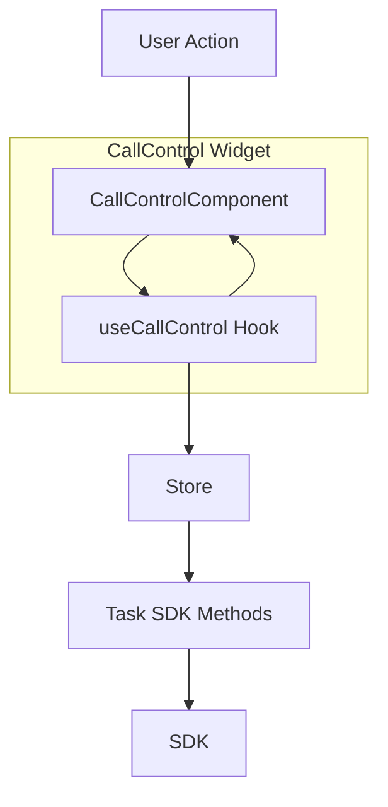
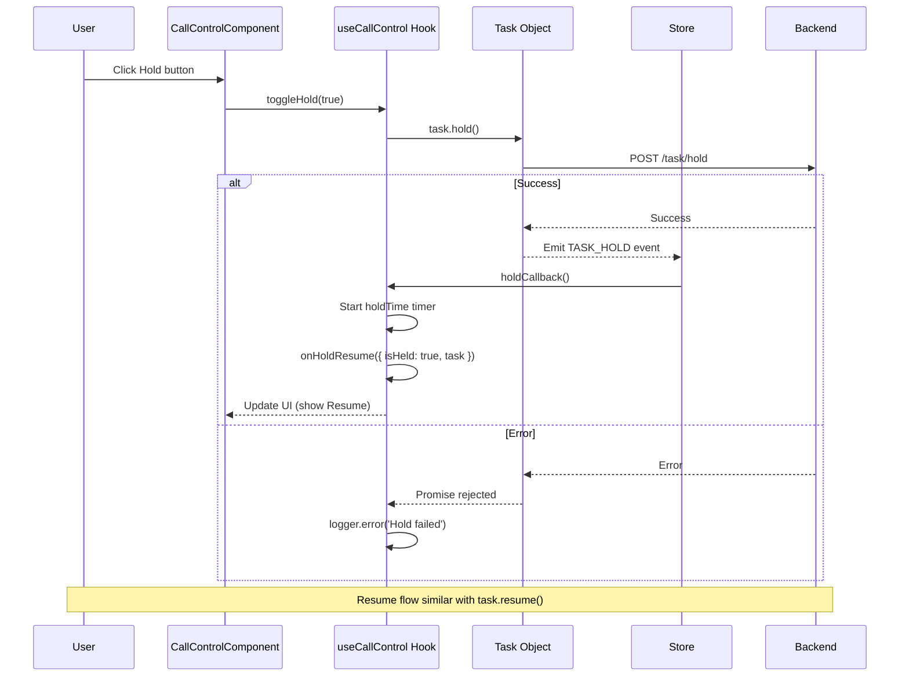
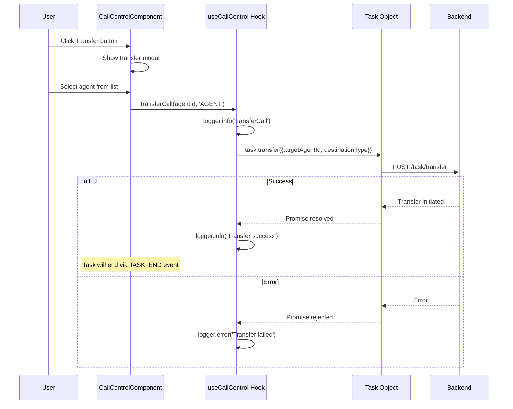
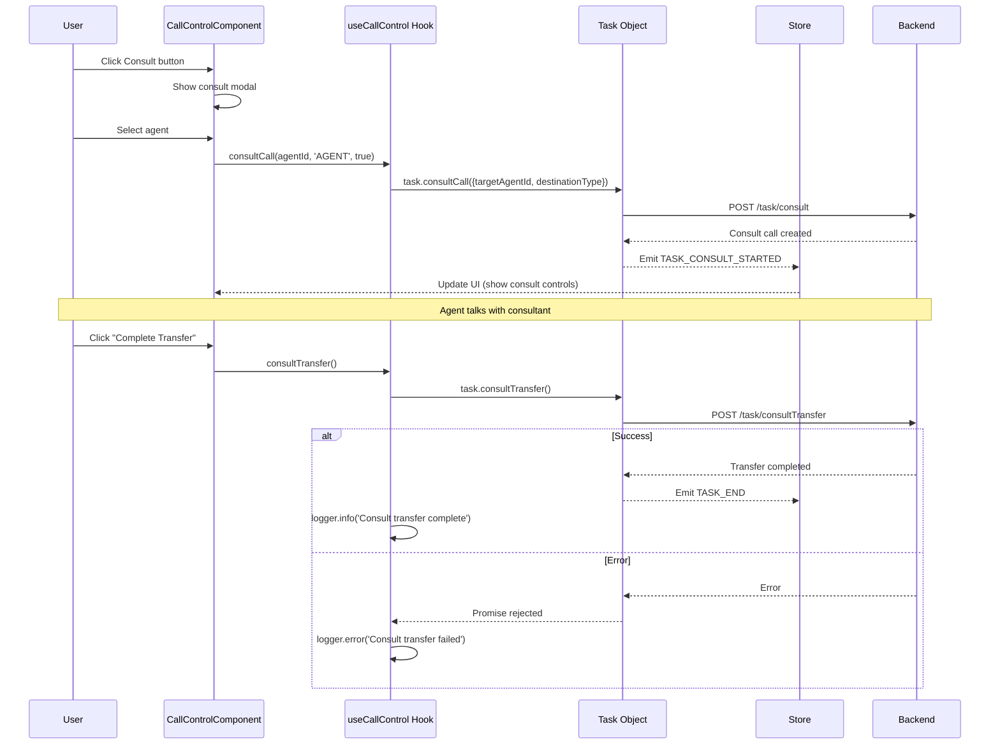
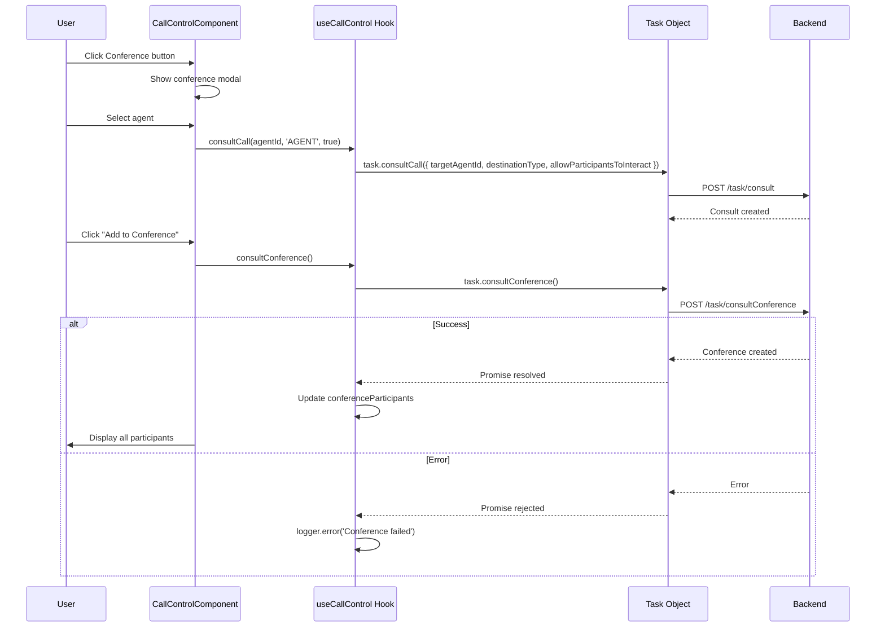
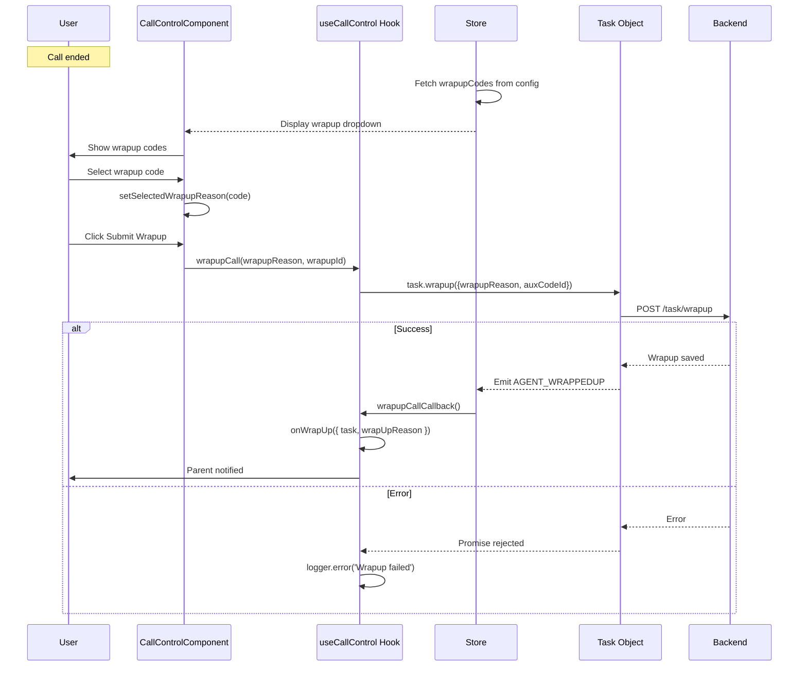
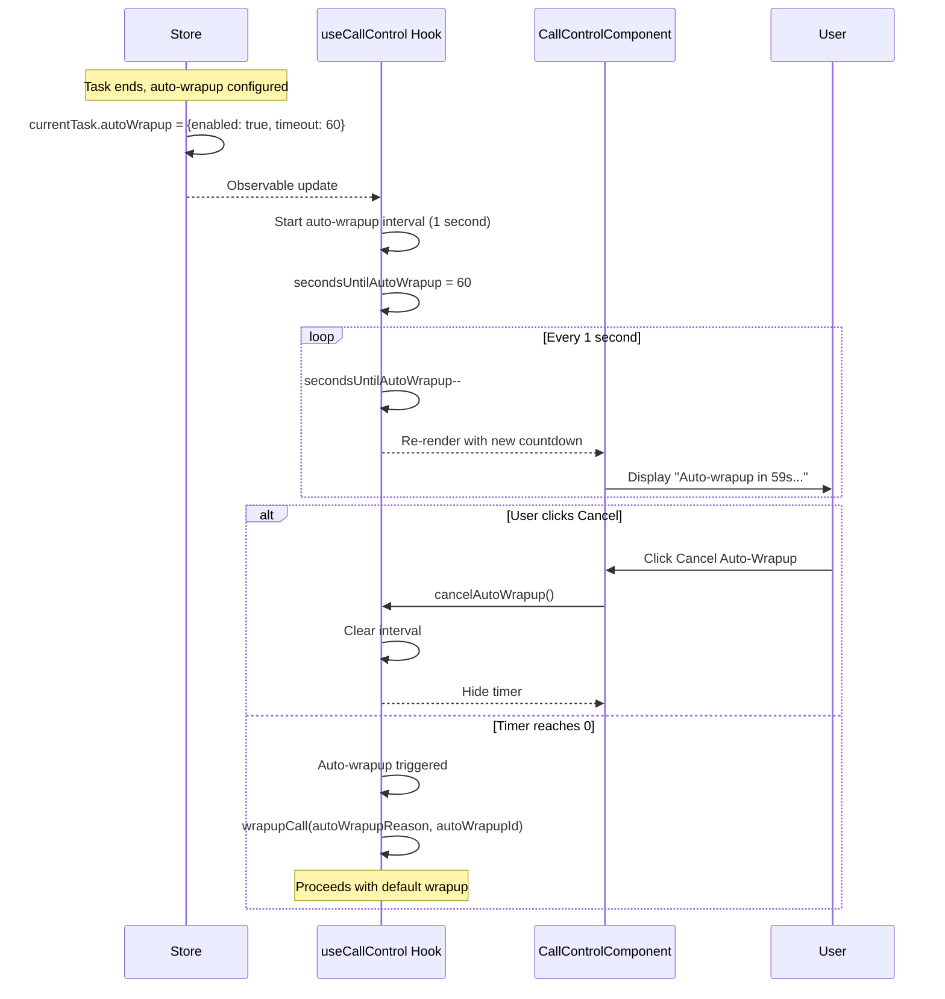

# CallControl Widget - Architecture

## Component Overview

| Layer         | File                                                          | Purpose         | Key Responsibilities                                                                                                                                                                                      |
| ------------- | ------------------------------------------------------------- | --------------- | --------------------------------------------------------------------------------------------------------------------------------------------------------------------------------------------------------- |
| **Widget**    | `src/CallControl/index.tsx`<br>`src/CallControlCAD/index.tsx` | Smart container | - Observer HOC<br>- Error boundary<br>- Delegates to hook<br>- Props: callbacks, options                                                                                                                  |
| **Hook**      | `src/helper.ts` (useCallControl)                              | Business logic  | - All call operations<br>- Task event subscriptions<br>- State management (hold, mute, recording)<br>- Buddy agents, transfer, consult<br>- Auto-wrapup timer <br>- Task SDK methods (hold, resume, etc.) |
| **Component** | `@webex/cc-components` (CallControlComponent)                 | Presentation    | - Call control UI<br>- Buttons (hold, mute, transfer, etc.)<br>- Transfer/consult modals<br>- Wrapup dropdown<br>- Auto-wrapup timer display                                                              |
| **Store**     | `@webex/cc-store`                                             | State/SDK       | - currentTask observable<br>- Task event callbacks<br>- wrapupCodes                                                                                                                                       |

## File Structure

```
task/src/
├── CallControl/
│   └── index.tsx              # CallControl widget
├── CallControlCAD/
│   └── index.tsx              # CallControl + CAD variant
├── helper.ts                   # useCallControl hook (lines 270-945)
├── task.types.ts               # CallControlProps, useCallControlProps
└── index.ts                    # Exports

cc-components/src/components/task/CallControl/
├── call-control.tsx            # CallControlComponent (main UI)
├── call-control.utils.ts       # Utility functions
├── call-control.styles.scss    # Styles
├── CallControlCustom/
│   └── consult-transfer-popover.tsx
└── AutoWrapupTimer/
    └── AutoWrapupTimer.tsx
```

## Data Flows

### Overview



### Hook: useCallControl

**Inputs:**

- `currentTask` - Active ITask from store
- `onHoldResume` - Hold state change callback
- `onEnd` - Call end callback
- `onWrapUp` - Wrapup callback
- `onRecordingToggle` - Recording toggle callback
- `onToggleMute` - Mute toggle callback
- `conferenceEnabled` - Enable conference features
- `consultTransferOptions` - Transfer UI options
- `logger` - Logger instance

**Manages State:**

- `isMuted` - Microphone mute state
- `isRecording` - Recording state
- `holdTime` - Duration of current hold
- `buddyAgents` - List of agents for transfer
- `consultAgentName` - Selected consult agent name
- `lastTargetType` - Last transfer target type
- `secondsUntilAutoWrapup` - Auto-wrapup countdown

**Subscribes to Task Events:**

- `TASK_HOLD` - Task put on hold
- `TASK_RESUME` - Task resumed from hold
- `TASK_END` - Task ended
- `AGENT_WRAPPEDUP` - Wrapup completed
- `TASK_RECORDING_PAUSED` - Recording paused
- `TASK_RECORDING_RESUMED` - Recording resumed

**Returns:** All functions and state for call control operations

## Sequence Diagrams

### Hold/Resume Call



### Transfer Call



### Consult Then Transfer



### Conference Call



### Wrapup with Codes



### Auto-Wrapup Timer



## Call Control Operations

### Button Actions

| Button     | Hook Function         | Task Method                                        | Description       |
| ---------- | --------------------- | -------------------------------------------------- | ----------------- |
| Hold       | `toggleHold(true)`    | `task.hold()`                                      | Put call on hold  |
| Resume     | `toggleHold(false)`   | `task.resume()`                                    | Resume from hold  |
| Mute       | `toggleMute()`        | N/A (local)                                        | Mute microphone   |
| Transfer   | `transferCall(...)`   | `task.transfer(...)`                               | Direct transfer   |
| Consult    | `consultCall(...)`    | `task.consultCall(...)`                            | Initiate consult  |
| Conference | `consultConference()` | `task.consultConference()`                         | Add to conference |
| End Call   | `endCall()`           | `task.end()`                                       | End the call      |
| Wrapup     | `wrapupCall(...)`     | `task.wrapup(...)`                                 | Submit wrapup     |
| Recording  | `toggleRecording()`   | `task.pauseRecording()` / `task.resumeRecording()` | Toggle recording  |

### Transfer/Consult Options

**Destination Types:**

- `AGENT` - Transfer to buddy agent
- `QUEUE` - Transfer to queue/entry point
- `DN` - Transfer to phone number
- `ADDRESS_BOOK` - Transfer to address book entry

**Configured via `consultTransferOptions` prop:**

- `showAgents` - Show buddy agents list
- `showQueues` - Show queues/entry points
- `showAddressBook` - Show address book entries

## Error Handling

| Error            | Source   | Handled By    | Action                     |
| ---------------- | -------- | ------------- | -------------------------- |
| Hold failed      | Task SDK | Hook catch    | Log error                  |
| Transfer failed  | Task SDK | Hook catch    | Log error, show alert      |
| Consult failed   | Task SDK | Hook catch    | Log error, show alert      |
| Wrapup failed    | Task SDK | Hook catch    | Log error                  |
| Recording failed | Task SDK | Hook catch    | Log error                  |
| Component crash  | React    | ErrorBoundary | Call store.onErrorCallback |

## Troubleshooting

### Issue: Hold button disabled/doesn't work

**Possible Causes:**

1. Task not in active state
2. Task type doesn't support hold
3. SDK error

**Solution:**

- Check `task.data.state`
- Verify task media type is TELEPHONY
- Check console for "Hold failed" logs

### Issue: Transfer options not showing

**Possible Causes:**

1. `consultTransferOptions` not configured
2. No buddy agents loaded
3. No queues configured

**Solution:**

- Pass `consultTransferOptions` prop
- Check `buddyAgents` array in hook
- Verify `loadBuddyAgents()` was called
- Check agent permissions for transfer

### Issue: Consult call fails

**Possible Causes:**

1. Invalid target agent
2. Agent not available
3. Insufficient permissions

**Solution:**

- Verify agent exists and is logged in
- Check agent state (Available)
- Check console for SDK error details

### Issue: Auto-wrapup timer not showing

**Possible Causes:**

1. Auto-wrapup not configured in backend
2. `controlVisibility.wrapup` is false
3. Task not in wrapup state

**Solution:**

- Check `currentTask.autoWrapup` object
- Verify wrapup is visible: `controlVisibility.wrapup === true`
- Check task state is WRAP_UP

### Issue: Recording button doesn't work

**Possible Causes:**

1. Recording not enabled for tenant
2. Agent doesn't have recording permissions
3. Task type doesn't support recording

**Solution:**

- Check tenant recording configuration
- Verify agent profile has recording permission
- Check `task.data.isRecordingEnabled`

## Performance Considerations

- **Task Event Subscriptions:** Registered per task, cleaned up on task change/unmount
- **Hold Timer:** Interval running while on hold (cleared on resume/unmount)
- **Auto-Wrapup Timer:** 1-second interval during wrapup countdown
- **Buddy Agents:** Fetched once on mount (cached)
- **Re-renders:** Only on currentTask or specific state changes (MobX observer)

## Testing

### Unit Tests

**Widget Tests:**

- Renders without crashing
- Passes props to hook correctly
- Error boundary catches errors

**Hook Tests:**

- toggleHold() calls task.hold()/resume()
- toggleMute() updates isMuted state
- transferCall() calls task.transfer()
- consultCall() calls task.consultCall()
- wrapupCall() calls task.wrapup()
- Task event callbacks fire correctly
- Auto-wrapup timer counts down
- Cleanup removes all callbacks

**Component Tests:**

- All buttons render correctly
- Buttons call correct handlers
- Transfer modal opens/closes
- Wrapup dropdown populates
- Auto-wrapup timer displays countdown

### E2E Tests

- Active call → Hold → Resume → Success
- Active call → Transfer to agent → Success
- Active call → Consult → Transfer → Success
- Active call → Consult → Conference → Success
- Active call → End → Wrapup with code → Success
- Active call → Auto-wrapup countdown → Cancel → Success
