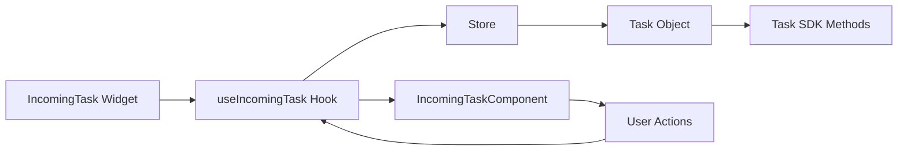
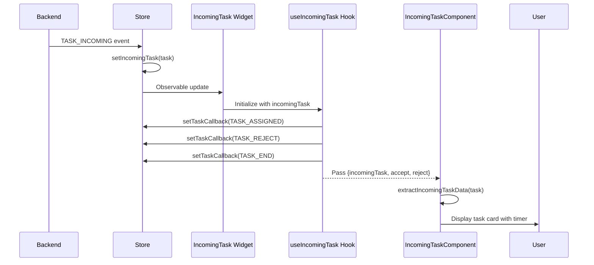
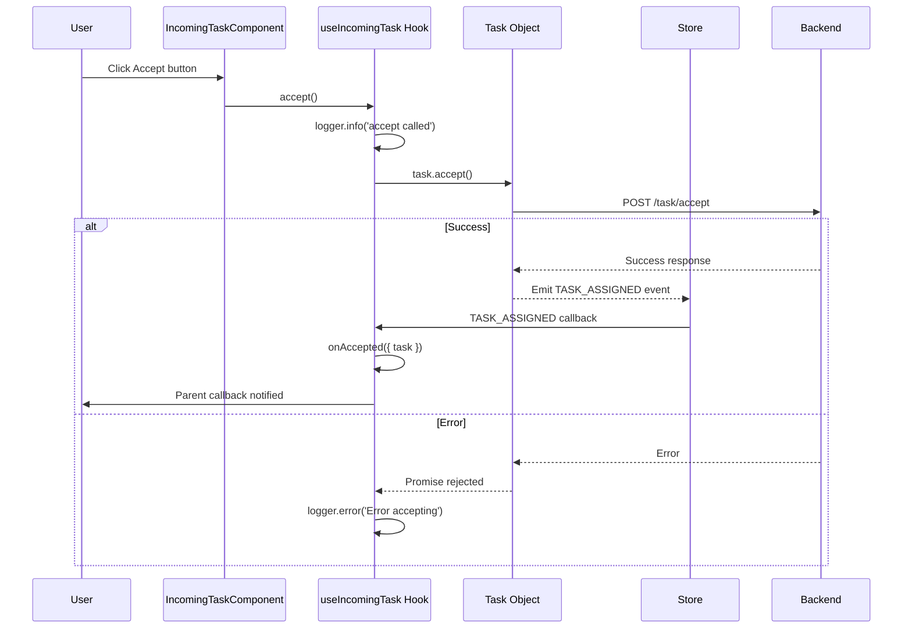
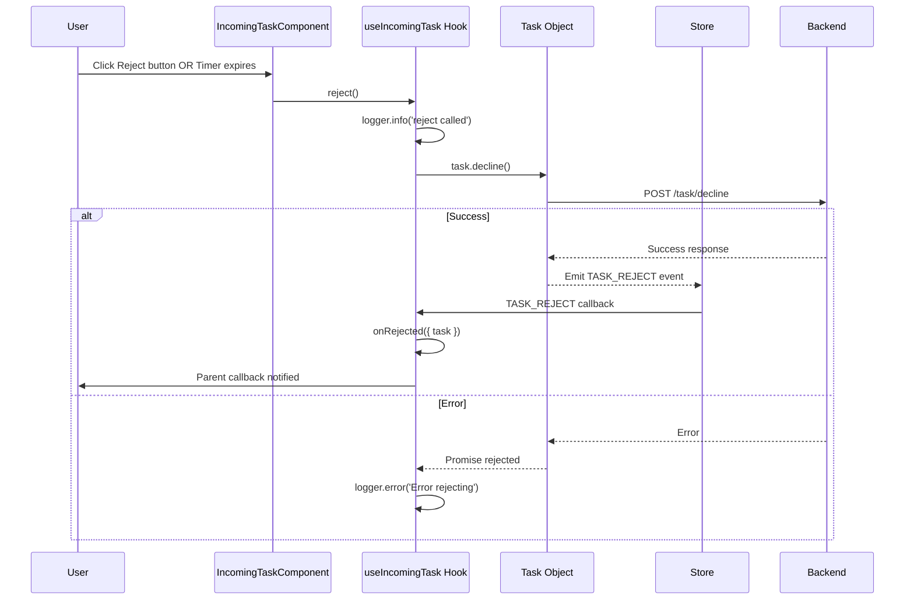
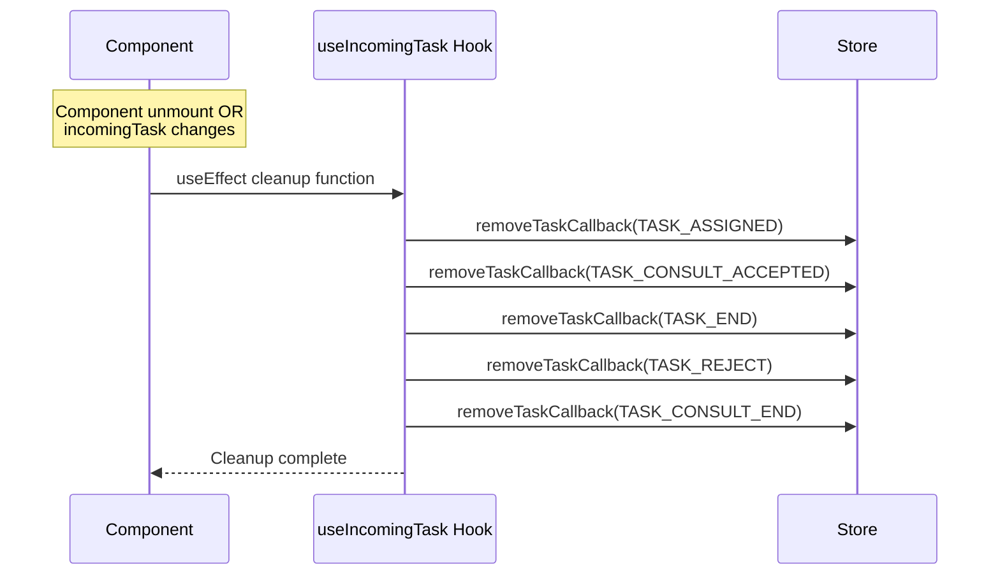

# IncomingTask Widget - Architecture

## Component Overview

| Layer | File | Purpose | Key Responsibilities |
|-------|------|---------|---------------------|
| **Widget** | `src/IncomingTask/index.tsx` | Smart container | - Observer HOC<br>- Error boundary<br>- Delegates to hook<br>- Props: incomingTask, callbacks |
| **Hook** | `src/helper.ts` (useIncomingTask) | Business logic | - Task event subscriptions<br>- Accept/reject handlers<br>- Callback management<br>- Cleanup on unmount |
| **Component** | `@webex/cc-components` (IncomingTaskComponent) | Presentation | - Task card UI<br>- Timer display<br>- Accept/reject buttons<br>- Media type icons |
| **Store** | `@webex/cc-store` | State/SDK | - incomingTask observable<br>- Task event callbacks<br>- setTaskCallback/removeTaskCallback |

## File Structure

```
task/src/
├── IncomingTask/
│   └── index.tsx              # Widget (observer + ErrorBoundary)
├── helper.ts                   # useIncomingTask hook (lines 138-269)
├── task.types.ts               # UseTaskProps, IncomingTaskProps
└── index.ts                    # Exports

cc-components/src/components/task/IncomingTask/
├── incoming-task.tsx           # IncomingTaskComponent
└── incoming-task.utils.ts      # extractIncomingTaskData
```

## Data Flows

### Overview



### Hook: useIncomingTask

**Inputs:**
- `incomingTask` - ITask object (from props or store)
- `deviceType` - 'BROWSER' | 'EXTENSION' | 'AGENT_DN'
- `onAccepted` - Callback when task accepted
- `onRejected` - Callback when task rejected
- `logger` - Logger instance

**Subscribes to Task Events:**
- `TASK_ASSIGNED` - Task accepted successfully
- `TASK_CONSULT_ACCEPTED` - Consult accepted
- `TASK_END` - Task ended
- `TASK_REJECT` - Task rejected
- `TASK_CONSULT_END` - Consult ended

**Returns:**
- `incomingTask` - Task object
- `accept()` - Accept task handler
- `reject()` - Reject task handler
- `isBrowser` - Boolean flag

## Sequence Diagrams

### Incoming Task Flow



### Accept Task



### Reject Task



### Task Event Cleanup



## Task Events Lifecycle

**Subscribed Events:**
1. `TASK_ASSIGNED` → Calls `onAccepted` callback
2. `TASK_CONSULT_ACCEPTED` → Calls `onAccepted` callback (consult scenario)
3. `TASK_END` → Calls `onRejected` callback (task ended)
4. `TASK_REJECT` → Calls `onRejected` callback (explicitly rejected)
5. `TASK_CONSULT_END` → Calls `onRejected` callback (consult ended)

**Cleanup:** All callbacks removed on component unmount or when incomingTask changes.

## Error Handling

| Error | Source | Handled By | Action |
|-------|--------|------------|--------|
| Task accept failed | Task SDK | Hook catch block | Log error via logger |
| Task reject failed | Task SDK | Hook catch block | Log error via logger |
| Callback execution error | Hook | try/catch in callback | Log error, continue |
| Component crash | React | ErrorBoundary | Call store.onErrorCallback |
| Missing interactionId | Hook | Early return | No action taken |

## Troubleshooting

### Issue: Widget not showing

**Possible Causes:**
1. No incoming task in store
2. incomingTask prop is null/undefined

**Solution:**
- Check `store.incomingTask` in console
- Verify task events are being received
- Check if agent is in Available state

### Issue: Accept button doesn't work

**Possible Causes:**
1. Button disabled (Browser mode restriction)
2. Task already accepted/rejected
3. SDK error

**Solution:**
- Check `deviceType` (BROWSER mode may have restrictions)
- Check console for "Error accepting task" logs
- Verify task.accept() method is available

### Issue: Reject button doesn't work

**Possible Causes:**
1. Task already ended
2. SDK error

**Solution:**
- Check task state in console
- Check console for "Error rejecting task" logs
- Verify task.decline() method is available

### Issue: Callbacks not firing

**Possible Causes:**
1. Event subscription failed
2. interactionId missing
3. Callback execution error

**Solution:**
- Check useEffect subscription logs
- Verify task.data.interactionId exists
- Check console for callback errors

## Performance Considerations

- **Event Subscriptions:** Set up once per task, cleaned up on unmount
- **Re-renders:** Only when incomingTask observable changes (MobX observer)
- **Timer:** Handled by Component layer (not in hook)
- **No polling:** Event-driven architecture

## Testing

### Unit Tests

**Widget Tests** (`tests/IncomingTask/index.tsx`):
- Renders without crashing
- Passes props to hook correctly
- Error boundary catches errors

**Hook Tests** (`tests/helper.ts`):
- accept() calls task.accept()
- reject() calls task.decline()
- Task event callbacks registered
- Cleanup removes all callbacks
- onAccepted/onRejected fire correctly

**Component Tests** (`cc-components tests`):
- Displays task information
- Countdown timer works
- Accept button calls accept handler
- Reject button calls reject handler

### E2E Tests

- Login → Incoming call → Accept → Task assigned
- Login → Incoming call → Reject → Task cleared
- Login → Incoming call → Timeout (RONA) → Rejected callback fires

