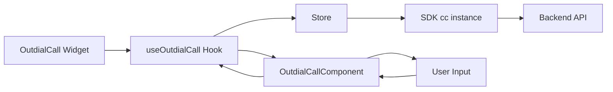
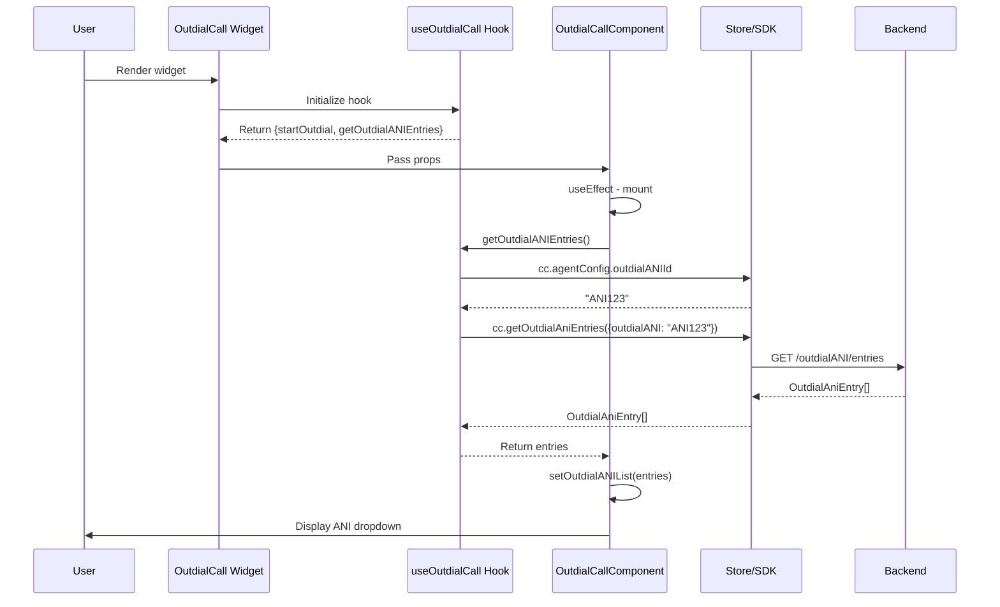
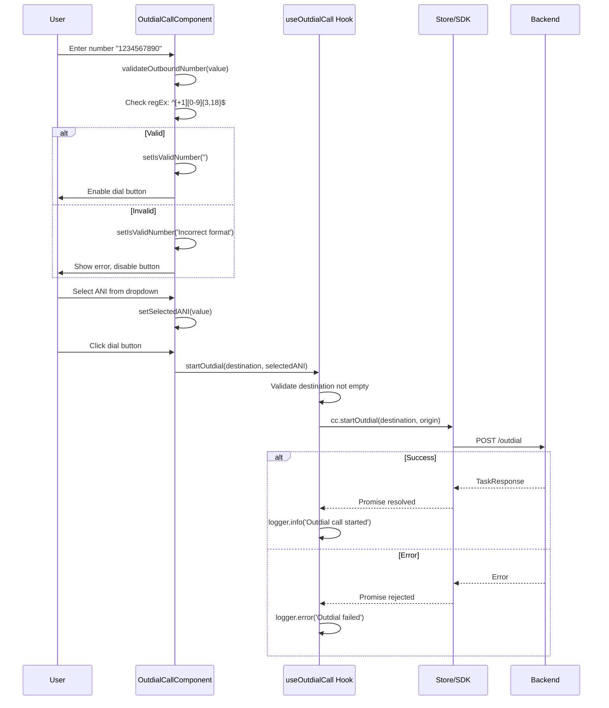
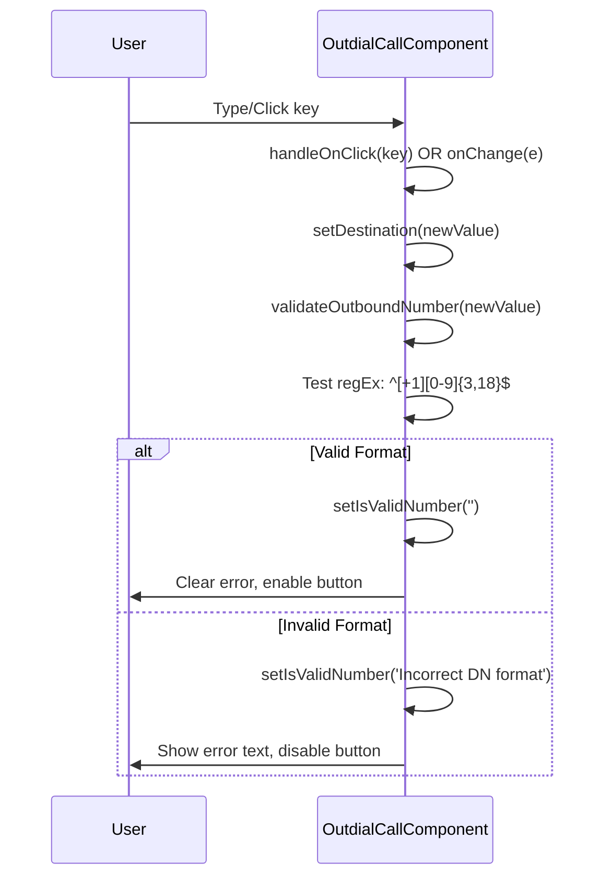

# OutdialCall Widget - Architecture

## Component Overview

| Layer | File | Purpose | Key Responsibilities |
|-------|------|---------|---------------------|
| **Widget** | `src/OutdialCall/index.tsx` | Smart container | - Observer HOC<br>- Error boundary<br>- Delegates to hook<br>- No props (uses store) |
| **Hook** | `src/helper.ts` (useOutdialCall) | Business logic | - startOutdial() wrapper<br>- getOutdialANIEntries() fetcher<br>- Error handling<br>- Logging |
| **Component** | `@webex/cc-components` (OutdialCallComponent) | Presentation | - Dialpad UI<br>- Number validation<br>- ANI selector<br>- Input handling |
| **Store** | `@webex/cc-store` | State/SDK | - cc instance (SDK)<br>- logger instance<br>- agentConfig (outdialANIId) |

## File Structure

```
task/src/
├── OutdialCall/
│   └── index.tsx              # Widget (observer + ErrorBoundary)
├── helper.ts                   # useOutdialCall hook (lines 947-1003)
├── task.types.ts               # useOutdialCallProps
└── index.ts                    # Exports

cc-components/src/components/task/OutdialCall/
├── outdial-call.tsx            # OutdialCallComponent (dialpad UI)
├── outdial-call.style.scss     # Styles
└── constants.ts                # KEY_LIST, OutdialStrings
```

## Data Flows

### Overview



### Hook: useOutdialCall

**Reads from Store:**
- `store.cc` - SDK instance
- `store.logger` - Logger instance
- `store.cc.agentConfig.outdialANIId` - ANI configuration

**Calls SDK:**
- `cc.startOutdial(destination, origin)` - Initiate outbound call
- `cc.getOutdialAniEntries({outdialANI})` - Fetch ANI options

**Returns:**
- `startOutdial(destination, origin)` - Start outdial function
- `getOutdialANIEntries()` - Fetch ANI entries async function

## Sequence Diagrams

### Initial Load & Fetch ANI Entries



### Make Outbound Call



### Number Validation



## Validation Logic

### Phone Number RegEx

```regex
^[+1][0-9]{3,18}$           // Standard: +1234567890 (3-18 digits)
^[*#][+1][0-9*#:]{3,18}$    // Special chars start
^[0-9*#]{3,18}$             // No country code
```

### Validation Rules

| Input | Valid? | Reason |
|-------|--------|--------|
| `+1234567890` | ✅ | E.164 format |
| `1234567890` | ✅ | Digits only (3-18 chars) |
| `*12#456` | ✅ | Special chars allowed |
| `12` | ❌ | Too short (< 3 digits) |
| `abc123` | ❌ | Contains letters |
| ` ` (empty) | ❌ | Empty/whitespace |

## SDK Integration

### Methods Used

**1. startOutdial(destination, origin)**
- **Purpose:** Initiate outbound call
- **Parameters:**
  - `destination` (string, required) - Phone number to dial
  - `origin` (string, optional) - Selected ANI for caller ID
- **Returns:** Promise<TaskResponse>
- **Errors:** Empty number, invalid format, agent not available

**2. getOutdialAniEntries({outdialANI})**
- **Purpose:** Fetch available ANI options for caller ID
- **Parameters:**
  - `outdialANI` (string, required) - ANI ID from agentConfig
- **Returns:** Promise<OutdialAniEntry[]>
- **Errors:** No ANI ID, fetch failed

## Error Handling

| Error | Source | Handled By | Action |
|-------|--------|------------|--------|
| Empty destination | Hook | Alert + early return | Show alert to user |
| Invalid format | Component | Validation state | Show error text, disable button |
| startOutdial failed | SDK | Hook catch block | Log error via logger |
| ANI fetch failed | SDK | Component catch | Set empty ANI list, log error |
| Component crash | React | ErrorBoundary | Call store.onErrorCallback |

## Troubleshooting

### Issue: Dial button disabled

**Possible Causes:**
1. Destination number empty
2. Invalid number format (fails regex)

**Solution:**
- Check validation error message below input
- Ensure number matches accepted formats
- Minimum 3 digits required

### Issue: No ANI options in dropdown

**Possible Causes:**
1. Agent has no outdialANIId configured
2. ANI fetch failed
3. No ANI entries exist for this agent

**Solution:**
- Check `store.cc.agentConfig.outdialANIId` in console
- Check console for "Error fetching outdial ANI entries"
- Verify agent is configured for outbound calls

### Issue: Outdial fails with error

**Possible Causes:**
1. Agent not in Available state
2. Agent not configured for outdial
3. Invalid destination format
4. Network/backend error

**Solution:**
- Check agent state (must be Available)
- Check `store.cc.agentConfig.isOutboundEnabledForAgent`
- Verify phone number format
- Check console logs for SDK error details

### Issue: Call starts but no task appears

**Possible Causes:**
1. Task event listeners not set up
2. IncomingTask or TaskList widget not rendered

**Solution:**
- Ensure IncomingTask or TaskList widget is active
- Check task event subscriptions in store
- Monitor console for TASK_ASSIGNED events

## Performance Considerations

- **ANI Fetch:** Happens once on mount, cached in component state
- **Validation:** Runs on every keystroke, but is simple regex (fast)
- **Dial Action:** Async, user must wait for SDK response
- **No polling:** Widget doesn't poll for state changes

## Testing

### Unit Tests

**Widget Tests** (`tests/OutdialCall/index.tsx`):
- Renders without crashing
- Hook called with correct params (cc, logger)
- Error boundary catches component crashes

**Hook Tests** (`tests/helper.ts`):
- startOutdial validates empty destination
- startOutdial calls SDK with correct params
- getOutdialANIEntries fetches from SDK
- Error handling for SDK failures

**Component Tests** (`cc-components tests`):
- Number validation works
- Keypad input appends digits
- ANI dropdown populates
- Dial button enables/disables correctly
- Validation error displays

### E2E Tests

- Login → OutdialCall → Enter number → Dial → Task appears
- Validate invalid number shows error
- ANI selection works

