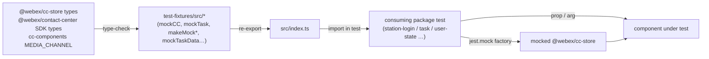
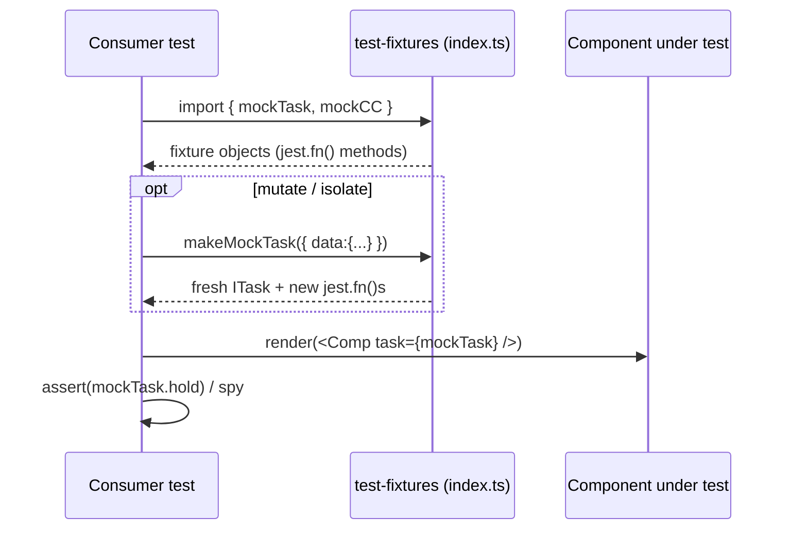
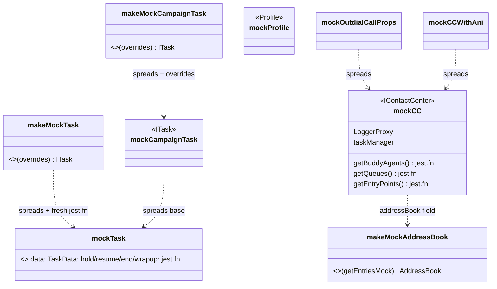

# test-fixtures — SPEC

> Start here → root [`AGENTS.md`](../../../../AGENTS.md) (agent entry) · router [`SPEC_INDEX.md`](../../../../ai-docs/SPEC_INDEX.md) · system [`ARCHITECTURE.md`](../../../../ai-docs/ARCHITECTURE.md). This is the module's canonical spec: orientation, requirements, design, flows, and tests.
> Context-efficiency: link to canonical docs — don't duplicate them. Load specs on demand per `SPEC_INDEX.md`.

## Metadata

| Field | Value |
|---|---|
| Module id | `test-fixtures` |
| Source path(s) | `packages/contact-center/test-fixtures/src/` |
| Doc kind | Module spec |
| Coverage score | Pending coverage assessment |
| Generated from | `module-spec` @ SDLC template library `0.1.0-draft` |
| generated_by / approved_by / updated_at | migration agent / pending / 2026-06-29 |
| Validation status | not-run |

Coverage score: `Pending coverage assessment` before the first report; after assessment, replace with `<0-100%>` plus the report path/evidence. Keep manifest coverage state outside the rendered module doc metadata.

## Evidence Rules
Every generated requirement below must cite concrete source evidence using `file path`. Separate source evidence, test evidence, examples, assumptions, and gaps so validators and future agents can distinguish truth from context. Test evidence is preferred for WHY. Commit evidence is allowed only when the repository policy says history is reliable, and must include the commit hash. If evidence is missing or conflicting, ask a focused discovery question before finalizing the requirement; record unresolved answers as approved unknowns only when the human explicitly defers or does not know.

## Source Material Register

| Source doc | Scope | Decision | Detail location or disposition |
|---|---|---|---|
| `ai-docs/_archive/pre-sdlc-migration/packages/contact-center/test-fixtures/ai-docs/AGENTS.md` | overview / API / examples | reconciled | Overview, Public Surface, Use Cases. Export list reconciled against `src/fixtures.ts`: archived doc omitted `makeMockTask`, `mockCampaignCpd`, `mockCampaignTask`, `makeMockCampaignTask`, `mockCallAssociatedData`; archived `mockIncomingTaskData`/`mockTaskData`/`mockOutdialCallProps`/`mockAniEntries`/`mockCCWithAni` confirmed present. |
| `ai-docs/_archive/pre-sdlc-migration/packages/contact-center/test-fixtures/ai-docs/ARCHITECTURE.md` | architecture / tests | reconciled | Design Overview, Folder Structure, Pitfalls. Conflict: archived `mockCC` listed task methods (`accept`, `hold`, …) and proxies (`AgentProxy`, `DiagnosticsProxy`, …) that the real `mockCC` (`src/fixtures.ts`) does not define — those live on `mockTask` and the `LoggerProxy`/`taskManager` only. Archived `mockTask.data` shape (flat `origin`/`destination`/`status`) does not match real nested `interaction` shape — corrected from source. |

## Overview
`test-fixtures` (`@webex/test-fixtures`) is a test-only utility package. It exports pre-built mock objects and small factory functions that other contact-center packages import inside their Jest unit tests, so widgets can be rendered and exercised without a live Contact Center SDK connection or backend. It owns no runtime behavior, holds no state, and ships nothing into the browser bundle of any consumer; consuming packages list it as a dev dependency only.

The package is structured as a flat set of fixture modules under `src/`, each one re-exported by the barrel `src/index.ts`. `src/fixtures.ts` holds the core SDK-shaped mocks (`mockCC`, `mockProfile`, `mockTask`, queues, agents, address book, campaign-preview tasks). `src/incomingTaskFixtures.ts` and `src/taskListFixtures.ts` hold plain UI-data records keyed by scenario for the task widgets. `src/components/task/outdialCallFixtures.ts` composes `mockCC` into outdial-specific mocks.

The load-bearing contract of this module is structural: each exported mock is typed against the real SDK / store / cc-components type (e.g. `mockCC: IContactCenter`, `mockProfile: Profile`, `mockTask: ITask`) so that when a consuming test passes a fixture into production code, the shape matches what production code expects at compile time. A maintainer changing a fixture should start at `src/fixtures.ts` and keep the declared types intact.

## Purpose / Responsibility
Provides shared, type-checked mock SDK instances, mock profile/task/queue/agent data, and component-prop fixtures consumed by other packages' Jest tests; it does NOT provide runtime behavior, test runners, or shared test-render helpers.

## Stack
TypeScript 5.6.3. No framework runtime — fixtures are plain objects whose methods are Jest mock functions (`jest.fn()`), so the package assumes a Jest global is present in the consumer's test environment. Built with `tsc` (type output) and Webpack 5 + Babel (`build:src`). No datastore, no messaging. `deploy:npm` is intentionally a no-op (`package.json`).

## Folder / Package Structure
```
test-fixtures/src/
├── index.ts                                # Barrel: re-exports all four fixture modules
├── fixtures.ts                             # Core SDK-shaped mocks: mockCC, mockProfile, mockTask, queues, agents, address book, campaign tasks
├── incomingTaskFixtures.ts                 # mockIncomingTaskData — incoming-task UI data by channel scenario
├── taskListFixtures.ts                     # mockTaskData — task-list UI data by scenario (active/incoming/action/selection)
├── taskUIControlsFixtures.ts               # TaskUIControls factories with per-leg and destination overrides
└── components/task/
    └── outdialCallFixtures.ts              # Outdial mocks composed from mockCC: mockOutdialCallProps, mockAniEntries, mockCCWithAni
```

## Key Files (source of truth)

| File | Holds |
|---|---|
| `packages/contact-center/test-fixtures/src/index.ts` | The public export barrel — the authoritative list of what consumers may import. |
| `packages/contact-center/test-fixtures/src/fixtures.ts` | Core fixture values and their type annotations (`IContactCenter`, `Profile`, `ITask`, etc.). Never re-infer these shapes elsewhere. |
| `packages/contact-center/test-fixtures/src/incomingTaskFixtures.ts` | `mockIncomingTaskData` and its `MEDIA_CHANNEL` source import. |
| `packages/contact-center/test-fixtures/src/taskListFixtures.ts` | `mockTaskData` and its `MEDIA_CHANNEL` source import. |
| `packages/contact-center/test-fixtures/src/taskUIControlsFixtures.ts` | Typed `TaskUIControls` factories, including consult/transfer destination-control overrides. |
| `packages/contact-center/test-fixtures/src/components/task/outdialCallFixtures.ts` | Outdial fixtures derived from `mockCC`. |
| `packages/contact-center/test-fixtures/package.json` | Dependency list and the `deploy:npm` no-op. |

## Public Surface
Internal Surface — consumed only by other packages' Jest tests in this monorepo. There is no network/event/CLI contract; the contract is the set of TypeScript exports below, all re-exported through `src/index.ts`. Each is summarized here — read the source file for the exact object shape.

| Contract ID | Type | Surface | Purpose | Compatibility / deprecation | Schema / detail link | Entry point |
|---|---|---|---|---|---|---|
| `test-fixtures.mockCC` | SDK export | `mockCC: IContactCenter` | Mock SDK instance; methods are `jest.fn()` so tests can spy/override | Shape must track `IContactCenter`; removing a mocked method may break consumer tests | `src/fixtures.ts` | internal (`src/index.ts`) |
| `test-fixtures.mockProfile` | SDK export | `mockProfile: Profile` | Full agent profile (teams, idle/wrapup codes, dial plan, flags) | Track `Profile`; additive fields safe | `src/fixtures.ts` | internal (`src/index.ts`) |
| `test-fixtures.mockTask` | SDK export | `mockTask: ITask` | Connected telephony task with nested `interaction`; methods are `jest.fn()` | Track `ITask` | `src/fixtures.ts` | internal (`src/index.ts`) |
| `test-fixtures.makeMockTask` | SDK export | `makeMockTask(overrides?): ITask` | Factory producing a fresh task with deep `data`/`interaction` overrides and fresh `jest.fn()`s | Override shape `MakeMockTaskOverrides` | `src/fixtures.ts` | internal (`src/index.ts`) |
| `test-fixtures.mockCampaignTask` | SDK export | `mockCampaignTask: ITask` | Campaign-preview-shaped task (CPD + outbound details) | Track `ITask` + campaign CPD keys | `src/fixtures.ts` | internal (`src/index.ts`) |
| `test-fixtures.makeMockCampaignTask` | SDK export | `makeMockCampaignTask(overrides?): ITask` | Factory for campaign-preview task with `cpd`/`interaction`/`data` overrides | Override shape `IMakeMockCampaignTaskOverrides` | `src/fixtures.ts` | internal (`src/index.ts`) |
| `test-fixtures.mockCampaignCpd` | data export | `mockCampaignCpd: Record<string,string>` | Default campaign-preview call-processing-detail values | Additive keys safe | `src/fixtures.ts` | internal (`src/index.ts`) |
| `test-fixtures.mockQueueDetails` | data export | `mockQueueDetails` | Two fully-populated queue config objects for transfer/queue tests | Additive fields safe | `src/fixtures.ts` | internal (`src/index.ts`) |
| `test-fixtures.mockAgents` | data export | `mockAgents` | Buddy-agent list for transfer/consult tests | Additive fields safe | `src/fixtures.ts` | internal (`src/index.ts`) |
| `test-fixtures.mockEntryPointsResponse` | data export | `mockEntryPointsResponse: EntryPointListResponse` | Outdial entry-points response | Track `EntryPointListResponse` | `src/fixtures.ts` | internal (`src/index.ts`) |
| `test-fixtures.mockAddressBookEntriesResponse` | data export | `mockAddressBookEntriesResponse: AddressBookEntriesResponse` | Address-book entries response | Track `AddressBookEntriesResponse` | `src/fixtures.ts` | internal (`src/index.ts`) |
| `test-fixtures.makeMockAddressBook` | SDK export | `makeMockAddressBook(getEntriesMock?): AddressBook` | Factory for an `AddressBook` mock; default `getEntries` resolves the entries response | Track `AddressBook` | `src/fixtures.ts` | internal (`src/index.ts`) |
| `test-fixtures.mockCallAssociatedData` | data export | `mockCallAssociatedData` | Call-associated-data variants (global, viewable/hidden, secure) | Additive keys safe | `src/fixtures.ts` | internal (`src/index.ts`) |
| `test-fixtures.mockIncomingTaskData` | data export | `mockIncomingTaskData` | Incoming-task UI data keyed `webRTC`/`extension`/`social`/`chat` | Additive scenario keys safe | `src/incomingTaskFixtures.ts` | internal (`src/index.ts`) |
| `test-fixtures.mockTaskData` | data export | `mockTaskData` | Task-list UI data keyed `active`/`incoming`/`action`/`selection` | Additive scenario keys safe | `src/taskListFixtures.ts` | internal (`src/index.ts`) |
| `test-fixtures.createMockTaskUIControls` | factory export | `createMockTaskUIControls(overrides?): TaskUIControls` | Produces SDK-shaped task controls with independent main/consult/active-leg and ordered consult/transfer destination overrides | Track `TaskUIControls`; additive override fields are safe | `src/taskUIControlsFixtures.ts` | internal (`src/index.ts`) |
| `test-fixtures.mockOutdialCallProps` | data export | `mockOutdialCallProps` | `mockCC` spread + `startOutdial`/`getOutdialANIEntries` jest mocks | Spread of `mockCC` | `src/components/task/outdialCallFixtures.ts` | internal (`src/index.ts`) |
| `test-fixtures.mockAniEntries` | data export | `mockAniEntries` | Outdial ANI entry list | Additive fields safe | `src/components/task/outdialCallFixtures.ts` | internal (`src/index.ts`) |
| `test-fixtures.mockCCWithAni` | data export | `mockCCWithAni` | `mockCC` + `agentConfig.outdialANIId` + ANI-resolving `getOutdialAniEntries` | Spread of `mockCC` | `src/components/task/outdialCallFixtures.ts` | internal (`src/index.ts`) |

Compatibility notes:
- Adding a new fixture export or an additive field on existing data fixtures is non-breaking. Removing or renaming an export, or removing a method on `mockCC`/`mockTask`, can break consumer test files that reference it — grep consumers before changing.
- `mockAddressBook` and `mockQueuesResponse` are defined in `src/fixtures.ts` but NOT exported; they are internal wiring for `mockCC` only.

## Requires (dependencies)
- `@webex/cc-store` (`workspace:*`) — imports the `IContactCenter` type used to type `mockCC` (`src/fixtures.ts`).
- `@webex/contact-center` (SDK) — imports types `ITask`, `Interaction`, `Profile`, `TaskData`, `TaskResponse`, `AddressBook`, `EntryPointListResponse`, `AddressBookEntriesResponse`, `ContactServiceQueuesResponse` (`src/fixtures.ts`). Type-only; resolved transitively via `@webex/cc-store` (not a direct dependency in `package.json`).
- `@webex/cc-components` — `incomingTaskFixtures.ts` and `taskListFixtures.ts` import the `MEDIA_CHANNEL` enum via relative path `../../cc-components/src/components/task/task.types` (a cross-package source-relative import, not a `package.json` dependency).
- Jest (peer/ambient) — fixtures call `jest.fn()`; a Jest global must exist in the consumer's test runtime. Not declared in `package.json`.
- `typescript` 5.6.3 (`package.json`).

## Requirements

| ID | WHAT | WHY | Source Evidence | Test / Example Evidence | Assumptions / Gaps | Confidence |
|---|---|---|---|---|---|---|
| `test-fixtures-R-001` | Each exported mock is annotated with its real SDK/store type (`mockCC: IContactCenter`, `mockProfile: Profile`, `mockTask: ITask`, `mockEntryPointsResponse: EntryPointListResponse`, `mockAddressBookEntriesResponse: AddressBookEntriesResponse`, `mockQueuesResponse: ContactServiceQueuesResponse`) so consumer code type-checks against production shapes. | Fixtures exist to let tests substitute real SDK shapes; a drifted shape would let tests pass while production code breaks. | `src/fixtures.ts` (type annotations on each declaration) | No package-local tests; consumed by sibling-package tests. | Gap: no in-package compile assertion that fixtures stay in sync beyond `tsc`; relies on cross-package build. | PRESENT |
| `test-fixtures-R-002` | All SDK methods on `mockCC` and `mockTask` are `jest.fn()`s so consumers can spy, assert calls, and override return values. | Tests need to observe and control SDK interactions without a backend. | `src/fixtures.ts` (`mockCC`, `mockTask` method definitions) | Archived usage examples (spy/override) in `_archive/.../AGENTS.md` | none | PRESENT |
| `test-fixtures-R-003` | `makeMockTask` and `makeMockCampaignTask` return a fresh object with new `jest.fn()` method instances per call, applying deep `data`/`interaction` (and `cpd`) overrides. | Reusing a shared mutated fixture causes cross-test bleed; factories give isolation and scenario shaping. | `src/fixtures.ts` (`makeMockTask`, `makeMockCampaignTask`) | none found | Gap: no test verifying fresh-instance isolation. | PRESENT |
| `test-fixtures-R-004` | `makeMockAddressBook` returns an `AddressBook` whose `getEntries` defaults to a `jest.fn()` resolving `mockAddressBookEntriesResponse`, overridable via parameter. | Address-book tests need a controllable async data source. | `src/fixtures.ts` (`makeMockAddressBook`) | Archived example in `_archive/.../AGENTS.md` (search address book) | none | PRESENT |
| `test-fixtures-R-005` | `mockIncomingTaskData` and `mockTaskData` expose UI-data variants keyed by scenario (incoming: `webRTC`/`extension`/`social`/`chat`; list: `active`/`incoming`/`action`/`selection`) using the shared `MEDIA_CHANNEL` enum. | Task widget tests render against named, channel-correct scenarios rather than ad-hoc literals. | `src/incomingTaskFixtures.ts`, `src/taskListFixtures.ts` | none found | none | PRESENT |
| `test-fixtures-R-006` | Outdial fixtures (`mockOutdialCallProps`, `mockCCWithAni`) are composed by spreading `mockCC` and adding outdial-specific jest mocks/config, keeping a single source of SDK shape. | Avoids a divergent second SDK mock; outdial tests inherit the canonical `mockCC`. | `src/components/task/outdialCallFixtures.ts` | none found | none | PRESENT |
| `test-fixtures-R-007` | Every fixture and factory is re-exported through the barrel `src/index.ts`; non-barrelled internals (`mockAddressBook`, `mockQueuesResponse`) are not part of the public surface. | Consumers import from the package root; the barrel is the stability boundary. | `src/index.ts`, `src/fixtures.ts` (export list) | none found | none | PRESENT |
| `test-fixtures-R-008` | `createMockTaskUIControls` starts from the SDK defaults, applies independent per-leg and active-leg overrides, and preserves or overrides the ordered `consultTransferDestinations.consult` and `.transfer` arrays. | Component tests must represent the same task-owned destination visibility and ordering contract used at runtime without rebuilding that policy in test code. | `src/taskUIControlsFixtures.ts` | Consumed by call-control tests in `packages/contact-center/cc-components/tests` | No package-local unit test; type and shape are checked by package builds and consumers. | PRESENT |

Do not record raw data/schema inventory as requirements. The per-field contents of each mock are descriptive data in `src/`, not behavioral requirements.

## Design Overview
The module is a pass-through fixture library: no control flow, no async orchestration, no state. Design choices are all about isolation and shape-fidelity.

Shape fidelity is achieved by importing the real SDK/store types and annotating each fixture (`const mockCC: IContactCenter = {…}`). `tsc` then fails the build if a fixture drifts from the production type, which is the package's only automated guard. Where the SDK type is broader than what a fixture can fully populate, the code uses a targeted cast (`as unknown as TaskData`, `as {} as AddressBook`) — a deliberate, localized escape hatch documented in Pitfalls.

Isolation is offered two ways. Static fixtures (`mockTask`, `mockCC`) are shared singletons — cheap but mutable, so tests that mutate must clone. Factory functions (`makeMockTask`, `makeMockCampaignTask`, `makeMockAddressBook`) return fresh objects with brand-new `jest.fn()`s each call, which is the safe path for tests that mutate or assert call counts.

Composition keeps the SDK mock single-sourced: outdial fixtures spread `mockCC` rather than redeclaring it, so a change to `mockCC` propagates. The same principle is why `mockQueuesResponse` is derived by mapping `mockQueueDetails` instead of being hand-written twice.

## Data Flow
In-process, compile-time only. A consumer test file imports a fixture from `@webex/test-fixtures`; the fixture (a plain object, often with `jest.fn()` methods) is either passed as a prop/argument into production code under test or used to build a `jest.mock('@webex/cc-store', …)` factory. No network, queue, or wire transport is involved.



## Sequence Diagram(s)
Sequence coverage: this is a single-operation pass-through utility (import a fixture, use it in a test). The quality bar permits one diagram for a trivial pass-through module, so the import-and-use flow below covers the package; there are no async jobs, retries, or failure branches to diagram.

| Operation group | Diagram | Failure / recovery coverage |
|---|---|---|
| Import fixture → use in consumer test | `Fixture use in a consumer test` | N/A — no runtime failure modes (compile-time `tsc` is the only check); `jest.fn()` rejection behavior is configured by the consumer, not this module. |



## Class / Component Relationships

Static base fixtures (`mockCC`, `mockTask`, `mockProfile`) are the roots. Factories and derived fixtures all compose from those bases by object spread, so the type annotations on the bases govern the whole graph. There is no inheritance — composition only.

## Use Cases
- **UC-1 Render a widget with a mock task:** test imports `mockTask` → passes it as a prop to a task component → asserts UI / spies on `mockTask.hold`. Outcome: widget rendered with no SDK connection. Evidence: `src/fixtures.ts` (`mockTask`), archived examples in `ai-docs/_archive/pre-sdlc-migration/packages/contact-center/test-fixtures/ai-docs/AGENTS.md`.
- **UC-2 Mock the store with profile/SDK fixtures:** test builds a `jest.mock('@webex/cc-store', () => ({ cc: mockCC, teams: mockProfile.teams, … }))` factory → renders a widget that reads the store. Outcome: store-driven widget testable in isolation. Evidence: `src/fixtures.ts` (`mockCC`, `mockProfile`), archived `AGENTS.md`.
- **UC-3 Isolate a mutated task via factory:** test calls `makeMockTask({ data: { interaction: { state: 'hold' } } })` → gets a fresh task with new `jest.fn()`s → asserts without cross-test bleed. Outcome: isolated, scenario-shaped task. Evidence: `src/fixtures.ts` (`makeMockTask`).
- **UC-4 Test outdial flows:** test imports `mockCCWithAni` / `mockOutdialCallProps` / `mockAniEntries` → drives outdial component → asserts ANI handling. Outcome: outdial UI tested with configured ANI. Evidence: `src/components/task/outdialCallFixtures.ts`.
- **UC-5 Drive task widgets with scenario data:** test reads `mockTaskData.incoming.webrtcTelephony` or `mockIncomingTaskData.social` → feeds it to a task-list / incoming-task component. Outcome: channel-correct UI scenario. Evidence: `src/taskListFixtures.ts`, `src/incomingTaskFixtures.ts`.

## Pitfalls
- **Shared static fixtures are mutable.** `mockTask`, `mockCC`, `mockProfile` are module singletons. A test that mutates `mockTask.data` or `mockCC.stationLogin.mockResolvedValue(…)` without `jest.clearAllMocks()` / cloning leaks into later tests (flaky-together, pass-alone). Use the `makeMock*` factories or spread-clone, and reset mocks in `beforeEach`.
- **`MEDIA_CHANNEL` is a source-relative cross-package import.** `incomingTaskFixtures.ts` / `taskListFixtures.ts` import from `../../cc-components/src/components/task/task.types`, not from a package entry point. Moving that file or the relative depth silently breaks the build; it also makes test-fixtures depend on cc-components source (not reflected in `package.json`).
- **Targeted type casts mask shape drift.** `mockTask.data` uses `as unknown as TaskData` and `makeMockAddressBook` uses `as {} as AddressBook`. These bypass `tsc` for those values, so a real SDK shape change to `TaskData`/`AddressBook` will NOT fail the build here — verify those fixtures manually when the SDK types change.
- **`mockCC` is not a full `IContactCenter` of task methods.** Task lifecycle methods (`hold`, `resume`, `wrapup`, etc.) live on `mockTask`, not `mockCC`. The archived ARCHITECTURE doc incorrectly listed them and several proxies on `mockCC`; do not rely on that. `mockCC` exposes `LoggerProxy`, `taskManager`, and the listed `getX`/state/preview methods only.
- **Jest global is assumed, not declared.** Fixtures call `jest.fn()` at module load. Importing this package outside a Jest environment throws `jest is not defined`. It is test-only by design (`deploy:npm` is a no-op).

## Module Do's / Don'ts
- DO: keep every fixture annotated with its real SDK/store type so `tsc` catches drift (`src/fixtures.ts`).
- DO: add new mocks to the `src/index.ts` barrel and to the export list in `src/fixtures.ts`.
- DO: prefer `makeMock*` factories when a test mutates state or asserts call counts.
- DON'T: import this package from non-test (runtime) code — it calls `jest.fn()` at load.
- DON'T: redeclare a second SDK mock; spread `mockCC` like the outdial fixtures do.
- DON'T: remove or rename an export without grepping sibling-package tests first.

## Export Stability
Published/consumed as `@webex/test-fixtures` (`workspace:*`), but `deploy:npm` is a deliberate no-op (`package.json`) — it is an internal monorepo dev dependency, not an npm artifact. Stability rules: adding an export or an additive field on a data fixture is a minor/non-breaking change; removing/renaming an export, or removing a mocked method on `mockCC`/`mockTask`, is breaking for consumer test files and must be done with a repo-wide grep of test imports. Type-declaration surface is emitted to `dist/types/` via `tsc`.

## Test-Case Strategy (module)
The package ships no tests of its own (no `tests/` directory; confirmed by tree). Its correctness is enforced two ways: (1) `tsc` type-checking the typed fixtures against real SDK/store types during `yarn build:dev`, and (2) the sibling-package test suites that consume the fixtures — a fixture that breaks shape surfaces as a compile error in `task`/`station-login`/`user-state`/etc. tests. The cast-escaped fixtures (`TaskData`, `AddressBook`) and the factory isolation guarantee are the gaps a dedicated test would close.

| Behavior / Requirement | Existing test evidence | Gap |
|---|---|---|
| `test-fixtures-R-001` (typed fixtures) | None in-package; enforced by `tsc` + consumer builds | No explicit type-assertion test; cast-escaped `TaskData`/`AddressBook` not covered |
| `test-fixtures-R-002` (jest.fn methods) | None in-package; exercised by consumer tests | No in-package assertion that methods are mocks |
| `test-fixtures-R-003` (factory freshness) | None found | Missing test that two `makeMockTask()` calls return independent `jest.fn()`s |
| `test-fixtures-R-004` (address book factory) | None found | Missing test for default-resolve + override |
| `test-fixtures-R-005` (scenario UI data) | None found | Consumed indirectly by task widget tests only |
| `test-fixtures-R-006` (outdial composition) | None found | Consumed by outdial widget tests only |
| `test-fixtures-R-007` (barrel surface) | None found | No test guarding the public export list |
| `test-fixtures-R-008` (task UI controls) | Call-control consumer tests; `@webex/test-fixtures` and `@webex/cc-components` builds | No package-local assertion for destination override merging |

## Traceability
- Repo architecture: [`ARCHITECTURE.md`](../../../../ai-docs/ARCHITECTURE.md) · Registry: [`SPEC_INDEX.md`](../../../../ai-docs/SPEC_INDEX.md)
- Coverage state & contracts baseline: `.sdd/manifest.json`
