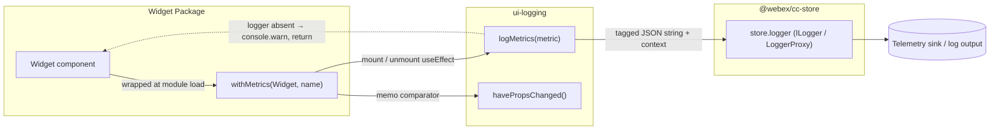
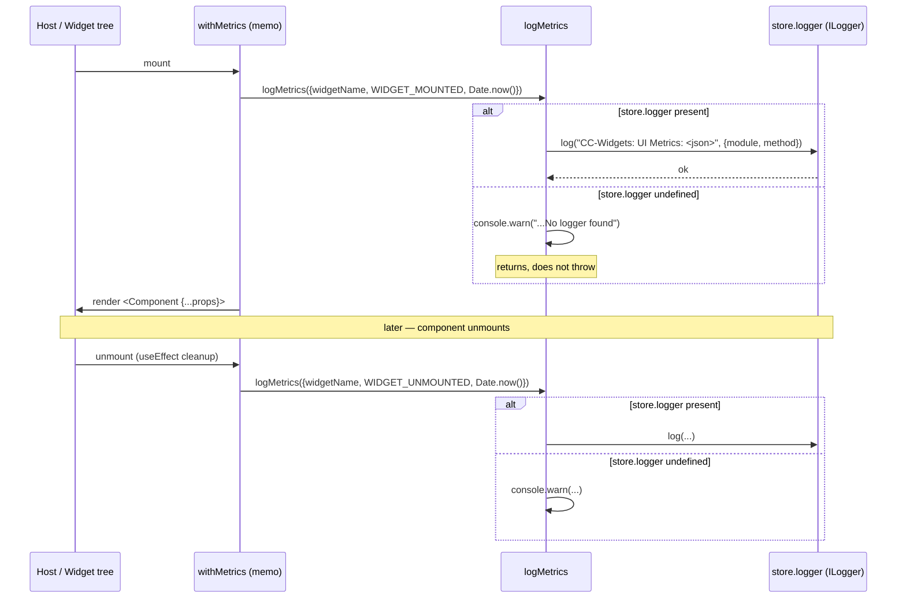
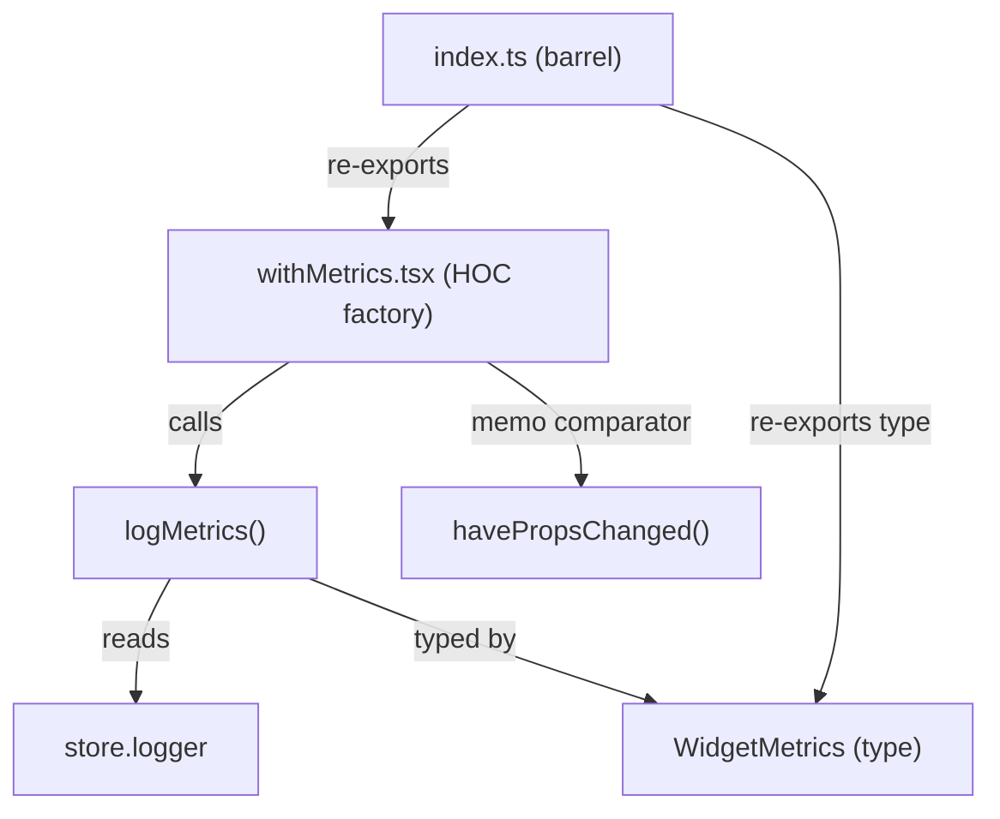

# ui-logging — SPEC

> Start here → root [`AGENTS.md`](../../../../AGENTS.md) (agent entry) · router [`SPEC_INDEX.md`](../../../../ai-docs/SPEC_INDEX.md) · system [`ARCHITECTURE.md`](../../../../ai-docs/ARCHITECTURE.md). This is the module's canonical spec: orientation, requirements, design, flows, and tests.
> Context-efficiency: link to canonical docs — don't duplicate them. Load specs on demand per `SPEC_INDEX.md`.

## Metadata
| Field | Value |
|---|---|
| Module id | `ui-logging` |
| Source path(s) | `packages/contact-center/ui-logging/src/` |
| Doc kind | Module spec |
| Coverage score | Pending coverage assessment |
| Generated from | `module-spec` @ SDLC template library `0.1.0-draft` |
| generated_by / approved_by / updated_at | generated_by `migration agent` / approved_by `[NEEDS HUMAN INPUT]` / updated_at `2026-06-29` |
| Validation status | not-run |

Coverage score: `Pending coverage assessment` before the first report; after assessment, replace with
`<0-100%>` plus the report path/evidence. Keep manifest coverage state outside the rendered module doc
metadata.

## Evidence Rules
Every generated requirement below must cite concrete source evidence using `file path`. Separate source
evidence, test evidence, examples, assumptions, and gaps so validators and future agents can distinguish
truth from context. Test evidence is preferred for WHY. Commit evidence is allowed only when the
repository policy says history is reliable, and must include the commit hash. If evidence is missing or
conflicting, ask a focused discovery question before finalizing the requirement; record unresolved answers
as approved unknowns only when the human explicitly defers or does not know.

## Source Material Register
| Source doc | Scope | Decision | Detail location or disposition |
|---|---|---|---|
| `ai-docs/_archive/pre-sdlc-migration/packages/contact-center/ui-logging/ai-docs/AGENTS.md` | overview / API | migrated | Overview, Purpose, Public Surface, Use Cases. `logMetrics`/`havePropsChanged` documented as public API in the archive but are NOT exported from `src/index.ts` — reconciled to internal in Public Surface. |
| `ai-docs/_archive/pre-sdlc-migration/packages/contact-center/ui-logging/ai-docs/ARCHITECTURE.md` | architecture / tests | reconciled | Design Overview, Data Flow, Sequence Diagram(s), Pitfalls. Archive's `WidgetMetrics` example omits `event` union, `props`, `additionalContext` — corrected from `src/metricsLogger.ts`. `PROPS_UPDATED` is documented as a future event; code confirms it is unused (TODO CAI-6890 in `src/withMetrics.tsx`). |

## Overview
`ui-logging` is the metrics/telemetry utility for Webex Contact Center widgets, published as
`@webex/cc-ui-logging`. It owns two concerns: a React Higher-Order Component (`withMetrics`) that
auto-emits widget lifecycle metrics, and an internal logging helper (`logMetrics`) that forwards a
typed metric record to the store's logger. It is the lowest-level shared package consumed by every
widget that needs observability, and it depends only on `@webex/cc-store` plus React (peer).

The module is a thin, dependency-light wrapper. It does not own a sink, transport, queue, or any
persisted state — it formats a metric as a JSON string and hands it to `store.logger.log()`, which is
the SDK `LoggerProxy` wired in `@webex/cc-store`. The store's logger is the actual telemetry destination;
`ui-logging` is a pure pass-through formatter plus a render-lifecycle observer.

A maintainer should start at `src/index.ts` (the export barrel — only `withMetrics` and the
`WidgetMetrics` type are public), then read `src/withMetrics.tsx` (the HOC + memo comparator) and
`src/metricsLogger.ts` (the logging helper and the shallow `havePropsChanged` comparator).

## Purpose / Responsibility
Owns emission of widget lifecycle telemetry: wrap a React component so it logs `WIDGET_MOUNTED` on
mount and `WIDGET_UNMOUNTED` on unmount via the store logger. Does NOT own the logging sink/transport,
log persistence, or prop sanitization.

## Stack
TypeScript ^5.6.3, React (peer `>=18.3.1`, `react-dom >=18.3.1`) HOC + hooks. Tests: Jest 29.7.0 +
React Testing Library 16.0.1 + `@testing-library/jest-dom`, jsdom environment. Build: Webpack 5
(`webpack --mode=development`), output to `dist/`. Source of truth: `package.json`.

## Folder / Package Structure
```
packages/contact-center/ui-logging/
├── src/
│   ├── index.ts            # Public export barrel: withMetrics + WidgetMetrics type
│   ├── withMetrics.tsx     # HOC: memoized lifecycle-tracking wrapper
│   └── metricsLogger.ts    # logMetrics() + WidgetMetrics type + havePropsChanged() (internal)
├── tests/
│   ├── withMetrics.test.tsx    # HOC mount/unmount/passthrough/memo tests
│   └── metricsLogger.test.ts   # logMetrics + havePropsChanged tests
├── package.json            # name, version, deps, scripts (source of truth for stack)
├── tsconfig.json
└── tsconfig.test.json
```

## Key Files (source of truth)
| File | Holds |
|---|---|
| `packages/contact-center/ui-logging/src/index.ts` | The public export barrel — authoritative list of what this package exposes (`withMetrics`, `WidgetMetrics`). |
| `packages/contact-center/ui-logging/src/metricsLogger.ts` | The `WidgetMetrics` type (canonical event union), the `logMetrics` formatter, and the `havePropsChanged` comparator. |
| `packages/contact-center/ui-logging/src/withMetrics.tsx` | The HOC behavior: which lifecycle events fire and the `React.memo` comparator wiring. |
| `packages/contact-center/ui-logging/package.json` | Package name, version, dependency/peer-dependency floors, build/test scripts. |

## Public Surface
This package is consumed as an imported SDK/code API (npm package `@webex/cc-ui-logging`); it has no
network/event/CLI contract. Only the symbols re-exported from `src/index.ts` are public. `logMetrics`
and `havePropsChanged` live in `src/metricsLogger.ts` and are exercised by tests but are NOT in the
export barrel — they are internal.

| Contract ID | Type | Surface | Purpose | Compatibility / deprecation | Schema / detail link | Root index |
|---|---|---|---|---|---|---|
| `ui-logging.withMetrics` | SDK | `withMetrics<P extends object>(Component, widgetName: string): React.MemoExoticComponent` | Wrap a widget so it auto-emits mount/unmount metrics; provided to every widget needing telemetry. | stable; default export re-exported as named `withMetrics`. Signature change = major. | `packages/contact-center/ui-logging/src/withMetrics.tsx` | `../../../../ai-docs/CONTRACTS.md` |
| `ui-logging.WidgetMetrics` | SDK | `type WidgetMetrics = { widgetName: string; event: 'WIDGET_MOUNTED' \| 'ERROR' \| 'WIDGET_UNMOUNTED' \| 'PROPS_UPDATED'; props?; timestamp: number; additionalContext? }` | Type for the metric record callers construct. | stable; adding an optional field = minor, narrowing the `event` union or removing a field = major. | `packages/contact-center/ui-logging/src/metricsLogger.ts` | `../../../../ai-docs/CONTRACTS.md` |

Compatibility notes:
- Adding a new value to the `event` union or a new optional field on `WidgetMetrics` is additive (minor).
- Removing/renaming `withMetrics`, narrowing the `event` union, or changing the `withMetrics` parameter order is breaking (major) — every widget package imports `withMetrics`.

## Requires (dependencies)
- `@webex/cc-store` (`workspace:*`) — for `store.logger` (`ILogger`, set from `cc.LoggerProxy` in `packages/contact-center/store/src/store.ts:83`). `logMetrics` reads `store.logger` at call time and degrades gracefully (warns, returns) if it is absent. No fallback sink.
- React + react-dom — peer `>=18.3.1` (`package.json`); needed for the HOC, `React.memo`, and `useEffect`.

## Requirements
| ID | WHAT | WHY | Source Evidence | Test / Example Evidence | Assumptions / Gaps | Confidence |
|---|---|---|---|---|---|---|
| `ui-logging-R-001` | `withMetrics(Component, widgetName)` emits a `WIDGET_MOUNTED` metric (with `widgetName` and `Date.now()` timestamp) when the wrapped component mounts. | Lifecycle observability — track widget initialization/usage. | `packages/contact-center/ui-logging/src/withMetrics.tsx` | `packages/contact-center/ui-logging/tests/withMetrics.test.tsx` ("should log metrics on mount") | none | PRESENT |
| `ui-logging-R-002` | The HOC emits a `WIDGET_UNMOUNTED` metric on unmount via the `useEffect` cleanup. | Track session duration / cleanup; complements mount. | `packages/contact-center/ui-logging/src/withMetrics.tsx` | `packages/contact-center/ui-logging/tests/withMetrics.test.tsx` ("should log metrics on unmount") | none | PRESENT |
| `ui-logging-R-003` | The wrapped component receives the original props unchanged (transparent pass-through). | The HOC must be a non-invasive wrapper. | `packages/contact-center/ui-logging/src/withMetrics.tsx` (`<Component {...props} />`) | `packages/contact-center/ui-logging/tests/withMetrics.test.tsx` ("should pass through props to wrapped component") | none | PRESENT |
| `ui-logging-R-004` | The HOC re-renders the wrapped component only when props change per shallow comparison; identical props skip the render. | Performance — avoid re-render churn from unstable parent references. | `packages/contact-center/ui-logging/src/withMetrics.tsx` (memo comparator `!havePropsChanged`) + `metricsLogger.ts` (`havePropsChanged`) | `packages/contact-center/ui-logging/tests/withMetrics.test.tsx` ("should not re-render…", "should re-render when props have changed") | none | PRESENT |
| `ui-logging-R-005` | `logMetrics` forwards the metric to `store.logger.log()` as `"CC-Widgets: UI Metrics: <pretty-JSON>"` with context `{module: 'metricsLogger.tsx', method: 'logMetrics'}`. | Centralized, identifiable telemetry routed through the store logger. | `packages/contact-center/ui-logging/src/metricsLogger.ts` | `packages/contact-center/ui-logging/tests/metricsLogger.test.ts` ("should log metrics when logger is available") | none | PRESENT |
| `ui-logging-R-006` | When `store.logger` is absent, `logMetrics` emits a single `console.warn('CC-Widgets: UI Metrics: No logger found')` and returns without throwing. | Graceful degradation — widgets must render even when no logger is wired. | `packages/contact-center/ui-logging/src/metricsLogger.ts` | `packages/contact-center/ui-logging/tests/metricsLogger.test.ts` ("should handle case when logger is not available") | none | PRESENT |
| `ui-logging-R-007` | `havePropsChanged` performs a shallow comparison: `false` for reference-equal or shallow-equal inputs, `true` on differing type, key set, or any first-level value (objects/arrays compared by reference). | Drives the memo comparator; must not deep-compare while props are unsanitized. | `packages/contact-center/ui-logging/src/metricsLogger.ts` | `packages/contact-center/ui-logging/tests/metricsLogger.test.ts` (7 `havePropsChanged` cases) | none | PRESENT |
| `ui-logging-R-008` | The metric payload emitted by the HOC contains only `widgetName`, `event`, and `timestamp` — never raw widget props or credentials. | Privacy — props are not sanitized, so the HOC must not log them (see `havePropsChanged` remark). | `packages/contact-center/ui-logging/src/withMetrics.tsx` (no `props` field passed); `metricsLogger.ts` (`havePropsChanged` `@remarks`: props are unsanitized) | `packages/contact-center/ui-logging/tests/withMetrics.test.tsx` (asserts exact mount/unmount payload, no `props`) | `WidgetMetrics` *allows* optional `props`/`additionalContext`; callers using them must sanitize first. Gap: no automated test enforces PII-absence for caller-supplied `props`. | PRESENT |

## Design Overview
The module separates the React concern (lifecycle observation + render gating) from the logging concern
(formatting + sink dispatch). `withMetrics.tsx` is a HOC factory: it wraps a component in `React.memo`
with a custom comparator and registers a single mount-effect whose cleanup fires on unmount. The
comparator is `(_prev, next) => !havePropsChanged(prev, next)` — note React's `memo` comparator returns
`true` to *skip* re-render, so the helper is negated.

`metricsLogger.ts` holds the pure pieces. `logMetrics` is intentionally side-effect-only and
fail-soft: it reads `store.logger` lazily at call time (so it works regardless of store init order),
warns-and-returns if absent, and otherwise pretty-prints the metric into a tagged log line with a
fixed module/method context for grep-ability. `havePropsChanged` is a deliberately shallow comparator
— the inline `@remarks` document that deep comparison is withheld until props are sanitized, because a
deep diff over unsanitized props risks logging/processing PII.

`PROPS_UPDATED` exists in the `WidgetMetrics` event union but is not emitted anywhere; it is reserved
for the future feature tracked by TODO CAI-6890 in `withMetrics.tsx`.

## Data Flow
In-process function calls only (no network/queue). A widget is wrapped at module load; at runtime the
HOC's `useEffect` fires `logMetrics`, which formats and forwards to the store logger (the SDK
`LoggerProxy`), which is the telemetry sink.



## Sequence Diagram(s)
Sequence coverage:

| Operation group | Diagram | Failure / recovery coverage |
|---|---|---|
| Widget mount/unmount metric emission (the module's single behavior) | "Lifecycle metric emission" | `alt` branch: `store.logger` absent → `console.warn` + return, no throw |



## Class / Component Relationships

`withMetrics` is the only public runtime symbol; it composes the two internal helpers from
`metricsLogger.ts`. `WidgetMetrics` is the public type shared by `logMetrics` and the HOC's emitted
payloads. There are no classes — the module is functional/HOC-based.

## Use Cases
- **UC-1 Track widget lifecycle:** a widget package wraps its presentational component as
  `withMetrics(WidgetInternal, 'WidgetName')` → on mount a `WIDGET_MOUNTED` metric is logged, on unmount
  a `WIDGET_UNMOUNTED` metric is logged, props pass through untouched. Evidence:
  `packages/contact-center/ui-logging/src/withMetrics.tsx`,
  `packages/contact-center/ui-logging/tests/withMetrics.test.tsx`.
- **UC-2 Render gating:** parent re-renders with shallow-equal props → the memoized wrapper skips
  re-rendering the wrapped component; only changed props trigger a re-render. Evidence:
  `packages/contact-center/ui-logging/src/withMetrics.tsx` (comparator),
  `packages/contact-center/ui-logging/tests/withMetrics.test.tsx` (re-render cases).

## Error Handling & Failure Modes
| Condition | Signal (error/code/result) | Caller recovery |
|---|---|---|
| `store.logger` undefined at `logMetrics` call time | `console.warn('CC-Widgets: UI Metrics: No logger found')`, function returns; metric is dropped | No exception — widget keeps rendering. To capture metrics, ensure the store logger is initialized before widgets mount. |

The module raises no errors callers must catch; its only failure mode is a silently-dropped metric
(`ui-logging-R-006`). Evidence: `packages/contact-center/ui-logging/src/metricsLogger.ts`.

## Pitfalls
- Metric payload omits `props` intentionally (`ui-logging-R-008`). If a future change adds `props` to
  the HOC's emitted metric, it would log unsanitized widget props — a PII risk. The `havePropsChanged`
  `@remarks` document this: deep comparison/prop logging is withheld until sanitization exists.
- `React.memo`'s comparator returns `true` to *skip* re-render, so the wiring is `!havePropsChanged(...)`.
  Inverting this (forgetting the `!`) silently disables memoization or freezes updates.
- `havePropsChanged` is shallow: nested object/array changes are detected only if the reference changes.
  A widget mutating a nested object in place will NOT re-render. Pass new references for changed data.
- Unstable inline props (`onChange={() => {}}`, `config={{...}}`) defeat memoization — every parent
  render produces new references, so the wrapped component always re-renders. Memoize callbacks/objects
  in the parent.
- `logMetrics` reads `store.logger` lazily per call; if widgets mount before the store logger is wired,
  early mount metrics are dropped with only a console warning (no retry/buffer).
- `PROPS_UPDATED` is in the `event` union but never emitted (TODO CAI-6890). Do not assume it fires.

## Module Do's / Don'ts
- DO: wrap widget components with `withMetrics(Component, 'Name')` from `@webex/cc-ui-logging` for lifecycle telemetry.
- DO: keep the HOC's emitted metric to non-PII fields (`widgetName`, `event`, `timestamp`).
- DON'T: log raw widget props or credentials through `logMetrics` — props are not sanitized.
- DON'T: import `logMetrics`/`havePropsChanged` from internal paths as if public; only `withMetrics` and `WidgetMetrics` are exported by `index.ts`.
- DON'T: rely on `PROPS_UPDATED` being emitted.

## Export Stability
Public exports are `withMetrics` (named, re-exported from default) and the `WidgetMetrics` type, both
from `src/index.ts`; the package ships `dist/index.d.ts` declarations. Semver: adding an optional field
to `WidgetMetrics` or a new `event` union value is a minor (additive) change; removing/renaming
`withMetrics`, changing its parameter order, narrowing the `event` union, or removing a `WidgetMetrics`
field is a major (breaking) change because every widget package imports `withMetrics`. `logMetrics` and
`havePropsChanged` are NOT exported and may change without a major bump.

## Host Integration & Theming
N/A — the HOC is consumed by other widget packages within the monorepo, not mounted directly into a
host application, and renders no UI of its own (it returns the wrapped component verbatim:
`<Component {...props} />` in `packages/contact-center/ui-logging/src/withMetrics.tsx`). It has no
theming, custom-element, or provider requirements.

## Key Design Trade-off
- Shallow comparison over deep comparison in `havePropsChanged`: favors privacy + simplicity over
  precise change detection. It preserves the invariant that unsanitized props are never deep-traversed
  or logged; the cost is that in-place nested mutations don't trigger re-renders, so callers must pass
  fresh references. Evidence: `@remarks` in `packages/contact-center/ui-logging/src/metricsLogger.ts`.

## Test-Case Strategy (module)
Unit tests cover both modules. `withMetrics.test.tsx` uses RTL `render`/`unmount` with fake timers to
assert exact mount/unmount metric payloads (positive), prop pass-through, and memo behavior on both
unchanged (skip) and changed (re-render) props. `metricsLogger.test.ts` asserts `logMetrics` forwards
to `store.logger.log` with the exact tagged string + context (positive) and warns when the logger is
missing (negative), plus seven `havePropsChanged` cases spanning primitives, type mismatch, key-set
diff, reference identity, and null/undefined. Edge cases covered: missing logger, reference-shared
nested objects, null vs undefined. Eventual consistency: N/A (synchronous in-process calls).

| Behavior / Requirement | Existing test evidence | Gap |
|---|---|---|
| `ui-logging-R-001` (mount metric) | `tests/withMetrics.test.tsx` ("should log metrics on mount") | none |
| `ui-logging-R-002` (unmount metric) | `tests/withMetrics.test.tsx` ("should log metrics on unmount") | none |
| `ui-logging-R-003` (prop pass-through) | `tests/withMetrics.test.tsx` ("should pass through props…") | none |
| `ui-logging-R-004` (memo re-render gating) | `tests/withMetrics.test.tsx` (re-render cases) | none |
| `ui-logging-R-005` (forward to store logger) | `tests/metricsLogger.test.ts` ("should log metrics when logger is available") | none |
| `ui-logging-R-006` (graceful no-logger) | `tests/metricsLogger.test.ts` ("should handle case when logger is not available") | none |
| `ui-logging-R-007` (shallow comparison) | `tests/metricsLogger.test.ts` (7 `havePropsChanged` cases) | none |
| `ui-logging-R-008` (no PII in emitted metric) | `tests/withMetrics.test.tsx` (asserts exact payload, no `props`) | No test enforces sanitization of caller-supplied `props`/`additionalContext`. |

## Traceability
- Repo architecture: `../../../../ai-docs/ARCHITECTURE.md` · Registry: `../../../../ai-docs/SPEC_INDEX.md`
- Coverage state & contracts baseline: `.sdd/manifest.json`
