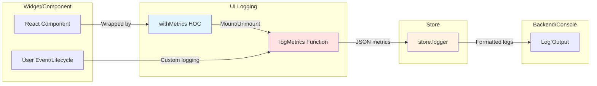
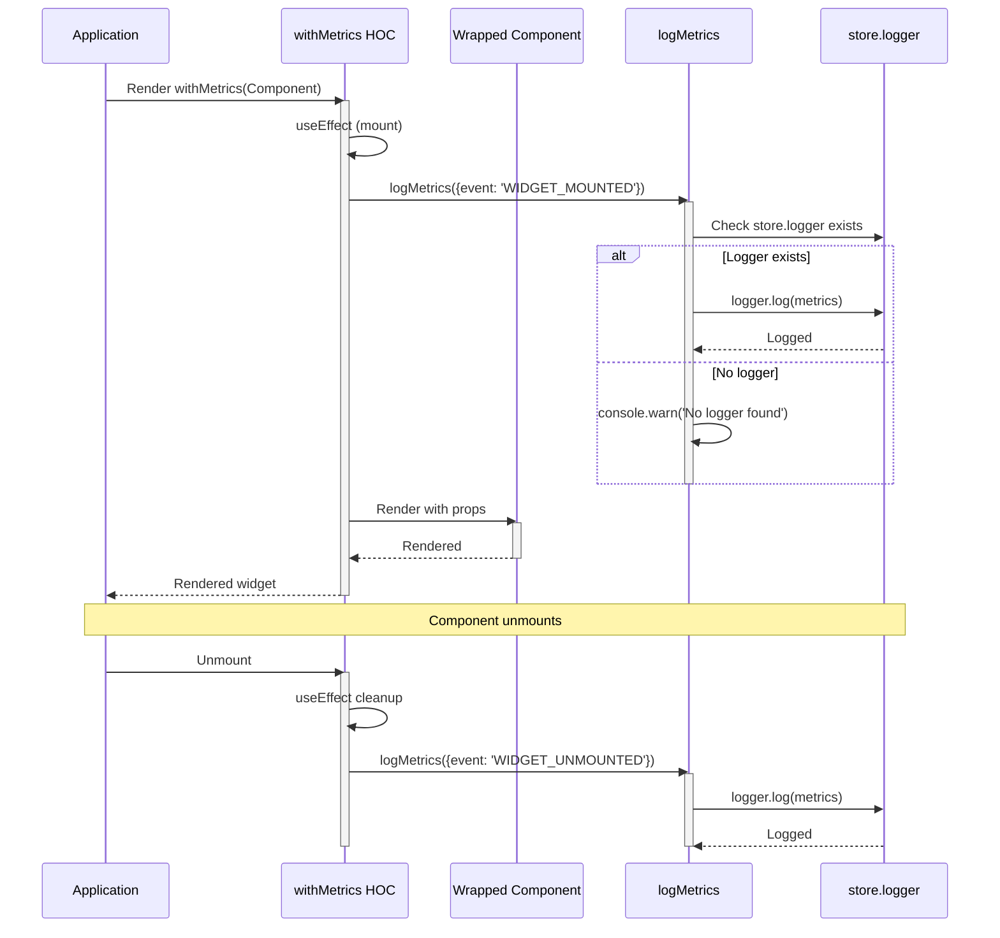
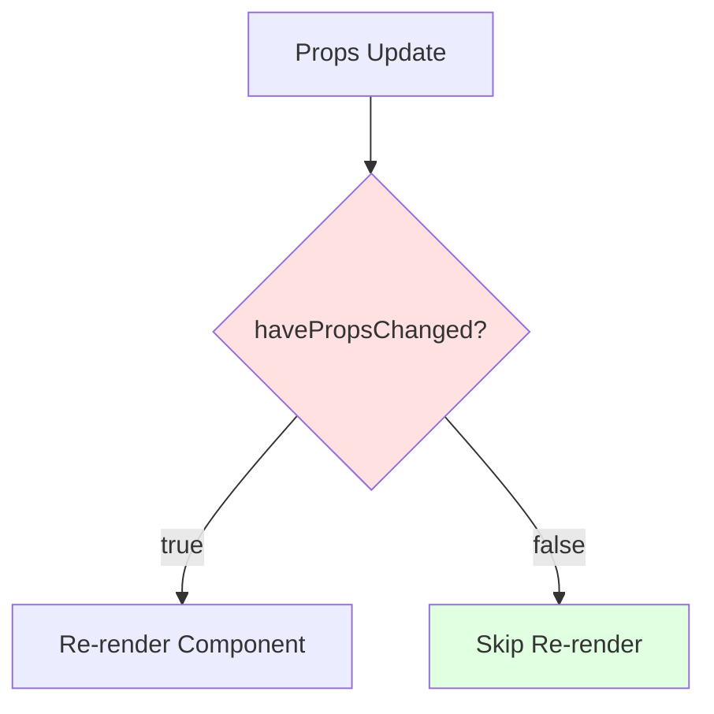

# UI Logging - Architecture

## Component Overview

UI Logging is a utility package that provides metrics tracking through a Higher-Order Component (HOC) pattern and direct logging functions. It integrates with the store's logger to provide centralized metrics collection.

### Module Table

| Module | File | Exports | Purpose | Dependencies |
|--------|------|---------|---------|--------------|
| **withMetrics HOC** | `src/withMetrics.tsx` | `withMetrics` (default) | Wraps components with lifecycle tracking | React, metricsLogger |
| **metricsLogger** | `src/metricsLogger.ts` | `logMetrics`, `havePropsChanged`, `WidgetMetrics` (type) | Logging functions and utilities | @webex/cc-store |
| **Package Entry** | `src/index.ts` | All exports | Main package export | Both modules above |

### File Structure

```
ui-logging/
├── src/
│   ├── index.ts                # Package exports
│   ├── metricsLogger.ts        # Logging functions
│   └── withMetrics.tsx         # HOC implementation
├── tests/
│   ├── metricsLogger.test.ts   # Logger tests
│   └── withMetrics.test.tsx    # HOC tests
├── dist/
│   ├── index.js                # Build output
│   └── types/
│       ├── index.d.ts
│       ├── metricsLogger.d.ts
│       └── withMetrics.d.ts
├── package.json
├── tsconfig.json
└── webpack.config.js
```

---

## Data Flows

### Metrics Logging Flow



### HOC Lifecycle Flow



---

## Implementation Details

### withMetrics HOC

**File:** `src/withMetrics.tsx`

The HOC wraps components to track lifecycle events:

```typescript
export default function withMetrics<P extends object>(
  Component: any,
  widgetName: string
) {
  return React.memo(
    (props: P) => {
      // Track mount and unmount
      useEffect(() => {
        logMetrics({
          widgetName,
          event: 'WIDGET_MOUNTED',
          timestamp: Date.now(),
        });

        return () => {
          logMetrics({
            widgetName,
            event: 'WIDGET_UNMOUNTED',
            timestamp: Date.now(),
          });
        };
      }, []);

      return <Component {...props} />;
    },
    // Custom comparison function
    (prevProps, nextProps) => !havePropsChanged(prevProps, nextProps)
  );
}
```

**Key Features:**
- Uses `React.memo` for performance optimization
- Custom props comparison via `havePropsChanged`
- Single `useEffect` with cleanup for lifecycle tracking
- Props passed through transparently

---

### logMetrics Function

**File:** `src/metricsLogger.ts`

Logs metrics to store.logger:

```typescript
export const logMetrics = (metric: WidgetMetrics) => {
  if (!store.logger) {
    console.warn('CC-Widgets: UI Metrics: No logger found');
    return;
  }
  store.logger.log(
    `CC-Widgets: UI Metrics: ${JSON.stringify(metric, null, 2)}`,
    {
      module: 'metricsLogger.tsx',
      method: 'logMetrics',
    }
  );
};
```

**Behavior:**
- Checks for `store.logger` existence
- Warns to console if logger missing (doesn't throw)
- Formats metrics as JSON string
- Includes module/method context

---

### havePropsChanged Function

**File:** `src/metricsLogger.ts`

Performs shallow comparison to detect prop changes:

```typescript
export function havePropsChanged(prev: any, next: any): boolean {
  if (prev === next) return false;

  // Type check
  if (typeof prev !== typeof next) return true;
  if (!prev || !next) return prev !== next;

  // Compare keys
  const prevKeys = Object.keys(prev);
  const nextKeys = Object.keys(next);
  if (prevKeys.length !== nextKeys.length) return true;

  // Compare primitive values (shallow)
  for (const key of prevKeys) {
    const prevVal = prev[key];
    const nextVal = next[key];

    if (prevVal === nextVal) continue;
    if (typeof prevVal !== 'object' || prevVal === null) return true;
    if (typeof nextVal !== 'object' || nextVal === null) return true;
  }

  return false;
}
```

**Logic:**
- Reference equality check first (fastest)
- Type comparison
- Key count comparison
- Shallow primitive comparison
- **Does NOT** deep compare nested objects (intentional for performance)

**Use Case:**
Used by `React.memo` to prevent unnecessary re-renders when props haven't actually changed.

---

## Metrics Events

### Event Types

| Event | When Fired | Use Case |
|-------|-----------|----------|
| `WIDGET_MOUNTED` | Component mounted to DOM | Track widget usage, initialization time |
| `WIDGET_UNMOUNTED` | Component unmounted from DOM | Track session duration, cleanup |
| `ERROR` | Error occurred | Track failures, debug issues |
| `PROPS_UPDATED` | Props changed (future) | Track configuration changes |

### Metrics Data Structure

```typescript
type WidgetMetrics = {
  widgetName: string;           // e.g., 'StationLogin'
  event: string;                // e.g., 'WIDGET_MOUNTED'
  props?: Record<string, any>;  // Optional props snapshot
  timestamp: number;            // Unix timestamp
  additionalContext?: Record<string, any>; // Custom data
};
```

**Example Logged Metric:**

```json
{
  "widgetName": "StationLogin",
  "event": "WIDGET_MOUNTED",
  "timestamp": 1700000000000,
  "props": {
    "profileMode": false,
    "teamId": "team123"
  },
  "additionalContext": {
    "userAgent": "Chrome/120.0",
    "sessionId": "session-abc"
  }
}
```

---

## Performance Optimization

### React.memo with Custom Comparison

The HOC uses `React.memo` with `havePropsChanged` to optimize re-renders:



**Benefits:**
- Prevents unnecessary re-renders
- Reduces PROPS_UPDATED events
- Improves performance for widgets with frequent parent updates

**Trade-off:**
- Shallow comparison only (nested object changes might be missed)
- Intentional design choice to avoid deep comparison overhead

---

## Store Integration

### Logger Dependency

The package relies on `store.logger` being initialized:

```typescript
// store.logger must be set before using ui-logging
import store from '@webex/cc-store';

store.setLogger({
  log: (...args) => console.log(...args),
  error: (...args) => console.error(...args),
  warn: (...args) => console.warn(...args),
  info: (...args) => console.info(...args),
});

// Now logMetrics will work
logMetrics({ ... });
```

**Graceful Degradation:**
- If `store.logger` is undefined, logs warning to console
- Does NOT throw error (allows widgets to work without logger)

---

## Troubleshooting Guide

### Common Issues

#### 1. Metrics Not Logging

**Symptoms:**
- No metrics appearing in logs
- Silent failures

**Possible Causes:**
- `store.logger` not initialized
- Logger object missing methods

**Solutions:**

```typescript
// Check if logger exists
import store from '@webex/cc-store';
console.log('Logger exists:', store.logger !== undefined);

// Set logger if missing
store.setLogger({
  log: console.log,
  error: console.error,
  warn: console.warn,
  info: console.info,
});

// Verify logging works
import { logMetrics } from '@webex/cc-ui-logging';
logMetrics({
  widgetName: 'Test',
  event: 'WIDGET_MOUNTED',
  timestamp: Date.now()
});
```

#### 2. Component Re-rendering Too Often

**Symptoms:**
- Component re-renders on every parent update
- Performance degradation

**Possible Causes:**
- Props comparison not working
- Passing new object/function references

**Solutions:**

```typescript
// Ensure stable prop references
import { useCallback, useMemo } from 'react';

const Parent = () => {
  // ✅ Memoized callback
  const handleChange = useCallback(() => {}, []);
  
  // ✅ Memoized object
  const config = useMemo(() => ({ option: 'value' }), []);

  return <WidgetWithMetrics onChange={handleChange} config={config} />;
};

// ❌ Avoid inline functions/objects
<WidgetWithMetrics 
  onChange={() => {}}        // New function every render
  config={{ option: 'value' }}  // New object every render
/>
```

#### 3. TypeScript Type Errors

**Symptoms:**
- Type errors with WidgetMetrics
- Event type not recognized

**Possible Causes:**
- Using incorrect event type
- Missing type import

**Solutions:**

```typescript
// Import type
import type { WidgetMetrics } from '@webex/cc-ui-logging';

// Use correct event types
const metric: WidgetMetrics = {
  widgetName: 'MyWidget',
  event: 'WIDGET_MOUNTED', // Must be one of the allowed event types
  timestamp: Date.now()
};

// For custom events, use WIDGET_MOUNTED with additionalContext
const customMetric: WidgetMetrics = {
  widgetName: 'MyWidget',
  event: 'WIDGET_MOUNTED',
  timestamp: Date.now(),
  additionalContext: {
    customEvent: 'button_clicked'
  }
};
```

#### 4. HOC Not Tracking Unmount

**Symptoms:**
- WIDGET_MOUNTED logged
- WIDGET_UNMOUNTED never logged

**Possible Causes:**
- Component never unmounted
- Cleanup function not running
- Page refreshed before unmount

**Solutions:**

```typescript
// Verify component actually unmounts
useEffect(() => {
  console.log('Component mounted');
  
  return () => {
    console.log('Component cleanup'); // Should see this
  };
}, []);

// For navigation/page changes
window.addEventListener('beforeunload', () => {
  // Log before page unload
  logMetrics({
    widgetName: 'MyWidget',
    event: 'WIDGET_UNMOUNTED',
    timestamp: Date.now()
  });
});
```

---

## Related Documentation

- [Agent Documentation](./agent.md) - Usage examples and API
- [React Patterns](../../../../ai-docs/patterns/react-patterns.md) - HOC patterns
- [CC Store Documentation](../../store/ai-prompts/agent.md) - Logger configuration

---

_Last Updated: 2025-11-26_

