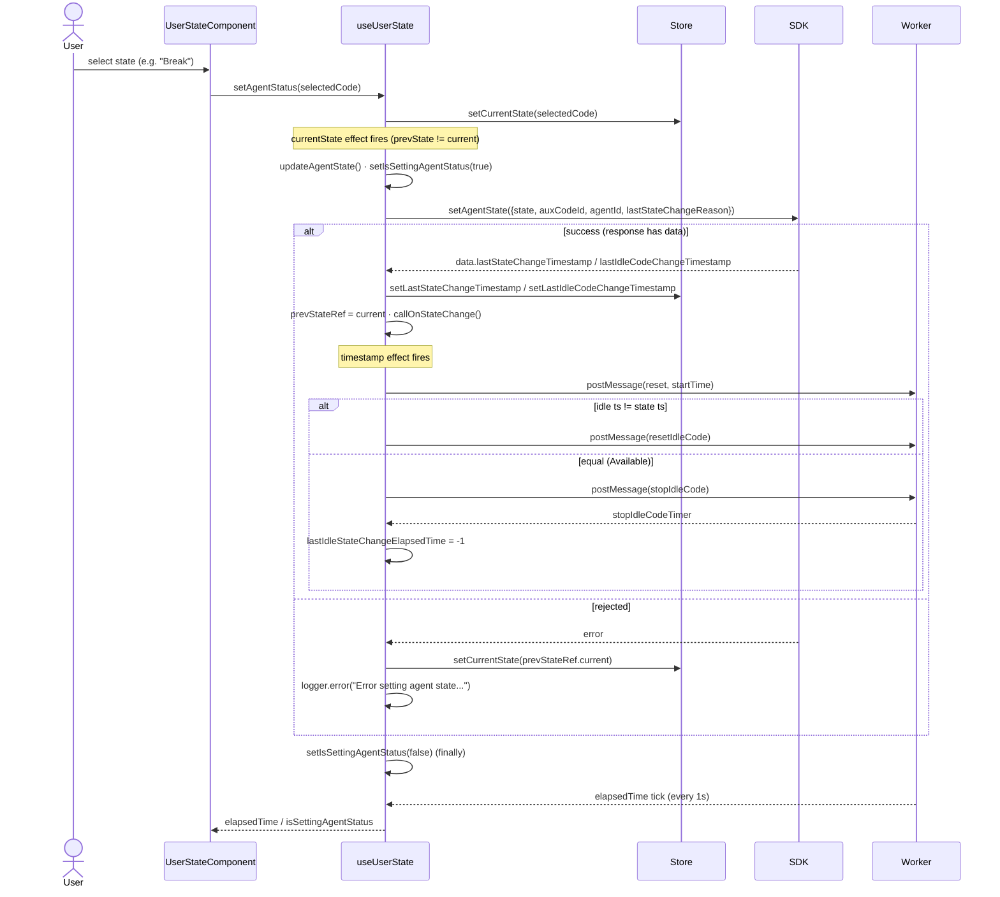
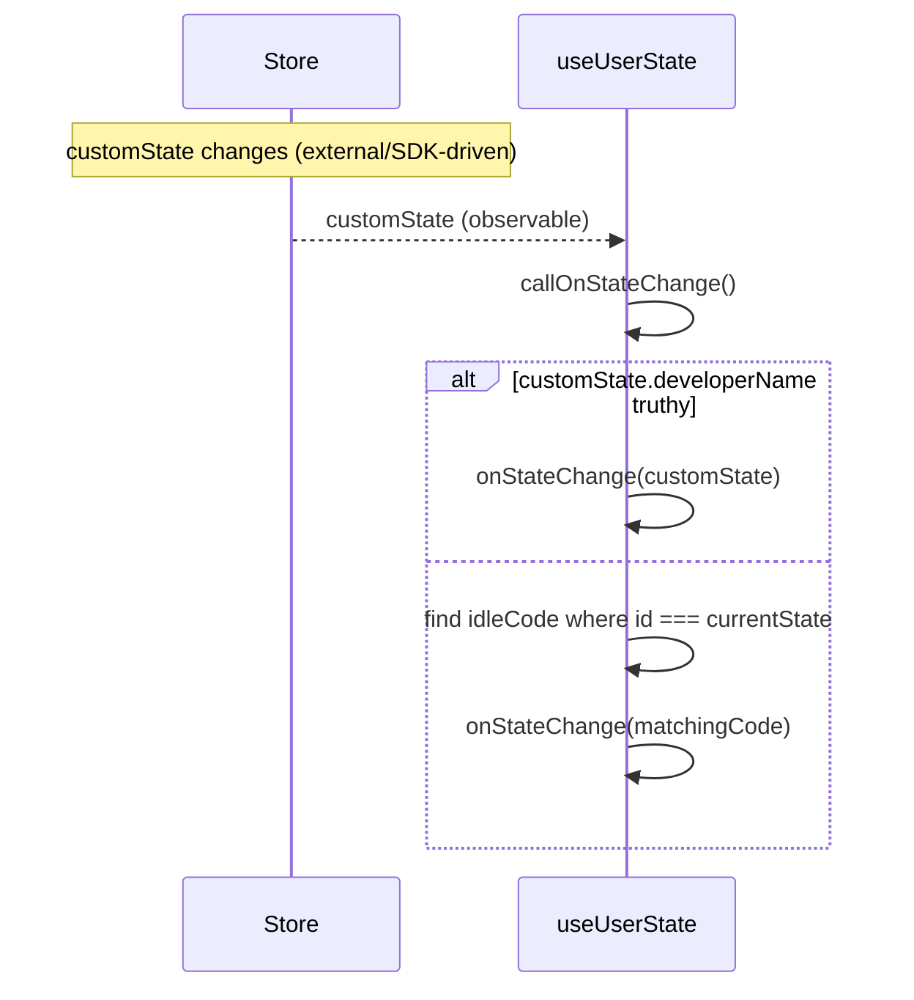
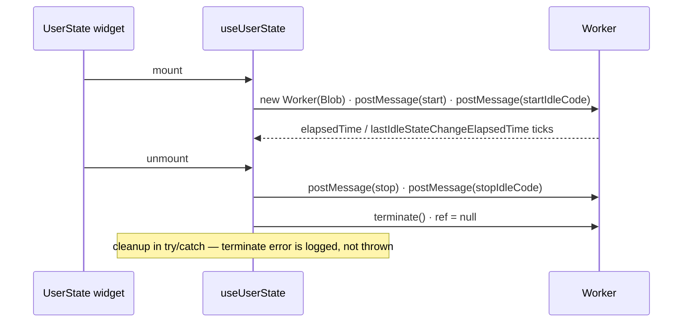
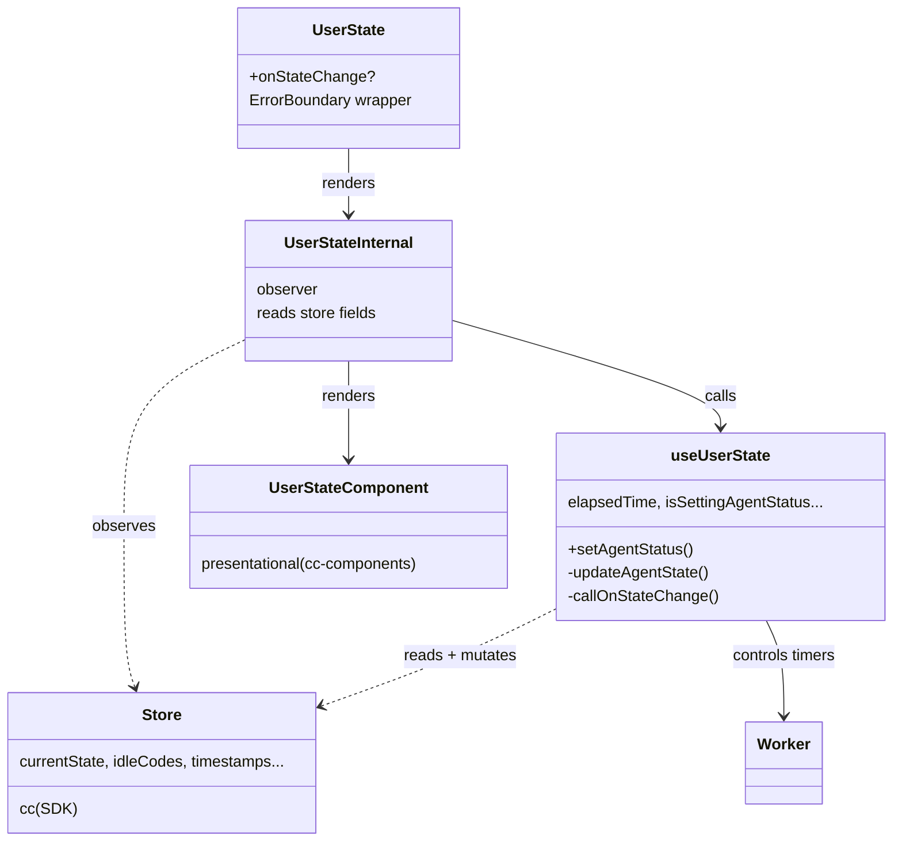
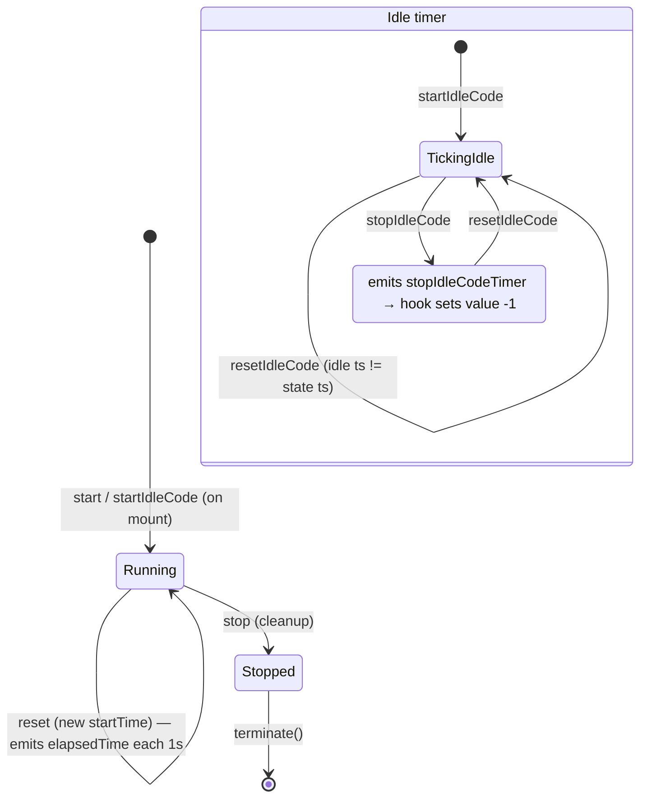

# user-state — SPEC

> Start here → root [`AGENTS.md`](../../../../AGENTS.md) (agent entry) · router [`SPEC_INDEX.md`](../../../../ai-docs/SPEC_INDEX.md) · system [`ARCHITECTURE.md`](../../../../ai-docs/ARCHITECTURE.md). This is the module's canonical spec: orientation, requirements, design, flows, state, UI, and tests.
> Context-efficiency: link to canonical docs — don't duplicate them. Load specs on demand per `SPEC_INDEX.md`.

## Metadata
| Field | Value |
|---|---|
| Module id | `user-state` |
| Source path(s) | `packages/contact-center/user-state/src/` |
| Doc kind | Module spec |
| Coverage score | Pending coverage assessment |
| Generated from | `module-spec` @ SDLC template library `0.1.0-draft` |
| generated_by / approved_by / updated_at | migration agent / [NEEDS HUMAN INPUT] / 2026-06-29 |
| Validation status | not-run |

Coverage score: `Pending coverage assessment` before the first report; after assessment, replace with `<0-100%>` plus the report path/evidence. Keep manifest coverage state outside the rendered module doc metadata.

## Evidence Rules
Every generated requirement below must cite concrete source evidence using `file path`. Separate source evidence, test evidence, examples, assumptions, and gaps so validators and future agents can distinguish truth from context. Test evidence is preferred for WHY. Commit evidence is allowed only when the repository policy says history is reliable, and must include the commit hash. If evidence is missing or conflicting, ask a focused discovery question before finalizing the requirement; record unresolved answers as approved unknowns only when the human explicitly defers or does not know.

## Source Material Register
| Source doc | Scope | Decision | Detail location or disposition |
|---|---|---|---|
| `ai-docs/_archive/pre-sdlc-migration/packages/contact-center/user-state/ai-docs/AGENTS.md` | overview / API | migrated | Orientation → Overview/Purpose/Stack; props → Public Surface; examples → Use Cases. Routing preamble dropped (root `AGENTS.md` now owns it). |
| `ai-docs/_archive/pre-sdlc-migration/packages/contact-center/user-state/ai-docs/ARCHITECTURE.md` | architecture / tests | reconciled | Layer/data flow → Design Overview + Data Flow + Sequence Diagrams; worker timer detail → State Model + State Machine; troubleshooting → Pitfalls. The dual-timer "shows -1/0 on Available" claim reconciled against code: idle timer emits `-1` on stop (`src/helper.ts`). |

## Overview
`user-state` is the agent-availability widget for the Webex Contact Center desktop. It lets an agent change their presence (Available, or Idle with an aux/idle code) from a dropdown, shows how long the agent has been in the current state via a live elapsed timer, and tracks a second timer for time since the last idle-code change. State selection round-trips through the SDK so the backend stays authoritative.

The package follows the repo's one-directional layering: the exported `UserState` widget (`src/user-state/index.tsx`) is an `observer` that reads the MobX store, wires it through the `useUserState` hook (`src/helper.ts`), and renders the presentational `UserStateComponent` from `@webex/cc-components`. The widget owns no SDK access of its own — it routes state changes through the `useUserState` hook, which mutates the store via `store.setCurrentState(...)` and calls the SDK via `cc.setAgentState(...)` (the `cc` handle is read from the store), then reacts to store observables (`currentState`, `lastStateChangeTimestamp`, `lastIdleCodeChangeTimestamp`, `customState`) to drive callbacks and timers.

The only non-trivial machinery is local: a Web Worker created inline from a Blob runs the two `setInterval` timers off the main thread and posts elapsed seconds back to the hook. The hook holds the resulting UI state (`elapsedTime`, `lastIdleStateChangeElapsedTime`, `isSettingAgentStatus`) in React `useState`; everything else is derived from the store.

A maintainer should start at `src/helper.ts` (all behavior lives there) and treat `src/user-state/index.tsx` as a thin store→hook→component adapter.

## Purpose / Responsibility
Owns the agent-state UI surface: selecting Available/Idle states with idle codes, persisting the change through the SDK, and displaying state-duration and idle-code-duration timers. It does NOT own the store's state shape, idle-code loading, or SDK lifecycle — those belong to `store/`.

## Stack
TypeScript 5.6.3, React 18 (`react`/`react-dom` peer `>=18.3.1`), MobX via `mobx-react-lite` `^4.1.0`, `react-error-boundary` `^6.0.0`. Browser Web Worker API for timers (created from an inline Blob, no separate worker file). Build: `tsc` for types + Webpack for the bundle. Tests: Jest 29 + React Testing Library (`renderHook`/`render`), config in the package. Evidence: `packages/contact-center/user-state/package.json`.

## Folder / Package Structure
```
user-state/src/
├── index.ts              # Package barrel — re-exports UserState
├── user-state.types.ts   # IUserStateProps + UseUserStateProps (Pick from cc-components IUserState)
└── user-state/
    └── index.tsx         # UserState widget (ErrorBoundary + observer UserStateInternal)
helper.ts is at src/helper.ts   # useUserState hook + inline Web Worker timer script
tests/
├── helper.ts             # Hook behavior + error-path tests
└── user-state/index.tsx  # Widget render + ErrorBoundary tests
```

## Key Files (source of truth)
| File | Holds |
|---|---|
| `packages/contact-center/user-state/src/helper.ts` | The `useUserState` hook: Web Worker script, timer lifecycle, state-change effects, SDK call, error handling. All behavior. |
| `packages/contact-center/user-state/src/user-state/index.tsx` | The exported `UserState` widget; ErrorBoundary wrapping; which store fields are read and passed to the hook. |
| `packages/contact-center/user-state/src/user-state.types.ts` | The module's prop contracts (`IUserStateProps`, `UseUserStateProps`) as `Pick`s of the canonical `IUserState`. |
| `packages/contact-center/cc-components/src/components/UserState/user-state.types.ts` | Canonical `IUserState` / `UserStateComponentsProps` — the authoritative prop surface; do not redefine locally. |

## Public Surface
| Contract ID | Type | Surface | Purpose | Compatibility / deprecation | Schema / detail link | Root index |
|---|---|---|---|---|---|---|
| `cc-widgets.UserState` | SDK (React export) | `UserState` React component, prop `onStateChange?: (state: IdleCode \| ICustomState) => void` | Render the agent-state widget in a React app and observe state changes | stable semver; adding optional props = minor, removing/renaming `onStateChange` = major | `packages/contact-center/user-state/src/index.ts`, props in `src/user-state.types.ts` | `../../../../ai-docs/CONTRACTS.md` |
| `cc-widgets.UserState` (custom element) | event | custom element `widget-cc-user-state` (registered in `cc-widgets`); `onStateChange` exposed as an attribute/event by r2wc | Mount the widget as a Web Component in a non-React host | stable semver; tag name is part of the contract | `packages/contact-center/cc-widgets/src/wc.ts` (`{name: 'widget-cc-user-state', component: WebUserState}`) | `../../../../ai-docs/CONTRACTS.md` |

Compatibility notes:
- `onStateChange` is invoked with an `IdleCode` (the matching idle code for `currentState`) or an `ICustomState` (when the store holds a `customState` with a `developerName`). Changing which object is passed is a breaking change for consumers.
- The custom-element tag `widget-cc-user-state` is registered by `cc-widgets`, not this package; renaming it is a breaking change owned there.

## Requires (dependencies)
- `@webex/cc-store` (`workspace:*`) — singleton store; sole SDK access point. The hook reads `idleCodes`, `agentId`, `cc`, `currentState`, `customState`, `lastStateChangeTimestamp`, `lastIdleCodeChangeTimestamp`, `logger` and calls `store.setCurrentState`, `store.setLastStateChangeTimestamp`, `store.setLastIdleCodeChangeTimestamp`, `store.onErrorCallback`. SDK call: `cc.setAgentState(...)`.
- `@webex/cc-components` (`workspace:*`) — provides `UserStateComponent` (presentation) and the canonical `IUserState` types.
- `mobx-react-lite` `^4.1.0` — `observer` HOC for store reactivity.
- `react-error-boundary` `^6.0.0` — wraps the widget so render errors route to `store.onErrorCallback`.
- Browser **Web Worker** API — timers run in a worker created from an inline Blob; no fallback path exists (see Pitfalls).
- Peer: `react` / `react-dom` `>=18.3.1`.

## Requirements
| ID | WHAT | WHY | Source Evidence | Test / Example Evidence | Assumptions / Gaps | Confidence |
|---|---|---|---|---|---|---|
| `USER-STATE-R-001` | Selecting a state calls `store.setCurrentState(selectedCode)`; the resulting `currentState` change drives the SDK update — the UI does not call the SDK directly on selection. | Keeps the store authoritative; SDK persistence is a reaction to store change, not a side effect of the click. | `src/helper.ts` (`setAgentStatus`, `useEffect([currentState])`) | `tests/helper.ts` "should handle setAgentStatus correctly and update state" | none | PRESENT |
| `USER-STATE-R-002` | On `currentState` change, `cc.setAgentState({state, auxCodeId, agentId, lastStateChangeReason})` is called with `state` mapped to `'Available'` when the selected code name is `Available`, else `'Idle'`. | Backend distinguishes Available vs Idle; idle codes carry the human reason. | `src/helper.ts` (`updateAgentState`) | `tests/helper.ts` "should update last state change timestamp from setAgentState" (Available) + "should set idle status if name does not match: Available" (Idle) | none | PRESENT |
| `USER-STATE-R-003` | On a successful `setAgentState` response containing `data`, the store timestamps `lastStateChangeTimestamp` and `lastIdleCodeChangeTimestamp` are updated from the response. | Timer resets are driven off server-confirmed timestamps, not local click time. | `src/helper.ts` (`updateAgentState` `.then`) | `tests/helper.ts` "should update last state change timestamp from setAgentState" | none | PRESENT |
| `USER-STATE-R-004` | If `setAgentState` rejects, `currentState` is reverted to the previous value via `store.setCurrentState(prevStateRef.current)` and the error is logged. | The UI must not show a state the backend rejected. | `src/helper.ts` (`updateAgentState` `.catch`) | `tests/helper.ts` "should handle errors from setAgentState and revert state" | none | PRESENT |
| `USER-STATE-R-005` | A Web Worker runs two 1-second timers; the hook surfaces `elapsedTime` and `lastIdleStateChangeElapsedTime`, clamping negative values to `0` on update. | Off-main-thread timing keeps the UI responsive; clamp avoids showing negative durations. | `src/helper.ts` (workerScript, `onmessage`) | `tests/helper.ts` "should increment elapsedTime every second" / "should increment lastIdleStateChangeElapsedTime every second" | none | PRESENT |
| `USER-STATE-R-006` | When `lastStateChangeTimestamp`/`lastIdleCodeChangeTimestamp` change: post `reset` to the worker with the state timestamp; post `resetIdleCode` when the idle timestamp differs from the state timestamp, else post `stopIdleCode`. | Idle-code timer runs only while distinct from the state change (i.e. agent is idle), and stops on Available. | `src/helper.ts` (`useEffect([lastStateChangeTimestamp, lastIdleCodeChangeTimestamp])`) | `tests/helper.ts` "should post resetIdleCode message if lastIdleCodeChangeTimestamp is different from lastStateChangeTimestamp" | No test asserts the `stopIdleCode` branch when timestamps are equal | PRESENT |
| `USER-STATE-R-007` | On `stopIdleCodeTimer` worker message the hook sets `lastIdleStateChangeElapsedTime` to `-1` (sentinel for "no idle timer"). | Lets the presentational component hide the idle timer on Available. | `src/helper.ts` (`onmessage` `stopIdleCodeTimer` branch) | `tests/helper.ts` "should handle stopIdleCodeTimer event and set lastIdleStateChangeElapsedTime to -1" | none | PRESENT |
| `USER-STATE-R-008` | `onStateChange` is invoked with the store's `customState` when it has a truthy `developerName`; otherwise with the `idleCodes` entry whose `id` equals `currentState`. | Custom (developer-defined) states bypass idle-code matching; standard states map to a known idle code. | `src/helper.ts` (`callOnStateChange`) | `tests/helper.ts` "should call onStateChange with customState if provided" / "should call onStateChange with matching idleCode when currentState changes" | none | PRESENT |
| `USER-STATE-R-009` | The Web Worker is terminated on unmount: post `stop` and `stopIdleCode`, call `terminate()`, null the ref. | Prevents leaked workers/intervals across widget remounts. | `src/helper.ts` (initial `useEffect` cleanup) | `tests/helper.ts` "should clean up on unmount" | none | PRESENT |
| `USER-STATE-R-010` | Render errors are contained by an `ErrorBoundary` that renders an empty fragment and calls `store.onErrorCallback('UserState', error)`. | A widget crash must not take down the host desktop; host gets a single error hook. | `src/user-state/index.tsx` (`ErrorBoundary`) | `tests/user-state/index.tsx` "should render empty fragment when ErrorBoundary catches an error" | none | PRESENT |
| `USER-STATE-R-011` | Every hook side effect (worker init, message handling, both state effects, `setAgentStatus`, `updateAgentState`, cleanup) is wrapped in try/catch and logs a scoped `CC-Widgets: UserState: ...` error via the injected logger without throwing out of the effect. | Defensive logging keeps a single failing path from cascading; aids field diagnosis. | `src/helper.ts` (try/catch in each block) | `tests/helper.ts` "Error Handling" suite (callOnStateChange, worker init, onmessage, currentState/customState/timestamp effects, setAgentStatus, updateAgentState, cleanup) | none | PRESENT |

## Design Overview
The widget is a near-pure adapter. `UserState` (`src/user-state/index.tsx`) wraps `UserStateInternal` in an `ErrorBoundary`; the internal component is an `observer` that destructures the store and forwards exactly the fields the hook needs, then spreads the hook's return plus `customState`/`logger` into `UserStateComponent`. No business logic lives in the widget file beyond that wiring and the error-boundary callback.

All logic is in `useUserState` (`src/helper.ts`), structured as four effects plus two action functions:
1. **Worker init effect (`[]`)** — builds the inline worker script into a Blob, starts both timers immediately, registers `onmessage` to push elapsed seconds into React state, and returns a cleanup that stops + terminates the worker.
2. **`currentState` effect** — compares against a `prevStateRef`; on a real change it calls `updateAgentState`, and only after the SDK promise resolves does it advance `prevStateRef` and fire `callOnStateChange`. On reject it logs (the revert itself happens inside `updateAgentState`).
3. **`customState` effect** — fires `callOnStateChange` whenever the store's custom state changes.
4. **Timestamp effect (`[lastStateChangeTimestamp, lastIdleCodeChangeTimestamp]`)** — translates server-confirmed timestamps into worker `reset`/`resetIdleCode`/`stopIdleCode` messages.

`setAgentStatus` is the UI entry point (writes the store); `updateAgentState` is the SDK-sync function (maps the selected code to an SDK payload, sets the loading flag, writes back timestamps, reverts on failure). This split is deliberate: the click only mutates local store state, and persistence is a reaction — so the same store change made elsewhere (e.g. an SDK-driven event) flows through the same code path.

## Data Flow
In-process React/MobX with an in-process Web Worker (postMessage) sidecar; the only network/IPC boundary is the SDK call inside the store. No HTTP/WebSocket is owned here.

```mermaid
graph TB
    subgraph Presentation
        Widget[UserState widget<br/>index.tsx · observer + ErrorBoundary]
        Comp[UserStateComponent<br/>@webex/cc-components]
    end
    Hook[useUserState hook<br/>helper.ts]
    Worker[Web Worker<br/>inline Blob · 2 timers]
    Store[Store singleton<br/>@webex/cc-store]
    SDK[Contact Center SDK]

    Store -->|observable: idleCodes, currentState,<br/>customState, timestamps, agentId, cc| Widget
    Widget -->|props + onStateChange| Hook
    Hook -->|setCurrentState| Store
    Hook -->|setAgentState| SDK
    SDK -->|response data: timestamps| Hook
    Hook -->|setLast*Timestamp| Store
    Hook <-->|start/reset/stop · elapsed seconds| Worker
    Hook -->|state + handlers + timers| Widget
    Widget -->|spread props| Comp
    Comp -->|user selects state| Hook
```

## Sequence Diagram(s)
Sequence coverage:

| Operation group | Diagram | Failure / recovery coverage |
|---|---|---|
| State selection → persist → timer reset | "State change & timer reset" | `alt` branch: `setAgentState` rejects → revert `currentState`, log error |
| Custom/external state → callback | "Custom state callback" | `alt` branch on `developerName` presence |
| Mount/unmount worker lifecycle | "Worker lifecycle" | cleanup wrapped in try/catch (logged, non-throwing) |







## Class / Component Relationships

`UserState` is the public export; `UserStateInternal` is the observer that binds the store. `useUserState` is the only stateful unit and the single owner of the worker. `UserStateComponent` and the `IUserState`/`UserStateComponentsProps` types are owned by `cc-components`; this module only `Pick`s from `IUserState` for its prop contracts.

## Use Cases
- **UC-1 Agent goes idle with a code:** Agent opens the dropdown → selects an idle code → `setAgentStatus` writes the store → `currentState` effect calls `cc.setAgentState({state:'Idle', auxCodeId, ...})` → on success timestamps update, the state timer resets and the idle-code timer starts → `onStateChange(idleCode)` fires. Evidence: `src/helper.ts`, `tests/helper.ts` "should set idle status if name does not match: Available".
- **UC-2 Agent returns to Available:** Agent selects Available → SDK called with `state:'Available'` → timestamps return equal → timestamp effect posts `stopIdleCode`, worker emits `stopIdleCodeTimer`, idle timer reads `-1` while the state timer resets. Evidence: `src/helper.ts`, `tests/helper.ts` "should update last state change timestamp from setAgentState" + "should handle stopIdleCodeTimer event...".
- **UC-3 Rejected state change:** SDK rejects → `currentState` reverts to the previous value, error logged, loading flag cleared. Evidence: `src/helper.ts`, `tests/helper.ts` "should handle errors from setAgentState and revert state".
- **UC-4 External/custom state applied:** Store `customState` set with a `developerName` (e.g. RONA) → `customState` effect fires `onStateChange(customState)` directly. Evidence: `src/helper.ts`, `tests/helper.ts` "should call onStateChange with customState if provided".

### UI Flow (per use case)
- Primary surface is a single state dropdown rendered by `UserStateComponent`: lists Available plus the store's `idleCodes`. While a change is in flight, `isSettingAgentStatus` is `true` (loading). The state-duration timer shows `elapsedTime` (seconds, clamped ≥ 0); the idle-code timer shows `lastIdleStateChangeElapsedTime` and is hidden when that value is `-1` (Available). On a render error the widget shows nothing (empty fragment). Detailed presentation belongs to `cc-components` (`UserStateComponent`).

## State Model
The hook holds client-side UI state in React `useState`/`useRef` (all in `src/helper.ts`); it does not own domain data (that is the store's).
- `isSettingAgentStatus: boolean` — true between SDK call start and settle; drives the loading affordance.
- `elapsedTime: number` — seconds in the current state; updated from worker `elapsedTime` messages, clamped to ≥ 0.
- `lastIdleStateChangeElapsedTime: number` — seconds since last idle-code change; `-1` is the sentinel meaning "no idle timer" (Available).
- `workerRef: Worker | null` — the live worker; nulled on cleanup.
- `prevStateRef: string` — the last committed `currentState`, used to detect real changes and to revert on SDK failure.

Triggers: a state dropdown selection → `setCurrentState` (store) → `currentState` effect. Server-confirmed timestamp changes (`lastStateChangeTimestamp`, `lastIdleCodeChangeTimestamp`) → worker reset/stop messages → timer values. Worker ticks → `elapsedTime` / `lastIdleStateChangeElapsedTime`.

## State Machine
The Web Worker is a small timer state machine with two independent timers (state timer, idle-code timer), driven by `postMessage` commands.


States/transitions: the **state timer** is always Running from mount until `stop`; `reset` re-bases its start time (used after a confirmed state change). The **idle-code timer** toggles between Ticking and Stopped based on whether the idle timestamp differs from the state timestamp. Terminal: `terminate()` after `stop`. Invalid: there is no path that emits idle ticks while Stopped — `stopIdleCode` clears the interval before the next tick.

## Error Handling & Failure Modes
| Condition | Signal (error/code/result) | Caller recovery |
|---|---|---|
| `setAgentState` rejects (network, invalid code, not logged in) | `currentState` reverted via `store.setCurrentState(prevStateRef.current)`; `logger.error("Error setting agent state: ...")`; promise rejects out of `updateAgentState` | UI returns to prior state automatically; host may surface a retry via `store.onErrorCallback` is not triggered here (only for render errors) — caller observes the unchanged store state |
| Synchronous throw in any hook effect/action | Caught, logged as `CC-Widgets: UserState: Error in <method> - <msg>`, effect returns without throwing | None required; widget keeps running; field log records the method |
| Web Worker fails to construct (unsupported/blocked) | Init try/catch logs `Error initializing worker`; `workerRef` stays null | Timers never tick (show 0); no crash. No graceful main-thread fallback exists — see Pitfalls |
| Render error inside `UserStateInternal` | `ErrorBoundary` renders empty fragment + `store.onErrorCallback('UserState', error)` | Host's `onErrorCallback` decides UX (notify/track); widget area is blank |

## Pitfalls
- **No Web Worker fallback.** Timers depend entirely on `Worker` + `URL.createObjectURL`. If the worker can't be created (CSP blocks `blob:`, worker unsupported), init is caught and logged but timers silently stay at 0 — there is no main-thread `setInterval` fallback. Watch CSP `worker-src`/`script-src` when embedding.
- **Idle-timer sentinel is `-1`, not `0`.** `lastIdleStateChangeElapsedTime === -1` means "hide the idle timer" (Available). Treating `-1` as a real duration will render a wrong/negative value. Code clamps positive ticks to ≥ 0 but deliberately sets `-1` on `stopIdleCodeTimer`.
- **Selection persistence is indirect.** Selecting a state only calls `store.setCurrentState`; the SDK call happens in the `currentState` effect. A test or caller that stubs the store setter without re-rendering with the new `currentState` will not see `setAgentState` called (see how `tests/helper.ts` pairs `store.setCurrentState` with `rerender({currentState})`).
- **Timer reset is timestamp-driven, not click-driven.** Timers reset off `lastStateChangeTimestamp`/`lastIdleCodeChangeTimestamp` from the SDK response, not local time. If the response omits `data`, timestamps don't update and timers won't reset — confirm the SDK contract returns timestamps.
- **`updateAgentState` assumes the selected id resolves to an idle code.** It does `idleCodes.filter(c => c.id === selectedCode)[0]` and reads `.id`/`.name`; an unknown id throws (caught + logged) and no SDK call is made. Keep `idleCodes` and `currentState` in sync.

## Module Do's / Don'ts
- DO: route every state change through `store.setCurrentState` and let the `currentState` effect own the SDK call — never call `cc.setAgentState` directly from the widget.
- DO: terminate the worker in the cleanup return and null `workerRef`; reuse the existing try/catch logging pattern for any new effect.
- DON'T: treat `lastIdleStateChangeElapsedTime === -1` as elapsed seconds — it's the "idle timer off" sentinel.
- DON'T: redefine prop types locally — `Pick` from `cc-components`' `IUserState` (`src/user-state.types.ts`).

## Host Integration & Theming
Consumed two ways: as the React `UserState` export, or as the `widget-cc-user-state` custom element registered by `cc-widgets` (`packages/contact-center/cc-widgets/src/wc.ts`). Both require the singleton store to be initialized (the widget reads `store.cc`, `store.agentId`, `store.idleCodes`, etc. at render). Theming/presentation is delegated to `UserStateComponent` in `cc-components`; this package passes `logger`/`customState` through and renders nothing else. Peer React `>=18.3.1`.

## Test-Case Strategy (module)
Hook tests (`tests/helper.ts`) use `renderHook` with a mocked `Worker` (postMessage/terminate spies) and `mockCC.setAgentState`; they assert positive paths (timer increment, store write, SDK payload shape, timestamp write-back) and negatives (SDK reject → revert, every effect's try/catch logging). Widget tests (`tests/user-state/index.tsx`) mock the store, assert the hook receives the exact store fields, and verify the ErrorBoundary renders an empty fragment + calls `onErrorCallback`. Edge cases covered: `-1` idle sentinel, `resetIdleCode` vs equal-timestamp branch, custom vs matched-idle-code callback, worker construction failure, cleanup failure.

| Behavior / Requirement | Existing test evidence | Gap |
|---|---|---|
| `USER-STATE-R-001` | `tests/helper.ts` "should handle setAgentStatus correctly and update state" | none |
| `USER-STATE-R-002` | `tests/helper.ts` "should update last state change timestamp..." (Available) + "should set idle status if name does not match: Available" (Idle) | none |
| `USER-STATE-R-003` | `tests/helper.ts` "should update last state change timestamp from setAgentState" | No explicit test for the `'data' in response` false branch (timestamps not written) |
| `USER-STATE-R-004` | `tests/helper.ts` "should handle errors from setAgentState and revert state" | Asserts logging; does not assert `setCurrentState(prev)` was called with the prior value |
| `USER-STATE-R-005` | `tests/helper.ts` "should increment elapsedTime..." / "should increment lastIdleStateChangeElapsedTime..." | No test asserts the negative-clamp (>0 ? value : 0) branch directly |
| `USER-STATE-R-006` | `tests/helper.ts` "should post resetIdleCode message..." | Missing negative: equal timestamps → `stopIdleCode` posted |
| `USER-STATE-R-007` | `tests/helper.ts` "should handle stopIdleCodeTimer event..." | none |
| `USER-STATE-R-008` | `tests/helper.ts` "should call onStateChange with customState..." / "...with matching idleCode..." + "should not call onStateChange if not available" | none |
| `USER-STATE-R-009` | `tests/helper.ts` "should clean up on unmount" | none |
| `USER-STATE-R-010` | `tests/user-state/index.tsx` "should render empty fragment when ErrorBoundary catches an error" | none |
| `USER-STATE-R-011` | `tests/helper.ts` "Error Handling" suite (8 cases) | none |

## Traceability
- Repo architecture: `../../../../ai-docs/ARCHITECTURE.md` · Registry: `../../../../ai-docs/SPEC_INDEX.md` · Contracts: `../../../../ai-docs/CONTRACTS.md`
- Coverage state & contracts baseline: `.sdd/manifest.json`
