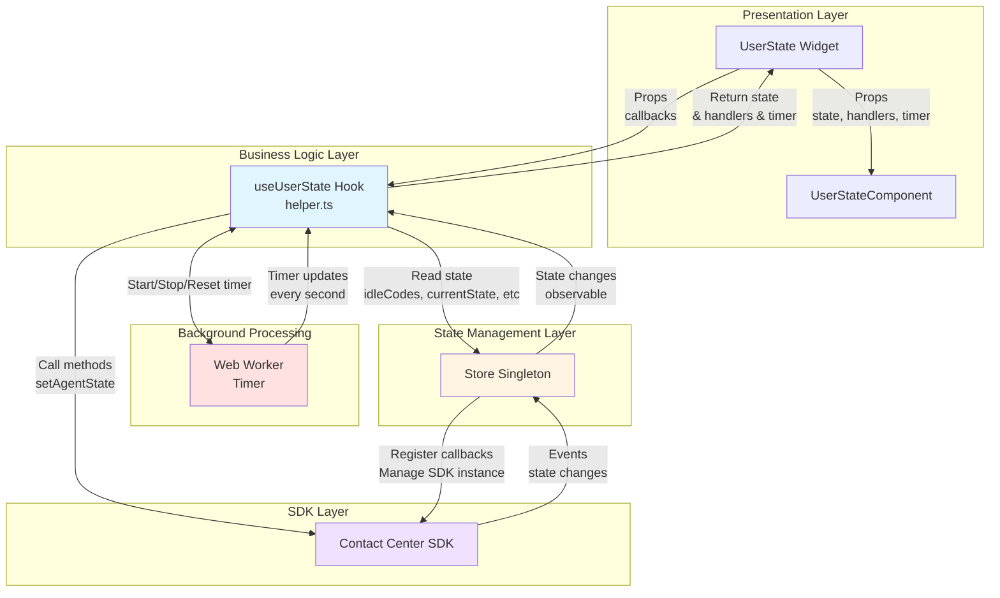
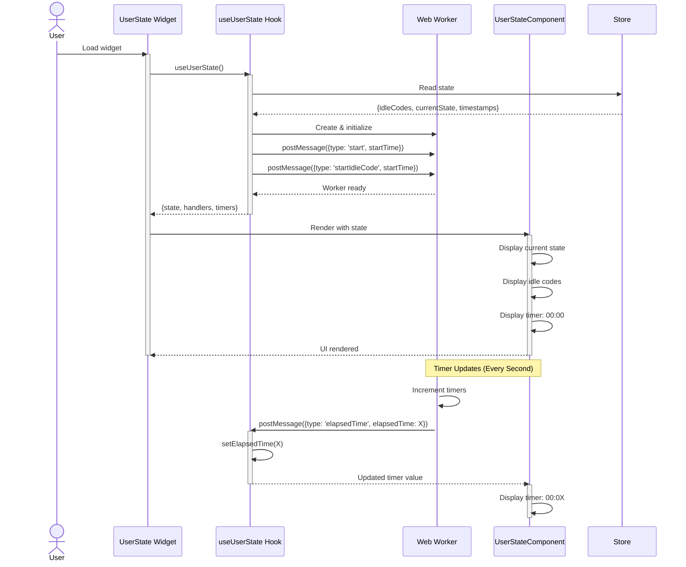
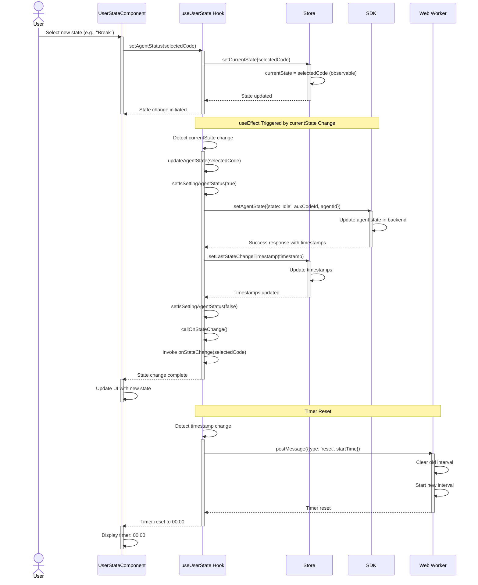
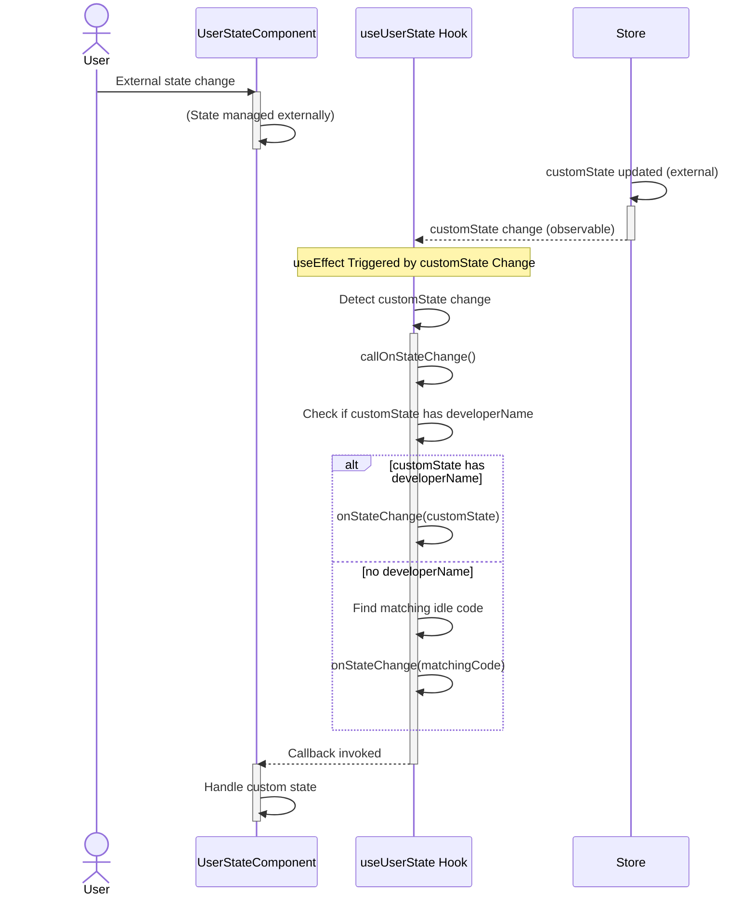
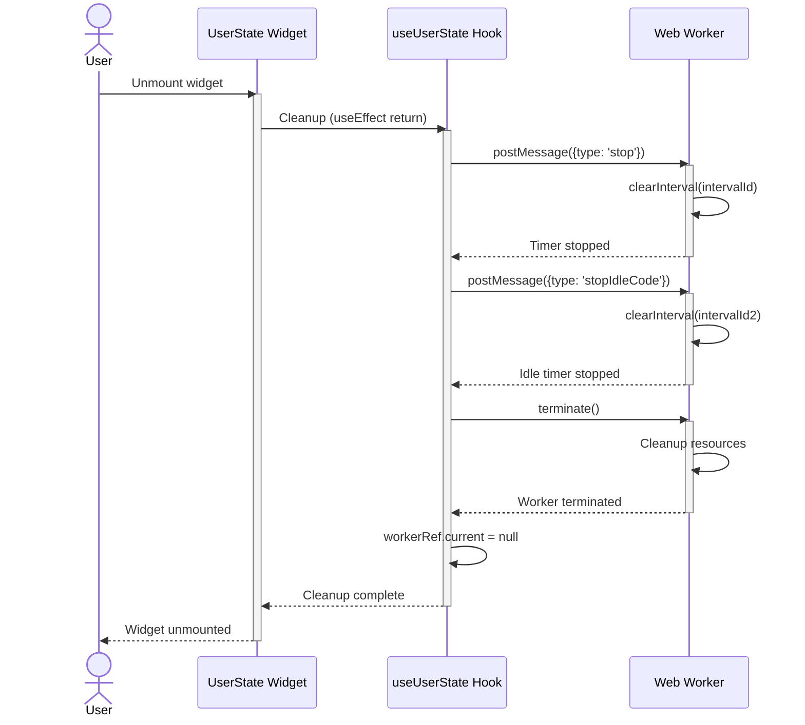

# User State Widget - Architecture

## Component Overview

The User State widget follows the three-layer architecture pattern: **Widget → Hook → Component → Store → SDK**. This architecture separates concerns between state management, business logic, and presentation. The widget uniquely uses a **Web Worker** for accurate timer management.

### Component Table

| Layer | Component | File | Config/Props | State | Callbacks | Events | Tests |
|-------|-----------|------|--------------|-------|-----------|--------|-------|
| **Widget** | `UserState` | `src/user-state/index.tsx` | `IUserStateProps` | N/A (passes through) | `onStateChange` | SDK events (via store) | `tests/user-state/index.tsx` |
| **Widget Internal** | `UserStateInternal` | `src/user-state/index.tsx` | `IUserStateProps` | Observes store | Same as above | Same as above | Same |
| **Hook** | `useUserState` | `src/helper.ts` | `UseUserStateProps` | `isSettingAgentStatus`, `elapsedTime`, `lastIdleStateChangeElapsedTime` | `onStateChange` | Web Worker messages | `tests/helper.ts` |
| **Web Worker** | Timer Worker | `src/helper.ts` (inline) | Worker messages | `intervalId`, `intervalId2` (timers) | N/A | `elapsedTime`, `lastIdleStateChangeElapsedTime` | N/A |
| **Component** | `UserStateComponent` | `@webex/cc-components` | `UserStateComponentsProps` | Internal UI state | Inherited from hook | N/A | `@webex/cc-components` tests |
| **Store** | `Store` (singleton) | `@webex/cc-store` | N/A | `idleCodes`, `agentId`, `currentState`, `lastStateChangeTimestamp`, `lastIdleCodeChangeTimestamp`, `customState` | N/A | Agent state change events | `@webex/cc-store` tests |
| **SDK** | `ContactCenter` | `@webex/contact-center` | N/A | N/A | N/A | State change events | SDK tests |

### SDK Methods & Events Integration

| Component | SDK Methods Used | SDK Events Subscribed | Store Methods Used |
|-----------|------------------|----------------------|-------------------|
| **useUserState Hook** | `setAgentState()` | Agent state change events | `setCurrentState()`, `setLastStateChangeTimestamp()`, `setLastIdleCodeChangeTimestamp()` |
| **Store** | All SDK methods | All SDK events | N/A |
| **Widget** | N/A (via hook) | N/A (via store) | N/A (via hook) |

### File Structure

```
user-state/
├── src/
│   ├── helper.ts                      # useUserState hook + Web Worker
│   ├── index.ts                       # Package exports
│   ├── user-state/
│   │   └── index.tsx                  # Widget component
│   └── user-state.types.ts            # TypeScript types
├── tests/
│   ├── helper.ts                      # Hook tests
│   └── user-state/
│       └── index.tsx                  # Widget tests
├── ai-prompts/
│   ├── agent.md                       # Overview, examples, usage
│   └── architecture.md                # Architecture documentation
├── dist/                              # Build output
├── package.json                       # Dependencies and scripts
├── tsconfig.json                      # TypeScript config
├── webpack.config.js                  # Webpack build config
├── jest.config.js                     # Jest test config
└── eslint.config.mjs                  # ESLint config
```

---

## Data Flows

### Layer Communication Flow

The widget follows a unidirectional data flow pattern across layers with Web Worker integration:



**Hook Responsibilities:**
- Manages timer via Web Worker
- Subscribes to state changes
- Handles state update logic
- Dual timer management
- Error handling

**Web Worker Responsibilities:**
- Background timer execution
- Two independent timers
- State duration timer
- Idle code duration timer

**Store Responsibilities:**
- Observable state
- Idle codes list
- Current state tracking
- Timestamps for timers

### Hook (helper.ts) Details

**File:** `src/helper.ts`

The `useUserState` hook is the core business logic layer that:

1. **Manages Local State:**
   - `isSettingAgentStatus` - Loading indicator during state change
   - `elapsedTime` - Seconds elapsed in current state
   - `lastIdleStateChangeElapsedTime` - Seconds elapsed since idle code change

2. **Web Worker Management:**
   ```typescript
   // Initialize Web Worker with inline script
   const blob = new Blob([workerScript], {type: 'application/javascript'});
   const workerUrl = URL.createObjectURL(blob);
   workerRef.current = new Worker(workerUrl);
   
   // Start both timers
   workerRef.current.postMessage({type: 'start', startTime: Date.now()});
   workerRef.current.postMessage({type: 'startIdleCode', startTime: Date.now()});
   ```

3. **Provides Key Functions:**
   - `setAgentStatus()` - Updates store with new state (UI trigger)
   - `updateAgentState()` - Calls SDK to persist state change (Backend sync)
   - `callOnStateChange()` - Invokes callback with current state

4. **State Change Logic:**
   - UI triggers `setAgentStatus()` → Updates store
   - Store change triggers `useEffect` → Calls `updateAgentState()`
   - `updateAgentState()` → SDK call → Updates timestamps → Timer reset
   - Callback invoked with new state object

5. **Timer Reset Logic:**
   - Resets main timer when `lastStateChangeTimestamp` changes
   - Resets idle code timer when `lastIdleCodeChangeTimestamp` changes
   - Stops idle code timer if timestamp matches state timestamp (Available state)

### Sequence Diagrams

#### 1. Widget Initialization & Timer Start



---

#### 2. State Change Flow



---

#### 3. Custom State Change Flow



---

#### 4. Cleanup & Worker Termination



---

## Troubleshooting Guide

### Common Issues

#### 1. Timer Not Updating

**Symptoms:**
- Timer shows 00:00 and doesn't increment
- Timer freezes after state change

**Possible Causes:**
- Web Worker failed to initialize
- Browser doesn't support Web Workers
- Worker messages not being received

**Solutions:**

```typescript
// Check if Web Worker is supported
if (typeof Worker === 'undefined') {
  console.error('Web Workers not supported in this browser');
}

// Verify worker initialization in console
console.log('Worker ref:', workerRef.current);

// Check worker messages
workerRef.current.onmessage = (event) => {
  console.log('Worker message:', event.data);
};

// Manually trigger timer update for testing
store.setLastStateChangeTimestamp(Date.now());
```

#### 2. State Change Not Persisting

**Symptoms:**
- UI shows new state but reverts back
- SDK call fails silently
- `isSettingAgentStatus` stays true

**Possible Causes:**
- SDK not initialized
- Invalid state or idle code
- Network issues
- Agent not logged in

**Solutions:**

```typescript
// Check SDK instance
console.log('CC instance:', store.cc);

// Verify agent is logged in
console.log('Agent logged in:', store.isAgentLoggedIn);

// Check current state
console.log('Current state:', store.currentState);

// Check idle codes availability
console.log('Idle codes:', store.idleCodes);

// Enable detailed logging
store.logger.setLevel('debug');
```

#### 3. Idle Codes Not Displaying

**Symptoms:**
- Dropdown is empty
- No idle codes available
- Only "Available" shows

**Possible Causes:**
- Idle codes not loaded from backend
- Store not initialized properly
- Configuration issue

**Solutions:**

```typescript
// Check idle codes in store
import store from '@webex/cc-store';
console.log('Idle codes:', store.idleCodes);
console.log('Idle codes count:', store.idleCodes.length);

// Verify store initialization
console.log('Store initialized:', store.cc !== undefined);

// Check agent configuration
console.log('Agent config:', store.cc?.agentConfig);
```

#### 4. Callback Not Firing

**Symptoms:**
- `onStateChange` not called
- No notification on state change
- State changes but app doesn't update

**Possible Causes:**
- Callback not provided
- Callback reference changing
- Error in callback execution

**Solutions:**

```typescript
// Ensure callback is stable
const handleStateChange = useCallback((state) => {
  console.log('State changed:', state);
}, []);

// Wrap in try-catch
const handleStateChange = (state) => {
  try {
    console.log('State changed:', state);
    // Your logic here
  } catch (error) {
    console.error('Error in state change callback:', error);
  }
};

// Verify callback is passed
<UserState onStateChange={handleStateChange} />

// Check if callback is being invoked (add logging in hook)
console.log('Calling onStateChange with:', state);
onStateChange?.(state);
```

#### 5. Memory Leak with Worker

**Symptoms:**
- Browser tab becomes slow over time
- Multiple workers running
- Memory usage increases

**Possible Causes:**
- Worker not terminated on unmount
- Multiple widget instances
- Worker cleanup not executed

**Solutions:**

```typescript
// Verify cleanup on unmount
useEffect(() => {
  // ... worker initialization
  
  return () => {
    console.log('Cleaning up worker');
    if (workerRef.current) {
      workerRef.current.terminate();
      workerRef.current = null;
    }
  };
}, []);

// Check for multiple widget instances
// Only render one UserState widget at a time

// Monitor worker instances in DevTools
// Performance > Memory > Take snapshot
```

#### 6. Dual Timer Mismatch

**Symptoms:**
- State timer and idle code timer show different values
- Timers not in sync
- Idle code timer doesn't stop on Available

**Possible Causes:**
- Timestamps not set correctly
- Worker messages mixed up
- Logic error in timer reset

**Solutions:**

```typescript
// Check timestamps
console.log('State timestamp:', store.lastStateChangeTimestamp);
console.log('Idle code timestamp:', store.lastIdleCodeChangeTimestamp);

// Verify timer values
console.log('Elapsed time:', elapsedTime);
console.log('Idle elapsed time:', lastIdleStateChangeElapsedTime);

// Check if idle timer should be stopped
if (currentState === 'Available') {
  console.log('Idle timer should be stopped');
  // Should show -1 or 0
}
```

---

## Related Documentation

- [Agent Documentation](./agent.md) - Usage examples and props
- [MobX Patterns](../../../../ai-docs/patterns/mobx-patterns.md) - Store patterns
- [React Patterns](../../../../ai-docs/patterns/react-patterns.md) - Component patterns
- [Testing Patterns](../../../../ai-docs/patterns/testing-patterns.md) - Testing guidelines
- [Store Documentation](../../store/ai-prompts/agent.md) - Store API reference

---

_Last Updated: 2025-11-26_

