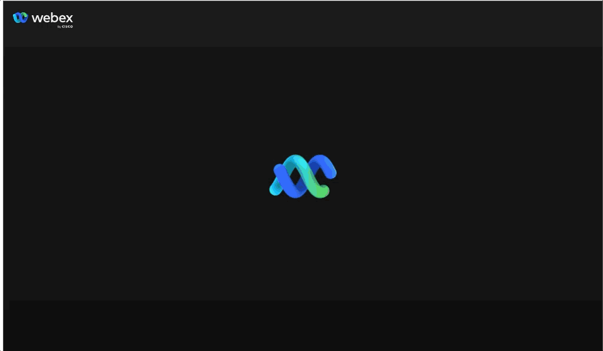
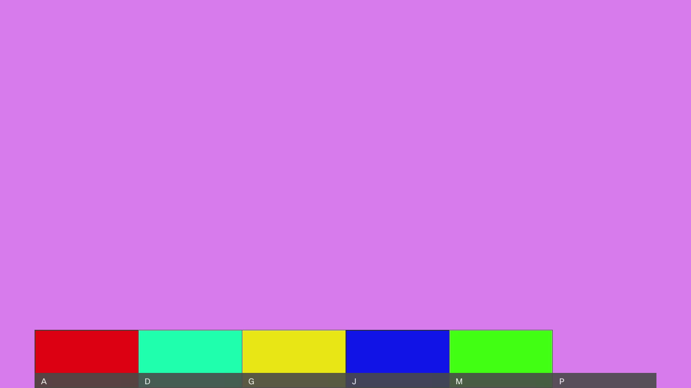
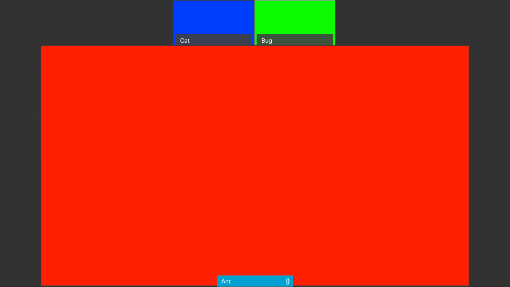
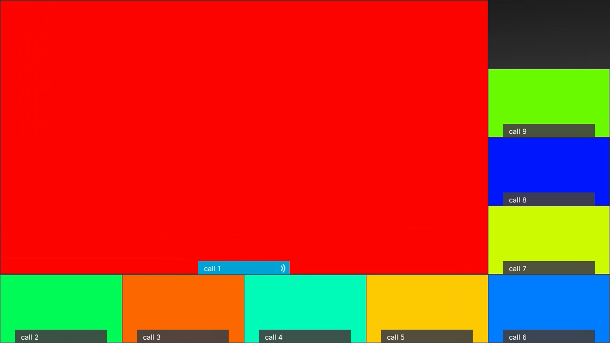
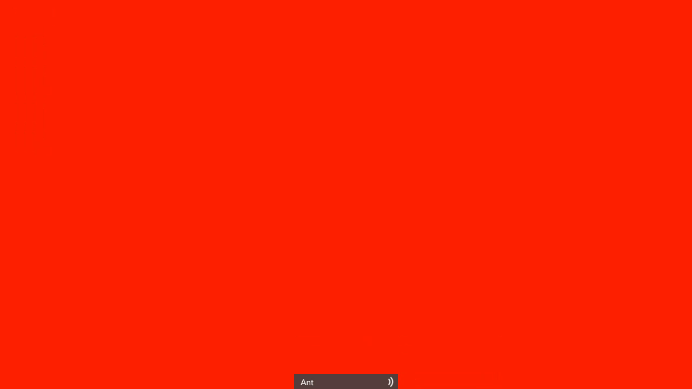

# Webex Meetings Widget

Webex Meetings widget gives developers access to embed the complete [Webex Meetings experience](https://www.webex.com/video-conferencing) right in their web applications.

<p align="center">
  
</p>

## Embed

Import the Meetings widget from the [`@webex/widgets` package](https://www.npmjs.com/package/@webex/widgets) and embed it in your React application.

```js
  <WebexMeetingsWidget
    style={{width: 'XXXX', height: 'YYY'}}
    accessToken="<WEBEX_ACCESS_TOKEN>"
    meetingDestination="<MEETING_DESTINATION>"
  />
```

_That's it_! You now have the Webex Meetings experience in your React application!

Refer to the [widgets main usage section](https://github.com/webex/widgets#usage) for complete instructions.

### Sizing

The Meetings widget is fluid, and therefore it doesn't have a size by default.
Without any extra styling, the widget will attempt to fill up the space with its current content, which may change on different screens.
For a more optimal user experience, set a `width` and `height` that works for your application.

`width` and `height` can be set via `style` or `className` props.

### Access Tokens

See the [Accounts and Authentication](https://developer.webex.com/docs/getting-started#accounts-and-authentication) section of our developer portal for more information on how to obtain access tokens.

### Meeting Destinations

A meeting destination is virtual location where the Webex meeting takes place.
A meeting destination can be accessed via:

* SIP URIs (Webex Meetings, Personal Meeting Rooms and Webex cloud-registered devices only)
* Email address (of a Webex user)
* [People IDs](https://developer.webex.com/docs/api/v1/people)
* [Room IDs](https://developer.webex.com/docs/api/v1/rooms)

### Remote Video Layout

Remove video from participants can be displayed in many different ways.
Developers can choose how remote video displays based on the following layouts:

#### Grid (default)

Grid layout divides remote participants in equal segments, giving visibility to a lot of speakers at the same time.


Use `layout="grid"` as prop value in Meetings widget.

#### Overlay

Overlay layout displays the active speaker prominently, while overlaying other participants in a strip at the bottom.



Use `layout="overlay"` as prop value in Meetings widget.

#### Stack

Stack layout is similar to overlay, but instead of displaying other participants in a strip at the bottom,
non-active speakers are placed on top of the active speaker.
Stacking videos gives full visibility to everyone's video.



Use `layout="stack"` as prop value in Meetings widget.

#### Prominent

Prominent layout gives focus to the active speaker and displays other participants around this participant.



Use `layout="prominent"` as prop value in Meetings widget.

#### Focus

Focus layout gives all visibility to the active speaker.
All other participants are not displayed until they speak, who then would take over as active speaker.



Use `layout="focus"` as prop value in Meetings widget.

### Customize Meeting Controls

Developers can customize the meeting controls used by the Meetings widget.
The Webex Meetings Widget takes an optional function to specify a custom list of controls for a meeting and an optional range to specify which controls can be collapsed if not enough space is available.

The `controls` prop is a function that receives a boolean parameter which is `true` when the meeting is _in-meeting_.
It should return an array of control names (strings) to display on the corresponding state of the meeting (in-meeting or else).
The default control names are:

* When meeting is _in-meeting_:
  * `mute-audio`
  * `mute-video`
  * `share-screen`
  * `member-roster`
  * `settings`
  * `leave-meeting`
* When meeting is _not joined_ (e.g. interstitial section)
  * `mute-audio`
  * `mute-video`
  * `settings`
  * `join-meeting`

To maintain the same controls regardless of meeting state, ignore the boolean parameter passed to your controls function.

These meeting controls come from the [SDK adapter](https://github.com/webex/sdk-component-adapter).

Use `supportedControls()` of the meetings adapter to obtain the names of the implemented controls by the adapter.

The `controlsCollapseRangeStart` is a zero-based index of the **first** collapsible control (can be negative).
The `controlsCollapseRangeEnd` is a zero-based index before the **last** collapsible control (can be negative).
Negative numbers are counted from the end of the controls array.
For example, if the `controlsCollapseRangeEnd` is -2, the last 2 controls won't collapse.

```js
const myControls = (inMeeting) => inMeeting ? ['leave-meeting'] : ['join-meeting'];

<WebexMeetingsWidget
  accessToken="<WEBEX_ACCESS_TOKEN>"
  meetingDestination="<MEETING_DESTINATION>"
  controls={myControls}
  controlsCollapseRangeEnd={-2}
/>
```

## Common Issues

### Mozilla Firefox limitation for accessing more than one microphone at a time

In order to use audio with the Meetings widget, users have to grant access to a microphone, which is then enabled to receive audio input.
<span style="color:red">When</span> switching microphones in a meeting, the Meetings widget will attempt to enable the new microphone requested by the user, while maintaining the current microphone active.
The current microphone needs to be maintained activated while switching, otherwise user will lose all means of transmitting audio while the switch happens.
In Mozilla Firefox, [there is a limitation on the number of microphones that can be active at once](https://bugzilla.mozilla.org/show_bug.cgi?id=1400488).
Because of this limitation, microphone switching is currently <span style="color:red">not</span> possible in Firefox browsers.

### Share screen does not work on some browsers

Due to the use of the getDisplayMedia(), screen sharing is not available on mobile browsers and on Internet Explorer browser.\
It is [available on the following browsers](https://developer.mozilla.org/en-US/docs/Web/API/MediaDevices/getDisplayMedia#browser_compatibility): Chrome (v>=72), Edge (v>=79), Firefox (v>=66), Opera (v>=60), Safari (v>=13).
### Devices with iOS 15.1 page refresh issue

On iOS 15.1, the Meetings widget does not work with permissions granted for the camera (page refreshes after join) due to the fact that this OS version does not support the required video codecs.
